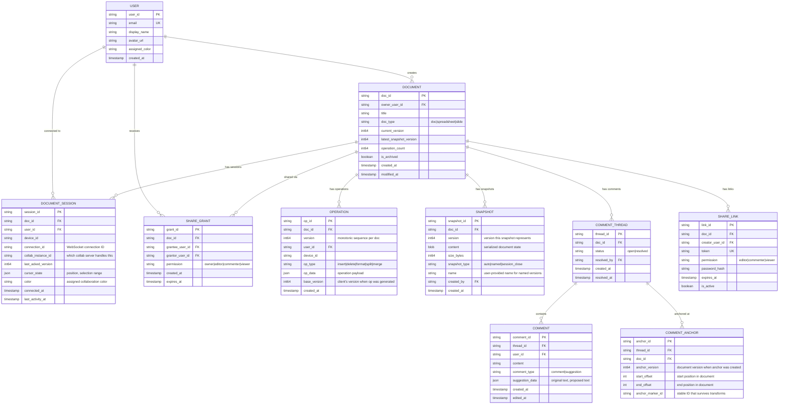
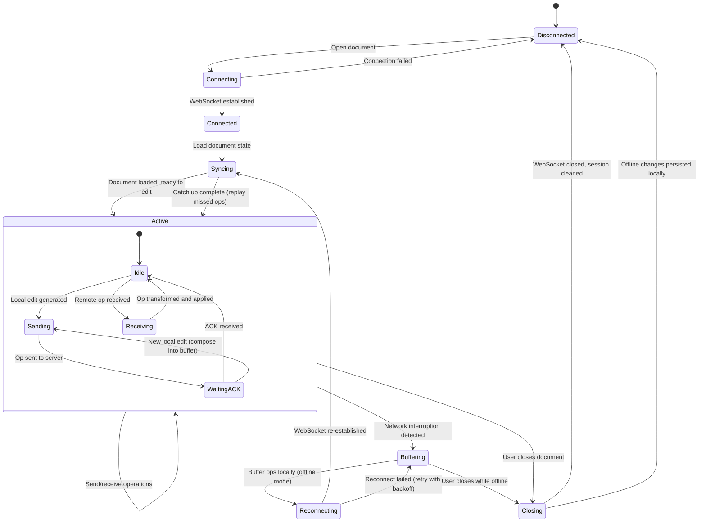
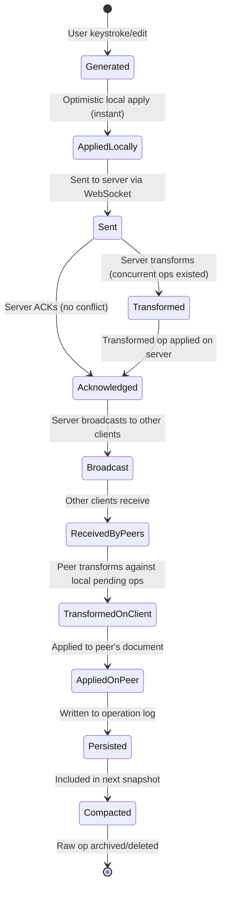

# Low-Level Design

## 1. Data Model

### 1.1 Entity Relationship Diagram



### 1.2 Indexing Strategy

| Table | Index | Type | Purpose |
|-------|-------|------|---------|
| `OPERATION` | `(doc_id, version)` | Unique composite | Replay operations in order |
| `OPERATION` | `(doc_id, created_at)` | Composite | Time-based operation queries |
| `OPERATION` | `(user_id, doc_id, created_at)` | Composite | Per-user operation history (for undo) |
| `SNAPSHOT` | `(doc_id, version)` | Unique composite | Find nearest snapshot for replay |
| `SNAPSHOT` | `(doc_id, snapshot_type, created_at)` | Composite | List named versions |
| `DOCUMENT` | `(owner_user_id)` | B-tree | User's documents list |
| `DOCUMENT` | `(modified_at)` | B-tree | Recently modified documents |
| `DOCUMENT_SESSION` | `(doc_id, user_id)` | Composite | Active sessions per document |
| `DOCUMENT_SESSION` | `(collab_instance_id)` | B-tree | Sessions per server instance |
| `SHARE_GRANT` | `(doc_id, grantee_user_id)` | Unique composite | Permission check |
| `COMMENT_ANCHOR` | `(doc_id, anchor_marker_id)` | Composite | Find comments by position |

### 1.3 Sharding Strategy

| Data | Shard Key | Reasoning |
|------|-----------|-----------|
| **Operations** | `doc_id` | All operations for a document on same shard; enables sequential replay |
| **Snapshots** | `doc_id` | Co-located with operations for fast document loading |
| **Documents** | `doc_id` | Metadata co-located with content references |
| **Sessions** | `collab_instance_id` | Sessions managed by the instance holding them |
| **Users** | `user_id` | User profile lookups |
| **Comments** | `doc_id` | Comments co-located with their document |

### 1.4 Data Retention Policy

| Data Type | Retention | Action |
|-----------|-----------|--------|
| Operations | 90 days after document snapshot | Compacted into snapshot; raw ops archived |
| Snapshots (auto) | Keep latest 5 per document | Older auto-snapshots purged |
| Snapshots (named) | Indefinite | User-created versions preserved |
| Sessions | TTL: 30 minutes after disconnect | Auto-cleaned |
| Comments (resolved) | 1 year | Archived to cold storage |
| Deleted documents | 30 days in trash | Hard delete after retention window |

---

## 2. API Design

### 2.1 API Style

- **REST** for document CRUD, sharing, comments
- **WebSocket** for real-time operations and presence
- **gRPC** for internal service-to-service communication

### 2.2 REST APIs

#### Document Operations

```
# List user's documents
GET /v1/docs
  Query: owner=me|shared, sort=modified_at, cursor?, limit=50
  Response: {documents: [{doc_id, title, owner, modified_at, collaborator_count}], cursor}

# Create document
POST /v1/docs
  Body: {title, template_id?}
  Response: {doc_id, title, version: 0, created_at}

# Get document (for initial load)
GET /v1/docs/{doc_id}
  Response: {
    doc_id, title, content: {serialized_document_state},
    version: 42, permissions: "editor",
    collaborators: [{user_id, display_name, color}]
  }

# Update document metadata
PATCH /v1/docs/{doc_id}
  Body: {title?: "New Title"}
  Response: {doc_id, title, modified_at}

# Delete document (soft)
DELETE /v1/docs/{doc_id}
  Response: {doc_id, deleted_at, restore_deadline}
```

#### Version History

```
# List versions
GET /v1/docs/{doc_id}/versions
  Query: type=named|auto|all, cursor?, limit=20
  Response: {versions: [{version_id, version, name?, created_by, created_at, size}], cursor}

# Get specific version content
GET /v1/docs/{doc_id}/versions/{version}
  Response: {version, content: {serialized_state}, created_by, created_at}

# Create named version
POST /v1/docs/{doc_id}/versions
  Body: {name: "Final Draft v2"}
  Response: {version_id, version: 142, name, created_at}

# Restore to version
POST /v1/docs/{doc_id}/restore
  Body: {target_version: 42}
  Response: {doc_id, new_version: 143, restored_from: 42}
```

#### Comments

```
# Add comment thread
POST /v1/docs/{doc_id}/comments
  Body: {
    content: "Please rephrase this paragraph",
    anchor: {start_offset: 100, end_offset: 150, version: 42}
  }
  Response: {thread_id, comment_id, anchor_marker_id, created_at}

# Reply to thread
POST /v1/docs/{doc_id}/comments/{thread_id}/replies
  Body: {content: "Done, PTAL"}
  Response: {comment_id, created_at}

# Resolve thread
POST /v1/docs/{doc_id}/comments/{thread_id}/resolve
  Response: {thread_id, resolved_by, resolved_at}

# Create suggestion
POST /v1/docs/{doc_id}/suggestions
  Body: {
    anchor: {start_offset: 100, end_offset: 120, version: 42},
    original_text: "the quick fox",
    suggested_text: "the very quick fox"
  }
  Response: {thread_id, suggestion_id, created_at}

# Accept/reject suggestion
POST /v1/docs/{doc_id}/suggestions/{thread_id}/accept
POST /v1/docs/{doc_id}/suggestions/{thread_id}/reject
```

### 2.3 WebSocket Protocol

#### Connection

```
CONNECT wss://collab.example.com/ws/docs/{doc_id}
  Headers: Authorization: Bearer {token}

Server → Client: {
  type: "connected",
  session_id: "sess_abc",
  version: 42,
  color: "#e91e63",
  collaborators: [{user_id, display_name, cursor, color}]
}
```

#### Operation Messages

```
# Client → Server: Send operation
{
  type: "operation",
  op: {
    type: "insert",
    position: 45,
    content: "Hello",
    attributes: {bold: true}  // formatting
  },
  base_version: 42,
  client_seq: 7  // client-local sequence number
}

# Server → Client (sender): Acknowledge
{
  type: "ack",
  client_seq: 7,
  server_version: 43
}

# Server → Client (others): Broadcast operation
{
  type: "remote_op",
  op: {type: "insert", position: 45, content: "Hello", attributes: {bold: true}},
  server_version: 43,
  user_id: "user_alice",
  user_name: "Alice"
}
```

#### Presence Messages

```
# Client → Server: Cursor update
{
  type: "presence",
  cursor: {position: 45, selection: {start: 45, end: 52}},
  timestamp: 1709900000123
}

# Server → Clients: Presence broadcast (batched)
{
  type: "presence_update",
  updates: [
    {user_id: "user_alice", cursor: {position: 45, selection: {start: 45, end: 52}}, color: "#e91e63"},
    {user_id: "user_bob", cursor: {position: 120}, color: "#2196f3"}
  ]
}

# Server → Clients: User joined/left
{type: "user_joined", user_id: "user_carol", display_name: "Carol", color: "#4caf50"}
{type: "user_left", user_id: "user_carol"}
```

### 2.4 Idempotency

| Operation | Idempotency Strategy |
|-----------|---------------------|
| Document creation | Client-generated `Idempotency-Key` header; server deduplicates |
| Edit operations | `(doc_id, user_id, client_seq)` uniquely identifies each operation; server rejects duplicates |
| Comments | `Idempotency-Key` header; prevents double-post on retry |
| Version create | Version number is server-assigned monotonic; retries get same version |
| WebSocket reconnect | Client sends `last_acked_version`; server replays missed operations |

### 2.5 Rate Limiting

| Endpoint / Channel | Limit | Burst |
|--------------------|-------|-------|
| REST API (per user) | 300 req/min | 30 req/s |
| WebSocket operations (per user per doc) | 30 ops/s | 50 ops/s |
| Presence updates (per user) | 20 msg/s | 30 msg/s |
| Comment creation (per user) | 30 req/min | 5 req/s |
| Document creation (per user) | 60 req/hour | 5 req/min |
| Search queries (per user) | 60 req/min | 10 req/s |

---

## 3. Core Algorithms

### 3.1 Operational Transformation (OT)

**Jupiter Protocol (Server-Side OT)**

The server maintains a single linear operation history. Each client operation is transformed against any concurrent server operations before being applied.

```
ALGORITHM ServerOT(incoming_op, server_state)
  INPUT: incoming operation with base_version, current server state
  OUTPUT: transformed operation, new server version

  server_version ← server_state.version
  base_version ← incoming_op.base_version

  IF base_version == server_version:
    // No concurrent ops — apply directly
    transformed_op ← incoming_op
  ELSE:
    // Transform against all operations from base_version to server_version
    concurrent_ops ← GET_OPS(doc_id, FROM: base_version + 1, TO: server_version)
    transformed_op ← incoming_op

    FOR EACH server_op IN concurrent_ops:
      transformed_op ← TRANSFORM(transformed_op, server_op)

  // Apply and persist
  new_version ← server_version + 1
  APPEND_TO_LOG(doc_id, new_version, transformed_op)
  APPLY_TO_STATE(server_state, transformed_op)
  server_state.version ← new_version

  // ACK sender, broadcast to others
  SEND_ACK(incoming_op.client_id, new_version)
  BROADCAST(transformed_op, new_version, excluding=incoming_op.client_id)

  RETURN transformed_op, new_version
```

**Transform Functions for Text:**

```
FUNCTION TRANSFORM(op_a, op_b)
  // Transform op_a assuming op_b has already been applied
  // Returns transformed version of op_a

  MATCH (op_a.type, op_b.type):

    CASE (insert, insert):
      IF op_a.position < op_b.position:
        RETURN op_a  // no change needed
      ELSE IF op_a.position > op_b.position:
        RETURN insert(op_a.content, op_a.position + LENGTH(op_b.content))
      ELSE:  // same position
        // Tie-break by user_id (deterministic ordering)
        IF op_a.user_id < op_b.user_id:
          RETURN op_a  // a goes first
        ELSE:
          RETURN insert(op_a.content, op_a.position + LENGTH(op_b.content))

    CASE (insert, delete):
      IF op_a.position <= op_b.position:
        RETURN op_a  // insert before delete position
      ELSE IF op_a.position > op_b.position + op_b.count:
        RETURN insert(op_a.content, op_a.position - op_b.count)
      ELSE:
        // Insert inside deleted range — place at delete position
        RETURN insert(op_a.content, op_b.position)

    CASE (delete, insert):
      IF op_a.position >= op_b.position + LENGTH(op_b.content):
        // DELETE is after INSERT
        RETURN op_a  // adjust... wait, need to shift
      IF op_a.position + op_a.count <= op_b.position:
        RETURN op_a  // delete entirely before insert
      IF op_a.position >= op_b.position:
        RETURN delete(op_a.position + LENGTH(op_b.content), op_a.count)
      ELSE:
        // Delete range spans the insert point — split delete
        RETURN delete(op_a.position, op_a.count)
        // Note: position unchanged, count unchanged because insert is after start

    CASE (delete, delete):
      IF op_a.position >= op_b.position + op_b.count:
        // a is entirely after b
        RETURN delete(op_a.position - op_b.count, op_a.count)
      ELSE IF op_a.position + op_a.count <= op_b.position:
        // a is entirely before b
        RETURN op_a
      ELSE:
        // Overlapping deletes — compute non-overlapping portion
        overlap_start ← MAX(op_a.position, op_b.position)
        overlap_end ← MIN(op_a.position + op_a.count, op_b.position + op_b.count)
        overlap_count ← overlap_end - overlap_start

        new_position ← MIN(op_a.position, op_b.position)
        IF op_a.position > op_b.position:
          new_position ← op_b.position  // shift left
        new_count ← op_a.count - overlap_count

        IF new_count == 0:
          RETURN NO_OP  // entirely overlapped
        RETURN delete(new_position, new_count)

// Transform complexity: O(1) per pair of operations
// For N concurrent ops: O(N) transforms needed
// N² transform function pairs needed for rich text (insert, delete, format, split, merge, ...)
```

### 3.2 Client-Side OT State Machine

```
ALGORITHM ClientOT()
  // Client maintains three states:
  //   1. confirmed_version: last server-acknowledged version
  //   2. pending_op: sent to server, awaiting ACK (null if none)
  //   3. buffer_op: local ops composed while awaiting ACK

  STATE:
    confirmed_version ← document.version
    pending_op ← NULL
    buffer_op ← NULL

  ON LOCAL_EDIT(op):
    APPLY_LOCALLY(op)  // instant — user sees result immediately

    IF pending_op IS NULL:
      // Nothing in flight — send immediately
      pending_op ← op
      SEND_TO_SERVER(op, base_version=confirmed_version)
    ELSE:
      // Already waiting for ACK — compose into buffer
      IF buffer_op IS NULL:
        buffer_op ← op
      ELSE:
        buffer_op ← COMPOSE(buffer_op, op)  // merge into single op

  ON SERVER_ACK(server_version):
    confirmed_version ← server_version
    pending_op ← NULL

    IF buffer_op IS NOT NULL:
      // Send buffered operations
      pending_op ← buffer_op
      buffer_op ← NULL
      SEND_TO_SERVER(pending_op, base_version=confirmed_version)

  ON REMOTE_OP(server_op, server_version):
    confirmed_version ← server_version

    IF pending_op IS NOT NULL:
      // Transform server op against our pending op
      (server_op', pending_op') ← TRANSFORM_PAIR(server_op, pending_op)
      pending_op ← pending_op'

      IF buffer_op IS NOT NULL:
        (server_op'', buffer_op') ← TRANSFORM_PAIR(server_op', buffer_op)
        buffer_op ← buffer_op'
        APPLY_LOCALLY(server_op'')
      ELSE:
        APPLY_LOCALLY(server_op')
    ELSE:
      APPLY_LOCALLY(server_op)

// Key insight: Client never blocks on server response
// User always sees their edits instantly (optimistic)
// Server operations are transformed to fit around local pending edits
```

### 3.3 Collaborative Undo

```
ALGORITHM CollaborativeUndo(user_id, doc_id)
  // Each user has their own undo stack
  // Undo reverses only the user's own operations

  undo_stack[user_id] ← []
  redo_stack[user_id] ← []

  ON USER_OPERATION(user_id, op):
    inverse ← COMPUTE_INVERSE(op)
    PUSH undo_stack[user_id], {original: op, inverse: inverse, version: current_version}
    CLEAR redo_stack[user_id]  // new edit clears redo

  ON UNDO(user_id):
    IF EMPTY(undo_stack[user_id]):
      RETURN  // nothing to undo

    entry ← POP undo_stack[user_id]

    // Transform inverse op against all operations that happened after it
    subsequent_ops ← GET_OPS(doc_id, FROM: entry.version + 1, TO: current_version)

    transformed_inverse ← entry.inverse
    FOR EACH op IN subsequent_ops:
      transformed_inverse ← TRANSFORM(transformed_inverse, op)

    // Apply the transformed inverse as a new operation
    APPLY(transformed_inverse)
    PUSH redo_stack[user_id], {
      original: transformed_inverse,
      inverse: COMPUTE_INVERSE(transformed_inverse),
      version: current_version
    }

  ON REDO(user_id):
    IF EMPTY(redo_stack[user_id]):
      RETURN

    entry ← POP redo_stack[user_id]
    // Same transform-against-subsequent pattern
    subsequent_ops ← GET_OPS(doc_id, FROM: entry.version + 1, TO: current_version)
    transformed ← entry.inverse
    FOR EACH op IN subsequent_ops:
      transformed ← TRANSFORM(transformed, op)
    APPLY(transformed)
    PUSH undo_stack[user_id], {...}

FUNCTION COMPUTE_INVERSE(op):
  MATCH op.type:
    insert(content, pos) → delete(pos, LENGTH(content))
    delete(pos, count)   → insert(deleted_content, pos)  // must store deleted content
    format(attr, start, end) → format(previous_attr, start, end)
```

### 3.4 Comment Anchor Tracking

Comments are anchored to text ranges that must survive as the document is edited:

```
ALGORITHM TrackCommentAnchor(anchor, operation)
  // Called whenever an operation is applied to update anchor positions

  MATCH operation.type:

    CASE insert(content, pos):
      IF pos <= anchor.start:
        // Insert before anchor — shift both right
        anchor.start ← anchor.start + LENGTH(content)
        anchor.end ← anchor.end + LENGTH(content)
      ELSE IF pos > anchor.start AND pos < anchor.end:
        // Insert inside anchor — expand anchor to include
        anchor.end ← anchor.end + LENGTH(content)
      // ELSE: insert after anchor — no change

    CASE delete(pos, count):
      delete_end ← pos + count

      IF delete_end <= anchor.start:
        // Delete entirely before anchor — shift left
        anchor.start ← anchor.start - count
        anchor.end ← anchor.end - count
      ELSE IF pos >= anchor.end:
        // Delete entirely after anchor — no change
      ELSE IF pos <= anchor.start AND delete_end >= anchor.end:
        // Anchor text entirely deleted — mark as orphaned
        anchor.start ← pos
        anchor.end ← pos
        anchor.status ← "orphaned"
      ELSE IF pos <= anchor.start:
        // Partial overlap from left
        overlap ← delete_end - anchor.start
        anchor.start ← pos
        anchor.end ← anchor.end - count
      ELSE IF delete_end >= anchor.end:
        // Partial overlap from right
        anchor.end ← pos
      ELSE:
        // Delete inside anchor — shrink
        anchor.end ← anchor.end - count

  RETURN anchor

// Anchors are updated on every operation → O(anchors × operations) cost
// Optimization: only update anchors near the edit position
```

---

## 4. State Diagrams

### 4.1 Client Connection State Machine



### 4.2 Operation Lifecycle


