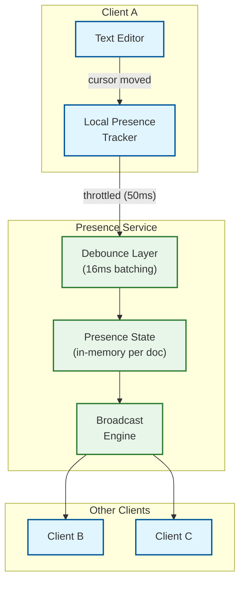

# Deep Dive & Bottlenecks

## 1. Critical Component: OT/CRDT Collaboration Engine

### Why This Is Critical

The collaboration engine is the **defining technical challenge** of the system. It must guarantee that all users see the same document regardless of network latency, operation ordering, or concurrent edits. Getting this wrong means users see corrupted text, lost edits, or divergent documents.

Google built their OT engine based on the Jupiter protocol (1995). CKEditor 5's team spent **over a year** implementing OT for rich text trees, with **several significant reworks**. A former Google Wave engineer wrote: "Unfortunately, implementing OT sucks."

### How It Works Internally

#### Server-Side Document Session Manager

Each document has an in-memory session on exactly one collaboration server instance:

```
┌──────────────────────────────────────────────────────┐
│ Collaboration Server Instance                         │
│                                                       │
│  Document Session: doc_abc123                         │
│  ┌────────────────────────────────────────────────┐   │
│  │ In-Memory State:                                │   │
│  │  • document_content: "Hello world..."          │   │
│  │  • current_version: 4287                       │   │
│  │  • connected_clients: [Alice, Bob, Carol]      │   │
│  │  • pending_transforms: []                      │   │
│  │  • operation_buffer: (last 100 ops for replay) │   │
│  │  • cursor_positions: {Alice: 42, Bob: 100}     │   │
│  └────────────────────────────────────────────────┘   │
│                                                       │
│  Document Session: doc_def456                         │
│  ┌────────────────────────────────────────────────┐   │
│  │ ...                                             │   │
│  └────────────────────────────────────────────────┘   │
│                                                       │
│  Total sessions: ~50,000 per instance                 │
│  Memory per session: ~100KB - 10MB (depends on doc)   │
└──────────────────────────────────────────────────────┘
```

#### Operation Processing Pipeline

```
ALGORITHM ProcessOperation(session, client_op)
  // Single-threaded per document (no concurrency within one document's session)
  // This is the critical section — must be fast

  // 1. Validate
  IF client_op.base_version > session.current_version:
    REJECT("base_version from future")
  IF NOT VALIDATE_SCHEMA(client_op):
    REJECT("malformed operation")

  // 2. Transform against concurrent operations
  gap ← session.current_version - client_op.base_version
  IF gap > 0:
    concurrent_ops ← session.operation_buffer.range(
      client_op.base_version + 1, session.current_version
    )
    transformed_op ← client_op
    FOR EACH server_op IN concurrent_ops:
      transformed_op ← TRANSFORM(transformed_op, server_op)
  ELSE:
    transformed_op ← client_op

  // 3. Apply to in-memory document
  session.current_version ← session.current_version + 1
  APPLY(session.document_content, transformed_op)
  session.operation_buffer.append(transformed_op)

  // 4. Persist to operation log (WAL — must complete before ACK)
  WRITE_WAL(session.doc_id, session.current_version, transformed_op)

  // 5. ACK sender
  SEND(client_op.client_id, {type: "ack", version: session.current_version})

  // 6. Broadcast to other clients
  FOR EACH client IN session.connected_clients:
    IF client.id != client_op.client_id:
      SEND(client.id, {type: "remote_op", op: transformed_op, version: session.current_version})

  // 7. Update comment anchors
  FOR EACH anchor IN session.comment_anchors:
    TrackCommentAnchor(anchor, transformed_op)

  // Target: < 5ms for entire pipeline (single op, no contention)
```

### Why OT Is Hard for Rich Text

For plain text, there are 2 operation types: insert and delete. That's 4 transform function pairs (2²).

For rich text, operation types include: insert, delete, format, split-block, merge-block, set-attribute, move, wrap, unwrap. That's **81+ transform function pairs** (9²), each requiring careful handling of edge cases.

```
Transform function matrix for rich text:

              insert  delete  format  split  merge  set_attr  move  wrap  unwrap
  insert        ✓       ✓       ✓      ✓      ✓       ✓       ✓     ✓      ✓
  delete        ✓       ✓       ✓      ✓      ✓       ✓       ✓     ✓      ✓
  format        ✓       ✓       ✓      ✓      ✓       ✓       ✓     ✓      ✓
  split         ✓       ✓       ✓      ✓      ✓       ✓       ✓     ✓      ✓
  merge         ✓       ✓       ✓      ✓      ✓       ✓       ✓     ✓      ✓
  set_attr      ✓       ✓       ✓      ✓      ✓       ✓       ✓     ✓      ✓
  move          ✓       ✓       ✓      ✓      ✓       ✓       ✓     ✓      ✓
  wrap          ✓       ✓       ✓      ✓      ✓       ✓       ✓     ✓      ✓
  unwrap        ✓       ✓       ✓      ✓      ✓       ✓       ✓     ✓      ✓

Each ✓ = a transform function that must handle all edge cases correctly
Total: 81 functions, each potentially dozens of lines
CKEditor 5: "took over a year with several significant reworks"
```

### Failure Modes

| Failure | Impact | Mitigation |
|---------|--------|------------|
| **Collaboration server crash** | All sessions on that instance lost; in-memory state gone | WAL-based recovery; reconnecting clients replay from last checkpoint |
| **Transform bug** | Document divergence — users see different content | Extensive fuzzing; convergence tests with random operation sequences; server-side reconciliation check |
| **Operation log write failure** | Operation ACKed but not persisted → data loss risk | Never ACK before WAL write completes; synchronous persistence |
| **WebSocket disconnect** | User can't send/receive operations | Client enters offline mode; buffers ops locally; reconnects with exponential backoff |
| **Clock skew** | Incorrect ordering with timestamp-based systems | Use server-assigned monotonic version numbers, never client timestamps |
| **Hot document** (1000+ editors) | Server CPU saturated by transform cascade | Rate limit operations per document; batch operations; consider document partitioning |

### How Failures Are Handled

1. **WAL Recovery**: On crash, the new instance loads the latest snapshot + replays WAL entries to reconstruct the document state. Clients reconnect and the session resumes.
2. **Convergence Verification**: Periodic background check hashes the server's document state and compares with connected clients. If divergence is detected, clients are forced to re-sync from server state.
3. **Fuzzing Infrastructure**: Automated tests generate millions of random concurrent operation sequences and verify convergence properties (TP1, TP2).

---

## 2. Critical Component: Presence System

### Why This Is Critical

Presence (cursor positions, selections, online indicators, user colors) creates the "multiplayer" feeling that makes collaborative editing intuitive. Without it, users constantly overwrite each other because they can't see where others are working.

### How It Works Internally



**Presence is ephemeral** --- it is never persisted to durable storage:

- Stored only in memory on the collaboration server instance
- Lost on disconnect (by design --- stale cursors are worse than missing cursors)
- No durability guarantees; no WAL for presence
- TTL: presence data expires after 10 seconds of inactivity (user stopped moving cursor)

**Bandwidth optimization**:
- Client-side throttle: Send cursor updates at most every 50ms
- Server-side debounce: Batch updates within 16ms window
- Delta encoding: Only send changed fields (position changed, selection didn't? Send only position)
- Dead reckoning: Interpolate cursor movement on receiver side for smooth animation

### Presence After Document Operations

When a remote operation is applied that changes text before a user's cursor, all cursor positions must be adjusted:

```
ALGORITHM AdjustPresenceForOperation(presence_map, operation)
  FOR EACH (user_id, cursor) IN presence_map:
    MATCH operation.type:
      CASE insert(content, pos):
        IF cursor.position >= pos:
          cursor.position ← cursor.position + LENGTH(content)
        IF cursor.selection:
          IF cursor.selection.start >= pos:
            cursor.selection.start += LENGTH(content)
          IF cursor.selection.end >= pos:
            cursor.selection.end += LENGTH(content)

      CASE delete(pos, count):
        IF cursor.position >= pos + count:
          cursor.position ← cursor.position - count
        ELSE IF cursor.position >= pos:
          cursor.position ← pos  // cursor was in deleted range
        // Similar adjustments for selection
```

### Failure Modes

| Failure | Impact | Mitigation |
|---------|--------|------------|
| **Stale cursor** | User appears to be editing where they were 30s ago | TTL-based expiry (10s inactivity → remove cursor) |
| **Color collision** | Two users get same color, can't distinguish | Pre-assigned color palette with guaranteed uniqueness per session |
| **Presence flood** | 1000 users × 20 updates/s = 20K msg/s per document | Client-side throttling + server batching; cap at 50 visible cursors |

---

## 3. Critical Component: Document State Reconstruction

### Why This Is Critical

When a user opens a document, the system must reconstruct the current state from the operation log. For a document with 1 million operations, replaying all of them would take seconds. Snapshots solve this but introduce their own complexity.

### How It Works Internally

```
ALGORITHM LoadDocument(doc_id)
  // Step 1: Find the nearest snapshot
  latest_snapshot ← QUERY snapshots
    WHERE doc_id = doc_id
    ORDER BY version DESC
    LIMIT 1

  IF latest_snapshot IS NULL:
    // No snapshot — replay all operations from the beginning
    document_state ← EMPTY_DOCUMENT()
    start_version ← 0
  ELSE:
    document_state ← DESERIALIZE(latest_snapshot.content)
    start_version ← latest_snapshot.version

  // Step 2: Replay operations since snapshot
  remaining_ops ← QUERY operations
    WHERE doc_id = doc_id
    AND version > start_version
    ORDER BY version ASC

  FOR EACH op IN remaining_ops:
    APPLY(document_state, op)

  // Step 3: Cache the reconstructed state
  CACHE_PUT(doc_id, document_state, TTL=30min)

  RETURN document_state

  // Performance:
  //   Snapshot load: ~50ms (deserialize)
  //   Per-operation replay: ~0.01ms
  //   100 ops since snapshot: ~1ms replay
  //   10,000 ops since snapshot: ~100ms replay (too slow → trigger snapshot)
  //   Target: < 500ms total document load time
```

**Snapshot creation trigger:**

```
ALGORITHM MaybeCreateSnapshot(doc_id, current_version)
  last_snapshot_version ← GET_LAST_SNAPSHOT_VERSION(doc_id)
  ops_since_snapshot ← current_version - last_snapshot_version
  time_since_snapshot ← NOW() - GET_LAST_SNAPSHOT_TIME(doc_id)

  IF ops_since_snapshot >= 100 OR time_since_snapshot >= 5 MINUTES:
    ENQUEUE_SNAPSHOT_JOB(doc_id, current_version)
    // Async — does not block the operation pipeline
```

### Failure Modes

| Failure | Impact | Mitigation |
|---------|--------|------------|
| **Missing operations** (gap in log) | Document state corrupted after replay | Sequence number gap detection; alert + force snapshot from live state |
| **Corrupt snapshot** | Document loads incorrect state | Checksum verification; fall back to previous snapshot + more replays |
| **Snapshot worker backlog** | New users face slow document load (many ops to replay) | Monitor ops-since-snapshot; emergency snapshot trigger at 1000 ops |

---

## 4. Concurrency & Race Conditions

### 4.1 Simultaneous Document Open + Edit

**Scenario**: User A opens a document and starts editing while User B's edit operation is still in transit.

**Solution**: Document load returns the current server version. User A's first operation will have `base_version` = the loaded version. If B's operation was applied between load and A's first edit, the server transforms A's operation correctly.

### 4.2 Permission Revocation During Active Editing

**Scenario**: Admin revokes User B's editor access while B has pending operations in the WebSocket buffer.

```
ALGORITHM HandlePermissionChange(doc_id, user_id, new_permission)
  session ← GET_SESSION(doc_id)

  IF new_permission == "viewer" OR new_permission == "none":
    // Reject any pending operations from this user
    session.reject_ops_from(user_id)
    // Downgrade or disconnect the WebSocket
    SEND(user_id, {type: "permission_changed", new_role: new_permission})
    IF new_permission == "none":
      DISCONNECT(user_id)
```

### 4.3 Snapshot vs Active Editing Race

**Scenario**: Snapshot worker starts capturing state at version 500. While serializing, new operations arrive (v501, v502).

**Solution**: Snapshots are taken from a frozen point-in-time copy (copy-on-write semantics). The snapshot records the exact version it represents. Operations after that version are replayed on top.

### 4.4 Comment Anchor vs Delete Race

**Scenario**: User A comments on text "important data." User B simultaneously deletes that text.

**Solution**: Comment anchor tracking (section 3.4 in low-level design) detects when anchored text is fully deleted and marks the anchor as "orphaned." The comment remains visible in the sidebar but its inline anchor indicator is removed.

---

## 5. Bottleneck Analysis

### Bottleneck #1: Hot Documents (Many Concurrent Editors)

**Problem**: A single document with 500+ concurrent editors creates a processing bottleneck — every keystroke generates an operation that must be transformed and broadcast to 499 other users.

**Metrics**:
- 500 users × 2 ops/s = 1,000 ops/s on single document
- Each op transforms against concurrent ops + broadcasts to 499 clients
- Server CPU: O(concurrent_ops × transform_cost) per operation

**Mitigation**:

| Strategy | Effect |
|----------|--------|
| **Operation batching** | Compose multiple operations from same user into one (type 3 chars → 1 insert("abc") instead of 3 inserts) |
| **Broadcast batching** | Batch multiple operations into single WebSocket frame (16ms window) |
| **Presence throttling** | Cap visible cursors at 50; hide cursors for less recently active users |
| **Document partitioning** | For very large docs: partition into sections, each handled by separate session |
| **View-only auto-downgrade** | Users who haven't edited in 5 min automatically downgraded to viewer (no operation processing) |

### Bottleneck #2: Operation Log Growth

**Problem**: A heavily edited document accumulates millions of operations. Storage grows unboundedly; operation replay becomes slow.

**Metrics**:
- 50 bytes/operation × 1M operations = 50 MB of operation log per document
- Replay time: ~10 seconds for 1M operations (unacceptable for document load)

**Mitigation**:

| Strategy | Effect |
|----------|--------|
| **Periodic snapshots** (every 100 ops) | Bounds replay to at most 100 operations |
| **Operation compaction** | After snapshot, archive raw ops to cold storage; only keep ops since latest snapshot in hot storage |
| **Operation composition** | Compose consecutive same-user operations into single compound operation |
| **TTL-based cleanup** | Delete raw operations older than 90 days (snapshots preserve state) |

### Bottleneck #3: WebSocket Connection Management

**Problem**: 5 million concurrent WebSocket connections require significant memory and connection management overhead.

**Metrics**:
- Each WebSocket: ~10 KB memory for connection state
- 5M connections × 10 KB = 50 GB just for connection overhead
- OS file descriptor limits: ~1M per server (with tuning)
- Need ~5-10 servers just for connection management

**Mitigation**:

| Strategy | Effect |
|----------|--------|
| **Connection multiplexing** | Multiple document sessions share one WebSocket per client |
| **Idle timeout** | Close WebSocket after 30 min inactivity; client reconnects on next edit |
| **Compression** (permessage-deflate) | 30-50% bandwidth reduction for operation messages |
| **Horizontal scaling** | WebSocket gateway layer with consistent hashing (doc_id → server instance) |
| **Long-poll fallback** | For environments that block WebSockets (corporate firewalls) |
