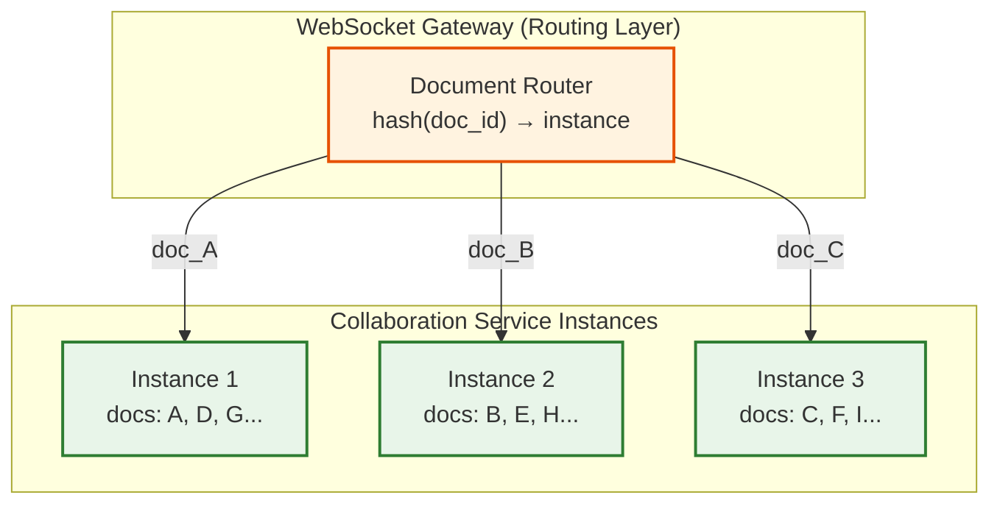
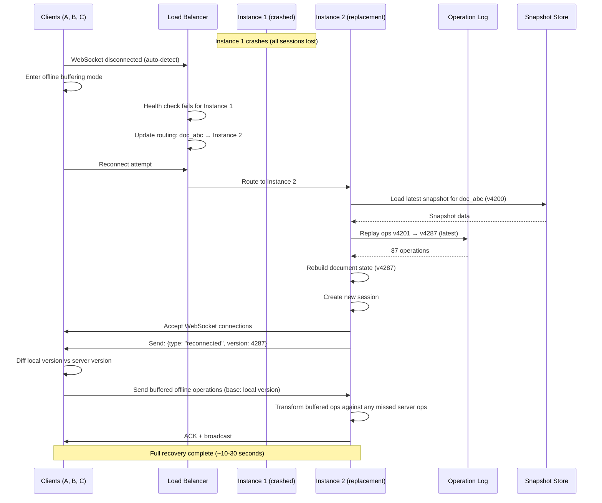

# Scalability & Reliability

## 1. Scalability

### 1.1 Horizontal vs Vertical Scaling

| Component | Scaling Strategy | Justification |
|-----------|-----------------|---------------|
| **WebSocket Gateway** | Horizontal | Stateless connection routing; scale by adding instances |
| **Collaboration Service** | Horizontal (partition by document) | Each document session lives on exactly one instance; scale by adding instances and redistributing documents |
| **Document Service** | Horizontal | Stateless CRUD; scales freely |
| **Presence Service** | Co-located with Collaboration Service | Presence is per-document-session; naturally partitions with collaboration |
| **Operation Log** | Horizontal (partition by doc_id) | Each document's ops on one partition; scale by adding partitions |
| **Document Store** | Horizontal (shard by doc_id) | Independent document reads/writes |
| **Search Index** | Horizontal (index sharding) | Partition by doc_id; replicate for read throughput |
| **Session Store** | Horizontal | In-memory store partitioned by connection |

### 1.2 Document Partitioning: The Core Scaling Strategy

The collaboration service is **stateful** --- each document session must live on exactly one server instance (single-writer model for OT correctness). This is the critical scaling constraint.



**Routing mechanism**: Consistent hashing on `doc_id` determines which collaboration instance handles a document. When instances are added/removed, only a proportional subset of documents need to migrate.

**Session migration** (when instances scale up/down):

```
ALGORITHM MigrateDocumentSession(doc_id, from_instance, to_instance)
  // Step 1: Freeze writes on source
  from_instance.pause_operations(doc_id)

  // Step 2: Serialize session state
  state ← from_instance.serialize_session(doc_id)
  // Includes: document content, version, connected clients, operation buffer

  // Step 3: Transfer to destination
  to_instance.restore_session(doc_id, state)

  // Step 4: Update routing table
  routing_table.update(doc_id, to_instance)

  // Step 5: Redirect connected clients
  FOR EACH client IN state.connected_clients:
    SEND(client, {type: "redirect", new_endpoint: to_instance.endpoint})

  // Step 6: Resume operations
  to_instance.resume_operations(doc_id)

  // Total migration time: ~500ms (brief pause for active editors)
```

### 1.3 Auto-Scaling Triggers

| Component | Metric | Scale-Up Threshold | Scale-Down Threshold | Cooldown |
|-----------|--------|-------------------|---------------------|----------|
| WebSocket Gateway | Connection count | >80K per instance | <20K per instance | 5 min |
| Collaboration Service | Active sessions | >40K per instance | <10K per instance | 10 min |
| Collaboration Service | CPU utilization | >70% | <30% | 5 min |
| Document Service | Request rate | >5K req/s per instance | <1K req/s | 3 min |
| Snapshot Workers | Snapshot queue depth | >10K pending | <1K pending | 5 min |
| Search Indexers | Index lag | >60 seconds behind | <10 seconds | 10 min |

### 1.4 Database Scaling Strategy

#### Operation Log Scaling

| Strategy | Details |
|----------|---------|
| **Partition by doc_id** | All operations for a document on same partition; enables sequential reads |
| **Time-based tiering** | Recent ops (< 7 days) on SSD; older ops on HDD; archived ops in object storage |
| **Compaction** | After snapshot, compact ops into batch entries; keep individual ops for 90 days |
| **Per-partition throughput** | ~10K writes/s per partition (single document rarely exceeds 1K ops/s) |

#### Document Store Scaling

| Strategy | Details |
|----------|---------|
| **Shard by doc_id** | Hash-based distribution across shards |
| **Read replicas** | Serve document loads from replicas; writes to primary |
| **Cache-aside** | Hot documents cached in-memory (document state served from cache on open) |

### 1.5 Caching Layers

```
Layer     │ What's Cached              │ Hit Rate │ TTL       │ Invalidation
──────────┼────────────────────────────┼──────────┼───────────┼──────────────
L1 Client │ Full document state        │ 100%     │ Session   │ On remote ops
L2 Collab │ In-memory session state    │ 100%     │ Session   │ Always current
L3 App    │ Snapshot cache             │ 85%      │ 30 min    │ On new snapshot
L4 CDN    │ Static assets (JS, CSS)    │ 95%      │ 1 year    │ On deploy
```

The collaboration service IS the cache for active documents --- the in-memory session state is always the most current version. No cache invalidation needed because it's the authoritative state.

### 1.6 Hot Spot Mitigation

| Hot Spot Type | Detection | Mitigation |
|---------------|-----------|------------|
| **Viral document** (1000+ concurrent editors) | Connection count per doc exceeds threshold | Operation batching; broadcast batching; auto-downgrade idle users to viewers |
| **Large document** (>5 MB) | Memory usage per session exceeds threshold | Lazy loading (load visible portion first); paginated operations |
| **Collaboration instance overload** | CPU >80% or active sessions >50K | Migrate cold sessions to other instances; add instance |
| **Operation log partition saturation** | Write throughput >10K ops/s | Split partition; batch operations |

---

## 2. Reliability & Fault Tolerance

### 2.1 Single Points of Failure (SPOF)

| Potential SPOF | Mitigation |
|---------------|------------|
| **Collaboration service instance** (holds in-memory sessions) | WAL-based recovery; sessions rebuilt from operation log + snapshots; clients auto-reconnect |
| **Operation log** | Replicated across 3 availability zones; synchronous writes |
| **Document store** | Primary-replica with automatic failover |
| **WebSocket gateway** | Multiple instances; load balancer health checks; client reconnects to healthy instance |
| **Routing table** (doc → instance mapping) | Stored in distributed config store (e.g., etcd/ZooKeeper); replicated |
| **Snapshot worker** | Worker pool with queue; if one dies, others pick up work |

### 2.2 Redundancy Strategy

| Component | Redundancy Model | RPO | RTO |
|-----------|-----------------|-----|-----|
| Operation Log | 3-way synchronous replication | 0 (zero data loss) | <10s (leader election) |
| Document Store | Primary + 2 replicas | <1s | <30s (failover) |
| Collaboration Service | N+2 instances per zone | ~100 ops (WAL replay) | <30s (session rebuild) |
| WebSocket Gateway | N+2 instances | N/A (stateless) | <5s (health check) |
| Snapshot Storage | 3-way replication + cross-region copy | 0 | <1 min |

### 2.3 Failover: Collaboration Service Crash Recovery



### 2.4 Circuit Breaker Patterns

| Service | Circuit Breaker Config | Fallback |
|---------|----------------------|----------|
| Collab → Operation Log | Open after 3 failures in 5s | Buffer ops in memory (risky — data loss if instance also crashes); alert P1 |
| Collab → Snapshot Store | Open after 5 failures in 10s | Skip snapshot creation; increase ops-since-snapshot threshold |
| Client → WebSocket | Open after 3 reconnect failures | Switch to offline mode with local persistence |
| Document Service → Doc Store | Open after 5 failures in 10s | Serve from cache; return cached version with stale indicator |
| Search → Search Index | Open after 5 failures in 10s | Disable search; show "search temporarily unavailable" |

### 2.5 Retry Strategies

| Operation | Strategy | Max Retries | Backoff |
|-----------|----------|-------------|---------|
| WebSocket reconnect | Exponential backoff + jitter | Infinite (with cap) | 1s, 2s, 4s, 8s, 16s, max 60s |
| Operation send | Retry on timeout only | 3 | 500ms, 1s, 2s |
| WAL write | Retry on transient error | 3 | 100ms, 200ms, 500ms |
| Snapshot creation | Retry with fresh state | 2 | 5s, 10s |
| Search index update | At-least-once delivery | Infinite (via queue) | Queue-based retry |

### 2.6 Graceful Degradation

| Failure Scenario | Degraded Behavior |
|-----------------|-------------------|
| **Collaboration service partial outage** | Affected documents become read-only; unaffected docs continue normally |
| **Operation log degraded** | Operations buffered in memory with P1 alert; risk disclosure to users |
| **Snapshot service down** | Editing continues; document loads take longer (more ops to replay) |
| **Presence service degraded** | Cursors stop updating; editing still works |
| **Search index down** | Document editing and browsing continue; search shows "unavailable" |
| **Full datacenter loss** | Cross-region failover; RPO = 0 for operation log; ~30s RTO |

### 2.7 Offline Mode

When the client loses connectivity, it transitions to offline mode:

```
ALGORITHM OfflineMode(client)
  // On disconnect:
  client.state ← OFFLINE
  client.offline_ops ← []

  // Continue editing locally:
  ON LOCAL_EDIT(op):
    APPLY_LOCALLY(op)
    APPEND client.offline_ops, op
    PERSIST_TO_LOCAL_STORAGE(client.offline_ops)

  // On reconnect:
  ON RECONNECT:
    server_version ← GET_SERVER_VERSION(doc_id)

    IF server_version == client.last_known_version:
      // No server changes while offline — just send our ops
      FOR EACH op IN client.offline_ops:
        SEND_TO_SERVER(op, base_version=client.last_known_version)
    ELSE:
      // Server advanced — need to reconcile
      server_ops ← GET_OPS(doc_id, FROM: client.last_known_version + 1, TO: server_version)
      local_ops ← client.offline_ops

      // Transform local ops against server ops (OT reconciliation)
      FOR EACH server_op IN server_ops:
        new_local_ops ← []
        FOR EACH local_op IN local_ops:
          (local_op', server_op') ← TRANSFORM_PAIR(local_op, server_op)
          APPEND new_local_ops, local_op'
          server_op ← server_op'
        local_ops ← new_local_ops
        APPLY_LOCALLY(server_op)  // apply server changes to local doc

      // Send transformed local ops to server
      FOR EACH op IN local_ops:
        SEND_TO_SERVER(op)

    client.offline_ops ← []
    client.state ← ONLINE
```

---

## 3. Disaster Recovery

### 3.1 Recovery Objectives

| Metric | Target | Strategy |
|--------|--------|----------|
| **RTO** | <5 minutes | Automated failover with pre-provisioned standby instances |
| **RPO** | 0 (zero operation loss) | Synchronous operation log replication across zones |
| **MTTR** | <15 minutes | Automated detection + orchestrated recovery |

### 3.2 Backup Strategy

| Data Type | Backup Method | Frequency | Retention | Storage |
|-----------|--------------|-----------|-----------|---------|
| Operation log | Synchronous 3-way replication | Real-time | 90 days (hot), 1 year (cold) | Multi-zone log store |
| Document snapshots | Cross-region async replication | On creation | Latest 5 auto + all named | Object storage |
| Document metadata | Daily snapshots + continuous WAL | Continuous | 30 days | Cross-region SQL replica |
| Search index | Rebuild from operation log | On demand | Disposable (rebuildable) | Ephemeral |
| User data | Daily snapshots | Daily | 30 days | Cross-region backup |

### 3.3 Multi-Region Considerations

```
┌─────────────────────┐         ┌─────────────────────┐
│   Region A (Primary) │         │ Region B (Standby)   │
│                      │         │                      │
│  Collab Instances    │◄───────►│  Cold Standby        │
│  WebSocket Gateways  │  async  │  Instances           │
│  Operation Log (3x)  │  repl   │  Operation Log (3x)  │
│  Doc Store (primary) │────────►│  Doc Store (replica)  │
│  Session Store       │         │  Session Store        │
└─────────────────────┘         └─────────────────────┘

Active-passive: Region B takes over on Region A failure
RPO < 5 seconds (async replication lag)
RTO ~ 5 minutes (promote standby, update DNS)
```

**Why not active-active for collaboration?**

OT requires a **single-writer per document** for operation ordering. Active-active would require:
- Cross-region operation serialization (adding 50-100ms per operation)
- Or CRDT-based architecture (eliminates the central server requirement)

For most use cases, the latency penalty of cross-region OT makes active-passive the pragmatic choice. Users in Region B experience slightly higher latency (cross-region hop) but still below 300ms.
