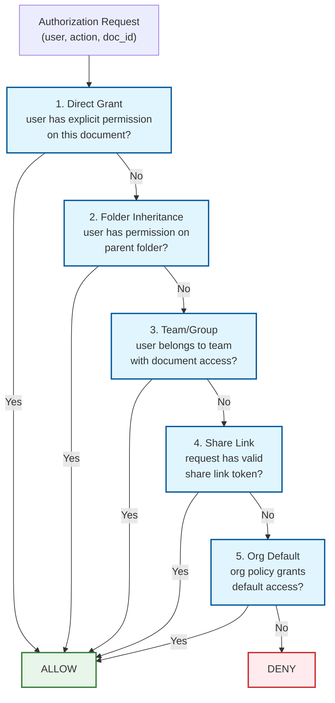

# Security & Compliance

## 1. Authentication & Authorization

### 1.1 Authentication Mechanism

| Method | Use Case | Details |
|--------|----------|---------|
| **OAuth 2.0 + OIDC** | Web and mobile clients | Authorization code flow with PKCE; short-lived access tokens |
| **SSO (SAML 2.0 / OIDC)** | Enterprise customers | Federated identity via corporate IdP |
| **API Keys** | Programmatic access, integrations | Scoped to specific permissions; rotatable |
| **Session Tokens** | WebSocket authentication | JWT-based; validated on WebSocket upgrade; refreshed via REST endpoint |
| **MFA** | All accounts (enforced for enterprise) | TOTP, WebAuthn/FIDO2 |

**WebSocket Authentication Flow:**

```
1. Client authenticates via OAuth → receives access_token (JWT, 1-hour TTL)
2. Client opens WebSocket: wss://collab.example.com/ws/docs/{doc_id}
   Header: Authorization: Bearer {access_token}
3. Server validates JWT signature, expiry, scopes
4. Server checks document permission (user_id, doc_id, required_role: "editor")
5. WebSocket connection established
6. Token refresh: Client sends REST refresh request before token expires;
   server sends new token over existing WebSocket
```

### 1.2 Authorization Model

**Relationship-Based Access Control (ReBAC) + RBAC**



**Permission Levels:**

| Role | View | Comment | Suggest | Edit | Share | Delete | Admin |
|------|------|---------|---------|------|-------|--------|-------|
| **Viewer** | Yes | No | No | No | No | No | No |
| **Commenter** | Yes | Yes | No | No | No | No | No |
| **Suggester** | Yes | Yes | Yes | No | No | No | No |
| **Editor** | Yes | Yes | Yes | Yes | Limited | No | No |
| **Owner** | Yes | Yes | Yes | Yes | Yes | Yes | Yes |

**Real-time Permission Enforcement:**

When permissions change during an active editing session:
- Permission check happens on every operation at the collaboration service
- Downgrade: user's WebSocket receives `{type: "permission_changed", new_role: "viewer"}`; client disables editing UI
- Revocation: WebSocket is closed with reason "access_revoked"; client redirected to error page

### 1.3 Token Management

| Token Type | Lifetime | Storage | Refresh Strategy |
|------------|----------|---------|-----------------|
| Access token (JWT) | 1 hour | Client memory only | Refresh token exchange via REST |
| Refresh token | 30 days | Encrypted in OS keychain | Sliding window; revoked on password change |
| WebSocket session token | Duration of connection | Server memory | Refreshed via in-band token update message |
| Share link token | Until expiry/revocation | URL parameter | Not refreshable; new link = new token |
| API key | Until revoked | Hashed in database | Manual rotation by admin |

---

## 2. Data Security

### 2.1 Encryption at Rest

| Data | Algorithm | Key Management |
|------|-----------|----------------|
| **Document snapshots** | AES-256-GCM | Per-document DEK wrapped by per-tenant KEK; KEKs in HSM |
| **Operation log** | AES-256 (volume-level TDE) | Partition-level encryption; keys in HSM |
| **Metadata database** | AES-256 (transparent data encryption) | Database-managed keys backed by HSM |
| **Search index** | AES-256 | Index-level encryption; per-tenant index isolation |
| **Backups** | AES-256-GCM | Separate backup encryption keys |

### 2.2 Encryption in Transit

| Channel | Protocol | Details |
|---------|----------|---------|
| Client ↔ API Gateway | TLS 1.3 | Certificate pinning on mobile |
| WebSocket (wss://) | TLS 1.3 | Encrypted bidirectional channel |
| Service ↔ Service | mTLS | Mutual authentication with auto-rotated certs |
| Cross-region replication | TLS 1.3 | Dedicated replication channels |

### 2.3 Operation-Level Security

Unlike file storage where you encrypt blobs, collaborative editing has unique security challenges:

| Concern | Mitigation |
|---------|------------|
| **Operation content exposure** | Operations may contain user-typed text; encrypted in transit and at rest; never logged in plaintext |
| **Operation replay attack** | Each operation has a unique `(doc_id, user_id, client_seq)` tuple; server rejects duplicates |
| **Malicious operation injection** | All operations validated against document schema; invalid operations rejected |
| **Buffer overflow via large operation** | Max operation payload: 1 MB; max insert length: 100,000 characters |
| **XSS via document content** | Document content sanitized on render; CSP headers prevent script execution |

### 2.4 PII Handling

| Data Type | Classification | Handling |
|-----------|---------------|----------|
| Document content | User data (may contain PII) | Encrypted at rest; per-tenant isolation; never accessed by staff |
| User email/name | PII | Encrypted at rest; access-logged |
| Operation history | User behavioral data | Shows who typed what and when; anonymized after retention period |
| Cursor positions | Ephemeral | Never persisted; lost on disconnect |
| Comments | User content (may contain PII) | Encrypted at rest; tied to document permissions |
| IP addresses | PII (GDPR) | Retained 90 days; then anonymized |

---

## 3. Threat Model

### 3.1 Top Attack Vectors

| # | Attack Vector | Risk Level | Mitigation |
|---|--------------|------------|------------|
| 1 | **Unauthorized document access** (broken access control) | **Critical** | ReBAC authorization on every operation; WebSocket permission check; permission cache with immediate invalidation on changes |
| 2 | **XSS via document content** | **High** | Content sanitization on render; Content Security Policy (CSP); no inline script execution; DOMPurify for rich text |
| 3 | **Operation injection** (malicious client sends crafted operations) | **High** | Schema validation on every operation; position bounds checking; content length limits |
| 4 | **Session hijacking** (stolen WebSocket token) | **High** | Short-lived JWTs; device binding; anomaly detection (same token from different IPs) |
| 5 | **Denial of service via operation flood** | **Medium** | Per-user rate limiting (30 ops/s); per-document operation cap; auto-downgrade to viewer |
| 6 | **Data exfiltration via API** | **Medium** | Rate limiting on document export; anomalous bulk download detection; audit logging |

### 3.2 Rate Limiting & DDoS Protection

| Layer | Protection | Details |
|-------|-----------|---------|
| **Edge** | DDoS mitigation | Anycast absorption; connection rate limiting |
| **API Gateway** | Per-user REST rate limiting | Token bucket: 300 req/min |
| **WebSocket** | Per-user operation rate limiting | 30 ops/s per user per document |
| **Per-document** | Total operation rate cap | 5,000 ops/s per document (hard cap) |
| **Per-IP** | Connection rate limiting | Max 50 WebSocket connections per IP |

### 3.3 Content Security

Documents can contain user-generated rich text that gets rendered in other users' browsers:

```
ALGORITHM SanitizeOperation(op)
  IF op.type == "insert":
    // Strip dangerous content
    op.content ← REMOVE_SCRIPT_TAGS(op.content)
    op.content ← REMOVE_EVENT_HANDLERS(op.content)
    op.content ← SANITIZE_URLS(op.content)  // only allow http, https, mailto
    op.content ← TRUNCATE(op.content, MAX_INSERT_LENGTH=100000)

  IF op.type == "format":
    // Only allow known safe attributes
    ASSERT op.attribute IN ALLOWED_ATTRIBUTES
    // ALLOWED: bold, italic, underline, strikethrough, color, font,
    //          heading, link, list, align, indent
    // DENIED: style (arbitrary CSS), class, id, data-*

  RETURN op
```

---

## 4. Compliance

### 4.1 GDPR

| Requirement | Implementation |
|-------------|---------------|
| **Right to access** | Export API provides full document + operation history in standard format |
| **Right to erasure** | Account deletion removes all operations by that user; documents owned by user are deleted; contributions to shared docs are anonymized |
| **Data portability** | Export as HTML, DOCX, PDF, or raw JSON (document model) |
| **Data minimization** | Only store necessary metadata; presence data is ephemeral |
| **Breach notification** | Automated detection → 72-hour notification pipeline |
| **Data residency** | EU data processed and stored in EU regions (configurable per tenant) |

### 4.2 SOC 2 Type II

| Trust Principle | Controls |
|----------------|----------|
| **Security** | Encryption, MFA, vulnerability scanning, penetration testing, secure coding practices |
| **Availability** | 99.99% SLA, multi-zone replication, disaster recovery tested quarterly |
| **Confidentiality** | Per-tenant data isolation, encryption, access controls, employee background checks |
| **Processing Integrity** | Operation validation, convergence verification, checksums on snapshots |
| **Privacy** | Privacy policy, consent management, data subject request handling |

### 4.3 HIPAA

| Requirement | Implementation |
|-------------|---------------|
| **BAA** | Business Associate Agreement for enterprise healthcare customers |
| **PHI protection** | Optional E2EE mode; documents containing PHI flagged with sensitivity label |
| **Audit trail** | Complete operation log = immutable audit trail of who edited what and when |
| **Access controls** | RBAC with minimum necessary access; time-limited sharing |

### 4.4 Audit Trail

The operation log naturally forms a **complete, immutable audit trail**:

```
Every operation records:
  - WHO: user_id, device_id
  - WHAT: operation type and payload
  - WHEN: server-assigned timestamp
  - WHERE: document_id, version number
  - CONTEXT: base_version (what state the user was editing from)

This audit trail shows:
  - Every character ever typed in a document
  - Every formatting change
  - Who made each change and when
  - The complete evolution of the document from creation to current state

Retention: 1 year standard; 7 years for compliance-tagged documents
```
