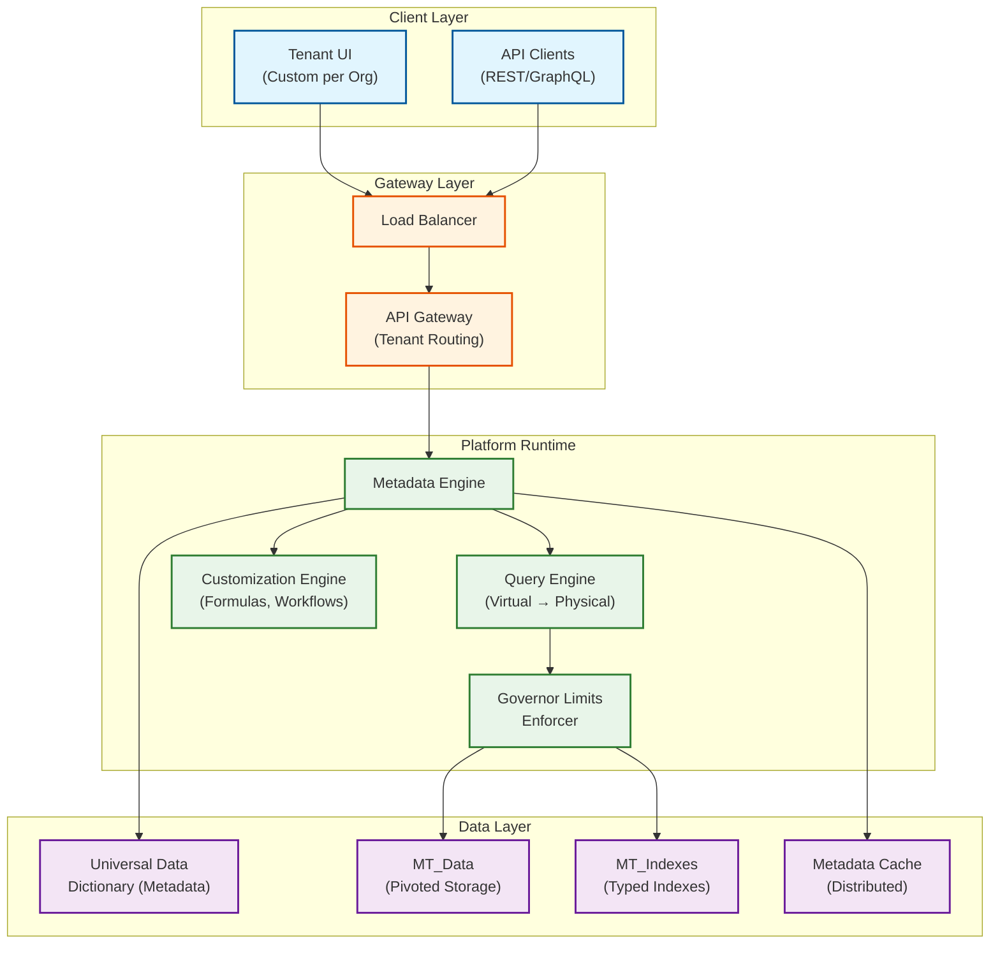

# 6.3 Multi-Tenant SaaS Platform Architecture

## System Overview

A multi-tenant SaaS platform enables a single shared infrastructure to serve thousands of independent customer organizations ("tenants") while guaranteeing data isolation, per-tenant customization, and fair resource sharing. This design covers the Salesforce-style metadata-driven approach where custom objects, fields, workflows, and security rules are all virtual constructs described by metadata -- enabling each tenant to have a fully customized application experience without any physical schema changes. The architecture must balance three competing forces: **tenant isolation** (security and performance guarantees), **resource efficiency** (shared infrastructure economics), and **customization depth** (each tenant feels like they have their own application).

## Key Characteristics

| Characteristic | Classification |
|---------------|---------------|
| Read/Write Profile | Read-heavy (10:1 ratio), with write-heavy bursts during imports/migrations |
| Latency Sensitivity | High -- p99 < 200ms for CRUD, < 500ms for complex queries |
| Consistency Model | Strong consistency within a tenant, eventual for cross-tenant analytics |
| Availability Target | 99.99% (< 52 minutes downtime/year) |
| Data Volume | Petabyte-scale across all tenants, gigabyte to terabyte per large tenant |
| Customization | Metadata-driven -- custom objects, fields, formulas, workflows, validation rules |
| Isolation Guarantee | Org-level: no data leaks, no noisy-neighbor performance degradation |

## Complexity Rating: `Very High`

Multi-tenant SaaS is among the most architecturally complex system designs because it must simultaneously solve: metadata-driven schema virtualization, per-tenant resource isolation, customization engines (formulas, workflows, validation), governor limits enforcement, tenant-aware security at every layer, and horizontal scaling across thousands of heterogeneous workloads.

## Quick Navigation

| Document | Description |
|----------|-------------|
| [01 - Requirements & Estimations](./01-requirements-and-estimations.md) | Functional/non-functional requirements, capacity planning, SLOs |
| [02 - High-Level Design](./02-high-level-design.md) | Architecture diagrams, data flow, key decisions |
| [03 - Low-Level Design](./03-low-level-design.md) | Data model (UDD), API design, algorithms |
| [04 - Deep Dive & Bottlenecks](./04-deep-dive-and-bottlenecks.md) | Metadata engine, governor limits, noisy neighbor |
| [05 - Scalability & Reliability](./05-scalability-and-reliability.md) | Cell architecture, sharding, fault tolerance |
| [06 - Security & Compliance](./06-security-and-compliance.md) | Tenant isolation, encryption, BYOK, sharing model |
| [07 - Observability](./07-observability.md) | Tenant-aware metrics, tracing, alerting |
| [08 - Interview Guide](./08-interview-guide.md) | 45-min pacing, trap questions, trade-offs |

## Architecture at a Glance

## Real-World References

| Company | Approach | Scale |
|---------|----------|-------|
| **Salesforce** | Metadata-driven shared schema (UDD), pivoted data model, governor limits | 150K+ orgs, 13B+ daily interactions, 100+ instances |
| **ServiceNow** | Database-per-tenant on bare metal | 85K databases, 25B queries/hour, 50K instances |
| **Workday** | True multi-tenant with tenant-tagged object model | Single codebase, all tenants on same version |
| **Slack** | Cell-based architecture (AZ-aligned cells) | 99.99% availability target, 5-min failover |

## Key Differentiators from Related Designs

| vs. Design | Key Difference |
|-----------|----------------|
| vs. [3.3 Metadata-Driven Super Framework](../3.3-ai-native-metadata-driven-super-framework/00-index.md) | This focuses on **multi-tenancy infrastructure** (isolation, governor limits, resource sharing); 3.3 focuses on the **metadata engine itself** (custom objects, formula engine, workflow engine) |
| vs. [2.5 IAM System](../2.5-identity-access-management/00-index.md) | This covers **org-level isolation and tenant security model**; 2.5 covers cross-cutting identity and access patterns |
| vs. [1.3 KV Store](../1.3-distributed-key-value-store/00-index.md) | The pivoted data model (UDD) is fundamentally a key-value approach with metadata overlay |
