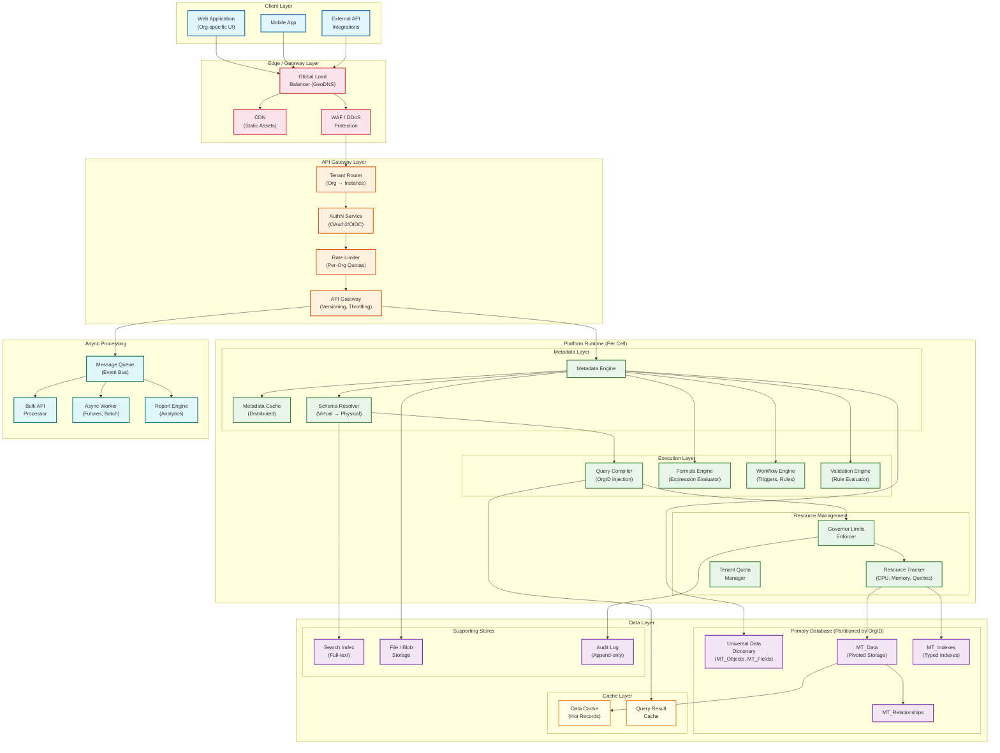
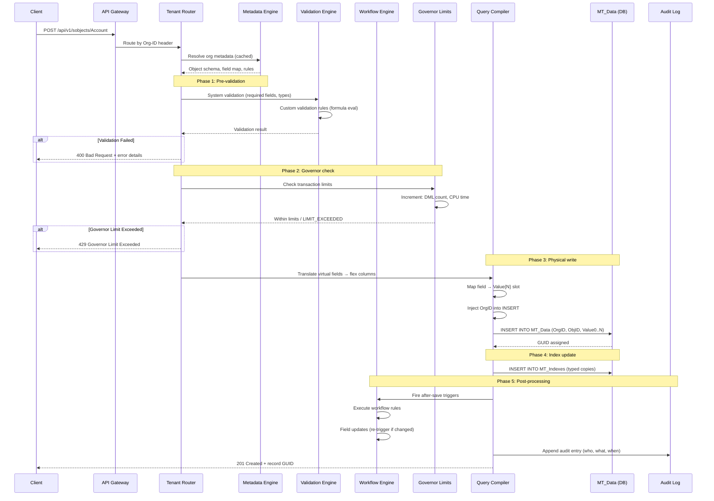
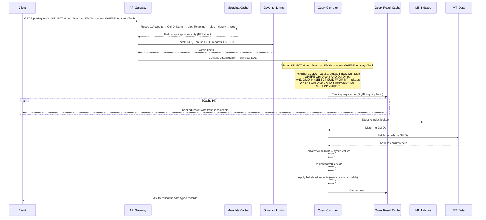
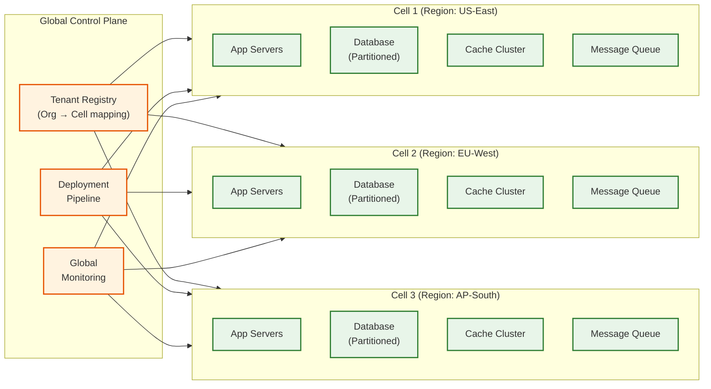

# High-Level Design

## System Architecture

The multi-tenant SaaS platform follows a **layered architecture** with tenant context propagated through every layer. The design uses a **shared-everything** model at the database layer (Salesforce-style pivoted data) combined with **cell-based deployment** at the infrastructure layer for blast radius containment.

---

## Data Flow

### Write Path (Record Create/Update)

### Read Path (Query Execution)

---

## Key Architectural Decisions

### 1. Shared Schema with Metadata Overlay (vs. Schema-per-Tenant)

**Decision:** Single shared physical schema with metadata-driven virtual schema (Salesforce UDD approach)

| Factor | Shared Schema + Metadata | Schema-per-Tenant | Database-per-Tenant |
|--------|--------------------------|--------------------|--------------------|
| **Tenant density** | 8,000+ orgs/instance | ~500 orgs/instance | ~100 orgs/instance |
| **Provisioning time** | Milliseconds (insert metadata rows) | Seconds (DDL operations) | Minutes (full DB spin-up) |
| **Customization depth** | Very high (virtual anything) | Medium (real DDL) | High (full control) |
| **Cross-tenant migration** | Complex (metadata transformation) | Medium (schema export) | Easiest (backup/restore) |
| **Operational complexity** | Low (single DB to manage) | High (N schemas to migrate) | Very high (N DBs) |
| **Noisy neighbor risk** | Higher (mitigated by governor limits) | Medium | Lowest |

**Justification:** At 10,000+ tenants, schema-per-tenant creates unmanageable DDL overhead (migrations across 10K schemas). The metadata approach allows instant provisioning and infinite customization without physical schema changes.

### 2. Cell-Based Deployment Architecture

**Decision:** Deploy the platform in independent **cells**, each containing a complete copy of the application stack (app servers, database, caches, queues).

**Cell design:**
- Each cell serves ~500-2,000 tenant organizations
- Cells are independently deployable, scalable, and upgradeable
- A tenant is assigned to exactly one cell (no cross-cell data)
- Cell routing handled by a global control plane

**Why cells over monolithic shared infrastructure:**
- **Blast radius containment** -- a database failure in Cell-3 affects only Cell-3 tenants
- **Independent scaling** -- cells with "hot" tenants get more resources without affecting others
- **Canary deployments** -- roll new versions to one cell first, verify, then propagate
- **Compliance** -- cells can be deployed in specific regions for data residency

### 3. Synchronous vs. Asynchronous Communication

| Operation | Model | Justification |
|-----------|-------|---------------|
| CRUD operations | **Synchronous** (request-response) | Users expect immediate confirmation |
| Bulk data operations | **Asynchronous** (queue-based) | 10K+ record operations must not block |
| Workflow execution | **Sync for inline**, async for heavy actions | Inline field updates are sync; email/callouts are async |
| Report generation | **Asynchronous** | Complex aggregations can take seconds-minutes |
| Cross-cell events | **Asynchronous** (event bus) | Cells must not have synchronous dependencies |
| Audit logging | **Asynchronous** (fire-and-forget) | Must not add latency to user operations |

### 4. Database Choice: Relational with Pivoted Model

**Decision:** Relational database (PostgreSQL or Oracle) with the pivoted/EAV data model

**Why relational over NoSQL for the data layer:**
- Governor limits require **transaction support** (ACID) for limit enforcement
- Validation rules and workflow triggers need **transactional consistency**
- The typed index tables need **B-tree indexes** for range queries
- Audit trails need **ordered, durable writes**
- 30+ years of proven operational tooling (backups, monitoring, replication)

**Why pivoted model over traditional relational:**
- Adding a "custom field" is an INSERT (metadata row), not an ALTER TABLE
- No schema migrations across thousands of tenants
- Slot reuse enables 500+ fields per object without wide-table penalties
- Trade-off: query performance relies on typed index tables, not native column indexing

### 5. Caching Strategy (Multi-Layer)

| Cache Layer | What | TTL | Invalidation |
|-------------|------|-----|-------------|
| **L1: In-process** | Metadata for current org | Request duration | Per-request |
| **L2: Distributed (Redis)** | Metadata, query results, session | 5-15 min | Transactional invalidation on metadata change |
| **L3: CDN** | Static assets, API docs | 1 hour | Purge on deploy |
| **Query result cache** | Frequently executed queries per org | 30 sec | Invalidated on any write to the object |

**Critical:** Metadata cache invalidation must be **transactional** -- when a tenant adds a custom field, all app servers must see the new field within the metadata sync SLO (< 100ms). This is implemented via a pub/sub notification channel that triggers cache eviction.

### 6. Message Queue Usage

| Use Case | Pattern | Queue Type |
|----------|---------|-----------|
| Bulk API processing | Producer-consumer | Persistent, tenant-partitioned |
| Workflow async actions | Event-driven | Priority queue (per-tenant fairness) |
| Cross-cell notifications | Pub/sub | Topic-based (cell events) |
| Audit log ingestion | Fire-and-forget | High-throughput append |
| Report/analytics jobs | Job queue | Scheduled, priority-based |

---

## Architecture Pattern Checklist

- [x] **Sync vs Async** -- Sync for CRUD, async for bulk/reports/workflows
- [x] **Event-driven vs Request-response** -- Request-response for API, event-driven for internal orchestration
- [x] **Push vs Pull** -- Push for real-time updates (WebSocket per org), pull for reports
- [x] **Stateless vs Stateful** -- App servers are stateless; state lives in DB + cache
- [x] **Read-heavy optimization** -- Query result caching, typed index tables, read replicas
- [x] **Real-time vs Batch** -- Real-time for CRUD, batch for bulk API and analytics
- [x] **Edge vs Origin** -- CDN for static assets, origin for dynamic tenant-specific data
- [x] **Cell-based deployment** -- Independent cells for blast radius containment

---

## Component Interaction Summary

