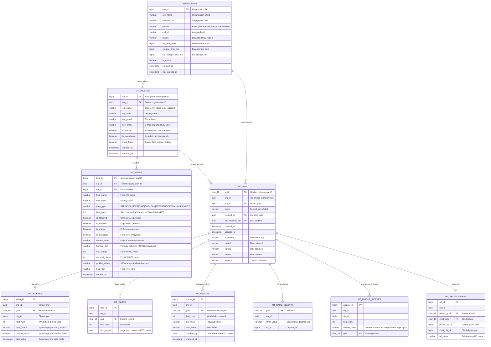
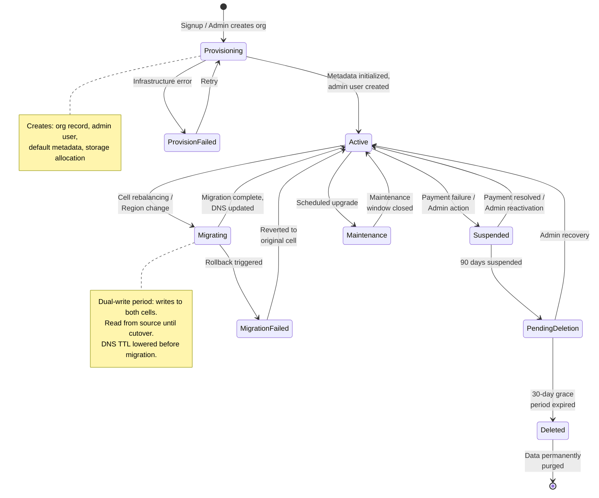

# Low-Level Design

## Data Model: Universal Data Dictionary (UDD)

The heart of the multi-tenant platform is the **Universal Data Dictionary** -- a set of physical tables that store both metadata (schema definitions) and data (actual records) for all tenants using a pivoted/EAV (Entity-Attribute-Value) model.

### Physical Schema (ER Diagram)



### Indexing Strategy

| Table | Index | Type | Purpose |
|-------|-------|------|---------|
| MT_DATA | `(org_id, obj_id, guid)` | Composite B-tree | Primary lookup: all records of an object for an org |
| MT_DATA | `(org_id, obj_id, is_deleted)` | Partial B-tree | Active record filtering |
| MT_DATA | `PARTITION BY HASH(org_id)` | Hash partition (128-1024) | Physical data locality per org |
| MT_INDEXES | `(org_id, obj_id, field_num, string_value)` | Composite B-tree | String field filtering |
| MT_INDEXES | `(org_id, obj_id, field_num, number_value)` | Composite B-tree | Numeric range queries |
| MT_INDEXES | `(org_id, obj_id, field_num, date_value)` | Composite B-tree | Date range queries |
| MT_RELATIONSHIPS | `(org_id, parent_guid, child_obj_id)` | Composite B-tree | "Get all child records" (parent → children) |
| MT_RELATIONSHIPS | `(org_id, child_guid, parent_obj_id)` | Composite B-tree | "Get parent record" (child → parent) |
| MT_UNIQUE_INDEXES | `(org_id, obj_id, field_num, unique_value)` | Unique composite | Uniqueness constraint enforcement |
| MT_OBJECTS | `(org_id, obj_name)` | Unique composite | Object lookup by API name |
| MT_FIELDS | `(org_id, obj_id, field_name)` | Unique composite | Field lookup by API name |
| MT_HISTORY | `(org_id, guid, changed_at DESC)` | Composite B-tree | Recent changes for a record |

### Partitioning Strategy

**Primary partition key:** `org_id` (hash partitioning)

```
Database Instance
├── Partition 0:  org_id HASH MOD 128 = 0  (orgs: acme, widgetco, ...)
├── Partition 1:  org_id HASH MOD 128 = 1  (orgs: foocorp, barltd, ...)
├── ...
└── Partition 127: org_id HASH MOD 128 = 127
```

**Benefits:**
- All data for a single org is co-located in the same partition → cache locality
- Queries always include `org_id` → partition pruning eliminates 127/128 partitions
- Large orgs can be re-balanced by splitting partitions

### Data Retention Policy

| Data Type | Retention | Strategy |
|-----------|-----------|----------|
| Active records | Indefinite | Soft-delete with `is_deleted` flag |
| Soft-deleted records | 15 days in recycle bin | Hard-delete via background job |
| Field history | 18 months | Archive to cold storage, then purge |
| Audit trail | 10 years (compliance) | Append-only, immutable, compressed |
| API logs | 30 days | Rolling window with aggregation |
| Query result cache | 30 seconds | Auto-evict on write |

---

## API Design

### REST API

**Base URL:** `https://{instance}.platform.example.com/api/v{version}`

**Authentication:** OAuth 2.0 Bearer Token (JWT) with org_id claim

#### Core CRUD Endpoints

```
# Describe metadata for an object
GET /api/v1/sobjects/{objectName}/describe
Response: { fields: [...], relationships: [...], recordTypeInfos: [...] }

# Create a record
POST /api/v1/sobjects/{objectName}
Headers: Authorization: Bearer {token}
Body: { "Name": "Acme Corp", "Industry": "Technology", "Revenue": 5000000 }
Response: 201 { "id": "001xx00000ABC123", "success": true }

# Read a record
GET /api/v1/sobjects/{objectName}/{recordId}
Response: 200 { "Id": "001xx00000ABC123", "Name": "Acme Corp", ... }

# Update a record
PATCH /api/v1/sobjects/{objectName}/{recordId}
Body: { "Revenue": 6000000 }
Response: 204 No Content

# Delete a record (soft delete)
DELETE /api/v1/sobjects/{objectName}/{recordId}
Response: 204 No Content

# Query (virtual SQL)
GET /api/v1/query?q=SELECT+Name,Revenue+FROM+Account+WHERE+Industry='Tech'+LIMIT+100
Response: 200 { "totalSize": 42, "done": true, "records": [...] }

# Bulk API (create job)
POST /api/v1/jobs/ingest
Body: { "object": "Account", "operation": "insert", "contentType": "CSV" }
Response: 201 { "id": "750xx000000XYZABC", "state": "Open" }

# Bulk API (upload data)
PUT /api/v1/jobs/ingest/{jobId}/batches
Content-Type: text/csv
Body: Name,Industry\nAcme,Tech\nWidget,Manufacturing

# Bulk API (close job)
PATCH /api/v1/jobs/ingest/{jobId}
Body: { "state": "UploadComplete" }
```

#### Metadata API

```
# List custom objects for the org
GET /api/v1/metadata/sobjects
Response: 200 { "objects": [{ "name": "Account", "custom": false }, ...] }

# Create a custom object
POST /api/v1/metadata/sobjects
Body: { "name": "Invoice__c", "label": "Invoice", "pluralLabel": "Invoices" }

# Add a custom field
POST /api/v1/metadata/sobjects/{objectName}/fields
Body: { "name": "Amount__c", "label": "Amount", "type": "NUMBER", "decimalPlaces": 2 }

# Deploy validation rule
POST /api/v1/metadata/sobjects/{objectName}/validationRules
Body: { "name": "Amount_Positive", "formula": "Amount__c < 0", "errorMessage": "Amount must be positive" }
```

### Request/Response Format

**Standard envelope:**

```
{
  "data": { ... },           // Primary response payload
  "meta": {
    "requestId": "req-abc123",
    "orgId": "00Dxx0000001234",
    "apiVersion": "v1",
    "governorUsage": {
      "queriesUsed": 3,
      "queriesRemaining": 97,
      "dmlUsed": 1,
      "dmlRemaining": 149,
      "cpuTimeMs": 45
    }
  },
  "errors": []               // Error array (if any)
}
```

### Idempotency Handling

| Method | Idempotent? | Strategy |
|--------|-------------|----------|
| GET | Yes (naturally) | Cacheable |
| POST (create) | No → Made idempotent via `Idempotency-Key` header | Server stores key → result mapping for 24 hours |
| PATCH (update) | Yes (naturally) | Last-write-wins with optimistic locking (`If-Match` ETag) |
| DELETE | Yes (naturally) | Soft-delete is idempotent (already deleted = 204) |
| Bulk API | No → Job ID serves as idempotency key | Job state machine prevents re-processing |

### Rate Limiting Per Endpoint

| Endpoint Category | Rate Limit | Window |
|-------------------|-----------|--------|
| CRUD (single record) | 100 req/sec per org | Sliding window |
| Query | 25 req/sec per org | Sliding window |
| Bulk API jobs | 15,000 batches per 24h | Rolling |
| Metadata API | 10 req/sec per org | Sliding window |
| Describe | 50 req/sec per org | Sliding window |
| Login/OAuth | 5 req/sec per user | Fixed window |

### Versioning Strategy

- URL-based versioning: `/api/v1/`, `/api/v2/`
- Minimum 3-version backward compatibility window
- Deprecated versions return `Sunset` header with retirement date
- Breaking changes only in major versions; additive changes (new fields, new endpoints) are non-breaking

---

## Core Algorithms

### 1. Virtual-to-Physical Query Compilation

The query compiler translates tenant virtual queries (using custom object/field names) into physical SQL against the pivoted data model.

**Pseudocode:**

```
FUNCTION compile_query(virtual_query, org_id):
    // Step 1: Parse the virtual query into AST
    ast = parse(virtual_query)  // e.g., SELECT Name, Revenue FROM Account WHERE Industry = 'Tech'

    // Step 2: Resolve object metadata
    obj_meta = metadata_cache.get(org_id, ast.from_object)
    IF obj_meta IS NULL:
        obj_meta = query_mt_objects(org_id, ast.from_object)
        metadata_cache.set(org_id, ast.from_object, obj_meta)

    // Step 3: Resolve field metadata for each referenced field
    select_mappings = []
    FOR EACH field_ref IN ast.select_fields:
        field_meta = metadata_cache.get(org_id, obj_meta.obj_id, field_ref)
        IF field_meta.data_type == "FORMULA":
            // Formula fields: expand inline (recursive resolution)
            formula_expr = compile_formula(field_meta.formula_def, org_id, obj_meta)
            select_mappings.APPEND(formula_expr AS field_ref)
        ELSE:
            select_mappings.APPEND("Value" + field_meta.field_num AS field_ref)

    // Step 4: Compile WHERE clause with index awareness
    where_sql = ""
    index_joins = []
    FOR EACH condition IN ast.where_conditions:
        field_meta = resolve_field(org_id, obj_meta.obj_id, condition.field)
        IF field_meta.is_indexed:
            // Use MT_Indexes for indexed fields (typed columns enable native comparison)
            typed_column = get_typed_column(field_meta.data_type)  // string_value, number_value, date_value
            index_joins.APPEND(
                "INNER JOIN MT_Indexes idx_{N} ON idx_{N}.guid = d.guid "
                + "AND idx_{N}.org_id = :org_id "
                + "AND idx_{N}.field_num = {field_meta.field_num} "
                + "AND idx_{N}.{typed_column} {condition.operator} :param_{N}"
            )
        ELSE:
            // Non-indexed: filter on flex column (full scan within partition)
            where_sql += "AND d.Value{field_meta.field_num} {condition.operator} :param_{N} "

    // Step 5: Assemble physical SQL (OrgID always injected)
    physical_sql = "SELECT {select_mappings} "
                 + "FROM MT_Data d "
                 + "{index_joins} "
                 + "WHERE d.org_id = :org_id "
                 + "AND d.obj_id = :obj_id "
                 + "AND d.is_deleted = FALSE "
                 + where_sql
                 + compile_order_by(ast.order_by)
                 + " LIMIT :limit"

    RETURN physical_sql

// Time Complexity: O(F) where F = number of fields/conditions referenced
// Space Complexity: O(F) for mappings and join clauses
```

### 2. Governor Limits Enforcement

Governor limits are enforced per-transaction using a **thread-local counter** that tracks resource consumption.

**Pseudocode:**

```
CLASS GovernorContext:
    // Initialized per request/transaction
    query_count = 0
    query_count_limit = 100  // sync: 100, async: 200
    records_retrieved = 0
    records_limit = 50000
    dml_count = 0
    dml_limit = 150
    cpu_start_time = NOW()
    cpu_limit_ms = 10000  // sync: 10s, async: 60s
    heap_used = 0
    heap_limit = 6 * 1024 * 1024  // 6 MB sync, 12 MB async
    callout_count = 0
    callout_limit = 100

FUNCTION check_query_limit(governor_ctx):
    governor_ctx.query_count += 1
    IF governor_ctx.query_count > governor_ctx.query_count_limit:
        ABORT_TRANSACTION("GOVERNOR_LIMIT: Too many SOQL queries: "
            + governor_ctx.query_count + " (limit: " + governor_ctx.query_count_limit + ")")

FUNCTION check_records_limit(governor_ctx, records_fetched):
    governor_ctx.records_retrieved += records_fetched
    IF governor_ctx.records_retrieved > governor_ctx.records_limit:
        ABORT_TRANSACTION("GOVERNOR_LIMIT: Too many records: "
            + governor_ctx.records_retrieved + " (limit: " + governor_ctx.records_limit + ")")

FUNCTION check_cpu_limit(governor_ctx):
    elapsed = NOW() - governor_ctx.cpu_start_time
    IF elapsed > governor_ctx.cpu_limit_ms:
        ABORT_TRANSACTION("GOVERNOR_LIMIT: CPU time exceeded: "
            + elapsed + "ms (limit: " + governor_ctx.cpu_limit_ms + "ms)")

FUNCTION check_dml_limit(governor_ctx):
    governor_ctx.dml_count += 1
    IF governor_ctx.dml_count > governor_ctx.dml_limit:
        ABORT_TRANSACTION("GOVERNOR_LIMIT: Too many DML statements: "
            + governor_ctx.dml_count + " (limit: " + governor_ctx.dml_limit + ")")

// Called at every resource-consuming operation
FUNCTION enforce_governor(governor_ctx, operation_type, params):
    SWITCH operation_type:
        CASE "QUERY":
            check_query_limit(governor_ctx)
        CASE "QUERY_RESULT":
            check_records_limit(governor_ctx, params.record_count)
        CASE "DML":
            check_dml_limit(governor_ctx)
        CASE "CALLOUT":
            governor_ctx.callout_count += 1
            IF governor_ctx.callout_count > governor_ctx.callout_limit:
                ABORT_TRANSACTION("GOVERNOR_LIMIT: Too many callouts")
        CASE "CPU_CHECK":
            check_cpu_limit(governor_ctx)

    // Periodic CPU check (every 10 operations)
    IF (governor_ctx.query_count + governor_ctx.dml_count) MOD 10 == 0:
        check_cpu_limit(governor_ctx)

// Time Complexity: O(1) per check
// Space Complexity: O(1) per transaction context
```

### 3. Metadata Cache Invalidation Protocol

When a tenant modifies metadata (adds a field, changes a validation rule), all application servers must invalidate their cached copy.

**Pseudocode:**

```
FUNCTION handle_metadata_change(org_id, change_type, object_name, change_details):
    // Step 1: Persist metadata change to database (transactional)
    BEGIN TRANSACTION
        SWITCH change_type:
            CASE "ADD_FIELD":
                INSERT INTO MT_Fields (org_id, obj_id, field_name, ...) VALUES (...)
            CASE "ADD_OBJECT":
                INSERT INTO MT_Objects (org_id, obj_name, ...) VALUES (...)
            CASE "UPDATE_RULE":
                UPDATE validation_rules SET ... WHERE org_id = :org_id AND ...

        // Step 2: Increment metadata version for this org
        UPDATE tenant_orgs SET metadata_version = metadata_version + 1
            WHERE org_id = :org_id
        new_version = SELECT metadata_version FROM tenant_orgs WHERE org_id = :org_id
    COMMIT TRANSACTION

    // Step 3: Broadcast invalidation event
    publish_to_channel("metadata_invalidation", {
        org_id: org_id,
        version: new_version,
        change_type: change_type,
        object_name: object_name,
        timestamp: NOW()
    })

// On each app server (subscriber):
FUNCTION on_metadata_invalidation(event):
    cached_version = local_cache.get_version(event.org_id)
    IF cached_version < event.version:
        // Surgical invalidation (not full cache flush)
        SWITCH event.change_type:
            CASE "ADD_FIELD", "MODIFY_FIELD", "DELETE_FIELD":
                local_cache.invalidate(event.org_id, event.object_name, "fields")
            CASE "ADD_OBJECT", "DELETE_OBJECT":
                local_cache.invalidate(event.org_id, event.object_name)
            CASE "UPDATE_RULE":
                local_cache.invalidate(event.org_id, event.object_name, "rules")

        local_cache.set_version(event.org_id, event.version)

    // Lazy reload: next request for this metadata triggers a DB fetch and re-cache
```

### 4. Polymorphic ID Generation

Each record gets an 18-character ID where the first 3 characters encode the object type.

**Pseudocode:**

```
FUNCTION generate_record_id(org_id, obj_id):
    // Step 1: Get the 3-character key prefix for this object type
    key_prefix = metadata_cache.get_key_prefix(org_id, obj_id)
    // e.g., "001" for Account, "003" for Contact, "a0B" for custom objects

    // Step 2: Generate 12-character unique sequence
    // Using a distributed sequence generator (Snowflake-style)
    sequence = distributed_id_generator.next()
    // Encode as base-62: [0-9a-zA-Z]
    encoded_sequence = base62_encode(sequence, pad_to=12)

    // Step 3: Compute 3-character case-insensitive checksum
    // Ensures the 18-char ID works in case-insensitive contexts
    fifteen_char_id = key_prefix + encoded_sequence  // 15 chars
    checksum = compute_case_checksum(fifteen_char_id)  // 3 chars

    RETURN fifteen_char_id + checksum  // 18 chars total

FUNCTION compute_case_checksum(fifteen_chars):
    // For each group of 5 characters, compute a bitmap of which are uppercase
    // Map the bitmap to a base-32 character
    checksum = ""
    FOR i IN [0, 5, 10]:
        bitmap = 0
        FOR j IN [0, 1, 2, 3, 4]:
            IF fifteen_chars[i + j] IS UPPERCASE:
                bitmap = bitmap OR (1 << j)
        checksum += BASE32_CHARS[bitmap]
    RETURN checksum

// Time Complexity: O(1) - fixed-length operations
// Space Complexity: O(1)
```

### 5. Tenant Routing Algorithm

The global tenant router maps incoming requests to the correct cell and instance.

**Pseudocode:**

```
// Tenant registry (global, replicated across edge locations)
STRUCTURE TenantRoute:
    org_id: UUID
    cell_id: STRING          // "cell-us-east-1a"
    instance_url: STRING     // "na42.example.com"
    status: ENUM(ACTIVE, SUSPENDED, MIGRATING, MAINTENANCE)
    failover_cell: STRING    // "cell-us-east-1b"

FUNCTION route_request(request):
    // Step 1: Extract org_id from request
    org_id = extract_org_id(request)
    // Sources: JWT claim, X-Org-ID header, subdomain, session

    // Step 2: Lookup tenant route (cached at edge with 60s TTL)
    route = tenant_route_cache.get(org_id)
    IF route IS NULL:
        route = tenant_registry_db.get(org_id)
        IF route IS NULL:
            RETURN 404 "Organization not found"
        tenant_route_cache.set(org_id, route, ttl=60s)

    // Step 3: Check tenant status
    SWITCH route.status:
        CASE SUSPENDED:
            RETURN 403 "Organization suspended"
        CASE MIGRATING:
            // During migration, route to migration proxy
            RETURN redirect_to_migration_proxy(route, request)
        CASE MAINTENANCE:
            RETURN 503 "Organization under maintenance"

    // Step 4: Route to the correct cell
    target_url = "https://" + route.instance_url + request.path
    response = forward_request(target_url, request, timeout=30s)

    IF response.status >= 500:
        // Failover to secondary cell
        IF route.failover_cell IS NOT NULL:
            failover_url = resolve_cell_url(route.failover_cell)
            response = forward_request(failover_url + request.path, request, timeout=30s)

    RETURN response

// Time Complexity: O(1) for routing decision
// Space Complexity: O(T) where T = number of tenants in cache
```

---

## State Machine: Tenant Lifecycle


