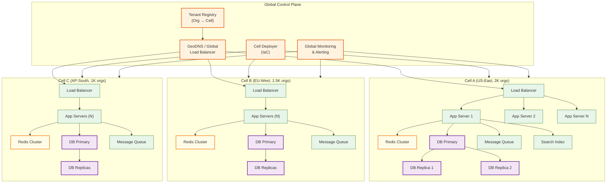
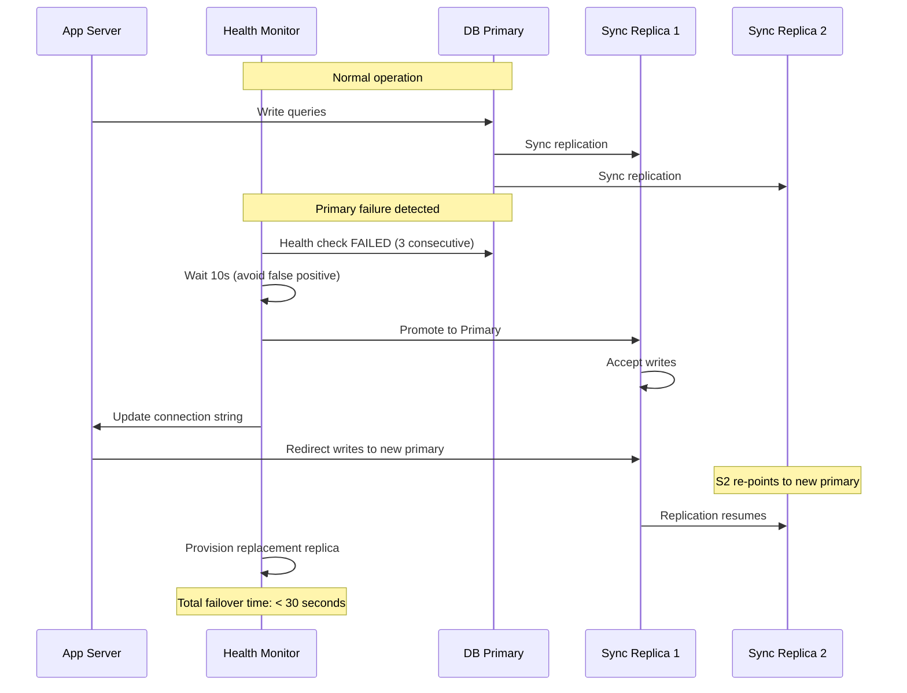

# Scalability & Reliability

## Scalability

### Horizontal vs. Vertical Scaling Decisions

| Component | Strategy | Justification |
|-----------|----------|---------------|
| **App servers** | Horizontal (stateless) | Add instances behind load balancer; no shared state |
| **Metadata cache** | Horizontal (Redis Cluster) | Shard by org_id; add nodes as tenant count grows |
| **Primary database** | Vertical first, then cell-based horizontal | Database is the hardest to scale; vertical scaling buys time, cells provide true horizontal |
| **Search index** | Horizontal (shard per org or org group) | Search workloads are naturally partitionable |
| **Message queue** | Horizontal (partition by org_id) | Each partition is an independent ordered stream |
| **File/blob storage** | Horizontal (object storage) | Object storage scales infinitely by design |

### Cell-Based Scaling Architecture

The platform scales horizontally by adding **cells** -- each cell is a complete, independent deployment of the entire stack.



### Cell Sizing and Capacity Planning

| Parameter | Value | Rationale |
|-----------|-------|-----------|
| Orgs per cell | 500-2,000 | Balance between isolation (smaller cells) and efficiency (larger cells) |
| App servers per cell | 8-32 | Based on QPS; auto-scaled |
| DB size per cell | 2-10 TB | 500-2K orgs x avg 2-5 GB per org |
| Cache per cell | 32-128 GB | Hot metadata + query results for cell's orgs |
| Max QPS per cell | 15,000-30,000 | Based on database capacity |

### When to Create a New Cell

| Trigger | Threshold | Action |
|---------|-----------|--------|
| Org count exceeds capacity | > 2,000 orgs in a cell | Provision new cell, migrate some orgs |
| Database CPU sustained high | > 70% for 1 hour | Split cell or migrate hot tenants |
| p99 latency exceeds SLO | > 200ms for CRUD (15-min window) | Add app servers or split cell |
| New region required | Data residency request | Create cell in new region |
| Enterprise customer onboarding | Customer requires dedicated resources | Provision dedicated cell (cell-of-one) |

### Auto-Scaling Triggers

| Component | Scale Up Trigger | Scale Down Trigger | Cool-down |
|-----------|-----------------|-------------------|-----------|
| App servers | CPU > 60% for 5 min | CPU < 20% for 15 min | 5 min |
| Cache nodes | Memory > 80% | Memory < 30% for 30 min | 10 min |
| Queue consumers | Queue depth > 10K messages | Queue depth < 100 | 5 min |
| Read replicas | Replica lag > 1s or read QPS > 80% capacity | Read QPS < 20% capacity for 30 min | 15 min |

### Database Scaling Strategy

**Within a cell:**

1. **Read replicas** (first lever) -- Route read-only queries to replicas; 3-5 replicas per primary
2. **Connection pooling** -- PgBouncer in transaction mode; 10:1 multiplexing ratio
3. **Partition pruning** -- All queries include `org_id`, eliminating 127/128 partitions
4. **Skinny tables** -- Materialized views for hot objects with real typed columns
5. **Query result caching** -- 30-second TTL per org+query hash

**Across cells:**

6. **Cell splitting** -- When a cell exceeds capacity, create a new cell and migrate orgs
7. **Tenant migration** -- Move a specific org from one cell to another (live migration with dual-write)
8. **Dedicated cells** -- Enterprise customers with extreme workloads get a cell-of-one

### Caching Layers

| Layer | Component | Data | TTL | Hit Rate Target |
|-------|-----------|------|-----|----------------|
| **L1** | In-process (app server) | Request-scoped metadata | Request duration | N/A |
| **L2** | Distributed (Redis) | Metadata, session, query results | 5-15 min (metadata), 30s (query) | > 95% |
| **L3** | CDN | Static assets (JS, CSS, images) | 1 hour | > 99% |
| **Edge** | API gateway | Rate limit counters, auth tokens | Varies | N/A |

### Hot Spot Mitigation

| Hot Spot Type | Detection | Mitigation |
|--------------|-----------|------------|
| **Hot org** (one org generating disproportionate load) | Per-org QPS monitoring; alert if > 5x average | Throttle via governor limits; consider dedicated cell |
| **Hot object** (one custom object with millions of records) | Per-object query count; table scan detection | Create skinny table; add specialized indexes |
| **Hot partition** (hash collision putting many orgs on same partition) | Partition I/O monitoring | Virtual nodes / re-hash; manual partition rebalancing |
| **Hot time** (all orgs peak at same business hour) | Time-series QPS analysis | Pre-scale app servers; stagger batch jobs |

---

## Reliability & Fault Tolerance

### Single Points of Failure (SPOF) Identification

| Component | SPOF Risk | Mitigation |
|-----------|-----------|------------|
| **Tenant Registry** | If down, no request can be routed | Replicated across 3+ regions; edge-cached with 60s TTL; fail-open to last-known-good routing |
| **Cell's DB Primary** | All writes to that cell fail | Synchronous replication to standby; automatic failover in < 30 seconds |
| **Metadata Cache (Redis)** | All requests become slow (cache miss → DB) | Redis Cluster with 3+ nodes; app falls back to DB with degraded performance |
| **Cell's Load Balancer** | Cell is unreachable | Redundant LBs (active-passive); health check from global LB |
| **Global DNS** | Entire platform unreachable | GeoDNS with multiple providers; static fallback IPs |

### Redundancy Strategy

```
Every critical component has N+1 redundancy:
- App servers: N+2 (can lose 2 servers and still handle peak)
- Database: 1 Primary + 2 Sync Replicas + 1 Async (DR)
- Cache: 3-node Redis Cluster (shard replicas)
- Queue: 3-broker cluster with replication factor 3
- Load Balancer: Active-passive pair per cell
- Cells: Failover cell in different AZ
```

### Failover Mechanisms

**Database failover (within a cell):**



**Cell failover (cross-AZ):**

1. Global health monitor detects cell unresponsive (3 consecutive failed health checks, 10-second intervals)
2. Tenant registry marks cell as DEGRADED
3. Requests routed to failover cell (pre-warmed standby in different AZ)
4. Failover cell's database is the async replica (RPO < 5 seconds)
5. Total failover time: < 5 minutes (including DNS propagation with low TTL)

### Circuit Breaker Patterns

| Service | Circuit Opens When | Fallback Behavior | Half-Open Check |
|---------|--------------------|-------------------|-----------------|
| Metadata DB | > 50% errors in 10s | Serve from cache (stale metadata acceptable for reads) | 1 probe request every 5s |
| Search Index | > 30% timeouts in 30s | Return "search temporarily unavailable"; CRUD still works | 1 search query every 10s |
| External callouts (per org) | > 5 consecutive failures | Skip callout; queue for retry; log warning | 1 probe every 30s |
| Workflow engine | > 10% errors in 1 min | Queue workflows for async retry; CRUD still commits | 1 workflow execution every 10s |
| Report engine | > 20% timeouts | Return "report generation delayed"; queue for background processing | 1 report every 30s |

### Retry Strategies

| Operation | Retry Count | Backoff | Idempotent? | Notes |
|-----------|-------------|---------|-------------|-------|
| Database read | 3 | Exponential: 100ms, 200ms, 400ms | Yes | Retry on connection error only |
| Database write | 2 | Exponential: 200ms, 400ms | Must ensure (via idempotency key) | Only retry on connection error, not constraint violations |
| Cache read | 1 | Immediate | Yes | Fall back to DB on second failure |
| External callout | 3 | Exponential: 1s, 2s, 4s | Depends on target | Use `Idempotency-Key` header |
| Queue publish | 3 | Exponential: 100ms, 200ms, 400ms | Yes (dedup at consumer) | Must succeed or fail the operation |

### Graceful Degradation

| Severity | Components Down | User Experience |
|----------|----------------|-----------------|
| **Level 1** (Minor) | Search index | CRUD works; search returns "temporarily unavailable" |
| **Level 2** (Moderate) | Report engine + workflow engine | CRUD works; reports/automation delayed; queued for retry |
| **Level 3** (Significant) | Cache cluster | CRUD works but slower (metadata from DB); governor limits may be relaxed |
| **Level 4** (Major) | Database read replicas | Reads served from primary (reduced throughput); writes still work |
| **Level 5** (Critical) | Database primary | Automatic failover to replica; < 30s downtime per cell |

### Bulkhead Pattern

Bulkheads isolate failures at multiple levels:

1. **Cell-level bulkhead:** Each cell is independent; a failure in Cell A doesn't affect Cell B
2. **Tier-level bulkhead:** Within a cell, enterprise tenants have dedicated thread pools separate from basic tenants
3. **Operation-level bulkhead:** Sync CRUD, async bulk, and report generation use separate thread pools and database connection pools
4. **Per-org bulkhead:** Governor limits and rate limiting cap each org's resource consumption

---

## Disaster Recovery

### RTO (Recovery Time Objective)

| Scenario | RTO | Mechanism |
|----------|-----|-----------|
| Single server failure | 0 (transparent) | Load balancer removes unhealthy server; others handle traffic |
| Database primary failure | < 30 seconds | Automatic failover to synchronous replica |
| Full cell failure (AZ outage) | < 5 minutes | Route traffic to failover cell in different AZ |
| Full region failure | < 30 minutes | Activate DR region; promote async replicas |
| Complete platform failure | < 2 hours | Restore from backups in new region |

### RPO (Recovery Point Objective)

| Scenario | RPO | Mechanism |
|----------|-----|-----------|
| Database primary failure | 0 (zero data loss) | Synchronous replication to standby |
| AZ failure | < 5 seconds | Async replication to cross-AZ replica |
| Region failure | < 30 seconds | Async replication to DR region |
| Accidental data deletion (tenant) | 0 (recoverable) | Recycle bin (15 days) + point-in-time recovery |
| Complete platform failure | < 1 hour | Hourly backup snapshots + WAL archiving |

### Backup Strategy

| Data | Frequency | Retention | Type |
|------|-----------|-----------|------|
| Database (full) | Daily | 30 days | Snapshot to object storage |
| Database (incremental) | Hourly | 7 days | WAL archiving |
| Metadata (per-org) | On every change | 90 days | Event-sourced changelog |
| Files/blobs | Continuous (3-way replication) | Per org policy | Object storage versioning |
| Audit logs | Continuous (append-only) | 10 years | Immutable storage |
| Tenant registry | Every 5 minutes | 30 days | Multi-region replicated snapshot |

### Multi-Region Considerations

```
Primary Region (US-East)           DR Region (US-West)
┌─────────────────────┐           ┌─────────────────────┐
│ Cell A (2K orgs)    │──async──→│ Cell A-DR (standby)  │
│ Cell B (1.5K orgs)  │──async──→│ Cell B-DR (standby)  │
│ Cell C (1K orgs)    │──async──→│ Cell C-DR (standby)  │
│ Tenant Registry     │──sync───→│ Tenant Registry (R)  │
│ Global Monitoring   │──sync───→│ Monitoring (standby) │
└─────────────────────┘           └─────────────────────┘

EU Region (eu-west-1)             AP Region (ap-south-1)
┌─────────────────────┐           ┌─────────────────────┐
│ Cell EU-1 (1K orgs) │           │ Cell AP-1 (500 orgs) │
│ Cell EU-2 (800 orgs)│           │ (Data residency)     │
│ (Data residency:    │           └─────────────────────┘
│  GDPR compliance)   │
└─────────────────────┘
```

**Cross-region rules:**
- Tenant data **never** leaves its assigned region unless the org admin explicitly requests migration
- Tenant registry is globally replicated (read replicas in all regions)
- Global monitoring aggregates metrics from all regions (one-way push)
- DR failover changes the tenant registry routing, not the data location
