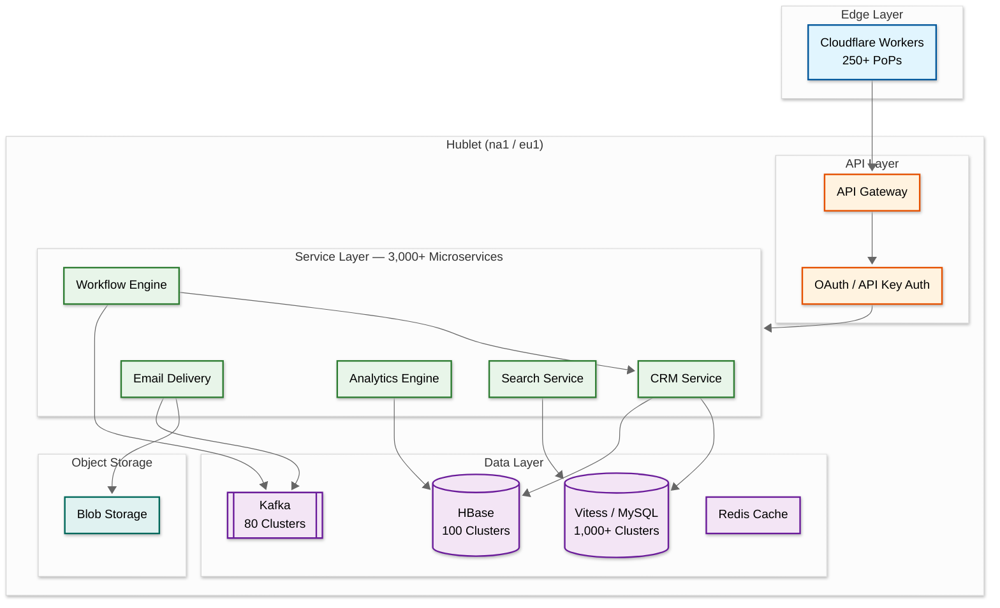

# 6.4 HubSpot — Marketing Automation & CRM Platform

## System Overview

HubSpot is an all-in-one customer platform combining CRM, marketing automation, sales engagement, customer service, and content management. At its core, the system must handle flexible data modeling for millions of business objects, execute complex marketing automation workflows processing hundreds of millions of actions daily, deliver 400+ million emails per month, and serve 268,000+ paying customers across 135+ countries with strong data isolation guarantees. The architecture represents a masterclass in evolving a monolith into 3,000+ microservices, multi-region pod-based tenancy ("Hublets"), and event-driven workflow orchestration using Kafka swimlanes.

## Key Characteristics

| Characteristic | Description |
|---|---|
| **Workload Type** | Mixed read-heavy (CRM queries, dashboards) + write-heavy (event ingestion, email analytics) |
| **Latency Sensitivity** | High for CRM CRUD (< 100ms), moderate for workflow execution (seconds), low for analytics (minutes) |
| **Consistency Model** | Strong for CRM writes, eventual for analytics/email events |
| **Multi-Tenancy** | Pod-based isolation ("Hublets") — full infrastructure copy per region |
| **Data Volume** | 2.5 PB/day HBase traffic, 260 TB compressed email analytics, 1M MySQL queries/sec |
| **Complexity Rating** | **Very High** |

## Quick Navigation

| # | Document | Description |
|---|---|---|
| 01 | [Requirements & Estimations](./01-requirements-and-estimations.md) | Functional/non-functional requirements, capacity planning, SLOs |
| 02 | [High-Level Design](./02-high-level-design.md) | Architecture diagrams, data flow, key decisions |
| 03 | [Low-Level Design](./03-low-level-design.md) | Data model, API design, algorithms (pseudocode) |
| 04 | [Deep Dive & Bottlenecks](./04-deep-dive-and-bottlenecks.md) | Workflow engine, CRM hotspotting, email delivery |
| 05 | [Scalability & Reliability](./05-scalability-and-reliability.md) | Scaling strategies, fault tolerance, disaster recovery |
| 06 | [Security & Compliance](./06-security-and-compliance.md) | Threat model, AuthN/AuthZ, data isolation, GDPR |
| 07 | [Observability](./07-observability.md) | Metrics, logging, tracing, alerting |
| 08 | [Interview Guide](./08-interview-guide.md) | 45-min pacing, trap questions, trade-offs |

## What Makes HubSpot Unique

1. **Hublet Architecture**: Each region gets a full, independent copy of the entire platform — not just sharded databases, but isolated AWS accounts, VPCs, encryption keys, and Kafka clusters
2. **Kafka Swimlanes**: Workflow engine routes actions to dedicated consumer pools based on action type, latency prediction, and customer behavior — preventing noisy-neighbor problems
3. **CRM on HBase with Deduplication**: All CRM objects stored in a single HBase table; client-side request deduplication (100ms window) eliminated hotspotting incidents
4. **VTickets for Global Uniqueness**: Custom extension to Vitess generating globally unique IDs across datacenters without coordination overhead
5. **Monoglot Backend**: All 3,000+ microservices written in Java (Dropwizard) — maximizing tooling investment and engineer mobility

## Architecture at a Glance

## Key Numbers

| Metric | Value |
|---|---|
| Paying Customers | 268,000+ (2025) |
| Annual Revenue | $3.13B (FY 2025) |
| Marketing Emails/Month | 400M+ |
| Workflow Actions/Day | Hundreds of millions |
| HBase Peak QPS | 25M+ requests/sec |
| MySQL Steady-State QPS | ~1M queries/sec |
| Microservices | 3,000+ |
| Deployable Units | 9,000+ |
| Builds/Day | 1M+ |

## References

- [How We Built Our Stack for Shipping at Scale](https://product.hubspot.com/blog/how-we-built-our-stack-for-shipping-at-scale)
- [Tooling for Managing 3,000+ Microservices](https://product.hubspot.com/blog/backend-tooling)
- [Multi-Region Series (5 parts)](https://product.hubspot.com/blog/developing-an-eu-data-center)
- [Kafka Swimlanes for Workflow Engine](https://product.hubspot.com/blog/imbalanced-traffic-routing)
- [Preventing CRM Hotspotting with Deduplication](https://product.hubspot.com/blog/preventing-hotspotting-with-deduplication)
- [HubSpot Vitess/MySQL Architecture](https://product.hubspot.com/blog/hubspot-upgrades-mysql)
- [HBase at Scale](https://product.hubspot.com/blog/hbase-share-resources)
