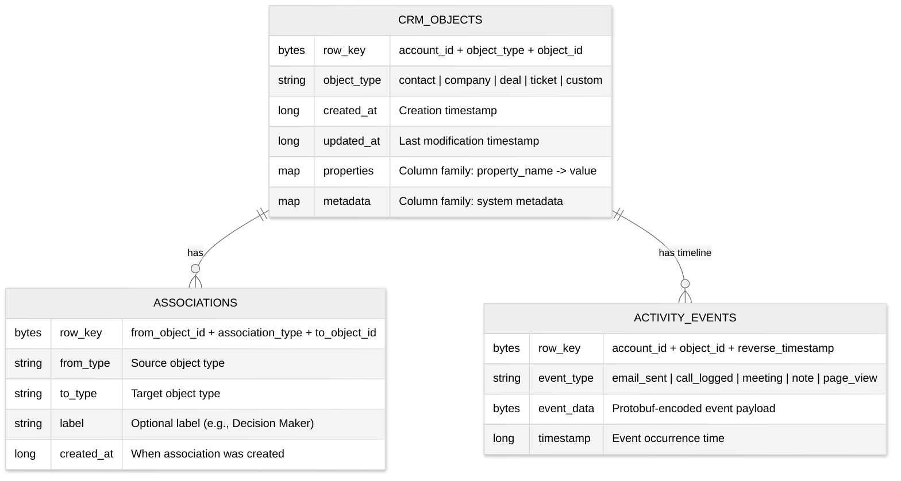
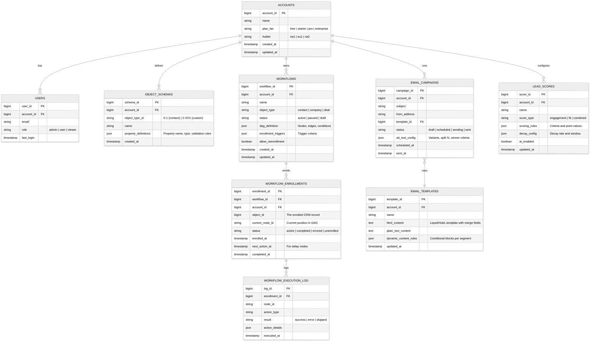
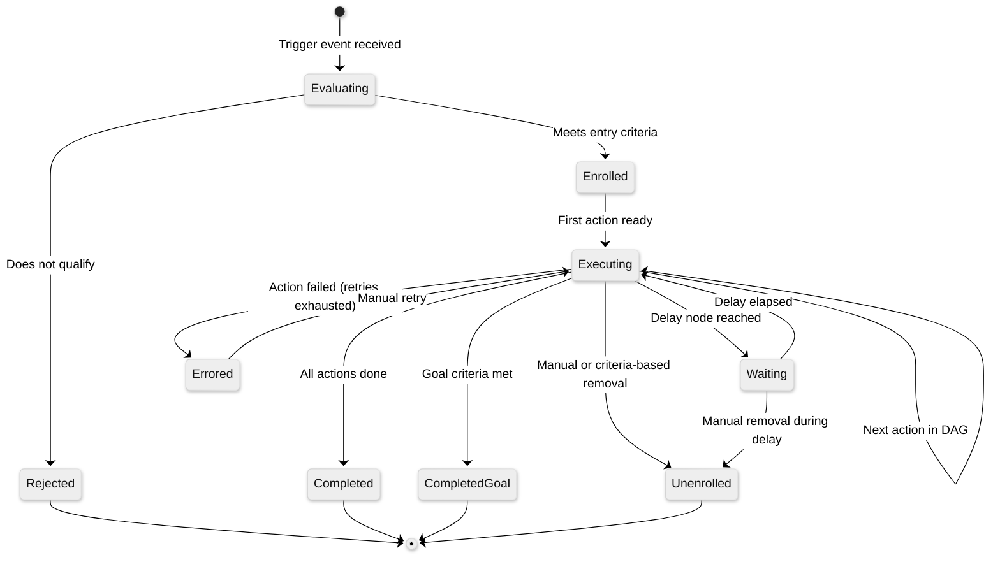
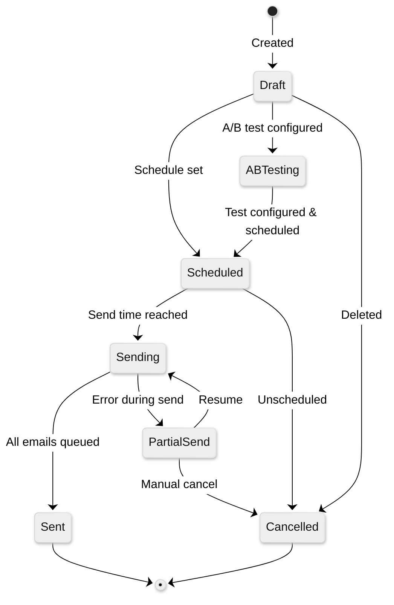

# Low-Level Design

## Data Model

### CRM Object Storage (HBase)

All CRM objects reside in a **single HBase table** called `CrmObjects`. Each row represents one object (contact, company, deal, etc.), keyed by a composite of account ID and object ID.



**Row Key Design:**

```
CrmObjects Row Key:
┌──────────────┬─────────────┬──────────────┐
│ account_id   │ object_type │ object_id    │
│ (8 bytes)    │ (2 bytes)   │ (8 bytes)    │
└──────────────┴─────────────┴──────────────┘

Activity Events Row Key (reverse chronological):
┌──────────────┬──────────────┬─────────────────────┐
│ account_id   │ object_id    │ MAX_LONG - timestamp │
│ (8 bytes)    │ (8 bytes)    │ (8 bytes)            │
└──────────────┴──────────────┴─────────────────────┘
```

**Why this design:**
- `account_id` prefix ensures all data for one customer lives on the same RegionServer — the primary access pattern
- `object_type` prefix within account groups contacts together, companies together, etc.
- Reverse timestamp for activity events enables efficient "most recent first" scans
- Properties stored as a column family: each property is an HBase column within the row, enabling atomic single-row updates

### Relational Data (Vitess/MySQL)

Metadata, account configuration, workflow definitions, and system data stored in Vitess-managed MySQL.



**Sharding Strategy:**
- **Shard key**: `account_id` — all data for one customer co-located on the same Vitess shard
- 750+ shards per datacenter, each a 3-instance MySQL cluster
- Vitess handles query routing transparently; application code writes standard SQL

### Indexing Strategy

| Table / Column Family | Index | Purpose |
|---|---|---|
| CrmObjects (HBase) | Row key prefix scan by `account_id` | All objects for an account |
| CrmObjects (HBase) | Row key prefix + `object_type` | All contacts for an account |
| Workflows | `(account_id, status)` | List active workflows for account |
| Workflow Enrollments | `(workflow_id, status)` | Active enrollments in a workflow |
| Workflow Enrollments | `(account_id, object_id)` | All workflows a record is enrolled in |
| Workflow Enrollments | `(next_action_at)` | Timer-based polling for delayed actions |
| Email Campaigns | `(account_id, status, scheduled_at)` | Upcoming campaigns |
| Search Index (Inverted) | Property values → object IDs | CRM search and segmentation |

---

## API Design

### CRM Objects API (REST)

```
# CRUD Operations
GET    /crm/v3/objects/{objectType}                    # List objects
GET    /crm/v3/objects/{objectType}/{objectId}          # Get single object
POST   /crm/v3/objects/{objectType}                    # Create object
PATCH  /crm/v3/objects/{objectType}/{objectId}          # Update object
DELETE /crm/v3/objects/{objectType}/{objectId}          # Archive object

# Batch Operations
POST   /crm/v3/objects/{objectType}/batch/read          # Batch read
POST   /crm/v3/objects/{objectType}/batch/create        # Batch create
POST   /crm/v3/objects/{objectType}/batch/update        # Batch update

# Search
POST   /crm/v3/objects/{objectType}/search              # Search/filter

# Associations
GET    /crm/v4/objects/{objectType}/{objectId}/associations/{toObjectType}
PUT    /crm/v4/objects/{objectType}/{objectId}/associations/{toObjectType}/{toObjectId}
DELETE /crm/v4/objects/{objectType}/{objectId}/associations/{toObjectType}/{toObjectId}
```

**Search Request Format:**

```
POST /crm/v3/objects/contacts/search
{
  "filterGroups": [                    // Up to 5 groups (OR logic between groups)
    {
      "filters": [                     // Up to 6 filters per group (AND logic)
        {
          "propertyName": "lifecyclestage",
          "operator": "EQ",
          "value": "marketingqualifiedlead"
        },
        {
          "propertyName": "hs_lead_score",
          "operator": "GTE",
          "value": "50"
        }
      ]
    }
  ],
  "sorts": [{"propertyName": "createdate", "direction": "DESCENDING"}],
  "properties": ["email", "firstname", "lastname", "hs_lead_score"],
  "limit": 100,
  "after": "cursor_token"
}
```

### Workflow API

```
# Workflow Management
GET    /automation/v4/workflows                         # List workflows
GET    /automation/v4/workflows/{workflowId}            # Get workflow definition
POST   /automation/v4/workflows                         # Create workflow
PATCH  /automation/v4/workflows/{workflowId}            # Update workflow
DELETE /automation/v4/workflows/{workflowId}            # Delete workflow

# Enrollment
POST   /automation/v4/workflows/{workflowId}/enrollments/add     # Manual enrollment
POST   /automation/v4/workflows/{workflowId}/enrollments/remove  # Manual unenrollment

# Execution History
GET    /automation/v4/workflows/{workflowId}/enrollments         # List enrollments
GET    /automation/v4/workflows/{workflowId}/enrollments/{enrollmentId}/history
```

### Email API

```
# Campaigns
POST   /marketing/v3/emails                             # Create campaign
PATCH  /marketing/v3/emails/{campaignId}                # Update campaign
POST   /marketing/v3/emails/{campaignId}/send           # Trigger send
POST   /marketing/v3/emails/{campaignId}/ab-test        # Configure A/B test

# Analytics
GET    /marketing/v3/emails/{campaignId}/statistics     # Open/click/bounce rates
GET    /marketing/v3/emails/{campaignId}/recipients     # Recipient-level events
```

### Webhook Subscriptions API

```
# Subscriptions
POST   /webhooks/v3/subscriptions                       # Create subscription
GET    /webhooks/v3/subscriptions                       # List subscriptions
DELETE /webhooks/v3/subscriptions/{subscriptionId}      # Remove subscription

Webhook Payload (delivered to subscriber):
{
  "eventId": "evt_abc123",
  "subscriptionType": "contact.propertyChange",
  "portalId": 12345,                    // Account ID
  "objectId": 67890,
  "propertyName": "lifecyclestage",
  "propertyValue": "customer",
  "occurredAt": 1709913600000,
  "attemptNumber": 1
}
```

### Rate Limiting

| Client Type | Limit | Scope |
|---|---|---|
| Private apps | 190 requests / 10 seconds | Per app |
| Marketplace OAuth apps | 110 requests / 10 seconds | Per installing account |
| Search endpoints | 4 requests / second | Per app per account |
| Batch endpoints | 10 requests / second | Per app per account |
| Webhook delivery | 1,000 webhooks / 30 seconds | Per subscription |

### Idempotency

- **CRM creates**: Clients provide `idempotencyKey` header; server deduplicates within 10-minute window
- **Workflow actions**: Each action execution tagged with `(enrollment_id, node_id, attempt)` — duplicate detection via composite key
- **Email sends**: Deduplicated by `(campaign_id, contact_id)` — same contact never receives the same campaign twice
- **Webhooks**: Each webhook includes `eventId`; subscribers can deduplicate by event ID

---

## Core Algorithms

### 1. Workflow DAG Executor

The workflow engine traverses a DAG where each node is a trigger, condition, action, or delay.

```
FUNCTION execute_workflow(enrollment):
    current_node = enrollment.current_node_id

    WHILE current_node IS NOT NULL:
        node = load_node(enrollment.workflow_id, current_node)

        SWITCH node.type:
            CASE "action":
                result = route_to_swimlane(enrollment, node)
                IF result.status == "error" AND node.retry_policy:
                    schedule_retry(enrollment, node, result.attempt + 1)
                    RETURN  // Will resume on retry
                log_execution(enrollment, node, result)
                current_node = node.next_node_id

            CASE "condition":
                object_data = fetch_crm_object(enrollment.object_id)
                branch = evaluate_condition(node.condition, object_data)
                current_node = branch.target_node_id

            CASE "delay":
                fire_at = calculate_delay(node.delay_config, NOW())
                enrollment.next_action_at = fire_at
                enrollment.current_node_id = node.next_node_id
                persist_enrollment(enrollment)
                RETURN  // Timer service will resume execution

            CASE "branch":
                // Evaluate multiple conditions, pick first match
                FOR EACH branch IN node.branches:
                    IF evaluate_condition(branch.condition, object_data):
                        current_node = branch.target_node_id
                        BREAK
                ELSE:
                    current_node = node.default_branch_id

            CASE "goal":
                IF evaluate_condition(node.goal_criteria, object_data):
                    enrollment.status = "completed_goal"
                    persist_enrollment(enrollment)
                    RETURN
                current_node = node.next_node_id

        // Update enrollment position
        enrollment.current_node_id = current_node
        persist_enrollment(enrollment)

    enrollment.status = "completed"
    persist_enrollment(enrollment)

// Time complexity: O(N) where N = number of nodes in the execution path
// Space complexity: O(1) per enrollment — state persisted to database
```

### 2. Kafka Swimlane Router

Routes workflow actions to appropriate Kafka topics based on action type, latency prediction, and customer behavior.

```
FUNCTION route_to_swimlane(enrollment, action_node):
    // Determine base swimlane from action type
    swimlane = "default"

    IF action_node.type == "send_email":
        swimlane = "fast-email"
    ELSE IF action_node.type == "custom_code":
        swimlane = "slow-custom-code"
    ELSE IF action_node.type == "update_property":
        swimlane = "fast-crm-update"
    ELSE IF action_node.type == "webhook":
        swimlane = "medium-webhook"

    // Check for bulk enrollment (noisy neighbor detection)
    customer_rate = get_rate_counter(enrollment.account_id)
    IF customer_rate > BULK_THRESHOLD:
        swimlane = "overflow-bulk"

    // Check latency prediction from historical data
    predicted_latency = get_latency_percentile(
        enrollment.account_id, action_node.type, p95
    )
    IF predicted_latency > SLOW_THRESHOLD:
        swimlane = "slow-" + action_node.type

    // Check if customer has dedicated isolation swimlane (incident mode)
    IF has_dedicated_swimlane(enrollment.account_id):
        swimlane = "isolated-" + enrollment.account_id

    // Rate limit check (overlapping limits)
    IF NOT check_rate_limits(enrollment.account_id, [
        {limit: 500, window: "1sec"},
        {limit: 1000, window: "1min"}
    ]):
        swimlane = "throttled"

    publish_to_kafka(
        topic = "workflow-actions-" + swimlane,
        key = enrollment.account_id,  // Ordering per customer
        value = serialize(enrollment, action_node)
    )

    RETURN awaited_result_or_async_ack

// ~12 swimlanes operate simultaneously
// Each swimlane has independent consumer group scaling
```

### 3. Lead Scoring Engine

```
FUNCTION calculate_lead_score(contact_id, account_id):
    score_config = load_score_config(account_id)
    contact = fetch_contact(contact_id)
    events = fetch_recent_events(contact_id, window = 90_DAYS)

    total_score = 0

    // --- Behavioral Scoring (Engagement) ---
    FOR EACH rule IN score_config.behavioral_rules:
        matching_events = filter_events(events, rule.event_type)
        points = rule.base_points * COUNT(matching_events)

        // Apply recency decay
        FOR EACH event IN matching_events:
            age_days = days_since(event.timestamp)
            decay_factor = calculate_decay(age_days, rule.decay_config)
            // decay_config: {half_life: 30, min_factor: 0.1}
            // decay_factor = MAX(min_factor, 2^(-age_days / half_life))
            points += rule.base_points * decay_factor

        total_score += points

    // --- Demographic/Firmographic Scoring (Fit) ---
    FOR EACH rule IN score_config.fit_rules:
        property_value = contact.properties[rule.property_name]
        IF matches_criteria(property_value, rule.criteria):
            total_score += rule.points
        // Negative scoring: career page visitors, competitors, students

    // --- AI Predictive Component (if enabled) ---
    IF score_config.ai_enabled AND has_sufficient_data(account_id):
        features = extract_features(contact, events)
        ai_score = ml_model.predict(features)  // 0.0 to 1.0 probability
        total_score += ROUND(ai_score * score_config.ai_weight)

    // Clamp to configured range
    total_score = CLAMP(total_score, score_config.min, score_config.max)

    // Persist and emit event
    update_contact_property(contact_id, "hs_lead_score", total_score)
    emit_event("LEAD_SCORE_CHANGED", contact_id, total_score)

    RETURN total_score

FUNCTION calculate_decay(age_days, decay_config):
    // Exponential decay with half-life
    factor = POWER(2, -(age_days / decay_config.half_life))
    RETURN MAX(decay_config.min_factor, factor)

// Time complexity: O(R × E) where R = rules, E = events per contact
// Runs in real-time on high-signal events, batch daily for all contacts
```

### 4. Client-Side CRM Deduplication

Prevents HBase hotspotting from simultaneous requests for the same record.

```
FUNCTION deduplicated_read(account_id, object_id, properties):
    cache_key = hash(account_id, object_id, sorted(properties))

    // Check if identical request is already in-flight (100ms window)
    existing_future = inflight_requests.get(cache_key)
    IF existing_future IS NOT NULL:
        RETURN existing_future.await()  // Piggyback on existing request

    // Determine routing: hot object vs normal
    request_rate = rate_counter.get(cache_key)

    IF request_rate > HOT_THRESHOLD:  // ~40 req/sec per object
        // Route to dedicated dedup service (4 instances)
        future = dedup_service.fetch(account_id, object_id, properties)
    ELSE:
        // Route to main CRM service (100+ instances)
        future = crm_service.fetch(account_id, object_id, properties)

    inflight_requests.put(cache_key, future, TTL = 100ms)
    result = future.await()
    inflight_requests.remove(cache_key)

    RETURN result

// Eliminated all HBase hotspotting incidents since January 2022
// Hot objects: ~40 req/sec per object handled by 4 dedicated instances
// Normal traffic: 100+ instances serve the long tail
```

### 5. Email Personalization and Rendering

```
FUNCTION render_email(campaign, contact):
    template = load_template(campaign.template_id)

    // Build merge context from contact properties + associations
    context = {
        "contact": contact.properties,
        "company": fetch_primary_association(contact.id, "company"),
        "deal": fetch_primary_association(contact.id, "deal"),
        "account": fetch_account_settings(contact.account_id),
        "unsubscribe_url": generate_unsubscribe_link(contact),
        "tracking_pixel_url": generate_tracking_pixel(campaign, contact)
    }

    // Evaluate dynamic content blocks
    FOR EACH block IN template.dynamic_blocks:
        IF evaluate_condition(block.condition, context):
            context["dynamic_" + block.id] = block.content
        ELSE:
            context["dynamic_" + block.id] = block.fallback

    // Render Liquid/HubL template
    html = liquid_engine.render(template.html_content, context)
    plain_text = liquid_engine.render(template.plain_text_content, context)

    // Inline CSS for email client compatibility
    html = css_inliner.process(html)

    RETURN {html, plain_text, subject: render(campaign.subject, context)}
```

---

## State Machine: Workflow Enrollment Lifecycle



## State Machine: Email Campaign Lifecycle


