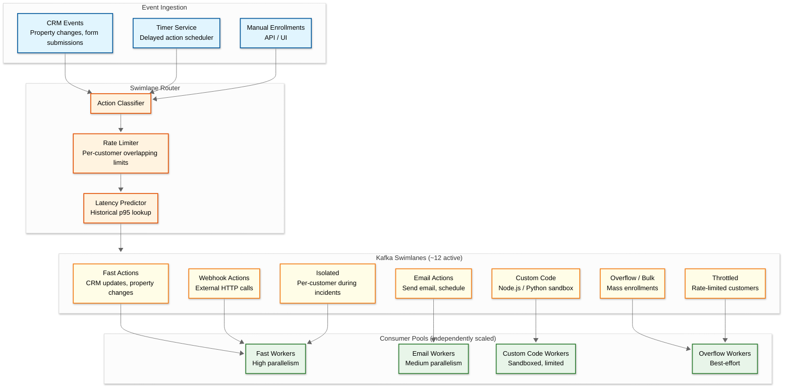
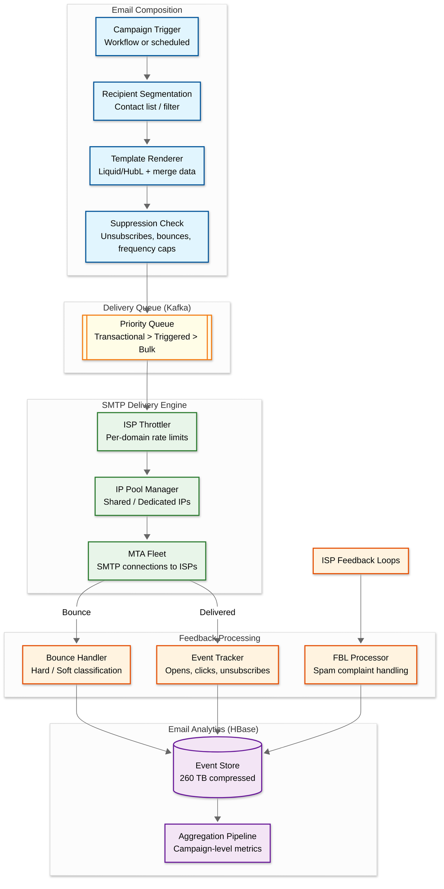

# Deep Dive & Bottlenecks

## Critical Component 1: Workflow Engine with Kafka Swimlanes

### Why This Is Critical

The workflow engine is the heart of HubSpot's marketing automation. It processes **hundreds of millions of actions daily** at **tens of thousands of actions per second**. A single poorly-behaving customer enrolling 1M contacts simultaneously could starve all other customers of processing capacity. The swimlane architecture is HubSpot's production-proven solution to this noisy-neighbor problem.

### How It Works Internally



**Swimlane routing decision tree:**

1. **Action type classification**: Fast (CRM updates: ~5ms) vs. medium (email: ~50ms) vs. slow (custom code: ~500ms+)
2. **Bulk detection**: If customer's enrollment rate exceeds threshold → overflow swimlane
3. **Latency prediction**: Historical p95 for this customer + action type → route to slow lane if predicted > threshold
4. **Rate limit enforcement**: Overlapping limits (500 req/sec AND 1,000 req/min) → throttled lane if exceeded
5. **Manual isolation**: Ops can assign a customer to a dedicated swimlane during incidents

### Failure Modes

| Failure | Impact | Mitigation |
|---|---|---|
| **Consumer lag on one swimlane** | Actions delayed for that category | Independent consumer scaling per swimlane; alert on lag delta metric |
| **Bulk enrollment floods overflow** | Overflow lane backs up | Overflow has dedicated throughput budget; excess spills to dead letter queue for replay |
| **Custom code action hangs** | Blocks sandbox worker | Timeout per execution (30s default); circuit breaker on repeated failures per customer |
| **Rate limiter misconfiguration** | Legitimate traffic throttled | Multiple overlapping limits provide safety net; real-time monitoring of throttle rates |
| **Kafka broker failure** | Actions delayed | Multi-broker clusters with replication factor 3; automatic leader election |
| **Swimlane router crash** | All routing stops | Stateless router; multiple instances behind load balancer; fallback to default swimlane |

### Delayed Action Implementation

Workflows frequently include "wait 3 days then send email" nodes. Implementation:

```
Delay Node Processing:
1. Workflow reaches delay node
2. Calculate fire_at = NOW() + delay_duration
3. Persist enrollment with current_node = next_node, next_action_at = fire_at
4. Timer Service polls for due enrollments (every 5 seconds)
5. When fire_at <= NOW(), Timer Service publishes resume event to Kafka
6. Workflow engine picks up and continues DAG execution

Alternative approaches considered:
- Kafka scheduled delivery: Not supported natively; would need custom time-indexed topics
- Temporal.io durable timers: Evaluated but adding dependency not justified
- Database polling: Selected for simplicity; works because timer precision of seconds is sufficient
```

---

## Critical Component 2: CRM Object Storage and Hotspot Prevention

### Why This Is Critical

All CRM objects — contacts, companies, deals, tickets, custom objects — reside in a **single HBase table**. This table serves **hundreds of thousands of reads and writes per second** from 100+ microservices. A single "hot" object (e.g., a company record that many workflows reference simultaneously) can overload the RegionServer hosting that row, degrading performance for all customers on that server.

### How Hotspot Prevention Works

```mermaid
%%{init: {'theme': 'neutral', 'look': 'neo'}}%%
flowchart TB
    subgraph Client["CRM Client Library (in every microservice)"]
        REQ[Incoming Request<br/>Read contact 12345]
        HASH[Hash Request<br/>cache_key = hash(account, object, props)]
        INFLIGHT[In-Flight Map<br/>100ms dedup window]
        RATE_CHECK[Rate Counter<br/>Requests per object per second]
    end

    subgraph Routing["Request Routing"]
        NORMAL_PATH[Main CRM Service<br/>100+ instances]
        HOT_PATH[Dedup Service<br/>4 instances]
    end

    subgraph Storage["HBase"]
        HBASE[(CRM Objects Table)]
    end

    REQ --> HASH
    HASH --> INFLIGHT

    INFLIGHT -->|Duplicate in window| PIGGYBACK[Piggyback on<br/>existing request]
    INFLIGHT -->|New request| RATE_CHECK

    RATE_CHECK -->|< 40 req/sec| NORMAL_PATH
    RATE_CHECK -->|>= 40 req/sec| HOT_PATH

    NORMAL_PATH --> HBASE
    HOT_PATH --> HBASE

    classDef client fill:#e1f5fe,stroke:#01579b,stroke-width:2px
    classDef routing fill:#e8f5e9,stroke:#2e7d32,stroke-width:2px
    classDef storage fill:#f3e5f5,stroke:#6a1b9a,stroke-width:2px

    class REQ,HASH,INFLIGHT,RATE_CHECK,PIGGYBACK client
    class NORMAL_PATH,HOT_PATH routing
    class HBASE storage
```

**Three layers of protection:**

1. **Request deduplication (100ms window)**: If an identical request (same account + object + properties) arrives within 100ms of an in-flight request, it piggybacks on the existing request's response. This collapses N simultaneous identical reads into 1 HBase read.

2. **Hot object routing**: A rate counter tracks requests per object. Objects exceeding ~40 req/sec are routed to a dedicated dedup service (4 instances) that batches and deduplicates. Normal traffic goes to the main CRM service (100+ instances).

3. **HBase quotas**: Per-tenant quotas limit the total HBase request rate from any single customer. At 25M+ peak req/sec, this prevents one large customer from monopolizing RegionServer resources.

**Result**: Zero HBase hotspotting incidents since January 2022.

### Failure Modes

| Failure | Impact | Mitigation |
|---|---|---|
| **Dedup service crash** | Hot objects hit HBase directly | Fallback to main CRM service; HBase quotas still protect |
| **Rate counter memory exhaustion** | Can't detect hot objects | Bounded rate counter map; evict oldest entries; fail-open to main path |
| **HBase RegionServer overload** | Increased latency for region | Automatic region splitting; locality healing (recovery in 3 minutes) |
| **Large account scan** | One scan blocks RegionServer | Connect library rejects expensive scan queries at client side |

---

## Critical Component 3: Email Delivery Pipeline

### Why This Is Critical

HubSpot delivers **400+ million marketing emails per month** (~150/sec average, ~5K/sec peak). Email deliverability directly impacts customer value — poor inbox placement means wasted marketing spend. The pipeline must handle ISP throttling, bounce processing, reputation management, and personalization at scale.

### How It Works Internally



**ISP throttling logic:**

```
FUNCTION deliver_email(email, recipient_domain):
    // Check per-domain rate limits
    current_rate = domain_rate_counter.get(recipient_domain)
    domain_limit = isp_limits.get(recipient_domain)  // e.g., Gmail: 500/min

    IF current_rate >= domain_limit:
        requeue_with_delay(email, backoff = 60_SECONDS)
        RETURN "throttled"

    // Select IP from pool
    ip = ip_pool.select(
        strategy = recipient_domain.requires_warm_ip ? "warmest" : "round_robin",
        reputation_threshold = 0.8
    )

    // SMTP delivery
    result = smtp_send(email, recipient_domain, from_ip = ip)

    SWITCH result.code:
        CASE 250: // Success
            emit_event("EMAIL_DELIVERED", email)
        CASE 421, 450: // Temporary failure
            requeue_with_backoff(email, attempt = email.attempt + 1)
        CASE 550, 551, 552: // Hard bounce
            suppress_recipient(email.to)
            emit_event("EMAIL_BOUNCED_HARD", email)
        CASE 452: // Mailbox full (soft bounce)
            requeue_with_delay(email, backoff = 3600_SECONDS)
```

### Failure Modes

| Failure | Impact | Mitigation |
|---|---|---|
| **IP blacklisted** | Emails from that IP rejected | Automatic IP rotation; reputation monitoring; fallback to clean IP pool |
| **ISP rate limit exceeded** | Temporary 421 rejections | Per-domain throttling with adaptive rate adjustment |
| **Template rendering failure** | Email not sent | Pre-render validation; fallback to plain text; alert on render error spike |
| **Kafka delivery queue lag** | Emails delayed | Auto-scaling consumer groups; priority lanes (transactional > triggered > bulk) |
| **Feedback loop delay** | Continued sends to complainers | Proactive suppression based on engagement signals; real-time unsubscribe processing |

---

## Concurrency & Race Conditions

### Race Condition 1: Simultaneous Workflow Enrollments

**Scenario**: Two events (form submission + property change) fire simultaneously for the same contact, both matching enrollment criteria for the same workflow.

**Risk**: Contact enrolled twice in the same workflow, receiving duplicate emails.

**Solution**:
```
// Atomic enrollment with compare-and-swap
FUNCTION try_enroll(workflow_id, contact_id):
    enrollment_key = (workflow_id, contact_id)

    // Atomic check-and-insert with row-level locking
    result = INSERT INTO workflow_enrollments (workflow_id, object_id, status)
             VALUES (workflow_id, contact_id, 'active')
             ON CONFLICT (workflow_id, object_id) WHERE status = 'active'
             DO NOTHING
             RETURNING enrollment_id

    IF result IS NULL:
        // Already enrolled, check re-enrollment policy
        IF workflow.allow_reenrollment:
            // Check if current enrollment is in a terminal state
            existing = SELECT status FROM workflow_enrollments
                       WHERE workflow_id = ? AND object_id = ?
            IF existing.status IN ('completed', 'unenrolled'):
                // Create new enrollment
                INSERT ...
```

### Race Condition 2: Concurrent Property Updates

**Scenario**: A workflow action updates `lifecyclestage` to "MQL" while a sales rep simultaneously changes it to "SQL" via the UI.

**Risk**: One update silently overwritten (lost update).

**Solution**: HBase atomic single-row writes with server-side timestamp ordering. Last-write-wins with audit trail — both changes are logged to the activity timeline. For critical fields, optional optimistic concurrency via `hs_lastmodifieddate` check:

```
// Optimistic concurrency on critical properties
FUNCTION update_with_conflict_check(object_id, property, new_value, expected_version):
    current = read_property(object_id, property)
    IF current.version != expected_version:
        RETURN CONFLICT(current_value = current.value)
    atomic_write(object_id, property, new_value, version = expected_version + 1)
```

### Race Condition 3: Email Send Deduplication

**Scenario**: A workflow sends an email, but the action times out and is retried. Meanwhile, the first attempt succeeded.

**Risk**: Contact receives the same email twice.

**Solution**: Idempotency key on `(campaign_id, contact_id)` stored in a deduplication table with 24-hour TTL. Before SMTP handoff, check if this combination has already been sent.

---

## Bottleneck Analysis

### Bottleneck 1: HBase CrmObjects Table as Single Point of Contention

**Why it's a bottleneck**: Every CRM read/write from 100+ microservices hits this table. At 25M+ peak req/sec, even small inefficiencies compound.

**Mitigation stack:**
1. Client-side deduplication (100ms window) — collapses identical reads
2. Hot object routing to dedicated service (4 instances)
3. HBase quotas per tenant — prevents monopolization
4. Region splitting for load distribution
5. Locality healing — ensures data locality within 3 minutes of disruption (vs. 6-8 hours previously)

### Bottleneck 2: Workflow Timer Service Database Polling

**Why it's a bottleneck**: Millions of active workflow enrollments with delayed actions. Polling the `next_action_at` column requires scanning a potentially large index.

**Mitigation stack:**
1. Partitioned polling — each timer service instance owns a range of account IDs
2. B-tree index on `(next_action_at, status)` — efficient range scan for due enrollments
3. Batch polling — fetch 1,000 due enrollments per poll cycle (every 5 seconds)
4. Coarse granularity acceptable — second-level precision is sufficient for marketing workflows

### Bottleneck 3: Email Template Rendering at Peak

**Why it's a bottleneck**: A large campaign sending 1M emails requires rendering 1M personalized templates. At peak, multiple campaigns compete for rendering capacity.

**Mitigation stack:**
1. Template pre-compilation and caching — Liquid templates parsed once, cached indefinitely
2. Merge data batching — fetch contact properties in batches of 1,000
3. Horizontal scaling — rendering workers scale independently
4. Dynamic content evaluation cached per segment (not per contact) where possible
5. Staggered send scheduling — large campaigns auto-spread over hours rather than minutes
