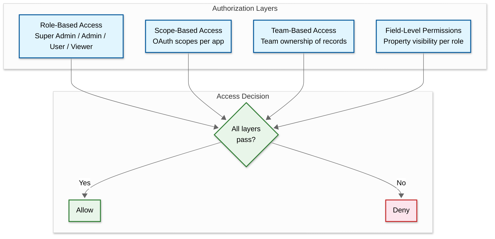
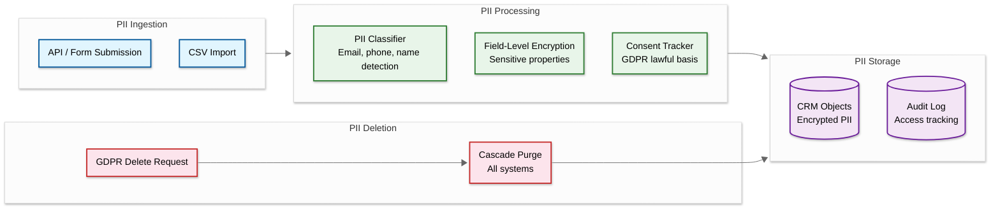

# Security & Compliance

## Authentication & Authorization

### Authentication Mechanisms

| Method | Use Case | Details |
|---|---|---|
| **OAuth 2.0** | Marketplace apps, third-party integrations | Standard authorization code flow with scoped permissions |
| **Private App Tokens** | Internal integrations | Long-lived tokens with defined scopes; simpler than OAuth |
| **API Keys (Legacy)** | Backward compatibility | Being deprecated in favor of private app tokens |
| **SSO (SAML 2.0)** | Enterprise customers | Federated identity with corporate IdPs |
| **MFA** | All user accounts | TOTP-based; mandatory for admin accounts on Enterprise tier |
| **Session Cookies** | Web application | HttpOnly, Secure, SameSite=Strict; short-lived with refresh |

### Authorization Model

HubSpot uses a **hybrid RBAC + field-level permissions** model:



**OAuth Scope Examples:**

| Scope | Access |
|---|---|
| `crm.objects.contacts.read` | Read contact records |
| `crm.objects.contacts.write` | Create/update contact records |
| `automation.workflows.read` | View workflow definitions |
| `content.marketing-emails.send` | Trigger email sends |
| `oauth` | Refresh access tokens |

### Token Management

- **Access tokens**: Short-lived (30 minutes); refreshed via refresh token flow
- **Refresh tokens**: Long-lived (6 months); rotated on each use
- **API key embedding**: Hublet identifier embedded directly in API keys and OAuth tokens for zero-cost routing at the edge
- **Token revocation**: Immediate revocation on app uninstall or scope change

---

## Data Security

### Encryption

| Layer | Method | Details |
|---|---|---|
| **In Transit** | TLS 1.2+ (minimum) | All API traffic, inter-service gRPC, Vitess-to-MySQL |
| **In Transit (Kafka)** | TLS | Producer-to-broker and broker-to-consumer encryption |
| **At Rest (MySQL/Vitess)** | AES-256 | Transparent Data Encryption on all MySQL instances |
| **At Rest (HBase)** | AES-256 | HDFS-level encryption for HBase storage files |
| **At Rest (Blob Storage)** | AES-256 + per-Hublet keys | Server-side encryption with Hublet-isolated key material |
| **Key Management** | HSM-backed KMS | Per-Hublet encryption keys; key rotation every 90 days |

### PII Handling



- **PII classification**: Properties marked as PII (email, phone, IP address) receive additional encryption and access logging
- **Data masking**: Admin-configurable field visibility — sensitive fields hidden from non-authorized roles
- **Anonymization**: GDPR-compliant pseudonymization for analytics data; original PII stored separately from analytics events
- **Retention policies**: Configurable per-account; automatic purge of inactive contacts after defined period

---

## Threat Model

### Top Attack Vectors

| # | Threat | Risk Level | Attack Surface |
|---|---|---|---|
| 1 | **OAuth Token Theft / Abuse** | High | Third-party marketplace apps with excessive scopes |
| 2 | **Workflow Injection** | High | Malicious workflow actions (custom code, webhooks to internal services) |
| 3 | **CRM Data Exfiltration** | High | Bulk API export of contact data by compromised app |
| 4 | **Email Spoofing / Phishing** | Medium | Attacker uses HubSpot sending infrastructure for phishing |
| 5 | **Cross-Tenant Data Access** | Critical | Bug in multi-tenant isolation leaking data between accounts |

### Mitigations

#### 1. OAuth Token Theft / Abuse

| Control | Implementation |
|---|---|
| Minimum-privilege scopes | Marketplace review requires justification for each scope |
| Token rotation | Access tokens expire in 30 minutes; refresh tokens rotate on use |
| Rate limiting per app | 110 requests/10 seconds per installing account |
| Anomaly detection | Spike in API calls from a single app triggers review |
| App revocation | One-click uninstall immediately revokes all tokens |

#### 2. Workflow Injection

| Control | Implementation |
|---|---|
| Custom code sandboxing | Node.js/Python execution in isolated containers with resource limits |
| Network restrictions | Custom code cannot access internal services or other Hublets |
| Execution timeout | 30-second hard timeout per custom code action |
| Webhook allowlisting | Enterprise tier can restrict webhook destinations to approved domains |
| Code review for marketplace | Published workflow templates require security review |

#### 3. CRM Data Exfiltration

| Control | Implementation |
|---|---|
| Export rate limiting | Batch read API limited to 100 records per request, 10 requests/sec |
| Audit logging | All API reads of PII-flagged properties logged with requester identity |
| Data access alerts | Configurable alerts when > N records exported in a time window |
| IP allowlisting | Enterprise tier can restrict API access to approved IP ranges |
| Scope limitations | Read-only scopes can't be combined with bulk export |

#### 4. Email Spoofing / Phishing

| Control | Implementation |
|---|---|
| SPF/DKIM/DMARC enforcement | All sending domains must be authenticated |
| Content scanning | Automated content analysis for phishing indicators |
| Sending limits | New accounts start with low daily send limits; gradual increase |
| Domain verification | Sending domains must be verified via DNS records |
| Abuse reporting | Dedicated abuse team processes ISP feedback loop complaints |

#### 5. Cross-Tenant Data Access

| Control | Implementation |
|---|---|
| Hublet isolation | Separate AWS accounts, VPCs, encryption keys per Hublet |
| Network lockdown | Firewall rules prevent cross-Hublet database traffic |
| Account ID in every query | CRM client library enforces account_id filter on all HBase/MySQL queries |
| Penetration testing | Regular third-party security audits |
| Bug bounty | Public bug bounty program for responsible disclosure |

### DDoS Protection

| Layer | Protection |
|---|---|
| Edge (Cloudflare) | L3/L4 DDoS mitigation, WAF rules, bot detection |
| API Gateway | Per-IP, per-account, per-app rate limiting |
| Internal services | Circuit breakers on downstream dependencies |
| Database | HBase quotas + Vitess query rejection for expensive operations |

---

## Compliance

### Regulatory Framework

| Regulation | Applicability | Key Requirements |
|---|---|---|
| **GDPR** | EU customers (eu1 Hublet) | Data residency, right to deletion, consent management, DPA |
| **CCPA/CPRA** | California customers | Opt-out of sale, right to know, right to delete |
| **CAN-SPAM** | All US email marketing | Opt-out mechanism, physical address, honest subject lines |
| **CASL** | Canadian recipients | Express consent required for commercial emails |
| **SOC 2 Type II** | All customers | Annual audit of security, availability, confidentiality controls |
| **SOX** | Financial reporting | Internal controls for billing and revenue recognition |
| **HIPAA** | Healthcare customers (limited) | BAA available; PII handling for health-related data |

### GDPR Implementation

| Requirement | HubSpot Implementation |
|---|---|
| **Data Residency** | EU Hublet (eu1) — all data stored in EU AWS region |
| **Right to Erasure** | GDPR delete API — cascade purge across all systems (CRM, analytics, email, workflows) |
| **Consent Management** | Built-in consent tracking per contact; lawful basis recording |
| **Data Portability** | CRM export API; contact export in standard format |
| **Breach Notification** | Automated detection; 72-hour notification SLA |
| **DPA** | Standard Data Processing Agreement for all customers |
| **Sub-processors** | Published list of sub-processors with notification on changes |

### Email Compliance

| Requirement | Implementation |
|---|---|
| **Unsubscribe** | One-click unsubscribe header (RFC 8058); list-unsubscribe-post |
| **Suppression lists** | Global suppression for hard bounces, complaints; per-account unsubscribe lists |
| **Consent tracking** | Subscription types per contact; granular opt-in/opt-out |
| **Sender authentication** | SPF, DKIM, DMARC required for all sending domains |
| **Physical address** | Required in email footer (CAN-SPAM compliance) |
| **ISP requirements (2025+)** | Google/Yahoo/Microsoft: < 0.3% complaint rate, < 2% bounce rate |

### Audit Trail

All security-sensitive operations produce immutable audit log entries:

```
Audit Log Entry:
{
  "timestamp": "2026-03-08T10:15:30Z",
  "actor": {"type": "user", "id": 12345, "email": "admin@company.com"},
  "action": "crm.contact.delete",
  "resource": {"type": "contact", "id": 67890},
  "account_id": 11111,
  "hublet": "na1",
  "ip_address": "192.168.1.100",
  "result": "success",
  "metadata": {"gdpr_request_id": "req_abc123"}
}
```

Audit logs are retained for 7 years (SOX requirement) in append-only storage with tamper-evident checksums.
