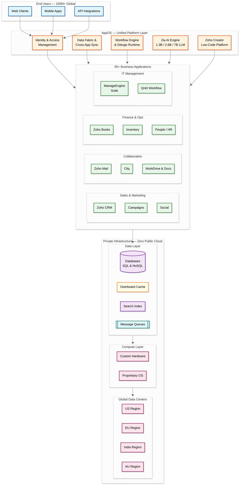

# 6.5 Zoho Suite — Vertically-Integrated Multi-Product SaaS Platform

## System Overview

Zoho is a vertically-integrated multi-product SaaS platform offering 55+ business applications spanning CRM, finance, HR, collaboration, IT management, and custom development. With 1M+ paying customers, 150M+ users globally, and $1B+ in annual revenue, Zoho is bootstrapped and privately held across 30 years of operation. What makes Zoho architecturally extraordinary is its complete ownership of the technology stack — from custom hardware and proprietary OS through the platform layer, application layer, and AI models — with zero dependency on public cloud providers (AWS, GCP, Azure). The entire platform runs in Zoho's private data centers worldwide. Key brands include Zoho (business apps), ManageEngine (IT management), Qntrl (workflow orchestration), and TrainerCentral (learning).

## Key Characteristics

| Characteristic | Description |
|---|---|
| **Workload Type** | Mixed — OLTP (CRM, mail, invoicing), collaboration (docs, chat), analytics (reports, dashboards), AI inference (Zia) |
| **Integration Model** | Unified AppOS platform connecting 55+ products through shared identity, data, and workflow layers |
| **Infrastructure** | Fully private — custom hardware, proprietary OS, no public cloud dependency |
| **AI Strategy** | AI-native with proprietary Zia LLM (1.3B, 2.6B, 7B parameter variants) trained on-premise |
| **Extensibility** | Proprietary scripting language (Deluge) connecting 48+ products; low-code platform (Zoho Creator) |
| **Privacy Model** | Privacy-first with regional data residency across global data centers |
| **Tenancy** | Multi-tenant with strict per-customer data isolation and regional compliance |
| **Complexity Rating** | **Very High** |

## Quick Navigation

| # | Document | Description |
|---|---|---|
| 01 | [Requirements & Estimations](./01-requirements-and-estimations.md) | Functional/non-functional requirements, capacity planning, SLOs |
| 02 | [High-Level Design](./02-high-level-design.md) | Architecture diagrams, data flow, key decisions |
| 03 | [Low-Level Design](./03-low-level-design.md) | Data model, API design, algorithms (pseudocode) |
| 04 | [Deep Dive & Bottlenecks](./04-deep-dive-and-bottlenecks.md) | AppOS internals, Zia LLM serving, cross-product data flow |
| 05 | [Scalability & Reliability](./05-scalability-and-reliability.md) | Scaling strategies, fault tolerance, disaster recovery |
| 06 | [Security & Compliance](./06-security-and-compliance.md) | Threat model, AuthN/AuthZ, data residency, privacy compliance |
| 07 | [Observability](./07-observability.md) | Metrics, logging, tracing, alerting |
| 08 | [Interview Guide](./08-interview-guide.md) | 45-min pacing, trap questions, trade-offs |

## What Makes Zoho Unique

1. **Full Stack Ownership**: Zoho owns the entire stack from custom silicon-level hardware through proprietary OS, platform runtime, all 55+ applications, and AI models — the only major SaaS vendor with zero public cloud dependency
2. **AppOS Unified Platform**: A shared platform layer (identity, data fabric, workflow engine, UI components) that enables deep cross-product integration — a CRM deal closing can auto-trigger invoicing in Zoho Books, update projects in Zoho Projects, and notify teams in Zoho Cliq
3. **Proprietary Zia LLM**: On-premise trained language models (1.3B, 2.6B, 7B parameters) embedded across all products — no customer data leaves Zoho infrastructure for AI processing
4. **Deluge Scripting Language**: A proprietary domain-specific language designed specifically for SaaS automation, connecting 48+ products through a unified scripting runtime
5. **Bootstrapped Scale**: Achieving $1B+ revenue and 150M+ users without venture capital or acquisition-driven growth, enabling long-term architectural decisions without short-term market pressures

## Product Ecosystem Overview

## Product Categories

| Category | Products | Purpose |
|---|---|---|
| **Sales & Marketing** | CRM, Campaigns, Social, SalesIQ, MarketingHub | Lead-to-revenue pipeline, marketing automation, social engagement |
| **Collaboration** | Mail, Cliq, WorkDrive, Writer, Sheet, Show, Connect | Communication, document creation, team collaboration |
| **Finance & Operations** | Books, Invoice, Inventory, Expense, Checkout | Accounting, invoicing, inventory management, payments |
| **HR & People** | People, Recruit, Payroll, Shifts | Human resources, recruitment, payroll processing |
| **Customer Service** | Desk, Assist, Lens | Helpdesk, remote support, AR-assisted service |
| **IT Management** | ManageEngine (50+ tools), Qntrl | Endpoint management, network monitoring, workflow orchestration |
| **Development** | Creator, Flow, Catalyst, Apptics | Low-code apps, integration workflows, serverless functions, app analytics |
| **Business Intelligence** | Analytics, DataPrep, Embedded BI | Dashboards, data transformation, embedded reporting |
| **AI & Automation** | Zia (cross-product), Deluge scripting | AI predictions, NLP, anomaly detection, cross-product automation |
| **Learning** | TrainerCentral, Learn | Online course creation, corporate LMS |

## Key Numbers

| Metric | Value |
|---|---|
| Paying Customers | 1M+ |
| Global Users | 150M+ |
| Annual Revenue | $1B+ |
| Business Applications | 55+ |
| Years of Operation | 30 |
| Deluge-Connected Products | 48+ |
| Zia LLM Variants | 1.3B, 2.6B, 7B parameters |
| Key Brands | Zoho, ManageEngine, Qntrl, TrainerCentral |
| Public Cloud Dependency | None — fully private infrastructure |

## References

- [Zoho's Technology Stack — Full Vertical Integration](https://www.zoho.com/general/technology-stack.html)
- [Building Zia: Zoho's AI Assistant](https://www.zoho.com/zia/)
- [Zoho Creator — Low-Code Platform](https://www.zoho.com/creator/)
- [Deluge Scripting Language Documentation](https://www.zoho.com/deluge/)
- [Zoho Privacy Commitment & Data Centers](https://www.zoho.com/privacy-commitment.html)
- [ManageEngine IT Management Suite](https://www.manageengine.com/)
- [Qntrl Workflow Orchestration](https://www.qntrl.com/)
