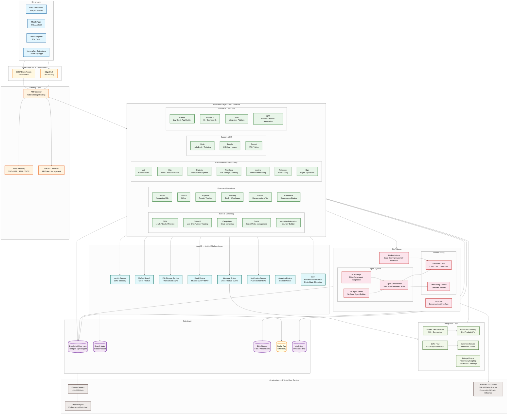
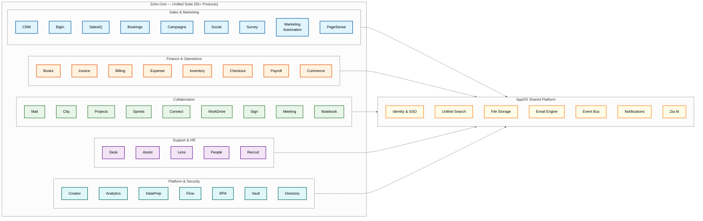
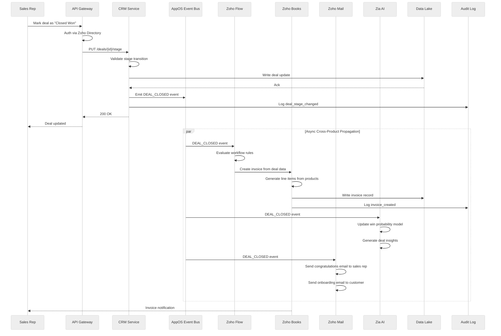
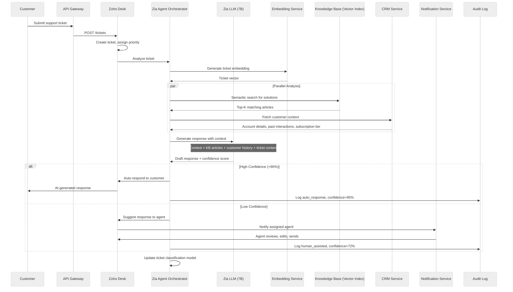
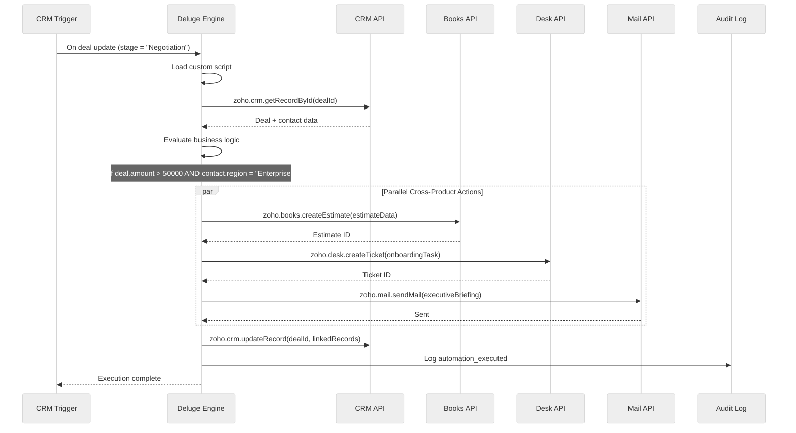
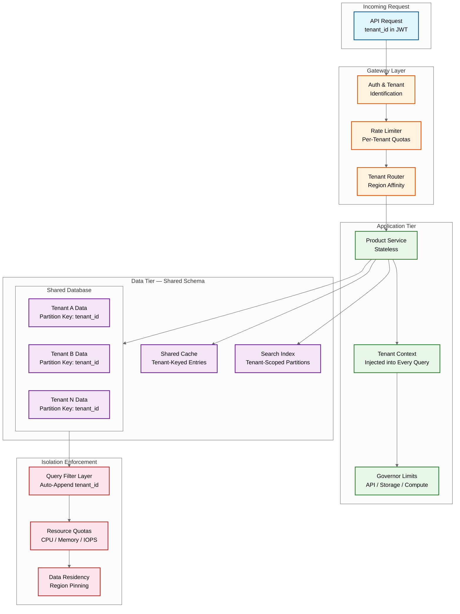

# High-Level Design

[Back to Index](./00-index.md)

---

## System Architecture Overview

Zoho Suite is architecturally distinctive because of its **vertically integrated stack**: Zoho owns and operates every layer from custom server hardware through the operating system, platform services (AppOS), all 55+ applications, and even its own AI models. There is no public cloud dependency. This is the antithesis of the cloud-native movement and represents the most aggressive vertical integration in enterprise SaaS.

### Architecture Layers

| Layer | Responsibility | Key Components |
|-------|---------------|----------------|
| **Client Layer** | User interfaces across web, mobile, desktop | SPA web apps, native mobile apps, desktop agents, Zoho Marketplace extensions |
| **Edge Layer** | Global content delivery, DDoS protection | CDN (18 data centers), edge DNS, TLS termination |
| **Gateway Layer** | Authentication, routing, rate limiting | API Gateway, Zoho Directory (SSO/MFA), OAuth server |
| **Application Layer** | 55+ product modules organized by domain | CRM, Mail, Books, Desk, Projects, Creator, etc. (modular monoliths) |
| **AppOS Platform Layer** | Shared services consumed by all products | Identity, Search, File Storage, Email, Messaging, Analytics, Notifications |
| **Zia AI Layer** | AI/ML inference, agent orchestration | Proprietary LLMs (1.3B-7B params), 700+ agent skills, Zia Agent Studio |
| **Integration Layer** | Cross-product and external connectivity | Zoho Flow, Deluge scripting, UDS (500+ connectors), REST APIs |
| **Data Layer** | Persistent storage with tenant isolation | Distributed data lake (Postgres-style), search indexes, blob storage, caches |
| **Infrastructure Layer** | Physical compute, network, power | Custom-designed servers (~10,000 units), proprietary OS, NVIDIA GPU clusters |

---

## Complete System Architecture



---

## Product Ecosystem Map



---

## Data Flow: Cross-Product Request

### Flow 1: CRM Deal Closure Triggering Invoice Generation

This flow illustrates the core value of vertical integration -- a single business event crosses product boundaries seamlessly through AppOS shared services.



### Flow 2: AI-Powered Customer Support with Zia



### Flow 3: Deluge Custom Automation (Cross-Product Scripting)



---

## Component Overview

### Application Layer (55+ Products as Modular Monoliths)

Each Zoho product is a **modular monolith** -- a single deployable unit with well-defined internal module boundaries. Products share no application-level code with each other; all cross-product communication flows through AppOS platform services.

| Product Domain | Key Products | Primary Data Pattern | Scale Characteristics |
|---------------|-------------|---------------------|----------------------|
| **Sales** | CRM, Bigin, SalesIQ, Bookings | Read-heavy (10:1), real-time pipeline views | High concurrency on contact/deal reads, webhook bursts |
| **Marketing** | Campaigns, Social, Marketing Automation | Write-heavy during sends, read-heavy for analytics | Batch email sends (millions/hour), event tracking ingestion |
| **Finance** | Books, Invoice, Expense, Inventory, Payroll | Write-heavy with strong consistency | ACID transactions, double-entry enforcement, regulatory holds |
| **Collaboration** | Mail, Cliq, Projects, WorkDrive, Meeting | Real-time bidirectional, presence-heavy | WebSocket connections, file sync, IMAP/SMTP throughput |
| **Support** | Desk, Assist, Lens | Mixed read/write, SLA-driven | Ticket routing, real-time remote access, AR overlays |
| **Platform** | Creator, Analytics, Flow, RPA | Schema-flexible, event-driven | Dynamic schema execution, connector fan-out, bot scheduling |

### AppOS Platform Layer

| Component | Responsibility | Consumers | Technology Pattern |
|-----------|---------------|-----------|-------------------|
| **Zoho Directory** | SSO, MFA, SAML/OIDC, user provisioning, SCIM | All 55+ products | Centralized identity, token-based session propagation |
| **Unified Search** | Cross-product full-text and semantic search | All products with searchable data | Inverted index + vector embeddings, per-tenant indexing |
| **File Storage Service** | File upload, versioning, sharing, preview | WorkDrive, Mail, Desk, Projects, CRM | Blob storage with metadata in data lake, CDN-backed delivery |
| **Email Engine** | Shared SMTP/IMAP, compose, deliver, track | Mail, Campaigns, CRM, Desk, Books | Queue-based delivery, IP reputation management, SPF/DKIM/DMARC |
| **Message Broker** | Cross-product event bus, pub/sub | All products emitting business events | Topic-based routing, at-least-once delivery, tenant-scoped partitions |
| **Notification Service** | Push, email, SMS, in-app notifications | All products | Multi-channel delivery, user preference engine, batching |
| **Analytics Engine** | Unified metrics, dashboards, embedded BI | Analytics product + embedded in all products | OLAP engine over data lake, materialized views |
| **Qntrl (Process Orchestration)** | Workflow orchestration via finite-state machine blueprints | Cross-product business processes | State machine executor, approval routing, SLA enforcement |

### Zia AI Layer

| Component | Responsibility | Scale | Technology |
|-----------|---------------|-------|------------|
| **Zia LLM Cluster** | Text generation, summarization, Q&A across all products | Models: 1.3B, 2.6B, 7B parameters | Proprietary GPT-3-style architecture, trained on 2T-4T tokens using 128 H100s over 50 days |
| **Embedding Service** | Text-to-vector conversion for semantic search and RAG | All products with search/recommendation | Shared embedding models, per-tenant vector namespaces |
| **Agent Orchestrator** | Route tasks to specialized agent skills | 700+ pre-configured skills across products | Skill registry, context injection, tool-use patterns |
| **Zia Agent Studio** | No-code agent builder for custom automations | Creator, CRM, Desk (power users) | Visual flow editor, skill composition, testing sandbox |
| **MCP Bridge** | Third-party agent integration via Model Context Protocol | External AI agents connecting to Zoho data | Standardized context protocol, auth delegation, rate limiting |
| **Zia Predictions** | Lead scoring, anomaly detection, forecasting | CRM, Books, Analytics | Classical ML + LLM-augmented, per-tenant model personalization |
| **Zia Voice** | Conversational NLU for voice and chat interfaces | SalesIQ, Desk, CRM | ASR + NLU pipeline, intent classification, slot filling |

### Integration Layer

| Component | Responsibility | Scale | Technology |
|-----------|---------------|-------|------------|
| **Unified Data Services (UDS)** | Universal cloud data model, bidirectional sync | 500+ service connectors | Canonical data model, conflict resolution, change tracking |
| **Zoho Flow** | No-code integration builder | 1,000+ app connectors, webhooks | Trigger-action model, conditional branching, error handling |
| **Deluge Engine** | Proprietary scripting runtime connecting 48+ products | Custom scripts embedded in Creator, CRM, etc. | Sandboxed execution, cross-product API bindings, 10s timeout |
| **REST API Gateway** | Per-product RESTful APIs | Every product exposes public APIs | OAuth 2.0, rate limiting (per plan), pagination |
| **Webhook Service** | Outbound event delivery to external systems | CRM, Books, Desk events | Retry with exponential backoff, delivery logging |

### Data Layer

| Component | Responsibility | Consistency | Technology |
|-----------|---------------|-------------|------------|
| **Distributed Data Lake** | Primary transactional and analytical storage | Strong (per-tenant partition) | Proprietary Postgres-style distributed engine |
| **Search Index** | Full-text and semantic search | Eventual (near real-time) | Inverted index + vector store, per-tenant isolation |
| **Blob Storage** | Files, attachments, media | Eventual | Distributed object storage on custom hardware |
| **Cache Tier** | Hot data, session state, rate limit counters | Best-effort | In-memory distributed cache, TTL-based expiry |
| **Audit Log** | Immutable compliance trail for all operations | Strong, append-only | Sequential write log, cryptographic chaining |

---

## Key Architectural Decisions

### Decision 1: Vertical Integration (Own Everything) vs Cloud-Native

| Option | Pros | Cons | Verdict |
|--------|------|------|---------|
| **Public cloud (AWS/GCP/Azure)** | Fast to start, managed services, global footprint | Vendor lock-in, margins destroyed at scale, data sovereignty concerns, cost unpredictability | Not chosen |
| **Hybrid cloud** | Flexibility, burst capacity | Two operational models, complexity, still dependent on cloud pricing | Partial (edge cases) |
| **Full vertical integration** | Complete cost control, 12-18% energy efficiency gains, zero vendor dependency, ultimate data sovereignty | Massive capital expenditure, slow global expansion, must build every service internally | **Chosen** |

**Rationale**: At Zoho's scale (100M+ users, 55+ products), owning the stack is an **economic moat**. The per-user cost drops dramatically when hardware is amortized over a decade. Custom servers optimized for performance-per-watt deliver 12-18% energy savings. No cloud vendor can revoke access, change pricing, or impose data residency constraints. The trade-off is slower geographic expansion (building data centers takes years vs. clicking a region in AWS), which Zoho accepts because its customer base grows more gradually than hypergrowth startups.

### Decision 2: Modular Monolith Per Product vs Microservices

| Option | Pros | Cons | Verdict |
|--------|------|------|---------|
| **Pure microservices** | Independent deployment, technology diversity, fine-grained scaling | Network overhead, distributed transactions, operational complexity, debugging difficulty | Not chosen |
| **Single monolith for entire suite** | Simple deployment, easy cross-feature calls | Deployment coupling, team coordination nightmare at 55+ products, single point of failure | Not chosen |
| **Modular monolith per product** | Strong module boundaries within a single deployable, team autonomy per product, simple local debugging | Cross-product communication requires platform services, module boundaries can erode | **Chosen** |

**Rationale**: Each Zoho product (CRM, Books, Desk, etc.) is developed by an independent team and deployed as a single unit. Internal modules within a product communicate via in-process calls (fast, transactional). Cross-product communication always goes through AppOS shared services (event bus, APIs), enforcing clean boundaries. This avoids the "distributed monolith" anti-pattern where microservices are tightly coupled over the network, while still allowing each product team to ship independently.

### Decision 3: Shared-Everything Multi-Tenancy vs Isolated Tenancy

| Option | Pros | Cons | Verdict |
|--------|------|------|---------|
| **Database per tenant** | Maximum isolation, simple tenant deletion | Extremely expensive at scale, connection pool explosion, migration overhead | Not viable for 100M+ users |
| **Schema per tenant** | Good isolation, moderate cost | Schema proliferation, DDL locks during migration | Not viable at scale |
| **Shared database, shared schema** | Maximum cost efficiency, simple operations, easy feature rollout | Noisy neighbor risk, complex tenant isolation logic, governor limits required | **Chosen** |

**Rationale**: With 100M+ users across free and paid tiers, shared-everything is the only economically viable model. Tenant isolation is enforced at the application layer through tenant ID propagation in every query, governor limits (API rate limits, storage quotas, compute budgets per tenant), and strict access control. The data lake partitions data by tenant ID for query isolation. The trade-off is that a misbehaving tenant can theoretically affect neighbors, mitigated by per-tenant resource governors and priority queuing for paid tiers.

### Decision 4: Proprietary Scripting Language (Deluge) vs General-Purpose Languages

| Option | Pros | Cons | Verdict |
|--------|------|------|---------|
| **General-purpose (JavaScript/Python)** | Large developer pool, rich ecosystem, familiar syntax | Security sandboxing is hard, unbounded execution, difficult to constrain resource usage | Not chosen as primary |
| **Proprietary scripting (Deluge)** | Purpose-built for Zoho context, built-in cross-product API bindings, enforced execution limits, safe sandboxing | Small developer pool, learning curve, limited ecosystem | **Chosen** |

**Rationale**: Deluge is not a general-purpose language -- it is a **domain-specific glue language** designed to connect Zoho products. Every Deluge statement like `zoho.crm.getRecordById()` or `zoho.books.createInvoice()` is a first-class operation with built-in auth propagation, error handling, and rate limiting. Execution is sandboxed with a 10-second timeout and memory limits, preventing runaway scripts. The trade-off is a smaller developer community, partially offset by Zoho's investment in documentation and the Creator low-code platform which generates Deluge under the hood.

### Decision 5: Proprietary AI Models vs Third-Party LLMs

| Option | Pros | Cons | Verdict |
|--------|------|------|---------|
| **Third-party LLMs (OpenAI, Anthropic)** | State-of-the-art models, no training infrastructure | Data leaves premises, per-token cost at scale, vendor dependency, latency | Not chosen as primary |
| **Fine-tuned open-source (Llama, Mistral)** | Good quality, no training from scratch | Still requires GPU infrastructure, model updates lag, licensing constraints | Supplementary option |
| **Proprietary LLMs (trained from scratch)** | Full data sovereignty, optimized for Zoho context, zero per-token cost at scale, no vendor dependency | Massive training investment (128 H100s, 50 days), smaller models than frontier | **Chosen** |

**Rationale**: Consistent with vertical integration philosophy. Training 1.3B, 2.6B, and 7B parameter models on 2T-4T tokens gives Zoho models specifically tuned for business SaaS contexts (CRM conversations, financial documents, support tickets). Running inference on commodity GPUs in private data centers means zero per-token cost after infrastructure investment. The models are smaller than frontier LLMs but sufficient for the structured tasks Zoho needs (summarization, classification, extraction, Q&A). For tasks requiring frontier capability, Zoho supports third-party model routing through the MCP bridge as an escape hatch.

---

## Architecture Pattern Checklist

| Pattern | Decision | Rationale |
|---------|----------|-----------|
| **Sync vs Async** | **Sync** for user-facing CRUD APIs; **Async** for cross-product events via message broker | Users expect immediate confirmation on CRM updates; cross-product propagation (deal closed -> invoice created) can tolerate seconds of delay |
| **Event-driven vs Request-response** | **Event-driven** for inter-product communication (AppOS event bus); **Request-response** for client-facing APIs and Deluge script calls | Event bus decouples 55+ products from each other; REST APIs provide the simple request-response contract external developers expect |
| **Push vs Pull** | **Push** for real-time notifications, chat (Cliq), and presence; **Pull** for data queries, reports, and search | Chat and notifications must be instant (WebSocket push); reports and dashboards are on-demand (user-initiated pull) |
| **Stateless vs Stateful** | **Stateless** application services (all 55+ products); **Stateful** data layer and AI agent sessions | Stateless services scale horizontally behind load balancers; state lives in the data lake and cache tier; agent sessions maintain conversation context |
| **Read-heavy vs Write-heavy** | **Read-heavy** for most products (10:1 ratio for CRM, Desk, Projects); **Write-heavy** for Mail ingestion and analytics event tracking | Cache tier and read replicas optimize the common read path; write-heavy paths use append-only patterns and async processing |
| **Real-time vs Batch** | **Real-time** for CRM, Chat (Cliq), SalesIQ live tracking; **Batch** for analytics aggregation, Campaigns email sends, payroll calculations | User-facing interactions require sub-second response; analytics and bulk operations benefit from batching for throughput |
| **Edge vs Origin** | **Edge** for static content (CDN), DNS routing; **Origin** for all dynamic business logic | Static assets benefit from proximity to users; business logic requires access to the data lake which lives in origin data centers |

---

## Multi-Tenant Architecture



### Tenant Isolation Mechanisms

| Mechanism | Layer | Description |
|-----------|-------|-------------|
| **JWT Tenant Propagation** | Gateway | Every authenticated request carries `tenant_id` in the JWT; no request can proceed without it |
| **Auto-Appended Query Filter** | Data Access | All database queries are rewritten to include `WHERE tenant_id = ?` -- application code cannot bypass this |
| **Per-Tenant Rate Limits** | Gateway | API rate limits, storage quotas, and compute budgets enforced per tenant and per plan tier |
| **Governor Limits** | Application | Maximum records per module, maximum automation runs per day, maximum API calls per day (varies by plan) |
| **Data Residency Pinning** | Data | Tenant data is pinned to a specific data center region; queries never cross region boundaries |
| **Noisy Neighbor Protection** | Infrastructure | Priority queuing for paid tiers; resource throttling for free-tier tenants during peak load |

---

## Global Data Center Topology

| Region | Location | Role | Products Hosted | Special Capabilities |
|--------|----------|------|----------------|---------------------|
| **US** | Multiple US locations | Primary Americas | All 55+ products | Full GPU cluster for AI training + inference |
| **India (Chennai)** | Chennai | Primary India | All 55+ products | Headquarters, largest engineering presence |
| **India (Mumbai)** | Mumbai | India HA / Financial services | All 55+ products | Low-latency for Indian fintech customers |
| **India (Hyderabad)** | Hyderabad | India DR / Overflow | All 55+ products | Disaster recovery for India region |
| **EU** | Europe | Primary EU | All 55+ products | GDPR-compliant, data never leaves EU |
| **UK** | United Kingdom | Primary UK | All 55+ products | Post-Brexit UK data residency |
| **Australia** | Australia | Primary APAC-South | All 55+ products | Australian data sovereignty |
| **UAE** | UAE (multiple) | Primary Middle East | All 55+ products | UAE data residency compliance |
| **Other** | Expanding to 18 locations | Regional coverage | Varies | Custom servers rolling out globally |

### Regional Routing Strategy

| Tenant Region | Primary DC | Failover DC | AI Inference | Data Residency Law |
|--------------|-----------|-------------|--------------|-------------------|
| Americas | US | US (secondary) | Same region | SOC 2, HIPAA |
| India | Chennai / Mumbai | Hyderabad | Same region | DPDP Act 2023 |
| Europe | EU | EU (secondary) | Same region | GDPR |
| United Kingdom | UK | EU (with consent) | Same region | UK GDPR |
| Australia | Australia | Singapore (metadata only) | Same region | Privacy Act 1988 |
| Middle East | UAE | UAE (secondary) | Same region | UAE PDPL |

---

## Failure Modes and Mitigations

| Failure Mode | Detection | Mitigation | Recovery Time |
|--------------|-----------|------------|---------------|
| **Single product service crash** | Health checks, error rate spike | Auto-restart, traffic reroute to healthy instances; other products unaffected (monolith isolation) | < 30 seconds |
| **AppOS event bus partition failure** | Consumer lag, publish timeouts | Failover to replica partition; cross-product events queued and replayed | < 1 minute |
| **Data lake primary failure** | Replication lag, connection errors | Automatic failover to synchronous replica | < 30 seconds |
| **GPU cluster failure (AI inference)** | Inference timeouts, queue growth | Graceful degradation: disable AI features, fall back to rule-based logic | < 2 minutes |
| **Cache tier failure** | Cache miss rate spike, latency increase | Bypass cache, serve from data lake (higher latency but functional) | Immediate (degraded) |
| **Search index corruption** | Search result quality drop, index lag | Rebuild index from data lake source of truth | 10-60 minutes |
| **Zoho Directory outage** | Authentication failures | Cached session tokens continue working; new logins blocked | < 5 minutes |
| **Regional data center outage** | Multi-DC health checks, DNS failures | DNS failover to DR region; data residency preserved via region pairing | < 10 minutes |
| **Deluge script timeout** | Execution exceeds 10s limit | Script killed, error returned to caller, retry with backoff | Immediate |
| **Noisy tenant overload** | Per-tenant metrics exceeding thresholds | Automatic throttling, governor limits enforced, priority given to paid tiers | Immediate |

---

## Graceful Degradation Levels

```
Level 0: Full Operation
├── All 55+ products operational
├── Zia AI fully available (LLM + agents + predictions)
├── Cross-product integrations active (Flow, Deluge, event bus)
├── Real-time features operational (Cliq chat, SalesIQ, Meeting)
└── Full analytics and reporting

Level 1: AI Degraded
├── All products fully operational
├── Zia inference queued (higher latency, 5-10s vs 1-2s)
├── Agent skills paused, manual workflows active
├── Predictions serving stale scores
└── Search falls back to keyword-only (no semantic)

Level 2: AI Unavailable
├── All products fully operational
├── Zia features disabled across suite
├── Lead scoring uses last-computed values
├── Support ticket classification manual only
├── Search keyword-only
└── Deluge scripts and Flow automations still active

Level 3: Cross-Product Degraded
├── Individual products operational in isolation
├── Event bus down: no cross-product propagation
├── Flow and Deluge integrations paused
├── Products function as standalone tools
└── Data eventually consistent when bus recovers

Level 4: Read-Only Mode
├── No new records or transactions
├── Read access to all existing data
├── Reports from cached/materialized views
├── Email delivery paused, queued
└── Used during major maintenance or migration

Level 5: Emergency Mode
├── Critical reads only (account status, balances, ticket status)
├── Authentication still functional (cached sessions)
├── Status page updates
├── SMS/email alerts to affected customers
└── Used during regional data center outage
```

---

## Technology Stack (Reference)

| Layer | Technology | Selection Criteria |
|-------|-----------|-------------------|
| **API Gateway** | Custom-built (on proprietary stack) | Deep integration with Zoho Directory, per-product routing, no external dependency |
| **Identity** | Zoho Directory | SSO, MFA, SAML, OIDC, SCIM -- shared across all 55+ products |
| **Application Runtime** | Proprietary (Java-based stack) | Optimized for AppOS platform services, custom class loading |
| **Scripting Engine** | Deluge (proprietary) | Sandboxed, cross-product API bindings, 10s execution limit |
| **Low-Code Platform** | Zoho Creator | Drag-and-drop with Deluge code generation underneath |
| **AI / LLM** | Proprietary models (1.3B-7B) on NVIDIA GPUs | Trained from scratch for business SaaS context, no external API dependency |
| **Primary Database** | Proprietary distributed data lake (Postgres-style) | ACID transactions, horizontal sharding, tenant-partitioned |
| **Search** | Custom inverted index + vector store | Full-text + semantic search, tenant-scoped |
| **Blob Storage** | Custom distributed object storage | On custom hardware, CDN-backed delivery |
| **Cache** | In-memory distributed cache | Sub-millisecond reads, TTL-based expiry |
| **Message Broker** | Custom event bus | Topic-based pub/sub, at-least-once delivery, tenant-scoped partitions |
| **Process Orchestration** | Qntrl (finite-state machine engine) | Blueprint-based workflows, approval routing, SLA enforcement |
| **Integration** | Zoho Flow + UDS | 1,000+ connectors, webhooks, canonical data model |
| **Hardware** | Custom-designed servers (~10,000 units) | Performance-per-watt optimized, 12-18% energy savings |
| **Operating System** | Proprietary OS | Optimized for Zoho workloads, minimal attack surface |

---

## Next Steps

- [Low-Level Design](./03-low-level-design.md) - Data models, API specifications, Deluge runtime internals
