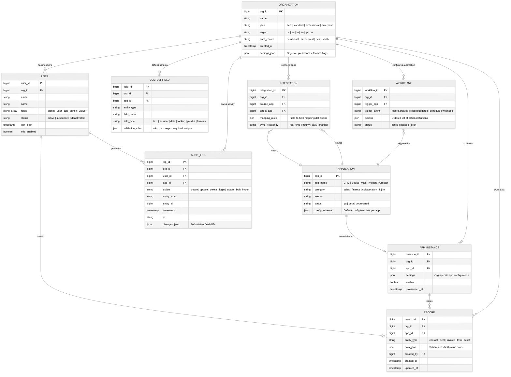
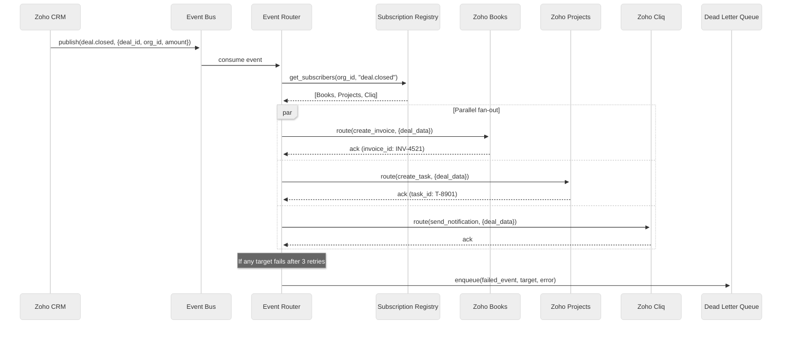
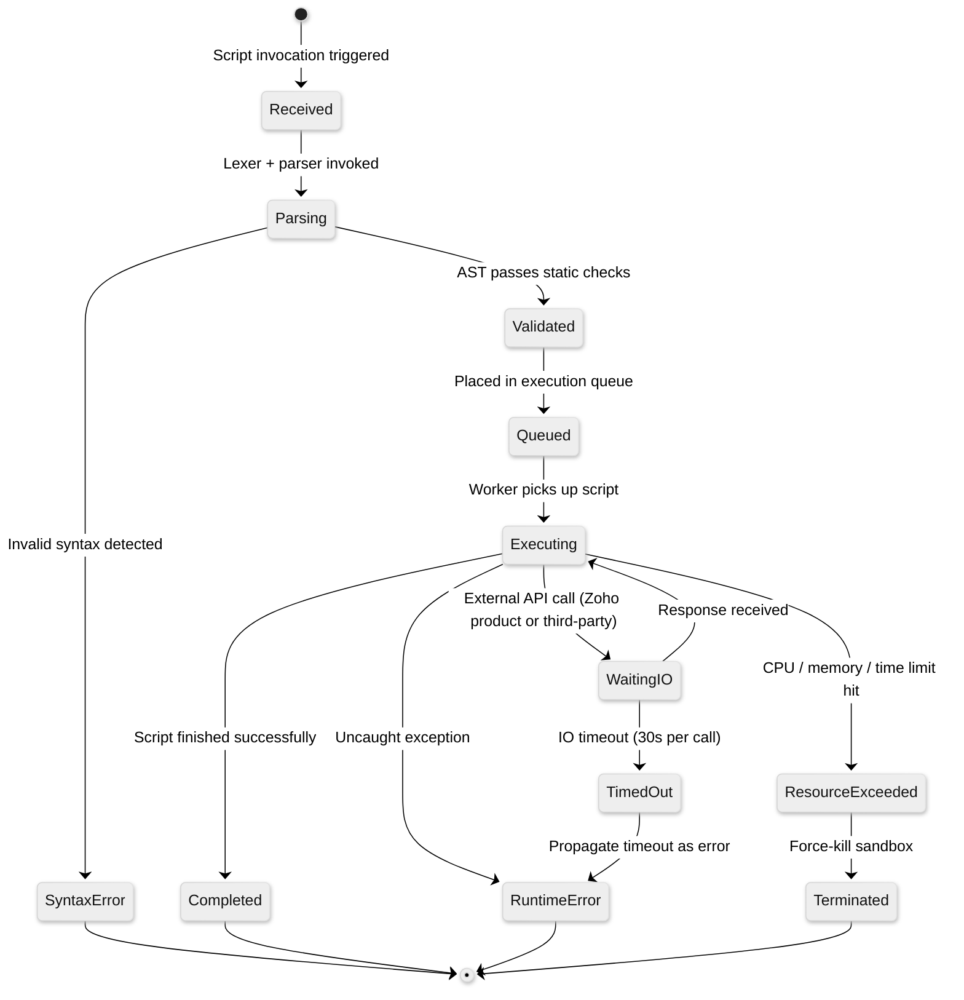
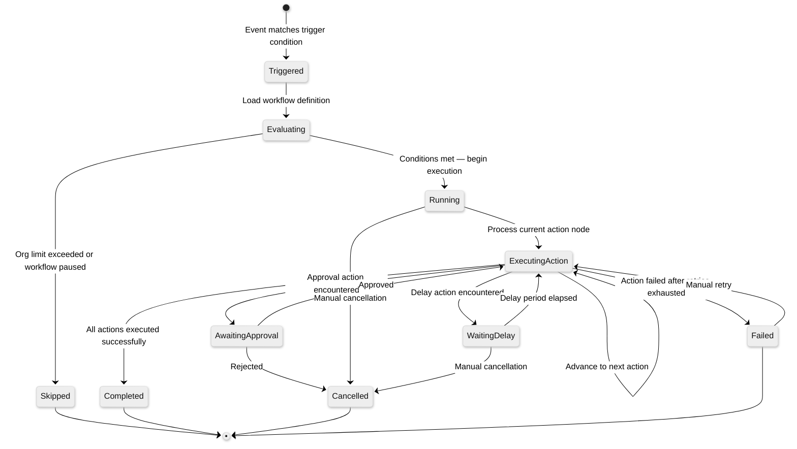
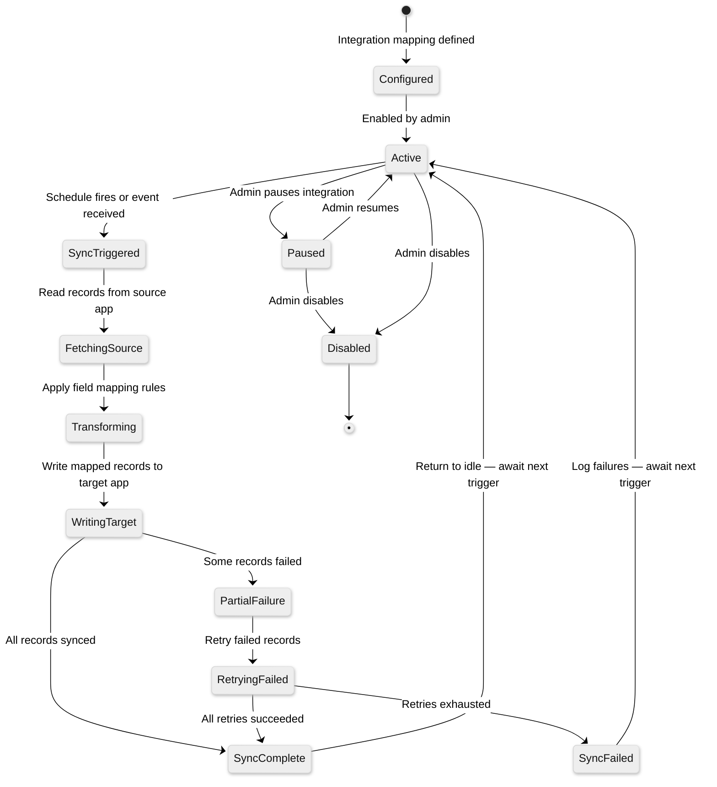

# Low-Level Design

## Data Model

### Unified Platform ER Diagram

Zoho's data model reflects a **multi-tenant, multi-product platform** where every entity is scoped by `org_id` (tenant). The `Record` entity is a generic, schema-less abstraction (similar in concept to Salesforce's SObject) that allows each product to define arbitrary entity types without DDL changes.



### Row Key Design for Record Store

The `Record` table is the highest-volume entity in the system. Records are stored in a sharded database with the following composite key design:

```
Record Primary Key:
┌──────────────┬──────────────┬──────────────┬──────────────┐
│ org_id       │ app_id       │ entity_type  │ record_id    │
│ (8 bytes)    │ (4 bytes)    │ (2 bytes)    │ (8 bytes)    │
└──────────────┴──────────────┴──────────────┴──────────────┘
Shard Key: org_id (hash partitioned)

Audit Log Key:
┌──────────────┬─────────────────────┬──────────────┐
│ org_id       │ MAX_LONG - timestamp│ log_id       │
│ (8 bytes)    │ (8 bytes)           │ (8 bytes)    │
└──────────────┴─────────────────────┴──────────────┘
Reverse timestamp enables efficient "most recent first" scans
```

**Why this design:**
- `org_id` prefix ensures all tenant data is co-located on the same shard, enforcing tenant isolation at the storage layer
- `app_id` + `entity_type` grouping within an org enables efficient per-product queries (e.g., "all CRM contacts for this org")
- `data_json` column enables schemaless storage; the `CUSTOM_FIELD` table provides validation metadata at the application layer
- Reverse timestamp on audit logs allows recent-first pagination without expensive sort operations

### Indexing Strategy

| Table / Index Type | Columns | Purpose |
|---|---|---|
| Record (primary) | `(org_id, record_id)` composite | Tenant-isolated point lookups |
| Record (secondary) | `(org_id, app_id, entity_type, created_at)` | Listing queries — all deals for an org, sorted by creation |
| Record (secondary) | `(org_id, app_id, entity_type, updated_at)` | Recently modified records for sync |
| Full-text (inverted) | `data_json` field values per `(org_id, entity_type)` | Cross-product search via SearchIQ |
| Custom Field | `(org_id, app_id, entity_type)` | Schema discovery per entity type |
| Workflow | `(org_id, status)` | List active workflows for an org |
| Workflow | `(trigger_app, trigger_event)` | Event-based workflow lookup |
| Audit Log | `(org_id, timestamp DESC)` | Recent activity feed |
| Audit Log | `(org_id, user_id, timestamp DESC)` | Per-user activity audit |
| Integration | `(org_id, source_app)` | Outbound integration lookup |
| User | `(org_id, status)` | Active user listing |
| User | `(email)` unique | Login resolution |

### Partitioning and Retention

| Aspect | Strategy |
|---|---|
| **Shard key** | Hash partition by `org_id` — all data for one tenant co-located |
| **Shard count** | Dynamic — auto-split when shard exceeds 256 GB |
| **Cross-shard queries** | Scatter-gather via query coordinator (used for admin analytics only) |
| **Data retention** | Configurable per org (default 5 years, compliance-driven) |
| **Archival** | Records older than retention window moved to cold storage (compressed columnar format) |
| **Soft delete** | All entities use soft delete with `deleted_at` timestamp; hard purge after 30 days |
| **Backup** | Continuous WAL streaming + daily full snapshots per shard |

---

## API Design

### 1. Unified Identity API (Zoho Directory)

```
# OAuth2 Authentication
POST   /api/v2/auth/token              -- OAuth2 token exchange (authorization_code, client_credentials)
POST   /api/v2/auth/refresh             -- Refresh access token
POST   /api/v2/auth/revoke              -- Revoke token

# Directory Management
GET    /api/v2/directory/users           -- List org users (paginated, filterable)
POST   /api/v2/directory/users           -- Create user
GET    /api/v2/directory/users/{id}      -- Get user details
PATCH  /api/v2/directory/users/{id}      -- Update user
DELETE /api/v2/directory/users/{id}      -- Deactivate user (soft delete)

# Role & Permission Management
GET    /api/v2/directory/roles           -- List roles
POST   /api/v2/directory/roles           -- Create custom role
PUT    /api/v2/directory/users/{id}/roles -- Assign roles to user
```

**Token Exchange Request:**

```
POST /api/v2/auth/token
{
  "grant_type": "authorization_code",
  "client_id": "1000.XXXXXX",
  "client_secret": "abcdef123456",
  "code": "1000.auth_code_here",
  "redirect_uri": "https://app.example.com/callback",
  "scope": "ZohoCRM.modules.ALL,ZohoBooks.fullaccess.all"
}

Response:
{
  "access_token": "1000.xxxx.yyyy",
  "refresh_token": "1000.rrrr.ssss",
  "token_type": "Bearer",
  "expires_in": 3600,
  "scope": "ZohoCRM.modules.ALL ZohoBooks.fullaccess.all",
  "api_domain": "https://www.zohoapis.com"
}
```

### 2. Cross-Product Data API (Unified Data Service)

```
# Record CRUD
GET    /api/v2/uds/records?app={app}&type={entity}&filter={expr}  -- List/filter records
POST   /api/v2/uds/records                                       -- Create record
GET    /api/v2/uds/records/{id}                                   -- Get record by ID
PUT    /api/v2/uds/records/{id}                                   -- Update record
DELETE /api/v2/uds/records/{id}                                   -- Soft-delete record

# Bulk Operations
POST   /api/v2/uds/bulk/import          -- Batch import (async, returns job ID)
GET    /api/v2/uds/bulk/jobs/{jobId}     -- Check import job status
GET    /api/v2/uds/bulk/jobs/{jobId}/results -- Download import results

# Schema Discovery
GET    /api/v2/uds/schema/{app}/{entity}       -- Get entity schema (built-in + custom fields)
GET    /api/v2/uds/schema/{app}/{entity}/fields -- List all fields for entity type

# Cross-Product Search (SearchIQ)
POST   /api/v2/uds/search               -- Unified search across products
```

**Filter Expression Format:**

```
GET /api/v2/uds/records?app=crm&type=contact&filter=(stage:eq:qualified AND score:gte:50)
    &fields=name,email,score
    &sort=updated_at:desc
    &page_token=abc123
    &page_size=100

Response:
{
  "data": [
    {
      "record_id": "4501234567890",
      "app_id": "crm",
      "entity_type": "contact",
      "data": {
        "name": "Jane Smith",
        "email": "jane@example.com",
        "score": 85
      },
      "created_by": "7890",
      "created_at": "2025-11-15T10:30:00Z",
      "updated_at": "2026-01-20T14:22:00Z"
    }
  ],
  "page_info": {
    "next_token": "def456",
    "has_more": true,
    "total_count": 2450
  }
}
```

**Cross-Product Search Request:**

```
POST /api/v2/uds/search
{
  "query": "Jane Smith overdue invoice",
  "apps": ["crm", "books", "desk"],          // Optional: limit to specific products
  "entity_types": ["contact", "invoice", "ticket"],
  "filters": {
    "created_after": "2025-01-01T00:00:00Z"
  },
  "highlight": true,
  "page_size": 25
}
```

### 3. Workflow API (Zoho Flow)

```
# Workflow Management
POST   /api/v2/flow/workflows              -- Create workflow
GET    /api/v2/flow/workflows              -- List workflows (filterable by status, app)
GET    /api/v2/flow/workflows/{id}         -- Get workflow definition
PATCH  /api/v2/flow/workflows/{id}         -- Update workflow
DELETE /api/v2/flow/workflows/{id}         -- Delete workflow

# Execution History
GET    /api/v2/flow/workflows/{id}/executions          -- List executions (paginated)
GET    /api/v2/flow/workflows/{id}/executions/{execId}  -- Get execution details

# Webhook Registration
POST   /api/v2/flow/webhooks               -- Register webhook endpoint
GET    /api/v2/flow/webhooks               -- List registered webhooks
DELETE /api/v2/flow/webhooks/{id}          -- Remove webhook

# Manual Trigger
POST   /api/v2/flow/workflows/{id}/trigger  -- Manually trigger workflow
```

### 4. AI API (Zia)

```
# Predictions
POST   /api/v2/zia/predict                        -- ML prediction (lead scoring, churn, etc.)
GET    /api/v2/zia/predictions/{entity}/{id}       -- Get existing predictions for a record

# AI Agents
POST   /api/v2/zia/agents/{id}/run                 -- Run AI agent with input context
GET    /api/v2/zia/agents/{id}/runs/{runId}         -- Get agent run status and output

# NLP
POST   /api/v2/zia/nlp/analyze                     -- NLP analysis (sentiment, entity extraction, intent)
POST   /api/v2/zia/nlp/summarize                    -- Text summarization

# Suggestions
GET    /api/v2/zia/suggestions/{entity}/{id}        -- Get AI suggestions for a record
POST   /api/v2/zia/suggestions/{entity}/{id}/accept -- Accept a suggestion (applies the action)
POST   /api/v2/zia/suggestions/{entity}/{id}/dismiss -- Dismiss a suggestion
```

### Rate Limiting

| Plan | Limit | Scope |
|---|---|---|
| Free | 5,000 API calls / day | Per org |
| Standard | 15,000 API calls / day | Per org |
| Professional | 25,000 API calls / day | Per org |
| Enterprise | 50,000 API calls / day | Per org |
| Per-app limit | 500 calls / minute | Per org per app |
| Bulk import | 10 concurrent jobs | Per org |
| Search (SearchIQ) | 60 calls / minute | Per org |
| Zia AI endpoints | 100 calls / hour | Per org |

### Idempotency

- **Write operations**: All `POST` and `PUT` endpoints accept `X-Idempotency-Key` header; server deduplicates within a 24-hour window using a distributed cache keyed by `(org_id, idempotency_key)`
- **Bulk imports**: Each import job is assigned a `job_id`; resubmitting the same file with the same idempotency key returns the existing job status
- **Workflow executions**: Each execution is keyed by `(workflow_id, trigger_event_id)` — the same trigger event cannot spawn duplicate executions
- **Webhooks**: Each delivery includes an `event_id`; consumers should deduplicate by event ID across retry attempts

### Versioning

- **URL-based**: `/api/v1/...`, `/api/v2/...`
- **Sunset headers**: Deprecated versions include `Sunset: Sat, 01 Mar 2027 00:00:00 GMT` and `Deprecation: true` headers
- **Breaking changes**: New major version only for breaking schema changes; additive changes (new fields, new endpoints) delivered in the current version

---

## Core Algorithms

### 1. Cross-Product Event Routing

When an event occurs in one product (e.g., a deal is closed in CRM), the event router fans it out to all subscribed products (Books creates an invoice, Projects creates a task, Cliq sends a notification, etc.).



**Pseudocode:**

```
FUNCTION route_cross_product_event(event):
    // Step 1: Validate event and extract tenant context
    org_id = event.org_id
    IF NOT is_valid_org(org_id):
        log_error("Invalid org_id in event", event)
        RETURN

    // Step 2: Look up all subscriptions for this event type in this org
    subscriptions = subscription_registry.find(
        org_id = org_id,
        event_type = event.type
    )
    // Subscriptions include: workflows, integrations, webhooks, built-in cross-product links

    // Step 3: Check governor limits for this org
    daily_count = governor.get_event_count(org_id, TODAY)
    IF daily_count >= get_org_event_limit(org_id):
        governor.throttle(org_id)
        enqueue_to_overflow(event)
        RETURN

    // Step 4: Fan out to each subscriber in parallel
    futures = []
    FOR EACH subscription IN subscriptions:
        // Determine target shard for the subscriber's app
        target_shard = shard_router.resolve(org_id, subscription.target_app)

        // Apply field mapping transformations
        mapped_payload = apply_mapping(event.payload, subscription.mapping_rules)

        // Dispatch asynchronously
        future = async_dispatch(
            target_app = subscription.target_app,
            target_shard = target_shard,
            action = subscription.action,
            payload = mapped_payload,
            idempotency_key = event.event_id + ":" + subscription.subscription_id
        )
        futures.append((subscription, future))

    // Step 5: Collect results and handle failures
    FOR EACH (subscription, future) IN futures:
        result = future.await(timeout = 30_SECONDS)

        IF result.status == SUCCESS:
            audit_log.record(org_id, event, subscription, "delivered")
            governor.increment_event_count(org_id)
        ELSE IF result.attempt < MAX_RETRIES:  // MAX_RETRIES = 3
            retry_queue.enqueue(event, subscription, result.attempt + 1,
                backoff = exponential_backoff(result.attempt))
        ELSE:
            dead_letter_queue.enqueue(event, subscription, result.error)
            alert_service.notify(org_id, "event_delivery_failed", subscription)

// Time complexity: O(S) where S = number of subscriptions for this event
// Fan-out is parallel; total latency = max(individual delivery latencies)
// Governor limits: Configurable per plan (Standard: 10K events/day, Enterprise: 100K/day)
```

### 2. Multi-Tenant Record Resolution

Every API request must resolve the tenant, enforce governor limits, and route to the correct database shard. This is the critical hot path for all data operations.

```
FUNCTION resolve_and_route(request):
    // Step 1: Extract and validate tenant from JWT
    token = request.headers["Authorization"].strip_prefix("Bearer ")
    claims = jwt.verify(token, public_key_set)
    org_id = claims.org_id
    user_id = claims.user_id
    scopes = claims.scopes

    // Step 2: Check org status (cached with 60s TTL)
    org = org_cache.get_or_load(org_id, loader = org_store.fetch)
    IF org.status == "suspended":
        RETURN 403, {"error": "Organization suspended"}
    IF org.status == "deactivated":
        RETURN 410, {"error": "Organization deactivated"}

    // Step 3: Validate app access and permissions
    app_id = resolve_app_from_path(request.path)
    instance = app_instance_cache.get(org_id, app_id)
    IF instance IS NULL OR NOT instance.enabled:
        RETURN 403, {"error": "Application not provisioned for this organization"}

    IF NOT has_permission(user_id, org_id, app_id, request.method, request.resource):
        RETURN 403, {"error": "Insufficient permissions"}

    // Step 4: Enforce governor limits
    limits = governor_limits.get(org.plan, app_id)
    current_usage = rate_limiter.check(org_id, app_id, [
        {limit: limits.per_minute, window: "1min"},
        {limit: limits.per_day, window: "1day"}
    ])
    IF current_usage.exceeded:
        RETURN 429, {
            "error": "Rate limit exceeded",
            "retry_after": current_usage.reset_at,
            "limit": current_usage.limit,
            "remaining": 0
        }

    // Step 5: Resolve shard for this org
    shard_id = consistent_hash(org_id, shard_ring)
    db_connection = connection_pool.get(shard_id)

    // Step 6: Set tenant context on the connection (row-level security)
    db_connection.set_context("current_org_id", org_id)

    // Step 7: Route to appropriate handler
    response = handler.execute(request, db_connection, org_id, user_id)

    // Step 8: Record audit trail (async)
    async audit_log.record(org_id, user_id, app_id, request, response)

    RETURN response

// Time complexity: O(1) for shard resolution (consistent hashing)
// Latency budget: Steps 1-6 must complete in < 5ms (all cached lookups)
// Step 7 (handler execution) is the variable-cost operation
```

### 3. Deluge Script Execution Engine

Deluge is Zoho's proprietary scripting language for cross-product automation. The execution engine must run tenant-defined scripts in a sandboxed environment with strict resource limits to prevent noisy-neighbor issues.



**Pseudocode:**

```
FUNCTION execute_deluge_script(org_id, script_source, trigger_context):
    // Step 1: Parse script into AST
    tokens = deluge_lexer.tokenize(script_source)
    ast = deluge_parser.parse(tokens)
    IF ast.errors:
        RETURN {status: "syntax_error", errors: ast.errors}

    // Step 2: Static analysis — check for forbidden operations
    static_check = static_analyzer.validate(ast, [
        "no_infinite_loops",        // Max loop iterations: 5000
        "no_system_calls",          // No OS-level operations
        "max_api_calls: 25",        // Max 25 external API calls per execution
        "max_string_length: 50000", // Prevent memory abuse
        "allowed_connectors: zoho_products + org_approved_external"
    ])
    IF static_check.violations:
        RETURN {status: "validation_error", violations: static_check.violations}

    // Step 3: Create sandboxed execution environment
    sandbox = sandbox_pool.acquire(org_id)
    sandbox.set_limits(
        max_cpu_time = 10_SECONDS,       // Wall-clock limit: 10s
        max_memory = 128_MB,             // Heap limit
        max_io_calls = 25,               // External API call limit
        max_io_timeout = 30_SECONDS,     // Per-call timeout
        max_output_size = 5_MB           // Response payload limit
    )

    // Step 4: Inject context and execute
    sandbox.set_variable("input", trigger_context)
    sandbox.set_variable("org", org_context_reader(org_id))
    sandbox.register_connectors([
        zoho_crm_connector(org_id),
        zoho_books_connector(org_id),
        zoho_mail_connector(org_id),
        http_connector(org_id, allowlist = get_org_allowlist(org_id))
    ])

    TRY:
        result = sandbox.execute(ast)
        log_execution(org_id, script_source, "completed", result.metrics)
        RETURN {status: "completed", output: result.value, metrics: result.metrics}

    CATCH ResourceExceededException as e:
        sandbox.force_terminate()
        log_execution(org_id, script_source, "resource_exceeded", e)
        RETURN {status: "terminated", reason: e.limit_type, message: e.message}

    CATCH RuntimeException as e:
        log_execution(org_id, script_source, "runtime_error", e)
        RETURN {status: "error", error: e.message, line: e.line_number}

    FINALLY:
        sandbox_pool.release(sandbox)  // Sandbox is reset and returned to pool

// Sandbox isolation: Each execution runs in a pre-warmed container with cgroups limits
// Pool size: 50 warm sandboxes per execution node; cold-start latency ~200ms
// Typical execution: 80th percentile < 500ms, 99th percentile < 3s
```

### 4. Unified Search (SearchIQ)

Cross-product search across all tenant data using inverted indices with strict tenant isolation. SearchIQ must search across CRM contacts, Books invoices, Desk tickets, Mail messages, and more in a single query.

```
FUNCTION unified_search(org_id, query, options):
    // Step 1: Parse and analyze the query
    parsed = query_analyzer.analyze(query)
    // query_analyzer uses NLP to extract:
    //   - search_terms: tokenized and stemmed keywords
    //   - entity_hints: detected entity types (e.g., "invoice" -> Books)
    //   - field_hints: detected field references (e.g., "email" -> email fields)
    //   - date_range: extracted temporal references ("last month", "Q3 2025")

    // Step 2: Determine which product indices to search
    IF options.apps IS NOT EMPTY:
        target_apps = options.apps
    ELSE IF parsed.entity_hints IS NOT EMPTY:
        target_apps = resolve_apps_for_entities(parsed.entity_hints)
    ELSE:
        target_apps = get_enabled_apps(org_id)  // Search all enabled products

    // Step 3: Build per-product search queries with tenant isolation
    search_requests = []
    FOR EACH app IN target_apps:
        index_name = "idx_" + org_id + "_" + app  // Tenant-specific index prefix
        app_query = build_app_query(parsed, app, options)

        // Apply entity-type filter if specified
        IF options.entity_types IS NOT EMPTY:
            app_query.add_filter("entity_type", IN, options.entity_types)

        // Always enforce tenant isolation at query level
        app_query.add_filter("org_id", EQUALS, org_id)

        // Apply date range if detected or specified
        IF parsed.date_range OR options.created_after:
            app_query.add_range_filter("created_at", parsed.date_range)

        search_requests.append({index: index_name, query: app_query})

    // Step 4: Execute parallel fan-out search across product indices
    raw_results = parallel_search(search_requests, timeout = 2_SECONDS)

    // Step 5: Merge and rank results across products
    merged = []
    FOR EACH (app, hits) IN raw_results:
        FOR EACH hit IN hits:
            merged.append({
                app: app,
                entity_type: hit.entity_type,
                record_id: hit.record_id,
                score: hit.relevance_score,
                snippet: hit.highlight_snippet IF options.highlight ELSE NULL,
                data: hit.stored_fields
            })

    // Cross-product ranking: blend relevance score with recency and entity priority
    ranked = rank_results(merged, factors = [
        {factor: "relevance_score", weight: 0.6},
        {factor: "recency", weight: 0.2},        // Prefer recent records
        {factor: "entity_priority", weight: 0.1}, // Prefer contacts > invoices > tickets
        {factor: "interaction_history", weight: 0.1} // Prefer frequently accessed records
    ])

    // Step 6: Apply pagination
    page = paginate(ranked, options.page_token, options.page_size)

    RETURN {
        results: page.items,
        total_count: SUM(raw_results.total_counts),
        page_info: page.metadata,
        search_metadata: {
            products_searched: target_apps,
            query_interpretation: parsed
        }
    }

FUNCTION build_app_query(parsed, app, options):
    // Build an app-specific query using the product's field mappings
    field_mappings = schema_registry.get_searchable_fields(app)

    query = new BoolQuery()
    // Must match at least one search term across searchable fields
    query.add_should(
        multi_match(parsed.search_terms, field_mappings, type = "best_fields")
    )

    // Boost exact matches on high-signal fields (email, phone, invoice number)
    FOR EACH field IN field_mappings.high_signal_fields:
        query.add_should(
            exact_match(parsed.search_terms, field, boost = 3.0)
        )

    RETURN query

// Time complexity: O(N log N) for ranking, where N = total hits across all products
// Typical latency: p50 = 80ms, p95 = 250ms, p99 = 500ms
// Index update lag: < 2 seconds from record write to searchable (near real-time)
```

---

## State Machine: Workflow Execution Lifecycle



## State Machine: Integration Sync Lifecycle


