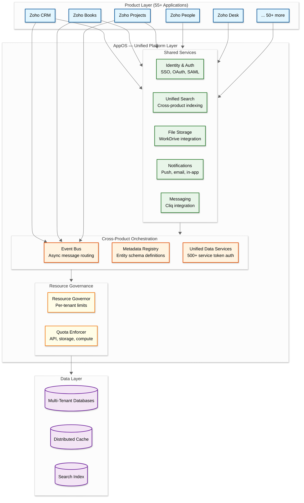
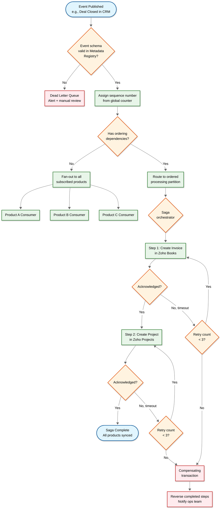
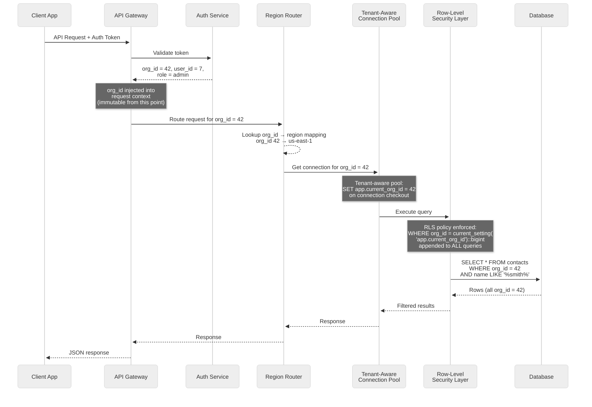

# Deep Dive & Bottlenecks

## Critical Component 1: AppOS — Unified Platform Layer

### Why This Is Critical

AppOS is the single platform layer that **55+ products** and **150M+ users** depend on. It provides shared services (identity, search, file storage, email, messaging, notifications) and cross-product data orchestration. If AppOS fails, every product in the Zoho ecosystem fails simultaneously. Unlike microservice architectures where individual services can be isolated, AppOS is the connective tissue that makes the suite function as a unified experience rather than 55 disconnected tools.

### How It Works Internally



**Cross-product event routing decision logic:**



**Key internal mechanisms:**

1. **Unified Data Services (UDS)**: Provides a universal cloud data model that authenticates tokens from 500+ services and automates API contract evaluation. Every inter-product call passes through UDS, which validates the caller's identity, checks the API contract, and routes the request.

2. **Event Bus**: Asynchronous message routing between products. When a deal closes in CRM, the event bus publishes a `deal.closed` event. Books subscribes to create an invoice. Projects subscribes to create a project. The ordering guarantee ensures Books processes before Projects when dependencies exist.

3. **Metadata Registry**: Centralized schema definitions for all entities across all products. This enables cross-product queries (e.g., "show me all contacts who have open invoices AND open support tickets") by providing a unified view of entity relationships.

4. **Resource Governor**: Enforces per-tenant limits on API calls, storage, compute, and workflow executions. Each tenant gets a fair share of resources, and the governor can throttle or queue excess requests rather than rejecting them outright.

### Failure Modes

| Failure | Impact | Mitigation |
|---|---|---|
| **Event bus saturation during bulk operations** | Cross-product sync delayed; users see stale data across products | Partitioned topics per product pair; backpressure signals to producers; overflow queues for burst absorption |
| **Metadata registry inconsistency during schema migration** | Cross-product queries return incorrect results; entity relationships break | Versioned schemas with blue-green deployment; schema changes are backward-compatible; read-path serves both old and new versions during migration |
| **Identity service goes down** | All 55+ products cannot authenticate users; complete suite outage | Multi-region active-active deployment; local auth token caching (tokens valid for 15 minutes even if identity is unreachable); circuit breaker prevents retry storms |
| **Cross-product data sync lag during high load** | Users see inconsistent state across products (deal closed in CRM but no invoice in Books) | Eventual consistency indicators in UI ("syncing..."); products can operate independently; retry queues with exponential backoff |
| **Resource governor failure** | Per-tenant limits not enforced; noisy neighbor impacts all tenants | Fail-closed mode (default to conservative limits); governor state replicated across nodes; per-product fallback governors |
| **UDS token validation failure** | Inter-product API calls rejected; products become isolated | Token caching with TTL; graceful degradation to product-local operations; circuit breaker on UDS calls |

---

## Critical Component 2: Multi-Tenant Data Isolation Engine

### Why This Is Critical

Over **1M+ organizations** share the same infrastructure. A data leak between tenants would be a catastrophic trust violation that could destroy the business. At the same time, the shared-infrastructure model is essential for cost efficiency — Zoho offers a full suite at a fraction of competitor pricing, and per-tenant infrastructure would eliminate that advantage.

### How It Works Internally



**Multi-layer isolation guarantees:**

1. **Authentication layer**: Every request must carry a valid token. The auth service extracts the `org_id` from the token and injects it into the request context. This `org_id` is immutable — no application code can modify it downstream.

2. **Data access layer (DAL)**: Every query is `org_id`-scoped. The DAL intercepts all database queries and ensures `org_id` appears in the WHERE clause. Queries without `org_id` are rejected at the DAL level before reaching the database.

3. **Row-Level Security (RLS)**: Database-level enforcement as a second line of defense. Even if the DAL is bypassed (e.g., through a bug or SQL injection), RLS policies at the database level ensure rows are only visible to the correct tenant.

4. **Tenant-aware connection pooling**: Connections are tagged with the current `org_id` on checkout. The database session variable `app.current_org_id` is set, and RLS policies reference this variable. Connections are sanitized on return to the pool.

5. **Regional routing**: Each organization's data resides in a specific data center. The region router maps `org_id` to the correct data center and routes the request accordingly. Cross-region access triggers an automated alert.

6. **Governor limits**: Per-tenant quotas on API calls (e.g., 15,000/day for free tier, 50,000/day for paid), storage (5GB free, scaled by plan), and workflow executions (500/day free, 20,000/day enterprise).

**Query plan analysis for missing org_id filters:**

```
FUNCTION validate_query_plan(query):
    plan = EXPLAIN(query)

    // Walk the plan tree looking for table scans without org_id filter
    FOR EACH node IN plan.nodes:
        IF node.type == "SeqScan" OR node.type == "IndexScan":
            IF "org_id" NOT IN node.filter_conditions:
                REJECT query
                ALERT "Query on table %s missing org_id filter", node.table
                LOG to security audit trail

    // Check for cross-tenant joins
    FOR EACH join IN plan.joins:
        IF join.left_table.org_id_filter != join.right_table.org_id_filter:
            REJECT query
            ALERT "Cross-tenant join detected"
```

### Failure Modes

| Failure | Impact | Mitigation |
|---|---|---|
| **Noisy neighbor: one tenant's heavy query impacts others** | Increased latency for co-located tenants; timeout errors | Per-tenant query timeout enforcement (30s default); tenant-level resource quotas; query cost estimation before execution; heavy tenants auto-migrated to dedicated shard |
| **Data leak via SQL injection bypassing org_id filter** | Catastrophic trust violation; regulatory exposure | Prepared statements only (no string concatenation); DAL-level org_id injection; RLS as second enforcement layer; automated penetration testing |
| **Cross-region data access due to routing error** | Data served from wrong region; potential compliance violation (GDPR) | Region mapping validated on every request; cross-region access triggers immediate alert; request rejected if region mismatch detected |
| **Governor limit bypass through API abuse** | Tenant consumes disproportionate resources; noisy neighbor effect | Rate limiting at API gateway (before reaching application); distributed counters for quota tracking; abuse detection via anomaly monitoring |
| **Connection pool poisoning (org_id not reset)** | Subsequent requests on same connection see wrong tenant's data | Connection sanitization on pool return; `RESET ALL` command on checkout; periodic connection recycling; unit tests validate pool hygiene |

---

## Critical Component 3: Zia AI Engine (Proprietary LLM + Agent Orchestration)

### Why This Is Critical

Zia is embedded across all 55+ products — CRM lead scoring, Books transaction categorization, Desk ticket routing, People hiring recommendations, and more. Bad AI means wrong predictions in CRM (wasted sales effort), incorrect financial categorizations in Books (compliance risk), and poor hiring recommendations in People (legal exposure). Unlike external AI providers, Zoho runs all inference on its own private GPU clusters, meaning infrastructure failures have no third-party fallback.

### How It Works Internally

**Tiered model architecture:**

| Tier | Model Size | Use Cases | Latency Target |
|---|---|---|---|
| **Small (SLM)** | 1.3B parameters | Receipt parsing, field extraction, simple classification | < 100ms |
| **Medium** | 2.6B parameters | Email summarization, ticket routing, sentiment analysis | < 500ms |
| **Large** | 7B parameters | Complex reasoning, multi-step analysis, code generation | < 2s |
| **Agent orchestration** | 7B + tool calls | Multi-step business workflows, cross-product actions | < 10s (multi-turn) |

**Training infrastructure**: 2T-4T tokens processed using 128 H100 GPUs over approximately 50 days. All training data sourced from Zoho's own product corpus (no customer data used for training).

**Agent orchestration pipeline:**

```
FUNCTION execute_agent_task(user_prompt, product_context):
    // Step 1: System prompt (fixed, non-editable for safety)
    system_prompt = LOAD_IMMUTABLE_PROMPT(product_context.product_id)

    // Step 2: Skill matching — 700+ pre-configured agent skills
    matched_skills = skill_registry.match(
        prompt = user_prompt,
        product = product_context.product_id,
        user_permissions = product_context.user_role
    )

    IF matched_skills IS EMPTY:
        RETURN "I can help with specific tasks. Here are suggestions..."

    // Step 3: Plan generation
    plan = model.generate_plan(
        system_prompt = system_prompt,
        user_prompt = user_prompt,
        available_skills = matched_skills,
        max_steps = 5
    )

    // Step 4: Execute with human-in-the-loop for high-stakes actions
    FOR EACH step IN plan.steps:
        IF step.skill.risk_level == "HIGH":
            // Actions like: delete records, send bulk emails, modify financials
            confirmation = REQUEST_USER_CONFIRMATION(step.description)
            IF NOT confirmation:
                RETURN "Action cancelled by user."

        result = step.skill.execute(
            parameters = step.parameters,
            org_id = product_context.org_id,   // Tenant isolation enforced
            timeout = 30_SECONDS
        )

        IF result.error:
            // Fallback to rule-based logic
            result = rule_engine.execute(step.skill.fallback_rule, step.parameters)

    RETURN plan.summarize(results)
```

**Key architectural decisions:**

1. **Fixed, non-editable system prompts**: Prevents prompt injection attacks. System prompts are code-deployed, not user-configurable, and reviewed by the security team.
2. **MCP (Model Context Protocol)**: Standard protocol enabling third-party agent integration while maintaining Zoho's security boundary.
3. **Zia Agent Studio**: No-code visual workflow builder for customers to create custom agents, constrained to pre-approved skill combinations.
4. **Private inference**: All inference runs on Zoho's GPU clusters — no customer data leaves Zoho's infrastructure. This is a key differentiator for privacy-conscious customers.

### Failure Modes

| Failure | Impact | Mitigation |
|---|---|---|
| **GPU cluster failure** | All AI features degrade across 55+ products simultaneously | Model redundancy across data centers; pre-warmed standby clusters; graceful degradation to rule-based logic (every AI feature has a deterministic fallback) |
| **Hallucination in financial/legal contexts** | Incorrect transaction categorization (compliance risk); wrong legal clause suggestion | Constrained output formats (choose from valid categories only); confidence threshold (reject below 0.85); human-in-the-loop for high-stakes outputs |
| **Agent executing incorrect business action** | Wrong records modified; incorrect emails sent; financial errors | Action confirmation before execution for HIGH-risk skills; undo capability for reversible actions; audit log of all agent actions |
| **Model serving latency spikes during peak hours** | AI features timeout; user experience degrades | Rate-limited inference queues per tenant; request prioritization (interactive > batch); auto-scaling GPU worker pools; SLM fallback for simple tasks when large model is overloaded |
| **Skill registry mismatch (agent selects wrong skill)** | Agent performs unintended action | Skill matching validated against user permissions; dry-run mode for new skill deployments; automated regression testing of skill matching accuracy |
| **Training data drift** | Model accuracy degrades over time | Continuous evaluation on held-out test sets; automated retraining triggers on accuracy drops; A/B testing of model versions |

---

## Concurrency & Race Conditions

### Race Condition 1: Cross-Product Event Ordering

**Scenario**: A deal closes in CRM, triggering both "create invoice in Books" and "create project in Projects." The invoice must exist before the project is created (the project references the invoice number).

**Risk**: If events are processed out of order, the project creation fails because the invoice does not yet exist, or the project is created without the invoice reference, requiring a manual fix.

**Solution**: Saga pattern with sequence-numbered events.

```
FUNCTION handle_deal_closed(event):
    saga_id = generate_unique_id()
    sequence = 0

    // Step 1: Create invoice (must complete first)
    publish_event(
        topic = "books.invoice.create",
        payload = event.deal_data,
        saga_id = saga_id,
        sequence = ++sequence,
        depends_on = NULL
    )

    // Step 2: Create project (depends on Step 1)
    publish_event(
        topic = "projects.project.create",
        payload = event.deal_data,
        saga_id = saga_id,
        sequence = ++sequence,
        depends_on = sequence - 1   // Wait for invoice creation
    )

    // Saga orchestrator ensures ordering
    // If Step 1 fails after retries → compensating transaction
    // If Step 2 fails → compensate by canceling invoice
```

### Race Condition 2: Simultaneous Record Edits

**Scenario**: Two users edit the same CRM contact simultaneously. User A changes the phone number. User B changes the email address. Both read version 5 of the record.

**Risk**: Last-write-wins without version checking silently drops one user's change.

**Solution**: Optimistic locking with field-level conflict resolution.

```
FUNCTION update_contact(contact_id, field, new_value, expected_version):
    current = SELECT version, fields FROM contacts
              WHERE id = contact_id AND org_id = current_org_id()

    IF current.version != expected_version:
        // Check if the conflicting write touched the SAME field
        changes_since = SELECT field, value FROM contact_audit_log
                        WHERE contact_id = contact_id
                        AND version > expected_version

        IF field NOT IN changes_since.fields:
            // Different fields changed — safe to merge
            UPDATE contacts SET field = new_value, version = current.version + 1
            RETURN SUCCESS

        // Same field changed — conflict
        RETURN CONFLICT(
            your_value = new_value,
            current_value = current.fields[field],
            changed_by = changes_since.user_id,
            changed_at = changes_since.timestamp
        )
        // UI presents conflict resolution dialog

    // No conflict — apply update
    UPDATE contacts SET field = new_value, version = expected_version + 1
    RETURN SUCCESS
```

### Race Condition 3: Workflow Execution Overlap

**Scenario**: A webhook triggers a CRM workflow. Network latency causes the webhook to be delivered twice within 500ms. Both deliveries match the workflow's enrollment criteria.

**Risk**: The workflow executes twice, sending duplicate emails or creating duplicate records.

**Solution**: Idempotency keys per workflow execution.

```
FUNCTION execute_workflow(trigger_event):
    // Generate idempotency key from trigger source + entity + timestamp bucket
    idempotency_key = hash(
        trigger_event.source,
        trigger_event.entity_id,
        trigger_event.type,
        floor(trigger_event.timestamp / 60_SECONDS)  // 1-minute bucket
    )

    // Atomic check-and-insert
    inserted = INSERT INTO workflow_executions (idempotency_key, workflow_id, status)
               VALUES (idempotency_key, workflow_id, 'running')
               ON CONFLICT (idempotency_key) DO NOTHING
               RETURNING execution_id

    IF inserted IS NULL:
        LOG "Duplicate execution detected, key=%s", idempotency_key
        RETURN ALREADY_EXECUTED

    // Proceed with workflow execution
    execute_workflow_steps(inserted.execution_id, trigger_event)
```

### Race Condition 4: Multi-Product Customer Creation

**Scenario**: A new customer is added via CRM. The system must create corresponding records in Books (for invoicing), People (for HR if applicable), and Desk (for support). These must be atomic — a customer existing in CRM but not in Books creates billing inconsistencies.

**Risk**: Partial creation across products leaves the system in an inconsistent state.

**Solution**: Saga pattern with compensating transactions (not distributed 2PC, which would introduce unacceptable latency and coupling).

```
FUNCTION create_cross_product_customer(customer_data, org_id):
    saga = new Saga(id = generate_unique_id())

    // Step 1: CRM
    crm_result = saga.execute(
        action = crm.create_contact(customer_data),
        compensate = crm.delete_contact(crm_result.id)
    )

    // Step 2: Books (depends on CRM)
    books_result = saga.execute(
        action = books.create_customer(customer_data, crm_ref = crm_result.id),
        compensate = books.delete_customer(books_result.id)
    )

    // Step 3: Desk (depends on CRM)
    desk_result = saga.execute(
        action = desk.create_contact(customer_data, crm_ref = crm_result.id),
        compensate = desk.delete_contact(desk_result.id)
    )

    IF saga.has_failures():
        saga.compensate_all()  // Reverse completed steps in reverse order
        ALERT "Cross-product customer creation failed", saga.failure_details
        RETURN FAILURE

    // Link all records
    link_cross_product_records(crm_result.id, books_result.id, desk_result.id)
    RETURN SUCCESS
```

---

## Bottleneck Analysis

### Bottleneck 1: Cross-Product Event Bus Throughput

**Why it's a bottleneck**: Every cross-product interaction flows through the event bus. With 55+ products, the number of product-pair combinations is O(n^2). During peak hours or bulk operations (e.g., importing 100K contacts into CRM that each need corresponding records in Books, Desk, and Projects), the event bus can become saturated. A single slow consumer (e.g., Books taking 500ms per invoice creation) backs up the entire pipeline for that product pair.

**Mitigation stack:**
1. **Partitioned topics per product pair** — CRM-to-Books events are on a separate topic from CRM-to-Projects events. A slow Books consumer does not block Projects.
2. **Backpressure mechanisms** — When a consumer falls behind, the producer is notified to slow down. Bulk operations are automatically rate-limited based on consumer lag.
3. **Priority lanes** — Interactive user actions (single record create) get priority over bulk operations (CSV import). Two consumer groups per topic: priority and bulk.
4. **Consumer auto-scaling** — Consumer instances scale horizontally based on topic lag. If CRM-to-Books lag exceeds 10,000 messages, additional Books consumers are spun up.
5. **Dead letter queues with replay** — Failed events are moved to DLQ after 3 retries. Ops can inspect and replay after fixing the root cause.

### Bottleneck 2: Unified Search Index Lag

**Why it's a bottleneck**: Zoho's unified search spans all 55+ products — a user searching for "Acme Corp" expects results from CRM contacts, Books invoices, Desk tickets, and Projects tasks. The search index must be updated near-real-time as records change across any product. With 150M+ users making concurrent updates, the indexing pipeline faces constant write pressure.

**Mitigation stack:**
1. **Async indexing consumers** — Each product publishes change events. Dedicated indexing consumers process these events and update the search index. Consumers are scaled independently per product.
2. **Near-real-time target (< 5 seconds)** — Indexing lag is monitored per product. If lag exceeds 5 seconds, additional consumers are provisioned.
3. **Search result staleness indicators** — When the index is lagging, search results show a subtle "results may be updating" indicator rather than serving stale data silently.
4. **Partial index updates** — Only changed fields are re-indexed, not the entire document. This reduces indexing throughput by approximately 10x compared to full re-indexing.
5. **Product-scoped search fallback** — If the unified index is lagging, the UI can fall back to product-local search (searching only within CRM, for example) which uses the product's own database.

### Bottleneck 3: Multi-Tenant Database Hotspots

**Why it's a bottleneck**: With 1M+ organizations on shared databases, some tenants are inevitably much larger than others. A single enterprise tenant with 10M contacts running a complex report can consume disproportionate database resources, increasing query latency for hundreds of smaller tenants on the same shard.

**Mitigation stack:**
1. **Tenant-aware shard rebalancing** — Monitor per-tenant query load. When a tenant's load exceeds a threshold (e.g., 20% of shard capacity), automatically migrate that tenant to a less-loaded shard or a dedicated shard.
2. **Read replicas for heavy-read tenants** — Large tenants running reports or dashboards are automatically routed to read replicas, keeping the primary shard responsive for writes.
3. **Query cost estimation and rejection** — Before executing a query, estimate its cost (rows scanned, joins, sort operations). Queries exceeding a cost threshold are rejected with a suggestion to narrow the filter.
4. **Per-tenant query timeouts** — Default 30-second timeout per query. Tenants on free plans get a lower timeout (10 seconds) to protect shared resources.
5. **Tiered isolation** — Free tenants are on dense shared shards. Paid tenants are on less-dense shards. Enterprise tenants can be on dedicated shards. This naturally separates workload profiles.
