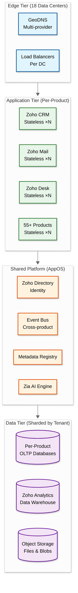
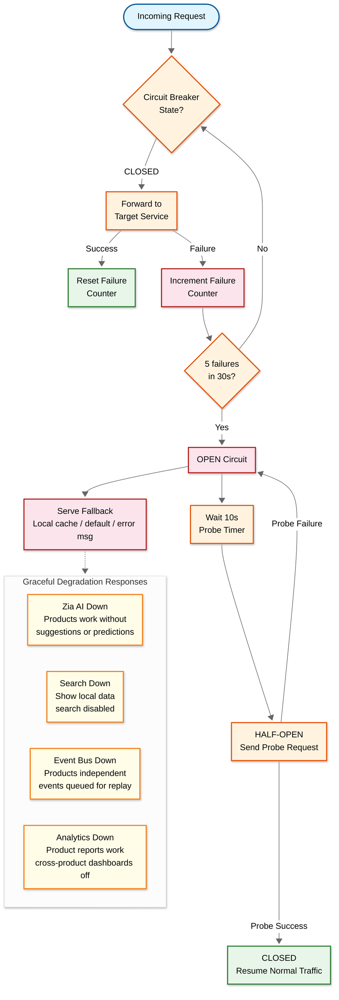
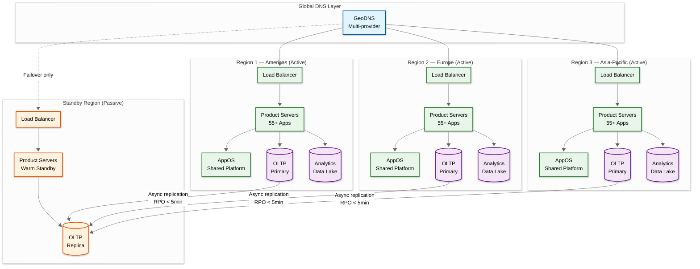

# Scalability & Reliability

## Scalability

### Horizontal Scaling Strategy



| Component | Scaling Method | Trigger |
|---|---|---|
| Product application servers | Horizontal autoscaling (stateless behind LB) | CPU > 70%, memory > 80%, request queue depth > 1000 |
| AppOS shared services | Horizontal scaling on aggregate demand | Cross-product request rate, error budget |
| Per-product databases (OLTP) | Tenant-based hash sharding (org_id) | Storage per shard > 80%, QPS per shard threshold |
| Analytics data warehouse (OLAP) | Add nodes to distributed data lake | Query latency p95, ingestion backlog |
| Event Bus | Add partitions and brokers | Consumer lag, disk utilization |
| Zia AI inference | GPU pool scaling | Inference queue depth, batch window |

**Key scale facts:**

```
Current Scale (2026):
- 150M+ users across 1M+ paying organizations
- 55+ applications on shared infrastructure
- 18 data center locations globally
- 10,000 custom server units (proprietary hardware)
- 32% YoY customer growth rate
- 12-18% energy efficiency gain through custom performance-per-watt optimization
- Zero cloud provider dependency — fully private data centers
```

### Database Scaling Strategy

#### OLTP — Per-Product Databases

```
Partitioning:
- Tenant-based hash partitioning using org_id as shard key
- Each product owns its database schema and sharding topology
- Read replicas per region for read-heavy products (CRM, Analytics)
- Write sharding for high-write products (Mail, Analytics ingestion)

Scaling Mechanisms:
1. Shard splitting — when shard size or QPS exceeds threshold, split into 2
2. Read replicas — regional replicas absorb read traffic for CRM, Desk, Analytics
3. Write sharding — Mail and Analytics ingestion spread writes across multiple shards
4. Connection pooling — per-product pools prevent cross-product contention
```

#### OLAP — Zoho Analytics Data Warehouse

```
Architecture:
- Proprietary Postgres-style distributed data lake
- Separate from OLTP to prevent analytical queries from impacting transactional workloads
- Cross-product data joins handled at the analytics layer, not at individual product databases

Scaling Mechanisms:
1. Horizontal node addition — add compute nodes for query parallelism
2. Columnar partitioning — time-range and tenant-based partitioning for scan efficiency
3. Materialized aggregates — pre-computed rollups for common dashboard queries
4. Tiered storage — hot data on SSD, warm data on HDD, cold data on archival storage
```

### Caching Layers

| Layer | Scope | What's Cached | TTL | Invalidation |
|---|---|---|---|---|
| **L1 — In-process** | Application memory | Hot tenant configs, session data, feature flags | 30-60s | TTL expiry + broadcast invalidation |
| **L2 — Distributed** | Cross-instance shared cache | Tenant metadata, frequently accessed CRM records, identity tokens | 1-5min | Event-driven via product event bus |
| **L3 — CDN edge** | Global edge locations | Static assets, marketing pages, help documentation | Hours-Days | Cache-busting on deploy, purge API |

**Cache warming strategy:** On service startup or shard migration, pre-load tenant configurations and metadata for organizations assigned to that shard based on recent access patterns.

### Hot Spot Mitigation

| Hot Spot Type | Detection | Mitigation |
|---|---|---|
| **Large enterprise tenant** | Request rate per org_id exceeds threshold | Dedicated shard allocation; isolated resource pool |
| **Campaign/bulk operation** | Sudden spike in write QPS from single tenant | Queue-based throttling; bulk operations routed to dedicated pipeline |
| **Read-heavy CRM object** | Cache miss rate + DB QPS spike for specific records | Promote to L1 cache; add read replicas |
| **Analytics ingestion burst** | Ingestion backlog growth rate | Backpressure signaling; overflow to batch ingestion path |
| **Cross-product event storm** | Event bus consumer lag per partition | Partition-level rate limiting; event deduplication |

**Tenant traffic classification:**

| Tier | Profile | Infrastructure |
|---|---|---|
| Small | < 50 users, standard usage | Shared resource pool across tenants |
| Medium | 50-500 users, moderate API usage | Dedicated database partitions, shared compute |
| Large | 500+ users, heavy API and AI usage | Dedicated shards, dedicated compute, priority GPU access |

### AI/GPU Scaling

| Dimension | Strategy | Details |
|---|---|---|
| Hardware | Commodity GPU deployment | Distributed across data centers; no single GPU vendor lock-in |
| Batch inference | Off-peak processing | Model scoring, report generation, and bulk predictions batched during low-traffic windows |
| Model tiering | SLM for high-frequency tasks | 1.3B parameter models handle autocomplete, classification, and entity extraction — reducing GPU load |
| Prioritization | Real-time > batch | User-facing AI interactions (Zia suggestions, smart compose) prioritized over batch analytics and model retraining |
| Scaling trigger | Inference queue depth | GPU pool scaled when inference queue depth exceeds threshold or p95 latency breaches SLA |

---

## Reliability & Fault Tolerance

### Single Points of Failure (SPOF) Analysis

| Component | SPOF Risk | Mitigation |
|---|---|---|
| Zoho Directory (unified identity) | High — all products depend on it | Multi-region active-active deployment; local identity caches |
| Event Bus (cross-product comms) | High — products rely on it for integration | Partitioned, replicated broker; products operate independently if bus is down |
| Metadata Registry | Medium — stores product schemas and configs | Read replicas in every region + local in-memory caches |
| DNS (zoho.com resolution) | Medium — single domain for all products | GeoDNS with multiple DNS providers; health-checked failover |
| Zia AI Engine | Low — enhancing, not critical path | Products function fully without AI features |

### Failover Mechanisms

| Scope | Strategy | RPO | RTO |
|---|---|---|---|
| Database (within region) | Active-passive with automatic primary election | 0 (sync replication) | < 30s |
| Stateless services (within DC) | Active-active across availability zones | N/A | < 5s (health check interval) |
| Data center outage | DNS-level failover to nearest healthy DC | < 5 min (async replication lag) | < 15 min |
| Full region outage | Failover to standby region | < 5 min | < 4 hours |

**Degraded mode:** Products can operate independently without cross-product features if AppOS is partially unavailable. CRM continues to function even if Desk, Mail, or Analytics connectivity is lost.

### Circuit Breaker Pattern



**Circuit breaker configuration per cross-product call:**

| Target Service | Failure Threshold | Open Duration | Fallback |
|---|---|---|---|
| Zia AI | 5 failures in 30s | 10s probe interval | No AI features; product continues normally |
| Unified Search | 5 failures in 30s | 10s probe interval | Local data display; search UI disabled |
| Event Bus | 5 failures in 30s | 10s probe interval | Local event queue; replay on recovery |
| Analytics API | 5 failures in 30s | 10s probe interval | Per-product reports only; cross-product dashboards unavailable |
| Zoho Directory | 3 failures in 15s | 5s probe interval | Cached identity tokens; new logins may fail |

### Retry Strategies

| Operation | Strategy | Max Retries | Backoff |
|---|---|---|---|
| Cross-product API call | Exponential + jitter | 5 | 100ms, 200ms, 400ms, 800ms, 1600ms |
| Database write | Exponential | 3 | 100ms, 500ms, 2000ms |
| Event bus publish | Exponential | 5 | 100ms, 200ms, 400ms, 800ms, 1600ms |
| AI inference request | Exponential | 3 | 200ms, 1000ms, 5000ms |
| Failed events (non-retryable) | Dead letter queue | N/A | Manual review + replay |

**Idempotency:** Only idempotent operations are retried. Non-idempotent writes use unique request IDs to prevent duplicate processing.

### Graceful Degradation

| Scenario | Degraded Behavior | User Impact |
|---|---|---|
| Zia AI unavailable | All products function without AI features (no suggestions, no predictions, no smart compose) | "AI features temporarily unavailable" indicator |
| Unified Search down | Products display local data; search bar disabled or returns stale cached results | Users navigate via menus instead of search |
| Event Bus down | Products operate independently; cross-product automation paused; events queued locally for replay | Cross-product workflows delayed; individual products unaffected |
| Analytics down | Per-product reports continue to work; cross-product dashboards and unified analytics unavailable | "Some dashboards may be delayed" banner |
| Zoho Directory partial outage | Existing sessions continue (cached tokens); new logins may be delayed or routed to healthy region | Brief login delays; active users unaffected |

### Bulkhead Pattern

| Bulkhead | Isolation | Purpose |
|---|---|---|
| Per-product thread pools | Separate thread pools for each cross-product interaction | CRM calling Mail cannot exhaust Desk's connection capacity |
| Per-product DB connections | Separate connection pools per product database | Analytics query load cannot starve CRM of DB connections |
| AI inference isolation | AI GPU queues separated from core business logic processing | Slow AI inference cannot block transactional operations |
| Tenant-level rate limits | Per-org request quotas across all products | Single tenant burst cannot degrade service for other organizations |
| Bulk operation queuing | Dedicated pipeline for import/export/campaign operations | Bulk operations cannot cause thundering herd on shared resources |

---

## Disaster Recovery

### Objectives

| Metric | Target | Scope |
|---|---|---|
| **RTO** (Full region failover) | < 4 hours | Complete region recovery to standby |
| **RTO** (Single service) | < 5 minutes | Individual product or platform service restart |
| **RTO** (Data center failover) | < 15 minutes | DNS-level failover to nearest healthy DC |
| **RPO** (Critical services) | < 5 minutes | Async replication lag for identity, email, CRM |
| **RPO** (Database within region) | 0 | Synchronous replication within primary cluster |

### Backup Strategy

| Data Store | Backup Method | Frequency | Retention |
|---|---|---|---|
| Product databases (OLTP) | Point-in-time recovery via WAL/binary logs | Continuous | 30 days |
| Product databases (OLTP) | Full snapshot | Daily | 30 days |
| Product databases (OLTP) | Monthly archive snapshot | Monthly | 1 year |
| Analytics data warehouse | Snapshot to archival storage | Daily | 90 days |
| Event bus topics | Replication factor 3 + archival | Continuous | 7 days in broker, 365 days in archive |
| Object storage (files, attachments) | Cross-region replication | Real-time | Indefinite |
| Configuration and metadata | Versioned config store | On every change | Full history |

### Multi-Region Deployment Architecture



**Key multi-region design decisions:**

1. **Private data center ownership** — All 18 data center locations run on Zoho-owned custom hardware. No dependency on any cloud provider. This gives full control over hardware lifecycle, firmware, networking, and physical security.

2. **Custom hardware for efficiency** — 10,000 custom server units designed for performance-per-watt optimization, achieving 12-18% energy efficiency gains over commodity equivalents. Field-replaceable units minimize downtime during hardware failures.

3. **Tenant-pinned regions** — Each organization's data is pinned to a specific region for data residency compliance. Cross-region replication is for disaster recovery only, not for serving live traffic from multiple regions for the same tenant.

4. **Active regions with passive DR** — Each active region handles its own tenants independently. The standby region receives continuous replication from all active regions and activates only during a full region outage.

5. **Critical services active-active** — Identity (Zoho Directory) and email (Zoho Mail) run active-active across multiple regions with automatic DNS failover. RPO < 5 minutes, RTO < 15 minutes for these services.

6. **N+2 redundancy for shared platform** — Critical AppOS services (Directory, Event Bus, Metadata Registry) maintain N+2 instance redundancy within each data center. Every data center has redundant power, network, and storage paths.
