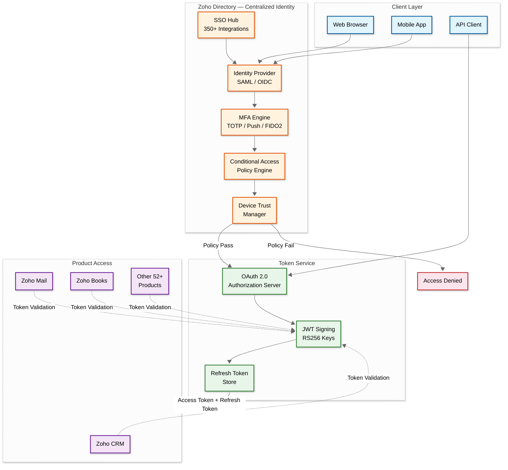
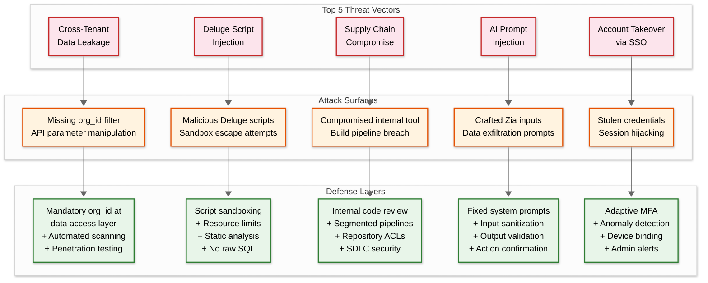

# Security & Compliance

## Authentication & Authorization

### Authentication Mechanisms

Zoho's authentication is centralized through **Zoho Directory**, providing a single identity across all 55+ products. Since Zoho owns all infrastructure (no third-party cloud), the attack surface is inherently smaller — no shared-responsibility model gaps.

| Method | Use Case | Details |
|---|---|---|
| **OAuth 2.0 / OIDC** | API access, third-party integrations | Authorization code flow with per-product scopes; 350+ pre-built SSO integrations |
| **SAML 2.0** | Enterprise SSO | Federated identity with corporate IdPs (Okta, Azure AD, ADFS) |
| **MFA** | All user accounts | TOTP (authenticator apps), push notifications, FIDO2/WebAuthn hardware keys |
| **Passwordless Login** | End-user convenience | Magic link via email; device-bound biometric authentication |
| **Device Trust** | Managed device enforcement | Enroll and trust Mac, Linux, Windows devices; block unmanaged devices |
| **Conditional Access** | Enterprise security policies | IP-based, time-based, device-based, and geo-based access policies |

### Authentication Flow



**Key Design Decisions:**

1. **Single identity, universal access**: One Zoho Directory account governs access to every product — no separate credentials per app
2. **Device trust before token issuance**: Access tokens are only issued after the device passes conditional access policies
3. **No third-party IdP dependency**: Zoho Directory is the primary IdP, though it federates with external SAML/OIDC providers for enterprise SSO

### Authorization Model

Zoho uses a **layered RBAC + field-level + record-level** authorization model that cascades from organization policies to individual product permissions:

| Layer | Scope | Example |
|---|---|---|
| **Organization Policy** | Cascades to all 55+ products | "All users must use MFA" applies everywhere |
| **Product RBAC** | Per-product predefined roles | CRM: Admin, Manager, Standard, Custom |
| **Field-Level Permissions** | Control visibility per role | "Revenue" field visible only to Sales Managers |
| **Record-Level Sharing** | Owner, role hierarchy, territory-based | Record visible to owner + upward in role hierarchy |
| **API Scope Permissions** | OAuth scopes per product | `ZohoCRM.modules.ALL`, `ZohoMail.accounts.READ` |

### Token Management

| Token Type | TTL | Format | Rotation Policy |
|---|---|---|---|
| **Access Token** | 1 hour | JWT (RS256) | Reissued via refresh token |
| **Refresh Token** | 30 days | Opaque, single-use | Rotated on every use; old token invalidated |
| **Service-to-Service** | N/A (certificate-based) | mTLS + API keys | Certificate rotation every 90 days |

**Cross-Product Token Revocation:**

When a user is deactivated in Zoho Directory, token revocation propagates across all 55+ products within **30 seconds** via an internal event bus. Each product's token validation layer checks a distributed revocation list before accepting any JWT.

---

## Data Security

### Encryption

| Layer | Method | Details |
|---|---|---|
| **At Rest (Databases)** | AES-256 | Transparent Data Encryption on all SQL and NoSQL databases |
| **At Rest (File Storage)** | AES-256 | All files in WorkDrive, Mail attachments, CRM documents |
| **In Transit (External)** | TLS 1.2/1.3 with PFS | Perfect Forward Secrecy for all client-to-server connections |
| **In Transit (Internal)** | mTLS | Service-to-service communication within data centers |
| **Key Management** | HSMs per data center | Hardware Security Modules in each of 18 data centers |
| **BYOK** | Customer-managed keys | Enterprise customers can provide their own encryption keys via Zoho Vault |

### PII Handling

- **Automatic PII detection**: Fields containing email addresses, phone numbers, government IDs, and financial data are automatically classified as PII
- **Log masking**: PII fields are automatically masked in all application logs, debug traces, and error reports — no configuration required
- **Configurable data masking**: Organizations can define custom masking rules (e.g., mask email as `j***@company.com`, mask phone as `***-***-1234`)
- **Encryption key isolation**: Each organization's PII fields are encrypted with org-specific keys derived from the master key in the HSM

### Data Deletion

| Scenario | Process | Timeline |
|---|---|---|
| **Record Deletion** | Soft delete with 60-day recycle bin | Permanent after 60 days |
| **Account Closure** | Hard delete of all data | Within 30 days of closure request |
| **GDPR Right to Erasure** | Cascade purge across all products | Within 30 days; cryptographic erasure for encrypted data |
| **Employee Offboarding** | Account deactivation + data reassignment | Immediate deactivation; data retained per org policy |

---

## Threat Model

### Threat Overview



### Detailed Mitigations

#### 1. Cross-Tenant Data Leakage

| Risk Level | Critical |
|---|---|
| **Vector** | Missing `org_id` filter in database queries, API parameter manipulation to access another tenant's data |

| Control | Implementation |
|---|---|
| Mandatory tenant filter | `org_id` is injected at the data access layer — developers cannot bypass it; queries without `org_id` are rejected at compile time |
| Automated scanning | CI/CD pipeline scans all database queries for missing tenant filters before deployment |
| Penetration testing | Regular third-party security audits specifically targeting tenant isolation boundaries |
| API input validation | Request parameters are validated against the authenticated user's `org_id`; cross-org references are blocked |
| Bug bounty program | Responsible disclosure program with rewards for tenant isolation vulnerabilities |

#### 2. Deluge Script Injection

| Risk Level | High |
|---|---|
| **Vector** | Malicious tenant writes Deluge scripts that attempt to access other tenant data, escape the sandbox, or consume excessive resources |

| Control | Implementation |
|---|---|
| Script sandboxing | Each Deluge execution runs in an isolated sandbox with resource limits (CPU, memory, execution time) |
| No raw SQL access | Deluge scripts interact with data only through high-level APIs; no direct database query capability |
| Restricted API surface | Scripts can only call approved Zoho APIs and whitelisted external endpoints |
| Static analysis | Scripts are analyzed before execution for suspicious patterns (recursive calls, infinite loops, data exfiltration attempts) |
| Execution quotas | Per-org daily execution limits; CPU time capped at 10 seconds per invocation |

#### 3. Supply Chain Independence

| Risk Level | High |
|---|---|
| **Vector** | Since Zoho builds everything in-house (OS, hardware, all 55+ apps), a compromised internal tool or library affects the entire stack |

| Control | Implementation |
|---|---|
| Internal code review | Mandatory peer review for all code changes; security-sensitive changes require security team sign-off |
| Segmented build pipelines | Each product has isolated build infrastructure; no shared build agents across product boundaries |
| Repository access controls | Principle of least privilege for internal repositories; cross-product access requires explicit approval |
| SDLC security practices | Static analysis (SAST), dynamic analysis (DAST), and dependency scanning integrated into every build |
| Internal red team | Dedicated security team that simulates supply chain attacks against internal tooling |

#### 4. AI Prompt Injection (Zia)

| Risk Level | Medium |
|---|---|
| **Vector** | User crafts inputs to Zia that manipulate AI behavior — data exfiltration via generated outputs, unauthorized CRM actions, or bypassing access controls |

| Control | Implementation |
|---|---|
| Fixed system prompts | System prompts are non-editable and server-side; user input cannot override system instructions |
| Input sanitization | User inputs are sanitized for injection patterns before reaching the LLM |
| Output validation | AI-generated outputs are validated against data access policies before being returned to the user |
| Action confirmation | Destructive operations suggested by Zia (delete, bulk update) require explicit user confirmation |
| No third-party training | Zia models (1.3B, 2.6B, 7B) are trained only on approved datasets; no customer data is used for training |

#### 5. Account Takeover via SSO

| Risk Level | High |
|---|---|
| **Vector** | Since one Zoho Directory identity governs all 55+ products, compromising a single account grants access to CRM, email, financials, HR, and all other products simultaneously |

| Control | Implementation |
|---|---|
| Adaptive MFA | Step-up authentication triggered by unusual login location, new device, or sensitive action |
| Anomaly detection | Machine learning-based detection of unusual login patterns (time, location, device fingerprint) |
| Device binding | Sessions are bound to enrolled devices; new device login requires additional verification |
| Session management | Concurrent session limits per user; admin visibility into all active sessions across products |
| Administrative alerts | Real-time alerts to org admins on suspicious login activity, privilege escalation, or bulk data access |
| Password policies | Configurable complexity requirements, password history, and expiration policies via Zoho Directory |

### DDoS Protection

| Layer | Protection |
|---|---|
| **Edge (Zoho-owned)** | L3/L4 DDoS mitigation at network edge in 18 data centers; no third-party CDN dependency |
| **Application Gateway** | Per-IP, per-org, per-API rate limiting with adaptive thresholds |
| **Internal Services** | Circuit breakers on all inter-service calls; bulkhead isolation per product |
| **Database** | Query cost estimation and rejection for expensive operations; per-org connection pooling |

---

## Physical Security

Since Zoho owns all 18 data centers (no public cloud), physical security is directly managed:

| Control | Implementation |
|---|---|
| **Access Control** | Biometric entry, badge-based access, mantrap doors |
| **Surveillance** | Night vision cameras with 24/7 monitoring and 90-day retention |
| **Environmental** | Redundant power, cooling, fire suppression in every data center |
| **Personnel** | Background checks for all data center staff; visitor escort policy |
| **Audit** | Physical access logs retained and reviewed quarterly |

---

## Compliance

### Regulatory Framework

| Regulation | Applicability | Key Requirements |
|---|---|---|
| **GDPR** | EU customers | Data residency in EU data centers, right to deletion, data portability, DPO appointed |
| **SOC 2 Type II** | All customers | Annual audit for security, availability, and processing integrity controls |
| **ISO 27001** | All customers | Information security management system certification |
| **ISO 27017** | Cloud-specific | Cloud security controls and best practices |
| **ISO 27018** | PII in cloud | Protection of personally identifiable information in public cloud |
| **HIPAA** | Healthcare customers | BAA available for Zoho Vault, Creator, and CRM |
| **PCI DSS** | Payment processing | Compliance for Zoho Checkout and Commerce products |
| **India DPDP Act** | Indian customers | Data localization in Indian data centers for Indian customer data |
| **FedRAMP** | US government | In progress for federal agency adoption |

### GDPR Implementation

| Requirement | Zoho Implementation |
|---|---|
| **Data Residency** | Dedicated EU data centers; all EU customer data stays within EU boundaries |
| **Right to Erasure** | Cascade delete across all 55+ products within 30 days; cryptographic erasure for encrypted stores |
| **Data Portability** | Export APIs available for all products; standard formats (CSV, JSON, XML) |
| **Consent Management** | Built-in consent tracking in CRM and marketing products; lawful basis recording |
| **Breach Notification** | Automated detection with 72-hour notification SLA to supervisory authorities |
| **DPO** | Appointed Data Protection Officer; published contact for data subject requests |
| **Sub-processors** | Minimal sub-processor list (due to self-owned infrastructure); published with change notifications |

### Data Residency

Zoho's ownership of all data centers enables strict regional data residency:

| Region | Data Center Locations | Applicable Regulations |
|---|---|---|
| **United States** | US data centers | SOC 2, HIPAA, CCPA, FedRAMP (in progress) |
| **European Union** | EU data centers | GDPR, ISO 27018 |
| **India** | Indian data centers | India DPDP Act, data localization requirements |
| **Australia** | AU data centers | Australian Privacy Act, data sovereignty |

Organizations choose their data region at account creation. Cross-region data transfer is blocked by default and requires explicit administrative approval with appropriate safeguards (Standard Contractual Clauses for EU transfers).

### Zoho Vault — Enterprise Password Management

Zoho Vault serves as the centralized secrets and password management layer:

| Capability | Details |
|---|---|
| **Shared Passwords** | Role-based sharing of credentials across teams |
| **SSO Integration** | Pre-configured SSO for 350+ enterprise applications |
| **Audit Trail** | Complete access log for every stored secret |
| **Zero-Knowledge** | Master password never transmitted or stored by Zoho |
| **Emergency Access** | Configurable emergency access with time-delayed approval |

### Audit Trail

All security-sensitive operations produce immutable audit log entries:

```
Audit Log Entry:
{
  "timestamp": "2026-03-08T14:22:10Z",
  "actor": {
    "type": "user",
    "id": "uid_8472910",
    "email": "admin@company.com",
    "org_id": "org_1234567"
  },
  "action": "zoho.directory.user.deactivate",
  "resource": {
    "type": "user",
    "id": "uid_3918274",
    "product_scope": "all"
  },
  "context": {
    "ip_address": "203.0.113.42",
    "device_id": "dev_macbook_a1b2c3",
    "data_center": "us-dc1",
    "mfa_method": "fido2"
  },
  "result": "success",
  "propagation": {
    "token_revocation": "completed",
    "products_notified": 55,
    "propagation_time_ms": 2800
  }
}
```

Audit logs are retained for **7 years** in append-only storage with tamper-evident checksums. Logs are replicated across data centers for durability.

---

## Security Architecture Summary

| Dimension | Zoho Approach | Key Differentiator |
|---|---|---|
| **Infrastructure** | Fully self-owned data centers, custom hardware, proprietary OS | No shared-responsibility gaps; complete control over physical + software stack |
| **Identity** | Zoho Directory — single identity across 55+ products | One account to secure, one place to enforce policies |
| **Encryption** | AES-256 at rest, TLS 1.2/1.3 in transit, HSMs per data center | BYOK available; no third-party KMS dependency |
| **AI Security** | Fixed prompts, no third-party training, on-premise inference | Customer data never leaves Zoho infrastructure for AI processing |
| **Scripting Safety** | Sandboxed Deluge with static analysis and resource limits | No raw SQL, no arbitrary code execution, restricted API surface |
| **Compliance** | GDPR, SOC 2, ISO 27001/27017/27018, HIPAA, PCI DSS | Self-owned infrastructure simplifies data residency compliance |
| **Physical** | Night vision surveillance, biometric access, 24/7 monitoring | Direct control over all 18 data centers worldwide |
