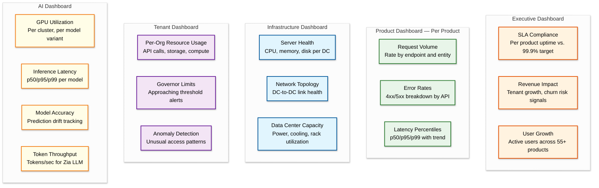
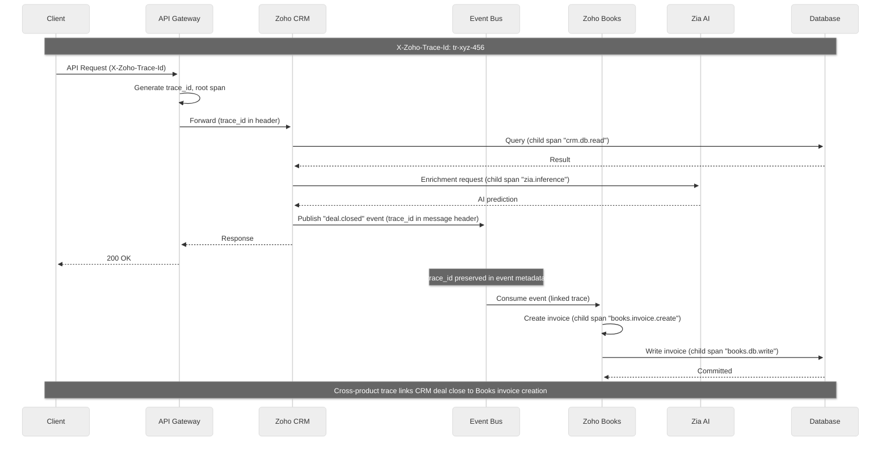
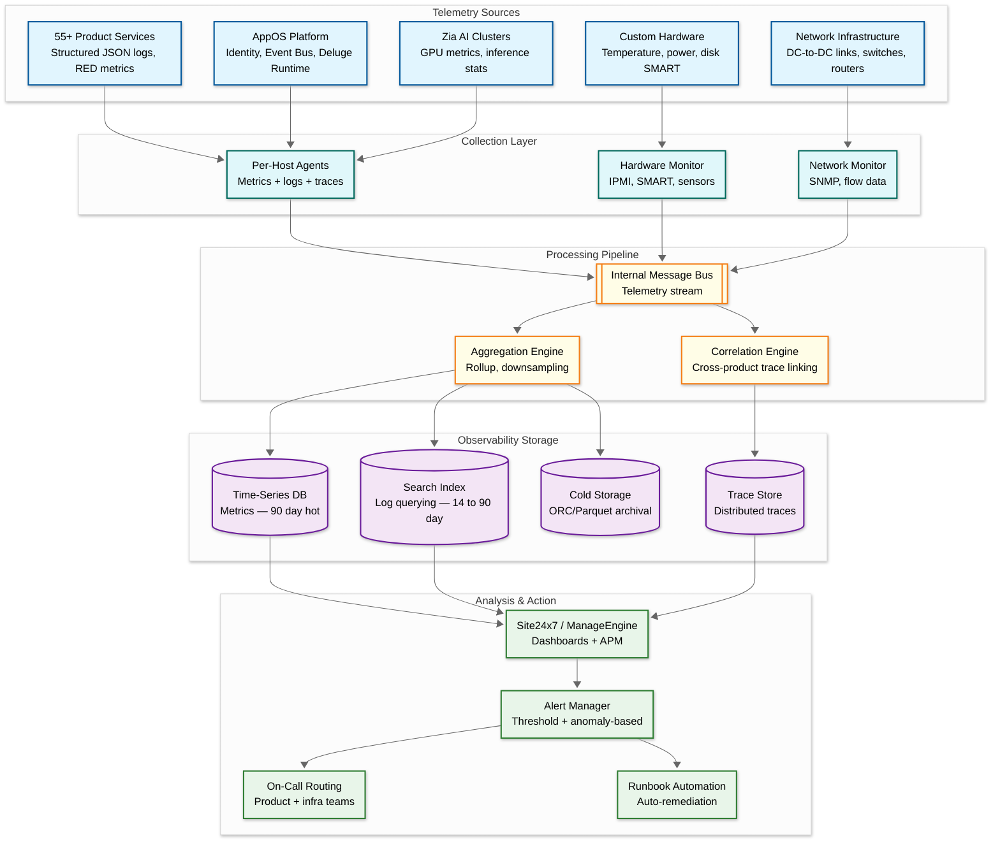

# Observability

## Metrics (USE/RED)

### Infrastructure Metrics (USE — Utilization, Saturation, Errors)

Zoho's private data center model (18 locations, zero public cloud) demands full-stack observability from bare-metal hardware through the application layer — a scope that public-cloud-hosted competitors delegate to their cloud provider.

| Component | Utilization | Saturation | Errors |
|---|---|---|---|
| **Custom Hardware** | CPU/memory % per server, disk I/O throughput | Disk queue depth, memory pressure, swap usage | Disk SMART failures, ECC memory errors, power supply faults |
| **Network (DC-to-DC)** | Bandwidth utilization per inter-DC link | Packet queue depth, TCP retransmit rate | Link failures, BGP flaps, packet loss rate |
| **AppOS Platform** | Request rate per product per DC, thread pool usage | Connection pool exhaustion, event bus queue depth | Cross-product event delivery failures, identity service errors |
| **Product Services** | Instance count, CPU/memory per product service | Request queue depth, DB connection pool usage | 4xx rate, 5xx rate, timeout rate per API endpoint |
| **Databases** | QPS per shard, storage utilization, replication throughput | Replication lag, lock wait time, query queue depth | Slow queries, deadlocks, replication errors |
| **Zia AI Cluster** | GPU utilization %, VRAM usage, inference throughput | Inference request queue depth, batch queue saturation | Model loading failures, OOM errors, inference timeouts |
| **Message Queues** | Broker throughput, partition utilization | Consumer lag per topic, under-replicated partitions | Produce failures, consumer errors, ISR shrinkage |
| **Distributed Cache** | Hit ratio, memory utilization, eviction rate | Connection count vs. max, memory fragmentation | Cache miss storms, node failures, split-brain events |
| **Data Center Facilities** | Power draw per rack, cooling efficiency (PUE) | UPS capacity remaining, cooling headroom | Temperature threshold breaches, power redundancy loss |

### Application Metrics (RED — Rate, Errors, Duration)

| Service | Rate | Error Rate | Duration (p50/p95/p99) |
|---|---|---|---|
| Zoho CRM API | Requests/sec by entity and operation | % 4xx, % 5xx | 20ms / 80ms / 200ms |
| Zoho Mail | Messages delivered/sec, IMAP/POP requests/sec | % bounce, % delivery failure | 100ms / 500ms / 1s |
| Zoho Books | Invoice operations/sec, reconciliation jobs/sec | % failed transactions | 30ms / 150ms / 400ms |
| Zoho Cliq | Messages/sec, WebSocket connections/sec | % delivery failure, % connection drops | 10ms / 50ms / 100ms |
| AppOS Identity (Zoho Directory) | Auth requests/sec, SSO assertions/sec | % auth failures, % token refresh errors | 15ms / 60ms / 150ms |
| Cross-Product Event Bus | Events published/sec, events consumed/sec | % delivery failures, % dead-letter events | 50ms / 200ms / 500ms |
| Deluge Script Runtime | Executions/sec per org, resource units consumed/sec | % execution errors, % timeout | 30ms / 200ms / 1s |
| Zia AI Inference | Inference requests/sec, tokens generated/sec | % model errors, % confidence below threshold | 100ms / 500ms / 2s |
| Zoho Creator (Low-Code) | App renders/sec, workflow triggers/sec | % build failures, % data source errors | 50ms / 200ms / 500ms |
| Zoho WorkDrive | File operations/sec, sync events/sec | % upload failures, % conflict rate | 80ms / 300ms / 800ms |

### Business Metrics

| Metric | Purpose | Alert Threshold |
|---|---|---|
| Active tenants per product per DC | Load distribution and capacity planning | > 15% variance across DCs for same region |
| API call volume per tenant | Billing accuracy and abuse detection | > 3x contracted tier for 10+ minutes |
| Workflow execution success rate | Platform health for cross-product automation | < 95% success rate per product |
| Zia inference throughput | AI capacity planning | GPU utilization > 85% sustained |
| Zia prediction accuracy | Model quality monitoring | Accuracy drift > 5% from baseline |
| User session duration | Product engagement tracking | > 20% drop week-over-week |
| Feature adoption rate per product | Product growth tracking | New feature adoption < 5% after 30 days |
| Deluge script resource consumption per org | Governor limit enforcement | > 80% of allocated compute budget |
| Cross-product event latency | Integration SLA compliance | p95 delivery > 2 seconds |
| Data center capacity headroom | Infrastructure planning | < 20% remaining capacity in any DC |

### Key Dashboard Design



### Alerting Thresholds Summary

| Severity | Criteria | Examples |
|---|---|---|
| **Critical (Page)** | Immediate user impact or data risk | Error rate > 5% for > 2 min, p99 latency > 2s, disk > 90%, DC connectivity loss |
| **Warning** | Degradation trending toward impact | Error rate > 1%, p99 latency > 1s, CPU > 80%, tenant approaching governor limit |
| **Info** | Operational awareness — no action required | New tenant onboarded, product deployment completed, scheduled maintenance window |

---

## Logging

### What to Log

| Category | Log Events | Level |
|---|---|---|
| **API Requests** | Timestamp, org_id, user_id, app_id, method, path, status, latency, request_id | INFO |
| **Authentication** | Login, logout, MFA challenge, token refresh, SSO assertion, failed attempts | INFO / WARN |
| **Workflow Executions** | Trigger event, steps executed, outcome, duration, cross-product hops | INFO |
| **Deluge Scripts** | org_id, script_id, execution_time, resource_consumed, errors, governor limit usage | INFO / ERROR |
| **Cross-Product Events** | source_app, target_app, event_type, delivery_status, latency, retry count | INFO |
| **AI Interactions** | Prompt (sanitized), model_used, tokens_consumed, response_time, confidence score | INFO |
| **Data Mutations** | Entity type, entity_id, operation (create/update/delete), actor, changed fields | INFO |
| **Rate Limiting** | org_id, endpoint, limit hit, current rate, governor limit type | WARN |
| **Infrastructure Events** | Server health changes, disk alerts, network events, DC failover events | WARN / ERROR |
| **Security Events** | Failed auth, permission denied, unusual cross-tenant patterns, IP anomalies | WARN / ERROR |

### Log Levels Strategy

| Level | Usage | Retention |
|---|---|---|
| **ERROR** | Failed requests, unhandled exceptions, data integrity issues, security incidents | 90 days (full), 1 year (aggregated) |
| **WARN** | Slow queries, approaching governor limits, retry attempts, degraded performance | 30 days |
| **INFO** | Successful operations, state changes, deployments, business events | 14 days |
| **DEBUG** | Detailed request/response traces — disabled in production, enabled per-tenant on demand | 24 hours |

### Structured Logging Format

All services across the 55+ product suite emit logs in a unified JSON format, enabling cross-product correlation through shared `org_id` and `request_id` fields:

```json
{
  "timestamp": "2026-03-08T14:22:45.312Z",
  "level": "INFO",
  "service": "zoho-crm",
  "instance": "crm-api-us1-node-42",
  "org_id": "12345",
  "user_id": "u-789",
  "request_id": "req-abc-123",
  "trace_id": "tr-xyz-456",
  "span_id": "sp-def-789",
  "action": "record.create",
  "entity": "Contact",
  "duration_ms": 45,
  "status": 201,
  "context": {
    "app_id": "zoho-crm",
    "dc_region": "us-east",
    "deluge_triggered": false,
    "cross_product_event": null
  }
}
```

### Log Pipeline Architecture

Zoho's private infrastructure requires a self-managed log pipeline — no reliance on cloud-native logging services:

1. **Collection**: Per-host log agents collect structured JSON from all product services, OS-level syslogs, and hardware event logs
2. **Aggregation**: Logs streamed to regional aggregation layer via internal message bus, tagged with DC, product, and org metadata
3. **Indexing**: Real-time indexing into a distributed search cluster for interactive querying (similar to Site24x7's AppLogs capability)
4. **Archival**: Cold logs compressed and stored in Zoho's blob storage; columnar format (ORC/Parquet) for cost-efficient historical analysis
5. **Cross-DC replication**: Critical logs (ERROR, security events) replicated across DCs for disaster recovery compliance

---

## Distributed Tracing

### Trace Propagation Strategy



### Implementation Details

- **Trace header**: Custom `X-Zoho-Trace-Id` propagated across all product boundaries — HTTP headers for synchronous calls, message metadata for asynchronous events
- **Cross-product correlation**: When a CRM event triggers a Books action via the event bus, the trace links both operations into a single end-to-end trace
- **Sampling strategy**: 100% for errors, 100% for slow requests (> p95 threshold), 10% for normal requests
- **Integration**: ManageEngine APM (Site24x7 APM Insight) provides end-to-end visibility with auto-discovered service maps

### Key Spans to Instrument

| Span | Service | Why |
|---|---|---|
| `api.request` | API Gateway | Entry point; total request latency and routing overhead |
| `auth.validate` | Zoho Directory | Authentication/authorization overhead per request |
| `auth.sso` | Zoho Directory | SSO assertion validation latency |
| `crm.read` / `crm.write` | Zoho CRM | Core data path; DB latency visibility |
| `books.transaction` | Zoho Books | Financial transaction processing time |
| `mail.deliver` | Zoho Mail | Email delivery pipeline latency |
| `cliq.message.route` | Zoho Cliq | Real-time message routing overhead |
| `event_bus.publish` / `event_bus.consume` | AppOS Event Bus | Cross-product event delivery latency |
| `deluge.execute` | Deluge Runtime | Custom script execution time and resource consumption |
| `zia.inference` | Zia AI Engine | Model inference latency per variant (1.3B/2.6B/7B) |
| `zia.tokenize` | Zia AI Engine | Input tokenization overhead |
| `creator.render` | Zoho Creator | Low-code app rendering and data binding |
| `search.query` | AppOS Search | Cross-product search index query time |
| `cache.get` / `cache.set` | Distributed Cache | Cache hit/miss latency |
| `db.query` | Database Layer | Raw SQL/NoSQL query execution time |
| `storage.read` / `storage.write` | Blob Storage | File I/O latency for WorkDrive, Mail attachments |

---

## Alerting

### Critical Alerts (Page-Worthy)

| Alert | Condition | Response |
|---|---|---|
| **Product error rate spike** | Any product returning > 5% errors for > 2 minutes | Investigate product service health, check recent deployments, engage product on-call |
| **Data center network partition** | Loss of connectivity between any two DCs | Activate DC failover runbook, verify DNS failover, assess blast radius |
| **Identity service (Zoho Directory) unavailable** | Auth success rate < 95% for > 1 minute | Escalate immediately — all 55+ products depend on identity; failover to backup identity cluster |
| **Cross-product event bus delay** | Processing lag > 5 minutes on any topic | Check consumer health, investigate backlog cause, consider manual drain |
| **GPU cluster failure** | Zia AI inference error rate > 10% or cluster unreachable | Activate Zia fallback to rule-based logic, reroute to healthy GPU cluster |
| **Potential data breach** | Unusual cross-tenant access pattern detected | Trigger security incident response, isolate affected tenant, notify security team |
| **Database replication failure** | Primary-replica replication broken for > 2 minutes | Investigate replication pipeline, verify data consistency, prepare manual failover |
| **Data center facility alarm** | Temperature > threshold, power redundancy lost, cooling failure | Engage DC operations, prepare workload migration to alternate DC |

### Warning Alerts

| Alert | Condition | Response |
|---|---|---|
| **Product latency degradation** | p99 latency > 2x baseline for > 5 minutes | Review slow query logs, check downstream dependencies |
| **Tenant approaching governor limit** | API rate, storage, or compute usage > 80% of limit | Notify tenant via in-app alert, review if limit increase is appropriate |
| **Disk utilization > 80%** | Any server in any DC exceeds 80% disk | Trigger capacity expansion, review data retention policies |
| **Replication lag > 30 seconds** | Cross-DC or primary-replica lag sustained | Monitor trend, investigate network or I/O bottleneck |
| **Certificate expiration within 30 days** | TLS/SSL cert for any service or DC endpoint | Trigger automated renewal or engage PKI team |
| **Zia model accuracy drift** | Prediction accuracy > 5% below baseline for 24 hours | Queue model retraining, investigate training data freshness |
| **Deluge script resource abuse** | Single org consuming > 90% of compute budget | Throttle org's script execution, notify org admin |
| **Event bus consumer lag growing** | Consumer lag increasing for > 15 minutes | Scale consumer instances, investigate processing bottleneck |

### Runbook References

| Alert Category | Runbook Contents |
|---|---|
| **Data Center Failover** | DNS failover procedure, traffic rerouting, data consistency verification, client reconnection handling |
| **Product Circuit Breaker** | Manual override for product-level circuit breakers, traffic shedding, graceful degradation steps |
| **Tenant Isolation (Noisy Neighbor)** | Quarantine procedure for resource-abusive tenants, rate limit override, org-level throttling |
| **Zia AI Fallback** | Switch from LLM inference to rule-based logic, GPU cluster recovery, model rollback procedure |
| **Event Bus Backlog Drain** | Consumer scaling procedure, dead-letter queue review, selective replay for failed events |
| **Identity Service Recovery** | Backup identity cluster activation, session cache warmup, SSO federation failover |
| **Database Incident** | Shard failover, replication repair, point-in-time recovery, cross-DC consistency check |
| **Security Incident** | Cross-tenant access investigation, tenant isolation, audit log preservation, breach notification protocol |

---

## Observability Stack Architecture



### Zoho's Unique Observability Advantages

**Self-dogfooding with ManageEngine and Site24x7**: Zoho uses its own monitoring products (Site24x7 for application monitoring, ManageEngine for IT infrastructure) to observe the platform — creating a feedback loop where production issues directly improve their monitoring products.

**Full-stack visibility**: Unlike cloud-hosted competitors that rely on AWS CloudWatch or GCP Cloud Monitoring for infrastructure metrics, Zoho instruments every layer from bare-metal hardware sensors through the application tier, providing unmatched depth of observability.

**Cross-product trace correlation**: The unified AppOS platform enables traces that span multiple products — a single user action in CRM can be traced through the event bus into Books, Cliq notifications, and Zia AI enrichment, all under one trace ID.

**Tenant-level observability**: Every metric, log, and trace is tagged with `org_id`, enabling per-tenant dashboards, per-tenant debugging (selective DEBUG log enablement), and proactive identification of tenants approaching governor limits.
