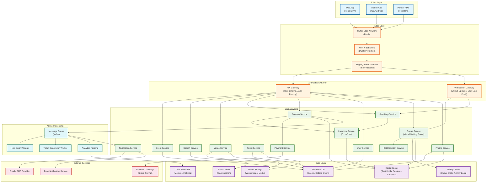
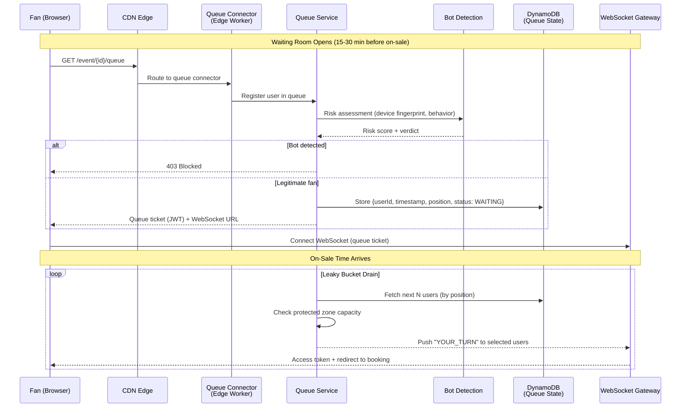
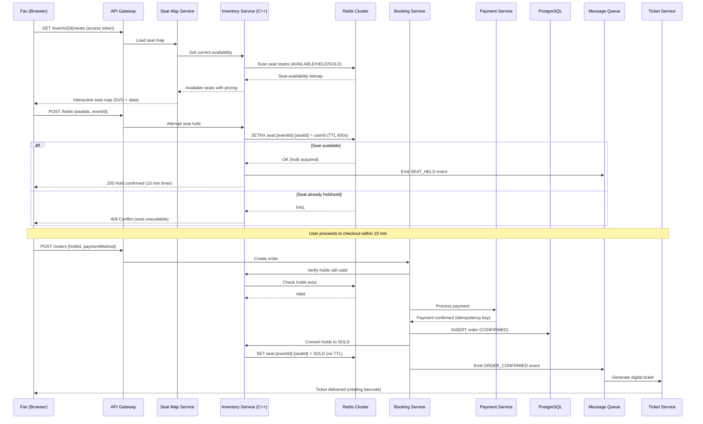
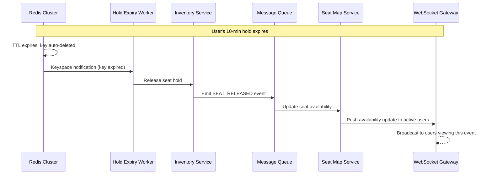

# High-Level Design

## 1. System Architecture

---

## 2. Data Flow: High-Demand On-Sale

### Phase 1: Pre-Sale Queue Formation

### Phase 2: Seat Selection & Booking

### Phase 3: Hold Expiry (Unhappy Path)

---

## 3. Key Architectural Decisions

### Decision 1: Microservices vs. Monolith

| Aspect | Decision | Justification |
|--------|----------|---------------|
| **Architecture** | **Microservices** with a **monolithic Inventory Core** | The Inventory Core (C++ with assembly) is the hot path -- it must be low-latency and co-located with Redis. Other services (Event, Search, User) scale independently. |
| **Why not full microservices?** | Inventory operations require sub-millisecond coordination | Decomposing seat holds across services adds network hops and distributed transaction complexity |
| **Why not monolith?** | Search, events, notifications have different scaling profiles | On-sale traffic hits Inventory 1000x harder than Event Management |

### Decision 2: Synchronous vs. Asynchronous Communication

| Flow | Pattern | Justification |
|------|---------|---------------|
| Seat hold (SETNX) | **Synchronous** | User needs immediate confirmation; <50ms target |
| Payment processing | **Synchronous** (with timeout) | Must confirm payment before converting hold to sold |
| Ticket generation | **Asynchronous** (via queue) | Can tolerate seconds of delay after payment |
| Seat map updates | **Async push** (WebSocket) | Real-time but eventual; brief staleness acceptable |
| Analytics/logging | **Asynchronous** (fire-and-forget) | Not on critical path |
| Queue position updates | **Async push** (WebSocket) | Periodic updates, not per-change |

### Decision 3: Database Choices

| Data | Store | Justification |
|------|-------|---------------|
| Seat holds (ephemeral) | **Redis Cluster** | Sub-ms SETNX, native TTL, 100K+ ops/sec per shard |
| Queue state | **NoSQL (DynamoDB-style)** | High write throughput, auto-scaling, single-table design |
| Events, orders, users | **Relational DB (PostgreSQL)** | ACID transactions, complex queries, referential integrity |
| Event search | **Search Index (Elasticsearch)** | Full-text search, faceting, geo-queries |
| Venue maps, media | **Object Storage** | Large binary assets, CDN-friendly |
| Metrics, analytics | **Time-Series DB** | Efficient time-range queries, downsampling |

### Decision 4: Caching Strategy

| Layer | What | TTL | Invalidation |
|-------|------|-----|-------------|
| **CDN Edge** | Static venue maps, event pages, JS/CSS | 5-60 min | Surrogate keys + instant purge |
| **Edge Worker Cache** | Queue token validation | 30s | Short TTL, rebuild on miss |
| **Redis L1** | Active seat maps (bitmap), hold state | Real-time | Write-through on state change |
| **Application Cache** | Event metadata, pricing tiers | 5 min | TTL + event-driven invalidation |
| **Search Cache** | Popular search results | 1 min | Short TTL for freshness |

### Decision 5: Queue Model -- Push vs. Pull

| Aspect | Decision | Justification |
|--------|----------|---------------|
| Queue position | **Server-push via WebSocket** | Reduces polling load; 14M users polling every second = catastrophic |
| Seat availability | **Server-push via WebSocket** | Real-time updates prevent users from selecting unavailable seats |
| Queue entry | **Client-initiated (pull)** | User must actively join; prevents auto-enrollment attacks |

---

## 4. Architecture Pattern Checklist

| Pattern | Decision | Notes |
|---------|----------|-------|
| Sync vs Async | **Hybrid** | Sync for holds/payments; async for notifications/analytics |
| Event-driven vs Request-response | **Both** | Request-response for booking; event-driven for state propagation |
| Push vs Pull | **Push** (WebSocket) | Queue updates, seat availability pushed to clients |
| Stateless vs Stateful | **Stateless services** + **stateful Redis/DB** | Services scale horizontally; state lives in Redis/DB |
| Read-heavy vs Write-heavy optimization | **Write-heavy** for on-sales | Redis as write buffer; reads served from CDN/cache |
| Real-time vs Batch | **Real-time** for booking | Batch for analytics, reporting, settlement |
| Edge vs Origin | **Edge** for queue validation + static content | Origin for booking/payment (requires strong consistency) |

---

## 5. Component Responsibilities

| Service | Responsibility | Scale Profile |
|---------|---------------|---------------|
| **Queue Service** | Virtual waiting room, position tracking, admission control | Spiky: 0 to millions in seconds |
| **Bot Detection** | Device fingerprinting, behavioral analysis, risk scoring | Inline with queue joins |
| **Inventory Service** | Seat state machine (Available -> Held -> Sold), atomic holds | Extreme contention |
| **Seat Map Service** | Venue layout, pricing overlay, availability visualization | Read-heavy during on-sale |
| **Booking Service** | Order lifecycle, payment orchestration, confirmation | Write-heavy during on-sale |
| **Payment Service** | Payment gateway abstraction, idempotency, retry | External dependency bottleneck |
| **Event Service** | Event CRUD, venue assignment, sale window configuration | Low frequency, admin-facing |
| **Pricing Service** | Dynamic pricing, tier management, platinum seats | Pre-computed, read during checkout |
| **Search Service** | Full-text search, filtering, geo-queries | Steady, cache-friendly |
| **Ticket Service** | Digital ticket generation, rotating barcodes, delivery | Async post-purchase |
| **Notification Service** | Email, SMS, push for confirmations and queue updates | Async, high volume during on-sales |
