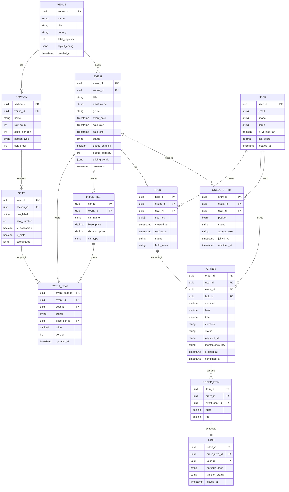
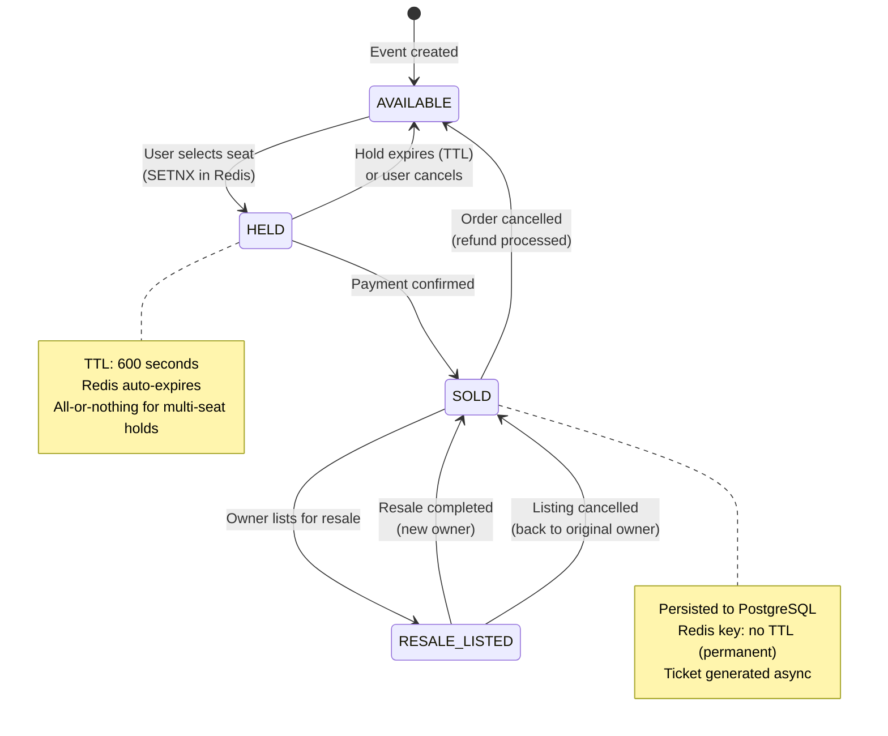
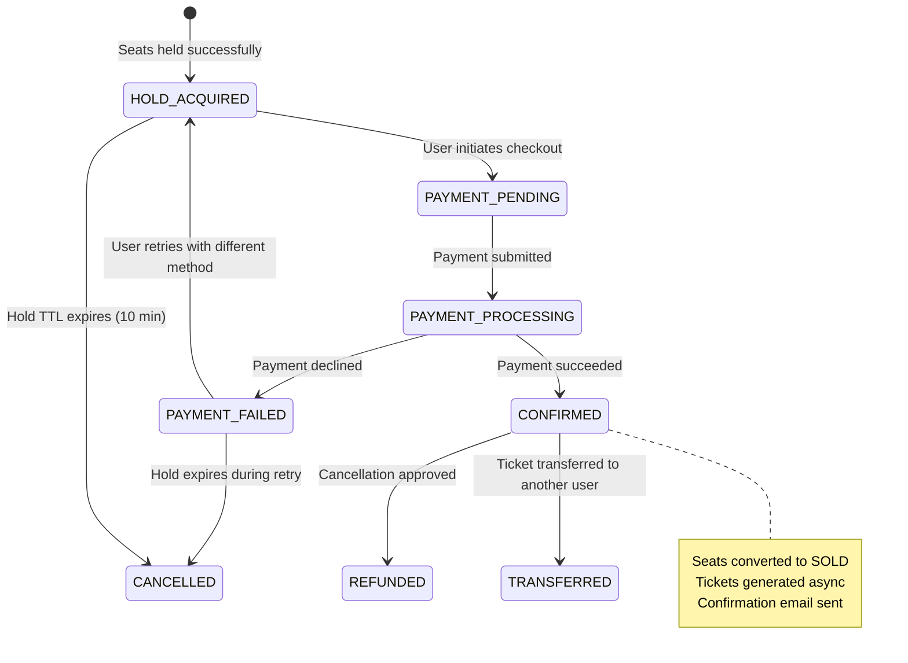

# Low-Level Design

## 1. Data Model

### Entity-Relationship Diagram



### Indexing Strategy

| Table | Index | Type | Purpose |
|-------|-------|------|---------|
| `event` | `(event_date, status)` | B-tree | Browse upcoming events |
| `event` | `(venue_id, event_date)` | B-tree | Events at a venue |
| `event` | `(artist_name)` | GIN (trigram) | Fuzzy artist search |
| `event_seat` | `(event_id, status)` | B-tree | Available seats for event |
| `event_seat` | `(event_id, seat_id)` | Unique | Prevent duplicate mappings |
| `order` | `(user_id, created_at)` | B-tree | User order history |
| `order` | `(idempotency_key)` | Unique | Prevent duplicate orders |
| `queue_entry` | `(event_id, position)` | B-tree | Queue ordering |
| `queue_entry` | `(event_id, user_id)` | Unique | One entry per user per event |
| `ticket` | `(barcode_seed)` | Unique | Barcode lookup |

### Partitioning / Sharding Strategy

| Data | Shard Key | Strategy | Justification |
|------|-----------|----------|---------------|
| `event_seat` | `event_id` | Hash partition | All seats for one event on same shard; hot event = hot shard (acceptable, solved by Redis buffer) |
| `order` | `user_id` | Hash partition | User's orders co-located for history queries |
| `queue_entry` | `event_id` | Range partition | Queue drains sequentially; range scans needed |
| Redis seats | `event_id:seat_id` | Consistent hashing | Distribute seat holds across Redis cluster |

### Redis Data Model (Hot Path)

```
# Seat hold (atomic, with TTL)
KEY:    seat:{event_id}:{seat_id}
VALUE:  {user_id}:{hold_id}
TTL:    600 seconds (10 minutes)
OP:     SETNX (set if not exists)

# Seat state bitmap (per event, per section)
KEY:    seatmap:{event_id}:{section_id}
VALUE:  Bitmap (1 bit per seat: 0=available, 1=unavailable)
OP:     GETBIT / SETBIT

# Active holds counter (per event)
KEY:    holds_count:{event_id}
VALUE:  Integer
OP:     INCR / DECR (atomic)

# Protected zone capacity (per event)
KEY:    pzone:{event_id}
VALUE:  Sorted Set {user_id: admit_timestamp}
OP:     ZADD / ZCARD / ZRANGEBYSCORE

# User session during on-sale
KEY:    session:{access_token}
VALUE:  {user_id, event_id, admitted_at, expires_at}
TTL:    900 seconds (15 minutes)
```

### Data Retention Policy

| Data | Retention | Reason |
|------|-----------|--------|
| Orders / Tickets | 7 years | Financial/legal compliance |
| Payment records | 7 years | PCI-DSS audit trail |
| User profiles | Until account deletion + 90 days | GDPR right to deletion |
| Event data | Indefinite | Historical reference |
| Hold records (expired) | 30 days | Debugging, analytics |
| Queue entries | 7 days post-event | Post-sale analysis |
| Activity logs | 90 days hot, 2 years cold | Fraud investigation |

---

## 2. API Design

### Authentication

All APIs use OAuth 2.0 Bearer tokens. On-sale APIs additionally require a queue access token issued by the Queue Service.

### Event Discovery APIs

```
# Search events
GET /api/v2/events/search
  Query: q, city, genre, date_from, date_to, artist, page, limit
  Response: {
    events: [{id, title, artist, venue, date, price_range, status}],
    pagination: {total, page, limit, next_cursor}
  }
  Rate Limit: 100 req/min per user
  Cache: CDN 60s, App 30s

# Get event details
GET /api/v2/events/{event_id}
  Response: {
    id, title, artist, venue, event_date,
    sale_start, sale_end, status, queue_enabled,
    price_tiers: [{tier_id, name, price_range}],
    availability_summary: {total, available, held, sold}
  }
  Rate Limit: 200 req/min per user
  Cache: CDN 30s (purge on state change)
```

### Queue APIs

```
# Join virtual queue
POST /api/v2/events/{event_id}/queue/join
  Headers: X-Device-Fingerprint, X-Client-Challenge
  Body: { verified_fan_token? }
  Response: {
    queue_ticket: "jwt...",
    position: 142857,
    estimated_wait_minutes: 25,
    websocket_url: "wss://queue.example.com/ws/{ticket}"
  }
  Rate Limit: 1 req per user per event
  Idempotent: Yes (returns existing position if already joined)

# WebSocket: Queue position updates
WS wss://queue.example.com/ws/{queue_ticket}
  Server -> Client messages:
    { type: "POSITION_UPDATE", position: 8421, estimated_wait: 5 }
    { type: "YOUR_TURN", access_token: "jwt...", expires_in: 900 }
    { type: "QUEUE_PAUSED", reason: "high_load" }
    { type: "SOLD_OUT", event_id: "..." }
```

### Seat Map & Hold APIs

```
# Get interactive seat map
GET /api/v2/events/{event_id}/seats
  Headers: Authorization: Bearer {access_token}
  Query: section_id?, price_min?, price_max?
  Response: {
    venue_layout: { svg_url, sections: [...] },
    seats: [{
      seat_id, section, row, number,
      status: "AVAILABLE|HELD|SOLD",
      price, tier, is_accessible
    }],
    timestamp: "2026-03-08T10:00:00Z"
  }
  Rate Limit: 30 req/min per user (during on-sale)
  Cache: None (real-time from Redis)

# Hold seats (temporary reservation)
POST /api/v2/events/{event_id}/holds
  Headers: Authorization: Bearer {access_token}
  Body: {
    seat_ids: ["seat-uuid-1", "seat-uuid-2"],
    hold_duration_seconds: 600
  }
  Response: {
    hold_id: "hold-uuid",
    seats: [{seat_id, section, row, number, price}],
    expires_at: "2026-03-08T10:10:00Z",
    total: 450.00,
    fees: 67.50
  }
  Rate Limit: 5 req/min per user
  Idempotency: Via X-Idempotency-Key header

# Release hold (explicit cancel)
DELETE /api/v2/events/{event_id}/holds/{hold_id}
  Response: 204 No Content
```

### Booking & Payment APIs

```
# Create order (checkout)
POST /api/v2/orders
  Headers:
    Authorization: Bearer {access_token}
    X-Idempotency-Key: {client-generated-uuid}
  Body: {
    hold_id: "hold-uuid",
    payment_method: {
      type: "CARD|WALLET|SAVED_CARD",
      token: "payment-token-from-client-sdk"
    },
    billing_address: { ... }
  }
  Response: {
    order_id: "order-uuid",
    status: "CONFIRMED",
    total: 517.50,
    tickets: [{ticket_id, seat, barcode_url}],
    confirmation_number: "TM-2026-ABC123"
  }
  Rate Limit: 3 req/min per user
  Idempotent: Yes (same idempotency key returns same result)
  Timeout: 30s (payment processor dependency)

# Get order details
GET /api/v2/orders/{order_id}
  Response: { order details + ticket details }

# Cancel order (if allowed by event policy)
POST /api/v2/orders/{order_id}/cancel
  Response: { refund_status, refund_amount }
```

### Versioning Strategy

- URL path versioning: `/api/v2/...`
- Breaking changes get new version; non-breaking additions backward compatible
- Deprecation: 6-month sunset period with `Sunset` header
- API changelog published on developer portal

---

## 3. Core Algorithms

### Algorithm 1: Seat Hold with Distributed Locking

The seat hold is the most contention-critical operation. It uses Redis SETNX (Set if Not eXists) for atomic, distributed locking with TTL-based auto-release.

```
FUNCTION hold_seats(event_id, user_id, seat_ids, ttl=600):
    hold_id = generate_uuid()
    acquired_seats = []

    // Phase 1: Attempt to acquire all seats atomically via Redis pipeline
    pipeline = redis.pipeline(atomic=true)
    FOR EACH seat_id IN seat_ids:
        key = "seat:{event_id}:{seat_id}"
        value = "{user_id}:{hold_id}"
        pipeline.SETNX(key, value)
        pipeline.EXPIRE(key, ttl)  // Only applies if SETNX succeeded

    results = pipeline.execute()

    // Phase 2: Verify all-or-nothing semantics
    all_acquired = true
    FOR i, (setnx_result, _) IN enumerate(results, step=2):
        IF setnx_result == true:
            acquired_seats.append(seat_ids[i/2])
        ELSE:
            all_acquired = false

    // Phase 3: Rollback on partial failure
    IF NOT all_acquired:
        rollback_pipeline = redis.pipeline()
        FOR EACH seat_id IN acquired_seats:
            key = "seat:{event_id}:{seat_id}"
            // Only delete if WE hold it (compare-and-delete via Lua script)
            rollback_pipeline.run_lua_script(
                "if redis.call('get', KEYS[1]) == ARGV[1] then
                   return redis.call('del', KEYS[1])
                 end",
                key, "{user_id}:{hold_id}"
            )
        rollback_pipeline.execute()
        RETURN {success: false, error: "SEATS_UNAVAILABLE",
                unavailable: seat_ids - acquired_seats}

    // Phase 4: Record hold in persistent store (async)
    emit_event("SEATS_HELD", {
        hold_id, event_id, user_id, seat_ids,
        expires_at: now() + ttl
    })

    RETURN {success: true, hold_id, expires_at: now() + ttl}
```

**Time Complexity**: O(N) where N = number of seats in hold (typically 1-8)
**Space Complexity**: O(N) Redis keys
**Contention Strategy**: All-or-nothing with immediate rollback; no blocking waits

### Algorithm 2: Virtual Queue (Leaky Bucket Admission Control)

The virtual queue controls how many users enter the "protected zone" (the booking page) at any given time. It uses a leaky bucket where the bucket size equals the protected zone capacity.

```
FUNCTION manage_queue(event_id):
    CONFIG = get_event_config(event_id)
    BUCKET_SIZE = CONFIG.protected_zone_capacity  // e.g., 2000
    DRAIN_RATE = CONFIG.drain_rate_per_second     // e.g., 50 users/sec

    LOOP every 1 second:
        // Count users currently in protected zone
        current_in_zone = redis.ZCARD("pzone:{event_id}")

        // Remove expired sessions from protected zone
        expired_cutoff = now() - CONFIG.session_timeout
        redis.ZREMRANGEBYSCORE("pzone:{event_id}", 0, expired_cutoff)

        // Calculate available slots
        available_slots = BUCKET_SIZE - redis.ZCARD("pzone:{event_id}")
        admit_count = MIN(available_slots, DRAIN_RATE)

        IF admit_count <= 0:
            CONTINUE

        // Fetch next users from queue (FIFO by position)
        next_users = db.query(
            "SELECT user_id, entry_id FROM queue_entry
             WHERE event_id = ? AND status = 'WAITING'
             ORDER BY position ASC
             LIMIT ?",
            event_id, admit_count
        )

        FOR EACH user IN next_users:
            // Generate access token
            access_token = generate_jwt({
                user_id: user.user_id,
                event_id: event_id,
                expires_at: now() + CONFIG.session_timeout
            })

            // Add to protected zone
            redis.ZADD("pzone:{event_id}", now(), user.user_id)

            // Update queue entry
            db.update("queue_entry",
                SET status='ADMITTED', access_token=access_token,
                WHERE entry_id = user.entry_id)

            // Push notification via WebSocket
            websocket.send(user.user_id, {
                type: "YOUR_TURN",
                access_token: access_token,
                expires_in: CONFIG.session_timeout
            })

        // Update positions for remaining users
        remaining = db.query(
            "SELECT user_id, position FROM queue_entry
             WHERE event_id = ? AND status = 'WAITING'
             ORDER BY position ASC LIMIT 1000"
        )
        FOR EACH user IN remaining:
            websocket.send(user.user_id, {
                type: "POSITION_UPDATE",
                position: user.position,
                estimated_wait: user.position / DRAIN_RATE
            })
```

**Time Complexity**: O(K) per drain cycle where K = drain rate
**Fairness Guarantee**: Strict FIFO ordering by join timestamp
**Backpressure**: If protected zone is full, drain rate drops to 0

### Algorithm 3: Seat Map Availability Aggregation

Uses a bitmap per section for O(1) availability checks and efficient bulk updates.

```
FUNCTION update_seat_availability(event_id, section_id, seat_index, new_status):
    bitmap_key = "seatmap:{event_id}:{section_id}"

    IF new_status IN ["HELD", "SOLD"]:
        redis.SETBIT(bitmap_key, seat_index, 1)  // Mark unavailable
    ELSE:
        redis.SETBIT(bitmap_key, seat_index, 0)  // Mark available

    // Update availability counter
    available = redis.BITCOUNT(bitmap_key)
    total = get_section_capacity(section_id)
    redis.HSET("avail:{event_id}", section_id, total - available)

FUNCTION get_section_availability(event_id, section_id):
    bitmap_key = "seatmap:{event_id}:{section_id}"
    bitmap = redis.GET(bitmap_key)

    available_seats = []
    FOR i IN range(bitmap.length * 8):
        IF GETBIT(bitmap, i) == 0:
            seat = resolve_seat(section_id, i)
            available_seats.append(seat)

    RETURN available_seats
```

**Time Complexity**: O(1) for single seat update; O(N) for full section scan
**Space Complexity**: O(N/8) bytes per section (1 bit per seat; 80K seats = 10KB)

### Algorithm 4: Dynamic Pricing

```
FUNCTION calculate_price(event_id, seat_id, tier_id):
    tier = get_price_tier(tier_id)
    event = get_event(event_id)

    base_price = tier.base_price

    // Factor 1: Demand ratio (seats sold / total)
    sold_ratio = get_sold_count(event_id) / get_total_seats(event_id)
    demand_multiplier = 1.0
    IF sold_ratio > 0.9:
        demand_multiplier = 1.5    // Last 10% of seats
    ELSE IF sold_ratio > 0.7:
        demand_multiplier = 1.25   // 70-90% sold
    ELSE IF sold_ratio < 0.3:
        demand_multiplier = 0.9    // Slow-selling, slight discount

    // Factor 2: Time proximity to event
    days_until_event = (event.event_date - now()).days
    time_multiplier = 1.0
    IF days_until_event < 7:
        time_multiplier = 1.2      // Last week premium
    ELSE IF days_until_event < 1:
        time_multiplier = 1.4      // Day-of premium

    // Factor 3: Secondary market reference (platinum seats only)
    IF tier.tier_type == "PLATINUM":
        secondary_price = get_secondary_market_price(event_id, seat_id)
        IF secondary_price > 0:
            market_reference = secondary_price * 0.85  // 85% of secondary
            RETURN MAX(base_price, market_reference)

    // Standard pricing (capped at 2x base)
    final_price = base_price * demand_multiplier * time_multiplier
    RETURN MIN(final_price, base_price * 2.0)
```

**Note**: Ticketmaster sets platinum prices in advance based on anticipated demand -- not real-time algorithmic surge pricing during the on-sale itself.

---

## 4. State Machine: Seat Lifecycle



## 5. State Machine: Order Lifecycle


