# Security & Compliance

## 1. Authentication & Authorization

### Authentication (AuthN)

| Context | Mechanism | Details |
|---------|-----------|---------|
| **User login** | OAuth 2.0 + OIDC | Social login (Google, Apple) + email/password |
| **API access** | Bearer tokens (JWT) | Short-lived access tokens (15 min) + refresh tokens (30 days) |
| **On-sale access** | Queue access token (JWT) | Single-use, event-scoped, contains user_id + event_id + expiry |
| **Partner APIs** | API keys + OAuth 2.0 client credentials | Machine-to-machine authentication for resellers |
| **Admin access** | SSO + MFA | Mandatory hardware key (FIDO2) for event management |

### Queue Token Structure

```
JWT Payload (Queue Access Token):
{
  "sub": "user-uuid",
  "event_id": "event-uuid",
  "queue_position": 142857,
  "iat": 1709884800,
  "exp": 1709885700,  // 15 min validity
  "scope": "booking:event-uuid",
  "nonce": "unique-per-issuance",
  "device_fp": "hashed-fingerprint"
}

Validation at edge (CDN worker):
1. Verify JWT signature (RS256, public key cached at edge)
2. Check exp > now()
3. Check event_id matches requested event
4. Check nonce not in revocation bloom filter
5. Check device_fp matches request fingerprint
```

### Authorization (AuthZ)

| Role | Permissions |
|------|-------------|
| **Anonymous** | Browse events, view venue maps (no pricing) |
| **Registered User** | Search, view pricing, join queue, purchase tickets |
| **Verified Fan** | Priority queue access for eligible events |
| **Ticket Holder** | View tickets, transfer, list for resale |
| **Event Admin** | Create/manage events, set pricing, view analytics |
| **Venue Admin** | Configure venue layout, sections, seat maps |
| **Platform Admin** | System configuration, user management, compliance |

### Per-Endpoint Authorization

```
# Authorization middleware
FUNCTION authorize_request(request, required_scope):
    token = extract_bearer_token(request)
    claims = verify_jwt(token)

    // Check token scope
    IF required_scope NOT IN claims.scopes:
        RETURN 403 Forbidden

    // For on-sale endpoints, verify queue access token
    IF required_scope.startswith("booking:"):
        event_id = extract_event_id(required_scope)
        access_token = request.headers["X-Queue-Access-Token"]
        IF NOT verify_queue_token(access_token, event_id, claims.sub):
            RETURN 403 "Queue access required"

    // Rate limit check (per user, per endpoint)
    IF rate_limit_exceeded(claims.sub, request.endpoint):
        RETURN 429 Too Many Requests
```

---

## 2. Data Security

### Encryption at Rest

| Data | Encryption | Key Management |
|------|------------|----------------|
| PostgreSQL | AES-256 (TDE) | HSM-backed key management service |
| Redis | No encryption at rest (ephemeral data) | Network isolation instead |
| Object Storage | AES-256 server-side encryption | Managed KMS with automatic rotation |
| Backups | AES-256 | Separate backup encryption keys |
| Payment tokens | Tokenized (never stored in plaintext) | Payment gateway manages card data |

### Encryption in Transit

| Connection | Protocol | Details |
|------------|----------|---------|
| Client -> CDN | TLS 1.3 | HSTS enabled, certificate pinning on mobile |
| CDN -> Origin | TLS 1.3 | Mutual TLS for origin verification |
| Service-to-Service | mTLS | Service mesh with auto-rotated certificates |
| Service -> Database | TLS 1.2+ | Certificate-based authentication |
| Service -> Redis | TLS 1.2+ | `requirepass` + TLS in production |
| WebSocket | WSS (TLS) | Same certificate chain as HTTPS |

### PII Handling

| Data Field | Classification | Handling |
|------------|---------------|----------|
| Email | PII | Encrypted at rest, hashed for lookup |
| Phone number | PII | Encrypted at rest, masked in logs (***-***-1234) |
| Name | PII | Encrypted at rest |
| Payment card | PCI | Never stored; tokenized via payment gateway |
| IP address | PII (GDPR) | Hashed after 90 days; deleted after 2 years |
| Device fingerprint | PII (GDPR) | Hashed, used only for bot detection |
| Location | PII | Approximate only (city-level), never precise GPS |

### Data Masking in Logs

```
FUNCTION sanitize_for_logging(data):
    masked = deep_copy(data)
    masked.email = mask_email(data.email)       // j***@g***l.com
    masked.phone = mask_phone(data.phone)       // ***-***-1234
    masked.payment_token = "[REDACTED]"
    masked.access_token = "[REDACTED]"
    masked.ip = hash_ip(data.ip)                // SHA-256 truncated
    RETURN masked
```

---

## 3. Bot Detection & Anti-Scalping (Unique to Ticketmaster)

### The Bot Arms Race

Ticketmaster blocks **8.7 billion bot attempts per month** and **99% of 25 million daily fraudulent signup attempts**. Bot detection is a first-class system design concern, not an afterthought.

### Multi-Layer Bot Detection

```mermaid
flowchart TB
    subgraph Layer1["Layer 1: Edge / CDN"]
        IP["IP Reputation<br/>(Known bot IPs, datacenter ranges)"]
        RATE["Rate Limiting<br/>(Request frequency analysis)"]
        TLS["TLS Fingerprint<br/>(JA3/JA4 hash)"]
    end

    subgraph Layer2["Layer 2: Client Challenge"]
        JS["JavaScript Challenge<br/>(Browser environment probing)"]
        CAPTCHA["Adaptive CAPTCHA<br/>(Risk-based, invisible for low risk)"]
        FP["Device Fingerprint<br/>(Canvas, WebGL, fonts, screen)"]
    end

    subgraph Layer3["Layer 3: Behavioral Analysis"]
        MOUSE["Mouse Movement<br/>(Natural vs. scripted patterns)"]
        TIMING["Interaction Timing<br/>(Human reaction time distribution)"]
        NAV["Navigation Pattern<br/>(Sequential vs. direct deep links)"]
    end

    subgraph Layer4["Layer 4: Account Intelligence"]
        VF["Verified Fan Screening<br/>(Historical purchase behavior)"]
        MULTI["Multi-Account Detection<br/>(Shared device, IP, payment method)"]
        LINK["Account Linkage<br/>(Graph analysis of related accounts)"]
    end

    subgraph Verdict["Decision Engine"]
        SCORE["Risk Score<br/>(0-100)"]
        ACTION["Action:<br/>Allow / Challenge / Block"]
    end

    Layer1 --> Layer2 --> Layer3 --> Layer4 --> Verdict

    classDef edge fill:#e1f5fe,stroke:#01579b,stroke-width:2px
    classDef client fill:#e8f5e9,stroke:#2e7d32,stroke-width:2px
    classDef behavior fill:#fff3e0,stroke:#e65100,stroke-width:2px
    classDef account fill:#f3e5f5,stroke:#6a1b9a,stroke-width:2px
    classDef verdict fill:#fce4ec,stroke:#c62828,stroke-width:2px

    class IP,RATE,TLS edge
    class JS,CAPTCHA,FP client
    class MOUSE,TIMING,NAV behavior
    class VF,MULTI,LINK account
    class SCORE,ACTION verdict
```



### Risk Score Calculation

```
FUNCTION calculate_risk_score(request, user):
    score = 0  // 0 = definitely human, 100 = definitely bot

    // Layer 1: Network signals
    IF ip_is_datacenter(request.ip): score += 30
    IF ip_is_known_proxy(request.ip): score += 20
    IF tls_fingerprint_is_bot(request.ja3): score += 25
    IF request_rate > threshold: score += 15

    // Layer 2: Client signals
    IF NOT passed_js_challenge(request): score += 40
    IF device_fingerprint_is_emulated(request.fp): score += 35
    IF headless_browser_detected(request): score += 50

    // Layer 3: Behavioral signals
    IF mouse_movement_is_linear(request.behavior): score += 20
    IF click_timing_is_uniform(request.behavior): score += 15
    IF navigation_pattern_is_direct(request.behavior): score += 10

    // Layer 4: Account signals
    IF user.account_age < 24_hours: score += 15
    IF user.linked_accounts > 3: score += 25
    IF user.failed_purchases > 10: score += 20

    // Decision
    IF score >= 70: RETURN "BLOCK"
    IF score >= 40: RETURN "CHALLENGE" (show CAPTCHA)
    RETURN "ALLOW"
```

### Anti-Scalping Measures

| Measure | How It Works |
|---------|-------------|
| **Purchase limits** | Max 4-8 tickets per user per event; enforced at checkout |
| **Non-transferable tickets** | Tickets tied to purchaser's identity; verified at entry |
| **Rotating barcodes** | Barcode changes every 15 seconds; screenshots are useless |
| **Verified Fan pre-registration** | Fans register 48-72 hours before; screened for bot signals |
| **ID verification at gate** | High-value events require matching ID at entry |
| **Price caps on resale** | Platform-enforced maximum resale price (e.g., 120% of face value) |

---

## 4. Threat Model

### Top Attack Vectors

| # | Attack | Impact | Likelihood | Mitigation |
|---|--------|--------|------------|------------|
| 1 | **Credential stuffing** | Account takeover, ticket theft | High | Rate limiting, MFA, breached password detection |
| 2 | **Bot farms** | Scalpers buy all tickets before fans | Very High | Multi-layer bot detection (see above), Verified Fan |
| 3 | **API abuse** | Scrape availability, automate purchases | High | API keys, rate limiting, behavioral analysis |
| 4 | **Payment fraud** | Chargebacks, financial loss | Medium | 3DS authentication, fraud scoring, velocity checks |
| 5 | **DDoS during on-sale** | Deny access to legitimate fans | Medium | CDN-based DDoS mitigation, WAF, rate limiting |
| 6 | **Barcode forgery** | Counterfeit tickets | Medium | Rotating barcodes (change every 15s), server-side validation |
| 7 | **Queue manipulation** | Skip the queue, gain unfair advantage | Medium | JWT-signed queue tokens, edge validation, anti-tamper |

### DDoS Protection

```
PROTECTION LAYERS:
    1. CDN (Fastly): Absorb volumetric attacks at edge (Tbps capacity)
    2. WAF: Block application-layer attacks (SQLi, XSS, path traversal)
    3. Rate limiter: Per-IP and per-user limits (see below)
    4. Queue system: Natural throttle -- only N users in protected zone
    5. Circuit breaker: Fail-fast when downstream services are overwhelmed
```

### Rate Limiting Strategy

| Endpoint | Limit | Window | Scope |
|----------|-------|--------|-------|
| Event search | 100 req | 1 min | Per user |
| Seat map | 30 req | 1 min | Per user |
| Queue join | 1 req | Per event | Per user |
| Seat hold | 5 req | 1 min | Per user |
| Checkout | 3 req | 1 min | Per user |
| API (partner) | 1000 req | 1 min | Per API key |
| Global (per IP) | 500 req | 1 min | Per IP |

---

## 5. Compliance

### PCI-DSS (Payment Card Industry)

| Requirement | Implementation |
|-------------|----------------|
| **Never store card data** | All card data tokenized via payment gateway SDK (client-side tokenization) |
| **Network segmentation** | Payment service in isolated network segment with strict firewall rules |
| **Encryption** | TLS 1.2+ for all data in transit; AES-256 for data at rest |
| **Access control** | RBAC with principle of least privilege; MFA for payment admin access |
| **Audit logging** | All payment-related actions logged with tamper-evident storage |
| **Vulnerability scanning** | Quarterly ASV scans; annual penetration testing |

### GDPR (European Operations)

| Requirement | Implementation |
|-------------|----------------|
| **Right to access** | Data export API returns all user data in machine-readable format |
| **Right to deletion** | Soft delete with 90-day purge; financial records retained per legal obligation |
| **Data minimization** | Collect only necessary data; IP addresses hashed after 90 days |
| **Consent management** | Explicit opt-in for marketing; separate consent for analytics |
| **Data residency** | EU user data stored in EU region; no cross-border transfer without SCCs |
| **DPO** | Designated Data Protection Officer; privacy impact assessments for new features |

### ADA / Accessibility Compliance

| Requirement | Implementation |
|-------------|----------------|
| **Accessible seat map** | Screen reader compatible; keyboard navigable; high contrast mode |
| **Accessible seating** | Dedicated ADA sections; companion seat allocation |
| **Queue accessibility** | Audio cues for position updates; extended hold times for ADA users |
| **WCAG 2.1 AA** | All web interfaces meet WCAG 2.1 Level AA standards |

### BOTS Act Compliance (US)

| Requirement | Implementation |
|-------------|----------------|
| **Circumvention prohibition** | Bot detection and blocking (legal requirement since 2016) |
| **Resale transparency** | Clear disclosure of face value vs. resale price |
| **Consumer protection** | Refund policies, event cancellation handling |
| **FTC enforcement** | Cooperation with FTC investigations; audit trail for bot blocking |
