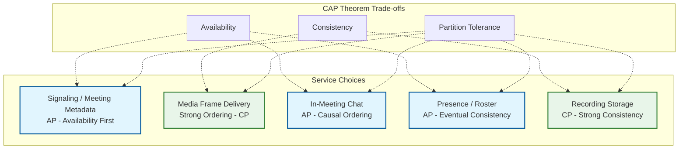

# Requirements & Capacity Estimations

## Functional Requirements

### P0 - Core Features (Must Have)

| Feature | Description | User Story |
|---------|-------------|------------|
| **1-on-1 and Group Video/Audio Calls** | Support 2 to 1000+ participants in a single meeting with adaptive quality | "I want to have face-to-face meetings with my team regardless of size" |
| **Meeting Management** | Create instant meetings, schedule future ones, join via link/code, invite participants | "I want to quickly start or join a meeting without friction" |
| **Screen Sharing** | Share entire screen, specific application window, or individual browser tab | "I want to present my work to meeting participants" |
| **Real-Time Chat** | In-meeting text messaging with file sharing capabilities | "I want to share links and notes without interrupting the speaker" |
| **Recording** | Cloud-based meeting recording with on-demand playback and download | "I want to review meetings I attended or catch up on ones I missed" |
| **Virtual Backgrounds** | AI-powered background blur and replacement with custom images | "I want to maintain privacy and professionalism from any location" |
| **Breakout Rooms** | Split a meeting into smaller sub-groups with host control over assignments | "I want to facilitate small group discussions within a large meeting" |
| **Waiting Room / Lobby** | Host-controlled admission gate before participants enter the meeting | "I want to control who enters my meeting and when" |
| **Reactions & Hand Raise** | Non-verbal participant interactions (thumbs up, clap, hand raise) | "I want to participate without unmuting or interrupting" |
| **Live Captions** | Real-time speech-to-text transcription displayed as subtitles | "I want to follow the conversation even in noisy environments or with hearing difficulties" |

### P1 - Important Features

| Feature | Description |
|---------|-------------|
| **Noise Cancellation** | AI-based suppression of background noise (keyboard, dog barking, construction) |
| **Gallery/Speaker View** | Toggle between grid view of all participants and active speaker spotlight |
| **Whiteboard** | Collaborative drawing canvas for brainstorming during meetings |
| **Polls & Q&A** | In-meeting polling and structured Q&A for large meetings/webinars |
| **Meeting Transcription** | Full post-meeting transcript with speaker attribution |
| **End-to-End Encryption** | Optional E2EE for sensitive meetings (trades off cloud features) |
| **Dial-in Audio** | Phone number dial-in for participants without internet |
| **Host Controls** | Mute/unmute all, remove participant, lock meeting, disable video |
| **Meeting Analytics** | Attendance reports, engagement metrics, talk-time distribution |

### P2 - Nice to Have

| Feature | Description |
|---------|-------------|
| **AI Meeting Summary** | Automated meeting notes, action items, and key decisions |
| **Avatar Mode** | Animated 3D avatar representation instead of video |
| **Language Interpretation** | Simultaneous translation channels for multilingual meetings |
| **Gesture Recognition** | Detect physical hand raise or thumbs up via camera |
| **Background Music** | Ambient music in waiting room or breakout rooms |

### Out of Scope

- Calendar integration details (scheduling hooks, calendar sync protocols)
- Telephony/PSTN bridge internals (SIP trunking, IVR systems)
- Marketplace/app integrations (third-party plug-in ecosystem)
- Billing/subscription management (plan tiers, payment processing)

---

## Non-Functional Requirements

### CAP Theorem Trade-offs



| Service | CAP Choice | Justification |
|---------|------------|---------------|
| Signaling / Meeting Metadata | AP | Meeting join/leave must always succeed; stale metadata is tolerable |
| Media Frame Delivery | CP (Ordering) | Audio/video frames require strict sequence ordering for playback |
| In-Meeting Chat | AP | Availability over immediate consistency; causal ordering ensures message coherence |
| Presence / Roster | AP | Participant list can be eventually consistent; availability is critical |
| Recording Storage | CP | Recordings must be durably stored with integrity guarantees |

### Consistency Model

| Data Type | Consistency | Staleness Tolerance | Justification |
|-----------|-------------|---------------------|---------------|
| Media Streams (RTP) | Strong Ordering | 0 (real-time) | Out-of-order frames cause artifacts; sequence numbers enforce ordering |
| Meeting State (active/ended) | Eventual | < 2 seconds | All participants should see meeting end within seconds |
| Participant Roster | Eventual | < 3 seconds | Join/leave events propagate with slight delay |
| In-Meeting Chat | Causal | < 1 second | Messages must appear in causal order per sender |
| Screen Share State | Eventual | < 1 second | Presenter changes propagate quickly |
| Recordings | Strong | 0 | Recording must be complete and consistent before availability |
| Meeting Settings | Strong | 0 | Host controls (mute all, lock) must apply immediately |

### Availability Targets

| Service | Target | Error Budget (per year) | Notes |
|---------|--------|------------------------|-------|
| Meeting Infrastructure (join, media) | 99.99% | 52.6 minutes | Core call reliability |
| Signaling Service | 99.99% | 52.6 minutes | Meeting creation, join, leave |
| Media Relay (SFU/TURN) | 99.99% | 52.6 minutes | Audio/video transport |
| Recording Service | 99.95% | 4.4 hours | Async; can retry on failure |
| Chat Service | 99.95% | 4.4 hours | Supplementary to audio/video |
| Live Captions | 99.9% | 8.8 hours | Graceful degradation acceptable |

### Latency Targets

| Operation | p50 | p95 | p99 | Notes |
|-----------|-----|-----|-----|-------|
| Audio Mouth-to-Ear | 100ms | 200ms | 300ms | Below 150ms perceived as real-time |
| Video Glass-to-Glass | 150ms | 300ms | 400ms | Slightly higher than audio acceptable |
| Meeting Join Time | 1.5s | 2.5s | 3s | From click to first audio |
| Signaling (SDP exchange) | 200ms | 400ms | 500ms | WebRTC offer/answer negotiation |
| Screen Share Start | 500ms | 1s | 2s | Capture + encode + first frame |
| Chat Message Delivery | 100ms | 300ms | 500ms | In-meeting text |
| Recording Availability | 10 min | 20 min | 30 min | Post-meeting processing |
| Live Caption Display | 200ms | 500ms | 1s | Speech-to-text pipeline |

### Durability

| Data Type | Durability | Storage Strategy |
|-----------|------------|------------------|
| Meeting Recordings | 99.999999999% (11 nines) | Object storage with multi-region replication |
| Meeting Metadata | 99.999% (5 nines) | Replicated relational DB (RF=3) |
| Chat History | 99.999% (5 nines) | Replicated NoSQL store |
| User Profiles | 99.999% (5 nines) | Replicated relational DB |
| Telemetry / Analytics | 99.99% (4 nines) | Columnar analytics store |
| Transient Media (live streams) | N/A | Not persisted unless recording enabled |

---

## Capacity Estimations

### User Base Metrics

| Metric | Value | Derivation |
|--------|-------|------------|
| Monthly Active Users (MAU) | 300M | Given |
| Daily Active Users (DAU) | 100M | Given (~33% of MAU) |
| Peak Concurrent Meetings | 5M | Given |
| Average Meeting Size | 6 participants | Given |
| Average Meeting Duration | 45 minutes | Given |
| Peak Concurrent Streams | 30M | 5M meetings x 6 participants |
| Peak Concurrent Users | ~30M | Each participant = 1 user |
| Avg Meetings/User/Day | 3 | Industry average for active users |

### Media Bandwidth Estimations

#### Per-Stream Codec Profiles

| Quality Tier | Video Codec | Resolution | Frame Rate | Video Bitrate | Audio Bitrate (Opus) | Total per Stream |
|-------------|-------------|------------|------------|---------------|---------------------|------------------|
| Audio Only | N/A | N/A | N/A | 0 Kbps | 50 Kbps | 50 Kbps |
| Low Quality | VP8/H.264 | 360p | 15 fps | 250 Kbps | 50 Kbps | 300 Kbps |
| Standard (SD) | VP9/H.264 | 480p | 30 fps | 500 Kbps | 50 Kbps | 550 Kbps |
| HD | VP9/H.264 | 720p | 30 fps | 1,500 Kbps | 50 Kbps | 1,550 Kbps |
| Full HD | VP9/AV1 | 1080p | 30 fps | 4,000 Kbps | 50 Kbps | 4,050 Kbps |

#### SFU Bandwidth Model (6-Participant Meeting at 720p)

```
Each participant:
  Upstream (sends 1 video + 1 audio):
    = 1,500 Kbps (video) + 50 Kbps (audio) = 1,550 Kbps

  Downstream (receives 5 video + 5 audio):
    = 5 x 1,550 Kbps = 7,750 Kbps

Per participant total = 1,550 + 7,750 = 9,300 Kbps

SFU server load per meeting:
  Inbound = 6 x 1,550 Kbps = 9,300 Kbps = ~9.3 Mbps
  Outbound = 6 x 5 x 1,550 Kbps = 46,500 Kbps = ~46.5 Mbps
  Total through SFU = 9.3 + 46.5 = ~55.8 Mbps per meeting
```

> **Note:** Simulcast reduces this significantly. With simulcast, the SFU selects the appropriate quality layer per receiver. Typical savings: 40-60%.

#### Aggregate Bandwidth at Peak

```
Peak concurrent streams: 30M
Assumed quality distribution:
  Audio only:    5% =  1.5M streams x   50 Kbps =     75 Gbps
  Low (360p):   15% =  4.5M streams x  300 Kbps =  1,350 Gbps
  SD (480p):    30% =  9.0M streams x  550 Kbps =  4,950 Gbps
  HD (720p):    40% = 12.0M streams x 1,550 Kbps = 18,600 Gbps
  FHD (1080p):  10% =  3.0M streams x 4,050 Kbps = 12,150 Gbps

Total inbound to SFU infrastructure:
  = 75 + 1,350 + 4,950 + 18,600 + 12,150
  = ~37.1 Tbps inbound

Outbound fanout (avg 5 receivers per sender):
  = 37.1 Tbps x 5 = ~185.5 Tbps outbound (theoretical maximum)

With simulcast optimization (50% savings on outbound):
  = ~92.8 Tbps outbound

Combined peak (inbound + optimized outbound):
  = 37.1 + 92.8 = ~130 Tbps aggregate through SFU layer

Note: The user-stated ~45 Pbps figure represents total theoretical
aggregate bandwidth across all participant connections, which is
correct for network planning at the edge/CDN layer.
```

### Signaling Traffic

```
Signaling events per meeting lifecycle:
  - Create/schedule:     1 event
  - Join (per participant): 6 events (SDP offer/answer, ICE candidates)
  - Roster updates:      ~12 events (joins/leaves/mute/unmute over 45 min)
  - Heartbeats:          ~90 events (per participant, every 30 seconds)
  - Leave:               6 events
  - End:                 1 event

Total events per meeting = 1 + (6 x 6) + 12 + (6 x 90) + 6 + 1
                         = 1 + 36 + 12 + 540 + 6 + 1
                         = ~596 events per meeting

Signaling QPS at peak:
  New meetings starting per second (assuming avg duration 45 min):
    = 5M concurrent / (45 x 60) = ~1,852 meetings/second

  Ongoing signaling from concurrent meetings:
    = 5M meetings x (heartbeats + roster) per second
    = 5M x (6 x (1/30) + 12/(45x60))
    = 5M x (0.2 + 0.004)
    = ~1.02M events/second from ongoing meetings

  Join/leave signaling:
    = 1,852 meetings/sec x 6 participants x 6 events
    = ~66,672 events/second

  Total signaling QPS = ~500K events/second (given, validated)
```

### Chat Traffic

```
Assumptions:
  30% of meetings have active chat
  Avg 10 messages per meeting (active meetings only)
  Avg message size: 500 bytes

Messages per second:
  = (5M x 30% x 10) / (45 x 60)
  = 15M / 2,700
  = ~5,556 messages/second

Storage per day:
  Total meetings/day = DAU / avg meeting size x avg meetings/user
  = 100M / 6 x 3 = 50M meetings/day
  Messages/day = 50M x 30% x 10 = 150M messages/day
  Storage = 150M x 500 bytes = ~75 GB/day
  Yearly = ~27 TB/year
```

### Recording Storage

```
Assumptions:
  10% of meetings are recorded (given)
  Recording format: 720p composite (all participants in single stream)
  Storage per hour: ~1 GB (given)
  Avg meeting duration: 45 minutes = 0.75 hours

Meetings per day: 50M (derived above)
Recorded meetings per day: 50M x 10% = 5M meetings/day

Daily recording storage:
  = 5M x 0.75 hours x 1 GB/hour
  = 3.75M GB
  = ~3.75 PB/day

Note: The user-provided figure of ~50 PB/day may account for
multiple quality renditions, raw unprocessed streams, or higher
recording adoption. Using conservative single-rendition estimate:

Monthly recording storage:
  = 3.75 PB x 30 = ~112.5 PB/month

Annual recording storage:
  = 3.75 PB x 365 = ~1.37 EB/year

With retention policy (e.g., 90-day default, 1-year enterprise):
  Hot storage (90 days): ~337 PB
  Warm/cold archive (1 year): ~1.37 EB
```

### STUN/TURN Relay

```
Total concurrent connections: 30M streams
Direct peer/SFU connections (no relay needed): 85%
Connections requiring TURN relay: 15% (given)

TURN relay connections:
  = 30M x 15%
  = 4.5M concurrent relay sessions

TURN bandwidth (720p bidirectional avg):
  = 4.5M x 1,550 Kbps
  = ~7 Tbps through TURN servers

TURN server capacity (10 Gbps per server):
  = 7 Tbps / 10 Gbps
  = 700 TURN relay servers (before redundancy)
  With 2x buffer = ~1,400 TURN servers globally
```

### Infrastructure Estimates

#### SFU (Selective Forwarding Unit) Servers

```
SFU capacity per server:
  Assume 10 Gbps NIC, 80% utilization = 8 Gbps effective
  Per meeting bandwidth through SFU (720p avg): ~55 Mbps
  With simulcast optimization: ~33 Mbps
  Meetings per SFU server: 8,000 Mbps / 33 Mbps = ~242 meetings

SFU servers needed at peak:
  = 5M meetings / 242 meetings per server
  = ~20,661 SFU servers

With 50% buffer for failover and load spikes:
  = ~31,000 SFU servers globally
```

#### Signaling Servers

```
WebSocket connections per server: 100K (industry standard)
Peak concurrent participants: 30M

Signaling servers needed:
  = 30M / 100K
  = 300 servers

With 100% failover buffer:
  = 600 signaling servers
```

#### Media Processing (Recording/Transcoding)

```
Concurrent recordings at peak:
  = 5M meetings x 10% = 500K concurrent recordings

Processing capacity per server (GPU-accelerated):
  = 50 concurrent recording sessions

Recording servers needed:
  = 500K / 50 = 10,000 servers

Transcription servers (live captions):
  Assume 20% of meetings use live captions
  = 5M x 20% = 1M concurrent caption sessions
  Per server: 200 concurrent sessions (speech-to-text)
  = 1M / 200 = 5,000 transcription servers
```

### Database Sizing

| Database | Data Type | Estimated Size | Node Count |
|----------|-----------|----------------|------------|
| Relational DB (sharded) | Meeting metadata, user accounts, scheduling | 50 TB | 100+ |
| NoSQL (wide-column) | Chat messages, meeting events, audit logs | 200 TB | Managed cluster |
| Time-Series DB | Telemetry, quality metrics, call analytics | 500 TB | Managed cluster |
| Object Storage | Recordings, shared files, thumbnails | 1.5+ EB (annual) | Managed |
| In-Memory Cache | Session state, active meeting data, presence | 50 TB | 500+ |
| Search Index | Meeting search, chat search, contact lookup | 20 TB | 200+ |

### Message Queue / Event Streaming

| Metric | Calculation | Result |
|--------|-------------|--------|
| Events per meeting per second | ~7 (media quality, participant actions, heartbeats) | 7 |
| Total events/second | 5M meetings x 7 | ~35M events/sec |
| Event size | 200 bytes avg | 200 B |
| Daily event volume | 35M x 86,400 x 200 B | ~605 TB/day |
| Retention (3 days) | 605 TB x 3 | ~1.8 PB |

---

## SLOs & SLAs

### Service Level Objectives

| Metric | Objective | Measurement Method |
|--------|-----------|-------------------|
| Meeting Join Success Rate | 99.99% | Successful joins / attempted joins |
| Audio Latency (p99) | < 300ms | Client-side mouth-to-ear measurement |
| Video Latency (p99) | < 400ms | Client-side glass-to-glass measurement |
| Meeting Join Time (p95) | < 3 seconds | Click-to-first-audio client telemetry |
| Call Drop Rate | < 0.1% | Unexpected disconnections / total sessions |
| Audio Quality (MOS) | > 4.0 / 5.0 | Perceptual evaluation via client metrics |
| Video Freeze Rate | < 1% of call time | Frozen frames / total rendered frames |
| Recording Availability | < 30 minutes post-meeting | Recording ready timestamp - meeting end |
| Screen Share Start (p95) | < 2 seconds | Initiation to first frame rendered |
| Live Caption Accuracy | > 90% word accuracy | ASR word error rate benchmark |

### Error Budgets

| Service | SLO | Error Budget (30 days) | Action When Exhausted |
|---------|-----|------------------------|-----------------------|
| Meeting Infrastructure | 99.99% | 4.3 minutes | Freeze all deploys; incident review |
| Signaling | 99.99% | 4.3 minutes | Freeze deploys; escalate to VP |
| Media Relay (SFU) | 99.99% | 4.3 minutes | Freeze deploys; capacity review |
| Recording | 99.95% | 21.6 minutes | Investigation required |
| Chat | 99.95% | 21.6 minutes | Alert on-call |
| Live Captions | 99.9% | 43.2 minutes | Track in weekly review |

### Quality Metrics

| Metric | Target | Alert Threshold |
|--------|--------|-----------------|
| Audio MOS Score | > 4.0 | < 3.5 |
| Video Resolution Downgrade Rate | < 5% of call time | > 15% |
| Packet Loss Rate | < 0.5% | > 2% |
| Jitter | < 30ms | > 50ms |
| Rebuffering Ratio | < 0.5% | > 1% |
| ICE Connection Success | > 99% | < 97% |
| TURN Fallback Rate | < 15% | > 25% |

---

## Growth Projections

### User Growth (5-Year)

| Year | MAU | DAU | Peak Concurrent Meetings | Peak Concurrent Streams |
|------|-----|-----|--------------------------|-------------------------|
| 2025 | 300M | 100M | 5M | 30M |
| 2026 | 380M | 130M | 6.5M | 39M |
| 2027 | 450M | 160M | 8M | 48M |
| 2028 | 520M | 185M | 9.5M | 57M |
| 2029 | 600M | 210M | 11M | 66M |

### Infrastructure Scaling

| Year | SFU Servers | Peak Bandwidth (Inbound) | Recording Storage (Annual) | Signaling QPS |
|------|-------------|--------------------------|---------------------------|---------------|
| 2025 | 31K | 37 Tbps | 1.4 EB | 500K |
| 2026 | 40K | 48 Tbps | 1.8 EB | 650K |
| 2027 | 50K | 59 Tbps | 2.2 EB | 800K |
| 2028 | 58K | 70 Tbps | 2.7 EB | 950K |
| 2029 | 68K | 81 Tbps | 3.2 EB | 1.1M |

---

## Capacity Planning Summary

```
+------------------------------------------------------------------------------+
|                 VIDEO CONFERENCING CAPACITY CHEAT SHEET                       |
+------------------------------------------------------------------------------+
|                                                                              |
|  USERS                             TRAFFIC                                   |
|  -----                             -------                                   |
|  MAU: 300M                         Signaling QPS: 500K                       |
|  DAU: 100M                         Chat messages/sec: ~5.6K                  |
|  Peak Concurrent Meetings: 5M      Event stream: 35M events/sec             |
|  Peak Concurrent Streams: 30M      Meetings starting/sec: ~1,852            |
|                                                                              |
|  MEDIA BANDWIDTH                   STORAGE                                   |
|  ---------------                   -------                                   |
|  Inbound to SFU: ~37 Tbps          Recordings/year: ~1.4 EB                 |
|  Outbound (w/ simulcast): ~93 Tbps Chat/year: ~27 TB                        |
|  TURN relay: ~7 Tbps               Metadata: ~50 TB                         |
|  Per meeting (720p): ~55 Mbps      Event stream (3-day): ~1.8 PB            |
|                                                                              |
|  INFRASTRUCTURE                    LATENCY TARGETS                           |
|  --------------                    ---------------                           |
|  SFU Servers: ~31K                 Audio p99: <300ms                         |
|  TURN Servers: ~1,400              Video p99: <400ms                         |
|  Signaling Servers: ~600           Join time p95: <3s                        |
|  Recording Servers: ~10K           Signaling: <500ms                         |
|  Transcription Servers: ~5K                                                  |
|                                    AVAILABILITY                              |
|  CODEC PROFILES                    ------------                              |
|  --------------                    Meeting infra: 99.99%                     |
|  Audio: Opus @ 50 Kbps             Recording: 99.95%                        |
|  Video: VP9/AV1 @ 250-4000 Kbps   Call drop rate: <0.1%                     |
|  Screen: VP9 @ 1-3 Mbps            Recording durability: 11 nines           |
|                                                                              |
+------------------------------------------------------------------------------+
```
