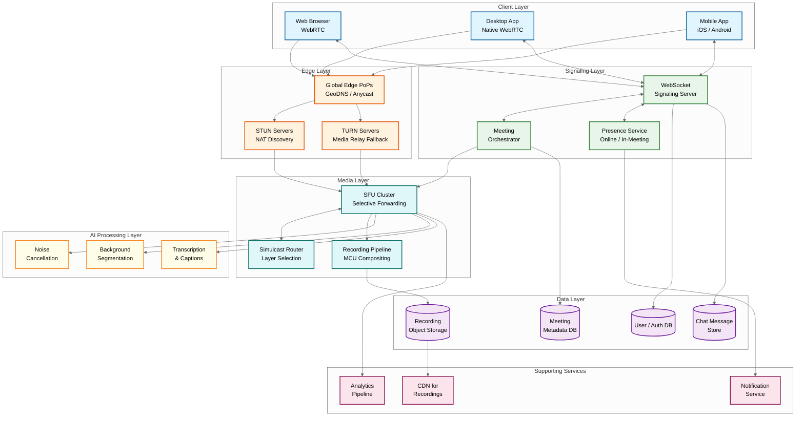
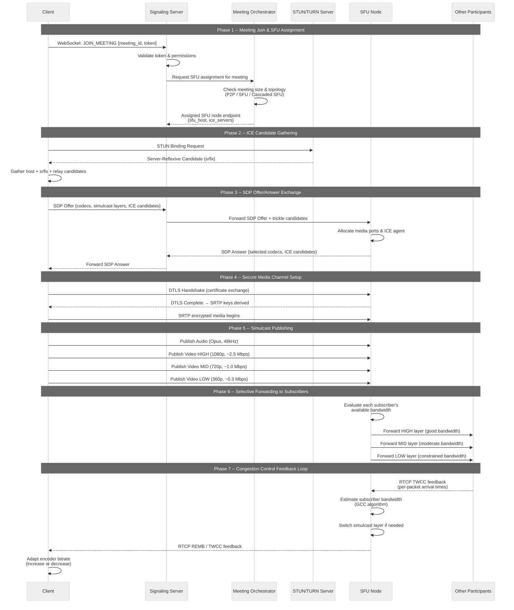

# High-Level Design

## Overview

This document presents the system architecture for a real-time video conferencing platform capable of supporting everything from 1-on-1 calls to meetings with 1000+ participants. The design centers on a **Selective Forwarding Unit (SFU)** for media routing, with hybrid P2P/SFU/Cascaded-SFU topology selection based on meeting size. Built on WebRTC (ICE, STUN/TURN, DTLS-SRTP), the architecture prioritizes sub-150ms mouth-to-ear latency through geo-distributed media servers, simulcast-based per-subscriber bandwidth adaptation, and AI-powered audio/video enhancement.

---

## System Architecture



**Key Components:**

| Component | Type | Purpose |
|-----------|------|---------|
| **Global Edge PoPs** | Network infrastructure | GeoDNS/Anycast routing to nearest media server; TLS termination |
| **STUN Servers** | Stateless | NAT type discovery and reflexive candidate gathering for ICE |
| **TURN Servers** | Stateful relay | Media relay for clients behind symmetric NATs or restrictive firewalls |
| **WebSocket Signaling Server** | Stateless (sticky sessions) | SDP offer/answer exchange, ICE candidate trickle, roster events |
| **Meeting Orchestrator** | Stateful | Topology selection (P2P/SFU/Cascaded), SFU node assignment, room lifecycle |
| **Presence Service** | In-memory (Redis-backed) | Tracks user online status, in-meeting state, device capabilities |
| **SFU Cluster** | Stateful, per-room | Receives one uplink per participant, selectively forwards to each subscriber |
| **Simulcast Router** | Embedded in SFU | Selects spatial/temporal layer per subscriber based on bandwidth estimates |
| **Recording Pipeline** | Async, MCU-based | Decodes all streams, composites into single video, re-encodes for storage |
| **Noise Cancellation** | Client-side + server-side | ML-based suppression of background noise from audio streams |
| **Background Segmentation** | Client-side (GPU) | Real-time person segmentation for virtual backgrounds and blur |
| **Transcription & Captions** | Server-side | Speech-to-text on audio streams, distributed as data channel messages |

---

## Data Flow: Join Meeting and Media Flow



**Flow Summary:**

| Phase | Protocol | Purpose |
|-------|----------|---------|
| Join & Assignment | WebSocket (TLS) | Authenticate, assign SFU node, distribute ICE server list |
| ICE Gathering | STUN/TURN (UDP) | Discover NAT type, gather connectivity candidates |
| SDP Exchange | WebSocket (TLS) | Negotiate codecs, media capabilities, ICE candidates |
| Secure Channel | DTLS over UDP | Mutual authentication, derive SRTP encryption keys |
| Media Publishing | SRTP over UDP | Client sends 3 simulcast layers + audio to SFU |
| Selective Forwarding | SRTP over UDP | SFU picks per-subscriber layer based on bandwidth |
| Congestion Control | RTCP (TWCC/REMB) | Continuous feedback loop for bitrate adaptation |

---

## Key Architectural Decisions

### Decision 1: SFU over MCU for Live Media

| Aspect | SFU (Selective Forwarding Unit) | MCU (Multipoint Control Unit) |
|--------|--------------------------------|-------------------------------|
| **How it works** | Each participant sends 1 uplink; SFU forwards packets to N-1 subscribers without transcoding | Server decodes all streams, composites into a single mixed stream, re-encodes |
| **Server CPU** | Minimal -- packet forwarding only | Very high -- decode + mix + encode per room |
| **Participants per server** | ~250-500 on commodity hardware | ~15-30 on same hardware (~15x fewer) |
| **Latency** | Low -- no transcoding delay | Higher -- decode/encode adds 50-100ms |
| **Client bandwidth** | Higher -- receives N-1 individual streams | Lower -- receives 1 composited stream |
| **Per-subscriber adaptation** | Yes -- different layer per subscriber | No -- single output quality |

**Decision**: SFU for all live meeting media. MCU only for the recording pipeline where compositing into a single file is required.

**Trade-off**: SFU shifts bandwidth and rendering cost to clients. A participant in a 25-person meeting receives 24 individual streams rather than 1 composited view. This is acceptable because modern clients have sufficient bandwidth and GPU capability for decoding, and the 15x server efficiency gain enables horizontal scaling to millions of concurrent meetings.

---

### Decision 2: Hybrid Topology (P2P -> SFU -> Cascaded SFU)

| Meeting Size | Topology | Rationale |
|-------------|----------|-----------|
| **1-on-1 calls** | P2P Direct | Lowest latency (no server hop), zero server cost, simplest path |
| **2-50 participants** | Single SFU Node | One server handles all media; P2P would require N*(N-1)/2 connections |
| **50-1000+ participants** | Cascaded SFU | Multiple SFU nodes connected in a forwarding tree; no single node could handle all streams |

```
P2P (2 users)          Single SFU (3-50)         Cascaded SFU (50-1000+)

  A <-----> B            A --→ SFU ←-- B          A --→ SFU-1 ←--→ SFU-2 ←-- D
                         C --↗     ↖-- D          B --↗              ↖-- E
                                                  C --↗              ↖-- F
```

**Auto-promotion**: When a third participant joins a P2P call, the system seamlessly upgrades to SFU topology. The Meeting Orchestrator detects the transition, assigns an SFU node, and both original participants re-negotiate their media connections through the SFU. This happens within 1-2 seconds, with a brief re-negotiation during which audio continues uninterrupted.

**Trade-off**: Topology transitions introduce brief quality disruptions but avoid over-provisioning server resources for small calls (which represent the vast majority of meetings).

---

### Decision 3: Simulcast over SVC

| Aspect | Simulcast | SVC (Scalable Video Coding) |
|--------|-----------|----------------------------|
| **Encoding** | 3 separate RTP streams at different resolutions (1080p, 720p, 360p) | Single encoded stream with embedded spatial/temporal layers |
| **Codec support** | VP8, H.264, VP9, AV1 -- all codecs | VP9 SVC, AV1 SVC only |
| **Browser support** | Universal -- all WebRTC browsers | Limited -- Chrome/Edge for VP9 SVC |
| **Upstream bandwidth** | 1.5-2x (sum of 3 layers) | 1.2-1.4x (layered encoding is more efficient) |
| **Switching speed** | Instant -- SFU switches between independent streams | Requires keyframe at new layer boundary |
| **Complexity** | Lower -- standard RTP | Higher -- layer dependency management |

**Decision**: Simulcast as the primary strategy for universal compatibility. SVC as an optimization for VP9/AV1-capable clients where the 30-40% upstream bandwidth savings is significant (especially on mobile).

**Trade-off**: Simulcast uses ~1.5-2x more upstream bandwidth than SVC. For a 1080p sender: simulcast requires ~3.8 Mbps up (2.5 + 1.0 + 0.3) versus ~2.8 Mbps for equivalent SVC. This is acceptable because upstream bandwidth is typically sufficient on broadband, and the universal codec/browser support avoids fragmentation.

---

### Decision 4: WebSocket for Signaling, UDP for Media

| Channel | Protocol | Transport | Properties |
|---------|----------|-----------|------------|
| **Signaling** (SDP, ICE candidates, roster updates) | WebSocket over TLS | TCP | Reliable, ordered, encrypted |
| **Media** (audio/video frames) | RTP over DTLS-SRTP | UDP | Unreliable, unordered, encrypted, low-latency |
| **Data Channel** (in-meeting chat, reactions, metadata) | SCTP over DTLS | UDP | Reliable or unreliable (configurable), encrypted |
| **Fallback** (restrictive networks) | TURN over TCP/443 | TCP | Tunnels UDP media through TCP on HTTPS port |

**Why not TCP for media?** TCP's head-of-line blocking and retransmission behavior adds unacceptable latency for real-time media. A single lost packet blocks all subsequent packets until retransmitted. With UDP, a lost video frame is simply skipped -- the decoder uses error concealment, and the next frame arrives on time. For interactive conversation, a dropped frame is invisible but a 200ms stall is disruptive.

**Fallback path**: Approximately 8-12% of users are behind restrictive corporate firewalls or symmetric NATs that block UDP entirely. For these users, the system falls back to TURN relay over TCP port 443 (which appears as HTTPS traffic to firewalls). This adds 30-50ms latency but ensures connectivity.

---

### Decision 5: Geo-Distributed Media Servers

| Aspect | Design Choice |
|--------|--------------|
| **Deployment** | Media servers at 200+ global edge PoPs (co-located with ISP peering points) |
| **Routing** | GeoDNS + Anycast directs clients to nearest PoP |
| **Single-region meeting** | All participants connect to same regional SFU -- single hop |
| **Multi-region meeting** | Participants connect to nearest SFU; SFUs cascade via private backbone |
| **Backbone** | Private fiber network between PoPs (lower latency, less jitter than public internet) |

```
Multi-Region Cascaded SFU Example:

  US-West Participants          US-East Participants          EU Participants
        |                              |                           |
    SFU-West ←--- Private Backbone ---→ SFU-East ←--- Backbone ---→ SFU-EU
    (San Jose)                         (Virginia)                  (Frankfurt)
```

**Trade-off**: Cascading adds 1 hop of latency between regions (typically 30-80ms depending on distance). However, each participant's first hop to their nearest SFU is minimized (typically <20ms). Without cascading, participants in distant regions would connect directly to a single SFU, experiencing 100-200ms+ first-hop latency. The cascaded approach provides better worst-case latency at the cost of slightly higher inter-region latency.

**SFU node selection algorithm**:
1. Measure RTT from client to 3 nearest PoPs (via STUN)
2. Select the PoP with lowest RTT that has available SFU capacity
3. If the meeting already has an SFU node in that region, route to it
4. If cross-region, establish SFU cascade link over private backbone

---

### Decision 6: Database Choices

| Data Type | Storage | Rationale |
|-----------|---------|-----------|
| **Meeting metadata** (room state, participant roster, settings) | Relational DB (strongly consistent) | Meeting state requires ACID -- concurrent joins/leaves must be serialized; roster must be consistent across all signaling servers |
| **Chat messages** (in-meeting text chat) | Wide-column NoSQL | High write throughput for large meetings; time-ordered access pattern; no complex joins needed |
| **User sessions & presence** | In-memory cache (Redis) | Sub-millisecond lookup for presence checks; ephemeral data (lost on restart is acceptable); pub/sub for presence change notifications |
| **Recordings** | Object Storage with CDN | Large binary blobs (GBs per recording); write-once-read-many pattern; CDN distribution for playback |
| **Analytics & quality metrics** | Column-oriented data warehouse | Append-only time-series data (bitrate, packet loss, MOS scores); aggregation queries across millions of meetings |

**Why not a single database?** Each data type has fundamentally different access patterns:
- Meeting metadata: small records, high consistency, moderate throughput
- Chat: append-heavy, time-ordered, partition by meeting_id
- Presence: ephemeral, sub-millisecond reads, pub/sub required
- Recordings: multi-GB blobs, sequential write, random read
- Analytics: columnar aggregation over billions of rows

Using specialized stores for each avoids the "one-size-fits-none" trap.

---

## Architecture Pattern Checklist

| Pattern | Decision | Rationale |
|---------|----------|-----------|
| **Sync vs Async** | Async for signaling events; real-time UDP for media | Signaling tolerates ~100ms delay; media must be sub-150ms end-to-end |
| **Event-driven vs Request-response** | Event-driven roster/presence via pub/sub | Participant join/leave, mute/unmute, screen-share events pushed to all clients |
| **Push vs Pull** | Push for live media (SFU pushes to subscribers) | Pull model would add RTT of request-response per frame -- unacceptable at 30-60 fps |
| **Stateless vs Stateful** | Stateful SFU nodes (per-room media state); stateless signaling | SFU must maintain per-room forwarding tables, SRTP contexts, bandwidth estimates; signaling servers are interchangeable |
| **Read-heavy vs Write-heavy** | Write-heavy for media streams; read-heavy for meeting metadata | Each participant writes 1 stream but the SFU reads N streams per room; metadata is read on every join |
| **Real-time vs Batch** | Real-time for live media; batch for recording compositing and analytics | Live path is latency-critical; recording and analytics can be processed asynchronously |
| **Edge vs Origin** | Edge for media routing (SFU at PoPs); origin for signaling and orchestration | Media latency is the critical constraint; signaling can tolerate 50-100ms to centralized servers |

---

## Component Interactions

```mermaid
%%{init: {'theme': 'neutral'}}%%
flowchart LR
    subgraph Join["Join Path"]
        J1[Client] --> J2[Signaling Server]
        J2 --> J3[Meeting Orchestrator]
        J3 --> J4[SFU Assignment]
        J4 --> J5[ICE / SDP Exchange]
        J5 --> J6[DTLS-SRTP Established]
    end

    subgraph Live["Live Media Path"]
        L1[Client Encoder] --> L2[Simulcast Layers]
        L2 --> L3[SFU Ingest]
        L3 --> L4[Layer Selection<br/>per Subscriber]
        L4 --> L5[SRTP Forward<br/>to Subscribers]
    end

    subgraph Control["Control Path"]
        C1[RTCP TWCC<br/>from Subscriber] --> C2[Bandwidth<br/>Estimation]
        C2 --> C3[Layer Switch<br/>Decision]
        C3 --> C4[REMB Feedback<br/>to Publisher]
        C4 --> C5[Encoder Bitrate<br/>Adaptation]
    end

    subgraph Record["Recording Path"]
        R1[SFU Taps<br/>Media Streams] --> R2[MCU Compositor]
        R2 --> R3[Re-encode<br/>Single Output]
        R3 --> R4[Object Storage]
        R4 --> R5[CDN Distribution]
    end

    classDef join fill:#e1f5fe,stroke:#01579b,stroke-width:2px
    classDef live fill:#e8f5e9,stroke:#2e7d32,stroke-width:2px
    classDef control fill:#fff3e0,stroke:#e65100,stroke-width:2px
    classDef record fill:#f3e5f5,stroke:#6a1b9a,stroke-width:2px

    class J1,J2,J3,J4,J5,J6 join
    class L1,L2,L3,L4,L5 live
    class C1,C2,C3,C4,C5 control
    class R1,R2,R3,R4,R5 record
```


