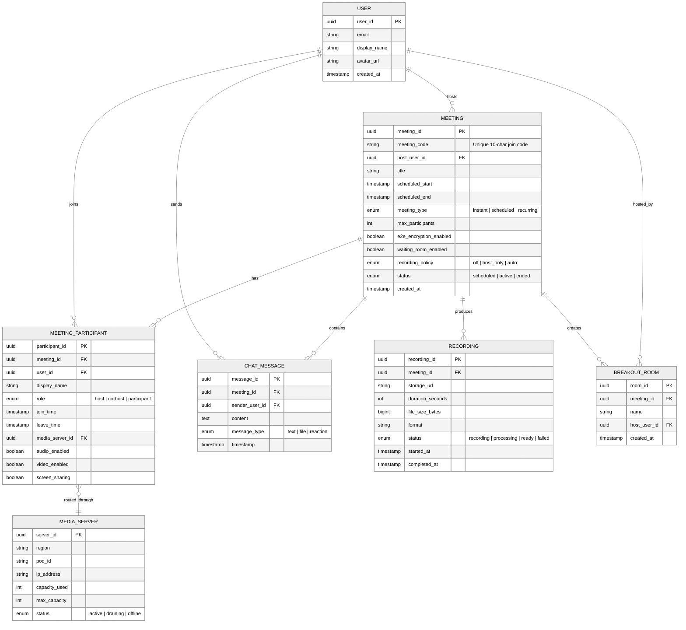

# Low-Level Design

## Overview

This document details the data models, database schemas, API specifications, and core algorithms for the Google Meet / Zoom video conferencing platform. Focus areas include the SFU selective forwarding logic, active speaker detection, WebRTC signaling, congestion control, and media server selection -- the components that make sub-200ms real-time communication possible at scale.

---

## 1. Data Models

### Core Entities



---

### Meeting Schema (Detailed)

```
Meeting {
    // Identity
    meeting_id: UUID (PK)
    meeting_code: String             // 10-char unique code (e.g., "abc-defg-hij")

    // Ownership
    host_user_id: UUID (FK → User)
    organization_id: UUID            // Tenant for enterprise isolation

    // Scheduling
    title: String                    // Max 200 chars
    scheduled_start: Timestamp
    scheduled_end: Timestamp
    meeting_type: Enum               // INSTANT, SCHEDULED, RECURRING
    recurrence_rule: String          // RFC 5545 RRULE for recurring meetings

    // Configuration
    max_participants: Integer         // Default: 100 free, 1000 enterprise
    e2e_encryption_enabled: Boolean   // Disables server-side recording when true
    waiting_room_enabled: Boolean
    recording_policy: Enum            // OFF, HOST_ONLY, AUTO
    mute_on_entry: Boolean
    allow_screen_share: Enum          // HOST_ONLY, ALL
    enable_captions: Boolean

    // Runtime State (ephemeral, in-memory)
    status: Enum                      // SCHEDULED, ACTIVE, ENDED
    active_participant_count: Integer  // Cached counter
    active_speaker_id: UUID           // Current dominant speaker

    // Metadata
    created_at: Timestamp
    updated_at: Timestamp
    ended_at: Timestamp
}
```

---

### MeetingParticipant Schema (Detailed)

```
MeetingParticipant {
    // Identity
    participant_id: UUID (PK)
    meeting_id: UUID (FK → Meeting)
    user_id: UUID (FK → User)        // Null for guest participants

    // Display
    display_name: String
    avatar_url: String

    // Role
    role: Enum                        // HOST, CO_HOST, PARTICIPANT

    // Connection
    media_server_id: UUID (FK → MediaServer)
    signaling_session_id: String      // WebSocket session identifier
    ice_connection_state: Enum        // NEW, CHECKING, CONNECTED, FAILED
    transport: Enum                   // UDP, TCP, TURN_UDP, TURN_TCP

    // Media State
    audio_enabled: Boolean
    video_enabled: Boolean
    screen_sharing: Boolean
    audio_codec: String               // e.g., "opus/48000/2"
    video_codec: String               // e.g., "VP9", "H.264", "AV1"
    video_resolution: String          // e.g., "1280x720"
    simulcast_layers: [Enum]          // [HIGH, MEDIUM, LOW]

    // Bandwidth (ephemeral)
    estimated_bandwidth_bps: Integer
    packet_loss_rate: Float
    round_trip_time_ms: Integer

    // Lifecycle
    join_time: Timestamp
    leave_time: Timestamp             // Null while connected
    leave_reason: Enum                // LEFT, KICKED, NETWORK_FAILURE, TIMEOUT
}
```

---

### MediaServer Schema (Detailed)

```
MediaServer {
    // Identity
    server_id: UUID (PK)
    hostname: String

    // Location
    region: String                    // e.g., "us-east1", "eu-west1"
    pod_id: String                    // Cluster/pod within region
    ip_address: String               // Public IP for ICE candidates
    private_ip: String               // Internal for cascaded SFU routing

    // Capacity
    capacity_used: Integer            // Current participant count
    max_capacity: Integer             // Typically 250-500 per server
    cpu_usage_pct: Float
    bandwidth_used_mbps: Float
    bandwidth_max_mbps: Float

    // State
    status: Enum                      // ACTIVE, DRAINING, OFFLINE
    last_health_check: Timestamp
    version: String                   // SFU software version

    // Cascade
    cascade_peers: [UUID]             // Other SFUs in same meeting for large rooms
}
```

---

## Indexing Strategy

### Primary Indexes

| Table | Index | Purpose |
|-------|-------|---------|
| `Meeting` | `meeting_code` (UNIQUE) | Lookup by join code -- the primary entry point for participants |
| `Meeting` | `(host_user_id, status)` | User's active/scheduled meetings for dashboard |
| `Meeting` | `(status, scheduled_start)` | Upcoming meetings for scheduling service |
| `MeetingParticipant` | `(meeting_id, leave_time IS NULL)` | Active roster for a live meeting |
| `MeetingParticipant` | `(user_id, join_time DESC)` | User's meeting history (most recent first) |
| `MediaServer` | `(region, status, capacity_used)` | Server selection -- find least loaded active server in region |
| `ChatMessage` | `(meeting_id, timestamp)` | Chronological message retrieval within a meeting |
| `Recording` | `(meeting_id)` | All recordings for a meeting |
| `Recording` | `(status)` | Processing pipeline picks up pending recordings |

### Index Design Rationale

```
Meeting.meeting_code Index:
    - B-tree unique index
    - Meeting join is the highest-frequency lookup
    - 10-char alphanumeric code yields ~3.6 trillion combinations
    - Hash index considered but B-tree preferred for range-scan debugging

MeetingParticipant (meeting_id, leave_time IS NULL):
    - Partial/filtered index -- only indexes rows where leave_time is null
    - Active roster query is the hottest path during a live meeting
    - Eliminates scanning historical participant records

MediaServer (region, status, capacity_used):
    - Composite index enables single-query server selection
    - Query pattern: WHERE region = ? AND status = 'active' ORDER BY capacity_used ASC LIMIT 1
    - Small table (~1K rows globally) but queried on every join
```

---

## Partitioning Strategy

### Meeting Table

```
Strategy: Hash partition by meeting_id
Shards: 256 logical partitions

Rationale:
    - meeting_id is the primary access pattern for all meeting operations
    - Hash distribution ensures even spread (no time-based hotspots)
    - All participant, chat, and recording queries join on meeting_id
      and are co-located on the same shard
```

### MeetingParticipant Table

```
Strategy: Partition by meeting_id (co-located with Meeting)
Shard Key: meeting_id

Rationale:
    - Participant queries are always scoped to a single meeting
    - Active roster fetch hits a single partition
    - Co-location with Meeting avoids cross-shard joins
    - User history query (by user_id) requires scatter-gather
      but is infrequent and tolerable at higher latency
```

### ChatMessage Table

```
Strategy: Partition by meeting_id + time-based secondary bucketing

Primary Partition: meeting_id (co-located with meeting data)
Secondary Bucket: timestamp bucketed by hour

Rationale:
    - Chat messages are always retrieved per-meeting
    - Time-based bucketing within a meeting prevents unbounded partition growth
    - Typical meeting duration 30-60 minutes = 1-2 buckets
    - Large webinars with heavy chat may produce 100K+ messages per hour
```

### Recording Table

```
Strategy: Partition by meeting_id

Rationale:
    - Recordings are accessed per-meeting
    - Typically 1-3 recordings per meeting (host started/stopped)
    - Status-based processing query uses a global secondary index
      (small result set -- only active processing jobs)
```

### MediaServer Table

```
Strategy: No partitioning

Rationale:
    - Small dataset (~500-2000 rows globally)
    - Entire table cached in memory by the server selection service
    - Updated via heartbeats every 5 seconds
    - Partitioning would add unnecessary complexity
```

---

## Data Retention Policy

| Data Category | Free Tier | Enterprise Tier | Storage Layer |
|---------------|-----------|-----------------|---------------|
| Active meeting state | Ephemeral (in-memory, discarded after meeting ends) | Same | Redis / in-process memory |
| Meeting metadata | 1 year | Indefinite | PostgreSQL |
| Chat messages | 30 days | 1 year | PostgreSQL + cold archive |
| Recordings | 30 days | Configurable (up to indefinite) | Object storage (tiered) |
| Analytics (raw) | Deleted after 90 days | Deleted after 1 year | Data warehouse |
| Analytics (aggregated) | Aggregated at 90 days, retained 1 year | Aggregated at 90 days, retained indefinitely | Data warehouse |

```
Retention Enforcement:
    - TTL-based expiration jobs run nightly
    - Recordings transition: Hot storage (30 days) → Warm (90 days) → Cold archive
    - Chat messages soft-deleted first, hard-deleted after grace period
    - Enterprise customers can configure legal hold to suspend all deletion
```

---

## 2. API Design

### REST APIs (Meeting Management)

#### Create Meeting

```
POST /api/v1/meetings
Headers:
    Authorization: Bearer {access_token}
    Idempotency-Key: {client_generated_uuid}
    Content-Type: application/json

Request:
{
    "title": "Weekly Team Standup",
    "scheduled_start": "2026-03-10T09:00:00Z",
    "scheduled_end": "2026-03-10T09:30:00Z",
    "settings": {
        "max_participants": 50,
        "waiting_room": true,
        "recording": "host_only",
        "e2e_encryption": false,
        "mute_on_entry": true
    }
}

Response: 201 Created
{
    "meeting_id": "m_8f14e45f-ceea-4e1b-b5d0-7c3e2a1b",
    "meeting_code": "abc-defg-hij",
    "join_url": "https://meet.example.com/abc-defg-hij",
    "host_user_id": "u_12345",
    "title": "Weekly Team Standup",
    "scheduled_start": "2026-03-10T09:00:00Z",
    "scheduled_end": "2026-03-10T09:30:00Z",
    "settings": { ... },
    "status": "scheduled",
    "created_at": "2026-03-08T15:00:00Z"
}
```

#### Get Meeting Details

```
GET /api/v1/meetings/{meeting_id}
Headers:
    Authorization: Bearer {access_token}

Response: 200 OK
{
    "meeting_id": "m_8f14e45f-ceea-4e1b-b5d0-7c3e2a1b",
    "meeting_code": "abc-defg-hij",
    "host_user_id": "u_12345",
    "title": "Weekly Team Standup",
    "scheduled_start": "2026-03-10T09:00:00Z",
    "scheduled_end": "2026-03-10T09:30:00Z",
    "settings": { ... },
    "status": "active",
    "participant_count": 12,
    "created_at": "2026-03-08T15:00:00Z"
}
```

#### Join Meeting

```
POST /api/v1/meetings/{meeting_id}/join
Headers:
    Authorization: Bearer {access_token}
    Content-Type: application/json

Request:
{
    "display_name": "Jane Smith",
    "audio_enabled": true,
    "video_enabled": true
}

Response: 200 OK
{
    "participant_id": "p_a1b2c3d4",
    "signaling_url": "wss://media-us-east1.example.com/ws",
    "ice_servers": [
        {
            "urls": ["stun:stun.example.com:3478"],
            "credential": null,
            "username": null
        },
        {
            "urls": ["turn:turn-us.example.com:3478?transport=udp"],
            "credential": "ephemeral_credential_abc",
            "username": "participant_p_a1b2c3d4"
        }
    ],
    "media_server_id": "ms_us_east1_pod3_07",
    "meeting_state": {
        "participants": [ ... ],
        "active_speaker_id": "p_xyz789",
        "recording_active": false
    }
}
```

#### Remove Participant (Host Action)

```
DELETE /api/v1/meetings/{meeting_id}/participants/{participant_id}
Headers:
    Authorization: Bearer {access_token}

Response: 204 No Content
```

#### Recording Controls

```
POST /api/v1/meetings/{meeting_id}/recordings/start
Headers:
    Authorization: Bearer {access_token}

Response: 200 OK
{
    "recording_id": "r_98765",
    "status": "recording",
    "started_at": "2026-03-10T09:05:00Z"
}

POST /api/v1/meetings/{meeting_id}/recordings/stop
Headers:
    Authorization: Bearer {access_token}

Response: 200 OK
{
    "recording_id": "r_98765",
    "status": "processing",
    "started_at": "2026-03-10T09:05:00Z",
    "stopped_at": "2026-03-10T09:28:00Z"
}
```

#### Fetch Chat Messages

```
GET /api/v1/meetings/{meeting_id}/chat?after_timestamp=2026-03-10T09:10:00Z&limit=50
Headers:
    Authorization: Bearer {access_token}

Response: 200 OK
{
    "messages": [
        {
            "message_id": "msg_001",
            "sender_user_id": "u_12345",
            "display_name": "Jane Smith",
            "content": "Can everyone see my screen?",
            "message_type": "text",
            "timestamp": "2026-03-10T09:10:05Z"
        }
    ],
    "next_cursor": "eyJ0cyI6IjIwMjYtMDMtMTBUMDk6MTA6MDVaIn0="
}
```

---

### WebSocket Signaling Protocol

The signaling channel is established after the join API returns a `signaling_url`. It carries WebRTC negotiation messages, participant state updates, and real-time meeting events.

#### Connection Handshake

```
Client opens: wss://media-us-east1.example.com/ws
    ?participant_id=p_a1b2c3d4
    &meeting_id=m_8f14e45f
    &protocol_version=2

Server responds with initial state on connect.
```

#### Client-to-Server Messages

```
// SDP Offer (initiating media connection)
{ "type": "offer", "sdp": "v=0\r\n..." }

// SDP Answer (responding to server renegotiation)
{ "type": "answer", "sdp": "v=0\r\n..." }

// ICE Candidate (network path discovery)
{ "type": "ice-candidate", "candidate": "candidate:1 1 udp 2122260223 ..." }

// Mute/Unmute local track
{ "type": "mute", "track": "audio" }
{ "type": "unmute", "track": "video" }

// Subscribe to a participant's stream at specific quality
{ "type": "subscribe", "participant_id": "p_xyz789", "quality": "high" }

// Pin a participant (forces high quality)
{ "type": "pin", "participant_id": "p_xyz789" }

// Unpin
{ "type": "unpin", "participant_id": "p_xyz789" }

// Request screen share permission
{ "type": "screen-share-start" }
{ "type": "screen-share-stop" }
```

#### Server-to-Client Messages

```
// Participant lifecycle
{ "type": "participant-joined", "participant": {
    "participant_id": "p_newuser",
    "display_name": "Bob",
    "audio_enabled": true,
    "video_enabled": true,
    "role": "participant"
}}

{ "type": "participant-left", "participant_id": "p_olduser" }

// Active speaker changed (drives UI layout and video quality)
{ "type": "active-speaker", "participant_id": "p_xyz789", "level": 0.8 }

// Bandwidth adaptation signal
{ "type": "quality-update", "available_bandwidth": 2500000 }

// Recording state change
{ "type": "recording-started", "recording_id": "r_98765" }
{ "type": "recording-stopped", "recording_id": "r_98765" }

// Media state change from another participant
{ "type": "media-state", "participant_id": "p_xyz789",
  "audio_enabled": false, "video_enabled": true }

// SFU renegotiation (server requests new SDP exchange)
{ "type": "offer", "sdp": "v=0\r\n..." }

// Meeting-level events
{ "type": "meeting-ended", "reason": "host_ended" }
{ "type": "waiting-room-admit", "participant_id": "p_waiting1" }
```

---

### Idempotency

```
Join Meeting:
    - Idempotent by (user_id, meeting_id)
    - If user already has an active session, return existing participant_id
      and signaling_url rather than creating a duplicate
    - Handles network retry and page refresh gracefully

Recording Start/Stop:
    - Idempotent with status check
    - Starting an already-recording meeting returns current recording_id
    - Stopping an already-stopped recording returns the completed recording

Chat Messages:
    - Client generates message_id (UUID v7 for time-ordering)
    - Server deduplicates by message_id within a 24-hour window
    - Redis cache stores processed message_ids with TTL

Meeting Creation:
    - Idempotency-Key header prevents duplicate meetings on network retry
    - Server caches response by Idempotency-Key for 24 hours
```

---

### Rate Limiting

| Endpoint | Limit | Window | Rationale |
|----------|-------|--------|-----------|
| Meeting creation | 50 | Per hour per user | Prevents meeting spam |
| Join requests | 10 | Per minute per user | Prevents rapid rejoin loops |
| Chat messages | 30 | Per minute per participant | Prevents chat flooding |
| Signaling messages | 100 | Per second per connection | ICE candidates can burst during negotiation |
| Recording start/stop | 5 | Per minute per meeting | Prevents toggle abuse |
| API (general) | 1000 | Per minute per user | Overall safety net |

```
Implementation:
    - Token bucket algorithm per (user_id, endpoint) pair
    - Stored in Redis with atomic INCR + EXPIRE
    - Response headers: X-RateLimit-Limit, X-RateLimit-Remaining, X-RateLimit-Reset
    - 429 Too Many Requests response with Retry-After header
```

---

### API Versioning

```
REST APIs:
    - URL-based versioning: /api/v1/, /api/v2/
    - Major version in URL, minor/patch via feature flags
    - Minimum 12-month deprecation window for major versions

WebSocket Signaling:
    - Protocol version in connection query parameter: ?protocol_version=2
    - Server supports N and N-1 concurrently
    - Version negotiation during handshake
    - Breaking changes require new protocol version
```

---

## 3. Core Algorithms

### 3a. SFU Selective Forwarding Algorithm

The Selective Forwarding Unit (SFU) is the central media routing component. Unlike an MCU (which decodes, mixes, and re-encodes), the SFU forwards media packets without transcoding -- selecting which simulcast layer to send to each subscriber based on their context.

```
ALGORITHM: SFU_Selective_Forward

INPUT: room (meeting state), newMediaPacket (incoming RTP packet)
OUTPUT: forwarded packets to eligible subscribers

PROCEDURE:
    sender = newMediaPacket.participantId
    track = newMediaPacket.trackType      // AUDIO, VIDEO, SCREENSHARE

    FOR EACH subscriber IN room.participants:
        IF subscriber.id == sender:
            CONTINUE                      // Never echo back to sender

        IF track == AUDIO:
            // Forward all audio streams -- mixing happens client-side
            // Client mixes up to N loudest speakers in its audio pipeline
            IF subscriber.audioEnabled:
                Forward(subscriber, newMediaPacket)

        ELSE IF track == VIDEO:
            // Select simulcast layer based on subscriber context
            desiredQuality = Determine_Quality(subscriber, sender, room)
            IF newMediaPacket.simulcastLayer == desiredQuality:
                Forward(subscriber, newMediaPacket)

        ELSE IF track == SCREENSHARE:
            // Screen share always forwarded at highest available quality
            // Content is high-detail (text, code) -- quality reduction unacceptable
            IF newMediaPacket.simulcastLayer == HIGH:
                Forward(subscriber, newMediaPacket)


FUNCTION Determine_Quality(subscriber, sender, room):
    // Priority 1: Active speaker gets highest quality the subscriber can receive
    IF sender == room.activeSpeaker:
        IF subscriber.availableBandwidth > 1500000:    // 1.5 Mbps
            RETURN HIGH                                // 720p or 1080p
        ELSE IF subscriber.availableBandwidth > 500000: // 500 Kbps
            RETURN MEDIUM                              // 360p
        ELSE:
            RETURN LOW                                 // 180p

    // Priority 2: Pinned participant gets high quality regardless
    IF sender IN subscriber.pinnedParticipants:
        RETURN HIGH

    // Priority 3: Gallery view -- quality depends on grid size
    IF room.participantCount > 9:
        RETURN LOW                                     // Many thumbnails
    ELSE:
        RETURN MEDIUM                                  // Fewer, larger tiles
```

**Complexity**: O(N) per incoming packet, where N is the number of subscribers in the room. For a 100-person meeting, each audio packet triggers 99 forwarding decisions. This is constant-time per subscriber since `Determine_Quality` performs only comparisons and lookups.

---

### 3b. Active Speaker Detection

Active speaker detection determines which participant is currently speaking, driving the UI layout (speaker view) and video quality renegotiation (the active speaker receives the highest quality from the SFU).

```
ALGORITHM: Detect_Active_Speaker

INPUT: room (meeting state with participant audio levels)
OUTPUT: updated active speaker, broadcast notification

CONSTANTS:
    ALPHA = 0.3                       // Exponential moving average smoothing factor
    SPEECH_THRESHOLD = 0.05           // RMS audio level threshold (0.0 - 1.0)
    MIN_SPEECH_DURATION = 300ms       // Sustained speech to qualify as speaker
    DETECTION_INTERVAL = 100ms        // Run every 100ms (10 Hz)

PROCEDURE (runs every DETECTION_INTERVAL):

    // Step 1: Update smoothed audio levels for all participants
    FOR EACH participant IN room.participants:
        audioLevel = participant.lastAudioRMS   // Raw RMS from media pipeline

        // Exponential moving average to smooth out transient noise
        participant.smoothedLevel =
            ALPHA * audioLevel + (1 - ALPHA) * participant.smoothedLevel

        // Track continuous speech duration
        IF participant.smoothedLevel > SPEECH_THRESHOLD:
            participant.speechDuration += DETECTION_INTERVAL
        ELSE:
            participant.speechDuration = 0

    // Step 2: Find candidates who have sustained speech
    candidates = room.participants
        .FILTER(p => p.speechDuration >= MIN_SPEECH_DURATION)
        .SORT_BY(p => p.smoothedLevel, DESCENDING)

    // Step 3: Update active speaker only if changed (prevents flicker)
    IF candidates.length > 0 AND candidates[0].id != room.activeSpeaker:
        room.activeSpeaker = candidates[0].id

        // Broadcast to all participants for UI update
        Broadcast_Active_Speaker(room, candidates[0].id)

        // Trigger SFU to renegotiate video layers
        // New speaker gets HIGH quality from all subscribers
        Renegotiate_Video_Layers(room)
```

**Complexity**: O(P) where P is the number of participants, running at 10 Hz. The exponential moving average is O(1) per participant. Sort is O(P log P) but is dominated by the linear scan since P is bounded by meeting size (typically < 1000). The 300ms sustained speech threshold prevents rapid speaker switching when multiple people briefly vocalize (e.g., "uh huh" acknowledgments).

---

### 3c. Congestion Control / Bandwidth Estimation (GCC-based)

The bandwidth estimator uses Google Congestion Control (GCC) principles to continuously adapt the sending bitrate. It combines delay-based estimation (Kalman filter on inter-arrival time deltas) with loss-based correction.

```
ALGORITHM: Estimate_Bandwidth_GCC

INPUT: twccFeedback (Transport-Wide Congestion Control feedback from receiver)
OUTPUT: targetBitrate for the sender

CONSTANTS:
    OVERUSE_THRESHOLD = 12.5ms        // Delay gradient indicating congestion
    UNDERUSE_THRESHOLD = -12.5ms      // Delay gradient indicating spare capacity
    MIN_BITRATE = 100000              // 100 Kbps absolute floor
    MAX_BITRATE = 5000000             // 5 Mbps absolute ceiling
    MULTIPLICATIVE_DECREASE = 0.85    // Reduce by 15% on overuse
    ADDITIVE_INCREASE = 1.05          // Increase by 5% on underuse

STATE:
    kalmanState                       // Kalman filter state (estimate, variance)
    currentBitrate                    // Current sending bitrate

PROCEDURE:
    // Step 1: Delay-based estimation using TWCC feedback
    FOR EACH packetGroup IN twccFeedback.groups:
        // Inter-arrival delta: difference between send spacing and receive spacing
        interArrivalDelta = packetGroup.arrivalDelta - packetGroup.sendDelta

        // Kalman filter predicts and corrects delay gradient
        kalmanState.Predict()
        measurement = interArrivalDelta
        kalmanState.Update(measurement)
        estimatedGradient = kalmanState.estimate

        // Classify network state
        IF estimatedGradient > OVERUSE_THRESHOLD:
            state = OVERUSE            // Queue building up at bottleneck
        ELSE IF estimatedGradient < UNDERUSE_THRESHOLD:
            state = UNDERUSE           // Network has spare capacity
        ELSE:
            state = NORMAL             // Stable

    // Step 2: Adjust sending rate based on network state
    SWITCH state:
        CASE OVERUSE:
            // Multiplicative decrease -- respond quickly to congestion
            targetBitrate = currentBitrate * MULTIPLICATIVE_DECREASE
        CASE UNDERUSE:
            // Additive increase -- probe for spare capacity conservatively
            targetBitrate = currentBitrate * ADDITIVE_INCREASE
        CASE NORMAL:
            targetBitrate = currentBitrate   // Hold steady

    // Step 3: Apply loss-based correction on top of delay-based
    packetLossRate = twccFeedback.lossRate

    IF packetLossRate > 0.10:
        // Severe loss: scale down proportionally
        targetBitrate = targetBitrate * (1.0 - packetLossRate)
    ELSE IF packetLossRate > 0.02:
        // Moderate loss: gentle reduction
        targetBitrate = targetBitrate * 0.97

    // Step 4: Clamp to bounds
    targetBitrate = CLAMP(targetBitrate, MIN_BITRATE, MAX_BITRATE)

    RETURN targetBitrate
```

**Complexity**: O(1) per feedback packet. The Kalman filter maintains constant state (2x2 matrix) regardless of history length. TWCC feedback arrives roughly every 100ms, so this runs at ~10 Hz per connection. The AIMD (Additive Increase Multiplicative Decrease) pattern converges to fair bandwidth share when multiple streams compete on the same bottleneck link.

---

### 3d. ICE Candidate Selection

Interactive Connectivity Establishment (ICE) discovers the optimal network path between client and media server. Candidates are gathered from local interfaces, STUN reflections, and TURN relays, then tested in priority order.

```
ALGORITHM: Select_Best_ICE_Candidate

INPUT: candidatePairs (list of local/remote candidate pairs)
OUTPUT: selected candidate pair for media transport

CONSTANTS:
    ACCEPTABLE_RTT = 200ms            // Maximum tolerable round-trip time
    TYPE_PRIORITY = {HOST: 126, SRFLX: 100, RELAY: 0}
    TRANSPORT_PRIORITY = {UDP: 1, TCP: 0}

PROCEDURE:
    // Step 1: Calculate priority for each candidate pair
    // RFC 8445 priority formula: type preference + transport + component
    FOR EACH pair IN candidatePairs:
        pair.priority = Calculate_Priority(pair.local, pair.remote)

    // Step 2: Sort by descending priority
    // Prefers: host/UDP > host/TCP > srflx/UDP > srflx/TCP > relay/UDP > relay/TCP
    sortedPairs = candidatePairs.SORT_BY(priority, DESCENDING)

    // Step 3: Connectivity checks in priority order
    FOR EACH pair IN sortedPairs:
        result = Perform_Connectivity_Check(pair)   // STUN Binding Request/Response

        IF result.success:
            IF result.rtt < ACCEPTABLE_RTT:
                // Found a working path with acceptable latency
                RETURN pair

    // Step 4: Fallback to TURN relay if no direct path works
    // This happens behind restrictive NATs or corporate firewalls
    relayPairs = candidatePairs
        .FILTER(p => p.local.type == RELAY OR p.remote.type == RELAY)
        .SORT_BY(rtt, ASCENDING)

    IF relayPairs.length > 0:
        RETURN relayPairs[0]

    // Step 5: No connectivity possible
    RAISE ConnectionFailedError("No viable candidate pair found")


FUNCTION Calculate_Priority(local, remote):
    // RFC 8445 Section 5.1.2
    localPriority = (TYPE_PRIORITY[local.type] << 24)
                  + (TRANSPORT_PRIORITY[local.transport] << 8)
                  + local.componentId

    remotePriority = (TYPE_PRIORITY[remote.type] << 24)
                   + (TRANSPORT_PRIORITY[remote.transport] << 8)
                   + remote.componentId

    // Pair priority: ensures same ordering regardless of controlling/controlled role
    pairPriority = MIN(localPriority, remotePriority) * 2^32
                 + MAX(localPriority, remotePriority) * 2
                 + (1 IF localPriority > remotePriority ELSE 0)

    RETURN pairPriority
```

**Complexity**: O(C log C) where C is the number of candidate pairs. Typically C < 20 (3-4 local candidates x 2-4 remote candidates). Connectivity checks involve network round-trips (STUN binding requests) so wall-clock time dominates -- typically 50-500ms per check. Checks are pipelined (multiple in-flight) to reduce total selection time to ~1-2 seconds in most cases.

---

### Complexity Summary

| Algorithm | Time Complexity | Space Complexity | Execution Frequency |
|-----------|----------------|------------------|---------------------|
| SFU Selective Forwarding | O(N) per packet | O(N) subscriber state | Per media packet (~50/sec for video) |
| Active Speaker Detection | O(P) per detection cycle | O(P) smoothed levels | 10 Hz (every 100ms) |
| Bandwidth Estimation (GCC) | O(1) per feedback | O(1) Kalman state | ~10 Hz per connection |
| ICE Candidate Selection | O(C log C) | O(C) candidate pairs | Once per connection setup |

Where N = subscribers in room, P = total participants, C = candidate pairs (typically < 20).
