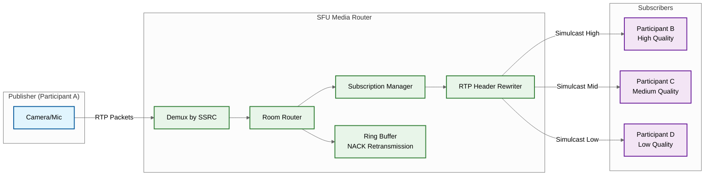
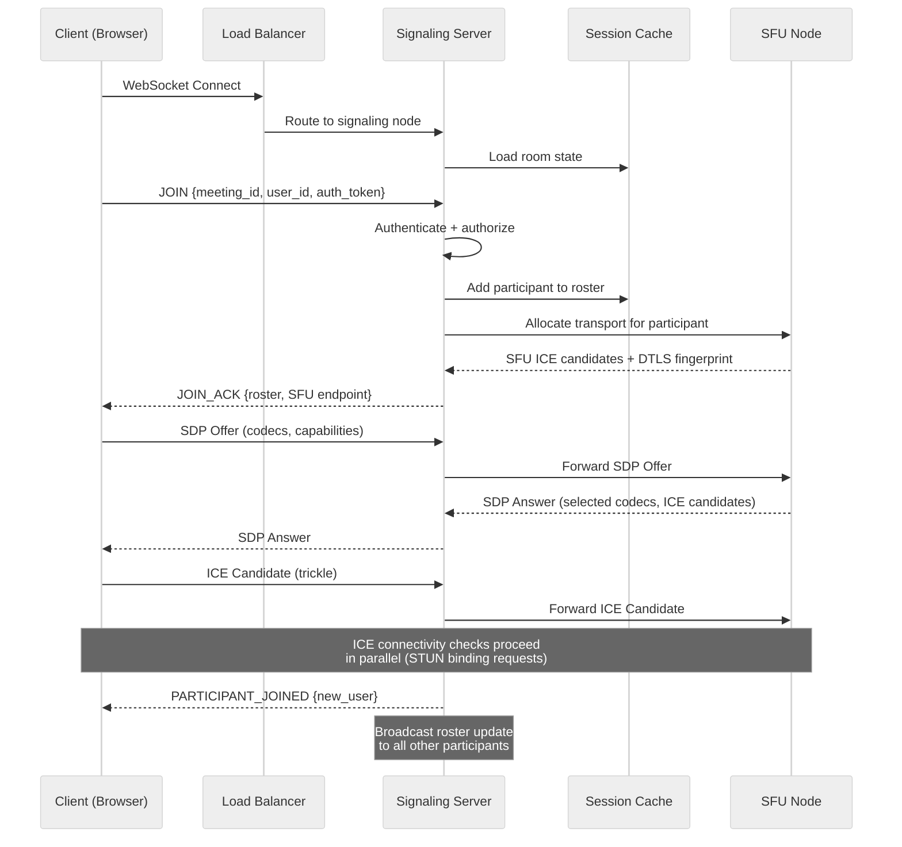
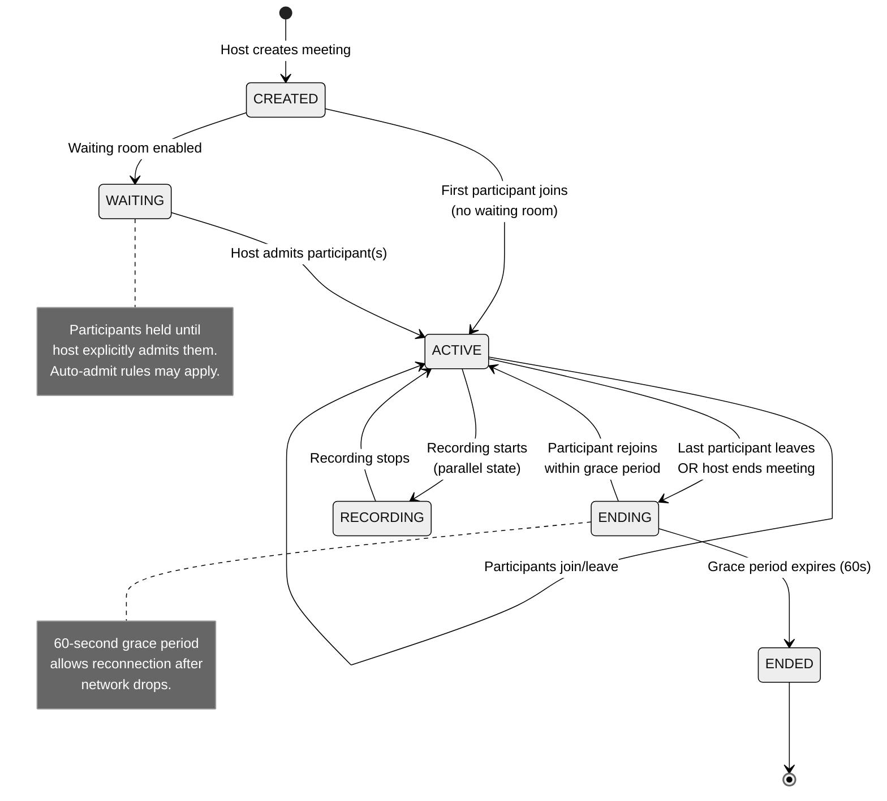
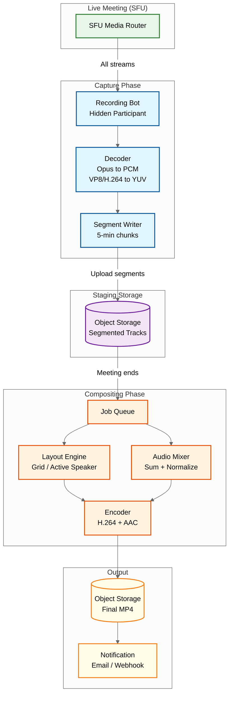
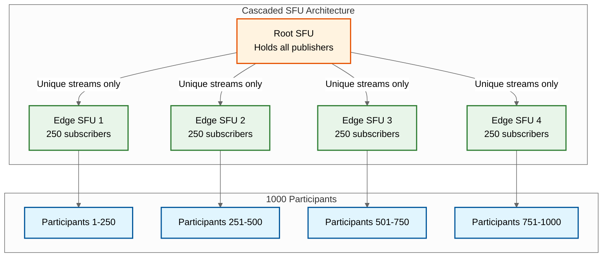
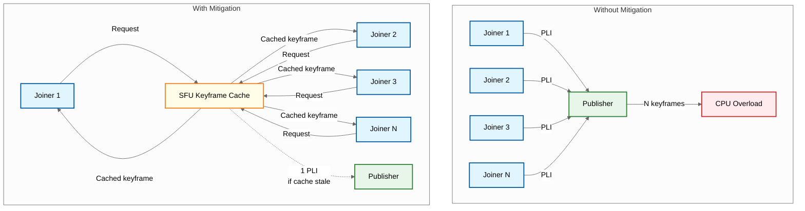

# Deep Dive & Bottlenecks

## 1. Critical Component: SFU Media Router

### Why This Is Critical

The Selective Forwarding Unit is the heart of the system. It handles real-time packet forwarding for every active meeting. A single SFU node may handle 100+ rooms with 1000+ concurrent streams. Any latency added here -- even 10ms -- directly degrades the conversational experience. Unlike a CDN or message broker where slight delays are tolerable, the SFU operates under a hard real-time constraint: every packet must be routed within its jitter buffer window (typically 20-50ms) or the frame is dropped and the user perceives a glitch.

### How It Works Internally



**Packet Path (per RTP packet):**

1. **RTP Arrival**: Encrypted RTP packet arrives over DTLS-SRTP
2. **Decryption**: SRTP context decrypts the packet using the session key (AES-128-CTR). This is the most CPU-intensive step -- hardware AES-NI acceleration is essential
3. **Demux by SSRC**: The SSRC (Synchronization Source Identifier) in the RTP header identifies which participant and which track (audio, video-low, video-mid, video-high) the packet belongs to
4. **Route to Room**: SSRC is mapped to a room's router. The router holds the topology of all publishers and subscribers in that room
5. **Subscription Check**: For each subscriber in the room, the subscription manager checks: (a) is this subscriber subscribed to this publisher? (b) which simulcast layer does this subscriber want?
6. **RTP Header Rewrite**: The SFU rewrites the outbound RTP header -- replacing the publisher's SSRC with a per-subscriber SSRC, adjusting sequence numbers to be contiguous (hiding gaps from layer switches), and remapping timestamps
7. **Re-encrypt and Forward**: Re-encrypt with the subscriber's SRTP context and send

**Subscription Model:**

Each subscriber maintains a subscription list that specifies:
- Which participants they want to receive (not necessarily all)
- Which simulcast layer (low/mid/high) per participant
- Whether to receive audio (always yes, unless muted)

Active speaker detection triggers subscription updates: when the active speaker changes, the client requests the high-quality layer for the new speaker and drops to low or thumbnail for others.

**Simulcast Layer Switching:**

```
PROCEDURE: Switch_Simulcast_Layer(subscriber, publisher, target_layer)

    current_layer = subscriber.layer[publisher]

    IF current_layer == target_layer:
        RETURN  // No-op

    // Check if a keyframe is available on the target layer
    keyframe = ring_buffer.last_keyframe(publisher, target_layer)

    IF keyframe EXISTS AND keyframe.age < 2_seconds:
        // Fast path: use cached keyframe
        Send(subscriber, keyframe)
        subscriber.layer[publisher] = target_layer
        // Reset sequence numbers to maintain contiguity
        subscriber.seq_offset[publisher] = Calculate_Offset()
    ELSE:
        // Slow path: request new keyframe
        Send_PLI(publisher, target_layer)  // Picture Loss Indication
        subscriber.pending_switch[publisher] = target_layer
        // Continue forwarding current layer until keyframe arrives
        // Typical wait: 100-300ms

    ON keyframe_received(publisher, layer):
        FOR EACH subscriber WITH pending_switch[publisher] == layer:
            Send(subscriber, keyframe)
            subscriber.layer[publisher] = layer
            subscriber.pending_switch[publisher] = NULL
```

**Audio Handling:**

Audio from all participants is forwarded individually -- the SFU does not mix audio. Each participant receives separate audio streams from every other unmuted participant. The client handles selection and mixing:
- Browser efficiently decodes and mixes 3-5 audio streams simultaneously
- Voice Activity Detection (VAD) metadata (carried in RTP header extensions) helps the client prioritize which streams to mix
- For meetings with many speakers, the SFU may apply server-side "last-N audio" filtering, forwarding only the top N loudest streams

**Memory Model:**

Each room maintains ring buffers for NACK-based retransmission:

```
Per video track:
    Ring buffer depth: 2 seconds
    At 30 fps, ~1200 bytes avg per packet: 2s * 30fps * 1200B = ~72 KB

Per room with 10 video publishers (3 simulcast layers each):
    30 tracks * 72 KB = ~2.16 MB

Per SFU node with 100 rooms:
    100 * 2.16 MB = ~216 MB ring buffer memory

Additional per-room overhead:
    SRTP contexts: ~2 KB per participant (encryption state)
    Subscription maps: ~1 KB per subscriber-publisher pair
    Total for 100 rooms, 10 participants each:
        ~2 MB SRTP + ~1 MB subscriptions = ~3 MB
```

### Failure Modes

| Failure | Impact | Mitigation |
|---------|--------|------------|
| **SFU node crash** | All meetings on that node drop immediately. Every participant sees a black screen and silence | Quick failure detection via heartbeat every 2s (3 missed = dead). Client auto-reconnect with exponential backoff (100ms, 200ms, 400ms). Session state stored in external cache for fast recovery on a new SFU node |
| **Memory pressure** | Too many concurrent rooms exhaust memory (ring buffers, SRTP contexts). New rooms fail to allocate, existing rooms degrade | Admission control: reject new rooms when utilization exceeds 85%. Graceful drain: migrate rooms to new nodes before capacity is reached. Monitor per-node memory with hard kill at 95% |
| **CPU saturation** | SRTP encryption/decryption is CPU-intensive. Under load, packet processing delays increase, causing jitter and frame drops across all rooms on the node | Hardware AES-NI acceleration (mandatory). Limit concurrent streams per CPU core (~200 video streams per core). Vertical scaling with high-core-count machines (32-64 cores). CPU-based load shedding: degrade simulcast to fewer layers before dropping rooms |
| **Network link saturation** | SFU outbound bandwidth exhausted (typical: 10 Gbps NIC). Packet loss increases for all rooms | Per-room bandwidth accounting. Proactive simulcast downgrade (force subscribers to lower layers) when link utilization exceeds 80%. Cascaded SFU splits load across nodes |

### Race Conditions

**Simultaneous Join/Leave:**

A participant joins while another leaves the same room. The router's subscriber list must be modified atomically. Two approaches:

```
Approach A: Per-Room Event Loop (Preferred)
    Each room runs a single-threaded event loop.
    Join and leave events are serialized per room.
    No locks needed. Throughput: ~100K events/second per room.

Approach B: Lock-Free Concurrent Data Structures
    Use a concurrent hashmap for the subscriber list.
    CAS (Compare-And-Swap) operations for modifications.
    Higher throughput but harder to reason about correctness.
```

**Keyframe Race:**

Layer switch triggers a PLI (requesting a keyframe), but the publisher sends a periodic keyframe before the PLI arrives. The SFU receives a keyframe it did not request. The SFU must check pending layer switch requests on every keyframe arrival, regardless of whether it was solicited.

**Active Speaker Flip-Flop:**

Two participants speaking simultaneously cause rapid active speaker changes, leading to constant layer switching (high-low-high-low). Each switch potentially triggers a PLI and a brief freeze.

```
MITIGATION: Debounce active speaker changes
    - Minimum hold time: 300ms (do not change active speaker more than ~3 times/second)
    - Hysteresis threshold: new speaker must be 6 dB louder than current for at least 200ms
    - Client-side smoothing: cross-fade between layouts over 150ms
```

---

## 2. Critical Component: Signaling Server and Session Negotiation

### Why This Is Critical

Signaling orchestrates the entire meeting lifecycle: room creation, participant join/leave, SDP offer/answer exchange, ICE candidate trickling, and roster synchronization. It is the control plane for the real-time data plane. If signaling fails, no new participants can join, no media negotiation can occur, and the roster becomes stale -- even though existing media streams may continue flowing through the SFU independently.

### How It Works Internally



**WebSocket Connection:**

Each participant maintains a persistent WebSocket to the signaling server. Message rates:
- During join: 5-20 messages/second (SDP exchange, ICE candidates, roster sync)
- Steady state: less than 1 message/second (heartbeats, occasional roster updates, mute/unmute notifications)
- During active speaker changes: 1-3 messages/second

**SDP Negotiation Flow:**

1. Client generates SDP offer containing codec capabilities (VP8, VP9, H.264, AV1, Opus), supported RTP extensions, ICE candidates gathered so far, and DTLS fingerprint
2. Signaling server validates the offer (strip unsupported codecs, enforce server policy like maximum resolution) and forwards to the assigned SFU
3. SFU generates SDP answer selecting the codecs to use, providing its own ICE candidates and DTLS fingerprint
4. Answer is returned to the client via the signaling server
5. ICE connectivity checks proceed in parallel -- client and SFU exchange STUN binding requests to find the optimal network path

**Room State Machine:**



State transitions are serialized per room using a single-writer pattern. The signaling server that "owns" a room processes all state changes sequentially, preventing conflicting transitions.

**Roster Synchronization:**

When a participant joins or leaves, the signaling server broadcasts roster updates to all other participants in the room.

```
Small meetings (<50 participants):
    Full roster sent on join.
    Delta updates (JOIN/LEAVE events) during meeting.
    Each event: ~200 bytes per participant.

Large meetings (50-500 participants):
    Full roster sent on join (paginated if >100).
    Delta updates only (never re-send full roster).
    Batch updates: aggregate multiple join/leave events
    over a 500ms window into a single message.

Very large meetings (500+ participants):
    Initial roster limited to active speakers + recent joiners.
    Participant list loaded on-demand (scroll-to-load in UI).
    Delta updates batched over 1-second windows.
    Roster stored server-side; client holds only visible subset.
```

### Failure Modes

| Failure | Impact | Mitigation |
|---------|--------|------------|
| **WebSocket disconnect** | Client loses signaling connection. Media may continue flowing (SFU path is independent) but no new negotiation, mute status, or roster updates | Client reconnects WebSocket and sends a RESUME message with last-known event sequence number. Signaling server replays missed events. SFU continues forwarding during the signaling gap |
| **Signaling server crash** | All WebSocket connections on that node drop. Hundreds of meetings lose their control plane simultaneously | Stateless signaling servers behind a load balancer. Room state stored in distributed cache (not in-process memory). Client reconnects to any available signaling node, which reloads room state from the cache |
| **SDP negotiation timeout** | Client and SFU fail to complete the offer/answer exchange. Participant cannot send or receive media | 10-second timeout with automatic retry. Pre-warm ICE candidates before join (gather STUN/TURN candidates during the "joining" UI screen). Trickle ICE to send candidates incrementally rather than waiting for full gathering |
| **Cache failure** | Room state lost. Signaling server cannot process joins or verify roster | Cache replication (at least 2 replicas). Fallback: reconstruct room state from SFU (query active transports). Circuit breaker prevents cascading failures |

### Race Conditions

**Double Join:**

User clicks the "Join" button twice rapidly, or the client auto-retries a join that actually succeeded.

```
MITIGATION:
    Server maintains a join lock per (user_id, meeting_id).
    First JOIN acquires the lock and proceeds.
    Second JOIN sees the lock, checks if the first completed:
        - If completed: return existing session (idempotent).
        - If in-progress: wait for completion, return same result.
    Lock TTL: 30 seconds (prevents permanent deadlock).
```

**Host Leaves During Admission:**

Host disconnects while participants are sitting in the waiting room. Without mitigation, waiting participants are stuck indefinitely.

```
MITIGATION:
    1. Auto-promote co-host (if assigned) immediately.
    2. If no co-host, hold waiting room state for 60-second grace period.
    3. If host reconnects within grace period, resume normally.
    4. If grace period expires:
       Option A: Auto-admit all waiting participants.
       Option B: End the meeting and notify waiting participants.
       (Configurable per organization policy.)
```

**Mute State Conflict:**

Host mutes a participant while the participant is unmuting themselves. Two conflicting state changes race through the signaling server.

```
MITIGATION:
    Mute state has a version number.
    Host-initiated mute carries higher priority than self-unmute.
    If conflict detected (version mismatch), host action wins.
    Client receives authoritative mute state and updates UI.
```

---

## 3. Critical Component: Recording Pipeline

### Why This Is Critical

Recording must capture the live meeting without impacting the live experience, composite multiple video streams into a single watchable output, and produce a downloadable file -- all within a reasonable time after the meeting ends. A failure in the recording pipeline is invisible to live participants but devastating to the meeting organizer who discovers hours later that no recording exists.

### How It Works Internally



**Capture Method:**

A "recording bot" joins the meeting as a hidden participant on the SFU. It receives all audio and video streams exactly like any other subscriber, but never publishes any media. The SFU treats it as a passive subscriber with subscriptions to all participants at their highest available quality.

**Individual Track Recording:**

Each audio and video track is captured and processed independently:

```
Per-track pipeline:
    1. Receive encrypted RTP packets from SFU
    2. Decrypt (SRTP -> RTP)
    3. Depacketize (RTP -> codec frames)
    4. Decode (Opus -> PCM audio, VP8/H.264 -> raw YUV frames)
    5. Write to 5-minute segment files
    6. Upload completed segments to object storage immediately
    7. Local disk only holds the CURRENT segment (~200 MB max)
```

This segment-based approach is critical for handling long meetings. A 4-hour meeting at 1080p generates approximately 16 GB of raw data. Without segmented upload, the recording bot would need 16 GB of local storage and risk total data loss on failure.

**Compositing Pipeline (Post-Meeting):**

```
PROCEDURE: Composite_Recording(meeting_id)

    // Phase 1: Retrieve all segments
    segments = ObjectStorage.list(meeting_id)
    tracks = Group_By_Participant(segments)
    timeline = Build_Timeline(tracks)  // who was present when

    // Phase 2: Determine layout for each time window
    FOR EACH window IN timeline (1-second granularity):
        active_participants = window.participants
        active_speaker = window.active_speaker  // from metadata log

        IF active_participants.count <= 4:
            layout = GRID_2x2
        ELSE IF active_participants.count <= 9:
            layout = GRID_3x3
        ELSE:
            layout = ACTIVE_SPEAKER_WITH_FILMSTRIP
            // Active speaker gets 80% of frame
            // Others in filmstrip at bottom

        // Render composite frame
        output_frame = Render_Layout(layout, active_participants, active_speaker)
        Encoder.write_frame(output_frame)

    // Phase 3: Mix audio
    audio_output = Mix_All_Audio_Tracks(tracks)
    // Sum all PCM tracks with normalization to prevent clipping
    // Apply automatic gain control per-speaker

    // Phase 4: Mux and finalize
    Final_MP4 = Mux(video=Encoder.output, audio=audio_output)
    ObjectStorage.upload(meeting_id, Final_MP4)
    Notify_Organizer(meeting_id, download_url)
```

**Real-Time vs Post-Meeting Compositing:**

| Aspect | Post-Meeting (Option A) | Real-Time (Option B) |
|--------|------------------------|---------------------|
| **Availability** | 15-60 minutes after meeting ends | Within 5 minutes of meeting end |
| **CPU cost** | Batch processing, efficient scheduling | Dedicated GPU/CPU per meeting during recording |
| **Quality** | Higher (can do multi-pass encoding) | Lower (single-pass, real-time constraint) |
| **Failure impact** | Can retry indefinitely | Lost frames are gone forever |
| **Layout flexibility** | Can optimize retrospectively (e.g., always show active speaker) | Must decide layout in real-time |
| **Typical choice** | Default for most platforms | Used only for live streaming output |

### Failure Modes

| Failure | Impact | Mitigation |
|---------|--------|------------|
| **Recording bot disconnect** | Gap in the recording. Streams are not captured during the disconnection | Heartbeat monitoring with auto-reconnect within 5 seconds. Gap filled with silence (audio) and freeze frame of last captured frame (video). Metadata log records the exact gap timestamps |
| **Compositing failure** | GPU/CPU exhaustion or encoding error. Final video cannot be produced | Retry with exponential backoff (1 min, 5 min, 30 min). Fall back to audio-only recording. Individual track segments are always preserved as backup -- organizer can download raw tracks |
| **Storage exhaustion** | Temporary staging area fills up during a long meeting, causing segment writes to fail | Segment-based upload ensures local disk only holds the current 5-minute segment (~200 MB). Monitoring alerts at 70% disk usage. Emergency flush: force-upload incomplete segments and restart |
| **Segment upload failure** | Network issue prevents a segment from reaching object storage | Retry upload with exponential backoff. Hold segment locally until confirmed uploaded. If local disk is filling, compress older segments (raw to H.264) to reduce local footprint |

### Race Conditions

**Recording Start During Active Speaking:**

Recording is initiated mid-meeting. The recording bot joins and subscribes to all publishers, but has no keyframes yet. All incoming P-frames are useless without an initial keyframe.

```
MITIGATION:
    On recording bot join, SFU immediately sends cached keyframes
    for all active publishers (from ring buffer).
    If cached keyframe is stale (>2s old), SFU sends PLI to
    each publisher requesting fresh keyframes.
    Recording bot discards all packets until first keyframe per track.
```

**Meeting Ends While Compositing Queue Is Full:**

Many meetings end at the same time (e.g., top-of-hour), flooding the compositing job queue.

```
MITIGATION:
    Priority queue: shorter meetings composited first (faster to process,
    clears queue faster).
    Auto-scaling compositing workers based on queue depth.
    SLA-based prioritization: enterprise customers processed before free tier.
    Stagger: add random 0-5 minute delay before enqueueing.
```

---

## Bottleneck Analysis

### Bottleneck 1: SFU Fan-Out Under High Participant Count

**Problem:**

For a meeting with N participants, each SFU must forward up to N-1 copies of each publisher's stream to every subscriber. The bandwidth math becomes punishing at scale:

```
Keyframe size (typical): ~50 KB
Meeting with 100 participants:
    1 keyframe * 99 copies = ~5 MB outbound per keyframe per publisher
    If all 100 publish simultaneously: 100 * 5 MB = 500 MB per keyframe cycle

Meeting with 1000 participants:
    1 keyframe * 999 copies = ~50 MB per keyframe per publisher
    Even with 10 active publishers: 10 * 50 MB = 500 MB per keyframe cycle
    At one keyframe every 3 seconds: ~1.3 Gbps just for keyframes
```

A single SFU node with a 10 Gbps NIC saturates quickly under these conditions.

**Mitigations:**



| Strategy | How It Works | Trade-off |
|----------|-------------|-----------|
| **Cascaded SFU** | Split the room across multiple SFU nodes (e.g., 4 nodes handling 250 participants each). Root SFU forwards only unique streams to each edge SFU, which handles local fan-out | Adds one hop of latency (~5-15ms). Inter-SFU link becomes a single point of failure. Requires careful publisher placement |
| **Last-N Video** | Only forward video for the top N active speakers (e.g., last 5 speakers). Other participants receive audio only. Client can request specific participants on demand | Participants outside the "last-N" are invisible until they speak. Gallery view is impossible for large meetings. User experience trade-off |
| **Subscriber-Initiated Subscription** | Clients explicitly subscribe only to the participants visible in their viewport (current gallery page). Scrolling to a new page triggers new subscriptions | Page-turn latency (200-500ms to get first frame). Requires careful prefetching. Client complexity increases |
| **Temporal Layering (SVC)** | Instead of simulcast (separate encodings), use SVC where a single stream has embedded quality layers. SFU drops enhancement layers for constrained subscribers without re-encoding | Not universally supported (VP9 SVC, AV1 SVC). Higher encoder complexity on the client. Layer boundaries are less flexible than simulcast |

---

### Bottleneck 2: TURN Relay Server Bandwidth

**Problem:**

Approximately 15% of participants cannot establish direct UDP connectivity to the SFU due to symmetric NAT, restrictive firewalls, or corporate proxies. These participants require a TURN (Traversal Using Relays around NAT) relay server. Every TURN-relayed stream doubles the bandwidth cost because the media path becomes:

```
Without TURN:   Client <--UDP--> SFU
With TURN:      Client <--UDP--> TURN <--UDP--> SFU

Bandwidth impact per TURN-relayed participant:
    Upstream: 1.5 Mbps (video) * 2 = 3 Mbps
    Downstream: varies by subscription, but all traffic is doubled

At scale (100K concurrent TURN users, 15% of 667K total):
    100K * 3 Mbps upstream = 300 Tbps aggregate TURN bandwidth
```

TURN servers become a bandwidth and cost bottleneck, especially for enterprise deployments behind corporate firewalls where TURN usage can reach 40-60%.

**Mitigations:**

| Strategy | How It Works | Trade-off |
|----------|-------------|-----------|
| **Edge PoP Deployment** | Deploy TURN servers at edge Points of Presence close to users. Reduces the distance media travels over the backbone | Operational complexity: TURN servers at 50+ PoPs. Cost: dedicated infrastructure at each location |
| **Periodic ICE Restart** | Use TURN for initial connection, then periodically attempt ICE restart to find a direct UDP path. Many NAT configurations allow direct connectivity after the initial signaling phase | Adds brief disruption (~200ms) during ICE restart. May not succeed if the firewall is truly restrictive |
| **TURN over TCP/443 Fallback** | For the most restrictive networks, relay media over TCP port 443 (HTTPS port). Firewalls almost never block this port | TCP adds head-of-line blocking. Latency increases by 20-50ms. Jitter increases significantly. Last resort only |
| **TURN Auto-Scaling** | Auto-scale TURN server fleet based on concurrent connection count. Scale up when utilization exceeds 70%, scale down during off-peak | Cold-start delay for new TURN nodes (DNS propagation, TLS certificate provisioning). Over-provisioning wastes resources |

---

### Bottleneck 3: Keyframe Storms

**Problem:**

When many participants join simultaneously -- for example, 500 people entering a meeting at its scheduled start time -- each new subscriber needs a keyframe from every publisher to begin rendering video. Without mitigation, this creates an N*M explosion:

```
Scenario: 500 participants join within 10 seconds
    - 500 participants, each publishing 1 video stream
    - Each new joiner needs keyframes from all existing publishers
    - Naive approach: each publisher receives up to 499 PLI requests

Impact:
    - Publisher CPU spikes (generating keyframes is expensive: 5-10x a P-frame)
    - SFU bandwidth spikes (keyframes are 10-50x larger than regular frames)
    - All existing participants experience quality degradation during the storm
    - Cascading effect: quality degradation causes adaptive bitrate to reduce,
      triggering MORE layer switches, which request MORE keyframes
```

**Mitigations:**



| Strategy | How It Works | Trade-off |
|----------|-------------|-----------|
| **Batch PLI Deduplication** | SFU deduplicates PLI requests per publisher. If 100 subscribers request a keyframe from the same publisher within a 100ms window, only one PLI is sent. The resulting keyframe is forwarded to all 100 requesters | Small delay (up to 100ms) for subscribers who requested later in the batch. One keyframe must be buffered and multicast |
| **Keyframe Caching** | SFU caches the last keyframe per track in the ring buffer. New subscribers receive the cached keyframe immediately without requesting a new one from the publisher | Cached keyframe may be slightly stale (up to 3 seconds old). Acceptable because the next P-frames will update the picture within one GOP |
| **Staggered Subscription** | Rate-limit subscriber additions: add no more than 10 new subscribers per 100ms batch per publisher. Joiners beyond the limit are queued with a brief delay | Adds up to 5 seconds of join delay for the last joiners in a 500-person meeting (500/10 * 100ms). Shown as a "connecting..." state in the UI |
| **Pre-Generated Keyframes** | Publishers generate periodic keyframes at a fixed interval (every 3 seconds) regardless of PLI requests. SFU always has a recent keyframe available | Increases publisher bandwidth by 5-10% due to regular keyframes. Slight CPU overhead on the client encoder |
