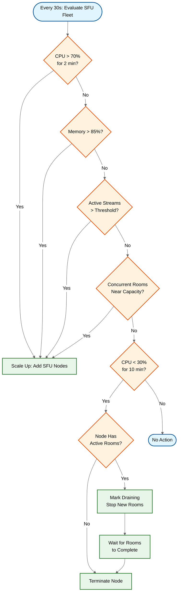
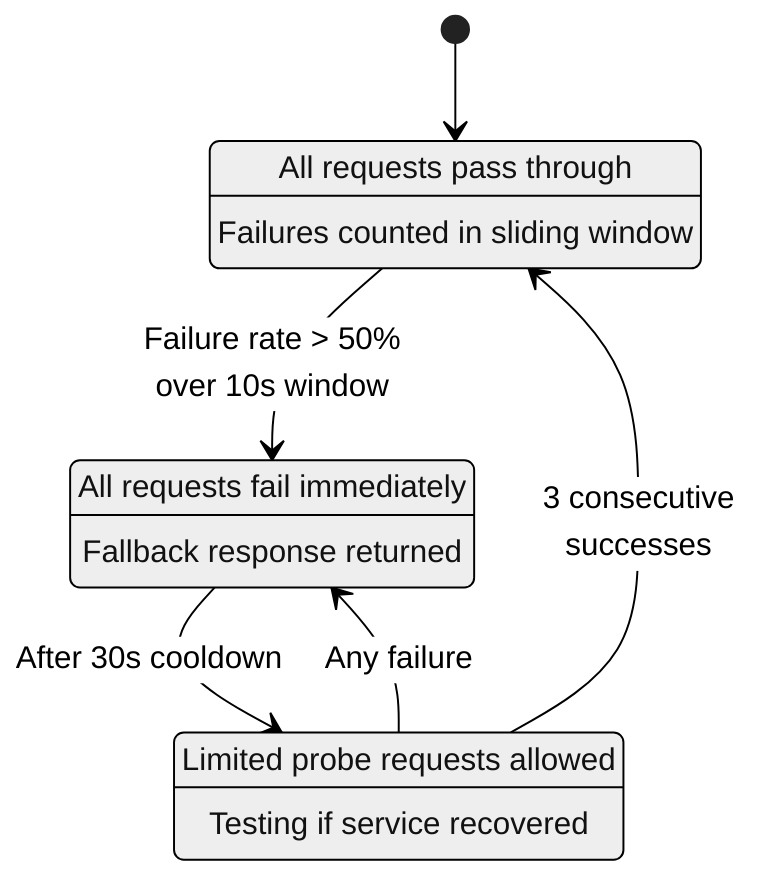
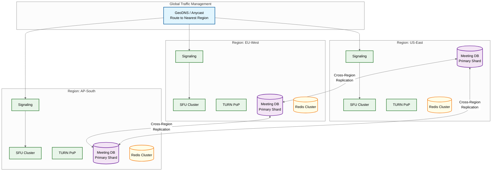

# Scalability & Reliability

## Scalability

### Horizontal Scaling

#### SFU Nodes

Each SFU node handles 50-200 rooms depending on participant count and media quality. The fundamental constraint is the **room-pinning problem**: a room is pinned to a single SFU because all participants in that room need shared media state (active speaker tracking, simulcast layer assignments, keyframe caches). You cannot split a room across multiple SFU nodes mid-session without causing media disruption.

Scaling works at the room boundary:

- **New room routing**: The meeting orchestrator assigns new rooms to the least-loaded SFU node. Load is measured as a composite score of CPU utilization, active stream count, and memory pressure.
- **Draining**: When scaling down or performing maintenance, a node is marked as "draining." It stops accepting new rooms, but existing rooms complete naturally. Once the last room ends, the node terminates. This avoids mid-session disruption entirely.
- **Capacity math**: At approximately 100 rooms per SFU and 5 million concurrent meetings globally, the system requires ~50,000 SFU nodes distributed across all regions.

#### Cascaded SFU for Large Rooms

When a room exceeds single-node capacity (~200 participants), the system activates **cascaded SFU** topology. A primary SFU connects to 2-4 secondary SFU nodes, each handling a subset of participants.

- The primary SFU acts as the root of a media distribution tree.
- Each secondary SFU receives one copy of each unique stream from the primary and fans it out to its local participants.
- Inter-SFU traffic is deduplicated: each unique media stream is sent exactly once between any two SFU nodes, regardless of how many subscribers exist on the receiving side.
- For rooms with 1000+ participants, the tree may extend to three levels (primary -> regional secondaries -> local tertiaries).

#### Signaling Servers

Signaling servers are truly stateless. All room state (participant lists, offer/answer SDP, ICE candidates) is stored in the Redis cluster. Any signaling node can handle any room at any time.

- Scale by adding more pods behind the load balancer.
- WebSocket connections use sticky sessions for message ordering within a session, but failover to any other node is seamless -- the new node loads room state from Redis and resumes.
- At 10,000 concurrent WebSocket connections per node, supporting 5M meetings (averaging 4 participants each) requires ~2,000 signaling nodes.

#### TURN Servers

TURN servers are deployed at edge Points of Presence (PoPs) to minimize relay latency. Each server handles approximately 5,000 concurrent relay sessions.

- Scale horizontally within each PoP by adding servers to the anycast IP range.
- Clients receive multiple TURN server candidates during ICE negotiation and fail over automatically if one is unreachable.
- TURN is only needed for ~15-20% of connections (those behind symmetric NATs or restrictive firewalls), so TURN capacity is provisioned at roughly 1/5 of SFU capacity.

#### Recording Workers

Recording workers scale independently from the live media path.

- Triggered by queue depth: when the recording job queue grows, new workers spin up.
- GPU-accelerated nodes handle real-time compositing (combining multiple video feeds into a single layout).
- CPU-only nodes handle batch post-processing (transcoding, thumbnail generation).
- Scale to zero when no recordings are pending, making this a cost-efficient elastic workload.

### Auto-Scaling Triggers

| Component | Trigger Condition | Action |
|-----------|-------------------|--------|
| SFU | CPU >70%, memory >85%, active streams >threshold, or rooms approaching capacity | Add nodes; route new rooms to them |
| TURN | Connection count >80% capacity | Add relay servers within the PoP |
| Recording | Queue depth >100 pending jobs | Add compositing workers |
| Signaling | WebSocket connection count >10K per node | Add nodes behind load balancer |

### Database Scaling

- **Meeting metadata**: Horizontally sharded by `meeting_id` hash. Read replicas serve user dashboard queries (meeting history, upcoming meetings). Hot partition mitigation: frequently accessed meeting codes (recurring meetings, popular invite links) are cached in Redis with a 5-minute TTL to absorb read spikes.
- **Chat messages**: Wide-column store partitioned by `meeting_id`. All chat messages for a single meeting are co-located in one partition for fast sequential reads. After the meeting ends, data is compacted and migrated to cold storage (object store) for long-term retention.
- **Analytics**: A streaming pipeline processes events in real-time (client events -> message queue -> stream processor -> columnar store). Dashboards perform query-time aggregation over the columnar store. Raw events are retained for 90 days; aggregated metrics are retained indefinitely.
- **Media server registry**: A small dataset (~50K entries tracking active SFU/TURN nodes, their loads, and regions). Stored entirely in Redis with periodic snapshots to a persistent database for recovery. Reads are in the hot path (every room creation), so in-memory access is essential.

### Caching Layers

**L1 -- SFU In-Process Cache**

| Cache Entry | Contents | Size per Entry | Invalidation |
|-------------|----------|----------------|--------------|
| Keyframe cache | Last I-frame per track per room | ~100 KB per track | Overwritten on next keyframe arrival |
| SRTP session context | DTLS-derived keys, sequence numbers, rollover counters | ~2 KB per participant | Cleared on session end |
| Subscriber list | Which participants subscribe to which tracks at what simulcast quality | ~1 KB per room | Real-time on subscribe/unsubscribe events |

**L2 -- Redis Cluster**

| Cache Entry | Contents | TTL / Invalidation |
|-------------|----------|--------------------|
| Meeting metadata | Full meeting state: settings, participant list, host info | Meeting lifetime + 1 hour buffer |
| ICE server configuration | STUN/TURN server lists with short-lived credentials | 12 hours |
| Feature flags | Per-organization feature toggles | 5 minutes with push invalidation on change |
| Active speaker history | Last 5 active speakers per room | Room lifetime |

**L3 -- CDN**

| Cache Entry | Contents | TTL / Invalidation |
|-------------|----------|--------------------|
| Recorded meeting playback | Segmented HLS/DASH video chunks | Indefinite (content-addressable URLs) |
| Virtual backgrounds | User-uploaded background images | 30 days |
| Static assets | JS, CSS, WASM bundles for the client | Indefinite with cache-busting on deploy |

### Hot Spot Mitigation

- **Large meeting pre-provisioning**: When a meeting is scheduled with >500 expected participants, the orchestrator pre-provisions a dedicated SFU cluster before the meeting starts. The primary SFU is placed in the host's region. Secondary SFUs are placed in regions with the highest expected attendance, determined by invitee geolocation derived from IP-based location data in user profiles.
- **Celebrity meetings / webinars**: In webinar mode, only panelists (typically 1-10 people) publish video. The audience receives media through a cascaded SFU tree with high fan-out ratios. Video publishers are rate-limited to prevent bandwidth explosions. This transforms a many-to-many problem into a few-to-many broadcast problem.
- **Keyframe storm prevention**: When many participants join simultaneously, each sends a PLI (Picture Loss Indication) requesting keyframes. Without mitigation, this causes a burst of expensive I-frames from publishers. The SFU caches the most recent keyframe per track and serves it to new subscribers directly, deduplicating PLI requests to the publisher (covered in detail in the deep-dive document).
- **Region-level diurnal peaks**: Business hours create predictable load spikes per region. Time-based scaling rules pre-scale SFU capacity 30 minutes before the expected ramp (e.g., 8:30 AM local time) and begin draining excess capacity after the evening taper (e.g., 7:00 PM).

---

## Reliability & Fault Tolerance

### SPOF Identification & Mitigation

| Component | SPOF Risk | Mitigation | Recovery Time |
|-----------|-----------|------------|---------------|
| SFU Node | High (rooms are node-pinned) | Fast failover, client auto-reconnect, externalized session state | 5-10 seconds |
| Signaling Server | Low (stateless) | Multiple replicas, any node can serve any room | 1-3 seconds (WebSocket reconnect) |
| TURN Server | Medium | Multiple TURN servers per region, client tries alternatives | 2-5 seconds (ICE candidate switch) |
| Meeting Orchestrator | Medium | Active-passive with leader election via consensus store | 3-5 seconds (leader election) |
| Redis Cluster | Medium | Redis Cluster with replicas, automatic failover | 5-15 seconds (replica promotion) |
| DNS | Low | GeoDNS with multiple providers, short TTLs | 30-60 seconds (TTL-dependent) |
| CDN | Low | Multi-CDN with failover, only affects recordings/assets | < 30 seconds (DNS-level switch) |
| Analytics Pipeline | Very Low | Isolated from live path, queue buffers data during outage | Minutes (non-user-facing) |

### Failover Mechanisms

**SFU Failover (Detailed Sequence)**

1. Health check fails: the SFU misses 3 consecutive heartbeats (heartbeat interval = 2 seconds, so detection takes ~6 seconds).
2. Meeting orchestrator marks the SFU node as dead in the media server registry.
3. For each room on the dead SFU, the orchestrator selects a new SFU in the same region (lowest load).
4. Orchestrator pushes a "reconnect" signal to all affected participants via the signaling server, including the new SFU's connection details.
5. Each participant performs a fresh connection sequence: new ICE negotiation, new DTLS handshake, new SRTP session.
6. Total user-visible disruption: 5-10 seconds of frozen video/audio, then the meeting resumes.
7. If an entire region is unreachable (data center failure), anycast reroutes clients to the next-closest region. Latency increases but the meeting continues.

**Signaling Failover**

1. The WebSocket connection drops (detected by missing ping/pong within 5 seconds).
2. The client reconnects with exponential backoff to the load-balanced signaling endpoint.
3. The new signaling node loads room state from Redis -- it has no local state to rebuild.
4. The client sends a "resume" message containing the last event sequence number it processed.
5. The server replays any missed events (join/leave notifications, chat messages, mute state changes).
6. Media was unaffected throughout because the SFU-to-client path is independent of signaling.

### Circuit Breakers

Circuit breakers prevent cascading failures by stopping calls to a failing downstream service.

Circuit breakers are applied to these downstream dependencies:

- **Recording service**: If compositing fails 3 consecutive times, the circuit opens. The user is notified that recording will be available later. Raw media tracks are preserved so recording can be retried.
- **TURN allocation**: If TURN server error rate exceeds 5%, the circuit opens and clients are routed to an alternative TURN cluster in the same region or a neighboring region.
- **AI features** (noise cancellation, live captions, background segmentation): If AI service latency exceeds 200ms, the circuit opens and raw audio/video is delivered without processing. Users see a "Smart features temporarily unavailable" notice.

### Retry Strategy

| Scenario | Strategy | Max Attempts / Timeout |
|----------|----------|------------------------|
| WebSocket reconnect | Exponential backoff (1s, 2s, 4s, 8s) with jitter | Max 30s total |
| ICE restart | After 10s of no media, attempt ICE restart before full reconnect | 1 attempt, then full reconnect |
| Recording upload | Retry with exponential backoff | 5 failures then move to dead-letter queue |
| TURN allocation | Immediate retry to next candidate server | 3 candidates, then fail open (direct connection attempt) |

### Graceful Degradation

| Severity | Condition | Action | User Impact |
|----------|-----------|--------|-------------|
| Level 1 -- Mild | Network bandwidth drops below 1 Mbps | Reduce video resolution: 1080p -> 720p -> 360p | Slightly lower video quality |
| Level 2 -- Moderate | SFU CPU above 85% or sustained packet loss >3% | Disable non-essential features (reactions, virtual backgrounds, gallery view beyond 9 tiles) | Fewer visual features; core meeting unaffected |
| Level 3 -- Significant | Bandwidth below 300 Kbps or regional SFU capacity exhausted | Switch to audio-only with screen share preserved; disable AI features | No participant video; audio and screen sharing continue |
| Level 4 -- Severe | Region outage or network partition | Reroute to nearest healthy region; accept higher latency | 100-200ms additional latency; brief reconnect interruption |
| Level 5 -- Critical | Multi-region outage affecting >30% of global capacity | Enforce participant caps on new meetings; queue large meetings; prioritize paid accounts | Some users cannot start new meetings; existing meetings unaffected |

### Bulkhead Pattern

Bulkheads matter because a failure or overload in one workload must not propagate to unrelated workloads. A 10,000-person enterprise all-hands meeting should never degrade a doctor's telemedicine call. Separate resource pools ensure blast radius containment.

Isolation boundaries:

1. **Free vs. paid SFU pools**: Free-tier meetings run on a separate SFU fleet. If free-tier demand spikes (viral event), paid meetings are completely unaffected.
2. **Regional TURN pools**: Each region has its own TURN server pool. A DDoS on TURN servers in one region does not affect relay capacity in others.
3. **Recording pipeline**: Recording workers run as a completely separate process with independent compute, storage queues, and scaling policies. A spike in recording demand does not consume SFU resources.
4. **AI services**: Noise cancellation, background segmentation, and live captioning run on a separate GPU cluster. GPU shortages or model failures only disable AI features, never core media routing.
5. **Signaling**: Shared across all meeting types but rate-limited per organization. A single organization cannot exhaust signaling capacity for others.

---

## Disaster Recovery

### Multi-Region Active-Active Deployment

### DR Strategy by Data Type

Disaster recovery differs fundamentally between live meetings and stored data:

- **Live meetings (ephemeral)**: There is no "restoring" a live meeting from backup. DR for live media is entirely reconnect-based. When a region fails, clients detect the connection drop, resolve DNS to a healthy region, and reconnect. The meeting resumes with a brief interruption (5-15 seconds). No media is "recovered" -- participants simply continue from the current moment.
- **Recordings (persistent)**: Recordings are segmented and uploaded to object storage as they are captured. Object storage replicates across at least 2 regions asynchronously. If the recording region fails mid-meeting, the recording resumes from the last uploaded segment once the participant reconnects to a new region. Completed recordings are immutable and served via CDN, surviving any single-region failure.

### Recovery Targets

| Parameter | Target | Details |
|-----------|--------|---------|
| RTO (live meetings) | < 60 seconds | Client reconnect to new region via GeoDNS failover |
| RTO (recordings) | < 5 minutes | Recording pipeline restarts in secondary region; gap limited to un-uploaded segments |
| RPO (live media) | N/A | Real-time media is ephemeral; no persistence requirement |
| RPO (recordings) | < 30 seconds | Segments uploaded every 10-30 seconds; loss limited to the current segment |
| RPO (meeting metadata) | < 5 seconds | Cross-region replication lag for meeting database |

### DR Testing

- **Quarterly DR drills**: Simulate full region failure by withdrawing a region from DNS and verifying that all new meetings route to healthy regions, existing meetings reconnect within RTO, and recordings remain accessible from replicated storage.
- **Monthly chaos testing**: Randomly terminate SFU nodes and TURN servers in production to verify that auto-recovery mechanisms work under real load.
- **Annual multi-region drill**: Simultaneously disable two regions to verify the system survives with only one region active (degraded capacity, higher latency, but functional).
