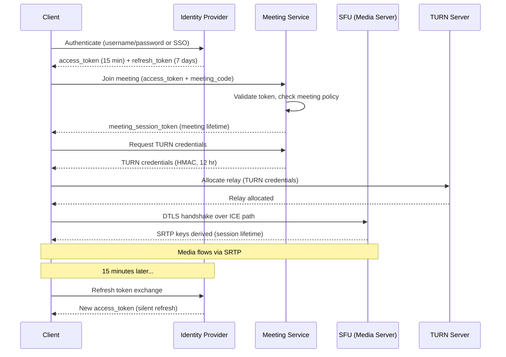

# Security & Compliance

## Authentication & Authorization

### Authentication (AuthN)

- **User Authentication Flow**: The full OAuth 2.0 / OIDC flow for meeting join works as follows. The user authenticates with the organization's Identity Provider (IdP) and receives an ID token. The client presents this token to the meeting service, which validates the token signature, issuer, audience, and expiration against the IdP's JWKS endpoint. Upon successful validation, the meeting service issues a meeting-scoped session token that binds the user's identity to the specific meeting instance. This session token is short-lived (tied to meeting duration) and carries claims such as `meeting_id`, `role`, and `tenant_id`.
- **API access**: OAuth 2.0 bearer tokens with short-lived access tokens (15 min) and refresh tokens (7 days). API gateway validates tokens on every request and enforces scope restrictions (e.g., `meetings:write`, `recordings:read`).
- **Guest Identity**: For unauthenticated guests, the system generates a short-lived session token upon join. Guest identity is display-name only with no persistent profile. The session token is scoped exclusively to the meeting and is invalidated when the guest leaves or the meeting ends.

**Meeting Join Authentication Matrix**:

| Join Method | Authentication | Use Case |
|-------------|---------------|----------|
| Authenticated + Link | SSO/OAuth token + meeting code | Enterprise users joining internal meetings |
| Link + Password | Meeting code + password | External guests joining secure meetings |
| Link Only | Meeting code (no auth) | Open meetings, public webinars |
| Phone Dial-in | Meeting ID + numeric PIN | Telephony participants via PSTN gateway |
| Lobby/Waiting Room | Any above + host approval | Controlled admission for sensitive meetings |
| SSO-Required | SAML/OIDC assertion + meeting code | High-security enterprise policy enforcement |

### Authorization (AuthZ)

- **Role-based**: Host, Co-host, Participant, Viewer (webinar mode). Roles are assigned at join time and can be promoted/demoted by the host during the meeting.
- **Enterprise policies**: Admin controls for organization-wide defaults (e.g., "only authenticated users can join," "screen sharing restricted to hosts," "recording disabled for free tier").
- **Per-meeting overrides**: Host can tighten or relax enterprise defaults for a specific meeting (within admin-permitted bounds).

**Permissions Matrix**:

| Action | Host | Co-Host | Participant | Viewer |
|--------|------|---------|-------------|--------|
| Mute others | Yes | Yes | No | No |
| Unmute others | Request only | Request only | No | No |
| Remove participant | Yes | Yes | No | No |
| Start/stop recording | Yes | Yes (if allowed) | No | No |
| Share screen | Yes | Yes | Configurable | No |
| Send chat messages | Yes | Yes | Yes | Configurable |
| Enable breakout rooms | Yes | Yes | No | No |
| Lock meeting | Yes | No | No | No |
| End meeting for all | Yes | No | No | No |
| Pin/spotlight video | Yes | Yes | Self only | No |
| Enable waiting room | Yes | No | No | No |
| Admit from waiting room | Yes | Yes | No | No |
| Change participant role | Yes | No | No | No |
| Enable/disable captions | Yes | Yes | No | No |
| Start polls | Yes | Yes | No | No |
| Mute own mic/camera | Yes | Yes | Yes | Yes |

### Token Management

- **OAuth tokens**: Access tokens (15-minute expiry) and refresh tokens (7-day expiry). When an access token expires mid-meeting, the client silently refreshes via the token endpoint without disrupting the session.
- **Meeting session tokens**: Scoped to a single meeting, carrying `meeting_id`, `user_id`, `role`, and `tenant_id` claims. Valid for the meeting's lifetime. Revoked immediately on participant removal.
- **SRTP keys**: Derived from the DTLS handshake (see below). Valid for the session lifetime, unique per peer connection.
- **TURN credentials**: Issued via REST API using HMAC-based temporary credentials (12-hour validity). Rotated on each new TURN allocation request.

---

## Data Security

### Encryption in Transit

| Path | Protocol | Details |
|------|----------|---------|
| Signaling | TLS 1.3 over WebSocket (WSS) | All signaling messages encrypted |
| Media | DTLS-SRTP (mandatory in WebRTC) | AES-128-CM with HMAC-SHA1 |
| Data channel | DTLS over SCTP | Chat, reactions, metadata |
| Inter-SFU cascading | DTLS-SRTP or IPsec tunnels | Between data centers |

**DTLS-SRTP Key Exchange Process**:

1. After ICE connectivity checks establish a UDP path between the client and SFU, the DTLS handshake begins over that same UDP channel.
2. The client and SFU exchange DTLS `ClientHello` and `ServerHello` messages, negotiating cipher suites (typically AES-128-CM for SRTP encryption, HMAC-SHA1 for authentication).
3. Certificate exchange occurs: the SFU presents its certificate, and the client verifies the fingerprint against the value signaled via SDP (the `a=fingerprint` attribute).
4. Once the DTLS handshake completes, the SRTP master key and master salt are derived from the DTLS keying material using the exporter defined in RFC 5764.
5. SRTP encrypts each RTP packet's payload while leaving the RTP header in cleartext. The SFU needs to read headers (SSRC, sequence number, timestamp, payload type) for routing, bandwidth estimation, and selective forwarding — but the audio/video payload is encrypted.
6. Each packet includes an HMAC-SHA1 authentication tag providing integrity protection and replay attack prevention via the SRTP replay list.

**Why Not TLS for Media**: TLS operates over TCP, which introduces head-of-line blocking — a single dropped packet stalls all subsequent packets until retransmission succeeds. For real-time media where a dropped frame is preferable to a 200 ms stall, this is unacceptable. DTLS provides TLS-equivalent security guarantees (certificate-based authentication, key exchange, encryption) but runs over UDP, allowing the application to tolerate packet loss gracefully.

### Encryption at Rest

- **Recordings**: AES-256 encryption in object storage. Enterprise customers can use customer-managed keys (CMK) via KMS integration (AWS KMS, Google Cloud KMS). Key rotation on a configurable schedule (default: 90 days).
- **Meeting metadata**: Encrypted at rest in the database (transparent data encryption). Fields containing PII (email, IP) are additionally encrypted at the application layer.
- **Chat logs**: Encrypted with a per-organization key. Retention policy configurable by admin.

### End-to-End Encryption (E2EE)

**How Insertable Streams Works**:

1. The client encodes a video frame using the local codec (VP8/VP9/H.264/AV1).
2. Before the encoded frame is packetized into RTP packets, the WebRTC Insertable Streams API (also called Encoded Transform) intercepts the encoded frame buffer.
3. The client encrypts the frame payload using a symmetric key shared among meeting participants. The key is derived from the group's current epoch key via the MLS key schedule.
4. The encrypted frame is wrapped back into the encoded frame container. An unencrypted header (a few bytes) is prepended so the SFU can identify the key epoch and cipher metadata.
5. The SFU receives the resulting RTP packets. It can read the RTP headers (SSRC, sequence number, timestamp) for routing and bandwidth estimation, but the media payload is opaque ciphertext.
6. The SFU forwards the encrypted packets to all subscribers based on their simulcast/SVC layer selections.
7. On the receiving end, the subscriber's Insertable Streams transform intercepts the encoded frame, decrypts the payload using the shared epoch key, and passes the cleartext frame to the decoder for rendering.

**MLS (Messaging Layer Security) for Key Management**:

- MLS (RFC 9420) is a group key agreement protocol designed for efficient large-group key management.
- **Tree-based key derivation**: Participants are leaves in a binary ratchet tree. When a participant joins or leaves, only O(log N) nodes in the tree need updating, rather than O(N) in pairwise key exchange.
- **Forward secrecy**: Each epoch (key generation) uses fresh randomness. A compromised epoch key cannot decrypt media from prior epochs.
- **Post-compromise security**: After a participant's key material is compromised, the next update heals the tree — subsequent epochs are secure even if past keys leaked.
- **Epoch transitions**: Each join, leave, or explicit update creates a new epoch with a new group key. The transition is coordinated through the MLS Delivery Service (typically the meeting signaling server, which sees only ciphertext proposals and commits).

**E2EE Feature Limitations**:

| Feature | Standard Mode | E2EE Mode | Reason |
|---------|--------------|-----------|--------|
| Server-side recording | Yes | No | Server cannot decode media |
| Live transcription/captions | Yes | No | Audio is inaccessible to server |
| Server noise cancellation | Yes | No | Audio processing requires cleartext |
| Background blur (server) | Yes | No | Video processing requires cleartext |
| Background blur (client) | Yes | Yes | Processed locally before encryption |
| Client noise cancellation | Yes | Yes | Processed locally before encryption |
| Breakout rooms | Yes | Limited | Requires MLS sub-group renegotiation |
| PSTN dial-in | Yes | No | Phone bridge cannot run MLS client |
| Max participants | 1000+ | ~50-100 | MLS tree update overhead per join/leave |
| Live streaming | Yes | No | Streaming server cannot decode media |

### PII Handling

- **Meeting content**: Never used for advertising or model training (enterprise policy). Content is ephemeral unless explicitly recorded.

**Data Classification**:

| Data Type | Classification | Retention | Access Control |
|-----------|---------------|-----------|----------------|
| Meeting content (audio/video) | Confidential | Not stored (live stream only) | Real-time participants only |
| Recordings | Confidential | Per org policy (default 120 days) | Meeting owner + explicitly shared users |
| Display names | Internal | Meeting duration (free tier) | In-meeting participants |
| Email (authenticated users) | PII | Account lifetime | Account owner, tenant admin |
| IP addresses | PII | 30 days (operational logs) | Ops/SRE team only |
| Meeting metadata (time, duration) | Internal | 1 year | Account owner, tenant admin |
| Chat messages | Confidential | 30 days (free), 1 year (enterprise) | Meeting participants |
| Telemetry (quality metrics) | Internal | 90 days | Engineering, anonymized after 30 days |

---

## Threat Model

| Attack Vector | Risk | Mitigation |
|---------------|------|------------|
| Zoom-bombing (unauthorized join) | High | Meeting passwords, waiting room, authenticated-only meetings, meeting lock after start |
| Eavesdropping on media | High | DTLS-SRTP mandatory encryption, optional E2EE |
| Man-in-the-middle (SRTP) | Medium | DTLS certificate fingerprint verification via SDP, certificate pinning |
| Denial of Service on SFU | High | Rate limiting on signaling, TURN allocation limits, DDoS protection at edge |
| Credential theft (meeting links) | Medium | One-time-use join tokens, meeting expiry, SSO-required meetings |
| Recording exfiltration | Medium | Access controls, encryption at rest, audit logs, DLP integration |
| Side-channel (bandwidth analysis) | Low | Constant-rate padding for E2EE mode (optional, bandwidth costly) |
| Meeting link enumeration | Medium | 10-char alphanumeric codes, rate limiting, CAPTCHA after 3 failures |
| Malicious screen share | Medium | Host controls to disable sharing, instant kick, content moderation |
| Data exfiltration via recording | Medium | Role-based access, download watermarking, DLP, audit trail |
| Supply chain attack on WebRTC | Low | Subresource integrity, CSP headers, code signing for native clients |

**Zoom-bombing (unauthorized join)**: An attacker obtains or guesses a meeting link and joins without authorization. This became widely publicized in early 2020 when publicly shared meeting links on social media allowed disruptive individuals to join and display offensive content. Defense-in-depth includes: meeting passwords (adds a second factor beyond the link), waiting rooms (host must explicitly admit each participant), authenticated-only meetings (rejects guests without an organizational SSO session), and meeting lock (prevents any new joins after the meeting starts). Combining all four layers makes unauthorized join nearly impossible.

**Eavesdropping on media**: An attacker positioned on the network path (e.g., compromised Wi-Fi, ISP-level interception) captures RTP packets and attempts to decode the audio/video. DTLS-SRTP encryption, mandatory in WebRTC, makes the media payload unintelligible without the session keys. For environments requiring zero-trust (the server itself is untrusted), E2EE via Insertable Streams ensures even the SFU operator cannot access media content.

**Man-in-the-middle**: An attacker intercepts the DTLS handshake and substitutes their own certificate to decrypt and re-encrypt traffic. The primary defense is fingerprint verification: the certificate fingerprint is exchanged via the SDP offer/answer over TLS-protected signaling. If the DTLS certificate fingerprint does not match the SDP fingerprint, the client rejects the connection. Certificate pinning in native clients adds another barrier.

**Meeting link enumeration**: An attacker brute-forces meeting codes by attempting random codes at high volume. A 10-character alphanumeric code yields 36^10 (approximately 3.6 quadrillion) combinations, making random guessing statistically infeasible. Rate limiting on join attempts (10 per IP per minute) and CAPTCHA enforcement after 3 consecutive failures add practical barriers. Meeting codes can also be configured to expire after the scheduled end time.

**Malicious screen share**: A participant shares offensive, disruptive, or confidential content via screen sharing. Host controls allow restricting screen sharing to hosts/co-hosts only. The host can instantly stop any active screen share and remove the offending participant. Enterprise deployments can optionally enable AI-based content moderation that flags potentially inappropriate content in real time.

**Data exfiltration via recording**: An authorized user downloads a meeting recording and shares it outside the organization. Mitigations include role-based access controls on recordings (only the meeting organizer and explicitly shared users can access), visible and forensic watermarking on downloaded files (embedding the downloader's identity), DLP integration (blocking downloads to unmanaged devices), and comprehensive audit trails logging every access and download event.

**Supply chain attack on WebRTC**: A compromised browser update or native client build includes malicious code that exfiltrates media or credentials. For web clients, Subresource Integrity (SRI) tags ensure JavaScript files have not been tampered with, and Content Security Policy (CSP) headers restrict which domains can serve scripts. For native clients (desktop/mobile), code signing with verified certificates ensures authenticity. Regular third-party security audits and bug bounty programs supplement these controls.

### Rate Limiting & DDoS Protection

- **Edge-level DDoS**: Anycast-based absorption at edge PoPs, with traffic scrubbing centers that filter volumetric attacks before they reach the media infrastructure.
- **Application-level**: Per-IP and per-meeting rate limits enforced at the signaling gateway and API gateway.

| Resource | Limit | Window | Action on Exceed |
|----------|-------|--------|-----------------|
| Meeting creation | 50 | 1 hour | Reject with 429, alert account admin |
| Join attempts (per IP) | 10 | 1 minute | Reject + CAPTCHA challenge |
| Join attempts (per meeting code) | 100 | 1 minute | Temporary meeting lock (5 min) |
| Signaling messages (per connection) | 100 | 1 second | Throttle (delay delivery) |
| Chat messages (per user) | 30 | 1 minute | Queue with backpressure |
| TURN allocations (per IP) | 5 | 1 minute | Reject allocation request |
| API calls (authenticated) | 1000 | 1 minute | 429 with Retry-After header |
| Password attempts (per meeting) | 5 | 5 minutes | Lock meeting join for 10 min |

---

## Compliance

| Standard | Key Requirements |
|----------|------------------|
| GDPR | Data residency, right to erasure, consent for recording, data minimization |
| HIPAA | BAA, E2EE mode, audit logging, access controls on recordings |
| SOC 2 Type II | Continuous monitoring, access controls, encryption, incident response |
| FedRAMP | Government cloud, FIPS 140-2 cryptography, authorization boundary |
| ISO 27001 | ISMS, risk treatment, continuous improvement |
| CCPA | User data export, deletion rights, opt-out of data sale |
| Recording Consent | Participant notification, consent capture in regulated jurisdictions |

**GDPR** (General Data Protection Regulation):
- **Data residency**: Geo-fence media servers and storage to EU regions for EU customers. SFUs in EU regions process media locally; recordings never leave the designated region. Admin console provides region selection per tenant.
- **Right to erasure**: All meeting data (recordings, chat logs, metadata) must be deletable within 30 days of a data subject request. Automated pipeline handles cascading deletion across storage, backups, and analytics systems.
- **Data minimization**: Do not log meeting content (audio/video). Telemetry is collected only for quality-of-service metrics, anonymized after 30 days, and aggregated after 90 days.
- **DPIA for AI features**: Data Protection Impact Assessment required before enabling AI features (transcription, summarization, noise cancellation) that process personal data. Users must explicitly opt in.

**HIPAA** (Health Insurance Portability and Accountability Act):
- **Business Associate Agreement (BAA)**: Required for any healthcare organization. The BAA contractually binds the platform to HIPAA-compliant data handling.
- **E2EE mandatory for PHI**: Meetings discussing Protected Health Information (PHI) must use E2EE mode, ensuring the platform operator has zero access to content.
- **Audit logging**: Comprehensive logs of who accessed what — meeting joins, recording access, admin actions — with tamper-evident storage. Logs retained for a minimum of 6 years.
- **Access controls on recordings**: Role-based access with MFA required for viewing PHI-related recordings. Annual risk assessment validates control effectiveness.

**SOC 2 Type II**:
- **Continuous monitoring**: Automated alerting on access anomalies, configuration drift, and security events. SIEM integration with 24/7 SOC coverage.
- **Incident response plan**: Documented and tested quarterly. Includes breach notification timelines (72 hours for GDPR, 60 days for HIPAA).
- **Employee controls**: Background checks for employees with access to production systems. Quarterly access reviews to revoke unnecessary privileges.
- **Change management**: All production changes go through peer review, staging validation, and automated rollback capabilities.

**FedRAMP** (Federal Risk and Authorization Management Framework):
- **Isolated government cloud**: Separate infrastructure (compute, storage, network) from commercial deployments. No shared tenancy with non-government workloads.
- **FIPS 140-2 validated cryptography**: All cryptographic modules (TLS, DTLS, AES, HMAC) use FIPS 140-2 Level 2 validated implementations. This includes SRTP encryption and key derivation.
- **Continuous monitoring**: Monthly vulnerability scanning, annual penetration testing, and Plan of Action and Milestones (POA&M) tracking for all findings.
- **Authorization boundary**: Clearly defined system boundary documentation. All data flows crossing the boundary are encrypted and logged.

**ISO 27001**:
- **Information Security Management System (ISMS)**: Formal ISMS covering all aspects of the video conferencing platform — development, operations, support, and third-party integrations.
- **Risk treatment plan**: Identified risks are treated via controls mapped to ISO 27001 Annex A. Risk register reviewed quarterly by the security steering committee.
- **Continuous improvement**: Internal audits conducted semi-annually. External certification audit annually. Non-conformities tracked to closure with root cause analysis.
