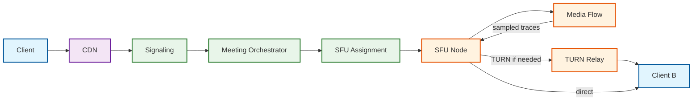

# Observability

## Metrics (USE/RED)

### SFU Metrics

The SFU is a real-time packet router sitting on the critical path of every media stream in the system. Any monitoring delay or missed alert on an SFU node does not affect a single user -- it degrades calls for hundreds of participants across dozens of rooms simultaneously. Unlike web servers where an extra 200ms of latency is an annoyance, in video conferencing, latency beyond 200ms destroys conversational flow. People start talking over each other, audio feels disconnected from lip movements, and the meeting becomes unusable. This makes SFU metrics the single highest-priority monitoring surface in the entire platform.

| Metric | Type | Alert Threshold |
|--------|------|-----------------|
| Active rooms per node | Utilization | >150 rooms |
| Active streams per node | Utilization | >3000 streams |
| CPU utilization | Utilization | >75% for 2 min |
| Memory utilization | Utilization | >85% |
| Packet forwarding latency (p99) | Latency | >5ms |
| Packets dropped (per second) | Error | >100 pps |
| NACK rate (retransmission requests) | Saturation | >5% of packets |
| Keyframe request rate | Saturation | >50/sec per room |
| Jitter buffer overflow | Error | >0.1% of packets |

**Derived Metrics:**

- **Rooms-per-core efficiency** = `active_rooms / CPU_cores`. Measures packing density. A node with 16 cores hosting 128 rooms runs at 8 rooms/core. Dropping below 4 rooms/core suggests inefficient allocation or compute-heavy rooms that should be rebalanced.
- **Bandwidth amplification factor** = `outbound_bytes / inbound_bytes`. For a pure SFU forwarding to N subscribers per room, this should approximate N-1. Values significantly above N-1 suggest redundant forwarding or simulcast retransmission storms. Values below indicate packet loss before forwarding.
- **Headroom** = `(max_capacity - current_utilization) / max_capacity`. When headroom drops below 20%, the autoscaler should begin provisioning new nodes. Below 10% triggers urgent scaling. This metric prevents the "thundering herd" problem where a burst of new meetings hits a nearly-full fleet.

### Signaling Metrics

| Metric | Type | Alert Threshold |
|--------|------|-----------------|
| WebSocket connections | Utilization | >15K per node |
| SDP negotiation time (p95) | Latency | >3 seconds |
| ICE connectivity check time (p95) | Latency | >5 seconds |
| Join success rate | Error | <99% |
| Message processing latency (p99) | Latency | >100ms |

**Join Funnel Breakdown:** Each step of the join process must be tracked independently. A drop at any stage reveals a different class of failure -- auth failures point to token issues, SFU assignment failures to capacity problems, and ICE failures to network connectivity issues.

| Step | Expected Latency | Success Rate Target |
|------|-----------------|---------------------|
| Auth token validation | <50ms | >99.99% |
| SFU node assignment | <100ms | >99.9% |
| WebSocket connection | <200ms | >99.9% |
| SDP offer/answer | <500ms | >99.5% |
| ICE connectivity | <3000ms | >98% |
| First media frame | <5000ms | >97% |
| Join-to-first-audio | <3000ms | >99% |

### Media Quality Metrics

| Metric | Type | Alert Threshold |
|--------|------|-----------------|
| Mouth-to-ear audio latency (p95) | Latency | >200ms |
| Glass-to-glass video latency (p95) | Latency | >300ms |
| Packet loss rate | Error | >3% |
| Jitter (inter-packet arrival variance) | Quality | >30ms |
| MOS (Mean Opinion Score) estimated | Quality | <3.5 |
| Bitrate adaptation frequency | Quality | >10 changes/minute |
| TURN relay utilization | Utilization | >80% capacity |
| Simulcast layer distribution | Quality | >50% on "low" quality |

**MOS Score Estimation:** The E-model (ITU-T G.107) provides a computational framework for estimating voice quality without subjective testing. It produces an R-factor that maps to the 1-5 MOS scale. The simplified formula: `R = 93.2 - (packet_loss * 2.5) - (jitter_ms * 0.5) - (latency_ms * 0.1)` and `MOS = 1 + 0.035R + R(R-60)(100-R) * 7e-6`. Interpretation:

- **MOS 4.0+**: Excellent. HD-quality audio and video, no perceptible artifacts. Users do not notice the technology.
- **MOS 3.5-4.0**: Good. Slight artifacts under network stress, occasional minor glitches. Acceptable for most business meetings.
- **MOS 3.0-3.5**: Fair. Noticeable quality issues -- choppy audio, pixelated video, slight delays. Still usable but users start commenting on quality.
- **MOS <3.0**: Poor. Significant degradation. Users complain, conversations break down, and participants may drop off.

**Per-Participant Quality Dashboard:** For each participant in a meeting, the system tracks a comprehensive quality profile:

- **Upstream**: sending bitrate, resolution, framerate, packet loss, jitter, encoder type
- **Downstream**: bitrate per received track, active simulcast layer, packet loss, jitter, decoder performance
- **Network**: round-trip time, available bandwidth estimate (from REMB/TWCC), TURN vs direct connection status
- **Device**: client CPU usage, encoder queue depth, camera/microphone health indicators

### Recording Metrics

| Metric | Type | Alert Threshold |
|--------|------|-----------------|
| Recording queue depth | Saturation | >200 pending |
| Compositing time vs meeting duration | Efficiency | >2x meeting duration |
| Recording failure rate | Error | >1% |
| Storage upload latency | Latency | >5 min per segment |

- **Pipeline throughput**: Compositing speed ratio measures how fast a meeting can be processed. A ratio of 3x means 1 hour of meeting is composited in 20 minutes. Target: >3x for batch (post-meeting) processing, >1x for real-time recording. Dropping below 1x for real-time means frames are being dropped.
- **Storage metrics**: Track daily ingest rate (TB/day), total stored volume, egress bandwidth for playback, and CDN cache hit rate for recordings. A low cache hit rate (<80%) means popular recordings are not being cached, increasing origin load.

### AI Service Metrics

| Metric | Type | Alert Threshold |
|--------|------|-----------------|
| Noise cancellation latency (p95) | Latency | >20ms |
| Background segmentation FPS | Throughput | <15 fps |
| Transcription word error rate | Quality | >15% |
| Caption delivery latency | Latency | >2 seconds |
| AI model inference GPU utilization | Utilization | >90% |
| Model load time (cold start) | Latency | >5 seconds |

---

## Dashboard Design

### Dashboard 1: Global Operations (NOC Screen)

- World map with meeting density heatmap, color-coded by region health (green/yellow/red)
- Total active meetings (current value, 24-hour trend sparkline)
- Total active participants (current value, peak today)
- SFU fleet health: percentage of nodes healthy / draining / offline
- TURN relay health per region with connection count and bandwidth utilization
- Join success rate (last 5 minutes, rolling window)
- Active alert counts by severity (P1 / P2 / P3)

### Dashboard 2: Media Quality (Engineering)

- MOS score distribution histogram (global, filterable by region and ISP)
- Latency percentile chart (p50, p95, p99 plotted over 24 hours)
- Packet loss heatmap by region pair (e.g., US-East to EU-West)
- Simulcast layer distribution pie chart showing low/medium/high breakdown
- Codec usage breakdown (VP8 / VP9 / AV1 / H.264) across the fleet
- TURN vs direct connection ratio per region
- Bandwidth consumption per SFU node (inbound and outbound)

### Dashboard 3: Meeting Lifecycle (Product)

- Join time distribution (p50, p95, p99 histogram)
- Meeting duration distribution (bucketed histogram: <5min, 5-15min, 15-30min, 30-60min, 60min+)
- Participant count distribution per meeting
- Feature usage rates: screen sharing %, recording %, breakout rooms %, E2EE %
- Error funnel: meeting creation -> join -> media established -> meeting completion

### Dashboard 4: Recording Pipeline (Engineering)

- Queue depth over time (stacked area chart: waiting / processing / uploading)
- Processing throughput (meetings composited per hour)
- Failure rate and retry count with breakdown by failure reason
- Storage ingestion rate (GB/hour)
- Average time from meeting end to recording available (SLA target: <30 minutes)

---

## Logging

### What to Log

- **Meeting lifecycle events**: create, join, leave, end, recording start/stop.
- **Signaling events**: SDP offer/answer, ICE state changes, WebSocket connect/disconnect.
- **Media quality events**: Bandwidth estimation changes, simulcast layer switches, NACK/PLI events.
- **Error events**: ICE failure, DTLS handshake failure, SFU node failover, recording failure.
- **Security events**: Authentication failures, unauthorized join attempts, meeting lock/unlock.
- **Infrastructure events**: Node scaling events, health check failures, deployment rollouts.
- **AI pipeline events**: Model loading, inference errors, feature toggle changes.

### Log Levels

| Level | What to Log |
|-------|-------------|
| ERROR | Meeting failures, recording failures, security violations |
| WARN | High packet loss (>5%), ICE restart, TURN fallback, degraded quality |
| INFO | Meeting lifecycle events, participant join/leave, recording state changes |
| DEBUG | Individual RTP packet stats, ICE candidate details, SDP contents (redacted) |

### Structured Log Examples

**Meeting join success:**

```json
{
  "timestamp": "2026-03-08T10:30:00Z",
  "level": "INFO",
  "service": "signaling",
  "meeting_id": "abc123",
  "participant_id": "user456",
  "event": "participant_joined",
  "details": {
    "join_latency_ms": 1850,
    "ice_type": "srflx",
    "sfu_node": "sfu-us-east-042",
    "codec_audio": "opus",
    "codec_video": "vp9"
  }
}
```

**Media quality degradation:**

```json
{
  "timestamp": "2026-03-08T10:30:00Z",
  "level": "WARN",
  "service": "sfu",
  "meeting_id": "abc123",
  "participant_id": "user456",
  "event": "quality_degradation",
  "details": {
    "packet_loss": 0.08,
    "estimated_bandwidth_bps": 500000,
    "simulcast_layer": "low",
    "action": "downgraded_from_medium"
  }
}
```

**ICE connectivity failure:**

```json
{
  "timestamp": "2026-03-08T10:31:15Z",
  "level": "ERROR",
  "service": "signaling",
  "meeting_id": "abc123",
  "participant_id": "user789",
  "event": "ice_failure",
  "details": {
    "ice_state": "failed",
    "candidates_gathered": 4,
    "candidates_tried": 4,
    "turn_attempted": true,
    "network_type": "corporate_firewall",
    "error": "all_candidates_exhausted"
  }
}
```

**Recording pipeline event:**

```json
{
  "timestamp": "2026-03-08T11:05:00Z",
  "level": "INFO",
  "service": "recording-pipeline",
  "meeting_id": "abc123",
  "event": "compositing_complete",
  "details": {
    "meeting_duration_sec": 3600,
    "compositing_duration_sec": 1100,
    "speed_ratio": 3.27,
    "output_size_mb": 420,
    "resolution": "1080p",
    "participant_count": 8
  }
}
```

### Log Volume Estimation

- Each participant generates approximately 1 log/second during steady state (quality samples, heartbeats).
- Join/leave bursts produce roughly 20 logs per event per participant (auth, signaling, ICE, media negotiation).
- At 30M concurrent participants: approximately 30M logs/second steady state.
- At peak join times (top of the hour): bursts up to 100M logs/second.
- Daily log volume: roughly 2.5 trillion log events, approximately 500 TB compressed.
- **Sampling strategy**: 100% for ERROR and WARN levels, 10% for INFO, 0.1% for DEBUG. During incidents, sampling increases to 100% for the affected meeting IDs and regions.

---

## Distributed Tracing

### Trace Architecture



### Trace Propagation

- Trace context propagated via W3C Trace Context headers in HTTP/WebSocket.
- **Media path**: Trace ID embedded in RTP header extensions (for correlation, not full tracing).
- **Cross-service**: Signaling -> Meeting Orchestrator -> SFU assignment -> ICE -> Media flow.

### Key Spans

| Span | Parent | Key Attributes | Example Duration | Sampling |
|------|--------|---------------|------------------|----------|
| `meeting.join` | root | meeting_id, participant_id, region, client_type | 1500-4000ms | 100% |
| `auth.validate` | meeting.join | auth_method, token_type | 20-50ms | 100% |
| `sfu.assign` | meeting.join | sfu_node, region, room_size | 30-100ms | 100% |
| `sdp.negotiation` | meeting.join | codec_offer, codec_answer, ice_candidates_count | 200-800ms | 100% |
| `ice.connect` | meeting.join | candidate_type (host/srflx/relay), network_type | 500-3000ms | 100% |
| `sfu.route_packet` | none | track_id, ssrc, packet_size | <1ms | 0.01% |
| `recording.composite` | none | segment_id, participant_count, duration | 10-60s per segment | 100% |
| `ai.noise_cancel` | none | model_version, frame_duration_ms | 5-15ms | 0.1% |

### Trace Challenges in Real-Time Media

- Media packets flow at 30-60 per second per video track and 50 per second per audio track. Full tracing at this volume is impossible without overwhelming the tracing backend.
- **Solution**: Sample at 0.01% for per-packet traces, but trace 100% of control plane operations (join, ICE negotiation, signaling messages, recording events).
- **Correlation**: Use `meeting_id` + `participant_id` as trace tags to correlate control plane traces with sampled media traces. This allows investigating a user's join experience alongside their media quality data.
- **Per-hop latency**: Insert timestamps at each hop -- client encode, SFU receive, SFU forward, client decode -- and compute per-hop latency from the deltas. These measurements feed back into the MOS estimation model.

---

## Alerting

### Critical (Page-worthy)

| Alert | Condition | Remediation |
|-------|-----------|-------------|
| SFU node down with active meetings | Node health check fails, active_rooms > 0 | Drain affected rooms to healthy nodes. Clients auto-reconnect via ICE restart. Investigate node failure (OOM, kernel panic, hardware). |
| Join success rate <95% for 2 min | Rolling join success rate drops below threshold | Check signaling service health, SFU capacity, and auth service. If region-specific, reroute traffic. |
| Audio latency p99 >500ms for 5 min | Sustained high latency across multiple SFU nodes | Check backbone network congestion, TURN relay load, and SFU CPU. Consider draining hot nodes. |
| Recording pipeline stalled | Zero recordings processed for >10 minutes | Check GPU availability, storage mount health, and pipeline worker status. Restart stuck workers. |
| E2EE key exchange failure rate >1% | Key distribution service returning errors | Check key server health, certificate validity, and client version compatibility. |

### Warning

| Alert | Condition | Remediation |
|-------|-----------|-------------|
| SFU CPU >75% for 5 min | Sustained high CPU on SFU node | Autoscaler should be adding capacity. If not, check scaling policies. Drain excess rooms manually if needed. |
| Packet loss >3% region-wide | Aggregate packet loss across region | Investigate ISP peering issues, backbone congestion, or TURN relay problems in the affected region. |
| TURN relay at >80% capacity | Connection count or bandwidth near limits | Scale TURN fleet in region. Check if corporate firewall changes are forcing more users through TURN. |
| Recording queue growing | >100 pending for 10 minutes | Add recording workers. Check if GPU nodes are healthy. Prioritize by meeting size. |
| AI caption service latency >500ms | p95 caption delivery exceeds threshold | Check GPU utilization on inference nodes. Consider reducing model complexity or adding capacity. |

### Alert Routing

| Severity | Channel | Response Time |
|----------|---------|---------------|
| P1 (Critical) | PagerDuty -> On-call SRE | 5 minutes |
| P2 (High) | Slack #incidents + PagerDuty | 15 minutes |
| P3 (Medium) | Slack #alerts | Next business day |
| P4 (Low) | Weekly report | Sprint planning |

### Runbook References

| Alert | Runbook |
|-------|---------|
| SFU node failure | Drain node, verify client reconnection via ICE restart, check node logs, replace instance |
| Region-wide quality degradation | Check backbone congestion, ISP peering, TURN relay health, codec negotiation, engage network team |
| Recording pipeline backlog | Verify GPU node health, check storage capacity, scale workers, retry failed jobs with backoff |
| TURN relay exhaustion | Scale TURN fleet in region, check for corporate firewall policy changes driving increased relay usage |
| AI service degradation | Check GPU utilization, verify model serving health, consider feature-flag disabling non-critical AI features |
| High join failure rate | Check signaling service, auth service, SFU capacity, DNS resolution, and CDN edge health |
| WebSocket storm (signaling overload) | Enable rate limiting, check for client reconnect loops, scale signaling nodes, investigate root cause |

### Alert Fatigue Prevention

- **Deduplication**: Same alert from the same component within 5 minutes is collapsed into a single notification with an occurrence count.
- **Grouping**: Region-wide issues are grouped into a single incident rather than firing per-node alerts.
- **Auto-resolve**: Alerts automatically close if the triggering condition clears for 10 consecutive minutes.
- **Maintenance windows**: Alerts are suppressed during planned upgrades and deployments, with automatic re-enablement after the window expires.
