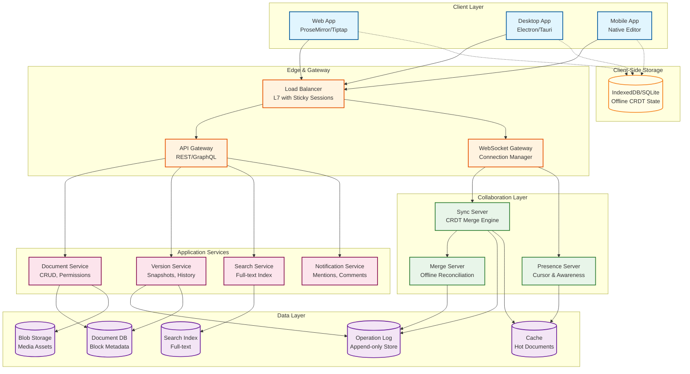
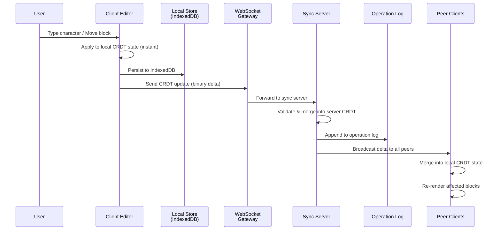
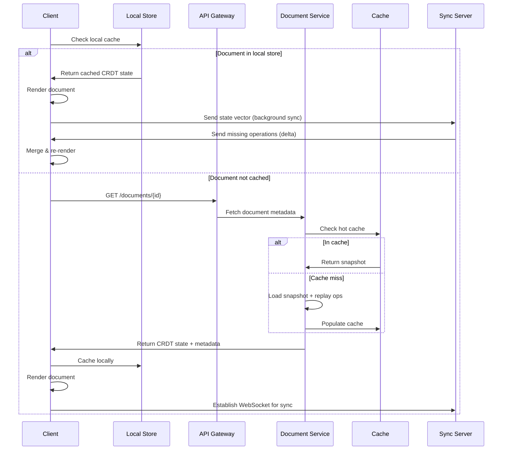
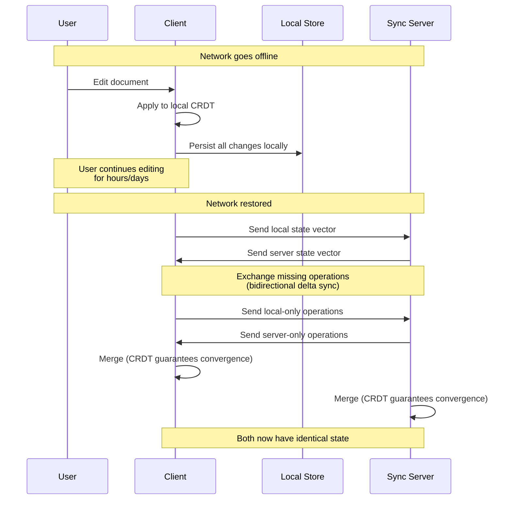

# High-Level Design

## System Architecture



---

## Key Architectural Decisions

### 1. CRDT-Native vs OT-Based

**Decision: CRDT-native architecture with server-assisted sync**

| Factor | OT Approach | CRDT Approach (Chosen) |
|--------|-------------|------------------------|
| Offline editing | Requires queueing + server rebase | Native---merge on reconnect |
| Server dependency | Central server required for ordering | Optional---peer-to-peer possible |
| Block tree operations | No standard solution | Tree CRDT (Kleppmann move op) |
| Memory overhead | Minimal | 4-32 bytes/character (mitigated by compression) |
| Convergence proof | Must verify per transform function | Mathematically guaranteed |
| Implementation | N-squared transform functions | Composable CRDT types |

Rationale: Block-based editors inherently need offline support (users edit on planes, in tunnels, on mobile). OT cannot support arbitrary-duration offline editing because it requires server-ordered operation histories. CRDTs provide the mathematical convergence guarantee that makes offline merging tractable.

### 2. Block Model vs Linear Model

**Decision: Everything is a block**

Every element in the editor is a block with:
- A globally unique UUID (v4)
- A type field that determines rendering
- A properties map (CRDT Map)
- An ordered list of child block IDs (CRDT Sequence)
- Inline text content (CRDT Text/RichText)

This enables block-level operations (move, nest, transform type) as first-class citizens rather than text-level hacks.

### 3. Sync Architecture: Server-Assisted, Not Server-Dependent

**Decision: Hybrid client-server with optional peer-to-peer**

```
Client A ──WebSocket──> Sync Server ──WebSocket──> Client B
   │                       │
   └── IndexedDB           └── Operation Log + Snapshot Store
```

- **Normal mode**: Clients sync via a central server for ordering and persistence
- **Offline mode**: Clients write to local CRDT state in IndexedDB
- **Reconnect**: Client sends CRDT state vector; server sends missing operations
- **Optional P2P**: WebRTC data channel for same-network peers (reduces server load)

### 4. Presence: Ephemeral Channel

**Decision: Separate presence from document sync**

Presence data (cursors, selections, user status) is:
- Ephemeral---not persisted to the operation log
- Broadcast via a separate lightweight channel
- Throttled at 10-30 Hz to avoid flooding
- Uses the Yjs awareness protocol pattern

### 5. Storage: Operation Log + Periodic Snapshots

**Decision: Event sourcing with compaction**

```
Time ──────────────────────────────────────────>
│ Snapshot │ op op op op │ Snapshot │ op op op │
│  (full)  │ (deltas)   │  (full)  │ (deltas) │
```

- Every operation is appended to an immutable log
- Periodic snapshots capture full CRDT state (every 100 operations or 5 minutes)
- Loading a document: load latest snapshot + replay subsequent operations
- Old operations are retained for version history but compacted for storage

### 6. Database Choices

| Data Type | Storage | Rationale |
|-----------|---------|-----------|
| Block metadata & permissions | Relational DB (PostgreSQL) | ACID transactions for permission changes |
| Operation log | Append-only log store (Kafka-backed or custom) | High write throughput, immutability |
| CRDT snapshots | Key-value store (Redis for hot, Blob Storage for cold) | Fast loading by document ID |
| Full-text search | Search engine (Elasticsearch-style) | Inverted index for document search |
| Media assets | Blob/object storage | Cost-effective, CDN-backed |
| Offline client state | IndexedDB / SQLite WASM / OPFS | Browser-native persistent storage |

---

## Data Flow

### Write Path (Real-Time Edit)



**Key properties:**
- User sees edit immediately (step 2) before any network round-trip
- Local persistence (step 3) happens before network send (offline safety)
- Server merge (step 6) is a CRDT merge---always succeeds, never rejects
- Peer receive (step 7) is also a CRDT merge---always converges

### Read Path (Document Load)



### Offline Edit & Reconnect Flow



---

## Architecture Pattern Checklist

- [x] **Sync vs Async**: WebSocket for real-time sync (async push); REST for metadata (sync request-response)
- [x] **Event-driven vs Request-response**: Event-driven for edits (operation stream); request-response for document CRUD
- [x] **Push vs Pull**: Push for real-time edits and presence; pull for initial document load
- [x] **Stateless vs Stateful**: Sync servers are stateful (hold active document CRDT state in memory); API servers are stateless
- [x] **Read-heavy vs Write-heavy**: Write-heavy during editing sessions (2+ ops/sec per user); optimized with local-first rendering
- [x] **Real-time vs Batch**: Real-time for edits and presence; batch for search indexing, version snapshots, analytics
- [x] **Edge vs Origin**: Client-side (edge) CRDT processing for zero-latency editing; server for persistence and cross-client sync

---

## Component Responsibilities

| Component | Responsibility | Scaling Strategy |
|-----------|---------------|-----------------|
| **WebSocket Gateway** | Connection management, auth, routing | Horizontal (sticky sessions by document) |
| **Sync Server** | CRDT merge, operation ordering, broadcast | Horizontal (sharded by document ID) |
| **Presence Server** | Cursor positions, user awareness | Horizontal (pub/sub based) |
| **Merge Server** | Offline reconciliation, large branch merges | Queue-based, auto-scaled |
| **Document Service** | Metadata CRUD, permissions, sharing | Stateless, horizontally scaled |
| **Version Service** | Snapshot creation, history browsing | Background workers |
| **Search Service** | Full-text indexing and querying | Sharded search index |
| **Operation Log** | Immutable append-only storage | Partitioned by document ID |
