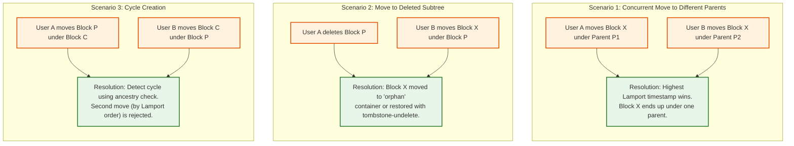
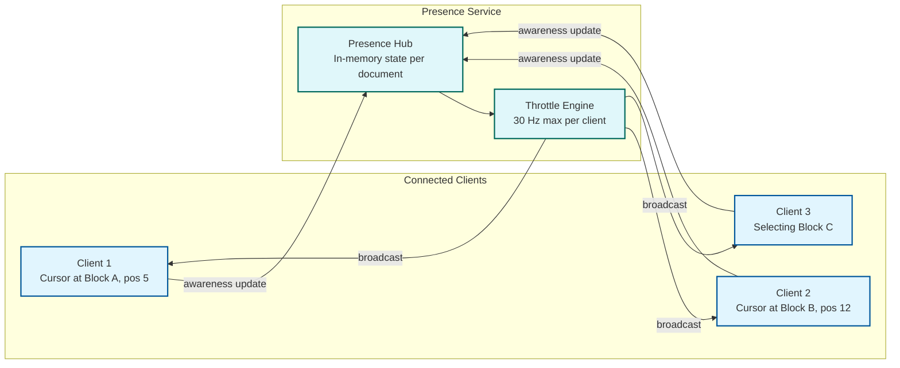

# Deep Dive & Bottlenecks

## Critical Component 1: CRDT Merge Engine

### Why This Is Critical

The CRDT merge engine is the heart of the collaborative editor. Every edit from every user on every device passes through it. If it produces incorrect results, documents corrupt. If it is slow, the editor feels laggy. If it uses too much memory, mobile clients crash.

### How It Works Internally

The merge engine maintains a **composite CRDT document** consisting of three interacting CRDT types:

```mermaid
flowchart TB
    subgraph DocCRDT["Document CRDT (Composite)"]
        subgraph TreeCRDT["Block Tree Layer"]
            RT[Root Block]
            B1[Block 1]
            B2[Block 2]
            B3[Block 3]
            RT --> B1
            RT --> B2
            B1 --> B3
        end

        subgraph MapCRDT["Block Properties Layer"]
            P1["B1: {type: heading, level: 2}"]
            P2["B2: {type: todo, checked: false}"]
            P3["B3: {type: paragraph}"]
        end

        subgraph TextCRDT["Block Text Layer"]
            T1["B1: 'Introduction' + marks"]
            T2["B2: 'Buy groceries' + marks"]
            T3["B3: 'First paragraph...' + marks"]
        end
    end

    classDef tree fill:#e8f5e9,stroke:#2e7d32,stroke-width:2px
    classDef map fill:#fff3e0,stroke:#e65100,stroke-width:2px
    classDef text fill:#e1f5fe,stroke:#01579b,stroke-width:2px

    class RT,B1,B2,B3 tree
    class P1,P2,P3 map
    class T1,T2,T3 text
```



**Merge algorithm for incoming remote update:**

```
FUNCTION merge_remote_update(encoded_update):
    decoded_ops = decode(encoded_update)

    FOR op IN decoded_ops:
        SWITCH op.type:
            CASE "text_insert":
                // YATA/Fugue: find correct position using left/right origins
                target_block = blocks[op.block_id]
                position = find_insert_position(
                    target_block.text,
                    op.left_origin,    // ID of character to the left
                    op.right_origin,   // ID of character to the right
                    op.item_id         // This operation's unique ID
                )
                target_block.text.integrate(position, op)

            CASE "text_delete":
                target_block.text.mark_deleted(op.item_id)

            CASE "block_insert":
                parent = blocks[op.parent_id]
                parent.children.integrate(op.position, op.block_id)
                blocks[op.block_id] = create_block(op)

            CASE "block_move":
                resolve_move(op)

            CASE "block_delete":
                mark_block_deleted(op.block_id)

            CASE "property_set":
                block = blocks[op.block_id]
                block.properties.set(op.key, op.value, op.clock)

            CASE "format_mark":
                integrate_format_mark(op)

    // Notify renderer of affected blocks
    emit("blocks_changed", affected_block_ids)
```

### Failure Modes

| Failure | Impact | Mitigation |
|---------|--------|------------|
| **CRDT state corruption** | Document becomes unreadable | Checksum verification on every merge; rollback to last valid snapshot |
| **Merge produces unexpected result** | User intent lost (text interleaving) | Use Fugue algorithm (proven non-interleaving); expose conflicts to users |
| **Out-of-memory on large documents** | Client/server crash | Lazy loading of block subtrees; memory-mapped CRDT state |
| **Slow merge of large offline branch** | UI freeze during reconnect | Background worker merge; progressive rendering during merge |
| **Tombstone accumulation** | Memory bloat over time | Garbage collection when all replicas confirm past state vector |
| **State vector divergence** | Infinite sync loop | Periodic full-state comparison; forced snapshot reconciliation |

### The Interleaving Problem

When two users concurrently type at the same position, their characters can interleave unpredictably:

```
User A types: "Hello"
User B types: "World"

BAD merge:  "HWeolrllod"  (character-level interleaving)
GOOD merge: "HelloWorld" or "WorldHello" (block-level grouping)
```

**Solution**: The Fugue algorithm (2023) guarantees that concurrent insertions at the same position are never interleaved. Characters from the same user are always grouped together. This is achieved by using a tree-based position scheme where each character's position is defined relative to its causal predecessor.

---

## Critical Component 2: Block Tree Structural Operations

### Why This Is Critical

Block-based editors allow users to drag blocks around, indent/outdent to create nesting, and delete entire subtrees. These operations modify the **tree structure** of the document, creating conflict scenarios that don't exist in linear text editors.

### Tree Conflict Scenarios



### Move Operation Deep Dive

```
FUNCTION handle_move_operation(move_op):
    block = blocks[move_op.block_id]
    new_parent = blocks[move_op.new_parent_id]

    // Step 1: Cycle detection
    // Walk up from new_parent to root; if we encounter block_id, it's a cycle
    ancestor = new_parent
    WHILE ancestor != null:
        IF ancestor.id == move_op.block_id:
            // This move would create a cycle
            IF move_op.timestamp > block.last_move_timestamp:
                // This is the "winning" move but creates a cycle
                // Resolution: move to document root instead
                move_op.new_parent_id = document.root_block_id
            ELSE:
                RETURN  // Discard this move; earlier move wins
        ancestor = blocks[ancestor.parent_id]

    // Step 2: Conflict resolution for concurrent moves
    IF block.last_move_timestamp >= move_op.timestamp:
        RETURN  // A later move already applied; this one loses

    // Step 3: Execute the move
    old_parent = blocks[block.parent_id]
    old_parent.children.remove(block.id)
    new_parent.children.insert(move_op.position, block.id)
    block.parent_id = move_op.new_parent_id
    block.last_move_timestamp = move_op.timestamp
```

### The "Delete Parent While Adding Children" Problem

```
Timeline:
t=0: Document has Block P with children [A, B]
t=1: User X (offline) adds Block C as child of P
t=2: User Y (online) deletes Block P (and its children A, B)

On merge:
- P is deleted (tombstoned), A and B are deleted
- Block C was added to a now-deleted parent
- Resolution options:
  a) "Orphan rescue": Move C to P's former parent
  b) "Tombstone undelete": Resurrect P because it has a live child
  c) "Cascade delete": Delete C too (data loss - BAD)

Chosen approach: (a) Orphan rescue
- Preserves user X's intent (they created content)
- Respects user Y's intent (they wanted P gone)
- C appears at the position where P used to be
```

### Failure Modes

| Failure | Impact | Mitigation |
|---------|--------|------------|
| **Cycle in block tree** | Infinite rendering loop | Ancestry check before every move; cycle detection in render loop |
| **Orphaned blocks** | Content invisible to users | Orphan rescue to nearest valid ancestor; orphan detection sweep |
| **Position conflicts in sibling order** | Blocks appear in wrong order | CRDT sequence guarantees convergence; manual reorder available |
| **Concurrent type change + content edit** | Rendering mismatch | Type is a LWW register; content is type-agnostic (always preserved) |

---

## Critical Component 3: Presence & Cursor Synchronization

### Why This Is Critical

Multiplayer cursors transform editing from "typing into the void" into a social experience. Users must see where others are, what they're selecting, and whether they're actively typing. But presence updates are extremely high frequency (10-30 Hz per user) and must not interfere with document sync.

### Architecture



### Cursor Position Representation

Cursor positions **must not use character offsets**. When remote edits insert or delete text, integer offsets become invalid. Instead, positions are anchored to CRDT item IDs:

```
STRUCTURE CursorPosition:
    block_id: BlockID           // Which block the cursor is in
    item_id: CRDTItemID         // The CRDT character ID at the cursor
    assoc: "before" | "after"   // Which side of the character
    // This survives remote insertions and deletions

STRUCTURE SelectionRange:
    anchor: CursorPosition      // Where selection started
    head: CursorPosition        // Where selection ends (cursor end)

STRUCTURE AwarenessState:
    user: { id, name, color }
    cursor: CursorPosition | null
    selection: SelectionRange | null
    is_typing: boolean
    last_active: Timestamp
```

### Why Presence Is Separated from Document Sync

| Concern | Document Sync | Presence |
|---------|--------------|----------|
| Persistence | Must be durable (operation log) | Ephemeral (no persistence) |
| Frequency | Event-driven (on edit) | Time-driven (10-30 Hz) |
| Consistency | Must converge (CRDT) | Best effort (stale is OK) |
| Failure impact | Data loss | Minor UX degradation |
| Bandwidth | Variable (delta-compressed) | Predictable (~100 bytes/update) |

Mixing presence into the CRDT would bloat the operation log with millions of ephemeral cursor movements that have zero historical value.

### Failure Modes

| Failure | Impact | Mitigation |
|---------|--------|------------|
| **Stale cursors** | Ghost cursors from disconnected users | Heartbeat timeout (10s); remove awareness state on disconnect |
| **Cursor position invalid** | Cursor points to deleted text | Resolve to nearest valid position on each render |
| **Presence storm** | 100+ users in one doc = broadcast amplification | Batch presence updates; only send deltas; viewport-based filtering |

---

## Concurrency & Race Conditions

### Race Condition 1: Concurrent Block Move and Content Edit

```
User A: Moves Block X from under P1 to under P2
User B: Edits text inside Block X

Resolution: No conflict! Block identity (UUID) is stable.
- Move changes the parent pointer (tree structure)
- Text edit changes the content (text CRDT)
- These are orthogonal CRDT operations
- Both apply cleanly after merge
```

### Race Condition 2: Concurrent Block Type Change

```
User A: Changes Block X from "paragraph" to "heading"
User B: Changes Block X from "paragraph" to "code"

Resolution: Last-Writer-Wins (LWW) on the type property.
- The change with the higher Lamport timestamp wins
- Content is preserved regardless (type is just a rendering hint)
- The "losing" type change is silently overwritten
```

### Race Condition 3: Snapshot vs. Active Editing

```
Snapshot worker: Reading document state to create a snapshot
Active editors: Writing operations concurrently

Resolution: CRDT state is monotonic.
- Take a snapshot of the state vector at read time
- Snapshot captures a consistent causal cut of the document
- Any operations concurrent with the snapshot will be
  captured in the next snapshot
- No locking required (CRDTs are lock-free)
```

### Race Condition 4: Permission Change During Offline Edit

```
Admin: Revokes User B's edit permission while User B is offline
User B: Makes edits offline

Resolution: Server-side validation on reconnect.
- User B's offline edits are sent to the server
- Server checks current permissions before merging
- If permission revoked: reject the merge, notify the user
- User B's local state is rolled back to server state
- Offline edits are preserved locally as a "rejected changes" diff
```

---

## Bottleneck Analysis

### Bottleneck 1: WebSocket Fan-Out for Popular Documents

**Problem**: When 100+ users edit a single document, every edit must be broadcast to all other users. With N users and E edits/sec per user, the server must send N * E messages/sec for that document.

**Quantification**: 100 users * 2 edits/sec * 99 recipients = 19,800 messages/sec for one document.

**Mitigations**:
1. **Operation batching**: Aggregate operations into 50ms windows before broadcast (reduces messages by 5-10x)
2. **Delta compression**: Send binary-encoded CRDT deltas (typically 50-200 bytes vs. JSON kilobytes)
3. **Viewport-based filtering**: Only send operations affecting blocks currently visible to each client (reduces irrelevant updates for long documents)
4. **Hierarchical fan-out**: Use a pub/sub tree instead of direct broadcast (sync server publishes once to message bus; edge servers fan out to clients)

### Bottleneck 2: CRDT Metadata Memory Overhead

**Problem**: CRDTs attach metadata (item ID, left origin, right origin, deleted flag) to every character. A 10,000-character document can grow from 10 KB to 160-320 KB.

**Quantification**: Using YATA algorithm: ~16-32 bytes metadata per character. A 50-page document (~100K chars) = 1.6-3.2 MB of CRDT metadata.

**Mitigations**:
1. **Columnar encoding** (Automerge approach): Store metadata in columns rather than per-item, achieving 4-6 bytes/character
2. **Lazy loading**: Load CRDT metadata only for blocks currently being edited; other blocks are loaded as rendered snapshots
3. **Eg-walker approach**: Don't maintain persistent CRDT state; only instantiate CRDT structures during merge, then discard. Memory usage approaches OT levels in the common (non-conflicting) case
4. **Block-level granularity**: Keep CRDT metadata per-block, not per-document. Unedited blocks have no CRDT overhead

### Bottleneck 3: Large Document Initial Load

**Problem**: A document with 10,000 blocks and 100K+ operations requires loading and replaying the full operation log to reconstruct CRDT state.

**Quantification**: 100K operations * ~100 bytes = 10 MB of operations to download and replay. At 100K ops/sec replay speed = 1 second.

**Mitigations**:
1. **Periodic snapshots**: Store full CRDT state every 100-500 operations. Load snapshot + replay only recent operations
2. **Progressive loading**: Load the first screen of blocks immediately; load deeper blocks as user scrolls
3. **Block-level lazy loading**: Each block's CRDT state is independently loadable; only load blocks being viewed/edited
4. **CDN caching**: Cache recent snapshots at edge for fast initial load
5. **Compression**: Binary CRDT state compresses 60-80% with standard compression
