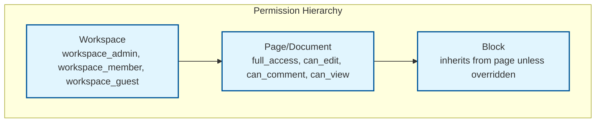

# Security & Compliance

## Authentication & Authorization

### Authentication Mechanism

| Method | Use Case | Details |
|--------|----------|---------|
| **OAuth 2.0 / OIDC** | Web and desktop app login | SSO via Google, Microsoft, SAML providers |
| **JWT access tokens** | API and WebSocket authentication | Short-lived (15 min); refreshed via refresh token |
| **API keys** | Programmatic access (integrations) | Scoped to workspace; rate limited |
| **WebSocket auth** | Real-time connection | JWT verified on connection upgrade; re-verified on token refresh |

#### WebSocket Authentication Flow

```
1. Client obtains JWT via OAuth flow
2. Client connects: wss://sync.example.com/docs/{id}
   Header: Authorization: Bearer {jwt}
3. Gateway validates JWT (signature, expiry, claims)
4. Gateway extracts user_id, workspace_id, permissions
5. Gateway establishes connection with user context
6. On token expiry: client sends new JWT via WebSocket message
7. Server re-validates without dropping connection
```

### Authorization Model: Hierarchical RBAC



| Role | Permissions |
|------|------------|
| **Workspace Admin** | All operations; manage members; delete workspace |
| **Workspace Member** | Create/edit own documents; access shared documents per sharing settings |
| **Workspace Guest** | Access only explicitly shared documents |
| **Document Full Access** | Edit, share, delete, manage permissions |
| **Document Editor** | Edit content, add comments |
| **Document Commenter** | Add comments, view content |
| **Document Viewer** | View only; no edits |

### Permission Enforcement Points

| Layer | What Is Checked | When |
|-------|----------------|------|
| **API Gateway** | JWT validity, workspace membership | Every REST request |
| **WebSocket Gateway** | Document-level permission (can_edit/can_view) | On connection + token refresh |
| **Sync Server** | Operation-level validation | Before merging each CRDT update |
| **Client** | UI-level restrictions (hide edit tools) | On document load (advisory) |

### Server-Side Operation Validation

```
FUNCTION validate_operation(user_id, document_id, operation):
    permission = get_permission(user_id, document_id)

    SWITCH operation.type:
        CASE "text_edit", "block_insert", "block_move", "block_delete":
            REQUIRE permission >= EDITOR
        CASE "comment_add":
            REQUIRE permission >= COMMENTER
        CASE "permission_change", "document_delete":
            REQUIRE permission >= FULL_ACCESS
        CASE "awareness_update":
            REQUIRE permission >= VIEWER

    // Additional validation for block moves
    IF operation.type == "block_move":
        // Prevent moving blocks to documents the user can't edit
        target_doc = get_document_for_block(operation.new_parent_id)
        REQUIRE get_permission(user_id, target_doc) >= EDITOR

    RETURN ALLOWED
```

---

## Data Security

### Encryption at Rest

| Data | Encryption | Key Management |
|------|-----------|----------------|
| CRDT state / snapshots | AES-256-GCM | Per-workspace keys in KMS |
| Operation log | AES-256-GCM | Per-workspace keys in KMS |
| Metadata DB | Transparent Data Encryption (TDE) | DB-managed with KMS master key |
| Client-side storage (IndexedDB) | AES-256-GCM | Per-user key derived from auth token |
| Blob storage (media) | Server-side encryption | Per-object keys in KMS |
| Backups | AES-256-GCM | Backup-specific keys; rotated quarterly |

### Encryption in Transit

| Channel | Protocol | Details |
|---------|----------|---------|
| REST API | TLS 1.3 | Certificate pinning on mobile clients |
| WebSocket | WSS (TLS 1.3) | Same TLS as REST; binary frames for CRDT data |
| Server-to-server | mTLS | Service mesh with mutual authentication |
| Client-to-CDN | TLS 1.3 | CDN terminates TLS; re-encrypts to origin |

### PII Handling

| Data Type | Classification | Handling |
|-----------|---------------|----------|
| User names, emails | PII | Encrypted at rest; access-logged |
| Document content | User Data | Encrypted at rest; workspace-isolated |
| Operation logs | User Data + Metadata | Contains user_id per operation; encrypted |
| Cursor positions | Ephemeral | Not persisted; not logged |
| IP addresses | PII | Logged for security; rotated after 90 days |
| Search queries | User Behavior | Anonymized after 30 days |

### Data Isolation

```
Workspace A                    Workspace B
┌─────────────────────┐       ┌─────────────────────┐
│ Shard: ws-a          │       │ Shard: ws-b          │
│ Encryption key: K_a  │       │ Encryption key: K_b  │
│ ┌─────────────────┐ │       │ ┌─────────────────┐ │
│ │ Documents        │ │       │ │ Documents        │ │
│ │ Operation Logs   │ │       │ │ Operation Logs   │ │
│ │ Snapshots        │ │       │ │ Snapshots        │ │
│ └─────────────────┘ │       │ └─────────────────┘ │
└─────────────────────┘       └─────────────────────┘

No cross-workspace data leakage is architecturally possible:
- Different encryption keys
- Different database shards
- Different search index partitions
```

---

## Threat Model

### Top Attack Vectors

| # | Attack Vector | Severity | Mitigation |
|---|--------------|----------|------------|
| 1 | **Malicious CRDT operations** | Critical | Server-side validation of every operation; schema enforcement; rate limiting |
| 2 | **WebSocket hijacking** | Critical | JWT auth on connection; re-auth on token refresh; connection-level encryption |
| 3 | **Permission escalation via block move** | High | Validate target document permissions on every move operation |
| 4 | **Operation log injection** | High | Append-only log with cryptographic signing; sequence validation |
| 5 | **Cross-workspace data access** | High | Workspace-level data isolation; separate encryption keys |

### Attack: Malicious CRDT Operations

**Scenario**: A compromised client sends crafted CRDT operations that, while valid CRDT operations, produce undesirable results (e.g., inserting millions of characters, creating deeply nested block trees to cause stack overflow).

**Mitigations**:
1. **Schema validation**: Every operation is checked against block type schema (max text length, max nesting depth, valid property values)
2. **Rate limiting**: Max 60 operations/sec per client; burst detection
3. **Size limits**: Max 1MB per document; max 10,000 blocks per document; max 20 nesting levels
4. **Anomaly detection**: Flag unusual operation patterns (rapid deletions, mass block creation)
5. **Rollback capability**: Admin can restore any document to a previous snapshot

### Attack: Offline Edit Injection

**Scenario**: An attacker modifies client-side IndexedDB to inject malicious content, then reconnects to sync poisoned data.

**Mitigations**:
1. **Server validates all operations** regardless of origin (online or offline)
2. **Content scanning**: Automated scanning for malware, XSS payloads, and malicious content on merge
3. **Digital signatures**: Each operation is signed with the user's session key; server verifies signature before merge
4. **Rate limiting on reconnect**: Limit the volume of operations accepted during offline merge (e.g., max 10,000 operations per reconnect)

### Rate Limiting & DDoS Protection

| Layer | Protection |
|-------|-----------|
| **Edge/CDN** | IP-based rate limiting; geographic blocking; bot detection |
| **API Gateway** | Per-user rate limits; token bucket per endpoint |
| **WebSocket Gateway** | Per-connection message rate; max connections per user (5) |
| **Sync Server** | Per-document operation rate; circuit breaker on hot documents |

---

## Compliance

### GDPR

| Requirement | Implementation |
|-------------|---------------|
| Right to access | Export API returns all user data (documents, comments, operation history) |
| Right to erasure | Delete user data; pseudonymize operations in shared documents |
| Data portability | Export in standard formats (Markdown, HTML, JSON) |
| Purpose limitation | Document content used only for the editing service |
| Data minimization | Operation logs compacted after snapshot; presence data not persisted |

### SOC 2

| Control | Implementation |
|---------|---------------|
| Access control | RBAC with workspace and document-level permissions |
| Audit logging | All permission changes, document shares, and admin actions logged |
| Encryption | At rest (AES-256) and in transit (TLS 1.3) |
| Availability | 99.95% SLA with offline editing as failsafe |
| Change management | Version history for all documents; operation log as audit trail |

### Audit Trail

All security-relevant events are logged to an immutable audit log:

| Event | Data Captured |
|-------|--------------|
| Document shared | Who, with whom, permission level, timestamp |
| Permission changed | Who, target user, old/new permission, timestamp |
| Document exported | Who, format, timestamp |
| Member invited/removed | Who, target, action, timestamp |
| Offline merge | Who, operations count, conflict count, timestamp |
| Admin restore | Who, document, restored version, timestamp |
