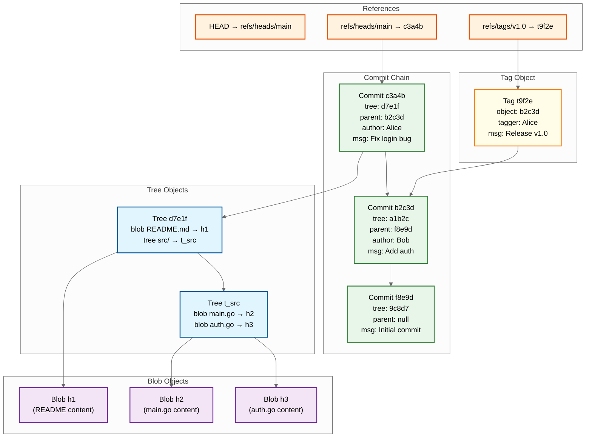

# Low-Level Design

## Git Object Model

### Content-Addressable Object Store

Git stores all data as content-addressed objects in a Merkle DAG. Every object is identified by the hash of its content (currently SHA-1, transitioning to SHA-256). There are four object types:

```
Git Object Types
├── Blob    ──> File content (raw bytes, no metadata)
├── Tree    ──> Directory listing (mode, name, hash for each entry)
├── Commit  ──> Snapshot pointer (tree hash, parent commits, author, message)
└── Tag     ──> Annotated tag (target object, tagger, message, signature)
```

### Object Relationships (Merkle DAG)



### Storage Layout

```
Repository on Disk
├── objects/
│   ├── pack/                        # Packed objects (primary storage)
│   │   ├── pack-abc123.pack         # Pack file (compressed objects)
│   │   ├── pack-abc123.idx          # Pack index (object hash → offset)
│   │   ├── pack-abc123.rev          # Reverse index (offset → object hash)
│   │   └── multi-pack-index         # Index spanning all pack files
│   ├── info/
│   │   └── alternates               # Paths to shared object stores (forks)
│   └── ab/                          # Loose objects (fan-out by first 2 hex chars)
│       └── cdef1234...              # Individual object file (zlib-compressed)
├── refs/
│   ├── heads/                       # Branch refs
│   │   ├── main                     # File containing commit SHA
│   │   └── feature/login            # Branch names can have slashes
│   └── tags/                        # Tag refs
│       └── v1.0                     # Lightweight tag (just a SHA)
├── packed-refs                      # Packed refs file (optimization for many refs)
├── HEAD                             # Current branch pointer
└── config                           # Repository configuration
```

### Loose Objects vs Pack Files

| Aspect | Loose Objects | Pack Files |
|--------|--------------|------------|
| **Format** | One file per object, zlib-compressed | Multiple objects in one file, delta-compressed |
| **Write speed** | Fast (append single file) | Slow (requires repacking) |
| **Read speed** | Requires fan-out directory traversal | Fast with index lookup |
| **Storage efficiency** | ~60% of raw size | ~10-20% of raw size (delta compression) |
| **Use case** | Recent pushes, new objects | Long-term storage, clone serving |

---

## Data Schemas

### Repository Metadata

```
TABLE repositories
    id                  BIGINT PRIMARY KEY
    owner_id            BIGINT NOT NULL          -- FK to users or organizations
    name                VARCHAR(255) NOT NULL
    full_name           VARCHAR(512) NOT NULL    -- "owner/name", unique
    description         TEXT
    visibility          ENUM('public', 'private', 'internal')
    default_branch      VARCHAR(255) DEFAULT 'main'
    fork_parent_id      BIGINT                   -- FK to parent repo (NULL if not a fork)
    fork_root_id        BIGINT                   -- FK to root of fork network
    disk_path           VARCHAR(512) NOT NULL    -- Path to git repo on disk
    storage_shard_id    INT NOT NULL             -- Which storage server
    size_kb             BIGINT DEFAULT 0
    is_archived         BOOLEAN DEFAULT false
    is_disabled         BOOLEAN DEFAULT false
    has_issues          BOOLEAN DEFAULT true
    has_wiki            BOOLEAN DEFAULT true
    has_actions         BOOLEAN DEFAULT true
    stars_count         INT DEFAULT 0
    forks_count         INT DEFAULT 0
    watchers_count      INT DEFAULT 0
    pushed_at           TIMESTAMP
    created_at          TIMESTAMP NOT NULL
    updated_at          TIMESTAMP NOT NULL

    UNIQUE INDEX idx_repo_full_name (full_name)
    INDEX idx_repo_owner (owner_id)
    INDEX idx_repo_fork_root (fork_root_id)
    INDEX idx_repo_shard (storage_shard_id)
    INDEX idx_repo_pushed (pushed_at DESC)
```

### Pull Request

```
TABLE pull_requests
    id                  BIGINT PRIMARY KEY
    repository_id       BIGINT NOT NULL
    number              INT NOT NULL             -- Per-repo sequential number
    title               VARCHAR(512) NOT NULL
    body                TEXT
    state               ENUM('open', 'closed', 'merged')
    author_id           BIGINT NOT NULL
    head_repository_id  BIGINT                   -- Source repo (may be a fork)
    head_ref            VARCHAR(255) NOT NULL    -- Source branch name
    head_sha            CHAR(40) NOT NULL        -- Current HEAD of source
    base_ref            VARCHAR(255) NOT NULL    -- Target branch name
    base_sha            CHAR(40) NOT NULL        -- Merge base SHA
    merge_commit_sha    CHAR(40)                 -- SHA of merge commit (after merge)
    merge_strategy      ENUM('merge', 'squash', 'rebase')
    merged_by_id        BIGINT
    merged_at           TIMESTAMP
    is_draft            BOOLEAN DEFAULT false
    mergeable_state     ENUM('mergeable', 'conflicting', 'unknown')
    additions           INT DEFAULT 0
    deletions           INT DEFAULT 0
    changed_files       INT DEFAULT 0
    comments_count      INT DEFAULT 0
    review_comments_count INT DEFAULT 0
    created_at          TIMESTAMP NOT NULL
    updated_at          TIMESTAMP NOT NULL
    closed_at           TIMESTAMP

    UNIQUE INDEX idx_pr_repo_number (repository_id, number)
    INDEX idx_pr_author (author_id)
    INDEX idx_pr_state (repository_id, state, updated_at DESC)
    INDEX idx_pr_head (head_repository_id, head_ref)
```

### Commit Metadata (Denormalized from Git)

```
TABLE commits
    id                  BIGINT PRIMARY KEY
    repository_id       BIGINT NOT NULL
    sha                 CHAR(40) NOT NULL
    tree_sha            CHAR(40) NOT NULL
    message             TEXT NOT NULL
    author_name         VARCHAR(255)
    author_email        VARCHAR(255)
    author_date         TIMESTAMP
    committer_name      VARCHAR(255)
    committer_email     VARCHAR(255)
    committer_date      TIMESTAMP
    parent_shas         TEXT                     -- Comma-separated parent SHAs
    additions           INT
    deletions           INT
    verified            BOOLEAN DEFAULT false    -- GPG/SSH signature verified
    created_at          TIMESTAMP NOT NULL

    UNIQUE INDEX idx_commit_repo_sha (repository_id, sha)
    INDEX idx_commit_author_email (author_email, committer_date DESC)
```

### Workflow Run (Actions)

```
TABLE workflow_runs
    id                  BIGINT PRIMARY KEY
    repository_id       BIGINT NOT NULL
    workflow_id         BIGINT NOT NULL          -- FK to workflow definition
    workflow_path       VARCHAR(512)             -- .github/workflows/ci.yml
    name                VARCHAR(255)
    run_number          INT NOT NULL
    event               VARCHAR(64) NOT NULL     -- "push", "pull_request", "schedule"
    status              ENUM('queued', 'in_progress', 'completed')
    conclusion          ENUM('success', 'failure', 'cancelled', 'skipped', 'timed_out')
    head_sha            CHAR(40) NOT NULL
    head_branch         VARCHAR(255)
    triggering_actor_id BIGINT
    run_attempt         INT DEFAULT 1
    started_at          TIMESTAMP
    completed_at        TIMESTAMP
    created_at          TIMESTAMP NOT NULL
    updated_at          TIMESTAMP NOT NULL

    INDEX idx_wfrun_repo (repository_id, created_at DESC)
    INDEX idx_wfrun_status (repository_id, status)
    INDEX idx_wfrun_sha (repository_id, head_sha)
```

### Job & Step (Actions)

```
TABLE jobs
    id                  BIGINT PRIMARY KEY
    workflow_run_id     BIGINT NOT NULL
    name                VARCHAR(255) NOT NULL
    status              ENUM('queued', 'in_progress', 'completed')
    conclusion          ENUM('success', 'failure', 'cancelled', 'skipped')
    runner_id           BIGINT
    runner_labels       TEXT                     -- JSON array of labels
    started_at          TIMESTAMP
    completed_at        TIMESTAMP
    created_at          TIMESTAMP NOT NULL

    INDEX idx_job_run (workflow_run_id)
    INDEX idx_job_status (status, created_at)
    INDEX idx_job_runner (runner_id)

TABLE steps
    id                  BIGINT PRIMARY KEY
    job_id              BIGINT NOT NULL
    number              INT NOT NULL
    name                VARCHAR(255)
    status              ENUM('queued', 'in_progress', 'completed')
    conclusion          ENUM('success', 'failure', 'cancelled', 'skipped')
    started_at          TIMESTAMP
    completed_at        TIMESTAMP

    INDEX idx_step_job (job_id, number)
```

### Check Run (Status Checks)

```
TABLE check_runs
    id                  BIGINT PRIMARY KEY
    repository_id       BIGINT NOT NULL
    head_sha            CHAR(40) NOT NULL
    name                VARCHAR(255) NOT NULL
    external_id         VARCHAR(255)
    status              ENUM('queued', 'in_progress', 'completed')
    conclusion          ENUM('success', 'failure', 'neutral', 'cancelled',
                              'timed_out', 'action_required', 'skipped')
    details_url         VARCHAR(2048)
    output_title        VARCHAR(255)
    output_summary      TEXT
    started_at          TIMESTAMP
    completed_at        TIMESTAMP
    created_at          TIMESTAMP NOT NULL

    INDEX idx_check_repo_sha (repository_id, head_sha)
    INDEX idx_check_status (repository_id, status)
```

---

## API Design

### REST API v3 (Selected Endpoints)

#### Repository Operations

```
GET    /repos/{owner}/{repo}                    -- Get repository
POST   /user/repos                               -- Create repository
POST   /repos/{owner}/{repo}/forks               -- Fork repository
DELETE /repos/{owner}/{repo}                     -- Delete repository
GET    /repos/{owner}/{repo}/branches            -- List branches
GET    /repos/{owner}/{repo}/commits             -- List commits
GET    /repos/{owner}/{repo}/git/trees/{sha}     -- Get tree object
GET    /repos/{owner}/{repo}/git/blobs/{sha}     -- Get blob object
POST   /repos/{owner}/{repo}/git/refs            -- Create reference
PATCH  /repos/{owner}/{repo}/git/refs/{ref}      -- Update reference
```

#### Pull Request Operations

```
POST   /repos/{owner}/{repo}/pulls               -- Create PR
GET    /repos/{owner}/{repo}/pulls/{number}       -- Get PR
PATCH  /repos/{owner}/{repo}/pulls/{number}       -- Update PR
PUT    /repos/{owner}/{repo}/pulls/{number}/merge  -- Merge PR
GET    /repos/{owner}/{repo}/pulls/{number}/files  -- List PR files
POST   /repos/{owner}/{repo}/pulls/{number}/reviews -- Create review
GET    /repos/{owner}/{repo}/pulls/{number}/commits -- List PR commits
```

#### Actions Operations

```
GET    /repos/{owner}/{repo}/actions/runs                    -- List workflow runs
GET    /repos/{owner}/{repo}/actions/runs/{run_id}           -- Get workflow run
POST   /repos/{owner}/{repo}/actions/runs/{run_id}/rerun     -- Re-run workflow
POST   /repos/{owner}/{repo}/actions/runs/{run_id}/cancel    -- Cancel workflow
GET    /repos/{owner}/{repo}/actions/runs/{run_id}/jobs      -- List jobs
GET    /repos/{owner}/{repo}/actions/jobs/{job_id}/logs      -- Get job logs
GET    /repos/{owner}/{repo}/actions/artifacts               -- List artifacts
GET    /repos/{owner}/{repo}/actions/caches                  -- List caches
```

#### Search Operations

```
GET    /search/code?q={query}                    -- Search code
GET    /search/repositories?q={query}            -- Search repos
GET    /search/commits?q={query}                 -- Search commits
GET    /search/issues?q={query}                  -- Search issues/PRs
```

### GraphQL API v4

```
# Query example: Get PR with reviews, check runs, and changed files
query PullRequestDetails($owner: String!, $name: String!, $number: Int!) {
  repository(owner: $owner, name: $name) {
    pullRequest(number: $number) {
      title
      state
      mergeable
      additions
      deletions
      author { login avatarUrl }
      headRef { name target { oid } }
      baseRef { name }
      reviews(first: 10) {
        nodes {
          author { login }
          state         # APPROVED, CHANGES_REQUESTED, COMMENTED
          body
          submittedAt
        }
      }
      commits(last: 1) {
        nodes {
          commit {
            statusCheckRollup {
              state       # SUCCESS, FAILURE, PENDING
              contexts(first: 20) {
                nodes {
                  ... on CheckRun {
                    name
                    conclusion
                    detailsUrl
                  }
                }
              }
            }
          }
        }
      }
      files(first: 100) {
        nodes {
          path
          additions
          deletions
          changeType    # ADDED, MODIFIED, DELETED, RENAMED
        }
      }
    }
  }
}
```

### Git Smart HTTP Protocol

```
# Discovery: Client queries server capabilities
GET /owner/repo.git/info/refs?service=git-receive-pack HTTP/1.1

# Response: Server advertises refs and capabilities
001e# service=git-receive-pack
0000
00a0ab3f...1234 refs/heads/main\0 report-status delete-refs ofs-delta
003fab3f...5678 refs/heads/develop
0000

# Push: Client sends pack data
POST /owner/repo.git/git-receive-pack HTTP/1.1
Content-Type: application/x-git-receive-pack-request

# Body: ref update commands + pack file
0077old-sha new-sha refs/heads/feature\0 report-status
0000
PACK....(binary pack data)....

# Response: Server reports result
0030unpack ok
0025ok refs/heads/feature
0000
```

---

## Core Algorithms

### 1. Three-Way Merge

The default merge strategy computes a merge by finding the common ancestor and applying changes from both sides.

```
PSEUDOCODE: Three-Way Merge

FUNCTION three_way_merge(ours_commit, theirs_commit):
    // Step 1: Find merge base (common ancestor)
    merge_base = find_merge_base(ours_commit, theirs_commit)

    // Step 2: Get tree objects
    base_tree = merge_base.tree
    ours_tree = ours_commit.tree
    theirs_tree = theirs_commit.tree

    // Step 3: Compare trees entry by entry
    merged_tree = new Tree()
    all_paths = union(paths_in(base_tree), paths_in(ours_tree), paths_in(theirs_tree))

    FOR path IN all_paths:
        base_entry = base_tree.get(path)      // may be null
        ours_entry = ours_tree.get(path)       // may be null
        theirs_entry = theirs_tree.get(path)   // may be null

        IF ours_entry == theirs_entry:
            // Both sides agree (or both unchanged)
            merged_tree.set(path, ours_entry)

        ELSE IF ours_entry == base_entry:
            // Only theirs changed
            merged_tree.set(path, theirs_entry)

        ELSE IF theirs_entry == base_entry:
            // Only ours changed
            merged_tree.set(path, ours_entry)

        ELSE IF ours_entry != base_entry AND theirs_entry != base_entry:
            // Both sides changed the same path
            IF both are blobs (file content):
                // Attempt line-level three-way merge
                result = merge_file_content(
                    base_entry.content,
                    ours_entry.content,
                    theirs_entry.content
                )
                IF result.has_conflicts:
                    RECORD conflict for path
                ELSE:
                    merged_tree.set(path, create_blob(result.content))
            ELSE:
                // Tree/blob type conflict (e.g., file vs directory)
                RECORD conflict for path

    IF has_conflicts:
        RETURN MergeResult(conflicts=conflicts)
    ELSE:
        merge_tree_sha = write_tree(merged_tree)
        merge_commit = create_commit(
            tree=merge_tree_sha,
            parents=[ours_commit.sha, theirs_commit.sha],
            message="Merge branch..."
        )
        RETURN MergeResult(commit=merge_commit)
```

### 2. Find Merge Base (Lowest Common Ancestor in DAG)

```
PSEUDOCODE: Merge Base Discovery

FUNCTION find_merge_base(commit_a, commit_b):
    // BFS from both commits simultaneously
    // First common ancestor found is the merge base
    visited_a = {commit_a.sha}
    visited_b = {commit_b.sha}
    queue_a = [commit_a]
    queue_b = [commit_b]

    WHILE queue_a NOT EMPTY OR queue_b NOT EMPTY:
        // Expand from A
        IF queue_a NOT EMPTY:
            current = queue_a.dequeue()
            IF current.sha IN visited_b:
                RETURN current   // Found common ancestor
            FOR parent IN current.parents:
                IF parent.sha NOT IN visited_a:
                    visited_a.add(parent.sha)
                    queue_a.enqueue(parent)

        // Expand from B
        IF queue_b NOT EMPTY:
            current = queue_b.dequeue()
            IF current.sha IN visited_a:
                RETURN current   // Found common ancestor
            FOR parent IN current.parents:
                IF parent.sha NOT IN visited_b:
                    visited_b.add(parent.sha)
                    queue_b.enqueue(parent)

    RETURN null   // No common ancestor (disconnected histories)
```

### 3. Squash Merge

```
PSEUDOCODE: Squash Merge

FUNCTION squash_merge(base_ref, head_ref):
    base_commit = resolve_ref(base_ref)
    head_commit = resolve_ref(head_ref)

    // Perform the merge to get the merged tree
    merge_result = three_way_merge(base_commit, head_commit)
    IF merge_result.has_conflicts:
        RETURN error("Cannot squash merge with conflicts")

    // Create a single commit with only one parent (not a merge commit)
    squash_commit = create_commit(
        tree=merge_result.tree_sha,
        parents=[base_commit.sha],   // Only one parent (linear history)
        message=concatenate_commit_messages(base_commit, head_commit),
        author=original_pr_author
    )

    // Fast-forward base ref to squash commit
    update_ref(base_ref, base_commit.sha, squash_commit.sha)
    RETURN squash_commit
```

### 4. Rebase Merge

```
PSEUDOCODE: Rebase Merge

FUNCTION rebase_merge(base_ref, head_ref):
    base_commit = resolve_ref(base_ref)
    head_commit = resolve_ref(head_ref)
    merge_base = find_merge_base(base_commit, head_commit)

    // Get all commits on the head branch since the merge base
    commits_to_replay = list_commits(merge_base, head_commit)  // chronological order

    current_base = base_commit

    FOR commit IN commits_to_replay:
        // Cherry-pick: apply this commit's diff on top of current base
        diff = compute_diff(commit.parent.tree, commit.tree)
        new_tree = apply_diff(current_base.tree, diff)

        IF new_tree.has_conflicts:
            RETURN error("Conflict while rebasing commit " + commit.sha)

        new_commit = create_commit(
            tree=new_tree,
            parents=[current_base.sha],
            message=commit.message,
            author=commit.author,      // Preserve original author
            committer=current_user     // New committer
        )
        current_base = new_commit

    // Fast-forward base ref to last rebased commit
    update_ref(base_ref, base_commit.sha, current_base.sha)
    RETURN current_base
```

### 5. Pack File Delta Compression

```
PSEUDOCODE: Delta Compression for Pack Files

FUNCTION create_pack_file(objects):
    // Step 1: Sort objects by type, then by size (for delta candidates)
    sorted = sort(objects, key=lambda o: (o.type, o.size))

    // Step 2: Find delta bases (similar objects to diff against)
    FOR object IN sorted:
        candidates = find_delta_candidates(object, sorted)
        best_delta = null
        best_savings = 0

        FOR candidate IN candidates:
            delta = compute_delta(candidate.content, object.content)
            savings = object.size - delta.size
            IF savings > best_savings AND savings > MIN_SAVINGS_THRESHOLD:
                best_delta = delta
                best_savings = savings
                object.delta_base = candidate

        IF best_delta:
            object.representation = best_delta   // Store as delta
        ELSE:
            object.representation = zlib_compress(object.content)  // Store full

    // Step 3: Write pack file
    pack = PackFile()
    pack.write_header(PACK_SIGNATURE, VERSION=2, num_objects=len(objects))

    FOR object IN topological_sort(objects, by_delta_chain):
        IF object.delta_base:
            pack.write_entry(type=OFS_DELTA, base_offset=object.delta_base.offset,
                           data=object.representation)
        ELSE:
            pack.write_entry(type=object.type, data=object.representation)

    pack.write_checksum(sha1_of_entire_pack)

    // Step 4: Create pack index
    index = PackIndex()
    FOR object IN sorted_by_hash(objects):
        index.add(object.sha, pack_offset=object.offset, crc32=object.crc)
    index.write()

    RETURN (pack, index)
```

### 6. Trigram-Based Code Search Indexing

```
PSEUDOCODE: Trigram Index for Code Search

FUNCTION build_trigram_index(repository):
    index = TrigramIndex()

    FOR file IN repository.list_files():
        IF is_binary(file) OR is_too_large(file):
            CONTINUE

        content = read_file(file)
        file_id = register_file(repository.id, file.path, file.sha)

        // Extract trigrams from file content
        FOR i IN range(0, len(content) - 2):
            trigram = content[i:i+3]
            index.add_posting(trigram, file_id, offset=i)

        // Also index file path trigrams (for filename search)
        FOR i IN range(0, len(file.path) - 2):
            trigram = file.path[i:i+3]
            index.add_path_posting(trigram, file_id)

    RETURN index

FUNCTION search_code(query, filters):
    // Step 1: Extract trigrams from search query
    query_trigrams = extract_trigrams(query)

    // Step 2: Find files containing ALL query trigrams
    candidate_files = null
    FOR trigram IN query_trigrams:
        posting_list = index.get_postings(trigram)
        IF candidate_files IS null:
            candidate_files = posting_list
        ELSE:
            candidate_files = intersect(candidate_files, posting_list)

    // Step 3: Apply scope filters (language, path, repo)
    candidate_files = apply_filters(candidate_files, filters)

    // Step 4: Verify actual matches (trigram is necessary but not sufficient)
    results = []
    FOR file_id IN candidate_files:
        content = load_file_content(file_id)
        matches = find_exact_matches(content, query)
        IF matches:
            results.extend(matches)

    // Step 5: Rank results
    ranked = rank_results(results, query)
    RETURN ranked

FUNCTION rank_results(results, query):
    FOR result IN results:
        score = 0
        score += exact_match_bonus(result, query)
        score += symbol_match_bonus(result)        // Matches function/class name
        score += file_path_relevance(result.path)  // shorter paths score higher
        score += repo_popularity(result.repo)      // stars, activity
        score += recency_bonus(result.last_updated)
        result.score = score

    RETURN sort(results, key=score, descending=true)
```

---

## Indexing Strategy

| Index | Table | Columns | Purpose |
|-------|-------|---------|---------|
| `idx_repo_full_name` | repositories | `(full_name)` UNIQUE | Repository lookup by owner/name |
| `idx_repo_owner` | repositories | `(owner_id)` | List repos for a user/org |
| `idx_repo_fork_root` | repositories | `(fork_root_id)` | Fork network queries |
| `idx_pr_repo_number` | pull_requests | `(repository_id, number)` UNIQUE | PR lookup by repo + number |
| `idx_pr_state` | pull_requests | `(repository_id, state, updated_at)` | Open PRs for a repo |
| `idx_commit_repo_sha` | commits | `(repository_id, sha)` UNIQUE | Commit lookup |
| `idx_wfrun_repo` | workflow_runs | `(repository_id, created_at)` | Recent workflow runs |
| `idx_check_repo_sha` | check_runs | `(repository_id, head_sha)` | Status checks for a commit |
| `idx_job_status` | jobs | `(status, created_at)` | Queued job processing |

---

## Partitioning / Sharding

| Data | Shard Key | Strategy |
|------|-----------|----------|
| Repositories (metadata) | `repository_id` hash | Horizontal sharding across DB nodes |
| Git objects (filesystem) | `repository_id` | Whole repo on one storage server (filesystem locality) |
| Pull requests | `repository_id` | Co-located with repository metadata |
| Workflow runs | `repository_id` | Co-located with repository metadata |
| Search index | `repository_id` hash | Distributed across index shards |
| Webhook delivery queue | `repository_id` hash | Partitioned message queue |
| Audit logs | `organization_id` + time | Time-partitioned, org-scoped |

---

## Complexity Analysis

| Operation | Time Complexity | Space Complexity |
|-----------|----------------|-----------------|
| Object lookup by SHA | O(1) via pack index | O(1) |
| Delta reconstruction | O(d) where d = delta chain depth | O(d) |
| Push (receive pack) | O(n) where n = objects received | O(n) for new objects |
| Find merge base (BFS) | O(V + E) where V = commits, E = parent edges | O(V) |
| Three-way merge (file) | O(L) where L = file lines | O(L) |
| Trigram search query | O(T * P) where T = trigrams, P = avg posting list | O(candidates) |
| Trigram index build | O(C) where C = total characters in repo | O(C) for trigram postings |
| Ref update (CAS) | O(1) | O(1) |
| Pack file creation | O(n * k) where k = delta candidates per object | O(n) |
| Clone (full) | O(N) where N = total pack size | O(N) |
