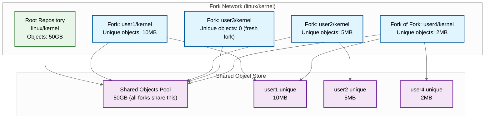
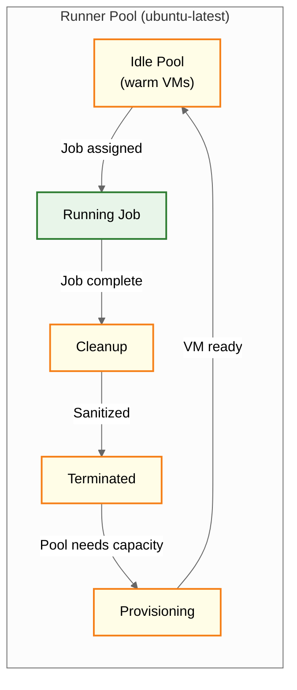
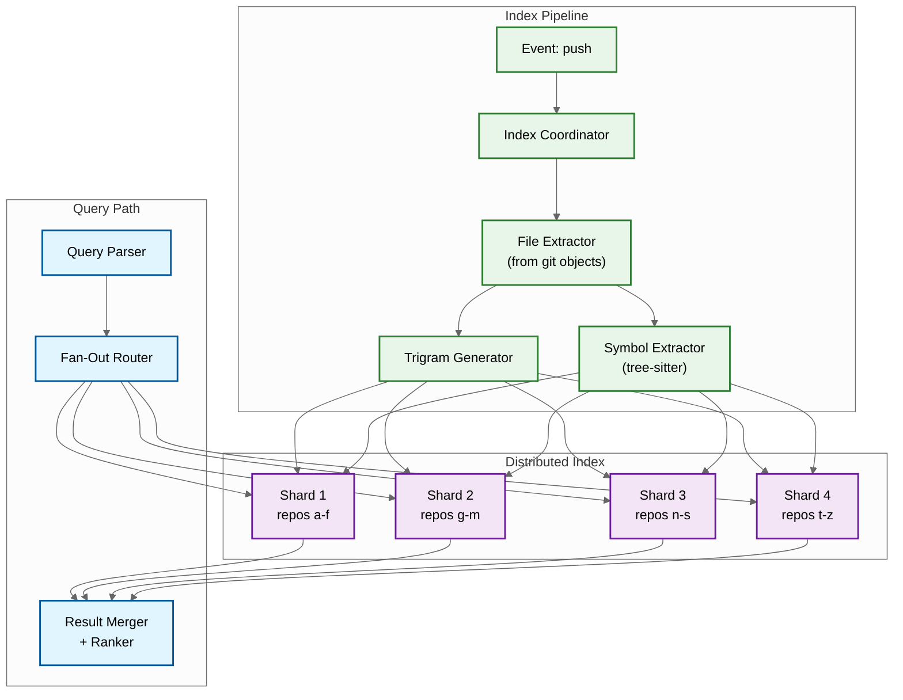

# Deep Dive & Bottlenecks

## 1. Git Pack File Format and Delta Compression

### Pack File Anatomy

A pack file is a single binary file containing multiple git objects, optimized for network transfer and storage efficiency. The format uses delta compression: instead of storing every version of a file fully, it stores one base object and subsequent versions as deltas (instructions for transforming the base into the target).

```
Pack File Structure
┌────────────────────────────────────┐
│ Header                              │
│   "PACK" signature (4 bytes)        │
│   Version: 2 (4 bytes)             │
│   Object count (4 bytes)           │
├────────────────────────────────────┤
│ Object Entry 1 (base object)       │
│   Type: commit/tree/blob/tag       │
│   Size: decompressed size          │
│   Data: zlib-compressed content    │
├────────────────────────────────────┤
│ Object Entry 2 (OFS_DELTA)        │
│   Type: ofs_delta                  │
│   Base offset: -1234 (relative)    │
│   Data: delta instructions         │
├────────────────────────────────────┤
│ Object Entry 3 (REF_DELTA)        │
│   Type: ref_delta                  │
│   Base SHA: abc123... (20 bytes)   │
│   Data: delta instructions         │
├────────────────────────────────────┤
│ ... more entries ...               │
├────────────────────────────────────┤
│ Checksum                           │
│   SHA-1 of entire pack (20 bytes)  │
└────────────────────────────────────┘
```

### Delta Instruction Format

```
Delta Instructions
├── Source size (variable-length integer)
├── Target size (variable-length integer)
└── Instructions:
    ├── COPY(offset, length)    ──> Copy bytes from base object
    └── INSERT(length, data)    ──> Insert new literal bytes
```

A delta for a file where only one function changed might look like:

```
COPY(0, 5000)       // Copy first 5000 bytes from base (unchanged)
INSERT(120, "...")   // Insert 120 bytes of new code (the changed function)
COPY(5080, 3000)    // Copy remaining 3000 bytes from base (unchanged)
```

### Delta Chain Depth

Pack files can have chained deltas: object A is a delta of B, which is a delta of C, which is a base object. Reconstructing A requires applying the entire chain.

| Chain Depth | Read Latency Impact | Trade-off |
|-------------|-------------------|-----------|
| 1 (base only) | Fastest reads | Largest pack file |
| 5-10 (default) | Moderate | Good balance |
| 50+ (pathological) | Very slow reads | Maximum compression |

Git limits delta chain depth to 50 by default. During garbage collection, chains deeper than the limit are broken by materializing intermediate objects as bases.

### Multi-Pack Index

For repositories with many pack files, a multi-pack index provides a unified lookup across all packs:

```
Multi-Pack Index
├── Object SHA → (pack_id, offset)
├── Sorted by SHA for binary search
├── Covers all pack files in the repository
└── Rebuilt during garbage collection (repack)
```

---

## 2. Large Repository Challenges (Monorepos)

### The Monorepo Problem

Some organizations store their entire codebase in a single repository---millions of files, millions of commits, hundreds of gigabytes. Standard Git operations become infeasible:

| Operation | Small Repo (1K files) | Monorepo (1M files) | Problem |
|-----------|----------------------|---------------------|---------|
| Clone | 5 seconds | 30+ minutes | Transfer entire history |
| Checkout | Instant | 5+ minutes | Write 1M files to disk |
| Status | 50ms | 30+ seconds | Stat 1M files |
| Log | 100ms | 10+ seconds | Walk massive commit graph |

### Mitigation Strategies

#### Shallow Clones

```
PSEUDOCODE: Shallow Clone

FUNCTION shallow_clone(repository, depth):
    // Only fetch the last N commits (e.g., depth=1 for CI)
    head_commit = resolve_ref("HEAD")
    commits = walk_commits(head_commit, max_depth=depth)

    // Fetch objects reachable from these commits only
    objects = collect_reachable_objects(commits)

    // Create a "shallow" boundary file
    shallow_commits = commits_at_depth(depth)
    write_shallow_file(shallow_commits)   // These commits have no parents in this clone

    // Transfer only these objects
    pack = create_pack(objects)
    RETURN pack
```

- Reduces clone from 30 minutes to seconds for CI jobs
- Trade-off: `git log`, `git blame` stop at the shallow boundary

#### Partial Clones (Blobless/Treeless)

```
PSEUDOCODE: Partial Clone with Lazy Blob Fetch

FUNCTION partial_clone(repository, filter):
    // filter = "blob:none" → fetch commits and trees, skip blobs
    // filter = "tree:0"    → fetch commits only, skip trees and blobs

    objects = collect_objects(repository.HEAD)

    IF filter == "blob:none":
        objects = objects.exclude(type=BLOB)
    ELSE IF filter == "tree:0":
        objects = objects.exclude(type=BLOB).exclude(type=TREE)

    pack = create_pack(objects)
    RETURN pack

// When the client needs a blob it doesn't have:
FUNCTION lazy_fetch_blob(object_sha):
    // Client sends a fetch request for the specific object
    request = "want " + object_sha
    response = server.fetch(request)
    store_object(response)
```

- Dramatically reduces initial clone size
- Blobs are fetched on demand when `git checkout` or `git diff` needs them
- Trade-off: requires server availability for blob access; offline work limited

#### Sparse Checkout

```
PSEUDOCODE: Sparse Checkout

FUNCTION sparse_checkout(patterns):
    // Only materialize files matching patterns on disk
    // e.g., patterns = ["/src/my-service/**", "/shared/**"]

    FOR file IN working_tree_files():
        IF matches_any_pattern(file.path, patterns):
            write_file_to_disk(file)
        ELSE:
            skip_file(file)     // Don't write to disk
            mark_skip_worktree(file)  // Git ignores for status

    // Result: Working directory has only ~1000 files instead of 1M
```

### LFS (Large File Storage)

```
Git LFS Protocol Flow

1. Developer adds large file:
   git lfs track "*.psd"
   git add design.psd

2. Git stores a pointer file instead of the actual content:
   Pointer file content:
   version https://git-lfs.github.com/spec/v1
   oid sha256:abc123...
   size 52428800

3. On push, LFS client uploads the actual file:
   POST /objects/batch
   {"operation":"upload", "objects":[{"oid":"abc123","size":52428800}]}

   Server responds with upload URLs:
   {"objects":[{"oid":"abc123","actions":{"upload":{"href":"https://..."}}}]}

   Client uploads via PUT to the presigned URL

4. On clone/checkout, LFS client downloads:
   POST /objects/batch
   {"operation":"download", "objects":[{"oid":"abc123","size":52428800}]}

   Client downloads from the returned URL
```

---

## 3. Fork Graph: Shared Object Store and COW Semantics

### Fork Network Architecture



### Git Alternates Mechanism

```
Fork's objects/info/alternates file:
/data/repositories/linux/kernel.git/objects

Object Lookup Order:
1. Check fork's own objects/ directory
2. If not found, check alternates (parent's objects/)
3. If multi-level fork, chain alternates up to root
```

### Challenges

| Challenge | Description | Solution |
|-----------|-------------|----------|
| **Garbage collection** | Cannot GC objects in root that forks still reference | Reference counting across fork network; GC only unreferenced objects |
| **Repository deletion** | Deleting a fork is simple; deleting the root is complex | Promote largest fork to new root; reparent alternates |
| **Access control** | Fork can access parent's objects, even for private repos | Access checks at ref level, not object level; objects are content-addressed and don't leak info without refs |
| **Performance** | Popular repos (50K+ forks) create hot storage nodes | Replicate root repo objects across multiple storage servers |
| **Cross-fork PRs** | PRs between forks need objects from both repos | Both repos share objects already via alternates |

---

## 4. Pull Request Merge Conflict Detection

### Mergeability Check Pipeline

```
PSEUDOCODE: PR Mergeability Pipeline

FUNCTION check_mergeability(pr):
    base_sha = resolve_ref(pr.base_ref)
    head_sha = resolve_ref(pr.head_ref)

    // Step 1: Quick check --- has anything changed since last check?
    IF pr.cached_base_sha == base_sha AND pr.cached_head_sha == head_sha:
        RETURN pr.cached_mergeable_state

    // Step 2: Find merge base
    merge_base = find_merge_base(base_sha, head_sha)

    // Step 3: Attempt trial merge (does NOT update any refs)
    result = trial_merge(merge_base, base_sha, head_sha)

    // Step 4: Cache result
    pr.cached_mergeable_state = result.state
    pr.cached_base_sha = base_sha
    pr.cached_head_sha = head_sha

    RETURN result

FUNCTION trial_merge(merge_base, base, head):
    // Perform merge in a temporary area (no side effects)
    temp_index = create_temp_index()

    FOR path IN all_changed_paths(merge_base, base, head):
        base_content = get_blob(merge_base, path)
        ours_content = get_blob(base, path)
        theirs_content = get_blob(head, path)

        IF has_conflict(base_content, ours_content, theirs_content):
            RETURN MergeState(
                state="conflicting",
                conflicting_files=collect_conflicting_files()
            )

    RETURN MergeState(state="mergeable")
```

### Invalidation

PR mergeability is invalidated whenever:
- The base branch receives new commits (someone else merges a PR)
- The head branch receives new commits (developer pushes updates)
- Branch protection rules change

This invalidation can cascade: merging PR #1 into `main` may invalidate the mergeability of every other open PR targeting `main`. For repositories with hundreds of open PRs, this creates a thundering herd of mergeability recalculations.

**Mitigation**: Recalculate lazily (on next PR page view) rather than eagerly (on every push to base). Use a priority queue to process high-priority PRs (recently viewed, auto-merge enabled) first.

---

## 5. Actions: Ephemeral Runner Lifecycle

### Runner Lifecycle



### Job Execution Detail

```
PSEUDOCODE: Job Execution on Ephemeral Runner

FUNCTION execute_job(job_spec, runner):
    // Phase 1: Environment Setup
    runner.create_workspace("/home/runner/work")
    runner.configure_environment(job_spec.env_vars)

    // Phase 2: Repository Checkout
    IF job_spec.needs_checkout:
        shallow_clone(job_spec.repository, depth=1, ref=job_spec.sha)
        // Optionally fetch PR merge ref for testing merged code
        IF job_spec.is_pull_request:
            fetch_merge_ref(job_spec.pr_number)

    // Phase 3: Cache Restoration
    FOR cache_key IN job_spec.cache_keys:
        cached_archive = lookup_cache(cache_key)
        IF cached_archive:
            extract(cached_archive, cache_key.path)
            LOG("Cache hit: " + cache_key.key)
            BREAK  // Use first matching cache
        // Try restore keys (prefix matching)
        FOR restore_key IN cache_key.restore_keys:
            cached_archive = lookup_cache_prefix(restore_key)
            IF cached_archive:
                extract(cached_archive, cache_key.path)
                LOG("Partial cache hit: " + restore_key)
                BREAK

    // Phase 4: Step Execution
    FOR step IN job_spec.steps:
        IF step.type == "action":
            // Download and execute Action
            action = download_action(step.uses)  // e.g., "actions/setup-node@v4"
            result = action.run(step.with_params)
        ELSE IF step.type == "run":
            // Execute shell command
            result = shell_execute(step.run, shell=step.shell)

        stream_logs(result.stdout, result.stderr)
        report_step_status(step, result)

        IF result.exit_code != 0 AND NOT step.continue_on_error:
            RETURN JobResult(conclusion="failure", failed_step=step)

    // Phase 5: Post-Job (cache save, artifact upload)
    FOR cache_key IN job_spec.cache_keys:
        IF cache_was_restored AND NOT cache_content_changed:
            SKIP  // No need to re-save identical cache
        save_cache(cache_key, cache_key.path)

    RETURN JobResult(conclusion="success")
```

### Artifact Storage and Lifecycle

| Artifact Type | Retention | Storage Tier | Access Pattern |
|--------------|-----------|-------------|----------------|
| Build artifacts | 90 days (default) | Object storage | Download during/after workflow |
| Log files | 90 days | Object storage (compressed) | Read on demand |
| Dependency cache | 7 days (unused) | Object storage | Restore at job start |
| Docker layer cache | Scope-based | Object storage | Layer-level dedup |

### Bottleneck: Job Queue Depth

During peak hours, the hosted runner pool may not have enough capacity for all queued jobs. Queue depth is the key bottleneck metric.

| Metric | Healthy | Warning | Critical |
|--------|---------|---------|----------|
| Queue depth (p50) | < 10 jobs | 10-100 jobs | 100+ jobs |
| Time in queue (p50) | < 30s | 30s-5min | > 5min |
| Runner utilization | 60-80% | 80-95% | > 95% |

**Mitigation**:
- Pre-warm runner pools based on historical patterns (Monday morning spike)
- Prioritize by plan tier (enterprise > team > free)
- Autoscale runner pools with 2-minute provisioning lag
- Rate limit workflow triggers for repos generating excessive runs

---

## 6. Code Search at Scale

### Trigram Index Architecture



### Index Structure per Shard

```
Shard Data Structure
├── Trigram Posting Lists
│   ├── "han" → [file_id_1:offset_5, file_id_7:offset_200, ...]
│   ├── "and" → [file_id_1:offset_6, file_id_3:offset_100, ...]
│   ├── "ndl" → [file_id_1:offset_7, file_id_5:offset_50, ...]
│   └── ... (~200K unique trigrams per shard)
│
├── File Metadata
│   ├── file_id_1: {repo_id, path, language, size, sha}
│   ├── file_id_2: {repo_id, path, language, size, sha}
│   └── ...
│
├── Symbol Table (from tree-sitter parsing)
│   ├── "handleRequest" → [file_id_1:line_42, file_id_3:line_15]
│   ├── "UserService"   → [file_id_2:line_5]
│   └── ...
│
└── Repository Metadata
    ├── repo_id_1: {stars, updated_at, language_stats}
    └── ...
```

### Incremental Index Updates

```
PSEUDOCODE: Incremental Index Update

FUNCTION on_push_event(repository_id, old_sha, new_sha):
    // Only re-index changed files (not the entire repo)
    changed_files = git_diff_tree(old_sha, new_sha)

    FOR file IN changed_files:
        IF file.status == "deleted":
            remove_from_index(repository_id, file.path)
        ELSE IF file.status IN ["added", "modified"]:
            // Remove old trigrams for this file
            remove_from_index(repository_id, file.path)
            // Add new trigrams
            content = read_blob(file.new_sha)
            trigrams = extract_trigrams(content)
            symbols = extract_symbols(content, file.language)
            add_to_index(repository_id, file.path, file.new_sha,
                        trigrams, symbols)

    // Update repo metadata (last indexed commit)
    update_repo_index_cursor(repository_id, new_sha)
```

### Search Ranking Signals

| Signal | Weight | Description |
|--------|--------|-------------|
| Exact match | High | Query matches a complete identifier |
| Symbol match | High | Query matches a function/class/method name |
| File path relevance | Medium | Shorter paths, meaningful names rank higher |
| Repository stars | Medium | Popular repos rank higher |
| Last updated | Medium | Recently active repos rank higher |
| Language match | Medium | If language filter matches file language |
| File size | Low (inverse) | Very large files rank lower |
| Match density | Low | Files with more matches rank higher |

---

## 7. Race Conditions and Concurrency

### Concurrent Push (Same Branch)

Two developers push to the same branch simultaneously:

```
Developer A: git push origin main
  old_ref = abc123, new_ref = def456

Developer B: git push origin main (slightly later)
  old_ref = abc123, new_ref = 789xyz

Server processing:
1. A's push arrives: CAS(main, abc123, def456) → SUCCESS
2. B's push arrives: CAS(main, abc123, 789xyz) → FAIL (ref is now def456)
3. B receives: "non-fast-forward, fetch first"
```

The compare-and-swap (CAS) on the ref ensures serializable updates. This is the fundamental concurrency control mechanism for Git.

### Force Push Protection

```
PSEUDOCODE: Branch Protection Check

FUNCTION receive_push(ref, old_sha, new_sha, user):
    // Check 1: Is this a protected branch?
    protection = get_branch_protection(ref)
    IF protection IS null:
        ALLOW push

    // Check 2: Is this a force push (non-fast-forward)?
    IF NOT is_ancestor(old_sha, new_sha):
        IF protection.allow_force_push == false:
            REJECT "Force push to protected branch is not allowed"
        IF protection.allow_force_push_users:
            IF user NOT IN protection.allow_force_push_users:
                REJECT "You are not authorized to force push"

    // Check 3: Does this branch require PRs?
    IF protection.require_pull_request:
        REJECT "Direct push to protected branch not allowed; create a PR"

    // Check 4: Is linear history required?
    IF protection.require_linear_history:
        IF is_merge_commit(new_sha):
            REJECT "Merge commits not allowed on this branch"

    ALLOW push
```

### Webhook Delivery Reliability

Webhooks must be delivered at-least-once, but endpoints may be slow or down.

```
PSEUDOCODE: Webhook Delivery with Retry

FUNCTION deliver_webhook(event, endpoints):
    FOR endpoint IN endpoints:
        delivery = create_delivery_record(event, endpoint)
        enqueue_delivery(delivery, delay=0)

FUNCTION process_delivery(delivery):
    response = http_post(
        url=delivery.endpoint.url,
        headers={
            "X-Hub-Signature-256": hmac_sha256(delivery.payload, secret),
            "X-GitHub-Event": delivery.event_type,
            "X-GitHub-Delivery": delivery.id
        },
        body=delivery.payload,
        timeout=10_seconds
    )

    IF response.status_code IN [200..299]:
        delivery.status = "delivered"
        RETURN

    delivery.attempt += 1
    IF delivery.attempt >= MAX_RETRIES (10):
        delivery.status = "failed"
        IF consecutive_failures(delivery.endpoint) > 100:
            disable_webhook(delivery.endpoint)  // Auto-disable broken webhooks
        RETURN

    // Exponential backoff: 1m, 2m, 4m, 8m, ... up to 1h
    delay = min(60 * 2^(delivery.attempt - 1), 3600) seconds
    enqueue_delivery(delivery, delay=delay)
```

---

## 8. Hot Repository Problem

Popular open-source repositories (Linux kernel, popular frameworks) receive disproportionate traffic:

| Repository Tier | Count | % of Traffic |
|----------------|-------|-------------|
| Top 100 repos | 100 | ~5% of all clone traffic |
| Top 10,000 repos | 10K | ~30% of all clone traffic |
| All other repos | 500M+ | ~65% of all clone traffic |

### Mitigation Strategies

| Strategy | Description | Trade-off |
|----------|-------------|-----------|
| **CDN caching for clone** | Cache pack files at CDN edge for popular repos | Staleness (minutes); CDN cost |
| **Read replicas** | Multiple copies of hot repos across storage servers | Storage cost; replication lag |
| **Clone bundling** | Pre-compute pack files for common clone requests | Storage cost; update frequency |
| **Smart pack negotiation** | Minimize data transfer by computing precise delta | CPU cost on git server |
| **Rate limiting per repo** | Prevent abuse of popular repos by bots | May affect legitimate users |
| **Geographic routing** | Route to nearest replica of hot repos | Complexity; consistency |
