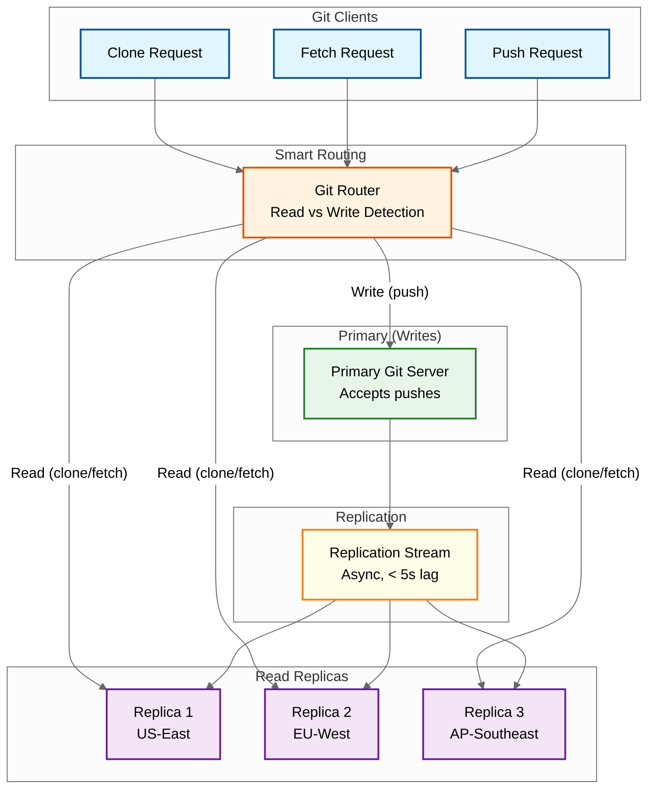

# Scalability & Reliability

## 1. Git Server Sharding

### Sharding Strategy

Git repositories require filesystem locality---all objects for a repository must be accessible from the same server (or storage volume). This drives a shard-per-repository model rather than shard-per-user.

```
Repository Routing

hash(owner_id, repo_name) → shard_id → storage_server

Shard Assignment Table:
┌──────────┬─────────────────┬───────────────┬────────────┐
│ Shard ID │ Storage Server   │ Repo Count    │ Disk Usage │
├──────────┼─────────────────┼───────────────┼────────────┤
│ 0-255    │ git-storage-001  │ ~2M repos     │ 40TB       │
│ 256-511  │ git-storage-002  │ ~2M repos     │ 38TB       │
│ 512-767  │ git-storage-003  │ ~2M repos     │ 42TB       │
│ ...      │ ...              │ ...           │ ...        │
│ 64768+   │ git-storage-256  │ ~2M repos     │ 39TB       │
└──────────┴─────────────────┴───────────────┴────────────┘
```

### Shard Balancing

Over time, shards become imbalanced as some repositories grow much larger than others. Rebalancing involves:

```
PSEUDOCODE: Shard Rebalancing

FUNCTION rebalance_shard(source_shard, target_shard, repository):
    // Step 1: Lock repository for writes (brief)
    acquire_write_lock(repository)

    // Step 2: Copy repository data to target shard
    rsync(source_shard.path(repository), target_shard.path(repository))

    // Step 3: Update routing table
    update_shard_assignment(repository.id, target_shard.id)

    // Step 4: Verify copy integrity
    verify_objects(target_shard, repository)

    // Step 5: Release write lock
    release_write_lock(repository)

    // Step 6: Schedule deletion of source copy (after grace period)
    schedule_deletion(source_shard, repository, delay=24_hours)
```

The write lock duration is typically under 1 second---just enough to ensure the final rsync catches any last-second writes and the routing table is updated atomically.

### Fork Network Locality

All repositories in a fork network should reside on the same storage server (since they share objects via alternates). This is enforced at fork creation time and constrains shard balancing.

```
RULE: fork.storage_shard_id == fork_root.storage_shard_id

If root repository is rebalanced:
  → All forks must move together
  → For large fork networks (50K+ forks), this is a significant operation
  → Schedule during low-traffic windows
```

---

## 2. Read Replicas for Fetch/Clone Traffic

### Read Replica Architecture



### Replication Protocol

```
PSEUDOCODE: Git Repository Replication

FUNCTION replicate_push(primary, replicas, pushed_refs):
    // Triggered after every successful push to primary

    FOR ref IN pushed_refs:
        new_sha = resolve_ref(primary, ref)

        // Fetch new objects from primary
        pack = primary.pack_objects(new_sha, exclude=replica.existing_objects)

        FOR replica IN replicas:
            // Send pack to replica (async, parallel)
            async replica.receive_pack(pack)
            async replica.update_ref(ref, new_sha)

    // Verify replication
    FOR replica IN replicas:
        lag = time_since_last_sync(replica)
        IF lag > REPLICATION_LAG_THRESHOLD (30 seconds):
            ALERT("Replica lag exceeded: " + replica.id)
```

### Read-After-Write Consistency

After a push, the developer often immediately refreshes the web UI or starts a CI job that fetches. They expect to see their push immediately. Solutions:

| Approach | Mechanism | Trade-off |
|----------|-----------|-----------|
| **Sticky routing** | Route same user to same replica for 30s after push | Reduces replica utilization; user-specific state |
| **Read-from-primary** | Route reads to primary for 10s after push | Adds load to primary |
| **Version tag** | Push returns a version; reads include version in request | Client complexity; requires protocol change |
| **Wait-for-replication** | Push blocks until at least one replica confirms | Increases push latency by ~100ms |

---

## 3. Actions Runner Pools and Autoscaling

### Runner Pool Architecture

```
Runner Pool Configuration
├── Hosted Runners
│   ├── ubuntu-latest (Linux, x86_64)
│   │   ├── Pool size: 50,000 concurrent
│   │   ├── VM spec: 2 vCPU, 7GB RAM, 14GB SSD
│   │   ├── Warm pool: 5,000 pre-provisioned VMs
│   │   └── Max scale: 100,000
│   ├── ubuntu-latest-large (Linux, x86_64)
│   │   ├── Pool size: 10,000 concurrent
│   │   └── VM spec: 4 vCPU, 16GB RAM, 150GB SSD
│   ├── macos-latest (macOS, arm64)
│   │   ├── Pool size: 3,000 concurrent
│   │   └── Bare metal hosts with VM isolation
│   └── windows-latest (Windows, x86_64)
│       ├── Pool size: 5,000 concurrent
│       └── VM spec: 2 vCPU, 7GB RAM, 14GB SSD
│
└── Self-Hosted Runners
    ├── Registered per org/repo
    ├── Customer-managed infrastructure
    ├── Labels for routing (e.g., "gpu", "arm64", "self-hosted")
    └── Runner groups for access control
```

### Autoscaling Algorithm

```
PSEUDOCODE: Runner Pool Autoscaler

FUNCTION autoscale_runner_pool(pool):
    current_capacity = pool.running_runners
    queued_jobs = pool.queued_jobs_count
    running_jobs = pool.running_jobs_count
    utilization = running_jobs / current_capacity

    // Target: keep utilization between 60-80%
    // React faster to scale up than scale down (asymmetric)

    IF utilization > 0.85 OR queued_jobs > current_capacity * 0.2:
        // SCALE UP: aggressive
        desired = max(
            running_jobs + queued_jobs,           // Meet current demand
            current_capacity * 1.3,               // 30% headroom
            predict_demand(pool, next_15_minutes)  // Predictive
        )
        desired = min(desired, pool.max_capacity)
        scale_up(pool, desired - current_capacity)

    ELSE IF utilization < 0.40 AND queued_jobs == 0:
        // SCALE DOWN: conservative (wait 10 minutes of low utilization)
        IF pool.low_utilization_duration > 10_minutes:
            desired = max(
                running_jobs * 1.5,    // Keep 50% headroom
                pool.min_capacity       // Never go below minimum
            )
            scale_down(pool, current_capacity - desired)

FUNCTION predict_demand(pool, horizon):
    // Use historical patterns: day-of-week, hour-of-day
    historical_avg = get_historical_demand(pool,
        day_of_week=today.day_of_week,
        hour=now.hour,
        lookback_weeks=4)
    // Weight recent trend higher than historical
    recent_trend = linear_extrapolation(pool.demand_last_30_minutes, horizon)
    RETURN 0.6 * recent_trend + 0.4 * historical_avg
```

---

## 4. Geo-Replication

### Multi-Region Architecture

```
Region Deployment
├── US-East (Primary)
│   ├── All services (full deployment)
│   ├── Primary database (writes)
│   ├── Primary git storage
│   └── Runner pools (largest)
│
├── US-West
│   ├── API servers (read-heavy)
│   ├── Database read replicas
│   ├── Git read replicas
│   └── Runner pools
│
├── EU-West
│   ├── API servers
│   ├── Database read replicas
│   ├── Git read replicas
│   ├── Runner pools
│   └── EU data residency for enterprise
│
└── AP-Southeast
    ├── API servers
    ├── Database read replicas
    ├── Git read replicas
    └── Runner pools
```

### CDN Strategy

| Content Type | CDN Caching | TTL | Invalidation |
|-------------|-------------|-----|-------------|
| Release assets (binaries) | Yes | 1 year (immutable) | By URL hash |
| LFS objects | Yes | 1 year (content-addressed) | Never (immutable) |
| Clone pack responses (popular repos) | Yes | 5 minutes | On push event |
| Static web assets (JS, CSS) | Yes | 1 year (hashed filenames) | Deploy |
| API responses | No (personalized) | N/A | N/A |
| Avatar images | Yes | 1 hour | User upload |

---

## 5. Disaster Recovery

### Recovery Objectives

| Data Type | RPO (Data Loss Tolerance) | RTO (Downtime Tolerance) |
|-----------|--------------------------|--------------------------|
| Git objects | 0 (no data loss) | < 1 hour |
| Git refs (branches, tags) | 0 | < 30 minutes |
| Metadata (PRs, issues, users) | < 1 minute | < 1 hour |
| Search index | < 1 hour (rebuildable) | < 4 hours |
| Actions artifacts | < 1 hour | < 4 hours |
| Audit logs | 0 | < 2 hours |

### Backup Strategy

```
Git Data Backup
├── Continuous replication to secondary region
│   ├── Synchronous replication for refs (RPO=0)
│   └── Asynchronous replication for objects (RPO < 5s)
├── Daily snapshots to object storage
│   └── Incremental backups using pack files
├── Weekly full backup verification
│   └── Clone from backup and verify checksums
└── Quarterly disaster recovery drills

Metadata Backup
├── Continuous WAL shipping to secondary region (< 1s lag)
├── Point-in-time recovery (PITR) with 30-day retention
├── Daily logical backups to object storage
└── Cross-region backup replication
```

### Failover Process

```
PSEUDOCODE: Regional Failover

FUNCTION initiate_failover(failed_region, target_region):
    // Step 1: Verify failure (avoid false positive failover)
    IF NOT confirmed_failure(failed_region, required_confirmations=3):
        RETURN "Not confirmed"

    // Step 2: Pause writes to prevent split-brain
    pause_all_writes()

    // Step 3: Promote secondary databases
    target_region.database.promote_to_primary()

    // Step 4: Verify git replicas are up to date
    FOR shard IN git_shards:
        lag = replication_lag(failed_region.shard, target_region.shard)
        IF lag > 0:
            LOG("Warning: shard " + shard.id + " has " + lag + "s lag")

    // Step 5: Update DNS to point to target region
    update_dns(target_region.endpoints)

    // Step 6: Resume writes
    resume_writes()

    // Step 7: Monitor and verify
    verify_all_services(target_region)
    notify_engineering("Failover complete to " + target_region)
```

---

## 6. Circuit Breakers and Rate Limiting

### Circuit Breaker for Webhook Delivery

```
PSEUDOCODE: Circuit Breaker

STRUCTURE CircuitBreaker:
    state: CLOSED | OPEN | HALF_OPEN
    failure_count: int
    failure_threshold: 10
    success_count: int     // When in HALF_OPEN
    success_threshold: 3
    open_duration: 5_minutes
    last_failure_time: timestamp

FUNCTION call_with_breaker(endpoint, payload):
    breaker = get_breaker(endpoint.id)

    IF breaker.state == OPEN:
        IF time_since(breaker.last_failure_time) > breaker.open_duration:
            breaker.state = HALF_OPEN
        ELSE:
            RETURN SkippedResult("Circuit open, will retry later")

    result = attempt_delivery(endpoint, payload)

    IF result.success:
        IF breaker.state == HALF_OPEN:
            breaker.success_count += 1
            IF breaker.success_count >= breaker.success_threshold:
                breaker.state = CLOSED
                breaker.failure_count = 0
        ELSE:
            breaker.failure_count = 0
    ELSE:
        breaker.failure_count += 1
        IF breaker.failure_count >= breaker.failure_threshold:
            breaker.state = OPEN
            breaker.last_failure_time = now()
            LOG("Circuit opened for endpoint: " + endpoint.url)

    RETURN result
```

### Rate Limiting

| Resource | Limit | Window | Strategy |
|----------|-------|--------|----------|
| REST API (authenticated) | 5,000 req/hr | Sliding window | Token bucket |
| REST API (unauthenticated) | 60 req/hr | Sliding window | IP-based |
| GraphQL API | 5,000 points/hr | Sliding window | Query cost-based |
| Search API | 30 req/min | Sliding window | Token bucket |
| Git clone/fetch | 100 req/hr per repo | Sliding window | IP + repo |
| Git push | 100 pushes/hr per repo | Sliding window | User + repo |
| Actions workflow triggers | 1,000/hr per repo | Sliding window | Event-based |
| Webhook delivery | 10,000/hr per endpoint | Sliding window | Endpoint-based |

### Rate Limit Implementation

```
PSEUDOCODE: Token Bucket Rate Limiter

FUNCTION check_rate_limit(key, limit, window_seconds):
    bucket = kv_store.get("ratelimit:" + key)

    IF bucket IS null:
        bucket = {tokens: limit - 1, last_refill: now()}
        kv_store.set("ratelimit:" + key, bucket, ttl=window_seconds)
        RETURN Allowed(remaining=limit - 1, reset=now() + window_seconds)

    // Refill tokens based on elapsed time
    elapsed = now() - bucket.last_refill
    refill_amount = (elapsed / window_seconds) * limit
    bucket.tokens = min(bucket.tokens + refill_amount, limit)
    bucket.last_refill = now()

    IF bucket.tokens >= 1:
        bucket.tokens -= 1
        kv_store.set("ratelimit:" + key, bucket, ttl=window_seconds)
        RETURN Allowed(remaining=floor(bucket.tokens),
                       reset=now() + window_seconds)
    ELSE:
        RETURN RateLimited(retry_after=time_until_next_token(bucket))
```

---

## 7. Background Job Queues

### Job Categories

| Queue | Priority | Concurrency | Examples |
|-------|----------|-------------|---------|
| **Critical** | Highest | 1,000 workers | Ref updates, push processing, merge operations |
| **High** | High | 5,000 workers | Webhook delivery, notification sending, CI triggers |
| **Default** | Normal | 10,000 workers | Search indexing, statistics computation, cache warming |
| **Low** | Low | 2,000 workers | Repository GC, pack file optimization, stale branch cleanup |
| **Scheduled** | Varies | 500 workers | Cron-based Actions, dependency alerts, report generation |

### Git Garbage Collection

```
PSEUDOCODE: Repository Garbage Collection

FUNCTION gc_repository(repository):
    // Run during low-traffic hours for the repository

    // Step 1: Identify unreachable objects
    reachable = compute_reachable_objects(repository.all_refs())
    all_objects = list_all_objects(repository)
    unreachable = all_objects - reachable

    // Step 2: Grace period check (don't GC recently created objects)
    prunable = []
    FOR obj IN unreachable:
        IF obj.created_at < now() - 14_days:  // 2-week grace period
            prunable.append(obj)

    // Step 3: Check fork network (don't delete objects forks reference)
    FOR fork IN repository.fork_network():
        fork_reachable = compute_reachable_objects(fork.all_refs())
        prunable = prunable - fork_reachable

    // Step 4: Repack remaining objects
    remaining = all_objects - prunable
    new_pack = create_pack_file(remaining, delta_depth=50)

    // Step 5: Atomically swap (write new pack, delete old loose + old packs)
    install_pack(new_pack)
    delete_objects(prunable)
    delete_old_packs()

    LOG("GC complete: pruned " + len(prunable) + " objects, " +
        "saved " + bytes_saved + " bytes")
```
