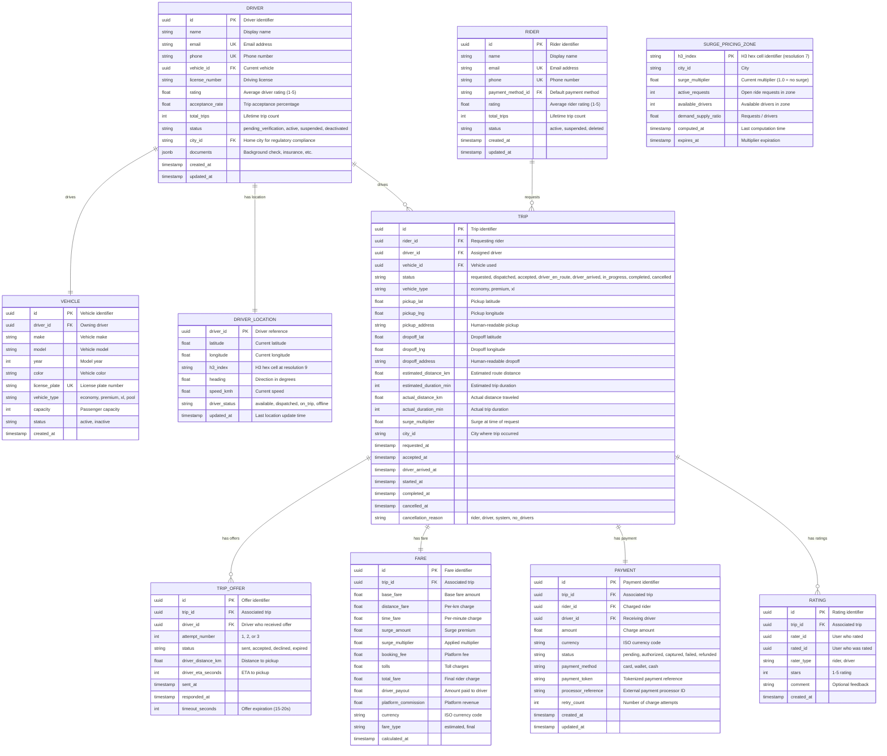
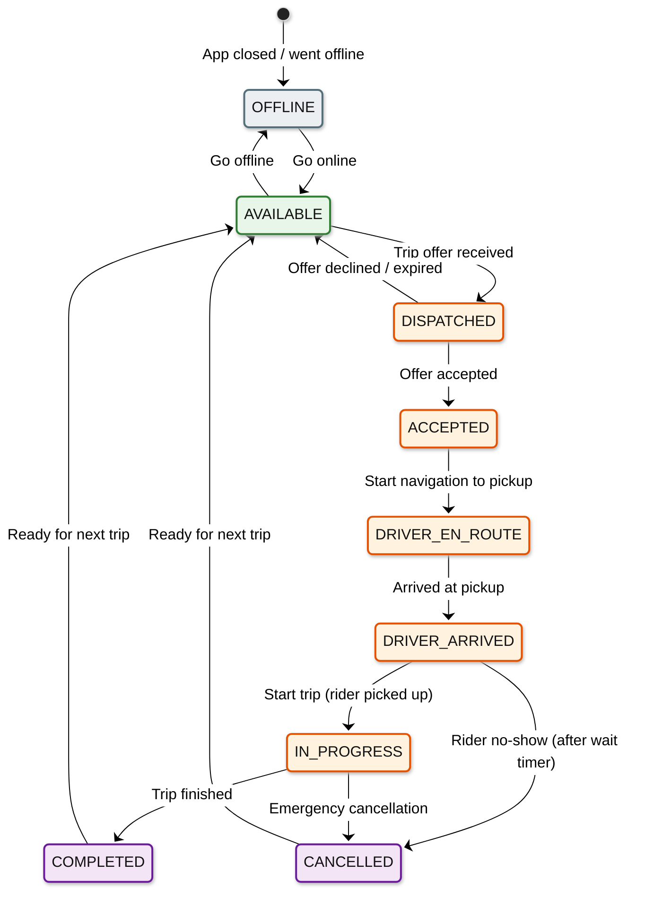

# Low-Level Design

## Data Model

### Core Entity Relationships



---

## Driver State Machine



### State Transition Rules

| From | To | Trigger | Side Effects |
|------|----|---------|-------------|
| OFFLINE | AVAILABLE | Driver taps "Go Online" | Add to geospatial index; start location streaming |
| AVAILABLE | DISPATCHED | Dispatch service sends offer | Lock driver (not available for other offers); start offer timer |
| DISPATCHED | AVAILABLE | Decline / timeout | Remove lock; increment decline counter |
| DISPATCHED | ACCEPTED | Driver accepts | Update trip status; notify rider; track acceptance rate |
| ACCEPTED | DRIVER_EN_ROUTE | Automatic after acceptance | Start ETA countdown; begin driver tracking for rider |
| DRIVER_EN_ROUTE | DRIVER_ARRIVED | Driver marks arrived (or GPS proximity trigger) | Start rider wait timer (5 min) |
| DRIVER_ARRIVED | IN_PROGRESS | Driver starts trip | Begin metered fare tracking; record start odometer |
| IN_PROGRESS | COMPLETED | Driver ends trip | Calculate final fare; initiate payment; prompt ratings |
| Any active state | CANCELLED | Various triggers | Compensating actions based on state (refund, no-show fee, etc.) |

---

## API Design

### Rider APIs

```
POST   /api/v1/trips/estimate
       Body: { pickup: {lat, lng}, dropoff: {lat, lng}, vehicle_type: "economy" }
       Response: { estimated_fare: 18.50, surge_multiplier: 1.2, eta_minutes: 4, currency: "USD" }

POST   /api/v1/trips/request
       Body: { pickup: {lat, lng, address}, dropoff: {lat, lng, address}, vehicle_type: "economy", payment_method_id: "pm_xxx" }
       Response: { trip_id: "trip_xxx", status: "requested", estimated_fare: 18.50 }

GET    /api/v1/trips/{trip_id}
       Response: { trip_id, status, driver: {name, rating, vehicle, location}, eta_minutes, fare, ... }

POST   /api/v1/trips/{trip_id}/cancel
       Body: { reason: "changed_plans" }
       Response: { status: "cancelled", cancellation_fee: 5.00 }

GET    /api/v1/trips/{trip_id}/track
       Response: { driver_location: {lat, lng}, eta_minutes: 3, route_polyline: "encoded..." }

GET    /api/v1/drivers/nearby
       Query: ?lat=37.7749&lng=-122.4194&radius_km=3&vehicle_type=economy
       Response: { drivers: [{lat, lng, eta_minutes, vehicle_type}, ...] }

POST   /api/v1/trips/{trip_id}/rate
       Body: { stars: 5, comment: "Great driver" }
       Response: { status: "rated" }
```

### Driver APIs

```
POST   /api/v1/driver/status
       Body: { status: "available" }  // or "offline"
       Response: { status: "available", active_zone_surge: 1.3 }

POST   /api/v1/trips/{trip_id}/accept
       Response: { trip_id, pickup: {lat, lng, address}, rider: {name, rating} }

POST   /api/v1/trips/{trip_id}/decline
       Response: { status: "declined" }

POST   /api/v1/trips/{trip_id}/arrived
       Response: { status: "driver_arrived", wait_timer_seconds: 300 }

POST   /api/v1/trips/{trip_id}/start
       Response: { status: "in_progress", start_time: "2026-03-08T10:30:00Z" }

POST   /api/v1/trips/{trip_id}/complete
       Response: { status: "completed", fare: { total: 19.20, breakdown: {...} } }

GET    /api/v1/driver/earnings
       Query: ?period=today  // or "this_week", "this_month"
       Response: { total_earnings: 245.80, trips: 12, online_hours: 6.5, ... }
```

### Location APIs (High-Throughput)

```
WebSocket: ws://location.service/v1/driver/{driver_id}/location
       Client sends: { lat: 37.7749, lng: -122.4194, heading: 270, speed_kmh: 35, timestamp: 1709884200 }
       Server sends: (acknowledgment or trip offer)

WebSocket: ws://location.service/v1/rider/{rider_id}/tracking/{trip_id}
       Server sends: { driver_location: {lat, lng}, eta_seconds: 180, route_updated: false }
       (Pushed every 2-4 seconds during active trip)
```

### Rate Limiting

| Endpoint Category | Limit | Window | Strategy |
|------------------|-------|--------|----------|
| Trip operations (request, cancel) | 10 req/min | Sliding window | Per rider |
| Location updates | 1 req/4s | Fixed interval | Per driver |
| Nearby drivers query | 30 req/min | Sliding window | Per rider |
| Fare estimates | 30 req/min | Sliding window | Per rider |
| Driver status changes | 10 req/min | Sliding window | Per driver |
| Earnings/history | 60 req/min | Sliding window | Per user |

---

## Key Algorithms (Pseudocode)

### 1. Geohash-Based Nearest Driver Query

```
PSEUDOCODE: Find Nearest Available Drivers

FUNCTION find_nearest_drivers(rider_location, vehicle_type, radius_km, max_results):
    // Step 1: Encode rider location to H3 hex cell at resolution 9
    rider_h3 = h3_encode(rider_location.lat, rider_location.lng, resolution=9)

    // Step 2: Get the ring of neighboring cells at increasing distances
    // Resolution 9 cell edge length ~174m; k=1 ring covers ~500m
    max_k = ceil(radius_km / 0.5)  // Number of hex rings to search
    candidates = []

    FOR k IN 0..max_k:
        ring_cells = h3_k_ring(rider_h3, k)
        FOR cell IN ring_cells:
            drivers_in_cell = geo_index.get_drivers(cell)
            FOR driver IN drivers_in_cell:
                IF driver.status == AVAILABLE AND driver.vehicle_type == vehicle_type:
                    distance = haversine(rider_location, driver.location)
                    IF distance <= radius_km:
                        candidates.append({driver_id: driver.id, distance: distance, location: driver.location})

        // Early termination: if we have enough candidates and they're close
        IF len(candidates) >= max_results * 2 AND k >= 2:
            BREAK

    // Step 3: Sort by distance and return top candidates
    candidates.sort(by=distance, ascending=true)
    RETURN candidates[:max_results]


FUNCTION update_driver_location(driver_id, lat, lng, heading, speed, timestamp):
    // Step 1: Compute new H3 cell
    new_h3 = h3_encode(lat, lng, resolution=9)

    // Step 2: Get old location
    old_entry = geo_index.get(driver_id)

    // Step 3: If cell changed, move driver between cells
    IF old_entry IS NULL OR old_entry.h3_index != new_h3:
        IF old_entry IS NOT NULL:
            geo_index.remove_from_cell(old_entry.h3_index, driver_id)
        geo_index.add_to_cell(new_h3, driver_id)

    // Step 4: Update driver's location metadata
    geo_index.set(driver_id, {
        lat: lat,
        lng: lng,
        h3_index: new_h3,
        heading: heading,
        speed_kmh: speed,
        updated_at: timestamp
    })

    // Step 5: Expire stale entries (driver went offline without explicit signal)
    IF timestamp - old_entry.updated_at > STALE_THRESHOLD_SECONDS:
        geo_index.mark_offline(driver_id)
```

### 2. Surge Pricing Calculation

```
PSEUDOCODE: Compute Surge Multiplier for a Zone

FUNCTION compute_surge(h3_zone, city_config):
    // Step 1: Count open requests and available drivers in this zone
    // Use H3 resolution 7 for surge zones (~5.16 km2 area)
    demand = count_open_requests_in_zone(h3_zone, time_window=5_minutes)
    supply = count_available_drivers_in_zone(h3_zone)

    // Step 2: Include adjacent zones (drivers can serve nearby zones)
    adjacent_zones = h3_k_ring(h3_zone, k=1)
    FOR adj_zone IN adjacent_zones:
        supply += count_available_drivers_in_zone(adj_zone) * 0.5  // Weighted: adjacent drivers are less likely

    // Step 3: Compute demand/supply ratio
    IF supply == 0:
        ratio = MAX_SURGE_RATIO
    ELSE:
        ratio = demand / supply

    // Step 4: Map ratio to surge multiplier via lookup table
    // Table is configured per city and tuned by market operations
    multiplier = city_config.surge_lookup_table.interpolate(ratio)

    // Step 5: Apply caps and smoothing
    multiplier = min(multiplier, city_config.max_surge)  // Regulatory cap
    multiplier = max(multiplier, 1.0)                     // No discount below 1.0

    // Step 6: Smooth transitions (prevent spike/drop by >0.5x per interval)
    previous = get_previous_surge(h3_zone)
    IF abs(multiplier - previous) > 0.5:
        multiplier = previous + sign(multiplier - previous) * 0.5

    // Step 7: Store and publish
    store_surge(h3_zone, multiplier, timestamp=now(), expires=now() + 2_minutes)
    publish_event("surge_updated", {zone: h3_zone, multiplier: multiplier})

    RETURN multiplier


SURGE_LOOKUP_TABLE (example):
    ratio <= 0.5  -> multiplier = 1.0  (oversupply)
    ratio = 1.0   -> multiplier = 1.0  (balanced)
    ratio = 1.5   -> multiplier = 1.2
    ratio = 2.0   -> multiplier = 1.5
    ratio = 3.0   -> multiplier = 2.0
    ratio = 4.0   -> multiplier = 2.5
    ratio >= 5.0  -> multiplier = 3.0  (severe undersupply)
```

### 3. Dispatch Offer Flow

```
PSEUDOCODE: Dispatch Trip to Best Available Driver

FUNCTION dispatch_trip(trip_id, rider_location, vehicle_type):
    max_attempts = 3
    offer_timeout_seconds = 15

    FOR attempt IN 1..max_attempts:
        // Step 1: Find candidate drivers (excluding previously offered)
        previously_offered = get_offered_driver_ids(trip_id)
        candidates = find_nearest_drivers(
            rider_location, vehicle_type,
            radius_km = 5 + (attempt - 1) * 2,  // Expand radius on retries
            max_results = 5
        )
        candidates = [c FOR c IN candidates IF c.driver_id NOT IN previously_offered]

        IF candidates IS EMPTY:
            IF attempt == max_attempts:
                update_trip_status(trip_id, "NO_DRIVERS_AVAILABLE")
                notify_rider(trip_id, "No drivers available. Please try again.")
                RETURN null
            CONTINUE  // Try next attempt with wider radius

        // Step 2: Rank candidates by ETA (not just distance)
        FOR candidate IN candidates:
            candidate.eta = compute_driving_eta(candidate.location, rider_location)
        candidates.sort(by=eta, ascending=true)

        best_driver = candidates[0]

        // Step 3: Lock the driver (prevent concurrent dispatch)
        lock_acquired = try_lock_driver(best_driver.driver_id, ttl=offer_timeout_seconds + 5)
        IF NOT lock_acquired:
            CONTINUE  // Driver was grabbed by another dispatch

        // Step 4: Create and send offer
        offer = create_trip_offer(trip_id, best_driver.driver_id, attempt, best_driver.eta)
        update_driver_status(best_driver.driver_id, "DISPATCHED")
        send_offer_notification(best_driver.driver_id, offer)

        // Step 5: Wait for response
        response = wait_for_response(offer.id, timeout=offer_timeout_seconds)

        IF response == "ACCEPTED":
            update_trip_status(trip_id, "ACCEPTED", driver_id=best_driver.driver_id)
            notify_rider(trip_id, "Driver is on the way!", driver_info=best_driver)
            RETURN best_driver

        ELSE:  // DECLINED or TIMEOUT
            update_offer_status(offer.id, response)
            unlock_driver(best_driver.driver_id)
            update_driver_status(best_driver.driver_id, "AVAILABLE")
            // Continue to next attempt

    update_trip_status(trip_id, "NO_DRIVERS_AVAILABLE")
    notify_rider(trip_id, "No drivers available. Please try again.")
    RETURN null
```

### 4. Fare Calculation

```
PSEUDOCODE: Fare Calculation

FUNCTION calculate_fare(trip, fare_type):
    city_rates = get_city_rates(trip.city_id, trip.vehicle_type)

    IF fare_type == "estimated":
        distance_km = trip.estimated_distance_km
        duration_min = trip.estimated_duration_min
    ELSE:  // "final"
        distance_km = trip.actual_distance_km
        duration_min = trip.actual_duration_min

    // Base calculation
    base_fare = city_rates.base_fare
    distance_fare = distance_km * city_rates.per_km_rate
    time_fare = duration_min * city_rates.per_minute_rate

    // Apply minimum fare
    subtotal = max(base_fare + distance_fare + time_fare, city_rates.minimum_fare)

    // Apply surge
    surge_amount = subtotal * (trip.surge_multiplier - 1.0)
    surged_total = subtotal + surge_amount

    // Add fees
    booking_fee = city_rates.booking_fee
    tolls = estimate_tolls(trip.pickup, trip.dropoff) IF fare_type == "estimated" ELSE trip.actual_tolls

    total = surged_total + booking_fee + tolls

    // Driver payout (platform takes commission)
    platform_commission = surged_total * city_rates.commission_rate  // e.g., 25%
    driver_payout = surged_total - platform_commission + tolls

    RETURN Fare(
        base_fare = base_fare,
        distance_fare = distance_fare,
        time_fare = time_fare,
        surge_amount = surge_amount,
        surge_multiplier = trip.surge_multiplier,
        booking_fee = booking_fee,
        tolls = tolls,
        total_fare = round(total, 2),
        driver_payout = round(driver_payout, 2),
        platform_commission = round(platform_commission, 2),
        currency = city_rates.currency,
        fare_type = fare_type
    )
```

---

## Indexing Strategy

| Index | Table | Columns | Purpose |
|-------|-------|---------|---------|
| `idx_trip_rider` | TRIP | `(rider_id, requested_at DESC)` | Rider trip history |
| `idx_trip_driver` | TRIP | `(driver_id, requested_at DESC)` | Driver trip history |
| `idx_trip_status` | TRIP | `(status, city_id)` | Active trip queries |
| `idx_trip_city_date` | TRIP | `(city_id, requested_at)` | City-level analytics |
| `idx_offer_trip` | TRIP_OFFER | `(trip_id, attempt_number)` | Offer history for re-dispatch |
| `idx_offer_driver` | TRIP_OFFER | `(driver_id, sent_at DESC)` | Driver offer history |
| `idx_fare_trip` | FARE | `(trip_id)` UNIQUE | Fare lookup |
| `idx_payment_trip` | PAYMENT | `(trip_id)` | Payment for trip |
| `idx_payment_status` | PAYMENT | `(status, created_at)` | Failed payment retry queue |
| `idx_rating_trip` | RATING | `(trip_id)` | Ratings for trip |
| `idx_rating_rated` | RATING | `(rated_id, created_at DESC)` | User rating history |
| `idx_surge_zone` | SURGE_PRICING_ZONE | `(h3_index)` PK | Surge lookup by zone |
| `idx_driver_city` | DRIVER | `(city_id, status)` | Active drivers per city |

### Partitioning / Sharding

| Data | Shard Key | Strategy |
|------|-----------|----------|
| Trips | `city_id` + `requested_at` | City-based with time partitioning for archival |
| Driver Locations | `city_id` | Per-city in-memory geospatial index |
| Surge Zones | `city_id` | Per-city computation and storage |
| Payments | `rider_id` | User-based sharding for payment history |
| Ratings | `trip_id` | Co-located with trip data |
| Analytics | `event_date` | Time-partitioned for warehouse queries |
