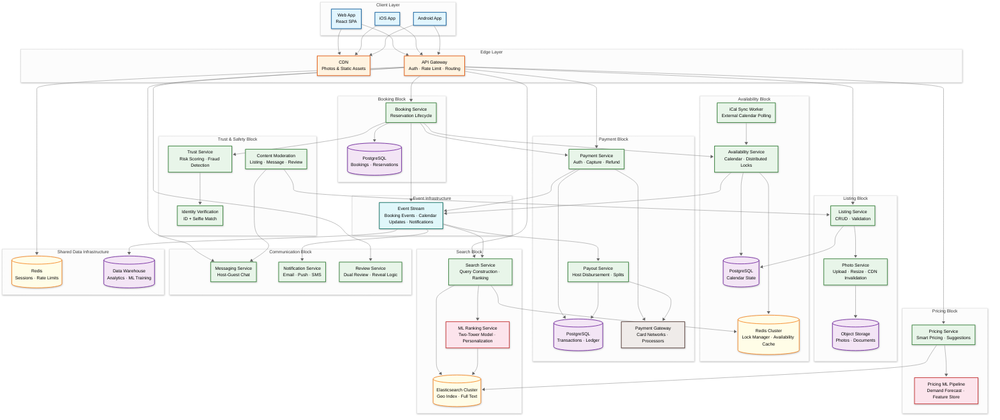
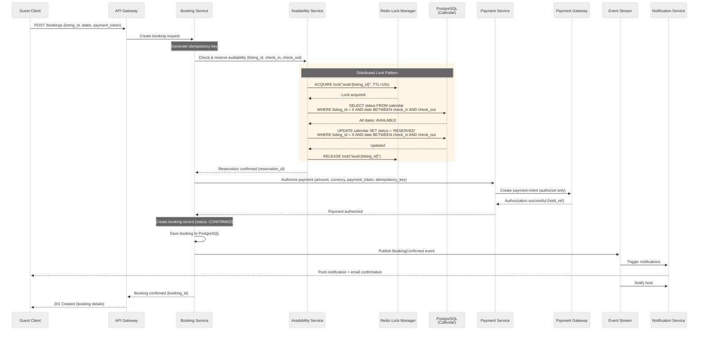

# High-Level Design

## 1. Architecture Overview

Airbnb's architecture follows a service-oriented design organized into **service blocks**---groups of related microservices that address specific business domains (Listing Block, Availability Block, Booking Block, Payment Block). Each block exposes a clean facade while encapsulating internal complexity. An API Gateway routes client requests to the appropriate block, and cross-block communication happens through both synchronous RPC (for latency-sensitive paths like booking) and asynchronous events (for eventual consistency paths like search indexing and notifications).



---

## 2. Service Responsibilities

### 2.1 Search Service
- Constructs Elasticsearch queries from user filters (location, dates, guests, amenities, price)
- Applies geo-distance or geo-bounding-box filter for location-based search
- Coordinates with ML Ranking Service for personalized result ordering
- Fetches availability status from Redis cache to filter unavailable listings
- Supports two response modes: list view (position-ranked) and map view (geo-distributed pins)

### 2.2 Listing Service
- CRUD operations for listing metadata (title, description, amenities, rules, location)
- Photo upload orchestration: validate → resize → store in object storage → invalidate CDN
- Listing validation: completeness checks, content moderation trigger, geocoding
- Publishes listing update events to event stream for search index refresh

### 2.3 Availability Service
- **Core responsibility**: Manage per-listing, per-date calendar state (available/blocked/booked)
- Distributed lock management via Redis for concurrent booking protection
- Calendar bulk operations: block/unblock date ranges, set price overrides
- iCal feed export and import for cross-platform synchronization
- Publishes calendar change events to update search index availability

### 2.4 Booking Service
- Orchestrates the booking lifecycle: request → availability check → payment hold → confirmation
- Manages booking state machine: PENDING → CONFIRMED → ACTIVE → COMPLETED (or CANCELLED)
- Coordinates with Availability Service (lock + reserve dates) and Payment Service (authorize funds)
- Handles Instant Book (auto-confirm) and Request-to-Book (host approval within 24h) flows
- Cancellation processing: determine refund amount based on cancellation policy, trigger refund

### 2.5 Payment Service
- Payment authorization at booking time (hold funds without capturing)
- Payment capture at check-in time (convert hold to charge)
- Refund processing for cancellations (full or partial per policy)
- Idempotency key management to prevent duplicate charges
- Integration with multiple payment processors for global coverage and redundancy

### 2.6 Payout Service
- Host payout calculation: booking total - guest service fee - host service fee
- Split payout distribution: configurable percentage splits between host and co-hosts
- Payout scheduling: trigger 24 hours after guest check-in
- Multi-currency conversion at favorable rates
- Retry logic for failed payouts with exponential backoff

### 2.7 Pricing Service
- Smart Pricing suggestions based on ML demand forecast model
- Feature inputs: seasonality, local events, comparable listing prices, historical booking rates, day-of-week patterns
- Price tip generation: visual indicator showing host price vs. market rate
- Respects host-configured minimum/maximum price bounds

### 2.8 Trust & Safety Service
- Risk scoring at booking time: ML model evaluates guest and listing risk signals
- Identity verification orchestration: government ID upload → OCR → selfie match
- Fraud detection: account takeover signals, stolen payment methods, fake listing patterns
- Damage claim workflow: evidence submission → mediation → resolution → payout adjustment

### 2.9 Communication Services
- **Messaging Service**: Real-time host-guest chat with booking context, contact info detection and filtering
- **Notification Service**: Multi-channel delivery (email, push, SMS) triggered by booking events
- **Review Service**: Dual review management with 14-day submission window and simultaneous reveal

---

## 3. Data Flow Narratives

### 3.1 Search Flow

```
Guest opens app → enters location, dates, guests, filters
    → API Gateway routes to Search Service
    → Search Service constructs Elasticsearch query:
        1. geo_bounding_box or geo_distance filter (location)
        2. Availability filter (check against Redis cache for date range)
        3. Capacity filter (max_guests >= requested)
        4. Amenity/price/property-type filters
    → Elasticsearch returns candidate listings (top 200)
    → Search Service sends candidates to ML Ranking Service
    → ML Ranking Service scores each listing:
        - Relevance score (query-listing match)
        - Quality score (reviews, photos, response rate)
        - Personalization score (user history, preferences)
        - Price competitiveness score
        - Booking probability prediction
    → ML Ranking Service returns ranked results
    → Search Service assembles response:
        - List view: top 20 results with thumbnails, price, rating
        - Map view: all results as pins (full pins + mini-pins based on bookability)
    → Response to client (< 800ms target)
```

### 3.2 Booking Flow (Instant Book)



### 3.3 Booking Flow (Request-to-Book)

```
Guest submits booking request
    → Availability Service checks + holds dates (status: RESERVED, TTL: 24h)
    → Payment Service authorizes hold
    → Booking created with status: PENDING_HOST_APPROVAL
    → Host notified via push + email

Host reviews request:
    Option A: Host approves
        → Booking status: CONFIRMED
        → Calendar status remains RESERVED (will become BOOKED at check-in)
        → Guest notified
    Option B: Host declines
        → Booking status: DECLINED
        → Calendar dates released (status: AVAILABLE)
        → Payment hold released
        → Guest notified
    Option C: 24h deadline expires without response
        → Auto-decline
        → Calendar dates released, payment hold released
        → Host response rate metric penalized
```

### 3.4 Calendar Sync Flow

```
Host blocks dates on Airbnb calendar
    → Availability Service updates calendar DB (status: BLOCKED)
    → Event published to event stream
    → Search indexing consumer updates Elasticsearch
        (listing removed from availability for those dates)
    → iCal export feed updated (reflected on next poll)

External calendar updates (e.g., booking on another platform)
    → iCal Sync Worker polls external iCal feed (every 15-30 minutes)
    → Worker detects new blocked dates
    → Worker calls Availability Service to block dates
    → Same propagation as above
```

### 3.5 Payment Lifecycle

```
Booking created (T-N days before check-in):
    → Payment authorized (hold placed on guest's card)
    → Hold expires after 7 days if not captured
    → For bookings > 7 days out: re-authorize periodically

Check-in day (T-0):
    → Scheduled job triggers payment capture
    → Payment Service captures authorized amount
    → Booking marked as ACTIVE

Check-in + 24 hours (T+1):
    → Payout Service calculates host payout:
        Host payout = Total - guest_service_fee - host_service_fee
    → Split payout if co-hosts configured
    → Payout initiated to host's bank/payment method

Cancellation (at any point before check-in):
    → Refund amount calculated per cancellation policy:
        Flexible: full refund if > 24h before check-in
        Moderate: full refund if > 5 days before check-in
        Strict: 50% refund if > 7 days before check-in
    → Payment hold released or partial refund issued
    → Calendar dates released
```

---

## 4. Key Architectural Decisions

### 4.1 Service-Oriented Architecture with Service Blocks

**Decision**: Organize services into domain-specific **service blocks** (Listing Block, Availability Block, Booking Block) rather than individual fine-grained microservices or a monolith.

**Rationale**: Pure microservices at Airbnb's scale (400+ services) created excessive inter-service communication and ownership ambiguity. Service blocks group related services (e.g., Availability Service + Calendar Store + Lock Manager = Availability Block) behind a clean facade. External services interact with the block's API, not individual internal services. This reduces the fan-out of cross-service calls while maintaining deployment independence within the block.

**Trade-off**: Slightly larger deployment units than pure microservices, but dramatically simpler dependency graphs and clearer ownership boundaries.

### 4.2 Separate Calendar Database from Booking Database

**Decision**: Calendar/availability state (per-listing, per-date status) lives in a separate database from booking records.

**Rationale**: Calendar and booking data have fundamentally different access patterns. Calendar data is queried millions of times per day during search (high-frequency reads across date ranges per listing), while booking records are written once and read occasionally. Separating them allows independent scaling: calendar data can be heavily cached in Redis and optimized for range queries, while booking data uses a standard transactional schema optimized for write consistency.

**Trade-off**: Requires a two-phase update (calendar + booking) during booking creation, adding complexity. Mitigated by the distributed lock ensuring atomicity at the availability level.

### 4.3 Distributed Locking (Pessimistic) for Availability

**Decision**: Use Redis-based distributed locks (pessimistic concurrency) rather than optimistic concurrency control (OCC) for calendar availability checks.

**Rationale**: Popular listings during peak season receive dozens of concurrent booking attempts for overlapping date ranges. With OCC, most of these would succeed the read-check, proceed to payment authorization (slow, 1-2s), and then fail at the write-commit stage---wasting payment gateway calls and creating poor user experience (users think they booked, then get "dates no longer available"). Pessimistic locking ensures only one booking attempt proceeds at a time per listing, failing fast for others.

**Trade-off**: Lock contention on hot listings can create bottlenecks. Mitigated by short lock TTL (10s), per-listing lock granularity (different listings are fully parallel), and a queuing mechanism for extremely hot listings.

### 4.4 Authorize-Then-Capture Payment Model

**Decision**: Authorize (hold) funds at booking time; capture (charge) only at check-in.

**Rationale**: This is Airbnb's actual payment model. It protects guests (funds are not charged until the stay begins), gives hosts confidence (funds are verified), and handles cancellations cleanly (release the hold instead of processing a refund, which is faster and avoids chargeback risk).

**Trade-off**: Payment holds expire (typically 7 days for most card networks). For bookings made far in advance, the system must periodically re-authorize to keep the hold active, adding complexity. Additionally, a hold consumes the guest's available credit limit, which can be frustrating for large bookings.

### 4.5 Elasticsearch for Search with Event-Driven Index Updates

**Decision**: Use Elasticsearch for search (geo-queries, full-text, faceted filtering) with the index updated via asynchronous events from the Calendar and Listing services.

**Rationale**: Relational databases cannot efficiently serve geo-spatial queries combined with full-text search, faceted filtering, and ML-based relevance scoring at 10K QPS. Elasticsearch provides native geo_point fields, inverted indices for text search, and aggregation capabilities for faceted results. The index is updated asynchronously (1-5 minute lag) via calendar and listing change events.

**Trade-off**: Search results may show listings that were booked moments ago (stale availability). Mitigated by a real-time availability check at booking time (the distributed lock prevents double-booking regardless of search index staleness) and a near-real-time availability cache in Redis that the Search Service checks before returning results.

### 4.6 Dual Review with Simultaneous Reveal

**Decision**: Both host and guest submit reviews independently; reviews are revealed simultaneously after both submit or after the 14-day deadline.

**Rationale**: If reviews were visible immediately, the first reviewer would influence the second. Retaliation reviews ("I'll give them a bad review because they gave me one") would undermine trust. The simultaneous reveal ensures honest, independent assessments.

**Trade-off**: Users must wait up to 14 days to see their review. The deadline creates a forcing function that encourages timely submission.

---

## 5. Technology Choices

| Component | Technology | Rationale |
|-----------|-----------|-----------|
| Primary Database | PostgreSQL | ACID transactions for bookings and payments; mature, battle-tested |
| Calendar Store | PostgreSQL + Redis | PostgreSQL for durable state; Redis for hot cache and distributed locks |
| Search Engine | Elasticsearch | Native geo_point, full-text search, aggregations at scale |
| Event Stream | Kafka-compatible stream | Durable, partitioned event log for cross-service communication |
| Object Storage | Cloud object storage | Listing photos, identity documents; 11-nines durability |
| CDN | Multi-region CDN | Photo delivery, static assets; edge caching for latency |
| Cache Layer | Redis | Availability cache, session store, rate limiting, distributed locks |
| ML Inference | Containerized model serving | Low-latency inference for search ranking and pricing predictions |
| API Protocol | REST (external), Thrift-based RPC (internal) | REST for public API; Thrift for strongly-typed inter-service calls |
| Container Orchestration | Kubernetes | Service deployment, auto-scaling, rolling updates |
| Service Mesh | Envoy-based sidecar proxy | Load balancing, circuit breaking, mTLS between services |

---

## 6. Cross-Cutting Concerns

### 6.1 Idempotency
Every write operation (booking creation, payment authorization, calendar update) accepts an idempotency key. The system stores the key and result of each operation; duplicate requests return the cached result without re-executing. This is critical for payment operations where network retries could otherwise create duplicate charges.

### 6.2 Rate Limiting
- Per-user rate limits at the API Gateway (search: 30 req/min; booking: 5 req/min)
- Per-listing rate limits for calendar updates (prevent automation abuse)
- Graduated rate limiting: warning → soft throttle → hard block

### 6.3 Circuit Breaking
Inter-service calls use circuit breakers with configurable thresholds:
- Payment gateway: open circuit after 3 consecutive failures, half-open after 30s
- ML Ranking Service: fallback to rule-based ranking if circuit opens
- Notification Service: queue events for retry; never block booking flow

### 6.4 Feature Flags
All major features (Instant Book, Smart Pricing, new ranking models) are behind feature flags, enabling:
- Gradual rollout (1% → 10% → 50% → 100%)
- A/B testing (control vs. treatment groups)
- Kill switch for instant rollback without deployment
