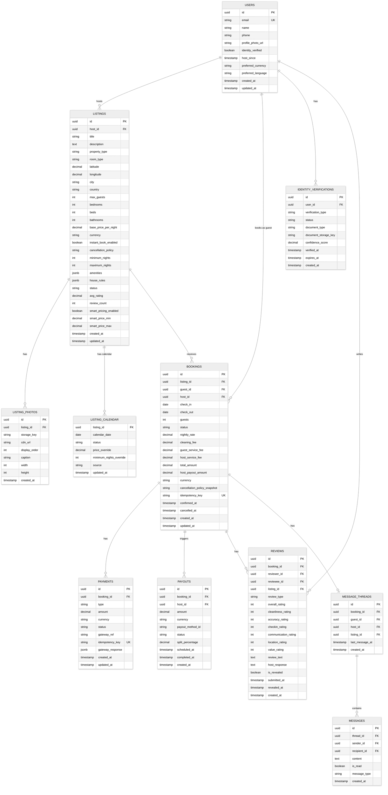

# Low-Level Design

## 1. Data Model

### 1.1 Entity-Relationship Diagram



### 1.2 Key Schema Details

#### LISTING_CALENDAR Table
The calendar is the most queried table in the system. Each row represents one date for one listing.

```
Primary Key:    (listing_id, calendar_date)
Status values:  'AVAILABLE' | 'BLOCKED' | 'RESERVED' | 'BOOKED'
Source values:  'HOST_MANUAL' | 'ICAL_SYNC' | 'BOOKING' | 'SYSTEM'

State transitions:
  AVAILABLE → BLOCKED    (host blocks dates)
  AVAILABLE → RESERVED   (booking attempt acquires lock)
  RESERVED  → BOOKED     (booking confirmed)
  RESERVED  → AVAILABLE  (booking failed/expired, lock released)
  BOOKED    → AVAILABLE  (booking cancelled)
  BLOCKED   → AVAILABLE  (host unblocks dates)
```

#### BOOKINGS Status State Machine

```
PENDING_PAYMENT → PENDING_HOST_APPROVAL → CONFIRMED → ACTIVE → COMPLETED
                                       ↘ DECLINED
PENDING_PAYMENT → CONFIRMED (instant book)
Any non-terminal → CANCELLED
Any non-terminal → EXPIRED

Terminal states: COMPLETED, CANCELLED, DECLINED, EXPIRED
```

#### PAYMENTS Type Values

```
AUTHORIZATION   - Hold placed on guest card at booking
CAPTURE         - Conversion of hold to charge at check-in
REFUND          - Partial or full refund on cancellation
VOID            - Release of authorization hold
```

### 1.3 Indexing Strategy

| Table | Index | Type | Purpose |
|-------|-------|------|---------|
| LISTING_CALENDAR | `(listing_id, calendar_date)` | Primary key (B-tree) | Range queries for date availability |
| LISTING_CALENDAR | `(calendar_date, status)` | B-tree composite | Bulk availability checks across listings |
| LISTINGS | `(latitude, longitude)` | GiST spatial | Geo-proximity queries (fallback to Elasticsearch) |
| LISTINGS | `(host_id, status)` | B-tree composite | Host's active listings |
| LISTINGS | `(city, property_type, status)` | B-tree composite | Filtered listing queries |
| BOOKINGS | `(listing_id, check_in, check_out)` | B-tree composite | Overlapping booking detection |
| BOOKINGS | `(guest_id, status)` | B-tree composite | Guest's booking history |
| BOOKINGS | `(host_id, status)` | B-tree composite | Host's booking management |
| BOOKINGS | `(idempotency_key)` | Unique B-tree | Duplicate booking prevention |
| PAYMENTS | `(booking_id, type)` | B-tree composite | Payment history per booking |
| PAYMENTS | `(idempotency_key)` | Unique B-tree | Duplicate payment prevention |
| REVIEWS | `(listing_id, is_revealed)` | B-tree composite | Public reviews for listing page |
| REVIEWS | `(booking_id, review_type)` | B-tree composite | Review lookup per booking |
| MESSAGES | `(thread_id, created_at)` | B-tree composite | Message thread pagination |

### 1.4 Sharding Strategy

| Data | Shard Key | Rationale |
|------|-----------|-----------|
| Calendar | `listing_id` | All dates for a listing must be on the same shard for atomic range operations and distributed locking |
| Bookings | `booking_id` (hash) | Even distribution; guest and host access via secondary index routing |
| Payments | `booking_id` (hash, co-located with bookings) | Payment records accessed together with booking |
| Listings | `listing_id` (hash) | Even distribution; geo queries handled by Elasticsearch, not database |
| Reviews | `listing_id` | Reviews are typically queried per listing; co-location enables efficient aggregation |
| Messages | `thread_id` | All messages in a conversation on the same shard for ordered retrieval |

---

## 2. Elasticsearch Index Design

### 2.1 Listing Index Mapping

```
Index: listings
{
  "id":               keyword,
  "host_id":          keyword,
  "title":            text (analyzed),
  "description":      text (analyzed),
  "property_type":    keyword,
  "room_type":        keyword,
  "location": {
    "type":           geo_point,    // (latitude, longitude)
    "city":           keyword,
    "country":        keyword,
    "neighborhood":   keyword
  },
  "max_guests":       integer,
  "bedrooms":         integer,
  "bathrooms":        integer,
  "base_price":       float,
  "amenities":        keyword[],    // ["wifi", "pool", "kitchen", ...]
  "instant_book":     boolean,
  "is_superhost":     boolean,
  "avg_rating":       float,
  "review_count":     integer,
  "response_rate":    float,
  "photo_count":      integer,
  "listing_quality_score": float,   // ML-computed quality signal
  "available_dates":  date_range,   // Periodically refreshed availability windows
  "last_booked_at":   date,
  "created_at":       date,
  "updated_at":       date
}
```

### 2.2 Search Query Construction (Pseudocode)

```
FUNCTION constructSearchQuery(params):
  query = new BoolQuery()

  // 1. Location filter (mandatory)
  IF params.bounds EXISTS:
    query.filter(geo_bounding_box("location", params.bounds))
  ELSE IF params.location EXISTS:
    geocoded = geocode(params.location)
    query.filter(geo_distance("location", geocoded.center, "25km"))

  // 2. Date availability filter
  IF params.check_in AND params.check_out EXISTS:
    // Check Redis availability cache first
    available_listing_ids = availabilityCache.getAvailable(
      params.check_in, params.check_out, candidate_listing_ids
    )
    query.filter(terms("id", available_listing_ids))

  // 3. Guest capacity filter
  IF params.guests EXISTS:
    query.filter(range("max_guests", gte=params.guests))

  // 4. Property/room type filter
  IF params.property_type EXISTS:
    query.filter(term("property_type", params.property_type))

  // 5. Price range filter
  IF params.price_min OR params.price_max EXISTS:
    query.filter(range("base_price", gte=params.price_min, lte=params.price_max))

  // 6. Amenity filter
  IF params.amenities EXISTS:
    FOR EACH amenity IN params.amenities:
      query.filter(term("amenities", amenity))

  // 7. Instant book filter
  IF params.instant_book == true:
    query.filter(term("instant_book", true))

  // 8. Superhost filter
  IF params.superhost == true:
    query.filter(term("is_superhost", true))

  // 9. Relevance scoring (function_score)
  query.functionScore([
    { field: "avg_rating", weight: 0.25, modifier: "log1p" },
    { field: "review_count", weight: 0.15, modifier: "log1p" },
    { field: "listing_quality_score", weight: 0.30 },
    { field: "response_rate", weight: 0.10 },
    { script: personalizedScore(params.user_id), weight: 0.20 }
  ])

  RETURN query.size(200)  // Fetch top 200 candidates for ML re-ranking
```

---

## 3. API Design

### 3.1 Search API

```
GET /v2/search
  Query Parameters:
    location        string    "San Francisco, CA" or "37.7749,-122.4194"
    check_in        date      "2025-07-15"
    check_out       date      "2025-07-20"
    guests          integer   2
    property_type   string    "entire_home" | "private_room" | "shared_room"
    price_min       decimal   50.00
    price_max       decimal   300.00
    amenities       string[]  ["wifi", "pool", "kitchen"]
    instant_book    boolean   true
    superhost       boolean   false
    bounds          string    "37.8,-122.5,37.7,-122.3" (ne_lat,ne_lng,sw_lat,sw_lng)
    sort_by         string    "relevance" | "price_asc" | "price_desc" | "rating"
    page            integer   1
    page_size       integer   20
    view            string    "list" | "map"

  Response: 200 OK
  {
    "results": [
      {
        "listing_id": "uuid",
        "title": "Cozy Studio in Mission District",
        "property_type": "entire_home",
        "room_type": "entire_home",
        "location": { "lat": 37.76, "lng": -122.42, "city": "San Francisco" },
        "price_per_night": 125.00,
        "total_price": 625.00,
        "currency": "USD",
        "avg_rating": 4.87,
        "review_count": 142,
        "is_superhost": true,
        "instant_book": true,
        "thumbnail_url": "https://cdn.example.com/photos/abc123/thumb.jpg",
        "amenities_preview": ["wifi", "kitchen", "washer"],
        "max_guests": 4,
        "bedrooms": 1,
        "beds": 1,
        "bathrooms": 1
      }
    ],
    "total_count": 347,
    "page": 1,
    "page_size": 20,
    "search_id": "uuid",
    "map_pins": [
      {
        "listing_id": "uuid",
        "lat": 37.76,
        "lng": -122.42,
        "price": 125,
        "pin_type": "regular"
      }
    ]
  }
```

### 3.2 Listing Management APIs

```
POST /v2/listings
  Headers: Authorization: Bearer {token}
  Body:
  {
    "title": "Sunny Apartment with Bay View",
    "description": "...",
    "property_type": "apartment",
    "room_type": "entire_home",
    "location": { "address": "123 Main St", "city": "San Francisco", "country": "US" },
    "max_guests": 4,
    "bedrooms": 2,
    "beds": 2,
    "bathrooms": 1,
    "base_price_per_night": 150.00,
    "currency": "USD",
    "amenities": ["wifi", "kitchen", "washer", "dryer"],
    "house_rules": { "no_smoking": true, "no_parties": true },
    "instant_book_enabled": true,
    "cancellation_policy": "moderate",
    "minimum_nights": 2,
    "maximum_nights": 30
  }
  Response: 201 Created { "listing_id": "uuid", ... }

GET /v2/listings/{listing_id}
  Response: 200 OK { full listing details with photos, reviews summary, calendar preview }

PUT /v2/listings/{listing_id}
  Headers: Authorization: Bearer {token}
  Body: { partial listing update }
  Response: 200 OK
```

### 3.3 Calendar/Availability APIs

```
GET /v2/listings/{listing_id}/calendar?start_date=2025-07-01&end_date=2025-08-31
  Response: 200 OK
  {
    "listing_id": "uuid",
    "calendar": [
      { "date": "2025-07-01", "status": "available", "price": 150.00 },
      { "date": "2025-07-02", "status": "available", "price": 150.00 },
      { "date": "2025-07-03", "status": "booked", "price": null },
      { "date": "2025-07-04", "status": "blocked", "price": null }
    ]
  }

PUT /v2/listings/{listing_id}/calendar
  Headers: Authorization: Bearer {token}
  Body:
  {
    "updates": [
      { "start_date": "2025-08-01", "end_date": "2025-08-05", "status": "blocked" },
      { "start_date": "2025-08-10", "end_date": "2025-08-15", "price_override": 200.00 }
    ]
  }
  Response: 200 OK
```

### 3.4 Booking APIs

```
POST /v2/bookings
  Headers:
    Authorization: Bearer {token}
    Idempotency-Key: {client-generated-uuid}
  Body:
  {
    "listing_id": "uuid",
    "check_in": "2025-07-15",
    "check_out": "2025-07-20",
    "guests": 2,
    "payment_method_id": "pm_uuid",
    "message_to_host": "Looking forward to our stay!"
  }
  Response: 201 Created
  {
    "booking_id": "uuid",
    "status": "confirmed",     // or "pending_host_approval" for request-to-book
    "listing_id": "uuid",
    "check_in": "2025-07-15",
    "check_out": "2025-07-20",
    "nightly_rate": 150.00,
    "nights": 5,
    "cleaning_fee": 75.00,
    "guest_service_fee": 117.38,
    "total_amount": 942.38,
    "currency": "USD",
    "payment_status": "authorized",
    "cancellation_policy": "moderate"
  }

  Error Responses:
    409 Conflict     - Dates no longer available
    402 Payment Required - Payment authorization failed
    422 Unprocessable - Invalid dates, exceeds max guests, etc.

GET /v2/bookings/{booking_id}
  Response: 200 OK { full booking details }

POST /v2/bookings/{booking_id}/confirm
  Headers: Authorization: Bearer {token}  (host only)
  Response: 200 OK { "status": "confirmed" }

POST /v2/bookings/{booking_id}/cancel
  Headers: Authorization: Bearer {token}
  Body: { "reason": "change_of_plans" }
  Response: 200 OK
  {
    "status": "cancelled",
    "refund_amount": 750.00,
    "refund_percentage": 100,
    "cancellation_policy_applied": "moderate"
  }
```

### 3.5 Review APIs

```
POST /v2/reviews
  Headers: Authorization: Bearer {token}
  Body:
  {
    "booking_id": "uuid",
    "review_type": "guest_reviews_listing",
    "overall_rating": 5,
    "cleanliness_rating": 5,
    "accuracy_rating": 4,
    "checkin_rating": 5,
    "communication_rating": 5,
    "location_rating": 4,
    "value_rating": 4,
    "review_text": "Amazing stay! The apartment was exactly as described..."
  }
  Response: 201 Created
  {
    "review_id": "uuid",
    "status": "submitted",
    "is_revealed": false,
    "reveal_at": "2025-08-03T00:00:00Z"
  }

GET /v2/listings/{listing_id}/reviews?page=1&page_size=10
  Response: 200 OK
  {
    "reviews": [ ... ],
    "summary": {
      "avg_overall": 4.87,
      "avg_cleanliness": 4.92,
      "avg_accuracy": 4.78,
      "total_reviews": 142
    }
  }
```

### 3.6 Messaging APIs

```
POST /v2/messages
  Headers: Authorization: Bearer {token}
  Body:
  {
    "thread_id": "uuid",       // or null for new thread
    "listing_id": "uuid",      // required for new thread
    "recipient_id": "uuid",
    "content": "Hi, is your place available for 4 guests?"
  }
  Response: 201 Created

GET /v2/messages/threads?page=1
  Response: 200 OK { threads with last message preview }

GET /v2/messages/threads/{thread_id}?page=1
  Response: 200 OK { messages in thread, paginated }
```

---

## 4. Core Algorithms

### 4.1 Calendar Availability Check with Distributed Lock

```
FUNCTION checkAndReserveAvailability(listingId, checkIn, checkOut, bookingId):
  lockKey = "availability_lock:" + listingId
  lockValue = bookingId  // unique identifier for this lock holder

  // Phase 1: Acquire distributed lock
  acquired = REDIS.SET(lockKey, lockValue, NX=true, EX=10)  // NX: only if not exists, EX: 10s TTL

  IF NOT acquired:
    // Another booking attempt is in progress for this listing
    RETURN { status: "CONFLICT", message: "Listing temporarily locked, retry in 2s" }

  TRY:
    // Phase 2: Check all dates in range
    dates = generateDateRange(checkIn, checkOut)

    calendarRows = DB.QUERY(
      "SELECT calendar_date, status FROM listing_calendar
       WHERE listing_id = $1 AND calendar_date = ANY($2)
       FOR UPDATE",  // Row-level lock for extra safety
      [listingId, dates]
    )

    // Verify all dates exist and are available
    IF calendarRows.length != dates.length:
      RELEASE_LOCK(lockKey, lockValue)
      RETURN { status: "ERROR", message: "Calendar data incomplete" }

    FOR EACH row IN calendarRows:
      IF row.status != 'AVAILABLE':
        RELEASE_LOCK(lockKey, lockValue)
        RETURN { status: "CONFLICT", date: row.calendar_date,
                 message: "Date " + row.calendar_date + " is " + row.status }

    // Phase 3: Reserve all dates atomically
    DB.EXECUTE(
      "UPDATE listing_calendar
       SET status = 'RESERVED', updated_at = NOW()
       WHERE listing_id = $1 AND calendar_date = ANY($2) AND status = 'AVAILABLE'",
      [listingId, dates]
    )

    affectedRows = DB.rowsAffected()
    IF affectedRows != dates.length:
      // Race condition: another process modified between SELECT and UPDATE
      DB.ROLLBACK()
      RELEASE_LOCK(lockKey, lockValue)
      RETURN { status: "CONFLICT", message: "Availability changed during reservation" }

    DB.COMMIT()
    RELEASE_LOCK(lockKey, lockValue)
    RETURN { status: "SUCCESS", reservedDates: dates }

  CATCH exception:
    DB.ROLLBACK()
    RELEASE_LOCK(lockKey, lockValue)
    RETURN { status: "ERROR", message: exception.message }

FUNCTION RELEASE_LOCK(lockKey, lockValue):
  // Only release if we still own the lock (prevent releasing another holder's lock)
  script = "if redis.call('get', KEYS[1]) == ARGV[1] then
              return redis.call('del', KEYS[1])
            else
              return 0
            end"
  REDIS.EVAL(script, [lockKey], [lockValue])
```

### 4.2 Search Ranking Algorithm

```
FUNCTION rankSearchResults(candidateListings, searchContext, userProfile):
  scoredListings = []

  FOR EACH listing IN candidateListings:
    // Feature extraction
    features = {
      // Listing quality signals
      qualityScore:       listing.avg_rating * log(1 + listing.review_count),
      photoScore:         listing.photo_count / 25.0,  // Normalized to 25 photos = 1.0
      responseRate:       listing.response_rate,
      superhostBonus:     listing.is_superhost ? 0.15 : 0.0,
      descriptionLength:  min(len(listing.description) / 500, 1.0),

      // Price competitiveness
      priceRatio:         listing.price / searchContext.medianPrice,
      priceCompetitive:   1.0 - min(max((priceRatio - 0.8) / 0.4, 0), 1),

      // Relevance to query
      geoDistance:         haversine(listing.location, searchContext.center),
      geoDecay:           exp(-0.5 * (geoDistance / searchContext.radius)^2),
      amenityMatch:       countMatches(listing.amenities, searchContext.amenities) /
                          len(searchContext.amenities),

      // Personalization (if user is logged in)
      userPrefMatch:      cosineSimilarity(listing.embedding, userProfile.embedding),
      previousView:       userProfile.viewedListings.contains(listing.id) ? -0.1 : 0,

      // Recency and freshness
      recentBooking:      daysSince(listing.last_booked_at) < 30 ? 0.1 : 0,
      newListing:         daysSince(listing.created_at) < 14 ? 0.05 : 0
    }

    // Weighted combination
    score = (
      0.25 * features.qualityScore +
      0.15 * features.priceCompetitive +
      0.20 * features.geoDecay +
      0.10 * features.amenityMatch +
      0.15 * features.userPrefMatch +
      0.05 * features.superhostBonus +
      0.05 * features.recentBooking +
      0.03 * features.photoScore +
      0.02 * features.responseRate +
      features.previousView +
      features.newListing
    )

    scoredListings.append({ listing: listing, score: score })

  // Sort by score descending
  scoredListings.sort(by: score, descending: true)

  // For map view: apply bookability filter
  IF searchContext.view == "map":
    scoredListings = applyBookabilityFilter(scoredListings, alpha=1.0)

  RETURN scoredListings

FUNCTION applyBookabilityFilter(listings, alpha):
  // From Airbnb's "Learning to Rank for Maps" paper
  // Only show listings within alpha logits of the highest-probability listing
  IF listings.isEmpty():
    RETURN []

  maxLogit = listings[0].score
  filtered = []

  FOR EACH item IN listings:
    IF (maxLogit - item.score) <= alpha:
      item.pinType = "regular"
      filtered.append(item)
    ELSE IF (maxLogit - item.score) <= alpha * 2:
      item.pinType = "mini"    // Mini-pin: shown but smaller, no price
      filtered.append(item)
    // Else: excluded from map entirely

  RETURN filtered
```

### 4.3 Dynamic Pricing Suggestion Algorithm

```
FUNCTION suggestPrice(listingId, targetDate):
  listing = DB.getListing(listingId)

  // 1. Base price from host setting
  basePrice = listing.base_price_per_night

  // 2. Demand multiplier (from search volume for this area + dates)
  searchVolume = metrics.getSearchVolume(listing.city, targetDate, window=7days)
  avgSearchVolume = metrics.getAvgSearchVolume(listing.city, window=90days)
  demandRatio = searchVolume / avgSearchVolume
  demandMultiplier = clamp(demandRatio, 0.7, 2.5)

  // 3. Seasonal factor
  seasonalFactor = seasonalModel.predict(listing.city, targetDate)
  // Returns 0.8 (low season) to 1.5 (peak season)

  // 4. Day-of-week factor
  dayOfWeek = targetDate.dayOfWeek()
  dowFactor = DOW_FACTORS[listing.city][dayOfWeek]
  // Weekend premium: 1.1-1.3, weekday discount: 0.9-1.0

  // 5. Local events factor
  events = eventsService.getNearbyEvents(listing.latitude, listing.longitude, targetDate)
  eventFactor = 1.0
  FOR EACH event IN events:
    eventImpact = event.expectedAttendance / 10000 * 0.1  // 10K attendees → 10% boost
    eventFactor = max(eventFactor, 1.0 + min(eventImpact, 0.5))

  // 6. Competitor price signal
  comparables = searchService.getComparableListings(listing, targetDate, radius="2km", limit=20)
  IF comparables.length > 5:
    medianCompPrice = median(comparables.map(c -> c.priceForDate(targetDate)))
    competitorFactor = medianCompPrice / basePrice
    competitorFactor = clamp(competitorFactor, 0.8, 1.3)
  ELSE:
    competitorFactor = 1.0

  // 7. Lead time factor (last-minute discount or advance premium)
  daysUntil = daysBetween(today(), targetDate)
  IF daysUntil <= 3:
    leadTimeFactor = 0.85  // Last-minute discount to fill vacancy
  ELSE IF daysUntil <= 14:
    leadTimeFactor = 1.0
  ELSE IF daysUntil <= 60:
    leadTimeFactor = 1.05  // Slight advance booking premium
  ELSE:
    leadTimeFactor = 1.0

  // 8. Occupancy pressure
  bookedNights = calendar.getBookedNightsInRange(listingId,
    targetDate - 15days, targetDate + 15days)
  occupancyRate = bookedNights / 30
  IF occupancyRate > 0.8:
    occupancyFactor = 1.1  // High demand, can price up
  ELSE IF occupancyRate < 0.3:
    occupancyFactor = 0.9  // Low occupancy, suggest lower price
  ELSE:
    occupancyFactor = 1.0

  // Combine factors
  suggestedPrice = basePrice
    * demandMultiplier
    * seasonalFactor
    * dowFactor
    * eventFactor
    * competitorFactor
    * leadTimeFactor
    * occupancyFactor

  // Apply host-configured bounds
  suggestedPrice = clamp(suggestedPrice, listing.smart_price_min, listing.smart_price_max)

  // Round to nearest whole number
  suggestedPrice = round(suggestedPrice)

  RETURN {
    date: targetDate,
    suggested_price: suggestedPrice,
    base_price: basePrice,
    factors: {
      demand: demandMultiplier,
      seasonal: seasonalFactor,
      day_of_week: dowFactor,
      events: eventFactor,
      competitors: competitorFactor,
      lead_time: leadTimeFactor,
      occupancy: occupancyFactor
    },
    confidence: calculateConfidence(comparables.length, searchVolume)
  }
```

### 4.4 Cancellation Refund Calculation

```
FUNCTION calculateRefund(booking, cancellationTime):
  policy = booking.cancellation_policy_snapshot
  checkIn = booking.check_in
  daysBeforeCheckIn = daysBetween(cancellationTime, checkIn)

  SWITCH policy:
    CASE "flexible":
      IF daysBeforeCheckIn >= 1:
        refundPercentage = 100
      ELSE:
        // Within 24 hours: refund all except first night + service fee
        refundPercentage = ((booking.nights - 1) / booking.nights) * 100
      BREAK

    CASE "moderate":
      IF daysBeforeCheckIn >= 5:
        refundPercentage = 100
      ELSE:
        refundPercentage = 50
      BREAK

    CASE "strict":
      IF daysBeforeCheckIn >= 14:
        refundPercentage = 100
      ELSE IF daysBeforeCheckIn >= 7:
        refundPercentage = 50
      ELSE:
        refundPercentage = 0
      BREAK

  refundableAmount = booking.nightly_rate * booking.nights + booking.cleaning_fee
  // Guest service fee is always refunded if > 24h before check-in
  serviceFeeRefund = daysBeforeCheckIn >= 1 ? booking.guest_service_fee : 0

  totalRefund = (refundableAmount * refundPercentage / 100) + serviceFeeRefund

  RETURN {
    refund_amount: totalRefund,
    refund_percentage: refundPercentage,
    service_fee_refunded: serviceFeeRefund,
    policy_applied: policy,
    host_payout_adjustment: refundableAmount - (refundableAmount * refundPercentage / 100)
  }
```

### 4.5 Review Reveal Logic

```
FUNCTION processReviewReveal(bookingId):
  reviews = DB.QUERY(
    "SELECT * FROM reviews WHERE booking_id = $1", [bookingId]
  )

  guestReview = reviews.find(r -> r.review_type == "guest_reviews_listing")
  hostReview = reviews.find(r -> r.review_type == "host_reviews_guest")

  booking = DB.getBooking(bookingId)
  deadlineDate = booking.check_out + 14 days

  IF guestReview EXISTS AND hostReview EXISTS:
    // Both submitted: reveal immediately
    revealReviews(guestReview, hostReview)

  ELSE IF today() >= deadlineDate:
    // Deadline passed: reveal whatever exists
    IF guestReview EXISTS:
      revealReview(guestReview)
    IF hostReview EXISTS:
      revealReview(hostReview)

  // Else: wait for both submissions or deadline

FUNCTION revealReviews(reviews...):
  FOR EACH review IN reviews:
    DB.EXECUTE(
      "UPDATE reviews SET is_revealed = true, revealed_at = NOW()
       WHERE id = $1", [review.id]
    )
  // Update listing aggregate rating
  updateListingRating(review.listing_id)
  // Publish event for search index refresh
  eventStream.publish("review_revealed", { listing_id, review_ids })
```
