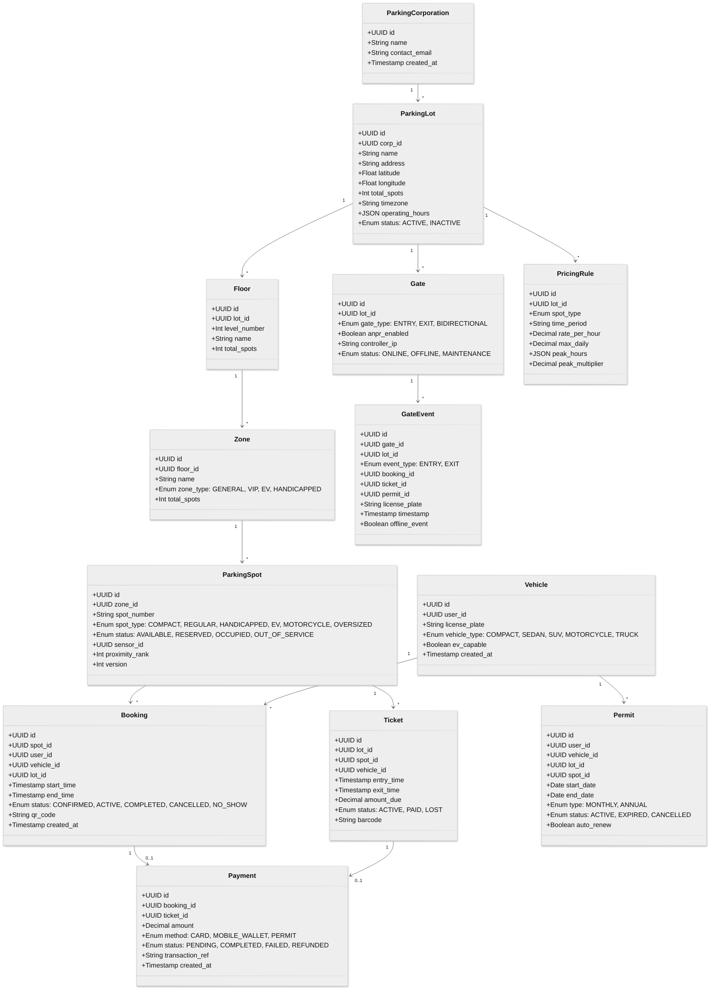
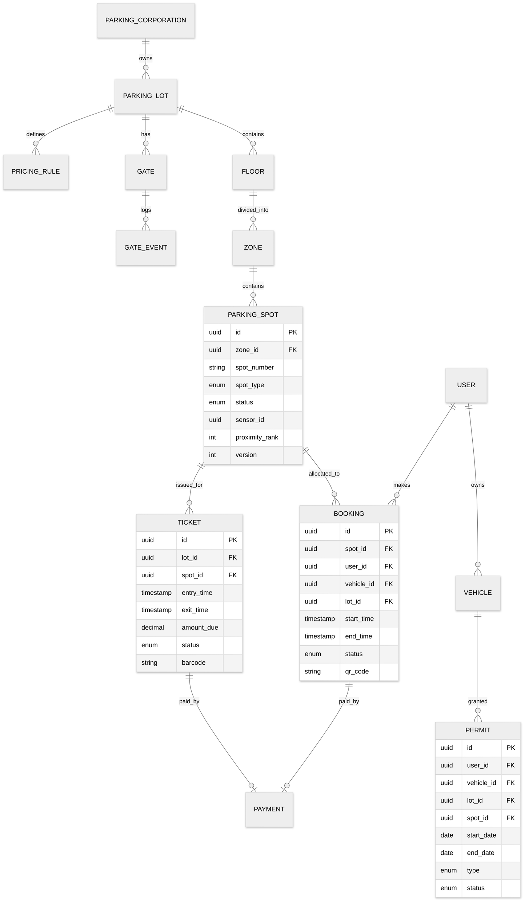

# Low-Level Design

## Object Model



---

## Entity-Relationship Diagram



---

## Indexing Strategy

| Table | Index | Columns | Purpose |
|-------|-------|---------|---------|
| `parking_spots` | `idx_spot_availability` | `(lot_id, status, spot_type)` | Fast availability queries: "how many compact spots available in lot X?" |
| `parking_spots` | `idx_spot_zone` | `(zone_id, spot_type, status)` | Zone-level availability for display boards |
| `bookings` | `idx_booking_overlap` | `(spot_id, start_time, end_time)` | Overlap detection for double-allocation prevention |
| `bookings` | `idx_booking_lot_time` | `(lot_id, start_time, status)` | Lot-level booking queries for a given date |
| `bookings` | `idx_booking_qr` | `(qr_code)` UNIQUE | QR code lookup at gate entry |
| `bookings` | `idx_booking_user` | `(user_id, status)` | User's active/upcoming bookings |
| `vehicles` | `idx_vehicle_plate` | `(license_plate)` UNIQUE | ANPR license plate lookup |
| `permits` | `idx_permit_plate_lot` | `(vehicle_id, lot_id, status)` | Permit validation at gate entry |
| `permits` | `idx_permit_active` | `(lot_id, status, end_date)` | Active permits for a lot (for edge cache sync) |
| `tickets` | `idx_ticket_barcode` | `(barcode)` UNIQUE | Ticket scan at exit |
| `tickets` | `idx_ticket_lot_active` | `(lot_id, status)` | Active tickets in a lot |
| `gate_events` | `idx_gate_event_time` | `(gate_id, timestamp)` | Gate event history |
| `gate_events` | `idx_gate_event_plate` | `(license_plate, timestamp)` | Lost ticket resolution by plate |
| `pricing_rules` | `idx_pricing_lot_type` | `(lot_id, spot_type)` | Price lookup for a lot and spot type |

---

## Sharding Strategy

**Shard key: `lot_id`**

Parking transactions are strictly geo-fenced---a vehicle entering one lot has no interaction with another lot's data. This makes `lot_id` the ideal shard key:

| Data | Shard Key | Rationale |
|------|-----------|-----------|
| `parking_spots` | `lot_id` (via zone → floor → lot) | All spots for a lot on same shard |
| `bookings` | `lot_id` | Booking queries are always lot-scoped |
| `tickets` | `lot_id` | Ticket lifecycle is lot-local |
| `gate_events` | `lot_id` (via gate → lot) | Gate events are lot-local |
| `payments` | `lot_id` (via booking/ticket) | Payment queries follow booking/ticket |
| `permits` | `lot_id` | Permit validation is lot-scoped |
| `pricing_rules` | `lot_id` | Pricing is lot-specific |

**Cross-shard queries** (rare): User's booking history across lots, corporate-level analytics. These are served by an analytics replica that aggregates across shards.

**Shard sizing**: With 10K lots, ~100 shards (100 lots per shard). Each shard handles ~4,600 tx/sec peak (100 lots × 46 tx/sec per lot at peak).

---

## API Design

### Availability APIs

```
GET /api/v1/lots/{lot_id}/availability
  Query params: spot_type, date, floor_id
  Response: {
    lot_id, total_spots, available_spots,
    by_type: [{ spot_type, total, available }],
    by_floor: [{ floor_id, floor_name, total, available }]
  }

GET /api/v1/lots/{lot_id}/floors/{floor_id}/spots
  Query params: status, spot_type
  Response: {
    spots: [{ spot_id, spot_number, spot_type, status, zone }]
  }
```

### Booking APIs

```
POST /api/v1/bookings
  Body: { lot_id, spot_type, vehicle_id, start_time, end_time }
  Response: { booking_id, spot_id, spot_number, floor, zone, qr_code, status }

GET /api/v1/bookings/{booking_id}
  Response: { booking details + spot details + payment status }

PUT /api/v1/bookings/{booking_id}
  Body: { start_time, end_time }  // modification
  Response: { updated booking }

DELETE /api/v1/bookings/{booking_id}
  Response: { status: CANCELLED, refund_amount }

GET /api/v1/users/{user_id}/bookings
  Query params: status, from_date, to_date
  Response: { bookings: [...] }
```

### Gate APIs

```
POST /api/v1/gates/{gate_id}/entry
  Body: { qr_code | ticket_barcode | license_plate, anpr_image_url }
  Response: {
    action: OPEN | DENY,
    entry_type: BOOKING | TICKET | PERMIT,
    spot: { spot_id, spot_number, floor, zone },
    message: "Welcome! Your spot is B2-47"
  }

POST /api/v1/gates/{gate_id}/exit
  Body: { ticket_barcode | qr_code | license_plate }
  Response: {
    action: OPEN | PAYMENT_REQUIRED,
    fee: { amount, currency, duration_minutes, rate_applied },
    payment_url: "..."  // if payment required
  }
```

### Payment APIs

```
POST /api/v1/payments/calculate
  Body: { ticket_id | booking_id }
  Response: { amount, currency, duration, rate_breakdown: [...] }

POST /api/v1/payments/process
  Body: { ticket_id | booking_id, payment_method_token, amount }
  Response: { payment_id, status, transaction_ref, receipt_url }
```

### Permit APIs

```
POST /api/v1/permits
  Body: { user_id, vehicle_id, lot_id, spot_id, type, start_date, end_date }
  Response: { permit_id, status }

GET /api/v1/permits/{permit_id}
  Response: { permit details }

DELETE /api/v1/permits/{permit_id}
  Response: { status: CANCELLED }
```

### Analytics APIs

```
GET /api/v1/lots/{lot_id}/analytics
  Query params: from, to, granularity (hourly|daily|weekly)
  Response: {
    occupancy: [{ timestamp, occupancy_rate }],
    revenue: { total, by_type: [...] },
    peak_hours: [...],
    avg_duration_minutes: 127
  }
```

---

## Core Algorithms

### Algorithm 1: Slot Allocation (Reservation)

```
FUNCTION allocateSlot(lotId, spotType, startTime, endTime, userId):
    // Step 1: Find candidate spots with no overlapping bookings
    candidates = QUERY(
        SELECT s.id, s.spot_number, s.proximity_rank, s.version
        FROM parking_spots s
        JOIN zones z ON s.zone_id = z.id
        JOIN floors f ON z.floor_id = f.id
        WHERE f.lot_id = lotId
          AND s.spot_type = spotType
          AND s.status IN (AVAILABLE, RESERVED)  // RESERVED spots may be available in different time windows
          AND s.id NOT IN (
              SELECT b.spot_id FROM bookings b
              WHERE b.status IN (CONFIRMED, ACTIVE)
                AND b.spot_id = s.id
                AND NOT (endTime <= b.start_time OR startTime >= b.end_time)
          )
        ORDER BY s.proximity_rank ASC  // closest to entrance first
        LIMIT 10
    )

    IF candidates IS EMPTY:
        RETURN { error: NO_AVAILABILITY }

    // Step 2: Try to reserve the best candidate using optimistic locking
    FOR spot IN candidates:
        result = QUERY(
            UPDATE parking_spots
            SET status = RESERVED, version = version + 1
            WHERE id = spot.id
              AND version = spot.version
              AND status IN (AVAILABLE, RESERVED)
        )

        IF result.rowsAffected == 1:
            // Step 3: Create the booking record
            booking = INSERT INTO bookings (
                id: generateUUID(),
                spot_id: spot.id,
                user_id: userId,
                lot_id: lotId,
                start_time: startTime,
                end_time: endTime,
                status: CONFIRMED,
                qr_code: generateQRCode(),
                created_at: NOW()
            )

            // Step 4: Update Redis availability cache
            REDIS.decrementAvailability(lotId, spotType)

            RETURN {
                booking_id: booking.id,
                spot_id: spot.id,
                spot_number: spot.spot_number,
                qr_code: booking.qr_code
            }

    // All candidates lost to concurrent bookings
    RETURN { error: ALLOCATION_CONFLICT, retry: true }
```

### Algorithm 2: Pricing Calculation

```
FUNCTION calculateFee(ticketIdOrBookingId):
    // Step 1: Get the parking session details
    session = getSession(ticketIdOrBookingId)  // ticket or booking
    entryTime = session.entry_time
    exitTime = session.exit_time OR NOW()
    lotId = session.lot_id
    spotType = session.spot_type

    // Step 2: Get applicable pricing rules
    rules = getPricingRules(lotId, spotType)
    // rules contains: rate_per_hour, max_daily, peak_hours, peak_multiplier

    // Step 3: Calculate fee with peak/off-peak split
    totalFee = 0
    currentTime = entryTime
    dayCount = 0
    dailyAccumulator = 0

    WHILE currentTime < exitTime:
        dayStart = startOfDay(currentTime)
        dayEnd = min(endOfDay(currentTime), exitTime)

        IF currentTime == dayStart AND dayCount > 0:
            dailyAccumulator = 0  // reset for new day

        // Determine rate for this hour
        IF isWithinPeakHours(currentTime, rules.peak_hours):
            hourlyRate = rules.rate_per_hour * rules.peak_multiplier
        ELSE:
            hourlyRate = rules.rate_per_hour

        // Calculate for this hour (or partial hour)
        nextHour = min(currentTime + 1 HOUR, exitTime)
        fraction = (nextHour - currentTime) / 1 HOUR
        hourFee = ceil(fraction * 100) / 100 * hourlyRate  // round up to nearest cent

        dailyAccumulator = dailyAccumulator + hourFee

        // Apply daily cap
        IF dailyAccumulator > rules.max_daily:
            dailyAccumulator = rules.max_daily

        currentTime = nextHour

    totalFee = dailyAccumulator  // for multi-day, sum each day's capped amount

    // Step 4: Apply any event-based surge
    IF hasActiveSurge(lotId, entryTime):
        surgeMultiplier = getActiveSurge(lotId, entryTime)
        totalFee = totalFee * surgeMultiplier

    RETURN {
        amount: round(totalFee, 2),
        duration_minutes: (exitTime - entryTime) in minutes,
        rate_applied: rules.rate_per_hour,
        peak_applied: hasPeakHoursInRange(entryTime, exitTime, rules.peak_hours),
        daily_cap_applied: dailyAccumulator >= rules.max_daily,
        breakdown: generateBreakdown(entryTime, exitTime, rules)
    }
```

### Algorithm 3: ANPR Vehicle Matching at Gate

```
FUNCTION matchVehicleAtGate(licensePlateImage, gateId, lotId):
    // Step 1: Extract license plate text from image
    plateText = anprEngine.recognize(licensePlateImage)

    IF plateText.confidence < 0.85:
        // Low confidence: store image for manual review
        storeForReview(licensePlateImage, gateId, lotId)
        RETURN { action: DISPENSE_TICKET, reason: "ANPR low confidence" }

    // Step 2: Normalize the plate (remove spaces, uppercase, standardize)
    normalizedPlate = normalize(plateText.value)
    // "AB 12 CD 3456" → "AB12CD3456"

    // Step 3: Check for active booking with this vehicle
    vehicle = QUERY(
        SELECT id FROM vehicles WHERE license_plate = normalizedPlate
    )

    IF vehicle IS NOT NULL:
        // Check active booking
        booking = QUERY(
            SELECT * FROM bookings
            WHERE vehicle_id = vehicle.id
              AND lot_id = lotId
              AND status = CONFIRMED
              AND start_time - 15min <= NOW()
              AND end_time + 30min >= NOW()
            LIMIT 1
        )

        IF booking IS NOT NULL:
            RETURN {
                action: OPEN_GATE,
                entry_type: BOOKING,
                booking_id: booking.id,
                spot: getSpotDetails(booking.spot_id)
            }

        // Check active permit
        permit = QUERY(
            SELECT * FROM permits
            WHERE vehicle_id = vehicle.id
              AND lot_id = lotId
              AND status = ACTIVE
              AND start_date <= TODAY()
              AND end_date >= TODAY()
            LIMIT 1
        )

        IF permit IS NOT NULL:
            // Verify vehicle isn't already parked (prevent re-entry)
            alreadyParked = QUERY(
                SELECT 1 FROM gate_events
                WHERE permit_id = permit.id
                  AND event_type = ENTRY
                  AND timestamp > TODAY()
                  AND NOT EXISTS (
                      SELECT 1 FROM gate_events
                      WHERE permit_id = permit.id
                        AND event_type = EXIT
                        AND timestamp > gate_events.timestamp
                  )
            )

            IF alreadyParked:
                RETURN { action: DENY, reason: "Vehicle already parked" }

            RETURN {
                action: OPEN_GATE,
                entry_type: PERMIT,
                permit_id: permit.id
            }

    // Step 4: No booking or permit found → walk-in
    RETURN {
        action: DISPENSE_TICKET,
        entry_type: WALK_IN,
        license_plate: normalizedPlate
    }
```

### Algorithm 4: No-Show Release Scheduler

```
FUNCTION releaseNoShowBookings():
    // Runs every 5 minutes via scheduled job

    gracePeriod = 30 MINUTES  // configurable per lot

    expiredBookings = QUERY(
        SELECT b.id, b.spot_id, b.lot_id, b.user_id
        FROM bookings b
        WHERE b.status = CONFIRMED
          AND b.start_time + gracePeriod < NOW()
          AND NOT EXISTS (
              SELECT 1 FROM gate_events ge
              WHERE ge.booking_id = b.id AND ge.event_type = ENTRY
          )
    )

    FOR booking IN expiredBookings:
        // Atomically release the spot
        BEGIN TRANSACTION
            UPDATE bookings SET status = NO_SHOW WHERE id = booking.id
            UPDATE parking_spots
                SET status = AVAILABLE, version = version + 1
                WHERE id = booking.spot_id AND status = RESERVED
            REDIS.incrementAvailability(booking.lot_id, getSpotType(booking.spot_id))
        COMMIT

        // Notify user
        notifyUser(booking.user_id, "Your reservation has expired (no-show)")

        // Apply no-show fee if configured
        applyNoShowFee(booking.id)
```

### Algorithm 5: Gate Offline Decision Engine

```
FUNCTION gateOfflineEntry(inputData, gateId, localCache):
    // Runs on edge controller when cloud is unreachable

    IF inputData.type == QR_CODE:
        // Check locally cached bookings
        booking = localCache.bookings.find(
            WHERE qr_code = inputData.qr_code
              AND status = CONFIRMED
              AND start_time - 15min <= localTime()
              AND end_time + 30min >= localTime()
        )
        IF booking:
            logOfflineEvent(gateId, ENTRY, booking_id: booking.id)
            localCache.bookings.updateStatus(booking.id, ACTIVE)
            RETURN { action: OPEN_GATE }

    IF inputData.type == LICENSE_PLATE:
        // Check locally cached permits
        permit = localCache.permits.find(
            WHERE license_plate = inputData.plate
              AND status = ACTIVE
              AND start_date <= today()
              AND end_date >= today()
        )
        IF permit:
            logOfflineEvent(gateId, ENTRY, permit_id: permit.id)
            RETURN { action: OPEN_GATE }

    // Default: dispense ticket (always allow entry in offline mode)
    ticketId = generateOfflineTicketId(gateId)
    logOfflineEvent(gateId, ENTRY, ticket_id: ticketId)
    RETURN { action: DISPENSE_TICKET, ticket_id: ticketId }

    // All offline events synced to cloud on reconnection
```

---

## Redis Data Structures

### Real-Time Availability Bitmap

```
// One bitmap per lot per spot type
// Bit position = spot index within lot, 1 = AVAILABLE, 0 = OCCUPIED/RESERVED

Key: availability:{lot_id}:{spot_type}
Value: bitmap (e.g., 5000 bits for 5000 spots = 625 bytes)

// Count available spots in O(1) using BITCOUNT
BITCOUNT availability:{lot_id}:REGULAR
→ 342  (342 regular spots available)

// Check specific spot availability
GETBIT availability:{lot_id}:REGULAR 247
→ 1  (spot at index 247 is available)

// Mark spot as occupied
SETBIT availability:{lot_id}:REGULAR 247 0

// Mark spot as available
SETBIT availability:{lot_id}:REGULAR 247 1
```

### Gate Session Cache

```
// Active gate sessions for quick lookup
Key: gate_session:{lot_id}:{ticket_id_or_booking_id}
Value: JSON { entry_time, spot_id, vehicle_plate, entry_type }
TTL: 48 hours (max parking duration)
```

### Lot Availability Summary

```
// Quick summary for mobile app / web portal
Key: lot_summary:{lot_id}
Value: HASH {
    total_spots: 500,
    available_compact: 45,
    available_regular: 120,
    available_handicapped: 8,
    available_ev: 3,
    available_motorcycle: 12,
    last_updated: "2026-03-08T10:30:00Z"
}
```
