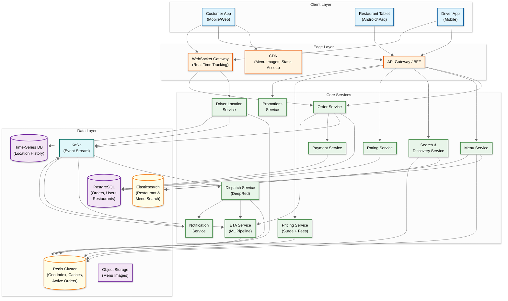
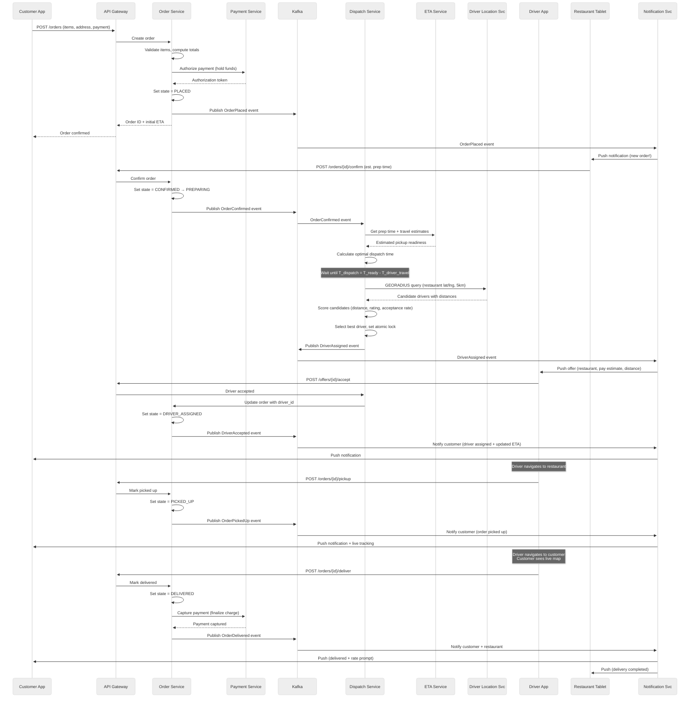
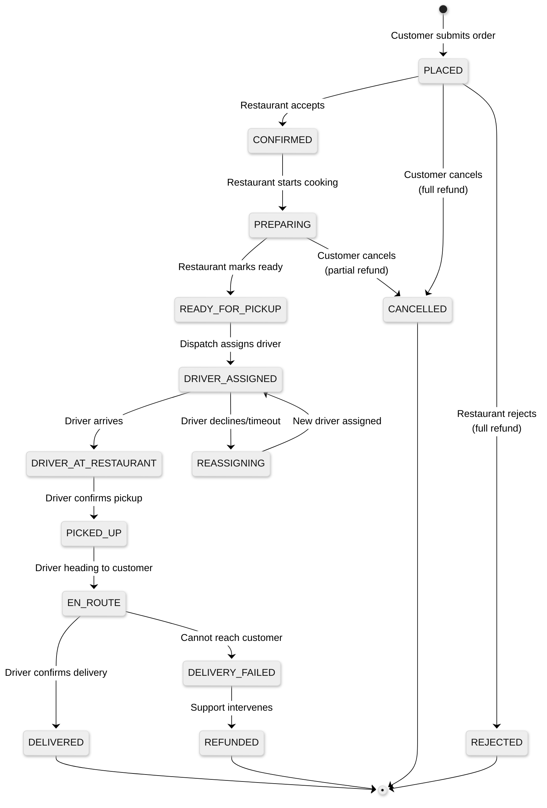

# High-Level Design

## 1. Architecture Overview



---

## 2. Service Responsibilities

| Service | Responsibility | Data Store | Scaling Strategy |
|---------|---------------|------------|-----------------|
| **Order Service** | Order lifecycle CRUD, state machine transitions, order validation | PostgreSQL (orders), Redis (active order cache) | Shard by order_id; replicate read replicas |
| **Menu Service** | Menu CRUD, item availability, restaurant hours | PostgreSQL (source of truth), Redis (cache), Elasticsearch (search index) | Heavy caching (TTL 5 min); CDN for images |
| **Dispatch Service** | Driver-to-order matching, batch optimization, re-assignment | Redis (driver geo index, assignment locks) | Geo-shard by metropolitan area; run optimizer per zone |
| **Driver Location Service** | Ingest driver GPS updates, maintain geo index, serve proximity queries | Redis Geo (real-time index), Time-Series DB (history) | Pipeline writes; shard by city |
| **ETA Service** | Multi-stage ETA computation (prep + pickup travel + delivery travel) | Redis (feature cache), ML model serving | Stateless; horizontal scale; fallback to distance-based |
| **Notification Service** | Push notifications, SMS, email for order state transitions | Kafka (event consumption) | Consume from Kafka; fan-out to push providers |
| **Payment Service** | Authorization, capture, refund, tip processing | PostgreSQL (payment records) | Idempotent operations; retry with backoff |
| **Rating Service** | Collect ratings for customer, restaurant, and driver | PostgreSQL | Async write; batch aggregate |
| **Pricing Service** | Compute delivery fee, surge multiplier, promotional discounts | Redis (zone-level supply/demand counters) | Recompute per zone every 30-60s |
| **Search & Discovery** | Restaurant search, filtering, ranking, personalization | Elasticsearch, Redis (personalization cache) | Read replicas; query caching |
| **Promotions Service** | Promo code validation, campaign management, loyalty rewards | PostgreSQL, Redis (code lookup cache) | Idempotent redemption with distributed lock |

---

## 3. Data Flow: Order Placement to Delivery

### 3.1 Sequence Diagram



### 3.2 Order Lifecycle State Diagram



---

## 4. Data Flow Narratives

### 4.1 Order Placement Flow

1. **Customer submits order** → API Gateway routes to Order Service
2. **Order Service validates** items against Menu Service (prices, availability, restaurant open status)
3. **Payment Service authorizes** the total amount (hold, not capture) via payment processor
4. **Order Service persists** the order in PostgreSQL with state = PLACED and publishes `OrderPlaced` event to Kafka
5. **Notification Service consumes** the event and pushes an alert to the restaurant tablet
6. **Restaurant confirms** the order with an estimated prep time → state moves to CONFIRMED → PREPARING
7. **Dispatch Service consumes** `OrderConfirmed` and begins the dispatch optimization window

### 4.2 Driver Location Update Flow

1. **Driver app sends GPS update** every 5 seconds via WebSocket connection to the WebSocket Gateway
2. **WebSocket Gateway** publishes the update to Kafka (partitioned by driver_id for ordering)
3. **Driver Location Service consumes** the Kafka event, validates the coordinates (bounds check, speed plausibility)
4. **Redis Geo update**: `GEOADD active_drivers:{city_id} lng lat driver_id` → updates the driver's position in the geo index
5. **Time-Series DB write**: Appends the location to the driver's location history (retained 7 days for dispute resolution)
6. **Dispatch Service** queries the geo index when searching for candidate drivers near a restaurant
7. **Tracking consumers** (customer app via WebSocket) receive the driver's updated position for map display

### 4.3 Real-Time Tracking Flow

1. **Customer opens order tracking** → Client establishes WebSocket connection to WebSocket Gateway
2. **WebSocket Gateway subscribes** to the order's tracking channel (keyed by order_id)
3. **Driver location updates** arrive at the Driver Location Service every 5 seconds
4. **If the driver has an active order**, the Location Service publishes the position to the order's tracking channel
5. **WebSocket Gateway pushes** the updated lat/lng to the customer's WebSocket connection
6. **Client-side interpolation**: Between 5-second updates, the customer app uses dead reckoning (heading + speed) to smoothly animate the driver's position on the map
7. **Fallback**: If WebSocket disconnects, the customer app falls back to polling `GET /orders/{id}/track` every 10 seconds

---

## 5. Key Architectural Decisions

### 5.1 Dispatch Timing: Eager vs. Lazy

| Strategy | Description | Trade-off |
|----------|-------------|-----------|
| **Eager dispatch** | Assign driver immediately when order is placed (before restaurant confirms) | Driver may wait at restaurant if prep is slow; good for high-demand periods where driver supply is tight |
| **Lazy dispatch** | Wait until restaurant confirms and prep time is known, then dispatch so driver arrives just as food is ready | Better driver utilization; food doesn't sit; but adds delay in driver assignment visibility to customer |
| **Hybrid (recommended)** | Dispatch at `T_ready - T_driver_travel - buffer`. Use ML-predicted prep time even before restaurant confirms. Adjust dispatch time as restaurant provides updates | Balances driver wait time and food freshness; requires accurate prep time prediction |

### 5.2 Real-Time Tracking: WebSocket vs. Polling vs. SSE

| Approach | Pros | Cons | Decision |
|----------|------|------|----------|
| **WebSocket** | Lowest latency; bidirectional; efficient for frequent updates | Connection management at scale (700K concurrent); reconnection complexity | **Primary** for active tracking |
| **Server-Sent Events (SSE)** | Simpler than WebSocket; auto-reconnect; HTTP-compatible | Unidirectional only; some proxy issues | Viable alternative for tracking-only |
| **HTTP Polling** | Simplest implementation; stateless; works everywhere | Higher latency (10s intervals); wasteful bandwidth | **Fallback** when WebSocket fails |

**Decision**: WebSocket as the primary channel for real-time tracking (customer watching driver on map) with HTTP polling as the universal fallback. SSE is not used because the driver app also needs to send location updates (bidirectional), making WebSocket the better fit for the driver connection, and using the same protocol for customers simplifies the infrastructure.

### 5.3 ETA as a Separate ML Service

The ETA Service is deliberately separated from the Order Service and Dispatch Service because:

1. **Independent scaling**: ETA is called at multiple points (search results, cart view, post-order, during delivery) with different latency requirements
2. **ML model lifecycle**: ETA models are retrained daily with new delivery data; deploying a new model should not require redeploying the Order Service
3. **Graceful degradation**: If the ML model is slow or down, the system falls back to a simple distance-based estimate without affecting order placement
4. **Feature isolation**: The ETA model depends on traffic data, weather APIs, and restaurant historical data---coupling this to the order service would create unwanted dependencies

### 5.4 Event-Driven Architecture via Kafka

The order lifecycle is driven by events rather than synchronous service-to-service calls:

```
OrderPlaced → triggers: restaurant notification, fraud check, analytics
OrderConfirmed → triggers: dispatch optimization, ETA update, customer notification
DriverAssigned → triggers: customer notification, ETA update, driver navigation
OrderPickedUp → triggers: customer notification, tracking activation, ETA update
OrderDelivered → triggers: payment capture, rating prompt, analytics, driver availability update
```

**Why events over synchronous calls**: The Order Service publishes a single event; multiple consumers react independently. Adding a new consumer (e.g., a loyalty points service) requires zero changes to the Order Service. If a consumer is temporarily down (e.g., analytics), the event is retained in Kafka and processed when the consumer recovers.

### 5.5 Geo-Sharding by Metropolitan Area

Each metropolitan area (city) operates as a semi-independent shard:

- **Dispatch Service**: Runs a separate optimizer instance per city (orders in Chicago never compete with drivers in Dallas)
- **Driver Location Service**: Redis cluster sharded by city (geo queries are always city-scoped)
- **Pricing Service**: Surge multipliers are computed per city zone
- **Menu/Restaurant data**: Queried with a geo filter (restaurants within delivery radius of customer)

This geo-sharding provides natural data isolation, reduces cross-datacenter traffic, and allows per-city capacity tuning during local peak hours (different lunch/dinner times across time zones).
