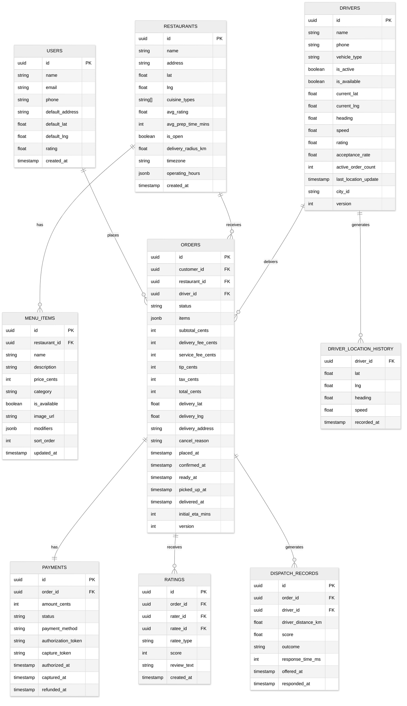

# Low-Level Design

## 1. Data Model

### 1.1 Entity-Relationship Diagram



### 1.2 Key Indexing Strategy

| Entity | Index | Type | Purpose |
|--------|-------|------|---------|
| **Drivers** (real-time) | `GEOADD active_drivers:{city_id} lng lat driver_id` | Redis Geo | Sub-millisecond proximity queries for dispatch |
| **Drivers** (real-time) | `SET driver:{id}:status` → `{available, assigned, delivering}` | Redis String | Atomic status check during assignment |
| **Orders** | `(restaurant_id, status)` | PostgreSQL B-tree | Restaurant's active orders dashboard |
| **Orders** | `(driver_id, status)` | PostgreSQL B-tree | Driver's current/past deliveries |
| **Orders** | `(customer_id, placed_at DESC)` | PostgreSQL B-tree | Customer order history |
| **Menu Items** | Full-text on `name`, `description`, `category` | Elasticsearch | Restaurant and food search |
| **Menu Items** | `(restaurant_id, is_available)` | PostgreSQL B-tree | Active menu for a restaurant |
| **Active Orders** | `HSET active_order:{order_id}` → `{status, driver_id, driver_lat, driver_lng, eta}` | Redis Hash | Fast tracking lookups without hitting PostgreSQL |
| **Location History** | `(driver_id, recorded_at)` | Time-series DB | Dispute resolution, trajectory validation |

---

## 2. API Design

### 2.1 REST APIs

#### Customer APIs

```
POST   /api/v1/orders
  Body: { restaurant_id, items: [{menu_item_id, quantity, modifiers}],
          delivery_address, delivery_lat, delivery_lng, payment_method_id, tip_cents, promo_code? }
  Response: { order_id, status: "PLACED", estimated_delivery_at, total_cents, breakdown }

GET    /api/v1/orders/{order_id}
  Response: { order_id, status, items, totals, restaurant, driver?, eta, driver_location? }

GET    /api/v1/orders/{order_id}/track
  Response: { status, driver_lat?, driver_lng?, driver_heading?, eta_minutes, last_updated }

POST   /api/v1/orders/{order_id}/cancel
  Body: { reason }
  Response: { refund_amount_cents, refund_status }

GET    /api/v1/restaurants?lat={lat}&lng={lng}&cuisine={type}&sort={rating|distance|delivery_time}&page={n}
  Response: { restaurants: [{ id, name, cuisine, rating, delivery_fee, eta_minutes, distance_km }], next_page }

GET    /api/v1/restaurants/{restaurant_id}/menu
  Response: { categories: [{ name, items: [{ id, name, price, description, image_url, modifiers, is_available }] }] }

POST   /api/v1/orders/{order_id}/rate
  Body: { restaurant_score?, driver_score?, review_text? }
  Response: { rating_id }
```

#### Restaurant APIs

```
POST   /api/v1/restaurant/orders/{order_id}/confirm
  Body: { estimated_prep_time_minutes }
  Response: { status: "CONFIRMED" }

POST   /api/v1/restaurant/orders/{order_id}/reject
  Body: { reason }
  Response: { status: "REJECTED" }

POST   /api/v1/restaurant/orders/{order_id}/ready
  Response: { status: "READY_FOR_PICKUP" }

PUT    /api/v1/restaurant/menu/items/{item_id}
  Body: { name?, price_cents?, is_available?, description? }
  Response: { item }

POST   /api/v1/restaurant/pause
  Body: { duration_minutes }
  Response: { paused_until }
```

#### Driver APIs

```
PUT    /api/v1/drivers/me/location
  Body: { lat, lng, heading, speed, timestamp }
  Response: 204 No Content
  Note: High-frequency endpoint (every 5s); minimal response to save bandwidth

POST   /api/v1/drivers/me/online
  Response: { status: "available" }

POST   /api/v1/drivers/me/offline
  Response: { status: "offline" }

POST   /api/v1/offers/{offer_id}/accept
  Response: { order_id, restaurant, pickup_address, delivery_address, route }

POST   /api/v1/offers/{offer_id}/decline
  Response: 204 No Content

POST   /api/v1/orders/{order_id}/arrived-at-restaurant
  Response: { status: "DRIVER_AT_RESTAURANT" }

POST   /api/v1/orders/{order_id}/pickup
  Response: { status: "PICKED_UP", delivery_address, route }

POST   /api/v1/orders/{order_id}/deliver
  Body: { delivery_photo_url? }
  Response: { status: "DELIVERED", earnings }
```

### 2.2 WebSocket API

```
WebSocket /ws/v1/orders/{order_id}/track
  Authentication: JWT token in connection header

  Server → Client messages:
  {
    "type": "location_update",
    "data": { "lat": 37.7749, "lng": -122.4194, "heading": 180, "speed": 25, "eta_minutes": 8 }
  }
  {
    "type": "status_change",
    "data": { "status": "PICKED_UP", "timestamp": "2025-01-15T18:30:00Z" }
  }
  {
    "type": "eta_update",
    "data": { "eta_minutes": 12, "reason": "traffic_delay" }
  }

WebSocket /ws/v1/drivers/me/stream
  Authentication: JWT token in connection header

  Client → Server messages:
  {
    "type": "location",
    "data": { "lat": 37.7750, "lng": -122.4195, "heading": 90, "speed": 30, "timestamp": 1705344600 }
  }

  Server → Client messages:
  {
    "type": "delivery_offer",
    "data": { "offer_id": "...", "restaurant": "...", "pay_estimate_cents": 850,
              "pickup_distance_km": 1.2, "delivery_distance_km": 3.5, "timeout_seconds": 45 }
  }
  {
    "type": "offer_expired",
    "data": { "offer_id": "..." }
  }
```

---

## 3. Core Algorithms

### 3.1 Driver Assignment (Dispatch)

```
FUNCTION dispatchOrder(order):
    restaurantGeo = getGeoLocation(order.restaurant_id)
    estimatedPrepTime = etaService.getPrepTime(order)

    // Calculate when driver should arrive at restaurant
    targetArrivalTime = now() + estimatedPrepTime - EARLY_ARRIVAL_BUFFER

    // Find candidate drivers within expanding radius
    radius = INITIAL_RADIUS_KM  // Start at 3 km
    candidates = []

    WHILE candidates.isEmpty() AND radius <= MAX_RADIUS_KM:
        nearbyDrivers = redis.GEORADIUS(
            key = "active_drivers:" + order.city_id,
            lng = restaurantGeo.lng,
            lat = restaurantGeo.lat,
            radius = radius,
            unit = "km",
            sort = "ASC",   // closest first
            count = 20      // limit candidates
        )

        FOR EACH driver IN nearbyDrivers:
            driverStatus = redis.GET("driver:" + driver.id + ":status")
            IF driverStatus == "available" AND driver.active_order_count < MAX_CONCURRENT_ORDERS:
                score = computeDriverScore(driver, order, restaurantGeo)
                candidates.append({driver, score})

        IF candidates.isEmpty():
            radius = radius * RADIUS_EXPANSION_FACTOR  // e.g., 1.5x

    IF candidates.isEmpty():
        // No drivers available in any radius
        publishEvent("DispatchFailed", {order_id: order.id})
        notifyCustomer(order.id, "Searching for driver, estimated wait...")
        enqueueRetry(order.id, delay = 30_SECONDS)
        RETURN null

    // Sort by score descending, try best candidate first
    candidates.sortByScoreDescending()

    FOR EACH candidate IN candidates:
        // Atomic assignment with optimistic locking
        success = redis.EVAL("""
            IF redis.call('GET', 'driver:' .. driver_id .. ':status') == 'available' THEN
                redis.call('SET', 'driver:' .. driver_id .. ':status', 'assigned')
                redis.call('INCR', 'driver:' .. driver_id .. ':active_orders')
                RETURN 1
            ELSE
                RETURN 0
            END
        """, candidate.driver.id)

        IF success:
            createDispatchRecord(order.id, candidate.driver.id, candidate.score)
            sendOfferToDriver(candidate.driver.id, order, OFFER_TIMEOUT_SECONDS)
            RETURN candidate.driver

    // All candidates were taken by concurrent dispatches
    enqueueRetry(order.id, delay = 5_SECONDS)
    RETURN null


FUNCTION computeDriverScore(driver, order, restaurantGeo):
    // Distance score: closer is better (0-1 scale)
    distanceKm = haversine(driver.lat, driver.lng, restaurantGeo.lat, restaurantGeo.lng)
    distanceScore = max(0, 1 - (distanceKm / MAX_RADIUS_KM))

    // ETA score: factor in travel time, not just distance
    driverToRestaurantETA = routingService.getETA(driver.location, restaurantGeo)
    etaScore = max(0, 1 - (driverToRestaurantETA / MAX_ACCEPTABLE_ETA_MINS))

    // Acceptance probability: historical acceptance rate for similar offers
    acceptanceScore = driver.acceptance_rate

    // Rating score
    ratingScore = driver.rating / 5.0

    // Current load penalty: penalize drivers already carrying an order
    loadPenalty = driver.active_order_count * LOAD_PENALTY_FACTOR

    // Heading alignment: bonus if driver is already heading toward restaurant
    headingBonus = computeHeadingAlignment(driver.heading, driver.location, restaurantGeo)

    RETURN (
        WEIGHT_DISTANCE * distanceScore +
        WEIGHT_ETA * etaScore +
        WEIGHT_ACCEPTANCE * acceptanceScore +
        WEIGHT_RATING * ratingScore +
        WEIGHT_HEADING * headingBonus -
        loadPenalty
    )

// Weights (tuned per city from historical data):
// WEIGHT_DISTANCE = 0.30, WEIGHT_ETA = 0.25, WEIGHT_ACCEPTANCE = 0.25,
// WEIGHT_RATING = 0.10, WEIGHT_HEADING = 0.10
```

### 3.2 Multi-Stage ETA Calculation

```
FUNCTION calculateDeliveryETA(order, driver):
    // ---- Stage 1: Restaurant Preparation Time ----
    basePrepTime = order.restaurant.avg_prep_time_mins

    // ML adjustment based on: time of day, order complexity, current kitchen load
    features = {
        restaurant_id: order.restaurant_id,
        item_count: order.items.length,
        item_categories: extractCategories(order.items),
        time_of_day: currentHour(),
        day_of_week: currentDayOfWeek(),
        active_orders_at_restaurant: getActiveOrderCount(order.restaurant_id),
        historical_avg_deviation: getHistoricalDeviation(order.restaurant_id, currentHour())
    }
    mlPrepAdjustment = prepTimeModel.predict(features)
    prepETA = basePrepTime + mlPrepAdjustment

    // If restaurant already provided an estimate, blend with ML prediction
    IF order.restaurant_prep_estimate IS NOT NULL:
        prepETA = 0.6 * order.restaurant_prep_estimate + 0.4 * prepETA

    // ---- Stage 2: Driver Travel to Restaurant ----
    IF driver IS NOT NULL:
        driverToRestaurantETA = routingService.getETA(
            origin = {lat: driver.current_lat, lng: driver.current_lng},
            destination = {lat: order.restaurant.lat, lng: order.restaurant.lng},
            use_real_time_traffic = true
        )
    ELSE:
        // Pre-assignment: estimate using average driver distance in the zone
        avgDriverDistance = getAverageDriverDistance(order.restaurant.city_id, order.restaurant.lat, order.restaurant.lng)
        driverToRestaurantETA = avgDriverDistance / AVG_DRIVER_SPEED_KPH * 60  // convert to minutes

    // ---- Stage 3: Restaurant to Customer ----
    restaurantToCustomerETA = routingService.getETA(
        origin = {lat: order.restaurant.lat, lng: order.restaurant.lng},
        destination = {lat: order.delivery_lat, lng: order.delivery_lng},
        use_real_time_traffic = true
    )

    // ---- Combine Stages ----
    // Driver should arrive when food is ready
    pickupWaitTime = max(0, prepETA - driverToRestaurantETA)

    totalETA = max(prepETA, driverToRestaurantETA) + restaurantToCustomerETA + HANDOFF_BUFFER_MINS

    // ---- ML Correction Layer ----
    // Correct for systematic biases using historical delivery data
    correctionFeatures = {
        raw_eta: totalETA,
        city_id: order.restaurant.city_id,
        time_of_day: currentHour(),
        weather: getWeatherCondition(order.restaurant.city_id),
        day_type: isHoliday() ? "holiday" : dayOfWeek(),
        distance_km: haversine(order.restaurant.lat, order.restaurant.lng, order.delivery_lat, order.delivery_lng)
    }
    correctionFactor = etaCorrectionModel.predict(correctionFeatures)

    correctedETA = totalETA * correctionFactor

    RETURN {
        total_eta_minutes: round(correctedETA),
        prep_eta: prepETA,
        driver_to_restaurant_eta: driverToRestaurantETA,
        restaurant_to_customer_eta: restaurantToCustomerETA,
        confidence_interval: computeConfidenceInterval(correctedETA),
        estimated_delivery_at: now() + correctedETA minutes
    }
```

### 3.3 Surge Pricing

```
FUNCTION calculateSurgeMultiplier(geo_zone_id, current_time):
    // ---- Supply Measurement ----
    availableDrivers = redis.GEORADIUS(
        key = "active_drivers:" + geo_zone_id,
        center = zone_center(geo_zone_id),
        radius = zone_radius(geo_zone_id),
        filter = status == "available"
    ).count

    // ---- Demand Measurement ----
    pendingOrders = redis.GET("pending_orders:" + geo_zone_id)

    // Short-term demand forecast (next 15 minutes)
    forecastedDemand = demandForecastModel.predict({
        zone: geo_zone_id,
        time: current_time,
        day: dayOfWeek(),
        weather: getWeather(geo_zone_id),
        events: getNearbyEvents(geo_zone_id)  // concerts, sports, etc.
    })

    effectiveDemand = pendingOrders + forecastedDemand
    effectiveSupply = max(availableDrivers, 1)  // avoid division by zero

    // ---- Compute Raw Multiplier ----
    supplyDemandRatio = effectiveDemand / effectiveSupply

    IF supplyDemandRatio <= 1.0:
        rawMultiplier = 1.0    // no surge
    ELIF supplyDemandRatio <= 2.0:
        rawMultiplier = 1.0 + (supplyDemandRatio - 1.0) * 0.5   // 1.0 to 1.5
    ELIF supplyDemandRatio <= 4.0:
        rawMultiplier = 1.5 + (supplyDemandRatio - 2.0) * 0.5   // 1.5 to 2.5
    ELSE:
        rawMultiplier = min(3.0, 2.5 + (supplyDemandRatio - 4.0) * 0.25)  // cap at 3.0x

    // ---- Smooth Transitions (EWMA) ----
    previousMultiplier = redis.GET("surge:" + geo_zone_id) OR 1.0
    alpha = 0.3  // smoothing factor: higher = more responsive, lower = more stable
    smoothedMultiplier = alpha * rawMultiplier + (1 - alpha) * previousMultiplier

    // ---- Apply Constraints ----
    // Cap maximum change per interval to prevent jarring jumps
    maxDelta = 0.5
    smoothedMultiplier = clamp(
        smoothedMultiplier,
        previousMultiplier - maxDelta,
        previousMultiplier + maxDelta
    )

    // Round to nearest 0.1 for cleaner display
    finalMultiplier = round(smoothedMultiplier, 1)

    // ---- Persist ----
    redis.SETEX("surge:" + geo_zone_id, TTL_SECONDS = 60, finalMultiplier)

    // Publish for analytics and monitoring
    publishEvent("SurgeUpdated", {zone: geo_zone_id, multiplier: finalMultiplier, supply: availableDrivers, demand: effectiveDemand})

    RETURN finalMultiplier


FUNCTION computeDeliveryFee(order, surgeMultiplier):
    baseFee = BASE_DELIVERY_FEE_CENTS  // e.g., 299 cents
    distanceKm = haversine(order.restaurant, order.delivery_address)
    distanceFee = max(0, (distanceKm - FREE_DISTANCE_KM) * PER_KM_FEE_CENTS)

    subtotal = baseFee + distanceFee
    surgedFee = round(subtotal * surgeMultiplier)

    // Apply min/max caps
    finalFee = clamp(surgedFee, MIN_DELIVERY_FEE_CENTS, MAX_DELIVERY_FEE_CENTS)

    RETURN finalFee
```

### 3.4 Order Batching (Stacked Orders)

```
FUNCTION evaluateBatchOpportunity(newOrder, activeDriver):
    // Can this driver take a second order without violating SLAs?

    currentOrder = activeDriver.current_order

    // Only batch if restaurants are close together
    restaurantDistance = haversine(newOrder.restaurant.location, currentOrder.restaurant.location)
    IF restaurantDistance > MAX_BATCH_RESTAURANT_DISTANCE_KM:
        RETURN {eligible: false, reason: "restaurants too far apart"}

    // Compute optimized route with both orders
    IF currentOrder.status == "PICKED_UP":
        // Driver already has first order; can they pick up second then deliver both?
        stops = [newOrder.restaurant, newOrder.delivery, currentOrder.delivery]
    ELSE:
        // Driver heading to first restaurant; pick up both then deliver
        stops = [currentOrder.restaurant, newOrder.restaurant, currentOrder.delivery, newOrder.delivery]

    optimizedRoute = routingService.optimizeStops(activeDriver.location, stops)

    // Check SLA: will first order delivery be delayed beyond threshold?
    originalETA = currentOrder.estimated_delivery_at
    batchedETA = optimizedRoute.etaForStop(currentOrder.delivery)
    delayMinutes = batchedETA - originalETA

    IF delayMinutes > MAX_BATCH_DELAY_MINUTES:  // e.g., 8 minutes
        RETURN {eligible: false, reason: "would delay existing order by " + delayMinutes + " min"}

    // Compute benefit: savings vs. assigning a separate driver
    separateDriverETA = estimateSeparateDriverETA(newOrder)
    batchedNewOrderETA = optimizedRoute.etaForStop(newOrder.delivery)

    RETURN {
        eligible: true,
        optimized_route: optimizedRoute,
        delay_to_existing_order_mins: delayMinutes,
        new_order_eta: batchedNewOrderETA,
        driver_earnings_bonus: BATCH_BONUS_CENTS
    }
```

---

## 4. Data Store Selection Rationale

| Store | Use Case | Why This Store |
|-------|----------|---------------|
| **PostgreSQL** | Orders, users, restaurants, menu items, payments, ratings | ACID transactions for financial data; relational integrity for order-restaurant-driver relationships; mature tooling |
| **Redis Cluster** | Driver geo index, active order cache, surge multipliers, session data, distributed locks | Sub-millisecond reads; native geo commands (GEOADD/GEORADIUS); atomic Lua scripts for optimistic locking |
| **Elasticsearch** | Restaurant discovery, menu search, food search | Full-text search with geo-distance scoring; faceted filtering (cuisine, price range, rating); relevance tuning |
| **Kafka** | Order events, location events, notification triggers, analytics stream | Durable event log; decouples producers from consumers; enables replay for new consumers; partitioned for throughput |
| **Time-Series DB** | Driver location history, ETA accuracy metrics, surge pricing history | Optimized for time-ordered append-only writes; efficient time-range queries; automatic retention policies |
| **Object Storage** | Menu item images, restaurant photos, delivery confirmation photos | Cost-effective for large binary objects; CDN-friendly; unlimited scale |

---

## 5. Idempotency and Consistency

### 5.1 Idempotent Order Placement

```
FUNCTION placeOrder(request, idempotency_key):
    // Check if this request was already processed
    existing = redis.GET("idempotency:" + idempotency_key)
    IF existing IS NOT NULL:
        RETURN deserialize(existing)  // return cached response

    // Acquire distributed lock to prevent concurrent duplicates
    lock = redis.SET("lock:order:" + idempotency_key, "1", NX, EX, 30)
    IF NOT lock:
        RETURN HTTP 409 Conflict ("Order already being processed")

    TRY:
        order = createOrder(request)
        response = {order_id: order.id, status: order.status, eta: order.eta}

        // Cache response for idempotency (TTL: 24 hours)
        redis.SETEX("idempotency:" + idempotency_key, 86400, serialize(response))

        RETURN response
    FINALLY:
        redis.DEL("lock:order:" + idempotency_key)
```

### 5.2 Optimistic Locking on Order State Transitions

```
FUNCTION transitionOrderState(order_id, expected_status, new_status, metadata):
    // Update only if current state matches expected state (prevents stale updates)
    rows_updated = SQL("""
        UPDATE orders
        SET status = :new_status,
            version = version + 1,
            :metadata_columns
        WHERE id = :order_id
          AND status = :expected_status
          AND version = :expected_version
    """)

    IF rows_updated == 0:
        // State has changed since our read — re-fetch and validate
        current = getOrder(order_id)
        IF current.status == new_status:
            RETURN current  // already transitioned (idempotent)
        ELSE:
            RAISE ConflictException("Order in unexpected state: " + current.status)

    // Publish state change event
    publishToKafka("order-events", {order_id, new_status, timestamp: now()})

    // Update Redis active order cache
    redis.HSET("active_order:" + order_id, "status", new_status)
```
