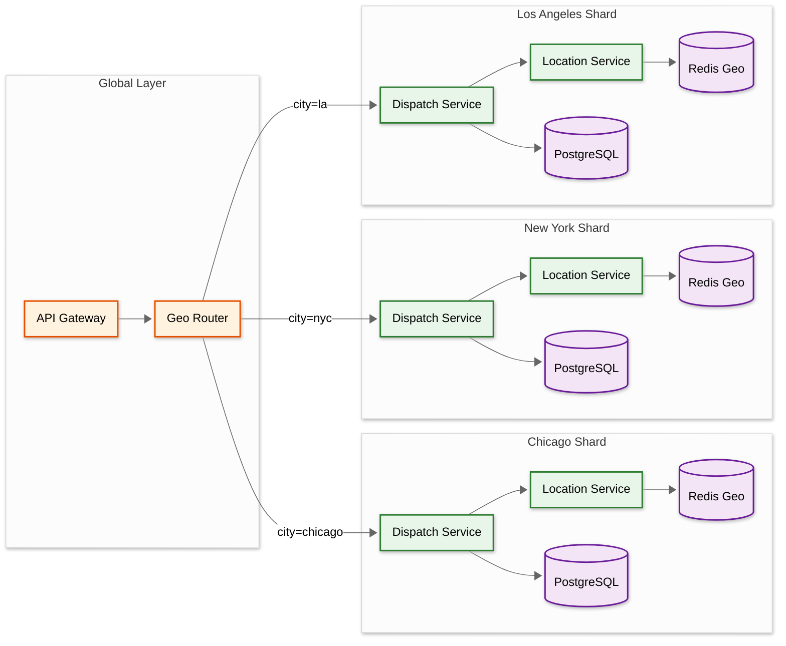

# Scalability & Reliability

## 1. Geo-Sharding Strategy

Food delivery is inherently geographic: orders in Chicago are completely independent of orders in Dallas. This natural boundary drives the primary sharding strategy.

### 1.1 City-Level Sharding



| Component | Sharding Key | Strategy |
|-----------|-------------|----------|
| **Dispatch Service** | `city_id` (derived from restaurant location) | Independent optimizer per city; no cross-city dispatch |
| **Driver Location (Redis Geo)** | `city_id` | One Redis key `active_drivers:{city_id}` per city; sharded across Redis cluster nodes |
| **Order Service (PostgreSQL)** | `order_id` (hash-based) | Consistent hash across DB shards; customer queries use secondary index |
| **Menu Service** | `restaurant_id` | Aggressively cached; shard PostgreSQL by restaurant_id range |
| **Search (Elasticsearch)** | `city_id` | One ES index per city; queries always scoped to customer's city |

### 1.2 Why Not Shard by Customer?

Sharding by customer_id would require cross-shard joins for "which orders does this restaurant have?" queries. Restaurant and order data are most frequently queried together (restaurant dashboard, dispatch, menu lookup), so sharding by geography keeps co-located data on the same shard.

### 1.3 Handling City Boundaries

Some metro areas span administrative boundaries (e.g., Brooklyn and Manhattan). The system uses **delivery zones** rather than political cities. A zone is a polygon defined by the operations team. Restaurants and drivers belong to the zone containing their primary location. Edge cases (customer on zone boundary) are resolved by assigning to the zone containing their delivery address.

---

## 2. Service-Level Scaling

### 2.1 Order Service

| Aspect | Strategy |
|--------|----------|
| **Write path** | Shard PostgreSQL by `order_id` using consistent hashing; 16 shards handle ~40 writes/sec each at peak |
| **Read path** | Read replicas for customer order history; Redis cache for active order status (TTL: until order delivered + 1h) |
| **Peak handling** | Auto-scale pods based on order creation rate; pre-scale 30 min before predicted peak (ML-based traffic prediction) |
| **State machine** | Optimistic locking with version counter; retries on conflict |

### 2.2 Menu Service

| Aspect | Strategy |
|--------|----------|
| **Read:Write ratio** | ~14,000:1 → cache everything |
| **CDN** | Menu listing pages and restaurant cards cached at CDN edge (TTL: 5 min, cache-bust on update) |
| **Redis cache** | Full menu per restaurant as serialized JSON in Redis (TTL: 5 min); popular restaurants pinned with extended TTL |
| **Invalidation** | On menu update: invalidate Redis key + purge CDN path; Kafka event triggers Elasticsearch re-index |
| **Image serving** | Object storage → CDN; images resized to multiple dimensions on upload (thumbnail, card, detail) |

### 2.3 Driver Location Service

| Aspect | Strategy |
|--------|----------|
| **Ingestion** | Kafka consumer group with partitions keyed by city; each partition handled by one consumer instance |
| **Redis writes** | Pipelined GEOADD (batch 100 commands); stationary filtering reduces writes by ~35% |
| **Horizontal scaling** | Add Kafka partitions + consumer instances per city as driver count grows |
| **Capacity planning** | 1 Redis shard per 50K drivers; scale by adding shards when city exceeds threshold |

### 2.4 Dispatch Service

| Aspect | Strategy |
|--------|----------|
| **Per-city isolation** | Separate dispatch optimizer per city; can tune parameters (radius, weights) per market |
| **Throughput** | Each optimizer handles 20-50 orders/sec; large cities get multiple optimizer instances (zone-partitioned) |
| **Scaling trigger** | Assignment latency p90 > 20s → add optimizer instance for that zone |
| **Warm standby** | Backup optimizer per city; promoted if primary fails (stateless—state lives in Redis and Kafka) |

### 2.5 ETA Service

| Aspect | Strategy |
|--------|----------|
| **Stateless** | No local state; reads features from Redis and routing service; serves predictions from loaded ML model |
| **Horizontal scaling** | Add instances proportional to QPS; each instance handles ~2,000 predictions/sec |
| **Model deployment** | Blue-green deployment; new model served by canary instances (5% traffic), promoted if accuracy metrics pass |
| **Fallback** | If ML model serving is slow (>200ms), fall back to simple distance/speed calculation |

---

## 3. Reliability Patterns

### 3.1 Circuit Breakers

| Dependency | Fallback on Open Circuit | Recovery Strategy |
|-----------|-------------------------|-------------------|
| **ETA Service** | Use distance-based estimate: `distance_km / 30 kph × 60 min + avg_prep_time` | Half-open after 30s; 3 successes to close |
| **Payment Service** | Queue order with "payment pending" status; retry capture every 60s for up to 1h | Alert after 5 consecutive failures |
| **Routing Service** | Use Haversine distance × 1.4 (average road factor) | Half-open after 15s |
| **Notification Service** | Buffer notifications in Kafka; delivery is eventually consistent | Consumer catches up when restored |
| **Rating Service** | Accept rating submission, queue for async processing | Non-critical; no user-facing fallback needed |
| **Elasticsearch** | Serve restaurant discovery from Redis-cached results (stale by up to 5 min) | Half-open after 30s |

### 3.2 Graceful Degradation Priority

The system defines a **criticality hierarchy** for degradation:

```
Tier 0 (MUST work):  Order placement → Payment authorization → Dispatch → Delivery tracking
Tier 1 (SHOULD work): ETA updates → Push notifications → Surge pricing
Tier 2 (CAN degrade): Restaurant search → Ratings → Promotions → Analytics
Tier 3 (CAN be offline): Earnings dashboard → Order history → Support chat
```

During an incident, Tier 2 and Tier 3 services can be shed to free compute for Tier 0 and Tier 1. Load shedding is triggered automatically when CPU or memory exceeds 80% on core service pods.

### 3.3 Order Durability Guarantee

Every order placement follows this sequence to guarantee zero order loss:

```
1. Validate request (items, address, restaurant open)
2. Write order to PostgreSQL (state = PLACED, synchronous replication)
3. Acknowledge to customer ONLY after PostgreSQL commit succeeds
4. Publish OrderPlaced to Kafka (at-least-once delivery)
5. If Kafka publish fails: order is in PostgreSQL; background reconciler picks it up
```

The key insight: the customer sees "Order Confirmed" only after the durable write succeeds. Kafka publication is asynchronous; if it fails, a periodic reconciler scans PostgreSQL for orders in PLACED state that lack a corresponding Kafka event and re-publishes them.

### 3.4 Saga Pattern: Order-Payment-Dispatch Coordination

The order lifecycle spans multiple services. Rather than a distributed transaction, a saga orchestrates the flow with compensating actions:

| Step | Service | Action | Compensation (on failure) |
|------|---------|--------|--------------------------|
| 1 | Order Service | Create order (PLACED) | Mark order FAILED |
| 2 | Payment Service | Authorize payment (hold) | Release hold |
| 3 | Order Service | Confirm order (CONFIRMED) | Cancel order + release hold |
| 4 | Dispatch Service | Assign driver | Release driver, set order to SEARCHING |
| 5 | Dispatch Service | Driver picks up | Reassign to new driver if current driver no-shows |
| 6 | Order Service | Mark delivered | N/A (terminal state) |
| 7 | Payment Service | Capture payment | Retry capture; escalate to support after 3 failures |

**Saga coordinator**: The Order Service acts as the saga orchestrator, tracking progress in a `saga_state` column on the order record. Each step is idempotent and can be retried safely.

---

## 4. Multi-Region Deployment

### 4.1 Regional Architecture

| Region | Primary Markets | Data Center | Notes |
|--------|----------------|-------------|-------|
| **North America** | US, Canada, Mexico | US-East + US-West | Active-active across both DCs |
| **Europe** | UK, Germany, France, Spain | EU-West (Ireland) | GDPR-compliant; data stays in EU |
| **Asia-Pacific** | Australia, Japan, South Korea | APAC (Singapore + Tokyo) | Active-active |
| **India** | India | Mumbai | Isolated region (regulatory requirements) |

### 4.2 Data Sovereignty

- **User PII** (name, phone, address): stored only in the user's region; never replicated cross-region
- **Order data**: stored in the region where the restaurant is located
- **Driver location**: stored in the region where the driver is active (hot data never leaves region)
- **Aggregated analytics**: anonymized data can be replicated to a global analytics cluster
- **ML models**: trained globally on anonymized data; model artifacts deployed to all regions

### 4.3 Cross-Region Considerations

Food delivery is inherently local (customer, restaurant, and driver are all in the same city), so cross-region data access is rare. The few cross-region scenarios:

- **Customer traveling abroad**: Account data fetched from home region; orders placed in current region
- **Global support dashboard**: Read-only replicas of order data from all regions to a central support system
- **Global ML training**: Anonymized features exported daily to a central training cluster

---

## 5. Capacity Planning and Auto-Scaling

### 5.1 Predictive Auto-Scaling

The system uses historical traffic patterns to pre-scale before predicted peaks:

```
1. ML model predicts order volume per city for next 2 hours (input: time, day, weather, events)
2. Compute required instances per service: target = predicted_peak_qps / per_instance_capacity × 1.3 (headroom)
3. Pre-scale 30 minutes before predicted peak
4. Scale down 30 minutes after peak passes (slower scale-down to handle tail)
```

### 5.2 Reactive Auto-Scaling Triggers

| Service | Metric | Scale-Up Threshold | Scale-Down Threshold |
|---------|--------|-------------------|---------------------|
| Order Service | Order creation QPS | > 80% of capacity | < 30% of capacity for 15 min |
| Dispatch Service | Assignment latency p90 | > 20 seconds | < 5 seconds for 15 min |
| Location Service | Kafka consumer lag | > 10,000 messages | < 100 messages for 10 min |
| WebSocket Gateway | Connection count | > 40K per instance | < 15K per instance for 15 min |
| ETA Service | Prediction latency p99 | > 200ms | < 50ms for 10 min |
| Menu/Search Service | Response time p95 | > 150ms | < 30ms for 10 min |

---

## 6. Disaster Recovery

| Scenario | RTO | RPO | Strategy |
|----------|-----|-----|----------|
| **Single service pod crash** | <30s | 0 | Kubernetes restarts pod; traffic routed to healthy pods |
| **Redis shard failure** | <15s | ~5s of location data | Sentinel promotes replica; dispatch uses stale data briefly |
| **PostgreSQL primary failure** | <60s | 0 (synchronous replication) | Automated failover to synchronous standby |
| **Kafka broker failure** | <30s | 0 | Kafka replication (RF=3); partition leader election |
| **Entire availability zone down** | <5 min | 0 | Traffic routed to surviving AZ; services pre-deployed in both AZs |
| **Entire region down** | 15-30 min | <1 min | Manual failover to DR region; DNS update; in-flight orders may need manual resolution |
