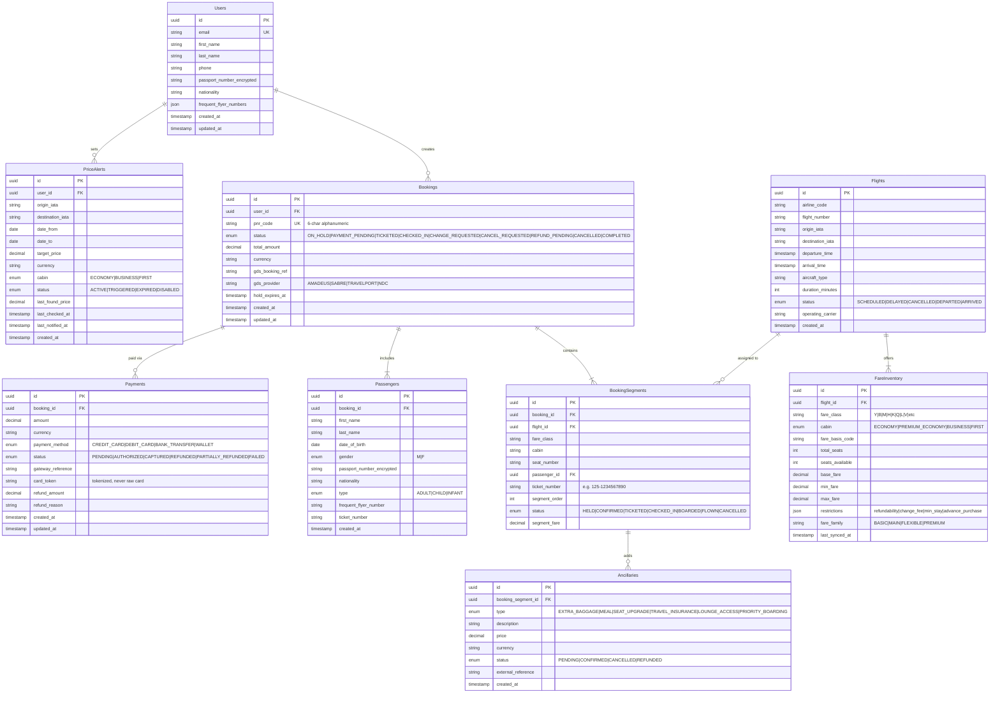

# Low-Level Design

## Data Model



---

## Indexing Strategy

| Table | Index | Type | Purpose |
|-------|-------|------|---------|
| **Flights** | `(origin_iata, destination_iata, departure_time)` | Composite B-tree | Primary search query path |
| **Flights** | `(airline_code, flight_number, departure_time)` | Composite B-tree | Deduplication key for GDS results |
| **Flights** | `(status)` partial where status IN ('SCHEDULED','DELAYED') | Partial | Active flights only |
| **FareInventory** | `(flight_id, cabin, seats_available)` where seats_available > 0 | Partial composite | Available inventory lookup |
| **FareInventory** | `(flight_id, fare_class)` | Composite unique | Fare class lookup |
| **Bookings** | `(pnr_code)` | Unique | PNR retrieval (most common query) |
| **Bookings** | `(user_id, status)` | Composite | User's active bookings |
| **Bookings** | `(hold_expires_at)` where status = 'ON_HOLD' | Partial | Expired hold cleanup job |
| **Bookings** | `(gds_booking_ref)` | B-tree | GDS reference lookup |
| **BookingSegments** | `(booking_id, segment_order)` | Composite | Ordered segments for itinerary display |
| **BookingSegments** | `(flight_id, status)` | Composite | Flight manifest query |
| **Passengers** | `(booking_id)` | B-tree | Passengers per booking |
| **Payments** | `(booking_id)` | B-tree | Payment history per booking |
| **Payments** | `(gateway_reference)` | Unique | Idempotency check, reconciliation |
| **PriceAlerts** | `(status, last_checked_at)` where status = 'ACTIVE' | Partial | Alert worker polling |
| **PriceAlerts** | `(user_id, status)` | Composite | User's active alerts |

---

## API Design

### Flight Search

```
POST /api/v1/search
Request:
{
  "origin": "JFK",
  "destination": "LHR",
  "departure_date": "2024-12-15",
  "return_date": "2024-12-22",       // optional (null = one-way)
  "passengers": {
    "adults": 2,
    "children": 0,
    "infants": 0
  },
  "cabin": "ECONOMY",                // ECONOMY | PREMIUM_ECONOMY | BUSINESS | FIRST
  "filters": {
    "non_stop_only": false,
    "preferred_airlines": ["BA", "AA"],
    "max_price": 1500,
    "departure_time_range": {"from": "06:00", "to": "18:00"}
  }
}

Response:
{
  "search_id": "srch-abc123",
  "results_count": 72,
  "cache_hit": true,
  "expires_at": "2024-12-10T14:03:00Z",
  "results": [
    {
      "itinerary_id": "itin-001",
      "outbound": {
        "segments": [
          {
            "flight": "BA115",
            "airline": "British Airways",
            "origin": "JFK",
            "destination": "LHR",
            "departure": "2024-12-15T19:00:00Z",
            "arrival": "2024-12-16T07:05:00Z",
            "duration_minutes": 425,
            "aircraft": "Boeing 777-300ER",
            "cabin": "ECONOMY"
          }
        ],
        "total_duration_minutes": 425,
        "stops": 0
      },
      "return": { ... },
      "fare_options": [
        {
          "fare_family": "BASIC",
          "fare_class": "Q",
          "price_per_adult": 650.00,
          "price_per_child": 520.00,
          "total_price": 1300.00,
          "taxes_and_fees": 185.00,
          "currency": "USD",
          "restrictions": {
            "refundable": false,
            "changeable": false,
            "carry_on_included": true,
            "checked_bag_included": false,
            "seat_selection": "PAID"
          },
          "seats_remaining": 4
        },
        {
          "fare_family": "MAIN",
          "fare_class": "M",
          "price_per_adult": 850.00,
          "total_price": 1700.00,
          ...
        }
      ],
      "source": "AMADEUS"
    }
  ]
}
```

### Booking APIs

```
POST /api/v1/bookings/hold
Request:
{
  "itinerary_id": "itin-001",
  "fare_class": "M",
  "passengers": [
    {
      "type": "ADULT",
      "first_name": "John",
      "last_name": "Doe",
      "date_of_birth": "1985-03-15",
      "gender": "M",
      "passport_number": "US12345678",
      "nationality": "US"
    },
    { ... }
  ]
}

Response:
{
  "booking_id": "BK-789",
  "pnr_code": "ABC123",
  "status": "ON_HOLD",
  "hold_expires_at": "2024-12-10T14:15:00Z",
  "total_amount": 1700.00,
  "currency": "USD"
}

---

POST /api/v1/bookings/:id/pay
Request:
{
  "payment_method": "CREDIT_CARD",
  "card_token": "tok_visa_4242",    // tokenized by frontend SDK
  "billing_address": { ... }
}

Response:
{
  "booking_id": "BK-789",
  "status": "TICKETED",
  "pnr_code": "ABC123",
  "tickets": [
    {"passenger": "John Doe", "ticket_number": "125-1234567890"},
    {"passenger": "Jane Doe", "ticket_number": "125-1234567891"}
  ],
  "e_ticket_url": "/api/v1/bookings/BK-789/eticket.pdf"
}

---

GET /api/v1/bookings/:id
Response:
{
  "booking_id": "BK-789",
  "pnr_code": "ABC123",
  "status": "TICKETED",
  "segments": [...],
  "passengers": [...],
  "payments": [...],
  "ancillaries": [...]
}

---

DELETE /api/v1/bookings/:id
Request:
{
  "reason": "VOLUNTARY_CANCEL"
}
Response:
{
  "booking_id": "BK-789",
  "status": "REFUND_PENDING",
  "refund_breakdown": {
    "base_fare_refund": 1400.00,
    "taxes_refund": 185.00,
    "cancellation_fee": -200.00,
    "total_refund": 1385.00
  },
  "refund_eta_days": 5
}
```

### Other APIs

```
GET  /api/v1/pnr/:pnr_code              // Retrieve PNR by code
GET  /api/v1/flights/:flight_id/seatmap  // Seat map for flight
POST /api/v1/bookings/:id/checkin        // Web check-in
POST /api/v1/bookings/:id/ancillaries    // Add ancillary service
POST /api/v1/price-alerts                // Create price alert
GET  /api/v1/price-alerts                // List user's alerts
DELETE /api/v1/price-alerts/:id          // Remove alert
```

---

## Core Algorithms

### 1. Search Aggregation with Fan-Out

```
FUNCTION searchFlights(origin, destination, date, passengers, cabin, filters):
    // Step 1: Check cache
    cacheKey = hash(origin, destination, date, passengers.counts, cabin)
    cached = redis.get(cacheKey)
    IF cached AND NOT expired:
        RETURN applyFilters(deserialize(cached), filters)

    // Step 2: Parallel fan-out to all providers
    providers = getActiveProviders()  // e.g., [amadeus, sabre, travelport, ba_ndc, ...]
    futures = []
    FOR EACH provider IN providers:
        IF circuitBreaker(provider).isOpen():
            CONTINUE  // skip unhealthy providers
        timeout = provider.isGDS ? 3000ms : 2000ms
        future = asyncCall(
            provider.search(origin, destination, date, passengers, cabin),
            timeout
        )
        futures.append({provider, future})

    // Step 3: Collect results (wait for all or timeout)
    rawResults = []
    FOR EACH {provider, future} IN futures:
        TRY:
            response = AWAIT future
            FOR EACH itinerary IN response.itineraries:
                itinerary.source = provider.name
                rawResults.append(itinerary)
        CATCH TimeoutException:
            circuitBreaker(provider).recordFailure()
            log.warn("Provider timeout", provider.name)
        CATCH Exception as e:
            circuitBreaker(provider).recordFailure()
            log.error("Provider error", provider.name, e)

    IF rawResults.isEmpty():
        RETURN cachedStaleResults(cacheKey)  // serve stale if all providers fail

    // Step 4: Deduplicate
    grouped = groupBy(rawResults, itinerary -> flightKey(itinerary))
    deduplicated = []
    FOR EACH key, group IN grouped:
        best = selectBestSource(group)  // lowest price, or preferred provider
        deduplicated.append(best)

    // Step 5: Enrich with taxes and fare details
    enriched = pricingService.enrichFares(deduplicated)

    // Step 6: Rank
    ranked = rankResults(enriched, {
        priceWeight: 0.40,
        durationWeight: 0.25,
        stopsWeight: 0.20,
        airlinePreferenceWeight: 0.15
    })

    // Step 7: Cache and return
    redis.setex(cacheKey, TTL_3_MINUTES, serialize(ranked))
    RETURN applyFilters(ranked, filters)


FUNCTION flightKey(itinerary):
    // Unique key for deduplication across GDS providers
    segments = itinerary.segments
    RETURN hash(
        segments.map(s -> s.airlineCode + s.flightNumber + s.departureTime).join("|")
    )
```

### 2. Seat Hold with TTL

```
FUNCTION holdSeat(userId, itineraryId, fareClass, passengers):
    // Step 1: Validate local availability
    FOR EACH segment IN itinerary.segments:
        inventory = db.query(
            "SELECT seats_available FROM fare_inventory
             WHERE flight_id = ? AND fare_class = ? FOR UPDATE",
            segment.flightId, fareClass
        )
        IF inventory.seats_available < passengers.count:
            RETURN {error: "SOLD_OUT", segment: segment.flightNumber}

    // Step 2: Create hold in GDS (authoritative)
    gdsProvider = selectGDSProvider(itinerary)
    TRY:
        gdsResponse = gdsProvider.createPNR({
            segments: itinerary.segments,
            fareClass: fareClass,
            passengers: passengers,
            holdDuration: 15  // minutes
        })
    CATCH GDSException as e:
        IF e.code == "SOLD_OUT":
            // Sync local inventory with GDS
            syncInventoryFromGDS(itinerary.segments, fareClass)
            RETURN {error: "SOLD_OUT"}
        THROW e

    // Step 3: Decrement local inventory (optimistic)
    FOR EACH segment IN itinerary.segments:
        db.execute(
            "UPDATE fare_inventory SET seats_available = seats_available - ?
             WHERE flight_id = ? AND fare_class = ? AND seats_available >= ?",
            passengers.count, segment.flightId, fareClass, passengers.count
        )

    // Step 4: Create local booking record
    booking = db.insert("bookings", {
        user_id: userId,
        pnr_code: gdsResponse.pnrCode,
        status: "ON_HOLD",
        total_amount: calculateTotal(itinerary, fareClass, passengers),
        gds_booking_ref: gdsResponse.bookingRef,
        gds_provider: gdsProvider.name,
        hold_expires_at: now() + 15.minutes
    })

    // Step 5: Redis hold key for TTL-based cleanup
    redis.setex(
        "hold:" + booking.id,
        900,  // 15 minutes in seconds
        serialize({gdsRef: gdsResponse.bookingRef, segments: itinerary.segments, fareClass, count: passengers.count})
    )

    RETURN {
        bookingId: booking.id,
        pnrCode: gdsResponse.pnrCode,
        status: "ON_HOLD",
        expiresAt: booking.hold_expires_at,
        totalAmount: booking.total_amount
    }


// Background job: release expired holds
FUNCTION releaseExpiredHolds():
    // Runs every 30 seconds
    expired = db.query(
        "SELECT * FROM bookings
         WHERE status = 'ON_HOLD' AND hold_expires_at < NOW()
         LIMIT 100 FOR UPDATE SKIP LOCKED"
    )

    FOR EACH hold IN expired:
        TRY:
            // Cancel in GDS
            gds = getGDSProvider(hold.gds_provider)
            gds.cancelPNR(hold.gds_booking_ref)

            // Restore local inventory
            FOR EACH segment IN hold.segments:
                db.execute(
                    "UPDATE fare_inventory SET seats_available = seats_available + ?
                     WHERE flight_id = ? AND fare_class = ?",
                    hold.passenger_count, segment.flight_id, segment.fare_class
                )

            // Update booking status
            db.execute(
                "UPDATE bookings SET status = 'HOLD_EXPIRED', updated_at = NOW()
                 WHERE id = ?", hold.id
            )
        CATCH Exception as e:
            log.error("Failed to release hold", hold.id, e)
            // Will retry on next cycle
```

### 3. Dynamic Fare Pricing

```
FUNCTION calculateDynamicFare(flightId, fareClass, requestTime):
    inventory = db.getFareInventory(flightId, fareClass)
    flight = db.getFlight(flightId)
    baseFare = inventory.base_fare

    // Signal 1: Load factor (remaining seats / total seats)
    loadFactor = 1.0 - (inventory.seats_available / inventory.total_seats)
    // Exponential curve: prices increase sharply as load factor approaches 1.0
    loadMultiplier = 1.0 + (loadFactor ^ 2.5) * 1.5
    // At 50% load: 1.0 + 0.177 * 1.5 = 1.27x
    // At 80% load: 1.0 + 0.572 * 1.5 = 1.86x
    // At 95% load: 1.0 + 0.879 * 1.5 = 2.32x

    // Signal 2: Time-to-departure
    daysUntilDeparture = (flight.departure_time - requestTime).toDays()
    IF daysUntilDeparture > 60:
        timeMultiplier = 0.85    // early bird discount
    ELSE IF daysUntilDeparture > 21:
        timeMultiplier = 1.00    // base rate
    ELSE IF daysUntilDeparture > 7:
        timeMultiplier = 1.25    // approaching departure
    ELSE IF daysUntilDeparture > 2:
        timeMultiplier = 1.60    // last week premium
    ELSE:
        timeMultiplier = 2.00    // last-minute premium

    // Signal 3: Day-of-week and seasonality
    seasonMultiplier = getSeasonMultiplier(flight.departure_time)
    // Peak travel (holidays, summer): 1.3-1.5x
    // Off-peak: 0.9-1.0x

    // Signal 4: Competitor pricing (cached, updated hourly)
    competitorFares = priceIntelligence.getMarketFares(
        flight.origin_iata, flight.destination_iata,
        flight.departure_time.toDate(), fareClass
    )
    IF competitorFares.isNotEmpty():
        marketMedian = median(competitorFares)
        competitorAdjustment = clamp(marketMedian / baseFare, 0.8, 1.2)
    ELSE:
        competitorAdjustment = 1.0

    // Calculate dynamic fare
    dynamicFare = baseFare * loadMultiplier * timeMultiplier *
                  seasonMultiplier * competitorAdjustment

    // Apply fare class bounds (airline-defined min/max)
    boundedFare = clamp(dynamicFare, inventory.min_fare, inventory.max_fare)

    // Round to nearest dollar
    RETURN round(boundedFare, 2)
```

### 4. Itinerary Connection Validation

```
FUNCTION validateItinerary(segments):
    errors = []

    FOR i = 0 TO segments.length - 2:
        seg1 = segments[i]
        seg2 = segments[i + 1]

        // Rule 1: Connection airport must match
        IF seg1.destination_iata != seg2.origin_iata:
            errors.append("Segments not connected: " + seg1.destination + " ≠ " + seg2.origin)
            CONTINUE

        // Rule 2: Minimum connection time
        airport = getAirportData(seg1.destination_iata)
        minConnTime = airport.getMinConnectionTime(
            seg1.arrival_terminal, seg2.departure_terminal,
            seg1.airline_code, seg2.airline_code
        )
        // Domestic-to-domestic: typically 45-60 min
        // Domestic-to-international: typically 90-120 min
        // International-to-international: typically 60-90 min

        actualConnTime = seg2.departure_time - seg1.arrival_time
        IF actualConnTime < minConnTime:
            errors.append(
                "Insufficient connection time at " + seg1.destination_iata +
                ": need " + minConnTime + " min, have " + actualConnTime + " min"
            )

        // Rule 3: Maximum connection time (24 hours)
        IF actualConnTime > 24.hours:
            errors.append("Connection exceeds 24 hours at " + seg1.destination_iata)

        // Rule 4: Interline agreement (different airlines)
        IF seg1.airline_code != seg2.airline_code:
            IF NOT hasInterlineAgreement(seg1.airline_code, seg2.airline_code):
                errors.append(
                    "No interline agreement between " +
                    seg1.airline_code + " and " + seg2.airline_code
                )

    RETURN {valid: errors.isEmpty(), errors: errors}


FUNCTION hasInterlineAgreement(airline1, airline2):
    // Check alliance membership first (Star Alliance, oneworld, SkyTeam)
    IF sameAlliance(airline1, airline2):
        RETURN true
    // Check bilateral interline agreements
    RETURN db.exists(
        "SELECT 1 FROM interline_agreements
         WHERE (airline_a = ? AND airline_b = ?) OR (airline_a = ? AND airline_b = ?)
         AND valid_until > NOW()",
        airline1, airline2, airline2, airline1
    )
```

### 5. Refund Calculation Engine

```
FUNCTION calculateRefund(bookingId, cancellationReason):
    booking = db.getBooking(bookingId)
    segments = db.getBookingSegments(bookingId)
    payments = db.getPayments(bookingId)
    totalPaid = sum(payments.filter(p -> p.status == "CAPTURED").map(p -> p.amount))

    refundBreakdown = {
        baseFareRefund: 0,
        taxRefund: 0,
        cancellationFee: 0,
        ancillaryRefund: 0
    }

    FOR EACH segment IN segments:
        fareRules = parseFareRules(segment.fare_class, segment.flight_id)

        // Check refundability
        IF fareRules.refundable == false AND cancellationReason == "VOLUNTARY":
            // Non-refundable fare: only taxes are refundable
            refundBreakdown.taxRefund += segment.tax_amount
            CONTINUE

        // Refundable fare or involuntary cancellation (airline cancelled)
        IF cancellationReason == "INVOLUNTARY":
            // Full refund for airline-initiated cancellation
            refundBreakdown.baseFareRefund += segment.segment_fare
            refundBreakdown.taxRefund += segment.tax_amount
        ELSE:
            // Voluntary cancellation with potential fee
            refundBreakdown.baseFareRefund += segment.segment_fare
            refundBreakdown.taxRefund += segment.tax_amount

            // Apply cancellation fee from fare rules
            cancFee = fareRules.cancellation_fee
            IF cancFee.type == "FIXED":
                refundBreakdown.cancellationFee += cancFee.amount
            ELSE IF cancFee.type == "PERCENTAGE":
                refundBreakdown.cancellationFee += segment.segment_fare * cancFee.percentage

    // Ancillary refunds (unused ancillaries)
    ancillaries = db.getAncillaries(bookingId)
    FOR EACH anc IN ancillaries:
        IF anc.status == "CONFIRMED" AND anc.isRefundable:
            refundBreakdown.ancillaryRefund += anc.price

    totalRefund = refundBreakdown.baseFareRefund +
                  refundBreakdown.taxRefund +
                  refundBreakdown.ancillaryRefund -
                  refundBreakdown.cancellationFee

    totalRefund = max(0, min(totalRefund, totalPaid))  // never refund more than paid

    RETURN {
        totalRefund: totalRefund,
        breakdown: refundBreakdown,
        refundMethod: payments[0].payment_method,
        estimatedDays: cancellationReason == "INVOLUNTARY" ? 3 : 7
    }
```
