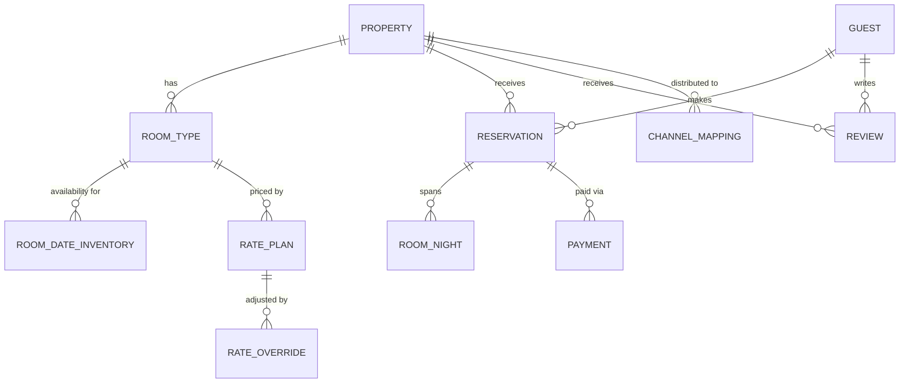

# Low-Level Design

## Data Models

### Entity Relationship Overview



---

### Property

```
Property {
    property_id         UUID            PK
    name                VARCHAR(255)
    slug                VARCHAR(255)    UNIQUE INDEX
    property_type       ENUM            -- hotel, apartment, resort, hostel, villa
    star_rating         SMALLINT        -- 1-5
    description         TEXT
    address_line        VARCHAR(500)
    city                VARCHAR(100)    INDEX
    country_code        CHAR(2)         INDEX
    latitude            DECIMAL(9,6)    -- geo index
    longitude           DECIMAL(9,6)    -- geo index
    timezone            VARCHAR(50)
    currency            CHAR(3)         -- property's local currency
    check_in_time       TIME            -- e.g., 15:00
    check_out_time      TIME            -- e.g., 11:00
    cancellation_policy ENUM            -- free_24h, free_48h, non_refundable, flexible
    overbooking_pct     DECIMAL(4,2)    -- e.g., 5.00 means accept 5% over capacity
    commission_rate     DECIMAL(4,2)    -- OTA commission, e.g., 18.50%
    review_score        DECIMAL(3,1)    -- aggregate score, e.g., 8.7
    review_count        INTEGER
    amenities           JSONB           -- {"pool": true, "wifi": true, "parking": true, ...}
    photos              JSONB           -- [{"url": "...", "caption": "...", "order": 1}, ...]
    status              ENUM            -- active, inactive, suspended, pending_review
    created_at          TIMESTAMP
    updated_at          TIMESTAMP
}

Indexes:
- GIST index on (latitude, longitude) for geo queries
- Composite index on (city, status, star_rating)
- GIN index on amenities for JSONB containment queries
```

### RoomType

```
RoomType {
    room_type_id        UUID            PK
    property_id         UUID            FK → Property
    name                VARCHAR(100)    -- "Deluxe King", "Standard Twin"
    description         TEXT
    max_occupancy       SMALLINT        -- total guests
    max_adults          SMALLINT
    max_children        SMALLINT
    bed_configuration   VARCHAR(100)    -- "1 King" or "2 Queen"
    room_size_sqm       SMALLINT
    amenities           JSONB           -- room-level amenities
    total_rooms         SMALLINT        -- physical rooms of this type
    photos              JSONB
    sort_order          SMALLINT        -- display order
    status              ENUM            -- active, inactive
    created_at          TIMESTAMP
    updated_at          TIMESTAMP
}

Indexes:
- Composite index on (property_id, status)
```

### RoomDateInventory (Availability Matrix)

```
RoomDateInventory {
    property_id         UUID            FK → Property
    room_type_id        UUID            FK → RoomType
    date                DATE            -- the specific night
    total_inventory     SMALLINT        -- physical rooms available for sale
    booked_count        SMALLINT        -- confirmed reservations
    held_count          SMALLINT        -- temporary holds (in checkout)
    overbooking_limit   SMALLINT        -- extra rooms beyond total (calculated from property.overbooking_pct)
    closed_to_arrival   BOOLEAN         -- cannot check in on this date
    min_stay_nights     SMALLINT        -- minimum length of stay if arriving this date
    max_stay_nights     SMALLINT
    version             BIGINT          -- optimistic locking version

    PRIMARY KEY (property_id, room_type_id, date)
}

Derived:
- sellable_count = total_inventory + overbooking_limit - booked_count - held_count
- available = sellable_count > 0 AND NOT closed_to_arrival

Indexes:
- Primary key serves as the main lookup path
- Composite index on (room_type_id, date) for date-range scans

Partitioning:
- Range partition by date (monthly partitions)
- Allows efficient dropping of old months
```

### RatePlan

```
RatePlan {
    rate_plan_id        UUID            PK
    property_id         UUID            FK → Property
    room_type_id        UUID            FK → RoomType
    name                VARCHAR(100)    -- "Best Available Rate", "Non-Refundable", "Corporate"
    rate_type           ENUM            -- bar, non_refundable, corporate, package, promotional
    base_rate           DECIMAL(10,2)   -- default nightly rate
    currency            CHAR(3)
    includes_breakfast  BOOLEAN
    cancellation_type   ENUM            -- free, penalty, non_refundable
    cancel_before_hours INTEGER         -- hours before check-in for free cancel
    penalty_amount      DECIMAL(10,2)   -- if penalty cancellation
    min_stay            SMALLINT
    max_stay            SMALLINT
    advance_purchase_days SMALLINT      -- must book N days in advance
    is_member_only      BOOLEAN         -- loyalty program exclusive
    commission_override DECIMAL(4,2)    -- NULL = use property default
    valid_from          DATE
    valid_to            DATE
    status              ENUM            -- active, inactive
    created_at          TIMESTAMP
    updated_at          TIMESTAMP
}

Indexes:
- Composite index on (property_id, room_type_id, status, valid_from, valid_to)
```

### RateOverride (Date-Specific Rate Adjustments)

```
RateOverride {
    override_id         UUID            PK
    rate_plan_id        UUID            FK → RatePlan
    date                DATE
    adjusted_rate       DECIMAL(10,2)   -- overrides base_rate for this date
    reason              ENUM            -- seasonal, event, promotional, manual
    created_at          TIMESTAMP

    UNIQUE (rate_plan_id, date)
}

Indexes:
- Composite index on (rate_plan_id, date)
```

### Reservation

```
Reservation {
    reservation_id      UUID            PK
    confirmation_code   VARCHAR(10)     UNIQUE INDEX -- human-readable, e.g., "HB7X9K2M"
    property_id         UUID            FK → Property
    room_type_id        UUID            FK → RoomType
    rate_plan_id        UUID            FK → RatePlan
    guest_id            UUID            FK → Guest
    check_in            DATE
    check_out           DATE
    num_adults          SMALLINT
    num_children        SMALLINT
    total_nights        SMALLINT
    nightly_rate        DECIMAL(10,2)   -- rate at time of booking
    subtotal            DECIMAL(10,2)   -- nightly_rate × nights
    taxes               DECIMAL(10,2)
    fees                DECIMAL(10,2)
    total_amount        DECIMAL(10,2)
    currency            CHAR(3)
    status              ENUM            -- hold, confirmed, modified, cancelled, no_show, checked_in, checked_out, completed
    hold_expires_at     TIMESTAMP       -- NULL after confirmation
    special_requests    TEXT
    booking_source      ENUM            -- direct, channel_booking_com, channel_expedia, ...
    channel_ref         VARCHAR(100)    -- external reference from channel
    booked_at           TIMESTAMP
    cancelled_at        TIMESTAMP
    cancel_reason       TEXT
    created_at          TIMESTAMP
    updated_at          TIMESTAMP
    version             BIGINT          -- optimistic locking
}

Indexes:
- Index on (property_id, check_in, check_out, status)
- Index on (guest_id, status)
- Index on (confirmation_code)
- Index on (hold_expires_at) WHERE status = 'hold'  -- for expiry cleanup
```

### RoomNight (Per-Night Breakdown)

```
RoomNight {
    room_night_id       UUID            PK
    reservation_id      UUID            FK → Reservation
    property_id         UUID            FK → Property
    room_type_id        UUID            FK → RoomType
    date                DATE            -- the specific night
    rate                DECIMAL(10,2)   -- rate for this night (may vary for LOS pricing)
    assigned_room       VARCHAR(10)     -- physical room number (assigned at check-in)

    UNIQUE (reservation_id, date)
}
```

### Guest

```
Guest {
    guest_id            UUID            PK
    email               VARCHAR(255)    UNIQUE INDEX (encrypted)
    email_hash          VARCHAR(64)     INDEX -- for lookups without decrypting
    phone               VARCHAR(20)     (encrypted)
    first_name          VARCHAR(100)    (encrypted)
    last_name           VARCHAR(100)    (encrypted)
    nationality         CHAR(2)
    loyalty_tier        ENUM            -- bronze, silver, gold, platinum
    loyalty_points      INTEGER
    preferences         JSONB           -- {"high_floor": true, "quiet_room": true}
    created_at          TIMESTAMP
    updated_at          TIMESTAMP
}
```

### Payment

```
Payment {
    payment_id          UUID            PK
    reservation_id      UUID            FK → Reservation
    amount              DECIMAL(10,2)
    currency            CHAR(3)
    payment_method      ENUM            -- credit_card, debit_card, bank_transfer, wallet
    payment_status      ENUM            -- pre_authorized, captured, refunded, partially_refunded, failed
    gateway_ref         VARCHAR(100)    -- payment gateway transaction reference
    auth_code           VARCHAR(50)
    card_last_four      CHAR(4)
    card_brand          VARCHAR(20)     -- visa, mastercard, amex
    idempotency_key     UUID            UNIQUE -- prevent duplicate charges
    captured_at         TIMESTAMP
    refunded_at         TIMESTAMP
    refund_amount       DECIMAL(10,2)
    created_at          TIMESTAMP
}
```

### Review

```
Review {
    review_id           UUID            PK
    property_id         UUID            FK → Property
    reservation_id      UUID            FK → Reservation (ensures verified stay)
    guest_id            UUID            FK → Guest
    overall_score       DECIMAL(2,1)    -- 1.0 to 10.0
    cleanliness         DECIMAL(2,1)
    comfort             DECIMAL(2,1)
    location            DECIMAL(2,1)
    facilities          DECIMAL(2,1)
    staff               DECIMAL(2,1)
    value_for_money     DECIMAL(2,1)
    title               VARCHAR(200)
    body                TEXT
    pros                TEXT
    cons                TEXT
    hotel_response       TEXT           -- property manager's reply
    status              ENUM            -- pending, published, rejected, flagged
    stay_date           DATE            -- month of stay
    traveler_type       ENUM            -- solo, couple, family, business, friends
    submitted_at        TIMESTAMP
    published_at        TIMESTAMP
    moderated_at        TIMESTAMP
}

Indexes:
- Composite index on (property_id, status, submitted_at DESC)
```

### ChannelMapping

```
ChannelMapping {
    mapping_id          UUID            PK
    property_id         UUID            FK → Property
    channel             ENUM            -- booking_com, expedia, agoda, hotels_com, direct
    channel_property_id VARCHAR(100)    -- property ID in the external channel
    rate_plan_mapping   JSONB           -- maps local rate_plan_id → channel rate_id
    sync_enabled        BOOLEAN
    last_sync_at        TIMESTAMP
    last_sync_status    ENUM            -- success, partial_failure, failure
    created_at          TIMESTAMP
}
```

---

## API Design

### Search API

```
GET /api/v1/properties/search

Query Parameters:
  destination     string    required    "Paris" or "48.8566,2.3522" (lat,lng)
  check_in        date      required    "2025-12-20"
  check_out       date      required    "2025-12-23"
  adults          integer   required    2
  children        integer   optional    0
  rooms           integer   optional    1
  min_price       decimal   optional    Minimum nightly rate
  max_price       decimal   optional    Maximum nightly rate
  star_rating     string    optional    "4,5" (comma-separated)
  amenities       string    optional    "pool,wifi,parking"
  property_type   string    optional    "hotel,resort"
  min_review      decimal   optional    Minimum review score (e.g., 8.0)
  sort_by         string    optional    "price_asc" | "review_desc" | "relevance" | "distance"
  cancellation    string    optional    "free" | "any"
  page            integer   optional    1
  page_size       integer   optional    25 (max 50)
  currency        string    optional    "USD" (display currency)

Response (200 OK):
{
  "properties": [
    {
      "property_id": "p-1234",
      "name": "Hotel Le Marais",
      "property_type": "hotel",
      "star_rating": 4,
      "review_score": 8.7,
      "review_count": 2341,
      "location": {
        "address": "12 Rue de Rivoli, Paris",
        "latitude": 48.8566,
        "longitude": 2.3522,
        "distance_km": 0.8
      },
      "thumbnail_url": "/photos/p-1234/main.jpg",
      "best_offer": {
        "room_type": "Deluxe King",
        "rate_plan": "Best Available Rate",
        "nightly_rate": 180.00,
        "total_price": 607.50,
        "currency": "USD",
        "cancellation": "Free cancellation before Dec 18",
        "includes_breakfast": true
      },
      "rooms_available": 3,
      "urgency": "Only 3 rooms left!"
    }
  ],
  "total_results": 1200,
  "page": 1,
  "page_size": 25,
  "filters_applied": { "star_rating": [4, 5], "amenities": ["pool"] }
}
```

### Property Detail API

```
GET /api/v1/properties/{property_id}?check_in=2025-12-20&check_out=2025-12-23&adults=2

Response (200 OK):
{
  "property_id": "p-1234",
  "name": "Hotel Le Marais",
  "description": "...",
  "star_rating": 4,
  "review_score": 8.7,
  "review_count": 2341,
  "location": { ... },
  "amenities": ["pool", "wifi", "parking", "gym", "restaurant"],
  "photos": [ ... ],
  "check_in_time": "15:00",
  "check_out_time": "11:00",
  "room_types": [
    {
      "room_type_id": "rt-5678",
      "name": "Deluxe King",
      "description": "...",
      "max_occupancy": 3,
      "bed_config": "1 King",
      "size_sqm": 35,
      "amenities": ["air_conditioning", "minibar", "safe"],
      "photos": [ ... ],
      "rate_plans": [
        {
          "rate_plan_id": "rp-001",
          "name": "Best Available Rate",
          "nightly_rates": [180.00, 180.00, 195.00],
          "subtotal": 555.00,
          "taxes": 69.38,
          "total": 624.38,
          "currency": "USD",
          "includes_breakfast": true,
          "cancellation": "Free cancellation before Dec 18, 2025",
          "cancellation_type": "free"
        },
        {
          "rate_plan_id": "rp-002",
          "name": "Non-Refundable",
          "nightly_rates": [162.00, 162.00, 175.50],
          "subtotal": 499.50,
          "taxes": 62.44,
          "total": 561.94,
          "currency": "USD",
          "includes_breakfast": true,
          "cancellation": "Non-refundable",
          "cancellation_type": "non_refundable"
        }
      ],
      "rooms_available": 3
    }
  ]
}
```

### Booking API

```
POST /api/v1/bookings/hold

Request:
{
  "property_id": "p-1234",
  "room_type_id": "rt-5678",
  "rate_plan_id": "rp-001",
  "check_in": "2025-12-20",
  "check_out": "2025-12-23",
  "adults": 2,
  "children": 0,
  "idempotency_key": "idk-abc-123"
}

Response (201 Created):
{
  "booking_id": "BK-456",
  "status": "hold",
  "hold_expires_at": "2025-12-15T10:10:00Z",
  "price_summary": {
    "nightly_rates": [180.00, 180.00, 195.00],
    "subtotal": 555.00,
    "taxes": 69.38,
    "total": 624.38,
    "currency": "USD"
  }
}

Response (409 Conflict):
{
  "error": "SOLD_OUT",
  "message": "No rooms available for the requested dates",
  "alternatives": [ ... ]
}
```

```
POST /api/v1/bookings/{booking_id}/confirm

Request:
{
  "guest": {
    "first_name": "Jean",
    "last_name": "Dupont",
    "email": "jean@example.com",
    "phone": "+33612345678"
  },
  "payment": {
    "card_token": "tok_visa_1234",
    "billing_address": { ... }
  },
  "special_requests": "High floor preferred",
  "idempotency_key": "idk-def-456"
}

Response (200 OK):
{
  "reservation_id": "RES-456",
  "confirmation_code": "HB7X9K2M",
  "status": "confirmed",
  "property": { "name": "Hotel Le Marais", ... },
  "check_in": "2025-12-20",
  "check_out": "2025-12-23",
  "total_amount": 624.38,
  "cancellation_policy": "Free cancellation before Dec 18, 2025"
}
```

### Cancellation API

```
POST /api/v1/bookings/{reservation_id}/cancel

Request:
{
  "reason": "Change of plans"
}

Response (200 OK):
{
  "reservation_id": "RES-456",
  "status": "cancelled",
  "refund": {
    "amount": 624.38,
    "type": "full",
    "method": "original_payment",
    "estimated_days": 5
  }
}

Response (200 OK — with penalty):
{
  "reservation_id": "RES-789",
  "status": "cancelled",
  "refund": {
    "amount": 444.38,
    "penalty": 180.00,
    "penalty_description": "First night charge applies",
    "type": "partial",
    "method": "original_payment",
    "estimated_days": 5
  }
}
```

### Availability Management API (Property Extranet)

```
PUT /api/v1/extranet/properties/{property_id}/availability

Request:
{
  "updates": [
    {
      "room_type_id": "rt-5678",
      "date_from": "2025-12-20",
      "date_to": "2025-12-31",
      "total_inventory": 15,
      "closed_to_arrival": false,
      "min_stay": 2
    }
  ]
}

Response (200 OK):
{
  "updated_dates": 12,
  "sync_status": "propagating_to_channels"
}
```

### Rate Management API (Property Extranet)

```
PUT /api/v1/extranet/properties/{property_id}/rates

Request:
{
  "rate_plan_id": "rp-001",
  "overrides": [
    {
      "date_from": "2025-12-24",
      "date_to": "2025-12-26",
      "rate": 250.00,
      "reason": "seasonal"
    }
  ]
}

Response (200 OK):
{
  "updated_dates": 3,
  "sync_status": "propagating_to_channels"
}
```

---

## Key Algorithms (Pseudocode)

### Availability Check for Date Range

```
FUNCTION checkAvailability(property_id, room_type_id, check_in, check_out):
    dates = generateDateRange(check_in, check_out - 1)  // exclude check_out (it's departure)

    // Batch query the availability matrix
    inventory_rows = SELECT * FROM room_date_inventory
                     WHERE property_id = property_id
                       AND room_type_id = room_type_id
                       AND date IN dates
                     ORDER BY date

    IF count(inventory_rows) != count(dates):
        RETURN { available: false, reason: "INVENTORY_NOT_CONFIGURED" }

    min_sellable = INFINITY
    FOR EACH row IN inventory_rows:
        sellable = row.total_inventory + row.overbooking_limit - row.booked_count - row.held_count
        IF sellable <= 0:
            RETURN { available: false, reason: "SOLD_OUT", sold_out_date: row.date }
        IF row.closed_to_arrival AND row.date == check_in:
            RETURN { available: false, reason: "CLOSED_TO_ARRIVAL" }
        IF row.date == check_in AND count(dates) < row.min_stay_nights:
            RETURN { available: false, reason: "MIN_STAY_NOT_MET" }
        min_sellable = MIN(min_sellable, sellable)

    RETURN { available: true, rooms_available: min_sellable }
```

### Atomic Inventory Hold (Optimistic Locking)

```
FUNCTION holdInventory(property_id, room_type_id, dates, hold_ttl_minutes):
    hold_id = generateUUID()

    BEGIN TRANSACTION:
        FOR EACH date IN dates:
            // Atomic conditional update with optimistic locking
            rows_updated = UPDATE room_date_inventory
                           SET held_count = held_count + 1,
                               version = version + 1
                           WHERE property_id = property_id
                             AND room_type_id = room_type_id
                             AND date = date
                             AND (total_inventory + overbooking_limit - booked_count - held_count) > 0

            IF rows_updated == 0:
                ROLLBACK
                RETURN { success: false, reason: "SOLD_OUT", failed_date: date }

        INSERT INTO holds (hold_id, property_id, room_type_id, dates, expires_at)
        VALUES (hold_id, property_id, room_type_id, dates, NOW() + hold_ttl_minutes)

    COMMIT

    // Set TTL key in cache for auto-expiry notification
    CACHE.SET("hold:" + hold_id, dates, TTL = hold_ttl_minutes * 60)

    RETURN { success: true, hold_id: hold_id, expires_at: NOW() + hold_ttl_minutes }
```

### Rate Calculation

```
FUNCTION calculateRate(property_id, room_type_id, rate_plan_id, check_in, check_out):
    dates = generateDateRange(check_in, check_out - 1)
    rate_plan = LOAD ratePlan(rate_plan_id)

    // Check advance purchase requirement
    days_until_checkin = daysBetween(NOW(), check_in)
    IF rate_plan.advance_purchase_days > 0 AND days_until_checkin < rate_plan.advance_purchase_days:
        RETURN { eligible: false, reason: "ADVANCE_PURCHASE_NOT_MET" }

    // Check LOS requirements
    num_nights = count(dates)
    IF num_nights < rate_plan.min_stay OR num_nights > rate_plan.max_stay:
        RETURN { eligible: false, reason: "LOS_REQUIREMENT_NOT_MET" }

    nightly_rates = []
    subtotal = 0

    FOR EACH date IN dates:
        // Check for date-specific override first
        override = LOAD rateOverride(rate_plan_id, date)
        IF override EXISTS:
            nightly_rate = override.adjusted_rate
        ELSE:
            nightly_rate = rate_plan.base_rate

        // Apply LOS discount if applicable
        IF num_nights >= 7:
            nightly_rate = nightly_rate * 0.90   // 10% weekly discount
        ELSE IF num_nights >= 3:
            nightly_rate = nightly_rate * 0.95   // 5% extended stay discount

        nightly_rates.APPEND(nightly_rate)
        subtotal += nightly_rate

    // Calculate taxes (property-specific tax rate)
    tax_rate = LOAD propertyTaxRate(property_id)
    taxes = subtotal * tax_rate
    total = subtotal + taxes

    RETURN {
        eligible: true,
        nightly_rates: nightly_rates,
        subtotal: ROUND(subtotal, 2),
        taxes: ROUND(taxes, 2),
        total: ROUND(total, 2),
        currency: rate_plan.currency,
        cancellation: rate_plan.cancellation_type,
        includes_breakfast: rate_plan.includes_breakfast
    }
```

### Search Ranking Algorithm

```
FUNCTION rankProperties(properties, user_context):
    scored_properties = []

    FOR EACH property IN properties:
        // Price competitiveness (lower is better relative to market)
        market_avg = getMarketAverage(property.city, property.star_rating, user_context.dates)
        price_score = 1 - (property.best_rate / market_avg)
        price_score = CLAMP(price_score, -0.5, 0.5) + 0.5   // normalize to 0-1

        // Review quality
        review_score = property.review_score / 10.0   // normalize to 0-1
        review_confidence = MIN(property.review_count / 100, 1.0)  // penalize few reviews
        quality_score = review_score * review_confidence

        // Conversion history (how often viewed properties get booked)
        conversion_score = property.booking_count_30d / MAX(property.view_count_30d, 1)
        conversion_score = MIN(conversion_score, 0.1) * 10   // normalize

        // Recency boost (recently updated availability is more trustworthy)
        hours_since_update = hoursBetween(property.last_availability_update, NOW())
        freshness_score = MAX(0, 1 - hours_since_update / 24)

        // Commission tier (higher commission = higher ranking, controversial but real)
        commission_score = property.commission_rate / 25.0   // normalize, max ~25%

        // Weighted composite score
        final_score = (price_score * 0.30) +
                      (quality_score * 0.25) +
                      (conversion_score * 0.20) +
                      (freshness_score * 0.10) +
                      (commission_score * 0.15)

        scored_properties.APPEND({ property, score: final_score })

    // Sort descending by score
    SORT scored_properties BY score DESC
    RETURN scored_properties
```

### Overbooking Calculation

```
FUNCTION calculateOverbookingLimit(property_id, room_type_id, date):
    total_rooms = LOAD roomType(room_type_id).total_rooms
    overbooking_pct = LOAD property(property_id).overbooking_pct

    // Historical no-show and cancellation data for this property
    historical = LOAD noShowStats(property_id, room_type_id, dayOfWeek(date), month(date))
    avg_noshow_rate = historical.avg_noshow_rate          // e.g., 0.06 (6%)
    avg_late_cancel_rate = historical.avg_late_cancel_rate  // e.g., 0.04 (4%)
    combined_rate = avg_noshow_rate + avg_late_cancel_rate  // e.g., 0.10 (10%)

    // Conservative overbooking: take minimum of configured and statistical
    statistical_overbook = FLOOR(total_rooms * combined_rate)
    configured_overbook = FLOOR(total_rooms * overbooking_pct / 100)
    overbooking_limit = MIN(statistical_overbook, configured_overbook)

    // Safety cap: never overbook more than 10% regardless of stats
    max_overbook = FLOOR(total_rooms * 0.10)
    overbooking_limit = MIN(overbooking_limit, max_overbook)

    RETURN overbooking_limit
```

### Hold Expiry Cleanup

```
FUNCTION processExpiredHolds():
    // Runs every 30 seconds as a background job
    expired_holds = SELECT * FROM holds
                    WHERE expires_at < NOW()
                      AND status = 'active'
                    LIMIT 100

    FOR EACH hold IN expired_holds:
        BEGIN TRANSACTION:
            // Restore inventory for each date
            FOR EACH date IN hold.dates:
                UPDATE room_date_inventory
                SET held_count = held_count - 1,
                    version = version + 1
                WHERE property_id = hold.property_id
                  AND room_type_id = hold.room_type_id
                  AND date = date

            // Mark hold as expired
            UPDATE holds SET status = 'expired' WHERE hold_id = hold.hold_id

            // Update reservation if exists
            UPDATE reservations
            SET status = 'hold_expired'
            WHERE booking_id = hold.booking_id AND status = 'hold'
        COMMIT

        // Publish event for channel sync (availability increased)
        PUBLISH AvailabilityChanged(hold.property_id, hold.room_type_id, hold.dates)
```
