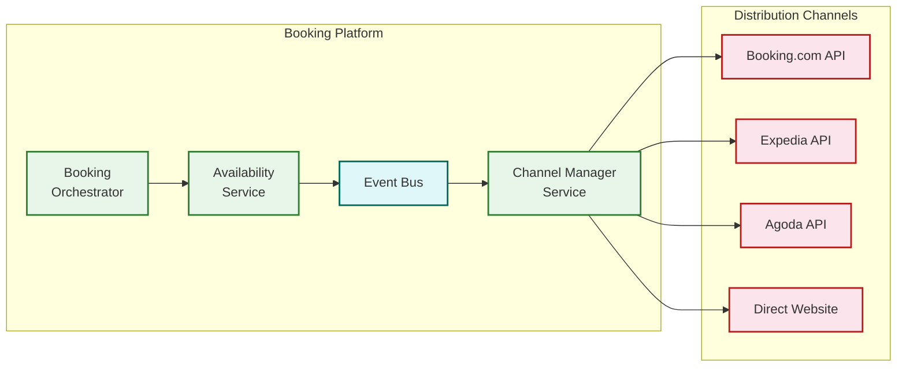

# Deep Dive & Bottlenecks

## 1. Availability Calendar Race Conditions

### The Problem

When two users simultaneously attempt to book the last available room for the same dates, the system faces a classic race condition. Unlike flight booking (where the GDS arbitrates), the hotel booking platform itself must resolve this contention since it is the authoritative inventory system.

**Scenario:**
```
Room inventory for Deluxe King, Dec 20:
  total_inventory: 15, booked_count: 14, held_count: 0
  sellable = 15 - 14 - 0 = 1 room left

User A reads: 1 room available → proceeds to hold
User B reads: 1 room available → proceeds to hold
Both execute hold at the same time → one must fail
```

### Solution: Atomic Conditional Update

The availability service uses an atomic conditional update pattern—no distributed locks, no two-phase commits. The database guarantees atomicity.

```
-- Both users attempt this simultaneously:
UPDATE room_date_inventory
SET held_count = held_count + 1,
    version = version + 1
WHERE property_id = 'P-1234'
  AND room_type_id = 'RT-5678'
  AND date = '2025-12-20'
  AND (total_inventory + overbooking_limit - booked_count - held_count) > 0

-- The WHERE clause is the guard: if sellable <= 0, zero rows updated
-- First UPDATE wins; second sees held_count already incremented → guard fails
```

### Multi-Date Atomicity

A 3-night stay must atomically decrement inventory across 3 dates. If Dec 20 and 21 are available but Dec 22 is sold out, the hold must fail entirely—no partial holds.

```
BEGIN TRANSACTION (SERIALIZABLE):
    FOR date IN [Dec 20, Dec 21, Dec 22]:
        result = UPDATE ... WHERE ... AND sellable > 0
        IF result.rows_affected == 0:
            ROLLBACK  -- all-or-nothing
            RETURN sold_out(date)
COMMIT
```

**Why SERIALIZABLE isolation?** With READ COMMITTED, a concurrent transaction could decrement Dec 22 between our check and our update. SERIALIZABLE prevents this phantom read at the cost of occasional serialization failures (which we retry).

### Retry Strategy

```
Serialization failures are expected under high contention.
Retry policy:
  max_retries: 3
  backoff: 50ms, 100ms, 200ms (with jitter)
  If all retries fail: return SOLD_OUT to user

This is safe because the hold operation is idempotent
(same idempotency_key prevents duplicate holds)
```

---

## 2. Overbooking Strategy

### Why Hotels Overbook

Hotels have a 5-10% no-show rate and a 35-40% pre-arrival cancellation rate. A 200-room hotel that sells exactly 200 rooms will, on average, have 10-20 empty rooms every night due to no-shows and last-minute cancellations. Intentional overbooking recaptures this lost revenue.

### The Overbooking Model

```
Inputs:
  total_rooms: 200
  historical_noshow_rate: 6% (seasonal, day-of-week adjusted)
  historical_late_cancel_rate: 4%
  walk_cost: average cost of relocating a walked guest ($300 + reputation damage)
  revenue_per_room: average room revenue ($200)

Calculation:
  expected_attrition = total_rooms × (noshow_rate + late_cancel_rate)
                     = 200 × 0.10 = 20 rooms

  optimal_overbook = rooms where marginal_revenue = marginal_walk_cost

  Using newsvendor model:
    P(walk) = walk_cost / (walk_cost + revenue_per_room)
            = 300 / (300 + 200) = 0.60

  We overbook until probability of needing to walk exceeds 0.60
  Using Poisson distribution of no-shows:
    With 210 bookings (10 overbooked):
      P(fewer than 10 no-shows) = poisson_cdf(9, lambda=20) = 0.0084 → very safe
    With 218 bookings (18 overbooked):
      P(fewer than 18 no-shows) = poisson_cdf(17, lambda=20) = 0.297 → acceptable
    With 222 bookings (22 overbooked):
      P(fewer than 22 no-shows) = poisson_cdf(21, lambda=20) = 0.644 → exceeds threshold

  Optimal overbook: ~218 bookings for 200 rooms (9% overbooking)
```

### Walk Policy (When Overbooking Goes Wrong)

When all rooms are physically occupied and an overbooked guest arrives:

1. **Detection**: Check-in service detects no available physical room for confirmed reservation
2. **Guest selection**: Walk the guest with lowest loyalty tier and cheapest rate (never walk loyalty platinum)
3. **Walk package**: Free night at comparable nearby hotel + transport + $100 credit + upgrade on return visit
4. **System update**: Mark reservation as WALKED, create compensation record, auto-book alternative hotel via partner API
5. **Analytics**: Track walk events by property to adjust overbooking model

---

## 3. Search Ranking Algorithm Deep Dive

### Ranking Factors

The search ranking algorithm determines which properties appear first. This directly impacts booking volume and is one of the most revenue-critical components.

| Factor | Weight | Signal Source | Update Frequency |
|--------|--------|--------------|------------------|
| Price competitiveness | 30% | Rate vs. market average for segment | Real-time |
| Review quality | 25% | Aggregate score × confidence (review count) | Daily |
| Conversion history | 20% | Bookings / views ratio (30-day rolling) | Hourly |
| Commission tier | 15% | Property's commission rate | Static (contract) |
| Freshness | 10% | Time since last availability update | Real-time |

### Anti-Manipulation Safeguards

Properties may attempt to game the ranking algorithm:

- **Rate manipulation**: Setting artificially low rates then charging extras at check-in → Detect by comparing advertised rate vs. total charge post-stay
- **Fake reviews**: Creating fake guest accounts to boost review score → Require verified stay + review fraud ML model
- **Availability manipulation**: Frequent open/close cycles to appear "fresh" → Discount freshness factor for properties with high availability churn
- **Commission gaming**: Raising commission before peak season → Cap commission influence; diminishing returns above 20%

### Search Index Architecture

```
Search query flow:
1. Parse destination → resolve to geo bounding box or polygon
2. Query search index: geo filter × property_type × star_rating × amenities
3. Returns candidate property IDs (up to 10,000)
4. Availability filter: batch check availability for candidates (parallel, sharded)
5. Rate computation: compute best rate for available properties
6. Price filter: apply user's budget constraint
7. Rank remaining properties by composite score
8. Return top N with pagination token
```

**Key optimization**: The availability check (step 4) is the most expensive step. We use a bloom filter of "definitely sold out" properties to skip availability checks for properties that have zero inventory for any date in the range. This bloom filter is rebuilt every 5 minutes and eliminates ~30% of candidate properties from the expensive availability check.

---

## 4. Channel Manager Synchronization

### The Consistency Challenge

A hotel lists rooms on Booking.com, Expedia, Agoda, and its direct website. When a guest books the last room on Booking.com, the other three channels must immediately reflect zero availability. If the update is delayed by even 30 seconds, another guest might book the same room on Expedia, creating a genuine overbook (beyond the hotel's tolerance).

### Architecture



### Sync Protocol

```
1. Booking confirmed → AvailabilityChanged event published to event bus
2. Channel Manager Service consumes event:
   a. Load current availability for affected property + room_type + dates
   b. For each mapped channel:
      - Build channel-specific payload (each OTA has different API format)
      - Send availability update via channel's API
      - Record sync result (success/failure/partial)
3. On channel API failure:
   - Retry with exponential backoff: 1s, 2s, 4s, 8s, 16s
   - After 5 failures: open circuit breaker for that channel (5 min)
   - Queue failed updates for retry when circuit closes
   - Alert operations if sync lag exceeds 60 seconds
4. On channel API success:
   - Update last_sync_at and last_sync_status
   - Log sync latency for monitoring
```

### Inbound Booking from Channels

When a booking originates from an external channel (e.g., a guest books on Expedia):

```
1. Channel sends booking notification via webhook/API
2. Channel Manager Service receives and validates
3. Availability Service: check and decrement inventory
   - If available: create reservation with booking_source = channel_expedia
   - If sold out: reject with SOLD_OUT, channel handles guest notification
4. Publish AvailabilityChanged event → sync to all OTHER channels
5. Notification Service: alert property manager of new channel booking
```

### Rate Parity Enforcement

Many hotel-OTA contracts require rate parity—the same rate on all channels. The system enforces this:

```
FUNCTION enforceRateParity(property_id, room_type_id, rate_plan_id):
    base_rate = LOAD ratePlan(rate_plan_id).base_rate
    channel_rates = LOAD allChannelRates(property_id, room_type_id)

    FOR EACH channel_rate IN channel_rates:
        IF ABS(channel_rate.rate - base_rate) / base_rate > 0.01:  // >1% deviation
            ALERT("Rate parity violation", property_id, channel, deviation)
            // Auto-correct or flag for manual review
```

---

## 5. Booking Confirmation with Payment

### Payment Flow

The booking system uses a **pre-authorization → capture** model to minimize financial risk.

```
Phase 1: Pre-Authorization (at booking time)
  - Reserve the amount on the guest's card without charging
  - Pre-auth hold typically lasts 7-14 days
  - If booking is cancelled within free period: release pre-auth (no charge)
  - Guest sees a "pending" charge on their statement

Phase 2: Capture (varies by property policy)
  Option A: Capture at booking (non-refundable rates)
    - Immediate capture after successful pre-auth
    - Guest is charged immediately
    - Refund required for any cancellation

  Option B: Capture at check-in (flexible rates)
    - Pre-auth holds the amount
    - Capture triggered on check-in day
    - Free cancellation releases the pre-auth

  Option C: Pay at property (no pre-auth)
    - No online payment processing
    - Guest pays at the hotel front desk
    - Higher no-show risk (mitigated by credit card guarantee)
```

### Dangerous Failure Mode: Payment Captured, Booking Not Confirmed

```
Scenario:
  1. Availability hold: SUCCESS
  2. Payment pre-auth: SUCCESS
  3. Payment capture: SUCCESS
  4. Create reservation record: FAILURE (database timeout)

  Result: Guest is charged $607.50 but has no booking

Resolution:
  - Outbox pattern: write payment success to outbox BEFORE attempting reservation
  - Recovery worker: scans outbox for un-confirmed payments every 30 seconds
  - On recovery: retry reservation creation (idempotent via idempotency_key)
  - If reservation creation permanently fails: refund payment + alert operations
  - Guest notification: "Your booking is being processed" (not "confirmed")
    until reservation record is created
```

### Idempotency

Every booking operation uses idempotency keys to prevent duplicate charges:

```
FUNCTION confirmBooking(booking_id, payment_token, idempotency_key):
    // Check if this request was already processed
    existing = LOAD idempotencyRecord(idempotency_key)
    IF existing:
        RETURN existing.response  // return same response as before

    // Process the booking
    result = processBooking(booking_id, payment_token)

    // Store idempotency record (TTL = 24 hours)
    STORE idempotencyRecord(idempotency_key, result, TTL = 24h)

    RETURN result
```

---

## 6. Date-Range Fragmentation Problem

### The Problem

Hotel inventory suffers from fragmentation: short gaps between reservations become unbookable.

```
Room 101 availability for December:
  Dec 1-5:   Reserved (Guest A)
  Dec 6:     Available ← 1-night gap
  Dec 7-12:  Reserved (Guest B)
  Dec 13-14: Available ← 2-night gap
  Dec 15-24: Reserved (Guest C)
  Dec 25-31: Available

Result: 10 available nights, but scattered across 3 fragments.
Most guests want 2+ night stays, so Dec 6 is effectively unsellable.
```

### Solutions

1. **Minimum stay restrictions**: Set min_stay = 2 for dates adjacent to existing bookings to prevent creating 1-night gaps
2. **Gap-filling rates**: Offer discounted rates for stays that fill exact gaps (e.g., 20% off for a Dec 6 one-night stay)
3. **Closed-to-arrival**: Close arrival on dates that would create sub-minimum fragments
4. **LOS pricing incentives**: Discount longer stays that span potential gaps

```
FUNCTION suggestRestrictions(property_id, room_type_id, month):
    inventory = LOAD monthlyInventory(property_id, room_type_id, month)
    suggestions = []

    FOR EACH gap IN findAvailabilityGaps(inventory):
        IF gap.length == 1:
            // 1-night gap: either close to arrival or offer gap-fill rate
            suggestions.APPEND({
                type: "close_to_arrival",
                date: gap.start,
                reason: "Prevents 1-night gap between reservations"
            })
        ELSE IF gap.length == 2:
            // 2-night gap: offer discounted rate
            suggestions.APPEND({
                type: "gap_fill_rate",
                dates: gap,
                discount: 15,
                reason: "Fill 2-night gap with discounted rate"
            })

    RETURN suggestions
```

---

## 7. Review System and Fraud Detection

### Verified Stay Reviews

Only guests with a completed stay can submit reviews:

```
Review eligibility:
  1. Reservation status must be CHECKED_OUT or COMPLETED
  2. Review window: check_out_date to check_out_date + 30 days
  3. One review per reservation (prevent duplicate reviews)
  4. Cannot review if reservation was a no-show
```

### Review Fraud Detection

```
Fraud signals:
  - Text similarity: review text matches other reviews (copy-paste)
  - Velocity: multiple reviews from same IP/device in short period
  - Sentiment mismatch: 10/10 score with negative sentiment text
  - Reviewer pattern: account only writes reviews for one property (shill)
  - Timing: review submitted within minutes of checkout (auto-generated)

Fraud score = weighted_sum(signals)
IF fraud_score > threshold:
    status = 'flagged' → manual moderation queue
ELSE:
    status = 'published' → visible immediately
```

### Review Aggregation

```
FUNCTION updatePropertyScore(property_id, new_review):
    // Weighted moving average (recent reviews count more)
    reviews = LOAD last200Reviews(property_id)

    FOR EACH category IN [cleanliness, comfort, location, facilities, staff, value]:
        weighted_sum = 0
        weight_total = 0
        FOR i, review IN enumerate(reviews):
            recency_weight = 1.0 - (i / count(reviews)) * 0.5  // 1.0 to 0.5
            weighted_sum += review[category] * recency_weight
            weight_total += recency_weight
        category_score = weighted_sum / weight_total

    overall = AVERAGE(all category scores)

    UPDATE property
    SET review_score = ROUND(overall, 1),
        review_count = review_count + 1
    WHERE property_id = property_id
```

---

## Bottleneck Summary

| Bottleneck | Root Cause | Mitigation |
|-----------|-----------|------------|
| **Last-room race condition** | Concurrent bookings for same room/date | Atomic conditional updates with serializable isolation |
| **Multi-date atomicity** | N-night booking must atomically decrement N dates | All-or-nothing transaction; SERIALIZABLE isolation level |
| **Channel sync latency** | Stale availability on other channels → cross-channel overbooking | Event-driven push < 5s; circuit breaker per channel; retry queue |
| **Search latency** | Availability check across thousands of properties for date range | Bloom filter for sold-out; sharded availability; parallel batch checks |
| **Overbooking accuracy** | No-show prediction model drift | Seasonal adjustment; property-level calibration; safety caps |
| **Date fragmentation** | 1-night gaps between reservations become unsellable | Min-stay restrictions; gap-fill rates; CTA (closed-to-arrival) rules |
| **Review fraud** | Fake reviews manipulate ranking | Verified-stay requirement; ML fraud detection; manual moderation |
| **Peak season contention** | Hot properties on popular dates → extreme write contention | Sharding by property isolates contention; retry with jitter |
