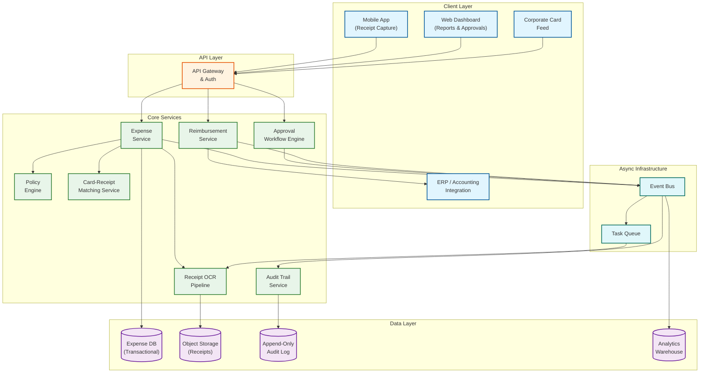
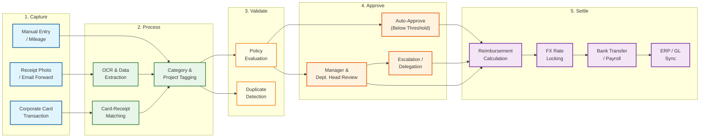

# Expense Management System Design

## System Overview

An expense management platform---exemplified by Expensify (SmartScan with 99% autonomous processing), Brex, Ramp, SAP Concur, and Navan---automates the entire lifecycle of corporate expenses: from receipt capture and AI-powered data extraction through policy validation, multi-level approval workflows, to reimbursement processing and ERP reconciliation. The core engineering challenge spans **receipt OCR and intelligent data extraction** (processing millions of receipt images daily through an ML pipeline that extracts merchant name, amount, currency, date, line items, and tax with >95% accuracy), **a declarative policy engine** (evaluating hundreds of company-specific expense rules---per diem limits, category restrictions, project budgets, manager hierarchies---in real time against each expense submission), **multi-level approval orchestration** (modeling complex corporate hierarchies where approval chains vary by expense amount, category, department, and geography, with support for delegation, escalation, and auto-approval thresholds), **corporate card real-time transaction matching** (reconciling card swipes with submitted receipts using temporal, amount, and merchant similarity scoring), **multi-currency reimbursement with FX rate locking** (converting expenses incurred in foreign currencies at policy-determined rates while handling split payments, mileage reimbursement, and per diem calculations), and **immutable audit trails for financial compliance** (maintaining SOX-grade, tamper-proof logs of every state transition for regulatory audits spanning 7+ years). Unlike generic accounting software that records transactions after the fact, an expense management system is an active policy enforcement layer that intercepts, validates, and routes financial claims before they become payable obligations.

---

## Key Characteristics

| Characteristic | Description |
|---------------|-------------|
| **Read/Write Pattern** | Write-heavy during submission windows (end-of-week/month surges); read-heavy for dashboards, reports, and audit queries |
| **Latency Sensitivity** | Medium---receipt OCR can be asynchronous (< 30s); policy checks and approval routing must be near-real-time (< 500ms) |
| **Consistency Model** | Strong consistency for approval state transitions and reimbursement amounts; eventual consistency for analytics dashboards and spend reports |
| **Financial Integrity** | Critical---reimbursement amounts must match approved expenses to the penny; duplicate detection must prevent double-reimbursement |
| **Data Volume** | Moderate-to-High---10M+ expense reports/month for enterprise platforms; 100M+ receipt images/year in cold storage |
| **Architecture Model** | Event-driven microservices with ML pipeline for receipt processing; workflow engine for approval orchestration; CQRS for reporting |
| **Regulatory Burden** | High---SOX audit trail requirements, IRS/HMRC substantiation rules, GDPR for employee PII, tax reclaim regulations (VAT/GST) |
| **Complexity Rating** | **High** |

---

## High-Level Architecture

---

## Expense Lifecycle Flow

The lifecycle divides into five phases, each with distinct latency and consistency requirements:

- **Capture** is optimized for mobile UX---snap a photo, forward an email, or let the card feed auto-populate. The system must accept input in under 2 seconds and queue heavy processing asynchronously.
- **Process** runs the ML pipeline (OCR, entity extraction, card matching) and is the most compute-intensive phase. This is where the 15-second latency budget for receipt processing is consumed.
- **Validate** evaluates company policy rules and checks for duplicate submissions. Policy evaluation must be deterministic and auditable---the same expense evaluated against the same policy version must always produce the same result.
- **Approve** orchestrates human decision-making through configurable workflows. This phase is measured in hours, not milliseconds, and the system must handle delegation, vacation out-of-office, and SLA-based escalation.
- **Settle** converts approved expenses into actual money movement---calculating reimbursement amounts, locking FX rates, initiating bank transfers, and syncing journal entries to the company's ERP/accounting system.

---

## Core Architectural Decisions

| Decision | Choice | Rationale |
|----------|--------|-----------|
| **OCR Processing Model** | Async queue-based with callback | Receipt processing is CPU/GPU-intensive (5--15s); synchronous processing would block the submission flow and degrade mobile UX |
| **Policy Engine Architecture** | Declarative rule DSL with version history | Rules change frequently (finance teams update policies quarterly); a DSL allows non-engineers to author rules; versioning ensures expenses are evaluated against the policy in effect at time of spend |
| **Approval Workflow Engine** | Durable state machine with event sourcing | Approval chains span hours/days; the engine must survive restarts; event sourcing provides a natural audit trail and enables replay for debugging and compliance |
| **Receipt Storage** | Object storage with CDN for thumbnails | Original receipt images are write-once, read-rarely (auditors); thumbnails are read-often (approvers reviewing reports); tiered storage minimizes cost over 7-year retention |
| **Audit Trail** | Append-only event log with materialized views | SOX requires immutable history; materialized views support efficient audit queries without compromising write-path append-only semantics |
| **Multi-Currency Handling** | Store original currency + conversion at approval | Storing only the converted amount loses information; storing the original with the applied rate and locking timestamp enables auditors to verify conversion correctness |
| **Card Transaction Matching** | Probabilistic scoring with human fallback | Exact matching fails due to merchant name variations and amount discrepancies; a confidence-scored approach with manual reconciliation queue balances automation with accuracy |
| **ERP Integration** | Event-driven with idempotent sync | ERPs vary widely (dozens of systems); event-driven decoupling with idempotent operations allows retries without double-posting journal entries |

---

## Quick Navigation

| Document | Description |
|----------|-------------|
| [01 - Requirements & Estimations](./01-requirements-and-estimations.md) | Functional/non-functional requirements, capacity planning, SLOs |
| [02 - High-Level Design](./02-high-level-design.md) | Architecture diagrams, data flow, key decisions |
| [03 - Low-Level Design](./03-low-level-design.md) | Data models, API design, algorithms (pseudocode) |
| [04 - Deep Dive & Bottlenecks](./04-deep-dive-and-bottlenecks.md) | OCR pipeline optimization, policy engine evaluation, approval workflow race conditions |
| [05 - Scalability & Reliability](./05-scalability-and-reliability.md) | Scaling strategies, fault tolerance, disaster recovery |
| [06 - Security & Compliance](./06-security-and-compliance.md) | Threat model, SOX compliance, data privacy, fraud prevention |
| [07 - Observability](./07-observability.md) | Metrics, logging, tracing, alerting, SLI/SLO dashboards |
| [08 - Interview Guide](./08-interview-guide.md) | 45-min pacing, trade-offs, trap questions, scoring rubric |
| [09 - Insights](./09-insights.md) | Key architectural insights, patterns, lessons |

---

## What Differentiates This from Related Systems

| Aspect | Expense Management (This) | Payment Gateway (8.2) | Accounting System | Procurement System | Digital Wallet (8.4) | Invoice/Billing System |
|--------|--------------------------|----------------------|-------------------|-------------------|---------------------|----------------------|
| **Primary Goal** | Validate and reimburse employee-incurred business expenses | Route payment transactions between merchants and banks | Record and reconcile all financial transactions post-facto | Manage purchasing lifecycle from requisition to vendor payment | Store and transfer funds between user accounts | Generate and collect payments owed to the business |
| **Policy Enforcement** | Core---every expense evaluated against company-specific rules before payment | Minimal---amount limits and fraud checks | None---records what happened | Pre-approval via purchase orders; budget checks | Spending limits on funded accounts | Payment terms and late fee policies |
| **Approval Workflow** | Multi-level with delegation, escalation, auto-approval thresholds | None---automated authorization | None---journal entries posted by authorized users | Requisition approval chain | None---instant transfers within limits | None---invoice sent directly |
| **Receipt/Document Processing** | Core---OCR, data extraction, duplicate detection, image storage | Not applicable | Scanned attachments (no extraction) | Purchase order matching | Not applicable | Invoice parsing for AP automation |
| **User Relationship** | Employer-to-employee (claimant submits, company reimburses) | Merchant-to-bank (payment routing) | Internal finance team | Buyer-to-vendor | Peer-to-peer or consumer-to-merchant | Business-to-customer |
| **Reimbursement** | Core function---calculates and disburses owed amounts | Not applicable (routes existing funds) | Records reimbursement as journal entry | Vendor payment upon goods receipt | Wallet-to-wallet transfer | Customer pays business |
| **Regulatory Focus** | IRS/HMRC substantiation, SOX audit trail, VAT reclaim, GDPR | PCI-DSS, PSD2 | GAAP/IFRS compliance | Contract compliance, vendor due diligence | Money transmitter licenses | Revenue recognition standards |

---

## What Makes This System Unique

1. **Receipt OCR Pipeline as a Core ML System**: Unlike systems that simply store uploaded files, an expense platform runs every receipt through a multi-stage ML pipeline---image pre-processing (deskew, contrast enhancement, noise removal), text extraction via OCR, entity recognition (merchant name, total amount, date, currency, tax breakdown, line items), and confidence scoring. The pipeline must handle receipts in 50+ languages, thermal-faded paper, crumpled photos taken at odd angles, multi-page hotel folios, and screenshots of digital receipts. At scale, this becomes a full computer vision and NLP platform with its own training data flywheel: human-corrected extractions feed back as labeled data for model improvement. The confidence score determines whether the extracted data is auto-populated (high confidence), presented for user confirmation (medium confidence), or flagged for manual entry (low confidence)---directly driving the automation rate that defines platform value.

2. **Policy Engine as a Declarative Rule Evaluator**: Each company configures hundreds of rules---daily meal limits by city tier ($75 in New York, $50 in Des Moines), mileage rates by vehicle type ($0.67/mile for personal car, $0.21/mile for company car), hotel caps by employee grade ($250/night for IC, $400/night for VP), entertainment spending requiring VP approval above $500, project-based budget constraints, blocked merchant categories (gambling, liquor stores). The policy engine must evaluate these rules at submission time with sub-second latency, provide clear violation explanations to the submitter ("Meal expense of $95 exceeds Tier-2 city daily limit of $75"), and support rule versioning so that expenses submitted under old policies are evaluated against the rules in effect at the time of spend. This is effectively a domain-specific rules engine with temporal semantics, and its design directly impacts whether finance teams trust the system enough to enable auto-approval.

3. **Multi-Level Approval Workflows with Delegation**: Corporate approval chains are non-trivial: an expense may require direct manager approval below $1,000, department head approval above $1,000, and CFO approval for amounts exceeding $10,000---with variations by category (travel vs. client entertainment vs. equipment). Managers go on vacation and delegate approval authority to peers or deputies. Expenses can be sent back for revision, partially approved, or split across cost centers. The workflow engine must model these as stateful, durable processes that survive service restarts and handle concurrent modifications safely (two approvers acting on the same report simultaneously). Escalation timers auto-route stale approvals after configurable SLA windows, and the entire chain must be reconstructable for audit purposes.

4. **Corporate Card Real-Time Transaction Matching**: When an employee uses a corporate card, the card network sends a transaction record (merchant ID, amount, timestamp, MCC code). The employee later submits a receipt for the same expense. The system must match these two records---but merchants report different names than what appears on receipts ("UBER *TRIP" vs. "Uber Technologies"), amounts may differ due to tips added after authorization or currency conversion fees, and timing gaps between card swipe and receipt submission can span days or weeks. The matching algorithm uses fuzzy merchant name comparison (edit distance + merchant category), amount-range tolerance (configurable per category), temporal proximity scoring, and employee context (location, travel schedule) to propose matches with confidence scores. Unmatched card transactions after 30 days trigger compliance alerts; unmatched receipts suggest potential duplicate reimbursement risk.

5. **Multi-Currency Reimbursement with FX Locking**: An employee in London pays for a dinner in euros, submits the receipt in GBP equivalent, and gets reimbursed in GBP---but the company reports in USD. The system must track the original transaction currency, apply the correct FX rate (company policy may mandate the card rate, the mid-market rate on the date of spend, or a monthly average rate), lock the rate at approval time to prevent reimbursement amount drift between approval and payment, and support split-currency scenarios where a single trip spans multiple countries. The FX rate source, locking timestamp, and conversion calculation must all be captured in the audit trail. For companies with operations in 30+ countries, the reimbursement engine effectively becomes a mini treasury management system with daily rate ingestion from multiple providers.

6. **Audit Trail as a First-Class Architectural Concern**: SOX compliance demands that every state transition---submission, edit, approval, rejection, reimbursement---is recorded in an immutable, tamper-evident log with the actor, timestamp, before/after values, and IP address. This is not a logging afterthought; it is an append-only event store that serves as the system of record for financial controls. Auditors must be able to reconstruct the complete history of any expense from submission to payment, including every policy evaluation result and approval decision, across a 7-year retention window. The audit store must support efficient range queries by time period, employee, cost center, and approval chain---meaning it needs both append-only write semantics and indexed read access, which pushes toward an event-sourced architecture with materialized audit views.

---

## Quick Reference: Scale Numbers

| Metric | Value | Notes |
|--------|-------|-------|
| Registered companies | ~100K | SMB to Fortune 500 enterprises |
| Active employees | ~20M | Employees submitting or approving expenses |
| Expense reports submitted/month | ~10M | Strong end-of-month and end-of-quarter spikes (3--5x baseline) |
| Individual expense line items/month | ~80M | Average 8 line items per report |
| Receipt images processed/month | ~60M | Including multi-page documents; average image size ~2 MB |
| OCR extraction accuracy | > 95% | Merchant, amount, date, currency fields |
| OCR processing latency (p95) | < 15s | From image upload to extracted data available |
| Policy evaluation latency (p99) | < 200ms | Per expense line item against all applicable rules |
| Approval workflow completion (median) | < 48 hours | From submission to final approval |
| Auto-approved expenses | ~40% | Expenses below policy thresholds with clean OCR and no violations |
| Corporate card transactions matched/month | ~30M | Automated matching success rate > 85% |
| Reimbursement processing cycle | 1--5 business days | From final approval to bank deposit |
| Peak submission rate | ~5,000 reports/min | Last day of month, last hour of business day |
| Receipt image storage | ~500 TB | 7-year retention; tiered to cold storage after 1 year |
| Supported currencies | 150+ | With daily FX rate ingestion from multiple providers |
| Audit log entries/month | ~500M | Every state change across all entities |
| Average report value | ~$850 | Varies widely: $20 parking to $15K international travel |
| Policy rules per company (median) | ~120 | Largest enterprises: 500+ active rules |
| ERP integration sync frequency | Near-real-time | Webhook or polling-based; batch export also supported |
| Duplicate receipt detection rate | > 92% | Using perceptual hashing + amount/date matching |

---

## Related Designs

| Design | Relevance |
|--------|-----------|
| [8.2 - Stripe/Razorpay](../8.2-stripe-razorpay/) | Payment processing for reimbursement disbursement, idempotency patterns, webhook integration |
| [8.4 - Digital Wallet](../8.4-digital-wallet/) | Double-entry ledger patterns, fund disbursement, balance reconciliation |
| [8.5 - Fraud Detection System](../8.5-fraud-detection-system/) | Duplicate receipt detection, anomalous spending pattern identification, ML scoring pipelines |
| [8.6 - Core Banking System](../8.6-distributed-ledger-core-banking/) | Ledger architecture, multi-currency accounting, regulatory compliance patterns |
| [4.1 - Notification System](../4.1-notification-system/) | Approval reminders, reimbursement confirmations, policy violation alerts |
| [1.5 - Distributed Log-Based Broker](../1.5-distributed-log-based-broker/) | Event streaming for audit trail, workflow state transitions, async OCR pipeline |

---

## Sources

- Expensify Engineering --- SmartScan: ML-Powered Receipt Processing at Scale
- SAP Concur --- Enterprise Expense Management Architecture Patterns
- Brex Engineering --- Real-Time Corporate Card Transaction Processing
- Ramp Engineering --- Building an Automated Expense Policy Engine
- Navan (TripActions) --- Unified Travel and Expense Platform Design
- IRS Publication 463 --- Travel, Gift, and Car Expense Substantiation Requirements
- HMRC --- Employee Expense Claims and Tax Relief Guidelines
- SOX Section 404 --- Internal Controls over Financial Reporting
- IATA BSP --- Corporate Travel Expense Data Standards
- GDPR Article 6 --- Lawful Basis for Processing Employee Financial Data
- Ernst & Young --- VAT/GST Reclaim Automation in Global Expense Management
