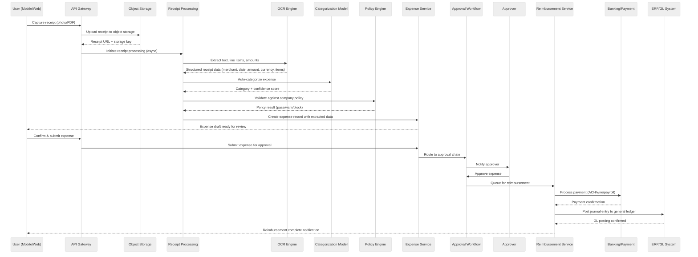
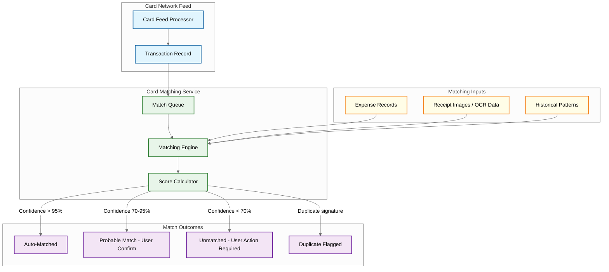

# High-Level Design

## Architecture Overview

The Expense Management System is decomposed into six logical layers: **Client Ingestion** (mobile app, web dashboard, email forwarding, corporate card feed), **API Gateway & Auth** (authentication, rate limiting, tenant isolation), **Core Domain Services** (expense lifecycle, receipt OCR pipeline, policy engine, approval workflow, reimbursement orchestration, card matching, reporting), **ML & Intelligence** (receipt OCR, auto-categorization, anomaly detection, duplicate detection), **Data Layer** (relational store, document store, object storage, cache, search index), and **External Integrations** (card networks, banking/payment rails, ERP/accounting systems, tax services). An event bus connects all services, enabling asynchronous processing: every expense state change emits an event consumed by downstream services for audit, analytics, and notifications.

---

## 1. System Architecture Diagram

```mermaid
%%{init: {'theme': 'neutral'}}%%
flowchart TB
    subgraph Clients["Client Ingestion Layer"]
        MOB[Mobile App]
        WEB[Web Dashboard]
        EMAIL[Email Ingestion Service]
        CARD[Card Feed Processor]
    end

    subgraph Gateway["API Gateway Layer"]
        AG[API Gateway]
        AUTH[Auth & Tenant Isolation]
        RL[Rate Limiter]
    end

    subgraph Core["Core Domain Services"]
        ES[Expense Service]
        RPS[Receipt Processing Service]
        PE[Policy Engine Service]
        AWS[Approval Workflow Service]
        RS[Reimbursement Service]
        CMS[Card Matching Service]
        RPT[Reporting Service]
    end

    subgraph ML["ML & Intelligence Pipeline"]
        OCR[Receipt OCR Engine]
        CAT[Categorization Model]
        AD[Anomaly Detection]
        DD[Duplicate Detection]
    end

    subgraph Data["Data Layer"]
        PDB[(Primary DB)]
        DDB[(Document Store)]
        OBJ[(Object Storage)]
        CACHE[(Cache Layer)]
        SIX[(Search Index)]
        EVT[[Event Bus]]
    end

    subgraph Integrations["External Integrations"]
        CN[Card Networks]
        BNK[Banking / Payment Rails]
        ERP[ERP / Accounting Systems]
        TAX[Tax Services]
        NP[Notification Providers]
    end

    MOB & WEB --> AG
    EMAIL --> AG
    CARD --> AG

    AG --> AUTH & RL
    AG --> ES & RPS & PE & AWS & RS & CMS & RPT

    RPS --> OCR --> CAT
    ES --> AD & DD

    ES --> PDB & CACHE
    RPS --> OBJ & DDB
    AWS --> PDB
    RS --> BNK
    CMS --> CN & PDB
    RPT --> SIX & CACHE
    PE --> CACHE & PDB

    ES & RPS & AWS & RS & CMS --> EVT
    EVT --> RPT & NP & ERP & TAX

    classDef client fill:#e1f5fe,stroke:#01579b,stroke-width:2px
    classDef gateway fill:#fff3e0,stroke:#e65100,stroke-width:2px
    classDef service fill:#e8f5e9,stroke:#2e7d32,stroke-width:2px
    classDef ml fill:#fffde7,stroke:#f57f17,stroke-width:2px
    classDef data fill:#f3e5f5,stroke:#6a1b9a,stroke-width:2px
    classDef external fill:#e0f7fa,stroke:#00695c,stroke-width:2px

    class MOB,WEB,EMAIL,CARD client
    class AG,AUTH,RL gateway
    class ES,RPS,PE,AWS,RS,CMS,RPT service
    class OCR,CAT,AD,DD ml
    class PDB,DDB,OBJ,CACHE,SIX,EVT data
    class CN,BNK,ERP,TAX,NP external
```



---

## 2. Data Flow: Expense Submission Path

This sequence covers the end-to-end lifecycle from receipt capture through reimbursement and general-ledger posting.



**Key design notes on the submission path:**

- **Receipt upload is decoupled from OCR processing.** The user gets an immediate upload confirmation while OCR runs asynchronously via a processing queue. This keeps the perceived latency under 2 seconds even for complex multi-page receipts.
- **Policy check happens twice**: once at draft creation (soft check, producing warnings) and once at submission (hard check, blocking policy violations).
- **The approval workflow is a state machine**, not a linear chain. It supports multi-level approvals, delegation, escalation, and auto-approval for expenses below configurable thresholds.

---

## 3. Data Flow: Corporate Card Transaction Matching

Corporate card transactions arrive via card network feeds and must be reconciled with user-submitted receipts. The matching engine runs continuously as new data arrives from either side.



**Matching algorithm (pseudocode):**

```
FUNCTION match_transaction(txn):
    candidates = query_expenses(
        date_range = [txn.date - 3_days, txn.date + 1_day],
        amount_range = [txn.amount * 0.95, txn.amount * 1.05],
        card_last_four = txn.card_last_four,
        status IN [DRAFT, SUBMITTED, UNMATCHED]
    )

    FOR EACH candidate IN candidates:
        score = 0
        score += amount_similarity(txn.amount, candidate.amount) * 0.35
        score += date_proximity(txn.date, candidate.date) * 0.20
        score += merchant_similarity(txn.merchant_name, candidate.merchant) * 0.25
        score += category_match(txn.mcc_code, candidate.category) * 0.10
        score += user_history_bonus(txn.card_holder, candidate.submitter) * 0.10

        IF is_duplicate(txn, candidate):
            RETURN MatchResult(DUPLICATE, candidate, score)

        candidate.match_score = score

    best = max(candidates, key=score)
    IF best.match_score > 0.95:
        RETURN MatchResult(AUTO_MATCHED, best, best.match_score)
    ELSE IF best.match_score > 0.70:
        RETURN MatchResult(PROBABLE, best, best.match_score)
    ELSE:
        RETURN MatchResult(UNMATCHED, null, 0)
```

**Card feed ingestion details:**
- Card networks push transaction files (ISO 8583 format) on a configurable cadence (real-time push for premium, batch files every 4--6 hours for standard).
- Each transaction record includes: card number (tokenized), merchant name, MCC code, amount, currency, authorization timestamp, and settlement status.
- The matching engine is idempotent -- re-processing the same feed file produces no duplicate matches.

---

## 4. Key Architectural Decisions

### 4.1 Microservices with Event-Driven Communication

| Option | Pros | Cons |
|--------|------|------|
| **Microservices + event bus** (chosen) | Independent scaling of OCR pipeline vs. approval workflow; fault isolation; team autonomy | Distributed transaction complexity; eventual consistency between services |
| Monolith with modules | Simpler deployment; strong consistency | Scaling bottleneck at OCR; single failure domain; slower team velocity |

**Decision**: Microservices with an event bus for cross-service communication. The expense lifecycle involves fundamentally different workload profiles (CPU-intensive OCR, I/O-heavy approval routing, latency-sensitive policy checks), making independent scaling essential. All state changes emit domain events (ExpenseCreated, ExpenseApproved, ReimbursementProcessed) consumed by interested services.

### 4.2 Async OCR Processing vs. Synchronous Policy Checks

| Option | Pros | Cons |
|--------|------|------|
| **Async OCR, sync policy** (chosen) | OCR latency hidden from user; policy response is immediate and blocking | Two-phase UX: user sees draft after OCR completes |
| Fully synchronous | Simpler mental model | OCR takes 3--8 seconds; unacceptable checkout latency |
| Fully asynchronous | Maximum throughput | User cannot see policy violations until later; poor UX |

**Decision**: Receipt OCR runs asynchronously via a processing queue. Once OCR completes and produces structured data, the policy engine evaluates synchronously before presenting the draft to the user. This balances throughput (OCR scales independently via queue consumers) with immediate feedback (policy violations surface before the user submits).

### 4.3 Policy Engine as a Separate Stateless Service

| Option | Pros | Cons |
|--------|------|------|
| **Dedicated stateless service** (chosen) | Policy rules cached in memory; sub-10ms evaluation; rules update independently of expense service | Additional service to operate; network hop |
| Embedded in expense service | No network latency; simpler deployment | Policy changes require expense service redeployment; cannot scale independently |

**Decision**: The policy engine is a stateless service that loads tenant-specific rule sets from cache on startup and refreshes via event subscription when administrators update policies. Rules are expressed in a DSL that supports conditions on amount, category, merchant, frequency, and custom fields. Evaluation is deterministic and auditable -- every policy check produces a trace showing which rules fired and why.

### 4.4 Approval Workflow as a State Machine

| Option | Pros | Cons |
|--------|------|------|
| **Persistent state machine** (chosen) | Explicit states and transitions; audit trail built in; supports complex routing | More upfront modeling; state explosion for edge cases |
| Ad-hoc status flags | Quick to implement | Hard to reason about valid transitions; audit gaps; race conditions |

**Decision**: Each expense's approval lifecycle is modeled as a persistent state machine with well-defined states (DRAFT, SUBMITTED, PENDING_APPROVAL, APPROVED, REJECTED, REIMBURSEMENT_QUEUED, REIMBURSED, POSTED). Transitions are guarded by preconditions and emit events. The workflow service supports configurable approval chains per tenant: sequential, parallel (all must approve), first-responder, amount-based escalation, and delegation with time-based auto-escalation.

### 4.5 CQRS for Reporting

| Option | Pros | Cons |
|--------|------|------|
| **CQRS (separate read store)** (chosen) | Reporting queries do not load the transactional database; pre-aggregated views for dashboards; search index for full-text queries | Eventual consistency (seconds); additional infrastructure |
| Single database for reads and writes | Simpler; strong consistency | Expensive analytical queries degrade write performance; cannot support faceted search |

**Decision**: Write operations target the primary relational database. An event consumer projects expense data into a search index (for full-text search across receipts, merchants, notes) and an analytics store (for aggregations, trend analysis, budget tracking). Dashboard queries hit the read store, keeping the write path fast. Consistency lag is typically under 2 seconds, acceptable for reporting use cases.

### 4.6 Object Storage for Receipts with CDN for Thumbnails

| Option | Pros | Cons |
|--------|------|------|
| **Object storage + CDN** (chosen) | Unlimited scale for receipt images; CDN-served thumbnails for fast list views; cost-effective | Additional infrastructure; URL signing for access control |
| Database BLOBs | Simpler access control; transactional consistency | Expensive storage; database backup bloat; slow retrieval |

**Decision**: Receipt images and PDFs are stored in object storage with server-side encryption. On upload, a thumbnail generation worker creates a 200px preview and stores it alongside the original. Thumbnails are served via a CDN with signed URLs (expiring tokens scoped to the requesting user's tenant). The expense record stores only the storage key and metadata, not the binary content.

---

## 5. Architecture Pattern Checklist

| Pattern | Applied | Rationale |
|---------|---------|-----------|
| **Microservices** | Yes | Independent scaling for OCR pipeline (compute-intensive), approval workflow (I/O-bound), and policy engine (latency-sensitive). Each service owns its data store. |
| **Event-Driven Architecture** | Yes | Domain events (ExpenseCreated, PolicyEvaluated, ApprovalCompleted, ReimbursementProcessed) decouple services. Enables audit logging, analytics projection, and notification dispatch without synchronous coupling. |
| **CQRS** | Yes | Transactional writes to relational DB; read projections to search index and analytics store for dashboards and reports. Prevents expensive aggregation queries from impacting write throughput. |
| **API Gateway** | Yes | Single entry point handling authentication (JWT + API key), tenant isolation (multi-tenant header injection), rate limiting (per-tenant quotas), and request routing to backend services. |
| **Async Processing (Queue-Based)** | Yes | Receipt OCR, thumbnail generation, card feed ingestion, and reimbursement batching all operate via work queues. Provides backpressure handling, retry semantics, and independent scaling of consumers. |
| **State Machine** | Yes | Approval workflow modeled as a persistent state machine with explicit transitions, guards, and event emission. Prevents invalid state transitions and provides a complete audit trail. |
| **Multi-Tenancy** | Yes | Tenant isolation at every layer: row-level security in the database, tenant-scoped cache keys, tenant-prefixed object storage paths, and tenant-aware policy engine rule sets. |
| **Object Storage + CDN** | Yes | Receipt images in object storage with encryption at rest. CDN-served thumbnails with signed URLs for fast, secure retrieval in expense list views. |
| **Search Index Projection** | Yes | Full-text search across receipt content, merchant names, expense notes, and custom fields. Projected from domain events with near-real-time freshness. |
| **Idempotency** | Yes | All service endpoints are idempotent (client-generated idempotency keys for expense creation, deduplication on card feed ingestion, exactly-once semantics for reimbursement processing). Critical for retry safety in distributed flows. |
| **Circuit Breaker** | Yes | Applied to external integrations (card networks, banking APIs, ERP connectors). Prevents cascading failures when downstream partners experience outages. Fallback: queue requests for retry when circuit opens. |

---

## Component Responsibilities

| Component | Responsibilities | Key Dependencies |
|-----------|-----------------|------------------|
| **Expense Service** | Create, update, and manage expense records; enforce data validation; coordinate with policy engine and approval workflow | Primary DB, Cache, Policy Engine, Approval Workflow |
| **Receipt Processing Service** | Orchestrate OCR pipeline; extract structured data from receipt images; generate thumbnails; store originals in object storage | Object Storage, OCR Engine, Categorization Model, Document Store |
| **Policy Engine Service** | Evaluate expenses against tenant-configured rules (amount limits, category restrictions, per-diem rates, receipt requirements); produce auditable evaluation traces | Cache (rule sets), Primary DB (policy config) |
| **Approval Workflow Service** | Route expenses through configurable approval chains; manage state transitions; handle delegation, escalation, and auto-approval; enforce time-based SLAs | Primary DB, Notification Providers, Expense Service |
| **Reimbursement Service** | Batch approved expenses for payment; orchestrate ACH/wire/payroll disbursement; reconcile payment status; post journal entries to ERP | Banking/Payment Rails, ERP Systems, Primary DB |
| **Card Matching Service** | Ingest corporate card transaction feeds; match transactions to submitted expenses using multi-signal scoring; flag duplicates and unmatched items | Card Networks, Primary DB, Expense Service |
| **Reporting Service** | Serve dashboard queries; generate expense reports (by department, category, period); provide budget utilization tracking; export to CSV/PDF | Search Index, Analytics Store, Cache |
| **ML Pipeline (OCR)** | Extract text and structured fields from receipt images using optical character recognition; handle multi-language, multi-currency receipts | Object Storage, GPU compute pool |
| **ML Pipeline (Categorization)** | Classify expenses into categories based on merchant name, MCC code, line items, and historical patterns | Feature Store, Model Registry |
| **ML Pipeline (Anomaly Detection)** | Flag unusual expenses based on user spending patterns, peer group analysis, and policy deviation scoring | Feature Store, Expense Service |
