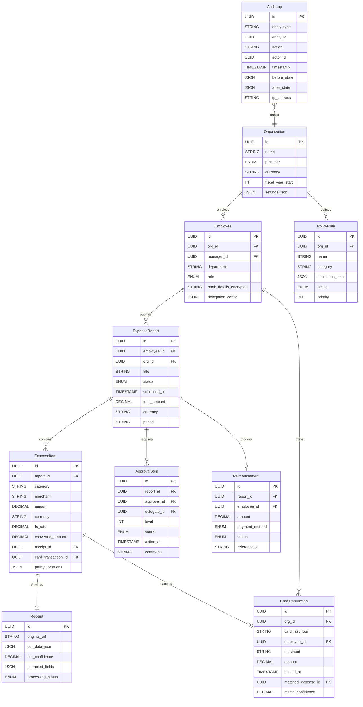
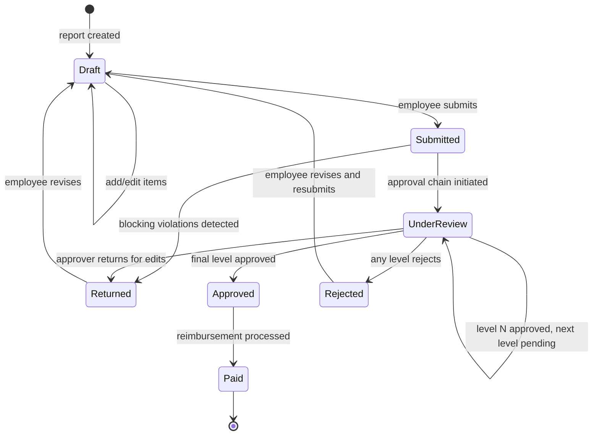

# Low-Level Design

## 1. Data Model



### Key Entity Details

```
Organization   { org_id UUID PK, name STRING, plan_tier ENUM(free|team|business|enterprise),
                 default_currency STRING, fiscal_year_start INT(1-12), settings_json JSON, status ENUM }
  INDEX: (status)

Employee       { employee_id UUID PK, org_id UUID FK, manager_id UUID FK (self-ref, nullable),
                 email STRING (encrypted), department STRING, cost_center STRING,
                 role ENUM(employee|manager|finance_admin|org_admin),
                 bank_details_enc STRING (encrypted), delegation_config JSON, daily_limit DECIMAL }
  INDEX: (org_id, department), (org_id, manager_id), (org_id, status)

ExpenseReport  { report_id UUID PK, employee_id UUID FK, org_id UUID FK, title STRING,
                 status ENUM(draft|submitted|under_review|approved|rejected|paid|returned),
                 submitted_at TIMESTAMP, approved_at TIMESTAMP, total_amount DECIMAL,
                 currency STRING, period_start DATE, period_end DATE, current_level INT }
  INDEX: (org_id, status, submitted_at), (employee_id, status)
  PARTITION: hash by org_id (64 partitions)

ExpenseItem    { item_id UUID PK, report_id UUID FK, category STRING, merchant STRING,
                 amount DECIMAL, currency STRING, fx_rate DECIMAL, converted_amount DECIMAL,
                 receipt_id UUID FK, card_transaction_id UUID FK, description STRING,
                 is_billable BOOLEAN, project_id STRING, policy_violations JSON, expense_date DATE }
  INDEX: (report_id, category), (card_transaction_id) UNIQUE WHERE NOT NULL

Receipt        { receipt_id UUID PK, org_id UUID FK, original_url STRING, thumbnail_url STRING,
                 ocr_data_json JSON, ocr_confidence DECIMAL(0-1), extracted_fields JSON,
                 processing_status ENUM(uploaded|processing|completed|failed), content_hash STRING }
  INDEX: (org_id, content_hash), (processing_status)

CardTransaction { transaction_id UUID PK, org_id UUID FK, card_last_four STRING,
                  employee_id UUID FK, merchant STRING, merchant_normalized STRING, mcc STRING,
                  amount DECIMAL, currency STRING, posted_at TIMESTAMP,
                  matched_expense_id UUID FK, match_confidence DECIMAL,
                  match_status ENUM(unmatched|auto_matched|manual_matched|excluded) }
  INDEX: (org_id, employee_id, match_status), (org_id, posted_at)

ApprovalStep   { step_id UUID PK, report_id UUID FK, approver_id UUID FK, delegate_id UUID FK,
                 level INT, status ENUM(pending|approved|rejected|skipped|escalated),
                 action_at TIMESTAMP, comments STRING }
  INDEX: (report_id, level), (approver_id, status)

PolicyRule     { rule_id UUID PK, org_id UUID FK, name STRING, category STRING,
                 conditions_json JSON, action ENUM(warn|block|require_extra_approval),
                 priority INT, message STRING, is_active BOOLEAN }
  INDEX: (org_id, is_active, category, priority)

Reimbursement  { reimbursement_id UUID PK, report_id UUID FK UNIQUE, employee_id UUID FK,
                 amount DECIMAL, currency STRING, payment_method ENUM(ach|wire|payroll|check),
                 status ENUM(pending|processing|completed|failed), batch_id STRING, reference_id STRING }
  INDEX: (employee_id, status), (batch_id), (status, created_at)

AuditLog       { log_id UUID PK, org_id UUID FK, entity_type STRING, entity_id UUID,
                 action STRING, actor_id UUID FK, timestamp TIMESTAMP,
                 before_state JSON, after_state JSON, ip_address STRING }
  INDEX: (org_id, entity_type, entity_id, timestamp)
  PARTITION: monthly range by timestamp (auto-drop after 7 years)
```

---

## 2. Indexing Strategy

| Table | Index | Rationale |
|-------|-------|-----------|
| ExpenseReport | `(org_id, status, submitted_at)` | Dashboard: "all pending reports for my org" |
| ExpenseReport | `(employee_id, status)` | Employee view: "my reports" |
| CardTransaction | `(org_id, employee_id, match_status)` | Unmatched card feed per employee |
| ApprovalStep | `(approver_id, status)` | Approver inbox query |
| AuditLog | `(org_id, entity_type, entity_id, timestamp)` | Compliance audit trail |
| Receipt | `(org_id, content_hash)` | Duplicate receipt detection |

**Partition strategy:** Transactional tables hash-partitioned by `org_id` for tenant isolation. AuditLog uses monthly range partitions for retention management.

---

## 3. API Design

```
POST /v1/expenses/reports
Body: { title, currency, period_start, period_end }
Response 201: { report_id, status: "draft" }

POST /v1/expenses/items
Body: { report_id, category, merchant, amount, currency, expense_date, description, is_billable, project_id }
Response 201: { item_id, policy_violations: [{ rule_id, severity, message }] }

POST /v1/expenses/items/{id}/receipt
Headers: Content-Type: multipart/form-data
Body: { file: <image_binary> }
Response 202: { receipt_id, processing_status: "processing" }

POST /v1/expenses/reports/{id}/submit
Response 200: { report_id, status: "submitted", approval_chain: [{ level, approver, status }] }
Response 422: { error: "submission_blocked", violations: [{ item_id, rule_id, message }] }

POST /v1/expenses/reports/{id}/approve
Body: { action: "approve"|"reject"|"return", comments }
Response 200: { report_id, status, next_approver }

GET /v1/expenses/reports?status={s}&period={p}&cursor={c}
Response 200: { reports: [{ report_id, title, employee, status, total_amount, item_count }], pagination }

GET /v1/expenses/card-transactions?unmatched=true&employee_id={id}
Response 200: { transactions: [{ transaction_id, merchant, amount, suggested_matches: [{ item_id, confidence }] }] }

POST /v1/expenses/card-transactions/{id}/match
Body: { expense_item_id }
Response 200: { transaction_id, matched_expense_id, match_status: "manual_matched" }

GET /v1/policies/evaluate?expense_item_id={id}
Response 200: { violations: [{ rule_id, action, message }], can_submit: BOOLEAN }
```

---

## 4. Core Algorithms

### Receipt OCR Extraction Pipeline

```
FUNCTION process_receipt(receipt_id, image_bytes):
    normalized = normalize_image(image_bytes)        -- deskew, crop, enhance contrast
    content_hash = SHA256(image_bytes)

    -- Duplicate detection
    existing = QUERY Receipt WHERE org_id = current_org AND content_hash = content_hash
    IF existing: RETURN { status: "duplicate", original_receipt_id: existing.receipt_id }

    -- OCR + field extraction
    ocr_raw = ocr_service.extract_text(normalized)
    extracted = {
        merchant:   extract_merchant(ocr_raw.text_blocks),
        amount:     extract_amount(ocr_raw.text_blocks),
        currency:   extract_currency(ocr_raw.text_blocks),
        date:       extract_date(ocr_raw.text_blocks),
        tax:        extract_tax(ocr_raw.text_blocks),
        line_items: extract_line_items(ocr_raw.text_blocks)
    }

    -- Per-field confidence scoring
    FOR EACH field IN extracted:
        field.confidence = compute_field_confidence(ocr_raw, field)

    UPDATE Receipt SET ocr_data_json = ocr_raw, ocr_confidence = ocr_raw.overall_confidence,
        extracted_fields = extracted, content_hash = content_hash, processing_status = "completed"
    RETURN { receipt_id, extracted, confidence: ocr_raw.overall_confidence }
```

### Policy Evaluation Engine

```
FUNCTION evaluate_policies(expense_item, org_id):
    rules = QUERY PolicyRule WHERE org_id = org_id AND is_active = true
        AND (category = expense_item.category OR category = "*") ORDER BY priority ASC

    violations = []
    has_blocker = false

    FOR EACH rule IN rules:
        conditions = PARSE(rule.conditions_json)
        matched = ALL(evaluate_condition(expense_item, c) FOR c IN conditions)

        IF matched:
            violations.APPEND({ rule_id: rule.rule_id, severity: rule.action, message: rule.message })
            IF rule.action == "block": has_blocker = true

    UPDATE ExpenseItem SET policy_violations = violations WHERE item_id = expense_item.item_id
    RETURN { violations, can_submit: NOT has_blocker }

FUNCTION evaluate_condition(item, condition):
    value = GET_FIELD(item, condition.field)
    SWITCH condition.operator:
        "gt": RETURN value > condition.value       "lt": RETURN value < condition.value
        "eq": RETURN value == condition.value       "in": RETURN value IN condition.value
        "missing": RETURN value IS NULL
```

### Card-Receipt Matching Algorithm

```
FUNCTION match_card_transactions(org_id, employee_id):
    unmatched_txns = QUERY CardTransaction WHERE org_id = org_id AND employee_id = employee_id
        AND match_status = "unmatched"
    unmatched_items = QUERY ExpenseItem ei JOIN ExpenseReport er ON ei.report_id = er.report_id
        WHERE er.org_id = org_id AND er.employee_id = employee_id AND ei.card_transaction_id IS NULL

    FOR EACH txn IN unmatched_txns:
        best_match, best_score = NULL, 0.0

        FOR EACH item IN unmatched_items:
            score = 0.0
            -- Amount (weight 0.40): exact=0.40, within 2%=0.35, within 10%=0.15
            amount_diff = ABS(txn.amount - item.converted_amount) / txn.amount
            score += (0.40 IF amount_diff == 0, 0.35 IF < 0.02, 0.15 IF < 0.10, ELSE 0)
            -- Merchant (weight 0.35): fuzzy string similarity
            score += 0.35 * fuzzy_match(txn.merchant_normalized, item.merchant)
            -- Date (weight 0.25): same day=0.25, +/-1d=0.20, +/-3d=0.10
            day_diff = ABS(DAYS_BETWEEN(txn.posted_at, item.expense_date))
            score += (0.25 IF day_diff == 0, 0.20 IF <= 1, 0.10 IF <= 3, ELSE 0)

            IF score > best_score: best_match, best_score = item, score

        IF best_score >= 0.85:  -- auto-match
            LINK(txn, best_match, "auto_matched", best_score)
            unmatched_items.REMOVE(best_match)
        ELSE IF best_score >= 0.60:  -- suggest for manual review
            SUGGEST(txn, best_match, best_score)
```

### Approval Routing Algorithm

```
FUNCTION route_for_approval(report):
    org = GET Organization(report.org_id)
    submitter = GET Employee(report.employee_id)
    chain = []
    level = 1

    -- Level 1: Direct manager (with delegation support)
    manager = GET Employee(submitter.manager_id)
    IF manager IS NOT NULL:
        approver = resolve_delegate(manager)
        chain.APPEND(ApprovalStep(report.report_id, approver.id, level, "pending"))
        level += 1

    -- Level 2: Finance (if amount > finance_threshold)
    IF report.total_amount > org.settings_json.finance_approval_threshold:
        finance = QUERY Employee WHERE org_id = org.org_id AND role = "finance_admin" LIMIT 1
        chain.APPEND(ApprovalStep(report.report_id, finance.id, level, "waiting"))
        level += 1

    -- Level 3: Executive (if amount > executive_threshold)
    IF report.total_amount > org.settings_json.executive_approval_threshold:
        exec = find_department_head(submitter.department, org.org_id)
        chain.APPEND(ApprovalStep(report.report_id, exec.id, level, "waiting"))

    BATCH INSERT chain
    UPDATE ExpenseReport SET status = "submitted", current_level = 1
    notify(chain[0].approver_id, "approval_requested", report)
    RETURN chain

FUNCTION resolve_delegate(employee):
    cfg = employee.delegation_config
    IF cfg AND cfg.delegate_to AND NOW() BETWEEN cfg.valid_from AND cfg.valid_until:
        RETURN GET Employee(cfg.delegate_to)
    RETURN employee
```

### FX Rate Conversion with Locking

```
FUNCTION convert_expense_currency(item, report_currency):
    IF item.currency == report_currency:
        item.fx_rate, item.converted_amount = 1.0, item.amount
        RETURN

    rate = fx_cache.GET(item.currency + "_" + report_currency)
    IF rate IS NULL OR rate.fetched_at < NOW() - 15_MINUTES:
        rate = fx_provider.get_rate(item.currency, report_currency)
        fx_cache.SET(item.currency + "_" + report_currency, rate, TTL=15_MINUTES)

    item.fx_rate = rate.mid_rate
    item.converted_amount = ROUND(item.amount * rate.mid_rate, 2)
    audit_log("fx_rate_locked", item.item_id, { rate: rate.mid_rate, pair: item.currency + "/" + report_currency })
```

---

## 5. State Diagram: Expense Report Lifecycle



**Escalation rules:** Reminder after 48h of inaction, escalate to approver's manager after 96h, fall back to `finance_admin` role if escalation target is unavailable.
