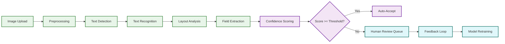
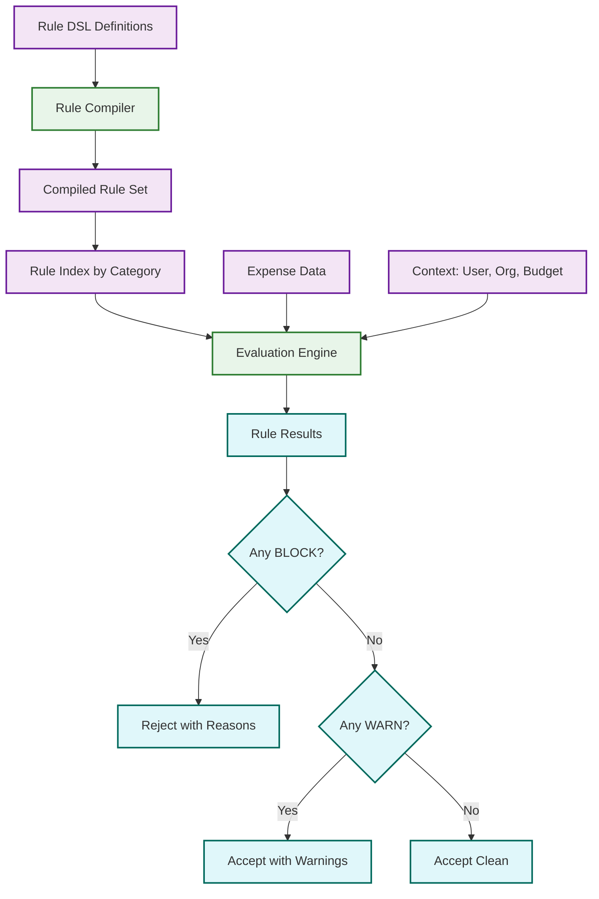
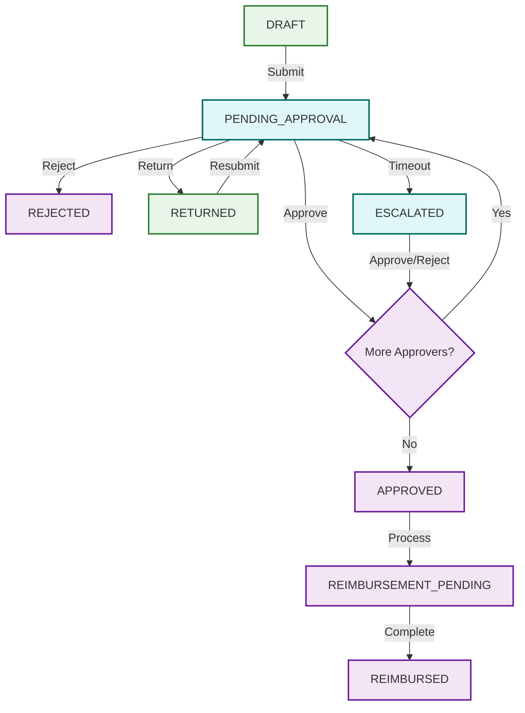

# Deep Dive & Bottlenecks

## 1. Receipt OCR & Data Extraction Pipeline

### The Problem

Receipt data extraction is the core differentiator of any expense management platform. Accuracy directly determines the automation rate---if the system extracts merchant name, amount, date, tax, and line items correctly, expenses are auto-categorized and submitted without human intervention. Below 90% field-level accuracy, users lose trust and manually re-enter data, defeating the platform's value proposition. The target is 95%+ field-level accuracy with < 30 second end-to-end processing time.

### Multi-Stage Pipeline Architecture



**Stage 1: Image Preprocessing (50--200ms)** --- Deskewing via Hough line detection, adaptive histogram equalization, noise reduction, resolution normalization to 300 DPI. Improves downstream accuracy by 15--20%.

**Stage 2: Text Detection (100--300ms)** --- CRAFT or EAST detectors produce bounding boxes ordered by spatial position (top-to-bottom, left-to-right).

**Stage 3: Text Recognition (200--500ms)** --- Transformer-based recognizers process each detected region in parallel, handling variable-length text, multiple fonts, and degraded quality.

**Stage 4: Layout Analysis + Field Extraction (100--300ms)** --- A multi-modal transformer (LayoutLMv3 architecture) processes text, 2D positional layout, and raw image simultaneously. It learns spatial patterns---"TOTAL" at bottom-left followed by a number at bottom-right represents the transaction amount---without explicit templates.

```
FUNCTION extract_fields(receipt_image):
    normalized = deskew(enhance_contrast(receipt_image))
    tokens = detect_and_recognize_text(normalized)
    layout = extract_2d_positions(tokens)

    -- LayoutLMv3 joint inference over text + layout + image
    field_predictions = layout_model.predict(
        text_tokens = tokens,
        bounding_boxes = layout,
        image_patches = normalized
    )

    result = {
        merchant:   field_predictions["merchant"],
        amount:     parse_currency(field_predictions["total"]),
        date:       parse_date(field_predictions["date"]),
        tax:        parse_currency(field_predictions["tax"]),
        line_items: extract_line_items(field_predictions),
        currency:   detect_currency(field_predictions)
    }

    FOR EACH field IN result:
        field.confidence = field_predictions.confidence(field.name)

    RETURN result
```

### Failure Modes

| Failure Mode | Frequency | Mitigation |
|-------------|-----------|------------|
| Blurry / out-of-focus images | 15% | Client-side blur detection before upload; prompt retake |
| Crumpled / folded receipts | 8% | Multi-pass detection with different contrast settings |
| Handwritten receipts | 5% | Route directly to human review; specialized handwriting model |
| Multi-language receipts | 12% | Language detection per text region; language-specific models |
| Thermal paper fading | 10% | Infrared preprocessing to recover faded thermal print |

### Confidence Scoring and Human-in-the-Loop

Each extracted field receives an independent confidence score (0.0--1.0):

- **High confidence (>= 0.95)**: Auto-accept without review.
- **Medium confidence (0.70--0.94)**: Auto-accept with visual highlight for user verification.
- **Low confidence (< 0.70)**: Route to human review queue.

Every human correction becomes a labeled training example. Weekly model retraining on corrected data pushes accuracy upward---mature deployments achieve 97%+ auto-acceptance rates after 6--12 months.

---

## 2. Policy Engine

### The Problem

Enterprise expense policies span hundreds of rules---per-diem rates by city, category limits, merchant restrictions, project budget caps, receipt thresholds, and time constraints. The policy engine must evaluate all applicable rules per expense in real-time (< 200ms), and ideally at point-of-purchase for corporate card transactions.

### Declarative Rule DSL

```
RULE "meal_limit_domestic"
    WHEN expense.category = "meals"
     AND expense.location.country = "domestic"
    THEN BLOCK IF expense.amount > 75.00
    MESSAGE "Meal expenses over $75 require VP approval"

RULE "receipt_required"
    WHEN expense.amount > 25.00
     AND expense.receipt IS NULL
    THEN WARN
    MESSAGE "Receipt required for expenses over $25"

RULE "per_diem_check"
    WHEN expense.category = "meals" AND expense.type = "per_diem"
    THEN BLOCK IF expense.amount > per_diem_rate(expense.location.city, expense.date)
    MESSAGE "Exceeds per diem rate for {city}"
```

### Rule Compilation and Evaluation



**Rule Compiler** parses DSL into an optimized evaluation tree indexed by category and type, reducing a 500-rule policy to ~20--40 applicable rules per evaluation. BLOCK rules are evaluated first with short-circuit; WARN violations are collected. Duplicate detection runs as a cross-expense rule with 90-day lookback.

```
FUNCTION evaluate_policy(expense, user, org):
    policy_version = org.active_policy_version
    rules = get_compiled_rules(org.id, policy_version)
    applicable = rules.filter_by(
        category = expense.category, user_role = user.role
    )

    -- Short-circuit on first BLOCK
    FOR EACH rule IN applicable WHERE rule.action = BLOCK:
        IF rule.evaluate(expense, user, org.context):
            RETURN PolicyResult(BLOCKED, [rule.violation_detail], policy_version)

    -- Collect all WARNs
    violations = []
    FOR EACH rule IN applicable WHERE rule.action = WARN:
        IF rule.evaluate(expense, user, org.context):
            violations.append(rule.violation_detail)

    duplicate = check_duplicate(expense, user, lookback_days=90)
    IF duplicate.found:
        violations.append(duplicate_warning(duplicate.match))

    RETURN PolicyResult(
        ACCEPTED_WITH_WARNINGS IF violations ELSE ACCEPTED,
        violations, policy_version
    )
```

The evaluation engine is **stateless**---horizontally scalable without coordination. Compiled rule sets are cached per instance with pub/sub invalidation on policy update.

**Failure modes**: Rule conflicts (detected by compiler at save time), policy version drift during submission (mitigated by snapshotting policy version at report creation), and budget lookup timeouts (fall back to cached budget with warning).

### Real-Time Checks at Point-of-Purchase

For corporate card authorization, the policy engine evaluates within the 2-second card network window: map MCC code to expense category, run applicable rules, return approve/decline. Requires p99 < 500ms, achieved by pre-compiled rules and in-memory context caching.

---

## 3. Approval Workflow Engine

### The Problem

Approval workflows must reflect real organizational hierarchies: sequential approval (manager then finance), parallel approval (project lead AND department head), conditional routing (over $5K goes to VP), delegation, escalation, and out-of-office handling.

### State Machine Design



### Delegation with Cycle Detection

```
FUNCTION resolve_approver(original_approver, report):
    visited = SET()
    current = original_approver

    WHILE current.has_active_delegation():
        IF current.id IN visited:
            LOG_WARNING("Delegation cycle detected", visited)
            RETURN original_approver.manager
        visited.add(current.id)
        delegate = current.active_delegate
        IF delegate.can_approve(report.amount, report.department):
            current = delegate
        ELSE:
            BREAK  -- delegate lacks authority

    IF current.is_out_of_office() AND current.ooo_delegate IS NOT NULL:
        RETURN current.ooo_delegate
    RETURN current
```

Max delegation depth is capped at 5. Escalation follows a deterministic path: reminder on Day 2, warning on Day 3, auto-escalate to approver's manager on Day 4, finance admin notification on Day 7.

### Race Condition: Concurrent Approval Actions

**Scenario**: Two parallel approvers click "Approve" simultaneously. Both writes succeed, potentially skipping a required step or triggering duplicate reimbursement.

**Solution**: Optimistic locking with version checks.

```
FUNCTION approve_report(report_id, approver_id, expected_version):
    rows_updated = UPDATE approval_steps
        SET status = 'APPROVED', approved_by = approver_id,
            approved_at = NOW(), version = expected_version + 1
        WHERE report_id = report_id
          AND approver_id = approver_id
          AND version = expected_version
          AND status = 'PENDING'

    IF rows_updated = 0:
        RETURN ConflictError("Approval state changed, please refresh")

    pending = COUNT(*) FROM approval_steps
        WHERE report_id = report_id AND status = 'PENDING'
    IF pending = 0:
        transition_report(report_id, 'APPROVED')
        enqueue_reimbursement(report_id)
```

---

## 4. Concurrency & Race Conditions

| Race Condition | Trigger | Resolution |
|---------------|---------|------------|
| **Double approval** | Two approvers act simultaneously | Optimistic locking with version check on approval_step row |
| **Receipt upload during OCR** | New upload while previous is processing | Idempotent processing keyed on `expense_id + upload_timestamp`; latest wins |
| **Card transaction double-claim** | Manual expense created while auto-match runs | Atomic claim: `UPDATE card_transactions SET claimed_by = expense_id WHERE claimed_by IS NULL` |
| **Policy change during submission** | Admin updates policy mid-report | Snapshot policy version at report creation; all expenses use same version |
| **Concurrent expense edits** | Mobile + web edits on same expense | Optimistic concurrency via `updated_at` timestamp comparison |
| **Budget exhaustion** | Two reports exhaust same project budget simultaneously | Pessimistic lock on budget row during evaluation; short-lived (< 200ms) |

---

## 5. Bottleneck Analysis

### Bottleneck 1: OCR Pipeline Throughput During Month-End Surge

**The problem**: 60--70% of receipts are uploaded in the last 3 days of the month. A platform processing 500K receipts/month sees 15K--20K/day during surge (vs. 2K/day mid-month), with lunch-hour spikes hitting 5--10x the hourly average.

**Why it matters**: Each receipt requires ~2 seconds of GPU time. The OCR pipeline, requiring GPU-accelerated inference, becomes the primary throughput constraint.

**Mitigations**:
- **Auto-scaling GPU pool**: Scale on queue depth, not CPU. Trigger scale-up when queue > 100 items or p95 wait > 30s.
- **Priority tiers**: Reports near approval deadlines processed first; bulk uploads (email forwarding, bank feed) at lower priority.
- **Client-side preprocessing**: Blur detection, orientation correction on-device reduces server processing by ~40%.
- **Batch inference**: Group 8--16 receipts per GPU batch, improving utilization from ~40% to ~85%.

### Bottleneck 2: Policy Engine for Complex Multi-Rule Organizations

**The problem**: Large enterprises with 300--500 rules across countries, departments, and project codes. A 50-line-item report requires 2,000 rule evaluations. At month-end, 10K reports/hour produces 20M evaluations/hour. Policy evaluation is synchronous---over 500ms feels sluggish; for card authorization the budget is < 200ms.

**Mitigations**:
- **Rule indexing**: Pre-index by category, country, department. Reduces 500 rules to ~20 per evaluation.
- **Short-circuit**: Stop on first BLOCK violation.
- **Compiled rule cache**: 99%+ cache hit rate; policies change weekly at most.
- **Async budget checks**: Non-blocking budget rules evaluated post-submission with async warning attachment.

### Bottleneck 3: Reimbursement Batch Processing and Bank Integration

**The problem**: Banking APIs have strict rate limits (50--200 TPS), batch windows (ACH cutoff at 4 PM for next-day processing), and reconciliation requirements. 50K reimbursements/month concentrated in the last week creates severe batching pressure.

**Why it matters**: Missed ACH cutoffs delay payments by a full business day. Failed transfers require manual re-submission.

**Mitigations**:
- **Rolling batches**: Submit 500--1,000 transfers every 15 minutes throughout the day instead of one massive batch at cutoff.
- **Pre-validation**: Validate bank account details when employees add accounts, not at reimbursement time. Eliminates ~5% of failures.
- **Multi-rail routing**: ACH (standard), same-day ACH (urgent), wire (international). Route by amount, urgency, and destination.
- **Idempotent transfer keys**: Key on `report_id + approval_version`. Crash replay cannot produce double payments.

---

## 6. Failure Modes and Graceful Degradation

| Failure | Impact | Graceful Degradation |
|---------|--------|---------------------|
| OCR service down | Receipts cannot be processed | Accept uploads; queue for processing; allow manual entry as fallback |
| Policy engine unavailable | Cannot validate at submission | Allow submission with "pending policy check"; evaluate async on recovery |
| Approval service down | Reports stuck in pending | Queue approval actions; extend SLA timers; process on recovery |
| Bank API unavailable | Reimbursements blocked | Queue transfers; notify finance team; process on recovery |
| Card network webhook delay | Real-time transactions unmatched | Hourly batch reconciliation catches unmatched transactions |
| Budget service timeout | Cannot enforce budget limits | Accept with "budget check pending" warning; async reconciliation flags overruns |
