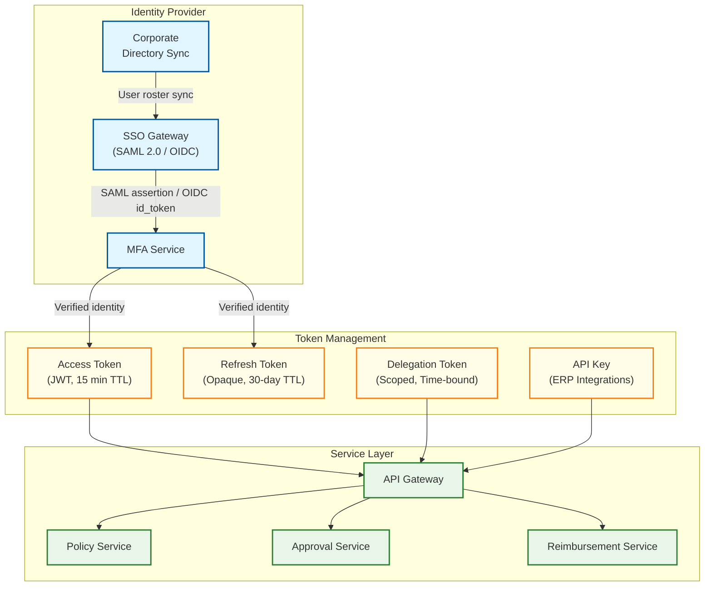

# Security & Compliance

## Authentication & Authorization

### Authentication Architecture



### SSO and Identity Federation

```
Enterprise SSO flow:
  1. Employee navigates to expense app → redirected to corporate IdP
  2. IdP authenticates via SAML 2.0 or OIDC
  3. SAML assertion / OIDC id_token returned with:
     - Employee ID, email, department, cost center
     - Group memberships (maps to roles)
     - Manager chain (maps to approval hierarchy)
  4. Expense platform validates assertion signature against IdP metadata
  5. Issues internal JWT access token (15-min TTL) + opaque refresh token (30-day TTL)
  6. Directory sync runs hourly: new hires provisioned, terminated employees revoked

Token claims (JWT payload):
  - sub: employee_id
  - org: company_id
  - roles: ["employee", "approver"]
  - dept: "engineering"
  - cost_center: "CC-4200"
  - manager_id: "emp_892"
  - delegation_from: null (populated when acting as delegate)
  - exp: token_expiry_timestamp
```

### Role-Based Access Control (RBAC)

| Role | Own Expenses | Dept. Expenses | All Expenses | Approve | Reimburse | Policy Admin | Audit |
|------|-------------|---------------|-------------|---------|-----------|-------------|-------|
| **Employee** | View, Create, Edit (draft) | — | — | — | — | — | — |
| **Approver** | View, Create | View direct reports | — | Yes (direct reports) | — | — | — |
| **Finance Manager** | View, Create | View own dept. | View all | Yes (escalated) | Initiate | View | — |
| **Admin** | View, Create | View all | View all | Yes (any) | Approve | Full | — |
| **Auditor** | — | — | Read-only all | — | — | Read-only | Full |
| **ERP Service** | — | — | Read (approved) | — | — | — | Read |

### Fine-Grained Permission Model

```
Permission namespace: expense:{action}:{scope}

Permissions:
  expense:view:own           — See own submitted expenses
  expense:view:department    — See all expenses in own department
  expense:view:all           — See all expenses across the organization
  expense:create:own         — Submit new expenses
  expense:edit:draft         — Modify expenses in draft state only
  expense:approve:direct     — Approve expenses from direct reports
  expense:approve:department — Approve any expense within department
  expense:approve:all        — Approve any expense (admin override)
  expense:reimburse:initiate — Trigger reimbursement batch
  expense:reimburse:approve  — Approve reimbursement disbursement
  policy:view                — View active expense policies
  policy:edit                — Create and modify expense policy rules
  audit:read                 — Query audit trail records
  audit:export               — Export audit data for compliance reviews
  report:generate            — Generate spend analytics reports

Role-to-permission mapping evaluated at API gateway:
  FUNCTION authorize(user, action, resource):
      permissions = RESOLVE_PERMISSIONS(user.roles)
      IF action NOT IN permissions:
          RETURN DENIED("Insufficient permissions")
      scope = EXTRACT_SCOPE(action)
      IF scope == "own" AND resource.submitter_id != user.id:
          RETURN DENIED("Cannot access other users' expenses")
      IF scope == "department" AND resource.dept != user.dept:
          RETURN DENIED("Cross-department access denied")
      RETURN ALLOWED
```

### Delegation Tokens

```
Delegation scenario: Manager going on vacation delegates approval authority

FUNCTION create_delegation(delegator, delegate, scope, duration):
    VALIDATE delegator.role INCLUDES "approver"
    VALIDATE delegate IS IN same_department(delegator) OR delegate IS peer_manager
    VALIDATE duration <= MAX_DELEGATION_DAYS (default: 30)

    delegation_token = SIGN({
        delegator_id: delegator.id,
        delegate_id: delegate.id,
        scope: scope,                    // "approve:direct" or "approve:department"
        max_amount: delegator.approval_limit,
        valid_from: NOW(),
        valid_until: NOW() + duration,
        created_by: delegator.id
    })

    STORE delegation_record IN delegation_registry
    NOTIFY delegate ("You have been granted approval authority by " + delegator.name)
    LOG_AUDIT("DELEGATION_CREATED", delegator, delegate, scope, duration)

    RETURN delegation_token

Constraints:
  - Delegate cannot further sub-delegate
  - Delegation auto-expires; no perpetual delegations
  - Delegator can revoke at any time
  - All actions under delegation tagged with both delegator and delegate IDs in audit
```

### API Key Management for ERP Integrations

```
API key lifecycle:
  1. Admin generates API key scoped to specific operations:
     - read:approved_expenses (ERP pulls approved data)
     - write:reimbursement_status (ERP pushes payment confirmation)
  2. Key stored as HMAC-SHA256 hash; plaintext shown once at creation
  3. Each key bound to: company_id, allowed IP ranges, rate limits
  4. Key rotation: 90-day expiry with 7-day overlap window for migration
  5. Revocation: immediate; all in-flight requests with revoked key rejected

Request signing for ERP calls:
  - Timestamp + request body hashed with API secret
  - Signature included in Authorization header
  - Replay window: reject requests with timestamp > 5 minutes old
```

---

## Data Security

### Encryption Strategy

```
At rest (AES-256-GCM):
  - Database volumes: Transparent Data Encryption (TDE) with per-tenant keys
  - Receipt images in object storage: server-side encryption with managed keys
  - Backup volumes: encrypted with separate backup key hierarchy
  - Field-level encryption for sensitive columns:
      - Bank account numbers (for reimbursement routing)
      - Tax identification numbers
      - Corporate card last-4 digits

In transit (TLS 1.3):
  - All client-to-server: TLS 1.3 minimum; TLS 1.2 accepted, TLS 1.1 rejected
  - Service-to-service: mutual TLS (mTLS) with auto-rotating certificates
  - Event bus messages: envelope encryption (per-message data key, wrapped by master key)

Key management:
  - Managed KMS for master key operations (never export master keys)
  - Envelope encryption: Data Encryption Key (DEK) encrypts data,
    Key Encryption Key (KEK) in KMS encrypts DEK
  - Key rotation: automated every 90 days, zero-downtime re-encryption
  - Separate key hierarchies: production, staging, development (no cross-access)
```

### PII Handling

```
Sensitive fields in expense data:
  - Employee bank details (account number, routing number) → field-level AES-256
  - Employee tax ID / SSN → field-level AES-256, masked in UI as ***-**-1234
  - Corporate card number → tokenized; only last-4 stored
  - Receipt PII (customer names, addresses on invoices) → optional redaction

Receipt PII redaction pipeline:
  FUNCTION redact_receipt_pii(receipt_image):
      text_regions = OCR_EXTRACT(receipt_image)
      FOR region IN text_regions:
          IF MATCHES_PII_PATTERN(region, [PHONE, EMAIL, SSN, CREDIT_CARD]):
              receipt_image = APPLY_REDACTION_BOX(receipt_image, region.bounding_box)
      STORE redacted_image AS primary display version
      STORE original_image WITH restricted access (auditor-only)
      RETURN redacted_image_url
```

### Data Masking for Non-Production

```
Non-production environment rules:
  - Employee names → randomized fake names (preserving format and locale)
  - Bank accounts → synthetic account numbers (valid format, non-routable)
  - Email addresses → sha256_prefix@example.com
  - Expense amounts → randomly scaled within ±20% (preserves distribution shape)
  - Receipt images → NOT copied to non-prod; replaced with synthetic test receipts
  - Company names → anonymized ("Company_A", "Company_B")

Production data NEVER cloned to dev/staging without masking pipeline.
```

### Receipt Image Access Control

```
Receipt images served via pre-signed URLs:
  FUNCTION get_receipt_url(user, expense_id, receipt_id):
      expense = LOAD_EXPENSE(expense_id)
      IF NOT authorize(user, "expense:view", expense):
          RETURN 403 FORBIDDEN

      // Generate time-limited, user-scoped pre-signed URL
      url = GENERATE_PRESIGNED_URL(
          bucket: "receipts",
          key: expense.company_id + "/" + receipt_id,
          expiry: 15 MINUTES,
          condition: {ip_range: user.current_ip_subnet}
      )
      LOG_AUDIT("RECEIPT_ACCESSED", user.id, expense_id, receipt_id)
      RETURN url

Security properties:
  - URL expires after 15 minutes (non-renewable without re-authorization)
  - IP-restricted to requesting user's subnet
  - No direct object storage access; all requests routed through authorization layer
  - Download events logged for compliance auditing
```

---

## Threat Model

### Attack Surface and Mitigations

| # | Attack Vector | Severity | Mitigation Strategy |
|---|--------------|----------|-------------------|
| 1 | **Expense fraud** (fake receipts, inflated amounts, personal expenses as business) | High | ML anomaly detection on amount/frequency patterns; perceptual hash duplicate receipt detection; merchant category cross-validation against claimed expense type; random audit sampling of 5% of approved expenses |
| 2 | **Approval chain manipulation** (self-approval, circular approval, colluding approvers) | Critical | Hard enforcement: submitter cannot appear in own approval chain; no circular paths allowed; separation of duties—submitter, approver, and reimbursement authorizer must be distinct individuals; dual approval required above configurable thresholds |
| 3 | **Receipt data leakage** (PII on receipts exposed via unauthorized access) | Medium | Pre-signed URLs with 15-min TTL and IP restriction; receipt access logged; optional PII redaction pipeline; role-based access—only submitter, approver in chain, and auditors can view receipts |
| 4 | **Reimbursement payment fraud** (manipulated bank details, inflated reimbursement) | Critical | Bank account changes require MFA re-verification + 48-hour cooling period; reimbursement amounts algorithmically verified against approved expense totals; dual authorization for individual reimbursements above $5,000; bank account validation via micro-deposit verification |
| 5 | **Unauthorized data export** (bulk extraction of financial data or employee PII) | High | Rate limiting on export APIs (max 1 full export per hour per user); exports logged with row-count and recipient; watermarking on exported CSV/PDF files; admin-only export permission; DLP scanning on outbound data channels |

### Fraud Detection for Expenses

```
FUNCTION evaluate_expense_fraud_risk(expense):
    risk_score = 0

    // Check 1: Duplicate receipt detection
    similar_receipts = FIND_BY_PERCEPTUAL_HASH(expense.receipt_hash, threshold=0.92)
    IF similar_receipts.length > 0:
        risk_score += 40
        FLAG("Potential duplicate receipt", similar_receipts)

    // Check 2: Amount anomaly vs. employee history
    avg_amount = GET_EMPLOYEE_AVERAGE(expense.submitter_id, expense.category, 90_DAYS)
    IF expense.amount > avg_amount * 3:
        risk_score += 25
        FLAG("Amount significantly above personal average")

    // Check 3: Category-merchant mismatch
    expected_categories = MERCHANT_CATEGORY_MAP(expense.merchant_name)
    IF expense.claimed_category NOT IN expected_categories:
        risk_score += 20
        FLAG("Category mismatch: claimed " + expense.claimed_category +
             " but merchant typically categorized as " + expected_categories)

    // Check 4: Weekend/holiday business expense
    IF IS_WEEKEND_OR_HOLIDAY(expense.transaction_date) AND expense.category == "meals_business":
        risk_score += 10
        FLAG("Business meal claimed on non-business day")

    // Check 5: Round-number pattern (common in fabricated receipts)
    IF expense.amount == ROUND(expense.amount) AND expense.amount > 50:
        risk_score += 5

    RETURN {score: risk_score, action: CLASSIFY(risk_score)}
    // 0-20: auto-approve eligible  |  21-50: flag for reviewer  |  51+: escalate to finance
```

### Separation of Duties Enforcement

```
FUNCTION validate_approval_chain(expense_report, approval_chain):
    submitter = expense_report.submitter_id

    FOR approver IN approval_chain:
        // Rule 1: Cannot approve own expense
        IF approver.id == submitter:
            REJECT("Self-approval prohibited")

        // Rule 2: No circular approval (A approves B, B approves A)
        IF HAS_PENDING_EXPENSE(approver.id, approved_by=submitter):
            REJECT("Circular approval detected")

        // Rule 3: Approver must be at higher org level than submitter
        IF ORG_LEVEL(approver) <= ORG_LEVEL(submitter):
            REJECT("Approver must be senior to submitter")

    // Rule 4: Reimbursement authorizer distinct from all approvers
    reimbursement_authorizer = GET_REIMBURSEMENT_AUTHORIZER(expense_report)
    IF reimbursement_authorizer.id IN [a.id FOR a IN approval_chain]:
        REJECT("Reimbursement authorizer must be distinct from approvers")

    RETURN VALID
```

---

## Compliance

### SOX Compliance (Sarbanes-Oxley)

```
SOX Section 404 requirements for expense management:

1. Immutable audit trail:
   - Every state transition recorded (draft → submitted → approved → reimbursed)
   - Before/after snapshots for every field modification
   - Append-only storage; no UPDATE or DELETE on audit records
   - Hash chaining: each audit entry includes hash of previous entry

2. Separation of duties:
   - Expense submitter ≠ expense approver ≠ reimbursement authorizer
   - Policy rule changes require dual approval (finance manager + admin)
   - System configuration changes logged and reviewed quarterly

3. Change management:
   - All policy rule changes versioned with effective dates
   - Expenses evaluated against the policy version in effect at time of spend
   - Rule change audit: who changed, what changed, when, approval chain
   - Rollback capability with full audit trail of the rollback itself

4. Access reviews:
   - Quarterly access certification: managers confirm direct reports' access levels
   - Orphaned accounts (terminated employees) auto-disabled within 24 hours via directory sync
   - Privileged access (admin, finance manager) reviewed monthly
```

### GDPR / CCPA Compliance

```
Data subject rights for employees:

Right to access:
  - Employee can export all their expense data (reports, receipts, approval history)
  - Export delivered within 30 days as structured data package

Right to deletion (with financial record constraints):
  - Soft delete: mark employee record as "anonymized"
  - Anonymize PII: name → "REDACTED_EMP_" + hash, email → removed, bank details → purged
  - Retain financial records (amounts, dates, categories) for tax compliance period
  - Receipt images: redact employee-identifiable information, retain for IRS/HMRC period
  - Deletion request logged in audit trail (the deletion itself is auditable)

FUNCTION handle_deletion_request(employee_id):
    // Check retention obligations before anonymizing
    oldest_expense = GET_OLDEST_EXPENSE(employee_id)
    retention_years = GET_TAX_RETENTION_PERIOD(employee.jurisdiction)  // 7 for US, 6 for UK

    IF oldest_expense.date + retention_years > NOW():
        ANONYMIZE_PII(employee_id)               // Remove name, email, bank details
        RETAIN_FINANCIAL_RECORDS(employee_id)     // Keep amounts, dates, categories
        SCHEDULE_FULL_PURGE(employee_id, oldest_expense.date + retention_years)
    ELSE:
        FULL_PURGE(employee_id)                   // Remove all data

    LOG_AUDIT("GDPR_DELETION_PROCESSED", employee_id, action_taken)

Consent management:
  - Receipt OCR processing: legitimate interest (employer-employee relationship)
  - Analytics on spending patterns: explicit consent; opt-out available
  - Data sharing with ERP: covered under employer's data processing agreement
```

### Tax Compliance

```
Receipt retention requirements by jurisdiction:

IRS (United States):
  - Retain receipts for expenses > $75 for minimum 7 years
  - Must substantiate: amount, date, place, business purpose, attendees (for meals)
  - Digital images acceptable if: legible, unalterable, indexed for retrieval
  - Original paper receipt not required if digital copy meets IRS Rev. Proc. 98-25

HMRC (United Kingdom):
  - Retain records for 6 years from end of tax year
  - VAT receipts required for VAT reclaim; simplified invoice accepted for < £250
  - Digital storage requirements: Making Tax Digital compliance

GST (India, Australia, Singapore):
  - Input tax credit requires valid tax invoice with supplier's tax registration number
  - Digital storage must preserve invoice integrity (hash-verified storage)
  - Retention: 5-8 years depending on jurisdiction

System implementation:
  - Receipt images stored with cryptographic hash at upload time
  - Hash verified on every access (tamper detection)
  - Automatic retention policy: receipts moved to cold storage after 1 year,
    retained for jurisdiction-specific period, then purged
  - Tax-relevant metadata (amount, tax breakdown, supplier ID) indexed for
    efficient retrieval during audits
```

### PCI DSS Compliance

```
Scope: Corporate card transaction data flowing through the system

Tokenization strategy:
  - Corporate card numbers NEVER stored in expense database
  - Card feed integration receives tokenized card references from card network
  - System stores: last-4 digits (for display), token reference, card type
  - No raw PAN (Primary Account Number) in any log, database, or message queue

PCI DSS requirements applied:
  Requirement 3: No raw cardholder data stored; only tokens and last-4
  Requirement 4: Card feed ingestion over TLS 1.3 with mutual authentication
  Requirement 7: Card data access restricted to card matching service only
  Requirement 9: No physical card data handling (all digital)
  Requirement 10: All token access logged with actor and timestamp
  Requirement 12: Annual PCI self-assessment questionnaire (SAQ-A for tokenized scope)

Scope minimization:
  - Card capture and authorization handled by card issuer/network
  - Expense system only receives post-authorization transaction summaries
  - PCI scope limited to token storage and card-receipt matching service
```

### SOC 2 Controls

```
SOC 2 Type II — Trust Service Criteria applied:

Security:
  - Penetration testing: annual third-party assessment + continuous automated scanning
  - Vulnerability management: patch critical CVEs within 72 hours
  - WAF and DDoS protection on all public-facing endpoints
  - Intrusion detection with automated alerting

Availability:
  - 99.9% uptime SLA for expense submission and approval workflows
  - Multi-region deployment with automated failover
  - Disaster recovery tested quarterly with documented results

Confidentiality:
  - Data classification enforced (see Data Security section)
  - Encryption at rest and in transit for all confidential data
  - Access reviews: quarterly certification of all user access levels

Processing Integrity:
  - Reimbursement amounts verified against approved expense totals
  - Reconciliation reports generated daily; discrepancies investigated within 24 hours
  - Idempotent processing: no double-reimbursement from retry logic

Privacy:
  - Employee PII handled per GDPR/CCPA requirements
  - Data retention policies automated and auditable
  - Privacy impact assessment conducted for new features handling PII
```

---

## Audit Trail Architecture

### Append-Only Audit Log with Hash Chaining

```
Audit record schema:
  - event_id:       UUID (globally unique)
  - event_type:     EXPENSE_CREATED | EXPENSE_EDITED | EXPENSE_SUBMITTED |
                    APPROVAL_GRANTED | APPROVAL_DENIED | REIMBURSEMENT_INITIATED |
                    REIMBURSEMENT_COMPLETED | POLICY_CHANGED | DELEGATION_CREATED | ...
  - actor_id:       Employee ID or service account ID
  - actor_type:     EMPLOYEE | APPROVER | ADMIN | SYSTEM | ERP_SERVICE
  - actor_ip:       IP address of the request origin
  - actor_device:   Device fingerprint (for mobile submissions)
  - resource_type:  EXPENSE | EXPENSE_REPORT | POLICY_RULE | RECEIPT | REIMBURSEMENT
  - resource_id:    ID of the affected entity
  - company_id:     Tenant identifier
  - timestamp:      Microsecond-precision UTC timestamp
  - before_state:   JSON snapshot of entity state before the change
  - after_state:    JSON snapshot of entity state after the change
  - change_summary: Human-readable description ("Amount changed from $45.00 to $52.50")
  - previous_hash:  SHA-256 hash of the preceding audit record (hash chain)
  - record_hash:    SHA-256(event_id + timestamp + actor_id + resource_id + before + after + previous_hash)

Hash chaining:
  Record N:   hash_N = SHA-256(content_N + hash_{N-1})
  Record N+1: hash_{N+1} = SHA-256(content_{N+1} + hash_N)

  → Any tampering with Record N invalidates hash_N and breaks the chain from N onward
  → Periodic Merkle root checkpoints stored in separate tamper-proof storage
```

### Tamper Detection via Merkle Tree

```
FUNCTION verify_audit_integrity(company_id, time_range):
    records = LOAD_AUDIT_RECORDS(company_id, time_range)

    // Step 1: Verify hash chain continuity
    FOR i FROM 1 TO records.length - 1:
        expected_hash = SHA256(records[i].content + records[i-1].record_hash)
        IF expected_hash != records[i].record_hash:
            ALERT("Hash chain broken at record " + records[i].event_id)
            RETURN INTEGRITY_VIOLATION

    // Step 2: Verify Merkle root against stored checkpoint
    leaf_hashes = [r.record_hash FOR r IN records]
    computed_root = BUILD_MERKLE_TREE(leaf_hashes).root
    stored_root = GET_MERKLE_CHECKPOINT(company_id, time_range)

    IF computed_root != stored_root:
        ALERT("Merkle root mismatch — potential tampering detected")
        RETURN INTEGRITY_VIOLATION

    RETURN INTEGRITY_VERIFIED

Merkle checkpoints:
  - Computed hourly and stored in separate, write-once storage
  - Checkpoint record: {company_id, hour, record_count, merkle_root, checkpoint_hash}
  - Checkpoint storage has no DELETE permission for any role (immutable by design)
```

### Audit Query Patterns

```
Common audit queries (materialized views for performance):

1. Expense lifecycle reconstruction:
   SELECT * FROM audit_log
   WHERE resource_type = 'EXPENSE' AND resource_id = :expense_id
   ORDER BY timestamp ASC
   → Returns every state change from creation to reimbursement

2. Approver activity report:
   SELECT * FROM audit_log
   WHERE actor_id = :approver_id AND event_type IN ('APPROVAL_GRANTED', 'APPROVAL_DENIED')
   AND timestamp BETWEEN :start AND :end
   → Compliance review of approval patterns

3. Policy change history:
   SELECT * FROM audit_log
   WHERE resource_type = 'POLICY_RULE' AND company_id = :company_id
   ORDER BY timestamp DESC
   → SOX audit of policy modifications

4. Anomalous access detection:
   SELECT actor_id, COUNT(*) as access_count FROM audit_log
   WHERE event_type = 'RECEIPT_ACCESSED' AND timestamp > NOW() - INTERVAL 1 HOUR
   GROUP BY actor_id HAVING access_count > 50
   → Flag unusual bulk receipt viewing (potential data exfiltration)

Retention and tiering:
  - Hot storage (indexed, queryable): last 90 days
  - Warm storage (queryable with higher latency): 90 days to 2 years
  - Cold storage (archived, retrievable within 4 hours): 2 to 7+ years
  - Purge: only after jurisdiction-specific retention period expires
```
